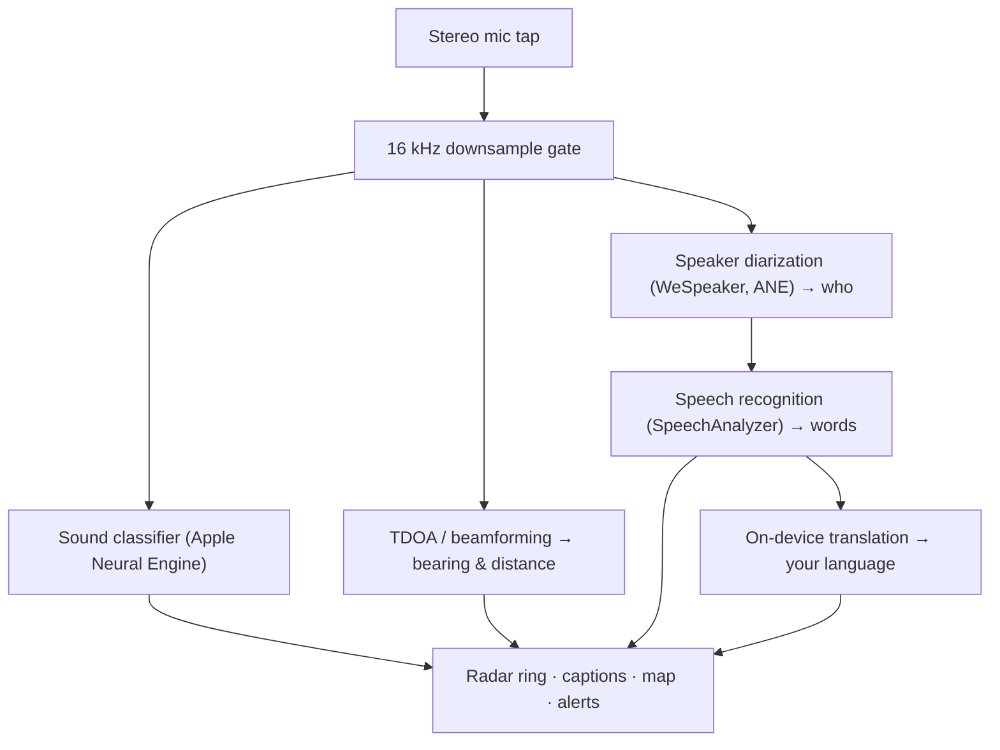

# Vigilant Ear 👂🛡️ (Edición Apple)

*Un radar acústico para personas que no pueden oír.*

¡Una app creada específicamente para la comunidad Sorda/HH! La mayoría de las apps de reconocimiento de sonido te dicen *qué* es un sonido. **Vigilant Ear te dice dónde está, quién lo produce y qué están diciendo** — convirtiendo un iPhone en un tricórdero sónico en tiempo real que describe visualmente los sonidos a tu alrededor.

La dirección y distancia de una sirena. Un golpe detrás de ti. Las personas en una conversación, representadas como voces transcritas por separado — cada una con sus propios subtítulos y ubicada direccionalmente por hablante. Si alguien habla en un idioma que no lees, sus palabras llegan **traducidas al tuyo.**

Todo se ejecuta en el dispositivo. Nada se graba, almacena en caché ni se envía a ningún lugar.

---

## Para quién es

- **Usuarios sordos y con dificultades auditivas** que desean conciencia situacional del sonido — no solo «se produjo un sonido», sino *qué, dónde, quién* y *qué se dijo.*
- Cualquiera que necesite **subtítulos en vivo con dirección y separación de hablantes**, o **traducción en el dispositivo** de amigos sentados cerca.
- Investigadores acústicos y entusiastas de la accesibilidad interesados en la localización de sonido en el dispositivo.

> Vigilant Ear es una **ayuda** de accesibilidad, no un dispositivo certificado de seguridad vital.

---

## Qué hace

### 🧭 Ve el sonido — dirección y distancia
Usando los micrófonos estéreo del iPhone, Vigilant Ear estima el **rumbo y la distancia aproximada** de los sonidos a tu alrededor y los sitúa como puntos en vivo en un anillo de radar orientado por rumbo y en un mapa. Si te mueves, los puntos mantienen su posición en el mundo real. Esto es el núcleo: conciencia espacial de un mundo que no puedes oír.

### 🚨 Reconoce sonidos importantes — y te avisa
Un clasificador en el dispositivo identifica **más de 300 sonidos cotidianos** y vigila las categorías críticas — **sirenas, alarmas, timbres/golpes, una persona cercana y clima severo.** Cuando se activa uno, recibes una clara alerta en pantalla y una **notificación push** opcional, incluso cuando la app está en segundo plano o tu teléfono está bloqueado. Desactiva todas las categorías de alertas y el motor entra en modo de hibernación completa en segundo plano para ahorrar batería.

Las alertas de clima severo provienen de fuentes públicas oficiales: la **NWS** de los Estados Unidos está integrada de forma gratuita; la red europea **MeteoGate** y la **CMA** de China forman parte de Premium. Las fuentes se limitan automáticamente a las que realmente cubren tu ubicación.

### 💬 Speaker Mode — subtítulos en vivo y direccionales *(Premium)*
Activa **Speaker Mode** y Vigilant Ear transcribe a las personas que hablan cerca de ti en **bloques de subtítulos, uno por voz.** La diarización de hablantes en el dispositivo diferencia las voces, de modo que cada persona mantiene su propio bloque e icono característico — *quién* dice *qué* — con un pequeño círculo en el anillo interior que te dirige a su posición en la sala. El hablante activo se resalta; el texto más antiguo se desplaza lentamente o cuando se necesita espacio para el nuevo texto.

### 🌐 Speaker Auto-Translate — lee un idioma que no puedes oír, en el tuyo propio *(Premium)*
Con Speaker Mode activado, cuando una persona cercana habla otro idioma, Vigilant Ear lo detecta y muestra sus subtítulos **en tu idioma**, en vivo, con la identificación del idioma de origen en la barra de título de su bloque. Toda la cadena — escuchar → separar hablantes → transcribir → traducir → mostrar — se ejecuta **completamente en el dispositivo**; el único momento de red es una descarga única de paquetes de idioma de Apple. Para una persona sorda con un amigo que habla otro idioma, esto significa leer su parte de la conversación en tiempo real **sin necesidad de conocer ni elegir ese idioma de antemano**.

### 🎵 Conciencia musical y de transmisiones *(Premium)*
**ShazamKit** identifica la música que suena a tu alrededor y muestra el título con detección automática de cambio de firma de canción. Y cuando una voz parece provenir de un televisor o radio en lugar de una persona en la sala, se etiqueta con un **📻** en lugar de confundirse con alguien presente — las palabras aún se muestran; simplemente se etiquetan honestamente.

### 🛰️ Constellation — varios iPhones, un oído compartido *(Premium)*
Con dos o más iPhones habilitados para Ultra-Wideband (la mayoría desde iPhone 11), el modo **Constellation** los empareja para que puedan detectar la posición del otro (a través de Nearby Interaction / UWB de Apple) y fusionar lo que cada uno escucha en una imagen única y mucho más precisa de dónde proviene un sonido — una especie de **sonar de apertura sintética** distribuido y pasivo. Está limitado a dispositivos con el hardware adecuado.

### 🗺️ Mapas, carreteras y predicción de trayectorias
Los rumbos de sonido se proyectan en coordenadas GPS reales y se dibujan en una vista de mapa. Los sonidos de vehículos se **ajustan a las calles cercanas** (mediante fuentes de datos de carreteras de código abierto) y se predicen sus trayectorias, de modo que un coche que pasa se lee como si se moviera *por la carretera* en lugar de desplazarse a través de edificios. (Prueba la demo del camión de bomberos para ver una vista previa.)

---

## Gratuito y Premium

El núcleo de seguridad es **gratuito, para siempre**:

- **Alertas de sonido locales** — alarmas, sirenas, timbres/golpes y una persona cercana — detectadas en el dispositivo, con avisos en pantalla y push.
- **Alertas de clima severo de NWS** para los Estados Unidos.

Un **desbloqueo Premium** único — con una prueba gratuita para comenzar, y **no una suscripción** — añade la capa completa de conciencia situacional:

- **Speaker Mode** — subtítulos en vivo, direccionales y por hablante.
- **Speaker Auto-Translate** — traducción en el dispositivo del habla cercana a tu idioma.
- **Constellation** — audición compartida entre múltiples iPhones a través de Ultra-Wideband.
- **Music ID** — reconocimiento de canciones de ShazamKit.
- **Fuentes de clima internacionales** — Europa (MeteoGate) y China (CMA).

Sea gratuito o Premium, **todo se ejecuta en el dispositivo** — el nivel solo cambia qué funciones están desbloqueadas, nunca a dónde va tu audio.

---

## Cómo funciona (bajo el capó)

Vigilant Ear es un flujo de procesamiento **local, en el dispositivo**. El audio en bruto se captura en un tap de alta prioridad, se copia y se distribuye a actores de procesamiento independientes sin bloquear jamás la interfaz de usuario:

- **Matemáticas espaciales** — las transformadas de Fourier rápidas, el Tiempo de Diferencia de Llegada y el seguimiento Doppler se ejecutan en tareas en segundo plano desvinculadas.
- **Habla** — `SpeechAnalyzer`/`SpeechTranscriber` de iOS 26 manejan la transcripción; los embeddings de **WeSpeaker** agrupan el audio en voces distintas; el marco **Translation** de Apple realiza la traducción en el dispositivo.
- **Concurrencia** — el aislamiento estricto de Swift 6 mantiene el tap del micrófono, las matemáticas acústicas y el bucle de renderizado `CADisplayLink` del mapa claramente separados, de modo que la interfaz de usuario se mantiene fluida (objetivo de 60 FPS de deslizamiento de marcadores) mientras todo lo demás se ejecuta en segundo plano.
- **Eficiencia** — la compuerta de submuestreo a 16 kHz reduce los datos que ve el clasificador en ~80 %, manteniendo la huella activa ligera y el modo «siempre escuchando» en segundo plano aún más ligero.

---

## Privacidad

- **En el dispositivo, siempre.** Toda la clasificación, las matemáticas espaciales, la transcripción, la diarización (firma/identificación de hablantes) y la traducción ocurren en tu iPhone. El audio en bruto nunca se graba, almacena en caché ni se transmite.
- **Las transcripciones son efímeras.** Los subtítulos viven en memoria durante la sesión y no se persisten ni se cargan.
- **Sin telemetría.** No se envían análisis, registros de fallos ni datos de uso a ningún servidor.

Detalles completos: [PRIVACY.md](PRIVACY.md) · [TERMS.md](TERMS.md) · [SUPPORT.md](SUPPORT.md)

---

## Hardware y plataformas

- **iPhone (experiencia completa).** Se requiere un iPhone con micrófono estéreo para la localización direccional. Se recomienda iPhone 13 o posterior.
- **iPad (solo subtítulos).** Los iPads exponen un único canal de audio, por lo que transcriben y subtitulan pero no pueden calcular la dirección — ideal para una pantalla grande estacionaria.
- **Constellation** necesita **Ultra-Wideband** — iPhone 11 o posterior, excluyendo los modelos SE y «e».

---

## Localización

Completamente localizada — interfaz, alertas y subtítulos — en **inglés, español, portugués, francés, alemán, árabe, japonés y chino simplificado** (8 idiomas). Siguen la configuración regional del sistema o se pueden elegir manualmente en la app.

---

## Estado y aviso legal

Vigilant Ear es una **ayuda experimental de accesibilidad acústica**, no una utilidad certificada de seguridad vital. La resolución de localización varía según el entorno, el clima, el viento y el hardware del micrófono. **Mantén siempre tu conciencia ambiental normal** — no te fíes de ella como única fuente de información de seguridad.

---

**Contacto:** [vigilantear@wingdingssocial.com](mailto:vigilantear@wingdingssocial.com)

Hecho con ❤️ para la comunidad S/HH y la investigación acústica.

© 2026 Wingdings, Inc. All rights reserved.
