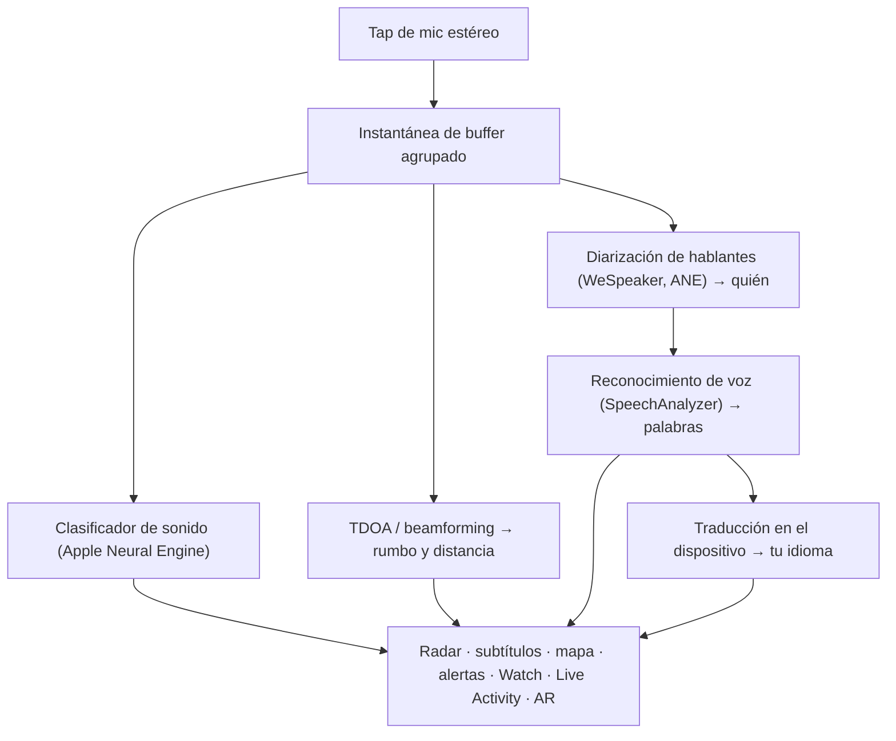

# Vigilant Ear 👂🛡️

*Un radar acústico para personas que no pueden oír.*

Una app creada específicamente para la comunidad Sorda y con dificultades auditivas. La mayoría de las apps de reconocimiento de sonido te dicen *qué* es un sonido. **Vigilant Ear te dice dónde está, quién lo produce y qué están diciendo** — convirtiendo un iPhone en un tricórdero sónico en tiempo real que describe el sonido a tu alrededor.

La dirección y distancia de una sirena. Un golpe detrás de ti. Las personas en una conversación, representadas como voces transcritas por separado — cada una subtitulada y ubicada direccionalmente. Si alguien habla un idioma que no lees, sus palabras pueden llegar **traducidas al tuyo.** Las alertas llegan a tu **pantalla de bloqueo, Dynamic Island y Apple Watch** para que un vistazo baste.

Todo lo importante se ejecuta en el dispositivo. El audio no se graba ni se sube para reconocimiento. Nada depende de oír nada.

- 🧭 **Dirección, no solo detección.** *Qué, dónde, quién* y *qué se dijo* — no solo «ocurrió un sonido».
- 🔒 **Privacidad por diseño.** La clasificación, los subtítulos y la traducción se ejecutan en tu iPhone. Los subtítulos son en vivo y efímeros; no se guardan como un archivo de transcripciones.
- ⌚ **En tu muñeca y en la pantalla de bloqueo.** El compañero de dirección de Apple Watch + Live Activity mantienen la última alerta y de qué lado vino a un solo vistazo.
- 🛰️ **Más teléfonos, un oído compartido.** Constellation vincula iPhones con Ultra-Wideband para fusionar lo que cada uno oye en una imagen direccional más nítida.
- 👁️ **Hecha para Sordos / con dificultades auditivas.** Hápticas distintivas, visuales de alto contraste, señales independientes del color, destinos táctiles grandes y respeto a Reducir movimiento en toda la app.

---

## Para quién es

- **Usuarios sordos y con dificultades auditivas** que desean conciencia situacional del sonido — Home Watch (golpe, alarma, bebé, teléfono) y Street Watch (sirena, aproximación) que puedes dejar activados y confiar en ellos.
- Cualquiera que necesite **subtítulos en vivo con dirección y separación de hablantes**, o **traducción en el dispositivo** de personas sentadas cerca.
- Usuarios de accesibilidad e investigación acústica interesados en la localización de sonido en el dispositivo.

> Vigilant Ear es una **ayuda** de accesibilidad, no un dispositivo certificado de seguridad vital.

---

## Qué hace

### 🧭 Ve el sonido — dirección y distancia
Usando los micrófonos estéreo del iPhone, Vigilant Ear estima el **rumbo y la distancia aproximada** de los sonidos a tu alrededor y los sitúa como marcadores en vivo en un anillo de radar orientado por rumbo y en un mapa. Si te mueves, los marcadores mantienen su posición en el mundo real. Esto es el núcleo: conciencia espacial de un mundo que no puedes oír.

### 🚨 Reconoce sonidos importantes — y te avisa
Un clasificador en el dispositivo identifica cientos de sonidos cotidianos y vigila las categorías críticas — **sirenas, alarmas, timbres/golpes, llanto de bebé, una persona cercana y clima severo.** Cuando se activa uno, recibes una clara alerta en pantalla, una **notificación push** opcional y una **háptica** distintiva — incluso cuando la app está en segundo plano o el teléfono está en reposo. Las categorías críticas vienen listas por defecto, de modo que activar las notificaciones no significa «todo desactivado». Desactiva todas las categorías de alertas y el motor hiberna por completo en segundo plano para ahorrar batería.

Las advertencias de clima severo provienen de fuentes CAP públicas oficiales — **NWS** de EE. UU., **MeteoGate** de Europa, **CMA** de China y **KMA** de Corea — gratuitas para todos los usuarios. Las fuentes se limitan a las que cubren tu ubicación.

### ⌚ Apple Watch + Live Activity — un vistazo y ya sabes
- **Compañero de Apple Watch** — la dirección de una alerta apunta en tu muñeca para que un vistazo te diga hacia dónde mirar. Interfaz de Watch rediseñada con el icono de oreja de la app, diseño de HUD de amenaza y doble toque para minimizar. Las alertas aún pueden mostrar la flecha de dirección cuando la app de Watch no está abierta.
- **Live Activity** — Vigilant Ear permanece en tu **pantalla de bloqueo**, en el **Dynamic Island** y en el **Smart Stack del Watch**, de modo que la última alerta y su rumbo siempre están a un solo vistazo.

### 💬 Speaker Mode — subtítulos en vivo y direccionales *(gratis)*
Activa **Speaker Mode** y Vigilant Ear transcribe a las personas que hablan cerca de ti en **bloques de subtítulos, uno por voz.** La diarización de hablantes en el dispositivo mantiene las voces distintas — *quién* dice *qué* — con una señal direccional en el anillo interior. El hablante en vivo se resalta; el texto más antiguo se desplaza a medida que se necesita espacio. Los subtítulos son gratis; la traducción automática es la capa opcional de Power Pack+.

### 🌐 Speaker Auto-Translate — tu idioma, en vivo *(Power Pack+)*
Con Speaker Mode activado, cuando una persona cercana habla otro idioma, Vigilant Ear puede detectarlo y mostrar sus subtítulos **en tu idioma**, con el idioma de origen en su bloque. La cadena — oír → separar hablantes → transcribir → traducir → mostrar — se ejecuta **en el dispositivo**; el único momento de red es una descarga única de paquetes de idioma de Apple. No tienes que conocer ni elegir el otro idioma de antemano.

### 🎵 Conciencia musical y de transmisiones *(Power Pack+)*
**ShazamKit** identifica la música que suena a tu alrededor y rastrea los cambios de canción. Cuando una voz parece provenir de un televisor o radio en lugar de una persona en la sala, se etiqueta con un **📻** — las palabras aún se muestran; se etiquetan con honestidad.

### 🛰️ Constellation — varios iPhones, un oído compartido *(Power Pack+)*
Con dos o más iPhones habilitados para Ultra-Wideband (la mayoría desde iPhone 11), **Constellation** los empareja para que puedan detectar la posición del otro y fusionar lo que cada uno oye en una imagen única y más precisa de dónde proviene un sonido — una matriz de escucha pasiva distribuida. Limitado a dispositivos con el hardware adecuado. Los subtítulos de malla anteriores al tiempo de conexión de un par no se retransmiten.

### 📷 Cámara AR — «ver el sonido» *(vista previa)*
Abre la píldora de cámara en el riel del título y fija los sonidos detectados en su rumbo real en la vista de cámara en vivo. Los marcadores se agrupan por hablante o por categoría de sonido y dirección para que la vista se mantenga legible; las fuentes se desvanecen con la edad cuando se silencian.

### 🗺️ Mapas, carreteras y predicción de trayectorias
Los rumbos de sonido se proyectan en coordenadas GPS reales en el mapa. Los sonidos de vehículos pueden **ajustarse a las calles cercanas** y predecirse sus trayectorias, de modo que un camión que pasa se lea como si se moviera *por la carretera* en lugar de a través de edificios. (Prueba la demo del camión de bomberos.)

### 🪄 Demo Mode — demuéstralo sin oídos
**Demo Mode** es público para todos: práctica de Home y Street (golpe, alarma, bebé, sirena, clima), demos multiphone y de conversación, y una clara marca de agua **DEMO:** para que la práctica nunca pretenda ser un evento en vivo. Cerrar el panel desmonta las demos de forma limpia (sin spoof de GPS atascado ni flags residuales).

### ♿ Accesibilidad primero
Creada para usuarios sordos / con dificultades auditivas y daltónicos: señales **independientes del color**, destinos táctiles de **≥44 pt**, respeto a **Reducir movimiento**, alertas multimodales (háptica + visual + Watch) y una pantalla de verificación al inicio que muestra el estado de permisos con estados claros en verde / gris / rojo (y naranja quemado «no permitido») — incluido el permiso de notificaciones que actúa como interruptor maestro de alertas.

---

## Gratis y Power Pack+

El núcleo de seguridad es **gratis, para siempre**:

- **Home Watch y Street Watch** — alertas de sonido local (alarmas, sirenas, golpes/timbres, bebé, persona cercana) con entrega en pantalla, háptica y push opcional.
- **Subtítulos en vivo** — Speaker Mode, en el dispositivo, direccional donde el hardware lo permite.
- **CAP de clima severo** — NWS, MeteoGate, CMA, KMA para tu región.
- **Demo Mode** — alertas de práctica y vistas previas de funciones con marca de agua DEMO.
- **Compañero de Apple Watch y Live Activity** — dirección y última alerta de un vistazo.

**Power Pack+** es un desbloqueo de un solo pago (**no es una suscripción**) con una **prueba gratuita de 90 días**. Añade los superpoderes:

- **Speaker Auto-Translate** — traducción en el dispositivo del habla cercana a tu idioma.
- **Constellation** — escucha compartida multiphone a través de Ultra-Wideband.
- **Music ID** — reconocimiento de canciones con ShazamKit.

Gratis o Power Pack+, **tu audio permanece en el dispositivo para el reconocimiento** — el nivel solo cambia qué funciones están desbloqueadas, nunca a dónde se envía el audio en bruto para análisis.

---

## Cómo funciona (por dentro)

Vigilant Ear es un pipeline **local-first, en el dispositivo**. El audio en bruto se captura en un tap de alta prioridad, se copia a una **lista libre de buffers agrupados** (sin thrash de alloc en la ruta en tiempo real) y se distribuye a procesadores independientes sin detener la UI ni interrumpir el streamer:

- **Matemática espacial** — FFT, diferencia temporal de llegada (Time-Difference-of-Arrival) y seguimiento Doppler en tareas en segundo plano.
- **Voz** — `SpeechAnalyzer` / `SpeechTranscriber` de iOS 26 para transcripción; embeddings de **WeSpeaker** para identidad de voz; framework de **Translation** de Apple para traducción en el dispositivo.
- **Concurrencia** — el aislamiento de Swift 6 mantiene el tap del micrófono, la matemática acústica y el bucle de renderizado de la UI limpia y separadamente.
- **Eficiencia** — el downsampling y la clasificación adaptativa a la carga mantienen la escucha continua lo bastante ligera como para dejarla activada.

---

## Privacidad

- **En el dispositivo, siempre para el pipeline principal.** La clasificación, la matemática espacial, la transcripción, la diarización y la traducción se ejecutan en tu iPhone. El audio en bruto no se graba ni se sube para reconocimiento.
- **Los subtítulos son efímeros.** Los subtítulos en vivo permanecen en memoria durante la sesión; los registros de depuración exportados no incluyen el texto de los subtítulos.
- **Sin SDKs de publicidad ni de analítica de comportamiento.** El uso limitado de red es solo para mapas, fuentes públicas de clima, huellas opcionales de Shazam, contexto de carreteras y compras de App Store — consulta la política completa.

Detalles completos: [PRIVACY.md](PRIVACY.md) · [TERMS.md](TERMS.md) · [SUPPORT.md](SUPPORT.md)

---

## Hardware y plataformas

- **iPhone (experiencia completa).** Se requieren micrófonos estéreo para la localización de dirección. Se recomienda **iPhone 13 o más reciente**.
- **Apple Watch.** Alertas compañeras con flecha de dirección; funciona con Live Activity / Smart Stack.
- **iPad (centrado en subtítulos).** Mics de un solo canal → subtítulos sin dirección completa.
- **Constellation** necesita **Ultra-Wideband** — iPhone 11 o posterior, excluyendo SE y modelos «e».
- **Android.** Compilación separada con radar principal, alertas, subtítulos y clima; la malla Constellation es iOS-first. Consulta las actualizaciones del sitio del producto a medida que crece la paridad de Android.

**Versión de marketing actual de Apple:** 1.0.7 (en progreso / pista de envío). Creada para iOS moderno (era SpeechAnalyzer).

---

## Localización

Totalmente localizada — interfaz, alertas y subtítulos — en **inglés, español, portugués (Brasil), francés, alemán, árabe, japonés, chino simplificado y coreano** (9 idiomas). Sigue la configuración regional del sistema o una elección manual en la app.

---

## Estado y descargo de responsabilidad

Vigilant Ear es una **ayuda experimental de accesibilidad acústica**, no una utilidad certificada de seguridad vital. La resolución de localización varía con el entorno, el clima, el viento y el hardware del micrófono. **Mantén siempre tu conciencia ambiental normal** — no dependas de ella como única fuente de información de seguridad.

Algunas capacidades (marcadores AR de cámara, actualización del entitlement de Critical Alerts cuando Apple lo conceda, autoría avanzada de packs de sonido multipack) siguen evolucionando; Home / Street watch gratuitos y los subtítulos en vivo son el producto en el que puedes confiar desde el primer día.

---

**Contacto:** [vigilantear@wingdingssocial.com](mailto:vigilantear@wingdingssocial.com)

Hecho con ❤️ para la comunidad D/HH y la investigación acústica.

    
  <strong>© 2026 Wingdings, Inc.</strong> 
  All rights reserved. 
  Patent Pending

