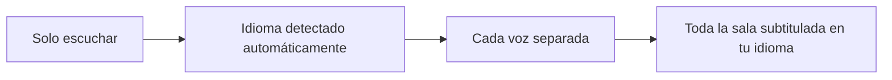
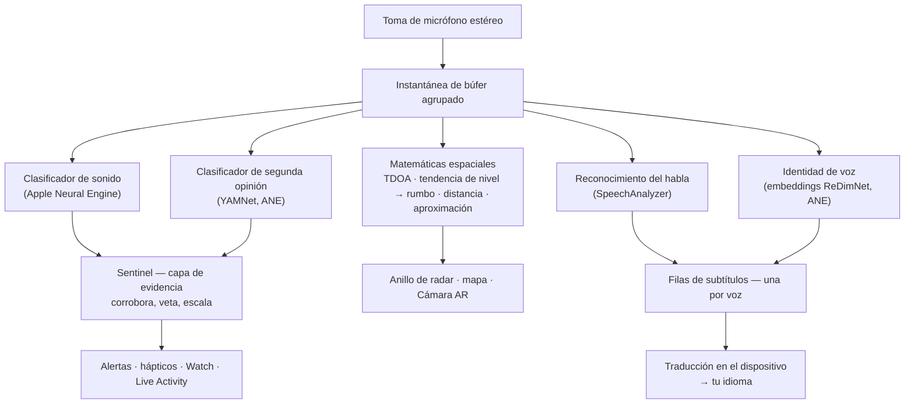
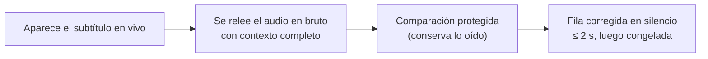
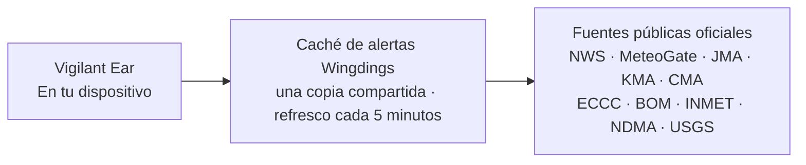

# Vigilant Ear 👂🛡️

*Vigente desde la versión 1.1.3 · septiembre de 2026.*

## Un radar acústico para quienes no pueden oír.

Una app hecha específicamente para la comunidad Sorda, con dificultad auditiva y CODA. La mayoría de las apps de reconocimiento de sonido te dicen *qué* es un sonido. **Vigilant Ear te dice dónde está, quién lo produce y qué están diciendo** — convierte un iPhone en un tricorder sónico en tiempo real que describe el sonido a tu alrededor.

La dirección y la distancia de una sirena. Un golpe detrás de ti. Las personas en una conversación, dibujadas como voces transcritas por separado — cada una subtitulada y colocada en su dirección. Si alguien habla un idioma que no lees, sus palabras pueden llegar **traducidas al tuyo.** Las alertas alcanzan tu **Pantalla de bloqueo, Dynamic Island y Apple Watch**, así que basta un vistazo.

Todo lo que importa corre en el dispositivo. El audio no se graba ni se sube para el reconocimiento. Nada depende de oír nada.

- 🧭 **Dirección, no solo detección.** *Qué, dónde, quién* y *qué se dijo* — no simplemente “ocurrió un sonido”.
- 🔒 **Privado por diseño.** La clasificación, los subtítulos y la traducción corren en tu iPhone. Los subtítulos son en vivo y efímeros; no se guardan como archivo de transcripción.
- ⌚ **En tu muñeca y en la Pantalla de bloqueo.** El compañero de dirección del Apple Watch + Live Activity mantienen la última alerta y de dónde vino a un solo vistazo.
- 🛰️ **Más teléfonos, un oído compartido.** Constellation vincula iPhones con Ultra-Wideband para fusionar lo que cada uno oye en una imagen direccional más nítida.
- 👁️ **Hecho para Sordos / HoH / CODA.** Hápticos distintivos, visuales de alto contraste, señales independientes del color, grandes zonas táctiles y respeto a Reduce Motion en todo momento.

---

## Para quién es

- **Usuarios Sordos, con dificultad auditiva y CODA** que quieren conciencia situacional del sonido — Vigilancia en casa (golpe, alarma, bebé, teléfono) y Vigilancia en la calle (sirena, aproximación) que puedes dejar encendidas y confiar.
- Quien necesite **subtítulos en vivo con dirección y separación de hablantes**, o **traducción en el dispositivo** de las personas sentadas cerca.
- Usuarios de accesibilidad e investigación acústica interesados en la localización de sonido en el dispositivo.

> Vigilant Ear es una **ayuda** de accesibilidad, no un dispositivo certificado de seguridad vital.

---

## Lo que hace

### 🧭 Ve el sonido — dirección y distancia
Con los dos micrófonos del iPhone, Vigilant Ear mide el **ángulo de un sonido y si está delante o detrás de ti**, mantiene esa lectura estable hasta cerca de un grado y la coloca como marcador en vivo en un anillo de radar orientado al rumbo y en un mapa. Dos micrófonos en una sola línea no pueden distinguir izquierda de derecha por sí solos — un sonido a 50° a tu derecha y otro a 50° a tu izquierda llegan con el mismo mínimo desfase — así que la app dibuja la lectura más un **fantasma más tenue al otro lado**, y un giro de muñeca o un segundo teléfono lo resuelve. La distancia se estima a partir del volumen según una curva calibrada en la calle y se muestra como lo que es: una estimación, *≈ 50 ft*, con un rango probable. Muévete y los marcadores mantienen su posición en el mundo real. Este es el núcleo: conciencia espacial de un mundo que no puedes oír. (Cifras más abajo.)

### 🚨 Reconoce sonidos importantes — y te avisa
Un clasificador en el dispositivo identifica cientos de sonidos cotidianos y vigila las categorías críticas — **sirenas, alarmas — incluida una clase dedicada de alarma de coche —, timbres/golpes, llanto de bebé, una persona cercana y clima severo.** Cuando una se dispara, recibes una alerta clara en pantalla, una **notificación push** opcional y un **háptico** distintivo — incluso con la app en segundo plano o el teléfono dormido. Las categorías críticas vienen listas por defecto, así que activar las notificaciones no significa “todo apagado”. Si apagas todas las categorías de alerta, el motor hiberna por completo en segundo plano para ahorrar batería. Una capa **Sentinel** contrasta las alertas con evidencia independiente — dirección, movimiento y fuentes públicas — para que lo que se dispare esté corroborado, no sea la conjetura de un solo clasificador. Funciona en ambos sentidos: un momento con forma de sirena dentro de una canción se retiene, pero una sirena real que se repite a través de tu música atraviesa y alerta.

Las advertencias de clima severo vienen de fuentes públicas oficiales — **NWS** de EE. UU., **MeteoGate** de Europa, **CMA** de China, **KMA** de Corea, **JMA** de Japón, **ECCC** de Canadá, **BOM** de Australia, **INMET** de Brasil e **NDMA** de India — gratuitas para todos. Las fuentes se limitan a las que cubren dónde estás. En Japón la app también lee los **boletines anticipados** de la JMA — avisos en lenguaje claro emitidos días antes de un tifón o lluvia intensa, no solo las advertencias cuando el peligro ya llegó — además de los boletines de chaparrón súbito y deslizamiento. Los avisos anticipados se muestran con discreción, sin el sonido y la vibración reservados para una advertencia real.

### ⌚ Apple Watch + Live Activity — un vistazo y lo sabes
- **Compañero de Apple Watch** — la dirección de una alerta apunta en tu muñeca para que un vistazo te diga hacia dónde mirar. Interfaz del Watch rediseñada con el icono de oreja de la app, layout de HUD de amenazas y doble toque para descartar una alerta. Las alertas pueden seguir mostrando la flecha de dirección cuando la app del Watch no está abierta.
- **Live Activity** — Vigilant Ear permanece en tu **Pantalla de bloqueo**, en el **Dynamic Island** y en el **Smart Stack del Watch**, así que la última alerta y su rumbo están siempre a un vistazo.
- **Alertas de compañeros en tu muñeca** — cuando el teléfono de un compañero vinculado de Constellation emite una alerta, también puede llegar a tu Watch, con la dirección incluida. Un pase de fiabilidad mantiene el compañero ligero en la batería del Watch todo el día.

### 💬 Modo Hablante — subtítulos en vivo y direccionales *(gratis)*
Activa el **Modo Hablante** (Speaker Mode) y Vigilant Ear transcribe a las personas que hablan cerca de ti en **bloques de subtítulos, uno por voz.** La diarización de hablantes en el dispositivo mantiene las voces distintas — *quién* dice *qué* — con una señal direccional en el anillo interior. El hablante en vivo se resalta; el texto más antiguo se desplaza cuando hace falta espacio.

Dos cosas que la mayoría de las apps de subtítulos no hacen: **honestidad sobre la confianza** — una marca sutil de calidad por fila y subrayados punteados bajo palabras dudosas te dicen cuándo confiar en una línea y cuándo verificarla — y **autocorrección**: justo después de que aterriza una frase, la app relee el audio con contexto completo y puede restaurar una palabra omitida o mal oída en un par de segundos; luego el texto se congela.

Los subtítulos son gratis; la traducción automática es la capa opcional de Power Pack+. Los subtítulos también pueden **leerse en voz alta en tus dispositivos auditivos Bluetooth** — gratis, en Preferencias. Los **Tonos de dirección** (también gratis, en Preferencias → Subtítulos) añaden una señal de audio opcional en el oído que elijas para indicar dónde está un hablante — útil con audífono o audición unilateral, y disponible para cualquiera.

### 🌐 Speaker Auto-Translate — tu idioma, en vivo *(Power Pack+)*
Con el Modo Hablante activado, cuando alguien cercano habla otro idioma, Vigilant Ear puede detectarlo y mostrar sus subtítulos **en tu idioma**, con el idioma de origen en su bloque. La cadena — oír → separar hablantes → transcribir → traducir → mostrar — corre **en el dispositivo**; el único momento de red es una descarga única del paquete de idioma desde Apple. No tienes que conocer ni elegir primero el otro idioma.

Es lo más cercano que hay al **traductor universal de la ciencia ficción** — el aparato que simplemente entiende. Vigilant Ear detecta el idioma por sí solo, sigue a cada hablante en la sala y los subtitula a todos en tu idioma — sin auriculares, sin configuración, en tu dispositivo.

```mermaid
graph LR
    A["Solo escuchar"] --> B["Idioma detectado automáticamente"] --> C["Cada voz separada"] --> D["Toda la sala subtitulada en tu idioma"]
```

### 🎵 Conciencia de música y emisiones *(Power Pack+)*
**ShazamKit** identifica la música que suena a tu alrededor y sigue los cambios de canción.

### 🎛️ Acoustic Scope — ve el sonido como un ingeniero
Una vista profesional en vivo del sonido a tu alrededor: espectro, espectrograma, bandas RTA de ⅓ de octava, croma y parciales armónicos — **gratis para todos**. Las herramientas que capturan sonidos para entrenar tus propios paquetes personalizados forman parte de Power Pack+.

### 📦 Paquetes de sonido personalizados — enséñale tu mundo *(Power Pack+)*
Enséñale a Vigilant Ear los sonidos que te importan — desde aves locales hasta el timbre de la puerta de tu edificio. Los paquetes adicionales se apilan sobre la detección integrada, así que los sonidos nuevos nunca desplazan a sirenas y alarmas. Hay una guía paso a paso integrada en la app.

### 🛰️ Constellation — muchos iPhones, un oído compartido *(Power Pack+)*
Con dos o más iPhones con Ultra-Wideband (la mayoría desde el iPhone 11), **Constellation** los empareja para que puedan sentir la posición del otro y fusionar lo que cada uno oye en una imagen única y más precisa de de dónde viene un sonido — una matriz de escucha pasiva distribuida. Los subtítulos también se fusionan: cada teléfono transcribe lo que oye su propio micrófono, y las palabras se alinean entre teléfonos para que el más cercano a un hablante aporte lo que escuchó — las palabras que solo un teléfono captó se conservan en lugar de perderse. Los teléfonos se conectan **directamente entre sí** — sin router, sin red Wi-Fi compartida y sin internet; basta con tener el Wi-Fi encendido, sobre el mismo enlace de igual a igual que usa AirDrop. Limitado a dispositivos con el hardware adecuado. Los subtítulos de malla anteriores al momento de conexión de un compañero no se retransmiten.

**Mensajes entre compañeros** — envía un texto rápido al teléfono de un compañero vinculado; aterriza en su feed de subtítulos y puede llegar traducido a su idioma, en el dispositivo. La mensajería tiene en cuenta la edad: basada en el Rango de edad declarado de Apple, los mensajes entre un adulto y un menor permanecen desactivados a menos que ambas personas se hayan nombrado deliberadamente. Las alertas y los subtítulos nunca se restringen — solo los mensajes de persona a persona.

### 🔗 Remote Link — llega a alguien que no está contigo *(Power Pack+ para empezar)*
Lo que normalmente haría una llamada de teléfono, pero con vídeo y texto. Envías un código de invitación; la otra persona se une desde dentro de Vigilant Ear **sin tener Power Pack+**. A diferencia de Constellation, no hace falta proximidad — pueden estar en cualquier lugar.

**En ningún momento se usa audio.** Solo vídeo y texto, así que nada del enlace depende de oír en ninguno de los extremos — y te da una forma de hablar en señas con alguien a través de la app. La app en sí no entiende lengua de señas; transporta el vídeo y el resto lo hacen ustedes dos. La conexión es directa entre los dos teléfonos donde la red lo permite, y la app te muestra con claridad si es **Direct** o **Relayed**, para que siempre sepas si tu vídeo pasa por un relevo.

### 📷 Cámara AR — “ve el sonido”
Abre la píldora de la cámara en el riel del título y fija los sonidos detectados en su rumbo real en la vista de cámara en vivo. Los marcadores se agrupan por hablante o por categoría de sonido y dirección para que la vista siga legible; las fuentes se desvanecen con el tiempo cuando se callan.

### 🗺️ Mapas, calles y predicción de rutas
Los rumbos del sonido se proyectan sobre coordenadas GPS reales en el mapa. Los sonidos de vehículos pueden **ajustarse a calles cercanas** y predecir sus trayectorias para que un camión que pasa se lea como moviéndose *a lo largo de la carretera* y no a través de edificios. (Prueba la demo del camión de bomberos.)

### 🪄 Feature Playground — demuéstralo sin oídos
**Feature Playground** es público para todos: práctica de Casa y Calle (golpe, alarma, bebé, sirena, clima), demos multi-teléfono y de conversación, y una marca de agua clara para que la práctica nunca finja ser un evento en vivo. Cerrar el panel desarma las demos limpiamente (sin GPS falso atascado, sin banderas sobrantes).

### ♿ Accesibilidad primero
Hecho para usuarios Sordos / con dificultad auditiva / CODA y daltónicos: señales **independientes del color**, zonas táctiles **≥44 pt**, respeto a **Reduce Motion**, alertas multimodales (háptico + visual + Watch) y una pantalla de verificación al inicio que muestra el estado de los permisos con estados claros en verde / gris / rojo (y “no permitido” en naranja quemado) — incluido el permiso de notificaciones que actúa como interruptor maestro de alertas.

---

## Gratis y Power Pack+

El núcleo de seguridad es **gratis, para siempre**:

- **Vigilancia en casa y Vigilancia en la calle** — alertas locales de sonido (alarmas, sirenas, golpes/timbres, bebé, persona cercana) con entrega en pantalla, háptica y push opcional.
- **Subtítulos en vivo** — Modo Hablante, en el dispositivo, direccionales donde el hardware lo permita, con marcas honestas de confianza, autocorrección de ~2 segundos, salida hablada opcional a dispositivos auditivos Bluetooth y Tonos de dirección.
- **Vigilancia permanente** — la condición propia de la sala, siempre activa y sin nada que configurar: una lámpara cian fija mientras la sala mantiene su patrón, ámbar cuando algo cambia — una voz nueva, un silencio súbito o algo que se acerca.
- **Alertas de clima severo** — NWS, MeteoGate (Europa — servido fresco desde nuestra caché de alertas de 5 minutos), CMA, KMA, JMA (Japón), ECCC (Canadá), BOM (Australia), INMET (Brasil) y NDMA (India) para tu región.
- **Alertas de terremoto (USGS, mundial)** — siente una vibración y ve en el mapa la zona que lo sintió cuando se informa un temblor cercano. Una confirmación del feed oficial del USGS — no una alerta temprana: si sentiste el temblor, esto te dice qué fue. La detección en el dispositivo de retumbos profundos (infrasonido) puede armar la comprobación en cuanto el suelo se mueve.
- **Feature Playground** — alertas de práctica y vistas previas de funciones con una marca de agua PREVIEW clara.
- **Compañero de Apple Watch y Live Activity** — dirección y última alerta de un vistazo.
- **Acoustic Scope** — visualización de sonido en vivo de nivel profesional, gratis para todos. (Las herramientas de captura para entrenamiento son Power Pack+.)

**Power Pack+** es un desbloqueo único (**no una suscripción**) con una **prueba gratuita de 90 días**. Añade los superpoderes:

- **Speaker Auto-Translate** — traducción en el dispositivo del habla cercana a tu idioma.
- **Constellation** — audición compartida entre varios iPhone por Ultra-Wideband, con mensajes entre compañeros.
- **Music ID** — reconocimiento de canciones con ShazamKit.
- **Paquetes de sonido personalizados** — clasificadores adicionales que entrenas para tus propios sonidos.

Gratis o Power Pack+, **tu audio se queda en el dispositivo para el reconocimiento** — el nivel solo cambia qué funciones están desbloqueadas, nunca a dónde se envía el audio en bruto para analizarlo.

---

## Cómo funciona (bajo el capó)

Vigilant Ear es un pipeline **local primero, en el dispositivo**, construido por capas: captura una vez y deja que especialistas independientes lean el mismo sonido y se revisen entre sí. El audio en bruto se captura en una toma de alta prioridad, se copia a una **lista libre de búferes agrupados** (sin rachas de asignación en la ruta en tiempo real) y se reparte sin bloquear la interfaz:

```mermaid
graph TD
    A["Toma de micrófono estéreo"] --> B["Instantánea de búfer agrupado"]
    B --> C["Clasificador de sonido<br/>(Apple Neural Engine)"]
    B --> Y["Clasificador de segunda opinión<br/>(YAMNet, ANE)"]
    C --> S["Sentinel — capa de evidencia<br/>corrobora, veta, escala"]
    Y --> S
    S --> H["Alertas · hápticos · Watch · Live Activity"]
    B --> D["Matemáticas espaciales<br/>TDOA · tendencia de nivel → rumbo · distancia · aproximación"]
    D --> R["Anillo de radar · mapa · Cámara AR"]
    B --> F["Reconocimiento del habla<br/>(SpeechAnalyzer)"]
    B --> E["Identidad de voz<br/>(embeddings ReDimNet, ANE)"]
    F --> G["Filas de subtítulos — una por voz"]
    E --> G
    G --> T["Traducción en el dispositivo<br/>→ tu idioma"]
```

Ningún modelo se confía solo. La capa **Sentinel** se sitúa entre la detección y la alerta: motores independientes se corroboran o se vetan fotograma a fotograma — y cuando se acumula evidencia real repetida contra un veto (una sirena real aullando a través de tu música), gana la evidencia y salta la alerta.

Los subtítulos tienen su propia segunda oportunidad. Cada frase finalizada se relee en silencio desde un anillo corto de audio en memoria con contexto completo — las correcciones llegan en unos dos segundos y luego el texto se congela para siempre:

```mermaid
graph LR
    L["Aparece el subtítulo en vivo"] --> K["Se relee el audio en bruto<br/>con contexto completo"] --> V["Comparación protegida<br/>(conserva lo oído)"] --> W["Fila corregida en silencio<br/>≤ 2 s, luego congelada"]
```

- **Matemáticas espaciales** — FFT, diferencia de tiempo de llegada ponderada por coherencia (TDOA — favorece las bandas de frecuencia en las que ambos micrófonos coinciden y convierte el mínimo desfase de llegada en un rumbo) y seguimiento de aproximación por tendencia de nivel en tareas de fondo. El par de micrófonos se lee en una orientación fija para que la dirección funcione igual si sostienes el teléfono en vertical o de lado.
- **Habla** — `SpeechAnalyzer` / `SpeechTranscriber` de iOS 26 para la transcripción; embeddings de hablante **ReDimNet** para la identidad de voz; framework **Translation** de Apple para la traducción en el dispositivo. La identidad de voz se basa en evidencia: una voz solo se confirma como persona real a partir de ventanas independientes de sonido, y una coincidencia incierta se muestra sin atribuir en lugar de adivinar el nombre equivocado.
- **Verdad musical** — un **detector de firma de canción** por croma decide “¿hay música de verdad?”, porque los clasificadores generales suelen llamar “música” a salas silenciosas y a sirenas. Shazam solo corre cuando la firma coincide en que algo musical está ahí.
- **Concurrencia** — el aislamiento de Swift 6 mantiene limpia la separación entre la toma del micrófono, las matemáticas acústicas y el bucle de renderizado de la UI.
- **Eficiencia** — downsampling, clasificación adaptable a la carga y uso de red acotado por evidencia mantienen la escucha continua lo bastante ligera como para dejarla encendida.

El clima toma el camino opuesto al audio — nada de tu sonido sale nunca, pero *entran* datos de alerta. **Todas** las fuentes oficiales pasan por una pequeña caché que operamos nosotros, así que una sola descarga de los datos públicos sirve a todos los usuarios — y tu teléfono nunca contacta servidores de un gobierno extranjero:

```mermaid
graph LR
    P1["Vigilant Ear<br/>En tu dispositivo"] --> W["Caché de alertas Wingdings<br/>una copia compartida · refresco cada 5 minutos"]
    W --> N["Fuentes públicas oficiales<br/>NWS · MeteoGate · JMA · KMA · CMA<br/>ECCC · BOM · INMET · NDMA · USGS"]
```

---

## Lo que puede oír tu teléfono — medido

Tu iPhone tiene dos micrófonos a unos quince centímetros (unas seis pulgadas), un barómetro y un reloj muy bueno. Eso basta para decirte hacia dónde va un sonido, aproximadamente a qué distancia, si se acerca y si acaba de abrirse una puerta. Aquí va cuán preciso es cada uno, cómo lo comprobamos y por qué importa si no puedes oír el sonido tú mismo. La dirección y las cifras relacionadas se midieron en un iPhone 17 y un iPhone 16 Pro Max en septiembre de 2026. La distancia sigue siendo una estimación por naturaleza — y así lo decimos en pantalla.

**Dirección — hasta un par de grados.** Un sonido llega al micrófono superior antes que al inferior, o después, y a partir de ese desfase la app calcula cuánto se aparta del eje del teléfono y si está delante o detrás. Los dos canales del teléfono no son micrófonos planos, sino una imagen estéreo procesada, y esa imagen añade un patrón fijo propio cuando la habitación es ruidosa. La app ahora aprende ese patrón en unos segundos de silencio tras el arranque y lo elimina antes de leer la dirección.

| Qué medimos | Resultado |
|---|---|
| Error mediano en 96 salas simuladas, de oficina silenciosa a sala de paredes duras a 5 dB SNR | 1,0° |
| iPhone 17 en un escritorio, ruido de sala, altavoz a 30° del eje | leyó 61,7° desde el plano lateral frente a 60° esperados, oscilación 1,6° |
| Igual, altavoz justo al lado del teléfono | leyó 4,5° frente a 0° esperados, oscilación 2,2° |
| Igual, altavoz justo delante | cada lectura en el retardo máximo, como debe ser |
| Lecturas que caen en el patrón propio de la imagen en vez del sonido | ninguna, en ningún ángulo |

*Por qué importa:* si no puedes oír una sirena, “detrás de ti, un poco a un lado” te dice hacia dónde mirar. Una lectura que se mantiene estable solo merece confianza cuando se ha contrastado con una cinta métrica, y esta lo fue, dos veces; la segunda después de que la primera resultara demasiado indulgente.

**Distancia — mostrada como la estimación que es.** Un solo micrófono no mide distancia, solo volumen, y un camión fuerte lejos puede sonar como un coche suave cerca. La app estima la distancia a partir del volumen con una curva ajustada en una calle real y lo dice como lo diría alguien cuidadoso: *unos 50 ft, probablemente entre 25 y 100.*

| Qué medimos | Resultado |
|---|---|
| Detecciones reales de coches reproducidas por la calibración | 1.131 |
| Dentro de la carretera de 100 pies en la que estaban de verdad | 73 % |
| Coches del carril lejano | estimados 78 y 87 ft donde la cinta decía 73 y 85 ft |

La carretera (un cruce urbano) se midió carril a carril; cuando la curva se equivoca, se equivoca del lado cercano. La calibración está bloqueada por un test automatizado para que no derive en silencio. Las alarmas dentro de tu propio espacio, como un detector de humo, no reciben cifra de distancia — ya están en la habitación contigo.

**Movimiento — acercándose a ti.** En coches y sirenas, subir de volumen suele significar acercarse. La app observa cuán rápido sube el nivel de un sonido durante unos segundos: una subida sostenida de unos 1,5 dB por segundo (un aumento claro y constante de volumen) significa aproximación, una bajada equivalente significa alejamiento, y un sonido que deja de cambiar deja de llamarse una u otra cosa tras unos cuatro segundos. Un solo momento fuerte — un toque de claxon, un portazo — no puede dispararlo. Basado en física y nueve tests automatizados; un paso de calle grabado es la siguiente confirmación de campo.

**El aire de la habitación — una puerta tiene firma.** El barómetro puede notar una puerta que se abre a unos cuatro metros y medio (unos catorce pies): la presión baja al abrirse y rebota al cerrarse. En catorce horas de silencio y quince eventos de puerta, cada puerta hizo esa forma de dos partes y nada más en la casa lo hizo.

| Evento | Ritmo de presión | Forma |
|---|---|---|
| Puerta principal, abierta y cerrada, ×10 | 0,6–1,8 Pa/s | bajada y luego rebote, ~5 s de separación |
| Puerta principal, de golpe, ×5 | 1,1–2,5 Pa/s | el mismo par, más alto |
| Aire acondicionado ciclando de noche, ×8 | 0,11–0,46 Pa/s | rampa lenta en minutos, idéntica en ambos teléfonos |
| Una habitación en silencio | ~0,02 Pa/s | nada |
| Pasar caminando, estornudar | — | el sensor de movimiento lo nota y el teléfono lo ignora |

Una puerta de pantalla, que no sella la habitación, fue invisible — exactamente como debe ser. Hoy un cambio de presión puede mostrarse como retumbos profundos en el mapa; una alerta dedicada de puerta en noche tranquila está medida y diseñada, y aún no es el valor por defecto cotidiano.

**Constellation — dos teléfonos resuelven el lado.** Cada teléfono en la malla traza una línea hacia el sonido desde donde está, y las líneas solo se cruzan con claridad en un lado. Cuando lo hacen, el fantasma desaparece y la app puede volver a decir izquierda o derecha. En simulación, dos teléfonos a **40 metros** colocan una sirena a 50 metros con un error de unos 2 metros.

**Cómo se cree aquí cualquier cifra.** Cada número pasó por las mismas tres puertas, en orden: una sala simulada con la respuesta conocida de antemano; pequeños tests automatizados que recrean el caso exacto que engañaría a la app y corren en cada cambio; luego los teléfonos reales en un escritorio real con distancias medidas a mano. Nada cuenta como preciso hasta sobrevivir a la tercera. Para quien no puede oír el sonido, la palabra de la app es la única — debe ganársela como lo hace un laboratorio.

Notas más profundas para ingenieros: [Physics](https://vigilantear.com/en/physics/) — TDOA, distancia, movimiento, Constellation y detección barométrica, con cada cifra etiquetada MEASURED / BENCHED / MODELLED.

---

## Privacidad

- **En el dispositivo, siempre para el pipeline principal.** La clasificación, las matemáticas espaciales, la transcripción, la diarización y la traducción corren en tu iPhone. El audio en bruto no se graba ni se sube para el reconocimiento.
- **Los subtítulos son efímeros.** Los subtítulos en vivo permanecen en memoria durante la sesión; los registros de depuración exportados no incluyen el texto de los subtítulos.
- **Sin SDK de publicidad ni de analítica de comportamiento.** El uso limitado de red es solo para mapas, fuentes públicas de clima, firmas opcionales de Shazam, contexto de carreteras y compras en la App Store — consulta la política completa.

Detalles completos: [PRIVACY.md](PRIVACY.md) · [TERMS.md](TERMS.md) · [SUPPORT.md](SUPPORT.md)

---

## Hardware y plataformas

- **iPhone (experiencia completa).** Funciona en vertical o horizontal — sosténlo como quieras. Se necesitan micrófonos estéreo para localizar la dirección. Se recomienda **iPhone 13 o más reciente**.
- **Apple Watch.** Alertas compañeras con flecha de dirección; funciona con Live Activity / Smart Stack.
- **iPad (nativo).** Diseño adaptable: en la pantalla grande, los subtítulos en vivo tienen un panel translúcido junto al mapa que se oculta cuando nadie habla. Micrófonos de un solo canal → subtítulos sin dirección completa.
- **Constellation** necesita **Ultra-Wideband** — iPhone 11 o posterior, excluyendo SE y modelos “e”. **No** necesita una red Wi-Fi: con el Wi-Fi encendido, los teléfonos se descubren directamente, así que Constellation funciona sin router y sin internet mientras los teléfonos estén cerca.
- **Android.** Compilación aparte con radar central, alertas, subtítulos y clima; la malla Constellation es primero en iOS. Consulta las actualizaciones del sitio del producto a medida que crezca la paridad con Android.

---

## Localización

Totalmente localizado — interfaz, alertas y subtítulos — al **inglés, español, portugués (Brasil), francés, alemán, italiano, árabe, japonés, chino simplificado, coreano, ruso e hindi** (12 idiomas). Sigue la configuración regional del sistema o una elección manual en la app.

---

## Estado y descargo de responsabilidad

Vigilant Ear es una **ayuda experimental de accesibilidad acústica**, no una utilidad certificada de seguridad vital. La resolución de localización varía con el entorno, el clima, el viento y el hardware del micrófono. **Mantén siempre tu conciencia ambiental habitual** — no confíes en ella como tu única fuente de información de seguridad.

Algunas capacidades (marcadores de cámara AR, mejora del entitlement de Alertas críticas cuando Apple lo conceda, creación avanzada de sonido multipaquete) siguen evolucionando; la vigilancia gratuita de Casa / Calle y los subtítulos en vivo son el producto en el que puedes confiar desde el primer día.

---

**Contacto:** [vigilantear@wingdingssocial.com](mailto:vigilantear@wingdingssocial.com)

Hecho con ❤️ para la comunidad Sorda / con dificultad auditiva y la investigación acústica.

    
  <strong>© 2026 Wingdings, Inc.</strong> 
  Todos los derechos reservados. 
  Patente pendiente

