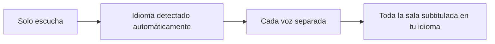
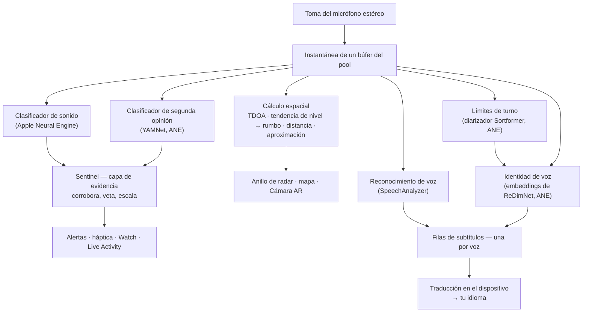
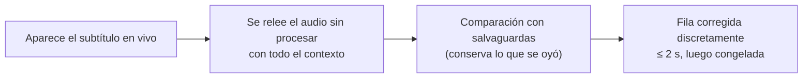
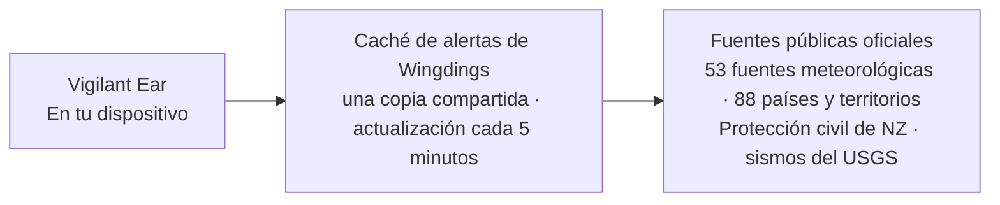

# Vigilant Ear 👂🛡️

*Vigente a partir de la versión 1.1.9 · septiembre de 2026.*

## Un radar acústico para quienes no pueden oír.

Una app creada específicamente para la comunidad Sorda, con pérdida auditiva y CODA. La mayoría de las apps de reconocimiento de sonido te dicen *qué* es un sonido. **Vigilant Ear te dice dónde está, quién lo produce y qué está diciendo** — y convierte un iPhone en un tricorder sónico en tiempo real que describe el sonido que te rodea.

La dirección y la distancia de una sirena. Un golpe a tu espalda. Las personas de una conversación, representadas como voces transcritas por separado — cada una subtitulada y situada según su dirección. Si alguien habla un idioma que no lees, sus palabras pueden llegarte **traducidas al tuyo.** Las alertas llegan a tu **pantalla de bloqueo, Dynamic Island y Apple Watch**, así que basta con un vistazo.

Todo lo importante se ejecuta en el dispositivo. El audio no se graba ni se sube para el reconocimiento. Nada depende de oír nada.

- 🧭 **Dirección, no solo detección.** *Qué, dónde, quién* y *qué se dijo* — no simplemente «hubo un sonido».
- 📣 **Nombre llamado.** Añade tu nombre, el de un niño, el de tu pareja — «pedido para Marie listo» da un toque en el reloj e indica hacia dónde.
- 🔒 **Privado por diseño.** La clasificación, la subtitulación y la traducción se ejecutan en tu iPhone. Los subtítulos son en vivo y efímeros; no se guardan como un archivo de transcripciones.
- ⌚ **En tu muñeca y en la pantalla de bloqueo.** La app complementaria de dirección para Apple Watch + Live Activity mantienen la última alerta, y de dónde vino, a un solo vistazo.
- 🛰️ **Más teléfonos, un oído compartido.** Constellation enlaza varios iPhone con Ultra-Wideband para fusionar lo que oye cada uno en una imagen direccional más nítida.
- 👁️ **Hecho para personas Sordas / con pérdida auditiva / CODA.** Respuestas hápticas distintivas, elementos visuales de alto contraste, señales que no dependen del color, áreas táctiles grandes y respeto por Reducir movimiento en toda la app.

---

## Para quién es

- **Personas Sordas, con pérdida auditiva y CODA** que quieren conciencia situacional del sonido — Home Watch (golpe, alarma, bebé, teléfono) y Street Watch (sirena, aproximación), que puedes dejar activados y en los que puedes confiar.
- Cualquiera que necesite **subtítulos en vivo con dirección y separación de hablantes**, o **traducción en el dispositivo** de las personas sentadas cerca.
- Usuarios del ámbito de la accesibilidad y de la investigación acústica interesados en la localización de sonidos en el dispositivo.

> Vigilant Ear es una **ayuda** de accesibilidad, no un dispositivo certificado para proteger vidas.

---

## Qué hace

### 🧭 Ve el sonido — dirección y distancia
Con los dos micrófonos del iPhone, Vigilant Ear mide el **ángulo de un sonido y si está delante o detrás de ti**, mantiene esa lectura estable con un margen de alrededor de un grado y la sitúa como un marcador en vivo en un anillo de radar orientado según tu rumbo y en el mapa. Dos micrófonos en una misma línea no pueden distinguir por sí solos la izquierda de la derecha — un sonido a 50° a tu derecha y otro a 50° a tu izquierda llegan con la misma diminuta diferencia de tiempo —, así que la app dibuja la lectura más un **fantasma más tenue en el lado opuesto**, y un giro de muñeca o un segundo teléfono lo resuelve. La distancia se estima a partir del volumen con una curva calibrada en la calle y se muestra como la estimación que es: *≈ 50 ft*, con un rango probable — en las unidades del país en el que estás, no en las del idioma en que lees la app. Si te mueves, los marcadores mantienen su posición en el mundo real. Este es el núcleo: conciencia espacial de un mundo que no puedes oír. (Cifras más abajo.)

### 🚨 Reconoce los sonidos importantes — y te avisa
Un clasificador en el dispositivo identifica cientos de sonidos cotidianos y vigila las categorías críticas — **sirenas, alarmas — incluida una clase específica para alarmas de auto —, timbres/golpes, llanto de bebé, una persona cercana y clima severo.** Cuando una se dispara, recibes una alerta clara en pantalla, una **notificación push** opcional y una **respuesta háptica** distintiva — incluso con la app en segundo plano o el teléfono en reposo. Las categorías críticas vienen activadas de forma predeterminada, así que habilitar las notificaciones no significa «todo apagado». Si desactivas todas las categorías de alerta, el motor hiberna por completo en segundo plano para ahorrar batería. Una capa **Sentinel** contrasta las alertas con evidencia independiente — dirección, movimiento y fuentes públicas —, de modo que lo que se dispara está corroborado y no es la conjetura aislada de un clasificador. Funciona en ambos sentidos: un momento con forma de sirena dentro de una canción queda retenido, pero una sirena real que se repite por encima de tu música se abre paso y te alerta.

Las advertencias de clima severo proceden de **53 fuentes gubernamentales oficiales en 88 países y territorios** — gratis para todos los usuarios. También se incluyen las alertas de protección civil de Nueva Zelanda, con su propio interruptor **Alertas de emergencia**. Las fuentes cuyas licencias piden reconocimiento aparecen en «Créditos de datos», al final de esta página. Las fuentes se limitan a las que cubren el lugar donde estás. En Japón, la app también lee los **boletines anticipados** de la JMA — los avisos en lenguaje sencillo que se emiten días antes de un tifón o de lluvias intensas, no solo las advertencias que se emiten cuando el peligro ya ha llegado —, además de los boletines de aguaceros repentinos y de deslizamientos de tierra. Los avisos anticipados se muestran de forma discreta, sin el sonido ni la vibración reservados para una advertencia real.

### ⌚ Apple Watch + Live Activity — un vistazo y lo sabes
- **App complementaria para Apple Watch** — la dirección de una alerta se señala en tu muñeca, así que un vistazo te dice hacia dónde mirar. Interfaz del Watch rediseñada, con el icono de oreja de la app, un diseño de HUD de amenazas y doble toque para descartar una alerta. Las alertas pueden seguir mostrando la flecha de dirección aunque la app del Watch no esté abierta.
- **Live Activity** — Vigilant Ear permanece en tu **pantalla de bloqueo**, en la **Dynamic Island** y en el **Smart Stack del Watch**, así que la última alerta y su rumbo están siempre a un vistazo.
- **Alertas de compañeros en tu muñeca** — cuando el teléfono de un compañero vinculado por Constellation emite una alerta, también puede llegar a tu Watch, con la dirección incluida. Una revisión de fiabilidad mantiene bajo el consumo de batería de la app complementaria en el Watch durante todo el día.

### 💬 Speaker Mode — subtítulos en vivo y con dirección *(gratis)*
Activa el **Speaker Mode** y Vigilant Ear transcribe a las personas que hablan cerca de ti en **bloques de subtítulos, uno por voz.** La diarización de hablantes en el dispositivo mantiene diferenciadas las voces — *quién* dice *qué* — con una indicación de dirección en el anillo interior. Quien está hablando se resalta; el texto más antiguo se va desplazando fuera de la vista a medida que hace falta espacio.

Dos cosas que la mayoría de las apps de subtítulos no hacen: **honestidad sobre la confianza** — una discreta marca de calidad en cada fila y un subrayado punteado bajo las palabras dudosas te indican cuándo fiarte de una línea y cuándo comprobarla — y **autocorrección**: justo después de que llega una frase, la app vuelve a leer el audio con todo el contexto y puede recuperar una palabra omitida o mal oída en un par de segundos; después, el texto se congela.

**Nombre llamado** (Preferencias, desactivado hasta que lo actives) vigila esos subtítulos en busca de los nombres de tu lista — el tuyo, el de un niño, el de tu pareja. Cuando alguien dice «pedido para Marie listo», recibes una respuesta háptica distintiva y una alerta en el Watch con la dirección, no otra burbuja de subtítulos. Las palabras siguen apareciendo en el Speaker Mode como habla; este es el toque que te dice que te estaban hablando *a ti*.

**El lenguaje soez se puede ocultar** (Preferencias → Subtítulos). De lo contrario, las palabrotas llegan como texto plano, sin nada que las suavice, y quien lee no tiene ocasión de apartar la vista antes; actívalo y esas palabras se sustituyen por símbolos, de modo que la frase se sigue leyendo sin la palabra. Lo que cuenta como tal lo decide el propio reconocedor de voz de tu dispositivo — no una lista de palabras nuestra —, así que sigue el idioma que se está transcribiendo. En una cuenta declarada como menor de 18 años está siempre activado y muestra un candado. Se aplica al habla que transcribe *este* dispositivo; el texto retransmitido desde un teléfono vinculado se transcribió allí y llega como texto ya terminado.

**La palabra que el hablante recalca se marca en negrita.** Dichas en voz alta, «Yo no dije ESO» y «Yo no dije eso» son dos frases distintas, y una transcripción idéntica pierde por completo la diferencia. La app busca la única palabra en la que la voz del hablante subió de tono y la pone en negrita — como mucho una por línea, y ninguna cuando no está segura, porque marcar la palabra equivocada es poner palabras en boca de alguien. Desactivado en chino y japonés, donde el tono te dice *qué palabra es* y no con cuánta fuerza se dijo.

Los subtítulos son gratis; la traducción automática es la capa opcional de Power Pack+. Los subtítulos también pueden **leerse en voz alta en tus dispositivos auditivos Bluetooth** — gratis, en Preferencias. Los **Tonos de dirección** (también gratis, en Preferencias → Subtítulos) añaden, en el oído que elijas, una señal de audio opcional que indica dónde está un hablante — útil con audífono o con audición unilateral, y disponible para cualquiera.

### 🌐 Traducción automática — tu idioma, en vivo *(Power Pack+)*
Con el Speaker Mode activado, cuando una persona cercana habla otro idioma, Vigilant Ear puede detectarlo y mostrar sus subtítulos **en tu idioma**, con el idioma de origen indicado en su bloque. La cadena — oír → separar hablantes → transcribir → traducir → mostrar — se ejecuta **en el dispositivo**; el único momento en que interviene la red es la descarga única de un paquete de idioma de Apple, y cuando lo que estás esperando es esa descarga, la app te lo dice en lugar de dejarte mirando un texto sin traducir. No tienes que conocer ni elegir antes el otro idioma.

Es lo más parecido, entre lo que ya está disponible, al **traductor universal de la ciencia ficción** — el aparato que simplemente entiende. Vigilant Ear detecta el idioma por sí solo, sigue a cada hablante de la sala y los subtitula a todos en tu idioma — sin auriculares, sin configuración, en tu dispositivo.

```mermaid
graph LR
    A["Solo escucha"] --> B["Idioma detectado automáticamente"] --> C["Cada voz separada"] --> D["Toda la sala subtitulada en tu idioma"]
```

### 🎵 Detección de música y emisiones *(Power Pack+)*
**ShazamKit** identifica la música que suena a tu alrededor y sigue los cambios de canción.

### 🎛️ Acoustic Scope — mira el sonido como un ingeniero
Una vista profesional en vivo del sonido que te rodea: espectro, espectrograma, bandas RTA de ⅓ de octava, croma y parciales armónicos — **gratis para todos**. **Parciales lee música:** cada tono se nombra por su nota, con su serie armónica al lado; los sonidos más agudos, como las alarmas de humo, se nombran por su altura real, y puedes fijar una nota objetivo que se dibuja como una línea para cantar o afinar tomándola como referencia. Funciona sin apenas calentarse — dejar el Espectrograma abierto no cuesta casi nada, por mucho tiempo que lo mires. Las herramientas que capturan sonidos para entrenar tus propios paquetes personalizados forman parte de Power Pack+.

### 📦 Paquetes de Sonido Personalizados — enséñale tu mundo *(Power Pack+)*
Enséñale a Vigilant Ear los sonidos que te importan — desde los pájaros de tu zona hasta el timbre de la puerta de tu edificio. Los paquetes adicionales se suman a la detección integrada, así que los sonidos nuevos nunca desplazan a las sirenas ni a las alarmas. La app incluye una guía paso a paso.

### 🛰️ Constellation — muchos iPhone, un oído compartido *(Power Pack+)*
Con dos o más iPhone con Ultra-Wideband (la mayoría desde el iPhone 11), **Constellation** los empareja para que puedan percibir la posición de los demás y fusionar lo que oye cada uno en una imagen única y más precisa de dónde viene un sonido — una matriz de escucha pasiva y distribuida. Los subtítulos también se fusionan: cada teléfono transcribe lo que oye su propio micrófono, y las palabras se alinean entre los teléfonos para que el que está más cerca de un hablante aporte lo que oyó — las palabras que solo captó un teléfono se conservan en lugar de perderse. Los teléfonos se conectan **directamente entre sí** — sin router, sin red Wi-Fi compartida y sin internet; basta con tener el Wi-Fi activado, y la conexión usa el mismo enlace punto a punto que AirDrop. Solo disponible en dispositivos con el hardware adecuado. Los subtítulos de la malla anteriores al momento en que se conecta un compañero no se retransmiten.

**Mensajes entre compañeros** — envía un mensaje rápido al teléfono de un compañero vinculado; aparece en su panel de subtítulos y puede llegar traducido a su idioma, en el dispositivo. La mensajería tiene en cuenta la edad: se basa en Declared Age Range de Apple, y los mensajes entre un adulto y un menor permanecen desactivados a menos que ambas personas se hayan puesto nombre la una a la otra de forma deliberada. Las alertas y los subtítulos nunca se restringen — solo los mensajes de persona a persona.

### 🔗 Remote Link — comunícate con alguien que no está contigo *(Power Pack+ para iniciarlo)*
Lo que normalmente haría una llamada telefónica, pero hecho con vídeo y texto. Envías un código de invitación; la otra persona se une desde dentro de Vigilant Ear **sin tener Power Pack+**. A diferencia de Constellation, no hace falta estar cerca — cada uno puede estar en cualquier parte.

**En ningún momento se usa audio.** Solo vídeo y texto, así que nada en el enlace depende de oír en ninguno de los dos extremos — y te da una forma de hablar en señas con alguien a través de la app. La app en sí no entiende la lengua de señas; transporta el vídeo y el resto lo hacen ustedes dos. La conexión es directa entre los dos teléfonos siempre que la red lo permite, y la app te muestra con claridad si es **Direct** o **Relayed**, para que siempre sepas si tu vídeo pasa por un relevo.

**Los subtítulos también viajan.** Lo que transcribe cada teléfono aparece en el otro, traducido al idioma de quien lo lee cuando hace falta. Cualquiera de los dos puede pausar el enlace — vídeo y subtítulos — y reanudarlo, y colgar desde la pantalla principal.

### 📷 Cámara AR — «ver el sonido»
Abre la pastilla de la cámara en la barra del título y fija los sonidos detectados en su rumbo real sobre la imagen en vivo de la cámara. Los marcadores se agrupan por hablante o por categoría de sonido y dirección para que la vista siga siendo legible; las fuentes se desvanecen con el tiempo cuando se quedan en silencio.

### 🗺️ Mapas, calles y predicción de trayectorias
Los rumbos de los sonidos se proyectan sobre coordenadas GPS reales en el mapa. Los sonidos de vehículos pueden **ajustarse a las calles cercanas** y se puede predecir su trayectoria, de modo que un camión que pasa se ve avanzar *por la calle* y no a través de los edificios. (Prueba la demo del camión de bomberos.)

### 🪄 Feature Playground — compruébalo sin oír
**Feature Playground** está disponible para todos: práctica de Casa y calle (golpe, alarma, bebé, sirena, clima), demos con varios teléfonos y de conversación, y una marca de agua clara para que la práctica nunca se haga pasar por un evento real. Al cerrar el panel, las demos se desmontan limpiamente (sin GPS simulado atascado ni indicadores residuales).

### ♿ La accesibilidad, primero
Hecho para personas Sordas / con pérdida auditiva / CODA y con daltonismo: señales **independientes del color**, áreas táctiles de **≥44 pt**, respeto por **Reducir movimiento**, **diseños de derecha a izquierda** para lectores de árabe, alertas multimodales (háptica + visual + Watch) y una pantalla de verificación al inicio que muestra cada permiso con indicadores claros en verde / gris / rojo (y naranja tostado para «no permitido») — incluido el permiso de notificaciones, que actúa como interruptor general de las alertas.

---

## Gratis y Power Pack+

El núcleo de seguridad es **gratis, para siempre**:

- **Home Watch y Street Watch** — alertas de sonido locales (alarmas, sirenas, golpes/timbres, bebé, persona cercana) en pantalla, con respuesta háptica y, opcionalmente, como notificación push.
- **Subtítulos en vivo** — Speaker Mode, en el dispositivo, con dirección donde el hardware lo permite, con marcas de confianza honestas, autocorrección en ~2 segundos, lectura en voz alta opcional en dispositivos auditivos Bluetooth y Tonos de dirección.
- **Nombre llamado** — nombres opcionales que escribes tú (el tuyo, los de tus hijos, el de tu pareja). Una coincidencia es una alerta en el Watch/teléfono con el rumbo, no un segundo subtítulo.
- **Standing Watch** — el estado propio de la sala, siempre activo y sin nada que configurar: una lámpara cian fija mientras la sala mantiene su patrón, ámbar cuando algo cambia — una voz nueva, un silencio repentino o algo que se acerca.
- **Alertas de clima severo** — advertencias oficiales para tu región de 53 fuentes gubernamentales en 88 países y territorios.
- **Alertas de terremotos (USGS, en todo el mundo)** — siente una vibración y mira en tu mapa la zona donde se sintió cuando se notifica un sismo cerca. Una confirmación de la fuente oficial del USGS — no una alerta temprana: si sentiste un temblor, esto te dice qué fue. La detección de retumbos profundos (infrasonido) en el dispositivo puede activar la comprobación en el momento en que el suelo se mueve.
- **Feature Playground** — alertas de práctica y vistas previas de funciones con una marca de agua PREVIA bien visible.
- **App complementaria para Apple Watch y Live Activity** — la dirección y la última alerta, de un vistazo.
- **Acoustic Scope** — visualización del sonido en vivo de nivel profesional, gratis para todos. (Las herramientas de captura para entrenamiento son de Power Pack+.)

**Power Pack+** es un desbloqueo de pago único (**no es una suscripción**) con una **prueba gratuita de 90 días**. Añade los superpoderes:

- **Traducción automática** — traducción en el dispositivo del habla cercana a tu idioma.
- **Constellation** — audición compartida entre varios iPhone mediante Ultra-Wideband, con mensajes entre compañeros.
- **Music ID** — reconocimiento de canciones con ShazamKit.
- **Paquetes de Sonido Personalizados** — clasificadores adicionales que entrenas tú para tus propios sonidos.

Con la versión gratuita o con Power Pack+, **tu audio se queda en el dispositivo para el reconocimiento** — el nivel solo cambia qué funciones están desbloqueadas, nunca adónde se envía el audio sin procesar para analizarlo.

---

## Cómo funciona (por dentro)

Vigilant Ear es una cadena de procesamiento **local primero, en el dispositivo**, construida por capas: capturar una vez y dejar que especialistas independientes lean el mismo sonido y se revisen el trabajo unos a otros. El audio sin procesar se captura en una toma de alta prioridad, se copia en una **lista libre de un pool de búferes** (sin avalanchas de asignaciones de memoria en la ruta de tiempo real) y se reparte sin bloquear la interfaz:

```mermaid
graph TD
    A["Toma del micrófono estéreo"] --> B["Instantánea de un búfer del pool"]
    B --> C["Clasificador de sonido<br/>(Apple Neural Engine)"]
    B --> Y["Clasificador de segunda opinión<br/>(YAMNet, ANE)"]
    C --> S["Sentinel — capa de evidencia<br/>corrobora, veta, escala"]
    Y --> S
    S --> H["Alertas · háptica · Watch · Live Activity"]
    B --> D["Cálculo espacial<br/>TDOA · tendencia de nivel → rumbo · distancia · aproximación"]
    D --> R["Anillo de radar · mapa · Cámara AR"]
    B --> F["Reconocimiento de voz<br/>(SpeechAnalyzer)"]
    B --> N["Límites de turno<br/>(diarizador Sortformer, ANE)"]
    N --> E["Identidad de voz<br/>(embeddings de ReDimNet, ANE)"]
    B --> E
    F --> G["Filas de subtítulos — una por voz"]
    E --> G
    G --> T["Traducción en el dispositivo<br/>→ tu idioma"]
```

No se confía en ningún modelo por sí solo. La capa **Sentinel** se sitúa entre la detección y la alerta: motores independientes se corroboran o se vetan entre sí trama a trama — y cuando se acumula evidencia real y repetida en contra de un veto (una sirena real aullando por encima de tu música), gana la evidencia y la alerta se dispara.

Los subtítulos tienen su propia segunda oportunidad. Cada frase finalizada se vuelve a leer discretamente desde un breve búfer circular de audio en memoria, con todo el contexto — las correcciones llegan en unos dos segundos y después el texto se congela definitivamente:

```mermaid
graph LR
    L["Aparece el subtítulo en vivo"] --> K["Se relee el audio sin procesar<br/>con todo el contexto"] --> V["Comparación con salvaguardas<br/>(conserva lo que se oyó)"] --> W["Fila corregida discretamente<br/>≤ 2 s, luego congelada"]
```

- **Cálculo espacial** — FFT, diferencia de tiempo de llegada ponderada por coherencia (TDOA — se da prioridad a las bandas de frecuencia en las que coinciden ambos micrófonos y luego el minúsculo retardo de llegada se convierte en un rumbo) y seguimiento de la aproximación por tendencia de nivel en tareas en segundo plano. El par de micrófonos se lee en una orientación fija, para que la dirección funcione igual tanto si sostienes el teléfono en vertical como de lado.
- **Habla** — `SpeechAnalyzer` / `SpeechTranscriber` de iOS 26 para la transcripción; el framework **Translation** de Apple para la traducción en el dispositivo. La identidad de voz se basa en evidencia: una voz solo se confirma como una persona real a partir de ventanas de sonido independientes, y una coincidencia dudosa se muestra sin atribuir en lugar de arriesgarse con un nombre equivocado.
- **Dos modelos para dos preguntas** — distinguir voces exige saber *cuándo cambió el hablante* y *quién es ese hablante*, y no son el mismo problema. Un diarizador en streaming **Sortformer** marca los límites de turno; los embeddings de **ReDimNet** deciden de quién es la voz que hay dentro de cada uno. Cortar justo en el límite importa más de lo que parece: una ventana que abarca a dos personas las contiene a ambas, y ningún modelo de embeddings puede deshacer eso después. Por debajo de ambos hay una base de detección de actividad de voz — si en una sala difícil el diarizador se queda callado en lugar de adivinar, los turnos se siguen cortando, así que la app pierde precisión en lugar de fundir a dos hablantes en uno.
- **La verdad sobre la música** — un **detector de firma de canción** basado en croma tiene la última palabra sobre «¿de verdad está sonando música?», porque es bien sabido que los clasificadores generales llaman «música» a las salas en silencio y a las sirenas. Shazam solo se ejecuta cuando la firma confirma que de verdad hay algo musical.
- **Concurrencia** — el aislamiento de Swift 6 mantiene claramente separados la toma del micrófono, el cálculo acústico y el bucle de renderizado de la interfaz.
- **Eficiencia** — el submuestreo, la clasificación adaptada a la carga y un uso de la red condicionado a la evidencia hacen que la escucha continua sea lo bastante ligera como para dejarla activada.

Las alertas meteorológicas y de terremotos siguen el camino opuesto al del audio — nada de tu sonido sale nunca, pero sí entran *datos* de alertas. **Todas** las fuentes oficiales pasan por una pequeña caché que gestionamos nosotros, así que una sola descarga de los datos públicos sirve a todos los usuarios — y tu teléfono nunca contacta con los servidores de un gobierno extranjero:

```mermaid
graph LR
    P1["Vigilant Ear<br/>En tu dispositivo"] --> W["Caché de alertas de Wingdings<br/>una copia compartida · actualización cada 5 minutos"]
    W --> N["Fuentes públicas oficiales<br/>53 fuentes meteorológicas · 88 países y territorios<br/>Protección civil de NZ · sismos del USGS"]
```

---

## Lo que tu teléfono puede oír — medido

Tu iPhone tiene dos micrófonos separados por unas seis pulgadas, un barómetro y un reloj muy bueno. Eso basta para decirte en qué dirección está un sonido, a qué distancia aproximada, si se acerca a ti y si acaba de abrirse una puerta. Aquí tienes lo preciso que es cada una de esas cosas, cómo lo comprobamos y por qué importa si tú no puedes oír el sonido. La dirección y las cifras relacionadas se midieron en un iPhone 17 y un iPhone 16 Pro Max en septiembre de 2026. La distancia sigue siendo, por naturaleza, una estimación — y así lo decimos en pantalla.

**Dirección — con un margen de un par de grados.** Un sonido llega al micrófono superior antes que al inferior, o después, y a partir de esa diferencia la app calcula cuánto se aparta el sonido del eje del teléfono y si está delante o detrás. Los dos canales del teléfono no son simples micrófonos, sino una imagen estéreo procesada, y esa imagen añade un patrón fijo propio siempre que la sala es ruidosa. Ahora la app aprende ese patrón durante unos segundos de silencio tras el inicio y lo elimina antes de leer la dirección.

| Qué medimos | Resultado |
|---|---|
| Error mediano en 96 salas simuladas, desde una oficina silenciosa hasta una sala de paredes duras con 5 dB de SNR | 1,0° |
| iPhone 17 sobre un escritorio, con ruido de sala, altavoz a 30° del eje | leyó 61,7° respecto al plano lateral frente a los 60° esperados, oscilación de 1,6° |
| Igual, con el altavoz justo al costado del teléfono | leyó 4,5° frente a los 0° esperados, oscilación de 2,2° |
| Igual, con el altavoz justo delante | todas las lecturas en el retardo máximo, como debe ser |
| Lecturas que caen en el patrón propio de la imagen en lugar de en el sonido | ninguna, en ningún ángulo |

*Por qué importa:* si no puedes oír una sirena, «detrás de ti, hacia un lado» te dice hacia dónde mirar. Una lectura que se mantiene estable solo merece confianza cuando se ha comprobado con una cinta métrica, y esta lo fue, dos veces; la segunda, después de que la primera comprobación resultara demasiado benévola.

**Distancia — mostrada como la estimación que es.** Un micrófono no puede medir la distancia, solo el volumen, y un camión ruidoso que está lejos puede sonar como un auto silencioso que está cerca. La app estima la distancia a partir del volumen con una curva ajustada en una calle real y luego lo expresa como lo haría una persona cuidadosa: *unos 50 ft, probablemente entre 25 y 100.*

| Qué medimos | Resultado |
|---|---|
| Detecciones reales de autos reproducidas a través de la calibración | 1131 |
| Ubicadas dentro de la calzada de 100 pies en la que realmente estaban | 73% |
| Autos del carril más lejano | estimados en 78 y 87 ft donde la cinta marcaba 73 y 85 ft |

La calzada (un cruce urbano) se midió carril por carril; cuando la curva se equivoca, lo hace hacia el lado cercano. La calibración está fijada por una prueba automatizada para que no pueda desviarse sin que nadie lo note. Las alarmas dentro de tu propio espacio, como un detector de humo, no reciben ninguna cifra de distancia — ya están en la habitación contigo.

**Movimiento — acercándose a ti.** En autos y sirenas, sonar más fuerte suele significar estar más cerca. La app observa con qué rapidez sube el nivel de un sonido durante unos segundos: una subida sostenida de unos 1,5 dB por segundo (un aumento claro y constante del volumen) significa que se acerca, una bajada equivalente significa que se aleja, y un sonido que deja de cambiar deja de calificarse de una u otra forma al cabo de unos cuatro segundos. Un único momento fuerte — un toque de bocina, un portazo — no puede activarlo. Se basa en la física y en nueve pruebas automatizadas; la próxima confirmación de campo es el paso de un vehículo grabado en la calle.

**El aire de la habitación — una puerta tiene firma.** El barómetro puede notar que se abre una puerta a unos catorce pies: la presión baja cuando la puerta se mueve y luego rebota cuando se cierra. En catorce horas de silencio y quince eventos de puerta, cada puerta produjo esa forma de dos partes y nada más en la casa lo hizo.

| Evento | Tasa de cambio de presión | Forma |
|---|---|---|
| Puerta principal, abierta y cerrada, ×10 | 0,6–1,8 Pa/s | bajada y luego rebote, con ~5 s de separación |
| Puerta principal, cerrada de golpe, ×5 | 1,1–2,5 Pa/s | el mismo par, más pronunciado |
| Aire acondicionado encendiéndose y apagándose por la noche, ×8 | 0,11–0,46 Pa/s | rampa lenta a lo largo de minutos, idéntica en ambos teléfonos |
| Una habitación en silencio | ~0,02 Pa/s | nada |
| Pasar caminando, estornudar | — | el sensor de movimiento lo detecta y el teléfono lo ignora |

Una puerta mosquitera, que no sella la habitación, fue invisible — exactamente como debe ser. Hoy, un cambio de presión puede aparecer como retumbos profundos en el mapa; una alerta específica de puerta para noches tranquilas está medida y diseñada, y todavía no es la opción predeterminada del día a día.

**Constellation — dos teléfonos resuelven el lado.** Cada teléfono de la malla traza una línea hacia el sonido desde donde está, y las líneas solo se cruzan limpiamente en un lado. Cuando lo hacen, el fantasma desaparece y la app puede volver a decir izquierda o derecha. En simulación, dos teléfonos **separados 40 metros** sitúan una sirena a 50 metros con un margen de unos 2 metros.

**Qué hace falta para que aquí se crea algo.** Cada cifra pasó por los mismos tres filtros, en orden: una sala simulada con la respuesta conocida de antemano; pequeñas pruebas automatizadas que recrean el caso exacto que engañaría a la app y se ejecutan con cada cambio; y después los teléfonos reales sobre un escritorio real, con las distancias medidas a mano. Nada se considera preciso hasta que supera el tercero. Para alguien que no puede oír el sonido, la palabra de la app es la única — y hay que ganársela como se la gana un laboratorio.

Notas más detalladas para ingenieros: [Física](https://vigilantear.com/en/physics/) — TDOA, distancia, movimiento, Constellation y detección barométrica, con cada cifra etiquetada como MEASURED / BENCHED / MODELLED.

---

## Privacidad

- **En el dispositivo, siempre, para la cadena de procesamiento principal.** La clasificación, el cálculo espacial, la transcripción, la diarización y la traducción se ejecutan en tu iPhone. El audio sin procesar no se graba ni se sube para el reconocimiento.
- **Los subtítulos son efímeros.** Los subtítulos en vivo permanecen en memoria durante la sesión; los registros de depuración exportados no incluyen el texto de los subtítulos.
- **Sin SDK de publicidad ni de analítica de comportamiento.** El uso limitado de la red es solo para mapas, fuentes meteorológicas públicas, huellas acústicas opcionales de Shazam, contexto vial y compras en el App Store — consulta la política completa.

Todos los detalles: [Privacidad](/es/privacy/) · [Términos](/es/terms/) · [Soporte](/es/support/)

---

## Hardware y plataformas

- **iPhone (experiencia completa).** Funciona en vertical u horizontal — sostenlo como prefieras. Se necesitan micrófonos estéreo para localizar la dirección. Se recomienda un **iPhone 13 o posterior**.
- **Apple Watch.** Alertas de la app complementaria con flecha de dirección; funciona con Live Activity / Smart Stack.
- **iPad (nativo).** Diseño adaptable: en la pantalla grande, los subtítulos en vivo tienen un panel translúcido junto al mapa que se oculta cuando nadie habla. Micrófonos de un solo canal → subtítulos sin dirección completa.
- **Constellation** necesita **Ultra-Wideband** — iPhone 11 o posterior, excepto los modelos SE y «e». **No** necesita una red Wi-Fi: con el Wi-Fi activado, los teléfonos se descubren directamente entre sí, así que Constellation funciona sin router y sin internet siempre que los teléfonos estén cerca unos de otros.
- **Android.** Versión independiente con el radar principal, alertas, subtítulos y clima; la malla Constellation llega primero a iOS. Consulta las novedades del sitio del producto a medida que avance la paridad con Android.

---

## Idiomas

Totalmente localizada — interfaz, alertas y subtítulos — en **inglés, español, portugués (Brasil), francés, alemán, italiano, turco, árabe, japonés, chino simplificado, chino tradicional, coreano, ruso, hindi y rumano** (15 idiomas). Sigue la configuración regional del sistema o la elección manual que hagas en la app. Los subtítulos en rumano funcionan en el dispositivo; Apple Translate no incluye el rumano, así que la Traducción automática muestra el original en ese idioma.

---

## Estado y aviso legal

Vigilant Ear es una **ayuda experimental de accesibilidad acústica**, no una herramienta certificada para proteger vidas. La resolución de la localización de sonidos varía según el entorno, el clima, el viento y el hardware del micrófono. **Mantén siempre tu atención habitual a lo que te rodea** — no confíes en ella como tu única fuente de información de seguridad.

Algunas capacidades (los marcadores AR de la cámara, la mejora con la autorización de Alertas críticas cuando Apple la conceda, la creación avanzada de sonidos con varios paquetes) siguen evolucionando; la vigilancia gratuita Home / Street y los subtítulos en vivo son el producto en el que puedes confiar desde el primer día.

## Créditos de datos

Algunas fuentes oficiales publican sus advertencias con licencias abiertas que piden reconocimiento:

- **México** — Servicio Meteorológico Nacional (CONAGUA), CC BY 4.0
- **Argentina** — Servicio Meteorológico Nacional (Argentina), CC BY 4.0
- **Alemania** — Quelle: Länderübergreifendes Hochwasserportal (LHP), www.hochwasserzentralen.de, CC BY 4.0
- **Nueva Zelanda** — National Emergency Management Agency (NEMA), CC BY 4.0
- **Europa** — EUMETNET MeteoAlarm via MeteoGate, meteoalarm.org

---

**Contacto:** [vigilantear@wingdingssocial.com](mailto:vigilantear@wingdingssocial.com)

Hecho con ❤️ para la comunidad Sorda y con pérdida auditiva, y para la investigación acústica.

    
  <strong>© 2026 Wingdings, Inc.</strong> 
  Todos los derechos reservados. 
  Patente en trámite

