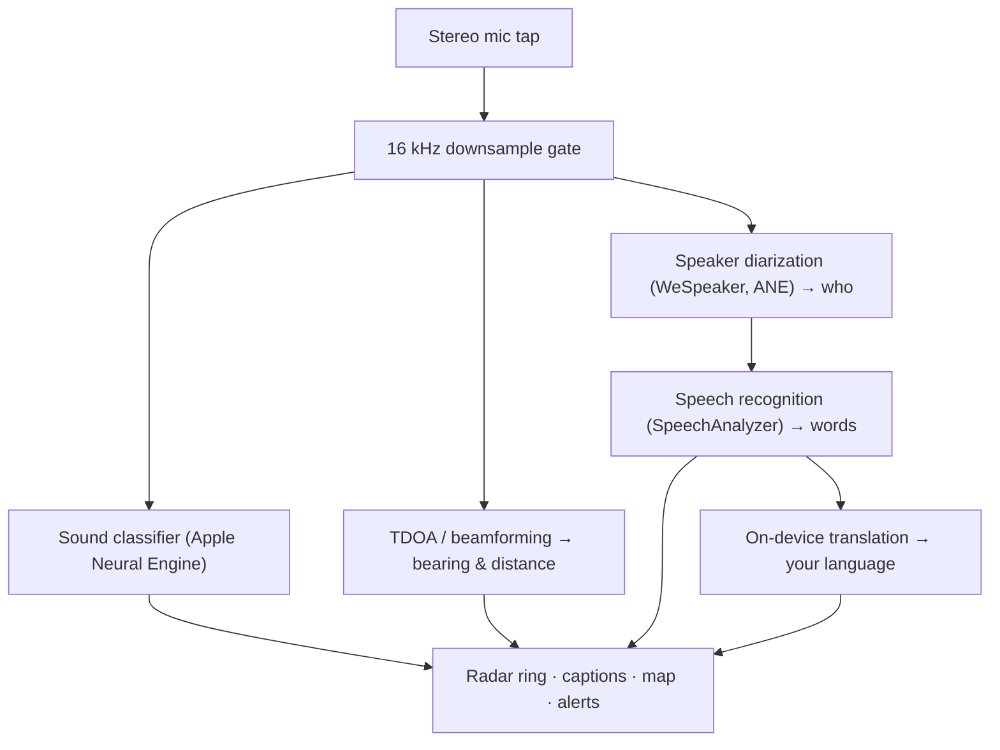

# Vigilant Ear 👂🛡️ (Apple Edition)

*Un radar acoustique pour les personnes malentendantes.*

Une application conçue spécifiquement pour la communauté Sourde et malentendante ! La plupart des applications de reconnaissance sonore vous disent *quel* est le son. **Vigilant Ear vous dit où il se trouve, qui le produit et ce qu'il dit** — transformant un iPhone en un tricordeur sonique en temps réel pour décrire visuellement les sons autour de vous.

La direction et la distance d'une sirène. Un coup derrière vous. Les personnes d'une conversation, représentées sous forme de voix transcrites séparées — chacune sous-titrée et positionnée directionnellement par locuteur. Si quelqu'un parle dans une langue que vous ne lisez pas, ses mots vous parviennent **traduits dans la vôtre.**

Tout fonctionne sur l'appareil. Rien n'est enregistré, mis en cache ni envoyé nulle part.

---

## Pour qui c'est

- **Les utilisateurs sourds et malentendants** qui souhaitent une conscience situationnelle du son — pas seulement « un son s'est produit », mais *quoi, où, qui,* et *ce qui a été dit.*
- Toute personne ayant besoin de **sous-titres en direct avec direction et séparation des locuteurs**, ou d'une **traduction sur l'appareil** de ses amis assis à proximité.
- Les chercheurs en acoustique et les passionnés d'accessibilité intéressés par la localisation sonore sur l'appareil.

> Vigilant Ear est une **aide** à l'accessibilité, pas un dispositif de sécurité certifié.

---

## Ce qu'il fait

### 🧭 Il voit le son — direction et distance
En utilisant les microphones stéréo de l'iPhone, Vigilant Ear estime le **relèvement et la distance approximative** des sons environnants et les place sous forme de points animés sur un anneau radar orienté vers la tête et sur une carte. Déplacez-vous, et les points conservent leur position dans le monde réel. C'est le cœur de l'application : la conscience spatiale d'un monde que vous n'entendez pas.

### 🚨 Il reconnaît les sons importants — et vous prévient
Un classificateur sur l'appareil identifie **plus de 300 sons du quotidien** et surveille les catégories critiques — **sirènes, alarmes, sonnettes/coups à la porte, une personne à proximité et météo sévère.** Lorsqu'un son est détecté, vous recevez une alerte claire à l'écran et une **notification push** optionnelle, même lorsque l'application est en arrière-plan ou votre téléphone en veille. Désactivez toutes les catégories d'alerte et le moteur se met complètement en hibernation en arrière-plan pour économiser la batterie.

Les alertes météorologiques sévères proviennent de flux publics officiels : le **NWS** américain est intégré gratuitement ; le réseau européen **MeteoGate** et le **CMA** chinois font partie de Premium. Les flux sont automatiquement filtrés pour ne retenir que ceux qui couvrent réellement votre position.

### 💬 Speaker Mode — sous-titres en direct et directionnels *(Premium)*
Activez **Speaker Mode** et Vigilant Ear retranscrit les personnes qui parlent près de vous en **blocs de sous-titres, un par voix.** La diarisation des locuteurs sur l'appareil distingue les voix, de sorte que chaque personne conserve son propre bloc et son icône originale — *qui* dit *quoi* — avec un petit cercle sur l'anneau intérieur vous dirigeant vers leur position dans la pièce. Le locuteur actif est mis en surbrillance ; le texte plus ancien défile lentement ou au fur et à mesure que de la place est nécessaire pour le nouveau texte.

### 🌐 Speaker Auto-Translate — lisez une langue que vous ne pouvez pas entendre, dans la vôtre *(Premium)*
Avec Speaker Mode activé, lorsqu'une personne à proximité parle une autre langue, Vigilant Ear la détecte et affiche ses sous-titres **dans votre langue**, en direct, avec l'identification de sa langue « source » dans la barre de titre de son bloc. Toute la chaîne — entendre → séparer les locuteurs → transcrire → traduire → afficher — fonctionne **entièrement sur l'appareil** ; le seul moment réseau est un téléchargement unique de pack de langue depuis Apple. Pour une personne sourde avec un ami qui parle une autre langue, cela signifie lire sa partie de la conversation en temps réel **sans avoir à connaître et choisir cette langue au préalable**.

### 🎵 Conscience musicale et des diffusions *(Premium)*
**ShazamKit** identifie la musique jouant autour de vous et affiche le titre avec une détection automatique de changement de signature de chanson. Et lorsqu'une voix semble provenir d'une télévision ou d'une radio plutôt que d'une personne dans la pièce, elle est étiquetée avec un **📻** au lieu d'être confondue avec quelqu'un de présent — les mots s'affichent quand même ; ils sont juste étiquetés honnêtement.

### 🛰️ Constellation — plusieurs iPhones, une oreille partagée *(Premium)*
Avec deux iPhones ou plus compatibles Ultra-Wideband (la plupart depuis l'iPhone 11), le mode **Constellation** les associe pour qu'ils puissent détecter mutuellement leur position (via Nearby Interaction / UWB d'Apple) et fusionner ce qu'ils entendent chacun en une image unique et bien plus précise de l'origine d'un son — une sorte de **sonar à ouverture de synthèse** passif et distribué. Il est limité aux appareils dotés du matériel requis.

### 🗺️ Cartes, routes et prédiction de trajectoire
Les relèvements sonores sont projetés sur de vraies coordonnées GPS et dessinés sur une vue cartographique. Les sons de véhicules sont **alignés sur les rues à proximité** (via des flux de données routières open source) et leurs trajectoires prédites, de sorte qu'une voiture qui passe apparaît comme se déplaçant *le long de la route* plutôt qu'en dérivant à travers les bâtiments. (Essayez la démo du camion de pompiers pour le voir en avant-première.)

---

## Gratuit et Premium

Le cœur de sécurité est **gratuit, pour toujours** :

- **Alertes sonores locales** — alarmes, sirènes, sonnettes/coups à la porte et une personne à proximité — détectées sur l'appareil, avec des avertissements à l'écran et en notification push.
- **Alertes météorologiques sévères NWS** pour les États-Unis.

Un **déblocage Premium** unique — avec un essai gratuit pour commencer, et **pas un abonnement** — ajoute la couche complète de conscience situationnelle :

- **Speaker Mode** — sous-titres en direct, directionnels, par locuteur.
- **Speaker Auto-Translate** — traduction sur l'appareil des discours à proximité dans votre langue.
- **Constellation** — écoute partagée multi-iPhone via Ultra-Wideband.
- **Music ID** — reconnaissance de chansons par ShazamKit.
- **Flux météo internationaux** — Europe (MeteoGate) et Chine (CMA).

Gratuit ou Premium, **tout fonctionne sur l'appareil** — le niveau change uniquement les fonctionnalités débloquées, jamais où va votre audio.

---

## Comment ça fonctionne (sous le capot)

Vigilant Ear est un pipeline **local d'abord, sur l'appareil**. L'audio brut est capturé sur un tap haute priorité, copié et distribué à des acteurs de traitement indépendants sans jamais bloquer l'interface utilisateur :

- **Mathématiques spatiales** — les transformées de Fourier rapides, le calcul de différence de temps d'arrivée (TDOA) et le suivi Doppler s'exécutent sur des tâches d'arrière-plan détachées.
- **Parole** — `SpeechAnalyzer`/`SpeechTranscriber` d'iOS 26 gèrent la transcription ; les embeddings **WeSpeaker** regroupent l'audio en voix distinctes ; le framework **Translation** d'Apple effectue la traduction sur l'appareil.
- **Concurrence** — l'isolation stricte de Swift 6 maintient le tap microphone, les mathématiques acoustiques et la boucle de rendu `CADisplayLink` de la carte proprement séparés, de sorte que l'interface utilisateur reste fluide (objectif de glissement de marqueur à 60 FPS) pendant que tout le reste s'exécute en arrière-plan.
- **Efficacité** — le filtre de sous-échantillonnage à 16 kHz réduit les données vues par le classificateur de ~80 %, maintenant l'empreinte active légère et le mode « toujours en écoute » en arrière-plan encore plus léger.

---

## Confidentialité

- **Sur l'appareil, toujours.** Toute la classification, les mathématiques spatiales, la transcription, la diarisation (signature/identification du locuteur) et la traduction se déroulent sur votre iPhone. L'audio brut n'est jamais enregistré, mis en cache ni transmis.
- **Les transcriptions sont éphémères.** Les sous-titres vivent en mémoire pour la session et ne sont pas persistés ni téléchargés.
- **Pas de télémétrie.** Aucune donnée analytique, journal de crash ou donnée d'utilisation n'est envoyée à un serveur.

Détails complets : [PRIVACY.md](PRIVACY.md) · [TERMS.md](TERMS.md) · [SUPPORT.md](SUPPORT.md)

---

## Matériel et plateformes

- **iPhone (expérience complète).** Un iPhone à microphones stéréo est requis pour la localisation directionnelle. iPhone 13 ou plus récent recommandé.
- **iPad (sous-titres uniquement).** Les iPads n'exposent qu'un seul canal audio, ils transcrivent et sous-titrent donc mais ne peuvent pas calculer la direction — idéal pour un affichage grand écran fixe.
- **Constellation** nécessite **Ultra-Wideband** — iPhone 11 ou ultérieur, à l'exclusion des modèles SE et « e ».

---

## Localisation

Entièrement localisé — interface, alertes et sous-titres — en **anglais, espagnol, portugais, français, allemand, arabe, japonais et chinois simplifié** (8 langues). La langue suit le paramètre régional du système ou peut être choisie manuellement dans l'application.

---

## État et avertissement

Vigilant Ear est une **aide acoustique expérimentale à l'accessibilité**, pas un utilitaire de sécurité certifié. La résolution de localisation varie selon l'environnement, la météo, le vent et le matériel du microphone. **Maintenez toujours votre conscience environnementale normale** — ne vous appuyez pas dessus comme seule source d'information de sécurité.

---

**Contact :** [vigilantear@wingdingssocial.com](mailto:vigilantear@wingdingssocial.com)

Fait avec ❤️ pour la communauté S/MA et la recherche acoustique.

© 2026 Wingdings, Inc. All rights reserved.
