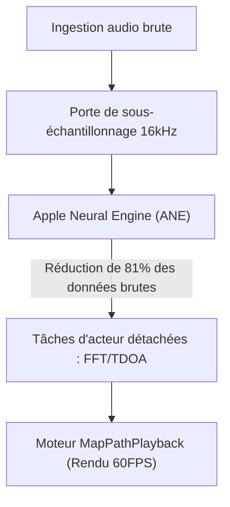

# VigilantEar 👂🛡️ (Édition Apple)

**Date d'entrée en vigueur :** 6 Juin 2026

**VigilantEar** est un outil de recherche acoustique et d'accessibilité iOS avancé et ultra-performant, conçu pour fournir une conscience directionnelle et spatiale en temps réel à la communauté sourde et malentendante (D/HH). Les logiciels de reconnaissance sonore traditionnels identifient uniquement *ce qu'est* un son ; VigilantEar agit comme un radar tactique complet, combinant l'apprentissage automatique calculé en périphérie (edge-computed machine learning) avec une physique acoustique sophistiquée pour suivre exactement *d'où* provient un son, sa distance estimée et sa trajectoire absolue.

---

## 🌍 Portée mondiale et localisation

Pour soutenir les utilisateurs du monde entier, la plateforme dispose d'une matrice de localisation native complète prenant en charge :

- **Anglais**
- **Espagnol (Español)**
- **Portugais (Português)**
- **Chinois (简体中文)**
- **Français**
- **Allemand (Deutsch)**
- **Japonais (日本語)**

Toutes les superpositions tactiques, les alertes HUD et les menus de préférences s'adaptent dynamiquement aux paramètres régionaux du système.

---

## 🚀 Fonctionnalités clés et capacités

- **Gestion intelligente de l'alimentation (Smart Power Gating)** : Pour maximiser la longévité de la batterie et protéger les ressources du système, le système met en œuvre un moniteur d'arrière-plan conditionnel. Si les cinq catégories d'alerte d'urgence principales sont désactivées par l'utilisateur, les boucles d'ingestion de microphone et les moteurs de traitement entrent automatiquement en hibernation complète lorsqu'ils sont en arrière-plan.
- **Simulation tactique cinématique** : Comprend une suite de simulation robuste sur l'appareil permettant aux utilisateurs de tester les signatures haptiques et les réponses visuelles pour les cinq pistes critiques `.emergency`—Sirènes, Alarmes, Sonnettes, Personnes à proximité, et Conditions météorologiques extrêmes—sans nécessiter de déclencheurs acoustiques réels. La simulation de camion de pompiers fonctionne de manière sécurisée sur un moteur de lecture physique cinématique découplé à 60 FPS, garantissant des interactions cartographiques visuellement époustouflantes, indépendantes du sondage acoustique.
- **Suivi multi-cibles (MTT)** : Isole et suit simultanément des signatures sonores environnementales indépendantes à l'aide de marqueurs de session UUID uniques associés à une cartographie de persistance physique.
- **Intégration ShazamKit** : Identification musicale environnementale en temps réel cartographiée dynamiquement sur le radar spatial.
- **Accrochage géographique aux routes et moteur physique** : Projette des relèvements acoustiques mathématiques relatifs sur des coordonnées GPS mondiales, accrochant intelligemment les vecteurs de véhicules en temps réel aux rues vérifiées via l'intégration MapKit et prédisant leur trajectoire à l'aide du `VehiclePathPredictor` dédié.

---

## 🧬 Architecture de base et moteur mathématique neuronal

VigilantEar utilise une **architecture Push SoundML** personnalisée entièrement construite autour des garanties de performance et de concurrence du matériel iOS moderne.

## ⚡ Découplage architectural

Pour maintenir un thread d'interface utilisateur 120Hz complètement non bloqué tout en gérant de manière continue une prise d'entrée à haute fréquence et un dessin cartographique complexe, la plateforme utilise une séparation stricte des préoccupations via l'isolation Swift 6 :

- **Registre de session MapPath (DisplayLink)** : Dispose d'un moteur CADisplayLink découplé qui isole les rafraîchissements de vue MapKit du traitement acoustique, garantissant un glissement de marqueur fluide à 60 images par seconde, des traînées Doppler qui s'estompent et un suivi cinématique des objets.
- **MicrophoneManager (MainActor)** : Isole strictement les propriétés liées à l'interface utilisateur, l'état d'orientation de l'appareil et les métriques de localisation pour piloter le HUD en douceur.
- **AcousticEngine (Non-Isolated / Background Actor)** : Gère les états AVAudioEngine de bas niveau et les opérations matérielles. Les tampons d'ingestion sont copiés en profondeur directement sur le thread de prise (tap) à haute priorité, passant les instantanés directement aux acteurs de traitement sans jamais forcer un changement de thread ou bloquer l'Acteur Principal (Main Actor), éliminant complètement les micro-saccades.

### 🧠 Minimisation mathématique

- **Déchargement et réduction** : Les trames audio passent par une porte de sous-échantillonnage stricte de 16 kHz avant traitement, réduisant de 81 % l'empreinte des données brutes avant que les vecteurs de classification ne soient traités par l'Apple Neural Engine (ANE).
- **Mathématiques spatiales parallèles** : Des pipelines mathématiques haute performance (comprenant les transformées de Fourier rapides (FFT), les calculs de différence de temps d'arrivée (TDOA) et les algorithmes de suivi Doppler) s'exécutent entièrement au sein de threads asynchrones détachés.

### 📊 Références de performance (Benchmarks)

- **Mode Actif** : Offre un suivi HUD en direct complet et des traces cartographiques prédictives à 60 FPS avec une empreinte CPU de seulement 6 % sur un processeur standard à 6 cœurs.
- **Mode Réduit / Arrière-plan** : Lorsque l'application est minimisée, le calcul chute de plus de 33 %, maintenant une vigilance environnementale absolue à seulement 4 % d'utilisation du CPU avec un impact thermique négligeable.

---

## 🛠️ Pile technique (2026)

- **Langage** : Swift 6 (Concurrence stricte, modèles Sendable vérifiés, isolation d'acteur)
- **Frameworks** : SwiftUI, MapKit (Superpositions d'annotations et de chronologies), Accelerate Framework (vDSP), SoundML
- **Base matérielle** : iPhone 13 ou plus récent (Alignement du microphone stéréo requis pour la précision du relèvement TDOA)

---

## 📊 Garde-fous de confidentialité et de sécurité

- **Isolation "Local-First"** : Toutes les classifications audio, les mathématiques spectrales et les projections de relèvement se produisent exclusivement sur l'appareil. Les flux audio bruts ne sont jamais enregistrés, mis en cache ou transmis sous aucune condition.
- **Pas de télémétrie ni de diagnostics à distance** : VigilantEar est conçu pour fonctionner de manière entièrement locale sur votre appareil. Nous ne collectons, ne transmettons ni ne stockons aucune télémétrie à distance, journal de plantage, journal de diagnostic ou analyse d'utilisation sur nos serveurs.

---

## ⚖️ Avis de non-responsabilité

VigilantEar est une aide expérimentale à la recherche acoustique et à l'accessibilité spatiale. Ce n'est pas certifié comme un utilitaire de sécurité des personnes. La résolution du suivi peut fluctuer dynamiquement en fonction de la topologie régionale, de la météo dominante, des conditions de vent et de l'étalonnage du matériel de microphone. Les utilisateurs doivent toujours maintenir une conscience environnementale normale.

**Email de contact :** [vigilantear@wingdingssocial.com](mailto:vigilantear@wingdingssocial.com)

VigilantEar est un outil d'accessibilité construit avec soin. Veuillez l'utiliser de manière responsable.

Fait avec ❤️ pour la communauté D/HH et la recherche acoustique.

© 2026 Wingdings, Inc.  
Tous droits réservés.
