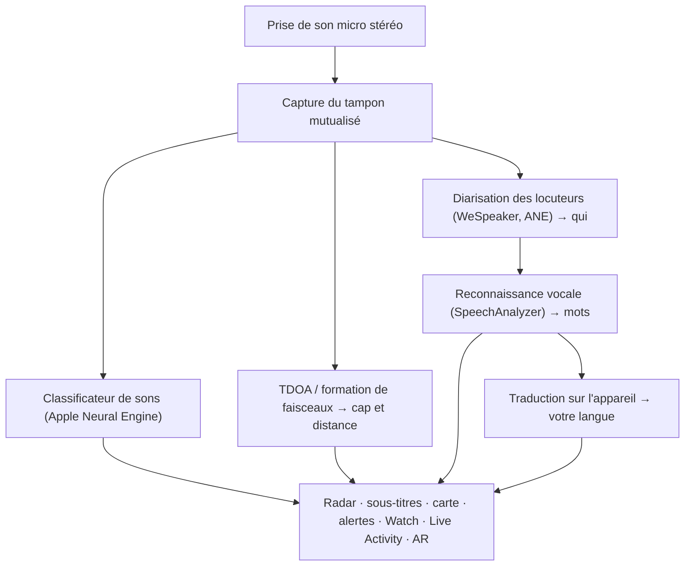

# Vigilant Ear 👂🛡️

*Un radar acoustique pour les personnes sourdes et malentendantes.*

Une application conçue spécifiquement pour la communauté sourde et malentendante. La plupart des applications de reconnaissance vocale et sonore vous disent *ce qu'est* un son. **Vigilant Ear vous indique où il se trouve, qui le produit et ce qui se dit**, transformant un iPhone en un tricordeur sonore en temps réel qui décrit le son autour de vous.

La direction et la distance d'une sirène. Un coup frappé derrière vous. Les personnes d'une conversation, dessinées sous forme de voix transcrites séparées — chacune sous-titrée et placée directionnellement. Si quelqu'un parle une langue que vous ne lisez pas, ses mots peuvent arriver **traduits dans la vôtre.** Les alertes atteignent votre **Écran de verrouillage (Lock Screen), Dynamic Island et Apple Watch**, il suffit donc d'un coup d'œil.

Tout ce qui compte s'exécute sur l'appareil. L'audio n'est pas enregistré ni téléchargé sur un serveur pour la reconnaissance. Rien ne dépend de l'audition.

- 🧭 **Direction, et pas seulement détection.** *Quoi, où, qui,* et *ce qui a été dit* — et pas simplement « un son s'est produit ».
- 🔒 **Privé par conception.** La classification, le sous-titrage et la traduction s'exécutent sur votre iPhone. Les sous-titres sont en direct et éphémères ; ils ne sont pas sauvegardés sous forme d'archives de transcription.
- ⌚ **À votre poignet et sur l'Écran de verrouillage.** Le compagnon de direction Apple Watch et Live Activity gardent la dernière alerte et sa provenance à portée de regard.
- 🛰️ **Plusieurs téléphones, une oreille partagée.** Constellation relie les iPhones Ultra-Wideband pour fusionner ce que chacun entend en une image directionnelle plus précise.
- 👁️ **Conçu pour les sourds et malentendants.** Retours haptiques distincts, visuels à contraste élevé, indices indépendants de la couleur, grandes cibles d'appui et respect du paramètre Réduire les animations partout.

---

## Pour qui

- **Les utilisateurs sourds et malentendants** qui veulent une conscience situationnelle des sons — Home Watch (coup, alarme, bébé, téléphone) et Street Watch (sirène, approche) que vous pouvez laisser allumés et auxquels vous pouvez faire confiance.
- Quiconque a besoin de **sous-titres en direct avec direction et séparation des locuteurs**, ou d'une **traduction sur l'appareil** des personnes assises à proximité.
- Les utilisateurs de l'accessibilité et de la recherche acoustique intéressés par la localisation sonore sur l'appareil.

> Vigilant Ear est une **aide** à l'accessibilité, et non un dispositif certifié de sécurité des personnes.

---

## Ce qu'elle fait

### 🧭 Elle voit le son — direction et distance
En utilisant les microphones stéréo de l'iPhone, Vigilant Ear estime le **cap et la distance approximative** des sons autour de vous et les place sous forme de marqueurs en direct sur un anneau radar (orienté vers l'avant) et une carte. Déplacez-vous, et les marqueurs conservent leur position dans le monde réel. C'est le cœur de l'application : une conscience spatiale d'un monde que vous ne pouvez pas entendre.

### 🚨 Elle reconnaît les sons importants — et vous avertit
Un classificateur sur l'appareil identifie des centaines de sons du quotidien et surveille les catégories critiques — **sirènes, alarmes, sonnettes/coups, pleurs de bébé, une personne à proximité, et alertes météo extrêmes.** Lorsqu'un son se déclenche, vous obtenez une alerte claire à l'écran, une **notification push** (optionnelle) et un retour **haptique** distinct, même si l'application est en arrière-plan ou que le téléphone est en veille. Les catégories critiques sont prêtes par défaut afin que l'activation des notifications ne signifie pas « tout désactiver ». Désactivez toutes les catégories d'alerte et le moteur hibernera complètement en arrière-plan pour économiser la batterie.

Les alertes météorologiques extrêmes proviennent de flux publics officiels CAP — **NWS** pour les États-Unis, **MeteoGate** pour l'Europe, **CMA** pour la Chine, et **KMA** pour la Corée, et ce, gratuitement pour tous les utilisateurs. Les flux sont restreints à ceux qui couvrent l'endroit où vous vous trouvez.

### ⌚ Apple Watch + Live Activity — un coup d'œil et vous savez
- **Application compagnon Apple Watch** — la direction d'une alerte pointe sur votre poignet afin qu'un coup d'œil vous dise où regarder. Interface utilisateur repensée pour la Watch avec l'icône de l'oreille de l'application, l'affichage tête haute (HUD) des menaces, et un double tapotement pour fermer une alerte. Les alertes peuvent toujours afficher la flèche de direction lorsque l'application Watch n'est pas ouverte.
- **Live Activity (Activité en direct)** — Vigilant Ear reste sur votre **Écran de verrouillage**, dans la **Dynamic Island**, et dans le **Défilement intelligent (Smart Stack) de la Watch**, afin que la dernière alerte et son cap soient toujours à portée de regard.

### 💬 Mode Locuteur (Speaker Mode) — sous-titres en direct et directionnels *(gratuit)*
Activez le **Mode Locuteur (Speaker Mode)** et Vigilant Ear transcrit les personnes qui parlent près de vous en **blocs de sous-titres, un par voix.** La diarisation des locuteurs sur l'appareil garde les voix distinctes — *qui* dit *quoi* — avec un indicateur directionnel sur l'anneau intérieur. Le locuteur en direct est mis en surbrillance ; le texte plus ancien défile pour faire de la place. Les sous-titres sont gratuits ; la traduction automatique est le niveau Power Pack+ optionnel.

### 🌐 Auto-traduction des locuteurs (Speaker Auto-Translate) — votre langue, en direct *(Power Pack+)*
Avec le Mode Locuteur activé, lorsqu'une personne à proximité parle une autre langue, Vigilant Ear peut la détecter et afficher ses sous-titres **dans votre langue**, avec la langue source indiquée sur son bloc. La chaîne — écouter → séparer les locuteurs → transcrire → traduire → afficher — s'exécute **sur l'appareil** ; la seule utilisation du réseau est un téléchargement unique du pack linguistique depuis Apple. Vous n'avez pas besoin de connaître ou de choisir l'autre langue en premier.

C'est ce qui se rapproche le plus du **traducteur universel de la science-fiction** — l'appareil qui comprend, tout simplement. Les traducteurs à écouteurs vous obligent à choisir d'abord la paire de langues et traduisent une voix vers une seule oreille. Vigilant Ear détecte la langue par lui-même, suit chaque personne qui parle dans la pièce et les sous-titre toutes dans votre langue — sans écouteurs, sans réglage, sur votre appareil.

### 🎵 Reconnaissance de musique et de diffusion *(Power Pack+)*
**ShazamKit** identifie la musique qui joue autour de vous et suit les changements de chanson. Lorsqu'une voix semble provenir d'une télévision ou d'une radio plutôt que d'une personne dans la pièce, elle est marquée d'une **📻** — les mots s'affichent toujours ; ils sont correctement étiquetés.

### 🎛️ Oscilloscope acoustique — voir le son comme un ingénieur *(Power Pack+)*
Une vue professionnelle et en direct du son autour de vous : spectre, spectrogramme, bandes RTA au tiers d'octave, chroma et partiels harmoniques — plus des outils pour capturer des sons et entraîner vos propres packs.

### 📦 Packs de sons personnalisés — apprenez-lui votre monde *(Power Pack+)*
Apprenez à Vigilant Ear les sons qui comptent pour vous — des oiseaux locaux à la sonnette de votre immeuble. Les packs s'ajoutent à la détection intégrée sans jamais évincer sirènes et alarmes. Un guide pas à pas est inclus dans l'app.

### 🛰️ Constellation — plusieurs iPhones, une oreille partagée *(Power Pack+)*
Avec deux iPhones ou plus équipés de la technologie Ultra-Wideband (la plupart depuis l'iPhone 11), **Constellation** les associe afin qu'ils puissent détecter la position des autres et fusionner ce que chacun entend en une image unique et plus précise de la provenance d'un son — un réseau d'écoute distribué et passif. Restreint aux appareils dotés du matériel approprié. Les sous-titres en réseau mesh antérieurs à l'heure de connexion d'un pair ne sont pas retransmis.

### 📷 Caméra AR — « voir le son »
Ouvrez la pastille de la caméra sur la barre de titre et épinglez les sons détectés à leur orientation réelle dans la vue en direct de la caméra. Les marqueurs se regroupent par locuteur ou par catégorie de son et par direction pour que la vue reste lisible ; les sources s'estompent avec le temps lorsqu'elles deviennent silencieuses.

### 🗺️ Cartes, routes et prédiction de trajectoire
Les caps sonores se projettent sur les coordonnées GPS réelles sur la carte. Les bruits de véhicules peuvent être **calés sur les rues à proximité** et leurs trajectoires prédites pour qu'un camion qui passe s'affiche comme se déplaçant *le long de la route* plutôt qu'à travers les bâtiments. (Essayez la démo du camion de pompiers.)

### 🪄 Terrain de jeu des fonctionnalités — prouvez-le sans oreilles
Le **Terrain de jeu des fonctionnalités** est public pour tous : entraînements Maison et Rue (Home & Street) (coup, alarme, bébé, sirène, météo), démos multi-téléphones et de conversation, et un filigrane clair pour que la pratique ne se fasse jamais passer pour un événement réel. La fermeture du panneau met fin proprement aux démos (pas de fausse position GPS bloquée, pas de drapeaux restants).

### ♿ L'accessibilité avant tout
Conçu pour les utilisateurs sourds, malentendants et daltoniens : des indices **indépendants de la couleur**, des cibles tactiles de **≥ 44 pt**, le respect du paramètre **Réduire les animations**, des alertes multimodales (haptiques + visuelles + Watch), et un écran de vérification au démarrage qui affiche l'état des permissions avec des états clairs vert / gris / rouge (et « refusé » orange brûlé) — y compris l'octroi des notifications qui agit comme l'interrupteur d'alerte principal.

---

## Gratuit et Power Pack+

Le cœur de la sécurité est **gratuit, pour toujours** :

- **Home Watch & Street Watch** — alertes sonores locales (alarmes, sirènes, coups/sonnettes, bébé, personne à proximité) avec notification à l'écran, haptique et push en option.
- **Sous-titres en direct** — Mode Locuteur (Speaker Mode), sur l'appareil, directionnel là où le matériel le permet.
- **Météo extrême CAP** — NWS, MeteoGate, CMA, KMA pour votre région.
- **Terrain de jeu des fonctionnalités** — alertes d'entraînement et aperçus des fonctionnalités avec un filigrane PREVIEW bien visible.
- **Compagnon Apple Watch & Live Activity** — direction et dernière alerte consultables d'un coup d'œil.

Le **Power Pack+** est un déblocage unique (**pas un abonnement**) avec un **essai gratuit de 90 jours**. Il ajoute les superpouvoirs suivants :

- **Auto-traduction des locuteurs (Speaker Auto-Translate)** — traduction sur l'appareil de la parole environnante vers votre langue.
- **Constellation** — audition partagée sur plusieurs iPhones via Ultra-Wideband.
- **Music ID** — reconnaissance de chansons via ShazamKit.
- **Oscilloscope acoustique** — visualisation sonore en direct de niveau professionnel et outils de capture.
- **Packs de sons personnalisés** — des classificateurs additionnels que vous entraînez pour vos propres sons.

Que ce soit en version Gratuite ou Power Pack+, **votre audio reste sur l'appareil pour la reconnaissance** — le niveau modifie seulement quelles fonctionnalités sont débloquées, jamais l'endroit où l'audio brut est envoyé pour analyse.

---

## Comment ça marche (sous le capot)

Vigilant Ear est un pipeline **prioritairement local, sur l'appareil**. L'audio brut est capturé sur un point d'écoute (tap) à haute priorité, copié dans une **liste libre de tampons mutualisée (pooled buffer free-list)** (pas de surcharge d'allocation sur le chemin en temps réel), et distribué aux processeurs indépendants sans bloquer l'interface utilisateur ou interrompre le flux :

- **Mathématiques spatiales** — FFT, Différence de Temps d'Arrivée (Time-Difference-of-Arrival) et suivi Doppler sur des tâches en arrière-plan.
- **Voix** — `SpeechAnalyzer` / `SpeechTranscriber` sous iOS 26 pour la transcription ; les intégrations **WeSpeaker** pour l'identité vocale ; le framework **Translation** d'Apple pour la traduction sur l'appareil.
- **Concurrence** — l'isolation de Swift 6 maintient le point d'écoute du microphone, les mathématiques acoustiques et la boucle de rendu de l'interface utilisateur proprement séparés.
- **Efficacité** — le sous-échantillonnage et la classification adaptative à la charge permettent de maintenir une écoute permanente suffisamment légère pour être laissée activée.

---

## Confidentialité

- **Sur l'appareil, toujours pour le pipeline principal.** La classification, les mathématiques spatiales, la transcription, la diarisation et la traduction s'exécutent sur votre iPhone. L'audio brut n'est pas enregistré ni téléchargé pour la reconnaissance.
- **Les sous-titres sont éphémères.** Les sous-titres en direct restent en mémoire pendant la session ; les journaux de débogage exportés n'incluent pas le texte des sous-titres.
- **Aucun SDK publicitaire ou d'analyse comportementale.** L'utilisation limitée du réseau est uniquement pour les cartes, les flux météo publics, les empreintes digitales Shazam optionnelles, le contexte routier et les achats sur l'App Store — voir la politique complète.

Full details: [PRIVACY.md](PRIVACY.md) · [TERMS.md](TERMS.md) · [SUPPORT.md](SUPPORT.md)

---

## Matériel et plateformes

- **iPhone (expérience complète).** Microphones stéréo requis pour la radiogoniométrie (direction). Recommandé : **iPhone 13 ou plus récent**.
- **Apple Watch.** Alertes compagnon avec flèche de direction ; fonctionne avec Live Activity / Défilement intelligent (Smart Stack).
- **iPad (axé sur les sous-titres).** Micros monocanal → sous-titres sans direction complète.
- **Constellation** nécessite l'**Ultra-Wideband** — iPhone 11 ou ultérieur, à l'exclusion des modèles SE et « e ».
- **Android.** Version séparée avec le radar principal, les alertes, les sous-titres et la météo ; le réseau mesh Constellation est d'abord disponible sur iOS. Voir les mises à jour du site du produit à mesure que la parité Android progresse.

**Version actuelle sur l'App Store :** 1.0.7. Conçu pour les systèmes iOS modernes (ère SpeechAnalyzer).

---

## Localisation

Entièrement localisé — interface, alertes et sous-titres — en **anglais, espagnol, portugais (Brésil), français, allemand, arabe, japonais, chinois simplifié et coréen** (9 langues). Suit les paramètres régionaux du système ou un choix manuel dans l'application.

---

## Statut et clause de non-responsabilité

Vigilant Ear est une **aide expérimentale à l'accessibilité acoustique**, et non un outil certifié de sécurité des personnes. La résolution de la localisation varie en fonction de l'environnement, de la météo, du vent et du matériel du microphone. **Maintenez toujours votre conscience habituelle de l'environnement** — ne vous y fiez pas comme votre seule source d'informations de sécurité.

Certaines capacités (marqueurs AR de caméra, mise à niveau du droit aux alertes critiques lorsqu'elles sont accordées par Apple, création de sons multi-pack avancée) continuent d'évoluer ; la surveillance Maison / Rue (Home / Street watch) gratuite et les sous-titres en direct sont le produit auquel vous pouvez faire confiance dès le premier jour.

---

**Contact:** [vigilantear@wingdingssocial.com](mailto:vigilantear@wingdingssocial.com)

Fait avec ❤️ pour la communauté sourde/malentendante et la recherche acoustique.

    
  <strong>© 2026 Wingdings, Inc.</strong> 
  Tous droits réservés. 
  Brevet en instance

