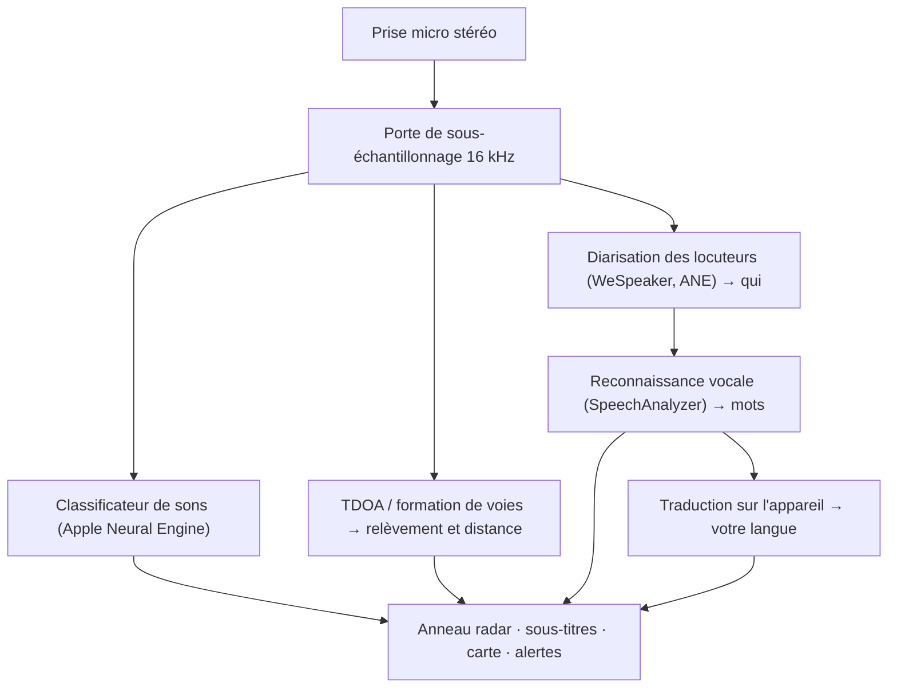

# VigilantEar 👂🛡️ (Édition Apple)

*Un radar acoustique pour celles et ceux qui n'entendent pas.*

Une application conçue spécifiquement pour la communauté Sourde et malentendante ! La plupart des applis de reconnaissance sonore vous disent *ce qu'est* un son. **VigilantEar vous dit où il se trouve, qui le produit et ce qu'il dit** — transformant un iPhone en véritable tricordeur sonique en temps réel pour décrire visuellement les sons qui vous entourent.

La direction et la distance d'une sirène. Un coup frappé derrière vous. Les personnes d'une conversation, représentées comme des voix transcrites distinctes — chacune sous-titrée et placée directionnellement selon le locuteur. Si quelqu'un parle une langue que vous ne lisez pas, ses paroles vous parviennent **traduites dans la vôtre.**

Tout fonctionne sur l'appareil. Rien n'est enregistré, mis en cache ni envoyé où que ce soit.

---

## À qui s'adresse l'application

- **Les personnes sourdes et malentendantes** qui souhaitent une conscience situationnelle du son — pas seulement « un son s'est produit », mais *quoi, où, qui* et *ce qui a été dit.*
- Toute personne ayant besoin de **sous-titres en direct avec direction et séparation des locuteurs**, ou d'une **traduction sur l'appareil** des amis assis à proximité.
- Les passionnés de recherche acoustique et d'accessibilité que la localisation sonore sur l'appareil intéresse.

> VigilantEar est une **aide** à l'accessibilité, et non un dispositif certifié de sécurité des personnes.

---

## Ce qu'elle fait

### 🧭 Elle voit le son — direction et distance
À l'aide des microphones stéréo de l'iPhone, VigilantEar estime le **relèvement et la distance approximative** des sons qui vous entourent et les place sous forme de points en direct sur un anneau radar orienté selon votre cap et sur une carte. Déplacez-vous, et les points conservent leur position réelle dans l'espace. C'est l'essentiel : une conscience spatiale d'un monde que vous ne pouvez pas entendre.

### 🚨 Elle reconnaît les sons importants — et vous alerte
Un classificateur embarqué identifie **plus de 300 sons du quotidien** et surveille les catégories critiques — **sirènes, alarmes, sonnettes/coups frappés, présence d'une personne à proximité et intempéries.** Lorsqu'une alerte se déclenche, vous recevez un avertissement clair à l'écran et, en option, une **notification push**, même lorsque l'appli est en arrière-plan ou que votre téléphone est en veille. Désactivez toutes les catégories d'alerte et le moteur se met entièrement en veille prolongée en arrière-plan pour économiser la batterie.

Les avertissements d'intempéries proviennent de flux publics officiels : le **NWS** des États-Unis est intégré gratuitement ; le réseau européen **MeteoAlarm** et le **CMA** chinois font partie de Premium. Les flux sont automatiquement réduits à ceux qui couvrent réellement l'endroit où vous vous trouvez.

### 💬 Mode Locuteur — sous-titres directionnels en direct *(Premium)*
Activez le **Mode Locuteur** et VigilantEar transcrit les personnes qui parlent près de vous sous forme de **blocs de sous-titres, un par voix.** La diarisation des locuteurs sur l'appareil distingue les voix, de sorte que chaque personne conserve son propre bloc et son icône singulière — *qui* dit *quoi* — avec un petit cercle sur l'anneau intérieur vous indiquant sa position dans la pièce. Le locuteur actif est mis en évidence ; le texte plus ancien défile lentement ou à mesure que la place est nécessaire pour un nouveau texte.

### 🌐 Traduction automatique du Locuteur — lisez dans votre langue ce que vous ne pouvez pas entendre *(Premium)*
Avec le Mode Locuteur activé, lorsqu'une personne à proximité parle une autre langue, VigilantEar la détecte et affiche ses sous-titres **dans votre langue**, en direct, avec l'identification de sa langue « source » dans la barre de titre de son bloc. Toute la chaîne — entendre → séparer les locuteurs → transcrire → traduire → afficher — s'exécute **entièrement sur l'appareil** ; le seul moment réseau est un téléchargement unique d'un pack de langue auprès d'Apple. Pour une personne sourde dont un ami parle une autre langue, cela signifie lire sa part de la conversation en temps réel **sans avoir à connaître et à choisir cette langue au préalable**.

### 🎵 Conscience de la musique et des diffusions *(Premium)*
**ShazamKit** identifie la musique qui joue autour de vous et affiche le titre, avec détection automatique des changements de morceau par signature. Et lorsqu'une voix semble provenir d'une télévision ou d'une radio plutôt que d'une personne présente dans la pièce, elle est marquée d'un **📻** au lieu d'être prise pour quelqu'un sur place — les paroles s'affichent toujours, elles sont simplement étiquetées honnêtement.

### 🛰️ Constellation — plusieurs iPhone, une seule oreille partagée *(Premium)*
Avec deux iPhone compatibles Ultra-Wideband ou plus (la plupart depuis l'iPhone 11), le mode **Constellation** les associe afin qu'ils puissent percevoir mutuellement leur position (via Nearby Interaction / UWB d'Apple) et fusionner ce que chacun entend en une image bien plus précise de la provenance d'un son — une sorte de **sonar à synthèse d'ouverture** distribué et passif. Il est réservé aux appareils dotés du matériel adéquat.

### 🗺️ Cartes, routes et prédiction de trajectoire
Les relèvements sonores sont projetés sur de vraies coordonnées GPS et tracés sur une vue cartographique. Les sons de véhicules sont **accrochés aux rues voisines** (via des flux de données routières open source) et leurs trajectoires prédites, de sorte qu'une voiture qui passe est lue comme se déplaçant *le long de la route* plutôt que dérivant à travers les bâtiments. (Essayez la démo du camion de pompiers pour l'aperçu.)

---

## Gratuit et Premium

Le cœur de sécurité est **gratuit, pour toujours** :

- **Alertes sonores locales** — alarmes, sirènes, sonnettes/coups frappés et présence d'une personne à proximité — détectées sur l'appareil, avec avertissements à l'écran et notifications push.
- **Avertissements d'intempéries du NWS** pour les États-Unis.

Un **déverrouillage Premium** unique — avec un essai gratuit pour commencer, et **pas un abonnement** — ajoute la couche complète de conscience situationnelle :

- **Mode Locuteur** — sous-titres en direct, directionnels et par locuteur.
- **Traduction automatique du Locuteur** — traduction sur l'appareil de la parole à proximité dans votre langue.
- **Constellation** — audition partagée entre plusieurs iPhone via Ultra-Wideband.
- **Identification musicale** — reconnaissance de morceaux par ShazamKit.
- **Flux météo internationaux** — Europe (MeteoAlarm) et Chine (CMA).

Gratuit ou Premium, **tout fonctionne sur l'appareil** — le palier ne change que les fonctionnalités déverrouillées, jamais l'endroit où va votre audio.

---

## Comment ça marche (sous le capot)

VigilantEar est un pipeline **local d'abord, sur l'appareil**. L'audio brut est capté sur une prise haute priorité, copié et réparti vers des acteurs de traitement indépendants sans jamais bloquer l'interface :

- **Calcul spatial** — les transformées de Fourier rapides, la différence de temps d'arrivée (TDOA) et le suivi Doppler s'exécutent sur des tâches d'arrière-plan détachées.
- **Parole** — le `SpeechAnalyzer`/`SpeechTranscriber` d'iOS 26 gèrent la transcription ; les embeddings **WeSpeaker** regroupent l'audio en voix distinctes ; le framework **Translation** d'Apple assure la traduction sur l'appareil.
- **Concurrence** — l'isolation stricte de Swift 6 maintient la prise du microphone, le calcul acoustique et la boucle de rendu `CADisplayLink` de la carte proprement séparés, de sorte que l'interface reste fluide (objectif de glissement des marqueurs à 60 FPS) pendant que tout le reste tourne à plein régime en arrière-plan.
- **Efficacité** — la porte de sous-échantillonnage 16 kHz réduit d'environ 80 % les données vues par le classificateur, gardant l'empreinte active légère et le mode « toujours à l'écoute » en arrière-plan plus léger encore.

---

## Confidentialité

- **Sur l'appareil, toujours.** Toute la classification, le calcul spatial, la transcription, la diarisation (signature/identification des locuteurs) et la traduction se font sur votre iPhone. L'audio brut n'est jamais enregistré, mis en cache ni transmis.
- **Les transcriptions sont éphémères.** Les sous-titres résident en mémoire pour la durée de la session et ne sont ni conservés ni téléversés.
- **Aucune télémétrie.** Aucune donnée d'analyse, journal de plantage ni donnée d'utilisation n'est envoyée à un quelconque serveur.

Détails complets : [PRIVACY.md](PRIVACY.md) · [TERMS.md](TERMS.md) · [SUPPORT.md](SUPPORT.md)

---

## Matériel et plateformes

- **iPhone (expérience complète).** Un iPhone à microphones stéréo est requis pour la radiogoniométrie. iPhone 13 ou plus récent recommandé.
- **iPad (sous-titres uniquement).** Les iPad n'exposent qu'un seul canal audio ; ils transcrivent et sous-titrent donc, mais ne peuvent pas calculer la direction — un bon choix pour un affichage fixe sur grand écran.
- **Constellation** nécessite l'**Ultra-Wideband** — iPhone 11 ou ultérieur, hors modèles SE et « e ».

---

## Localisation

Entièrement localisée — interface, alertes et sous-titres — en **anglais, espagnol, portugais, français, allemand, arabe, japonais et chinois simplifié** (8 langues). Elles suivent le réglage de langue du système ou peuvent être choisies manuellement dans l'application.

---

## Statut et avertissement

VigilantEar est une **aide expérimentale à l'accessibilité acoustique**, et non un utilitaire certifié de sécurité des personnes. La précision de localisation varie selon l'environnement, la météo, le vent et le matériel microphone. **Conservez toujours votre vigilance environnementale habituelle** — ne vous y fiez pas comme unique source d'information de sécurité.

---

**Contact :** [vigilantear@wingdingssocial.com](mailto:vigilantear@wingdingssocial.com)

Conçu avec ❤️ pour la communauté D/HH et la recherche acoustique.

© 2026 Wingdings, Inc. All rights reserved.
