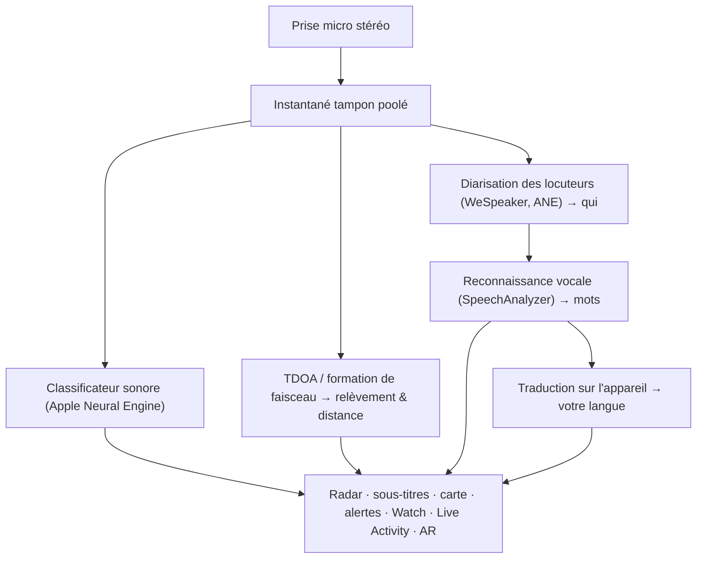

# Vigilant Ear 👂🛡️

*Un radar acoustique pour les personnes qui n'entendent pas.*

Une application conçue spécifiquement pour la communauté Sourde et malentendante. La plupart des applications de reconnaissance sonore vous disent *quel* est un son. **Vigilant Ear vous dit où il se trouve, qui le produit et ce qu'il dit** — transformant un iPhone en un tricordeur sonique en temps réel qui décrit le son autour de vous.

La direction et la distance d'une sirène. Un coup derrière vous. Les personnes d'une conversation, représentées sous forme de voix transcrites séparées — chacune sous-titrée et positionnée directionnellement. Si quelqu'un parle une langue que vous ne lisez pas, ses mots peuvent vous parvenir **traduits dans la vôtre.** Les alertes atteignent votre **écran de verrouillage, Dynamic Island et Apple Watch**, de sorte qu'un coup d'œil suffit.

Tout ce qui compte s'exécute sur l'appareil. L'audio n'est ni enregistré ni téléversé pour la reconnaissance. Rien ne dépend du fait d'entendre quoi que ce soit.

- 🧭 **La direction, pas seulement la détection.** *Quoi, où, qui* et *ce qui a été dit* — pas seulement « un son s'est produit ».
- 🔒 **Privé par conception.** La classification, le sous-titrage et la traduction s'exécutent sur votre iPhone. Les sous-titres sont en direct et éphémères ; ils ne sont pas enregistrés comme une archive de transcriptions.
- ⌚ **Sur votre poignet et l'écran de verrouillage.** Le compagnon directionnel Apple Watch + Live Activity gardent la dernière alerte et sa provenance à un regard de distance.
- 🛰️ **Plus de téléphones, une oreille partagée.** Constellation relie les iPhones Ultra-Wideband pour fusionner ce que chacun entend en une image directionnelle plus nette.
- 👁️ **Conçu pour les Sourds / malentendants.** Haptiques distinctes, visuels à fort contraste, indices indépendants de la couleur, grandes cibles de frappe, et respect de Reduce Motion partout.

---

## Pour qui c'est

- **Les utilisateurs sourds et malentendants** qui veulent une conscience situationnelle du son — Home Watch (coup, alarme, bébé, téléphone) et Street Watch (sirène, approche) que vous pouvez laisser actifs et auxquels vous pouvez faire confiance.
- Toute personne ayant besoin de **sous-titres en direct avec direction et séparation des locuteurs**, ou d'une **traduction sur l'appareil** des personnes assises à proximité.
- Les utilisateurs d'accessibilité et de recherche acoustique intéressés par la localisation sonore sur l'appareil.

> Vigilant Ear est une **aide** à l'accessibilité, pas un dispositif de sécurité certifié.

---

## Ce qu'il fait

### 🧭 Il voit le son — direction et distance
En utilisant les microphones stéréo de l'iPhone, Vigilant Ear estime le **relèvement et la distance approximative** des sons autour de vous et les place sous forme de marqueurs en direct sur un anneau radar orienté vers la tête et sur une carte. Déplacez-vous, et les marqueurs conservent leur position dans le monde réel. C'est le cœur : la conscience spatiale d'un monde que vous n'entendez pas.

### 🚨 Il reconnaît les sons importants — et vous prévient
Un classificateur sur l'appareil identifie des centaines de sons du quotidien et surveille les catégories critiques — **sirènes, alarmes, sonnettes/coups à la porte, pleurs de bébé, une personne à proximité et météo sévère.** Lorsqu'un son se déclenche, vous recevez une alerte claire à l'écran, une **notification push** optionnelle et un **retour haptique** distinct — même lorsque l'application est en arrière-plan ou le téléphone en veille. Les catégories critiques sont prêtes par défaut, de sorte qu'activer les notifications ne signifie pas « tout est désactivé ». Désactivez toutes les catégories d'alerte et le moteur se met complètement en hibernation en arrière-plan pour économiser la batterie.

Les avertissements météorologiques sévères proviennent de flux CAP publics officiels — **NWS** des États-Unis, **MeteoGate** en Europe, **CMA** en Chine et **KMA** en Corée — gratuits pour tous les utilisateurs. Les flux sont limités à ceux qui couvrent l'endroit où vous êtes.

### ⌚ Apple Watch + Live Activity — un regard suffit
- **Compagnon Apple Watch** — la direction d'une alerte s'affiche sur votre poignet, de sorte qu'un coup d'œil vous indique où regarder. Interface Watch repensée avec l'icône oreille de l'application, disposition HUD de menace, et double frappe pour minimiser. Les alertes peuvent toujours afficher la flèche de direction lorsque l'application Watch n'est pas ouverte.
- **Live Activity** — Vigilant Ear reste sur votre **écran de verrouillage**, dans le **Dynamic Island** et dans le **Watch Smart Stack**, de sorte que la dernière alerte et son relèvement sont toujours à un regard de distance.

### 💬 Speaker Mode — sous-titres en direct et directionnels *(gratuit)*
Activez **Speaker Mode** et Vigilant Ear retranscrit les personnes qui parlent près de vous en **blocs de sous-titres, un par voix.** La diarisation des locuteurs sur l'appareil maintient les voix distinctes — *qui* dit *quoi* — avec un indice directionnel sur l'anneau intérieur. Le locuteur en direct est mis en surbrillance ; le texte plus ancien défile lorsqu'il faut de la place. Les sous-titres sont gratuits ; la traduction automatique est la couche optionnelle Power Pack+.

### 🌐 Speaker Auto-Translate — votre langue, en direct *(Power Pack+)*
Avec Speaker Mode activé, lorsqu'une personne à proximité parle une autre langue, Vigilant Ear peut la détecter et afficher ses sous-titres **dans votre langue**, avec la langue source indiquée sur son bloc. La chaîne — entendre → séparer les locuteurs → transcrire → traduire → afficher — s'exécute **sur l'appareil** ; le seul moment réseau est un téléchargement unique de pack de langue depuis Apple. Vous n'avez pas besoin de connaître ni de choisir l'autre langue au préalable.

### 🎵 Conscience musicale et des diffusions *(Power Pack+)*
**ShazamKit** identifie la musique jouant autour de vous et suit les changements de chanson. Lorsqu'une voix semble provenir d'une télévision ou d'une radio plutôt que d'une personne dans la pièce, elle est étiquetée avec un **📻** — les mots s'affichent toujours ; ils sont étiquetés honnêtement.

### 🛰️ Constellation — plusieurs iPhones, une oreille partagée *(Power Pack+)*
Avec deux iPhones ou plus compatibles Ultra-Wideband (la plupart depuis l'iPhone 11), **Constellation** les associe pour qu'ils puissent détecter mutuellement leur position et fusionner ce que chacun entend en une image unique et plus précise de l'origine d'un son — un réseau d'écoute passif et distribué. Limité aux appareils disposant du matériel adéquat. Les sous-titres maillés plus anciens que l'heure de connexion d'un pair ne sont pas retransmis.

### 📷 Caméra AR — « voir le son » *(aperçu)*
Ouvrez la pilule caméra sur la barre de titre et épinglez les sons détectés à leur vrai relèvement dans la vue caméra en direct. Les marqueurs se regroupent par locuteur ou par catégorie de son et direction pour que la vue reste lisible ; les sources s'estompent avec l'âge lorsqu'elles se taisent.

### 🗺️ Cartes, routes et prédiction de trajectoire
Les relèvements sonores se projettent sur de vraies coordonnées GPS sur la carte. Les sons de véhicules peuvent être **alignés sur les rues à proximité** et leurs trajectoires prédites, de sorte qu'un camion qui passe se lit comme se déplaçant *le long de la route* plutôt qu'à travers les bâtiments. (Essayez la démo du camion de pompiers.)

### 🪄 Demo Mode — prouvez-le sans oreilles
**Demo Mode** est public pour tout le monde : pratique Home & Street (coup, alarme, bébé, sirène, météo), démos multi-téléphones et conversation, et un filigrane clair **DEMO :** pour que la pratique ne prétende jamais être un événement en direct. La fermeture du panneau démonte proprement les démos (pas de spoof GPS coincé, pas de drapeaux restants).

### ♿ L'accessibilité d'abord
Conçu pour les utilisateurs sourds / malentendants et daltoniens : indices **indépendants de la couleur**, cibles de frappe **≥44 pt**, respect de **Reduce Motion**, alertes multimodales (haptique + visuel + Watch), et un écran de vérification au démarrage qui montre l'état des permissions en vert / gris / rouge clairs (et orange brûlé « non autorisé ») — y compris l'autorisation de notification qui agit comme l'interrupteur maître des alertes.

---

## Gratuit & Power Pack+

Le cœur de la sécurité est **gratuit, pour toujours** :

- **Home Watch & Street Watch** — alertes sonores locales (alarmes, sirènes, coups/sonnettes, bébé, personne à proximité) avec diffusion à l'écran, haptique et push optionnelle.
- **Sous-titres en direct** — Speaker Mode, sur l'appareil, directionnels lorsque le matériel le permet.
- **CAP météo sévère** — NWS, MeteoGate, CMA, KMA pour votre région.
- **Demo Mode** — alertes d'entraînement et aperçus de fonctionnalités avec un filigrane DEMO.
- **Compagnon Apple Watch & Live Activity** — direction et dernière alerte d'un coup d'œil.

**Power Pack+** est un déblocage unique (**pas un abonnement**) avec un **essai gratuit de 90 jours**. Il ajoute les superpouvoirs :

- **Speaker Auto-Translate** — traduction sur l'appareil de la parole à proximité dans votre langue.
- **Constellation** — audition partagée multi-iPhone via Ultra-Wideband.
- **Music ID** — reconnaissance de chansons ShazamKit.

Gratuit ou Power Pack+, **votre audio reste sur l'appareil pour la reconnaissance** — le niveau ne change que les fonctionnalités débloquées, jamais l'endroit où l'audio brut est envoyé pour analyse.

---

## Comment ça fonctionne (sous le capot)

Vigilant Ear est un pipeline **local d'abord, sur l'appareil**. L'audio brut est capturé sur une prise de priorité élevée, copié dans une **liste libre de tampons poolés** (pas d'allocation thrash sur le chemin temps réel), et redistribué vers des processeurs indépendants sans bloquer l'interface ni interrompre le streamer :

- **Mathématiques spatiales** — FFT, Time-Difference-of-Arrival et suivi Doppler sur des tâches en arrière-plan.
- **Parole** — `SpeechAnalyzer` / `SpeechTranscriber` d'iOS 26 pour la transcription ; embeddings **WeSpeaker** pour l'identité vocale ; framework **Translation** d'Apple pour la traduction sur l'appareil.
- **Concurrence** — l'isolation Swift 6 maintient la prise microphone, les mathématiques acoustiques et la boucle de rendu de l'interface proprement séparées.
- **Efficacité** — le sous-échantillonnage et la classification adaptative à la charge gardent l'écoute permanente assez légère pour la laisser active.

---

## Confidentialité

- **Sur l'appareil, toujours pour le pipeline principal.** La classification, les mathématiques spatiales, la transcription, la diarisation et la traduction s'exécutent sur votre iPhone. L'audio brut n'est ni enregistré ni téléversé pour la reconnaissance.
- **Les sous-titres sont éphémères.** Les sous-titres en direct restent en mémoire pour la session ; les journaux de débogage exportés n'incluent pas le texte des sous-titres.
- **Pas de SDK de publicité ni d'analyse comportementale.** L'usage réseau limité est uniquement pour les cartes, les flux météo publics, les empreintes Shazam optionnelles, le contexte routier et les achats App Store — voir la politique complète.

Détails complets : [PRIVACY.md](PRIVACY.md) · [TERMS.md](TERMS.md) · [SUPPORT.md](SUPPORT.md)

---

## Matériel et plateformes

- **iPhone (expérience complète).** Microphones stéréo requis pour la localisation directionnelle. **iPhone 13 ou plus récent** recommandé.
- **Apple Watch.** Alertes compagnon avec flèche de direction ; fonctionne avec Live Activity / Smart Stack.
- **iPad (axé sous-titres).** Micros monocanal → sous-titres sans direction complète.
- **Constellation** nécessite l'**Ultra-Wideband** — iPhone 11 ou plus récent, à l'exclusion des modèles SE et « e ».
- **Android.** Build séparé avec radar de base, alertes, sous-titres et météo ; le maillage Constellation est d'abord sur iOS. Voir les mises à jour du site produit à mesure que la parité Android grandit.

**Version marketing Apple actuelle :** 1.0.7 (en cours / voie de livraison). Conçu pour iOS moderne (ère SpeechAnalyzer).

---

## Localisation

Entièrement localisé — interface, alertes et sous-titres — en **anglais, espagnol, portugais (Brésil), français, allemand, arabe, japonais, chinois simplifié et coréen** (9 langues). Suit la locale du système ou un choix manuel dans l'application.

---

## Statut et avertissement

Vigilant Ear est une **aide expérimentale d'accessibilité acoustique**, pas un utilitaire de sécurité certifié. La résolution de localisation varie selon l'environnement, la météo, le vent et le matériel microphonique. **Maintenez toujours votre conscience environnementale normale** — ne vous y fiez pas comme unique source d'informations de sécurité.

Certaines capacités (marqueurs AR caméra, mise à niveau de l'entitlement Critical Alerts lorsque accordée par Apple, création avancée de packs sonores multi-packs) continuent d'évoluer ; la surveillance Home / Street gratuite et les sous-titres en direct sont le produit auquel vous pouvez faire confiance dès le premier jour.

---

**Contact :** [vigilantear@wingdingssocial.com](mailto:vigilantear@wingdingssocial.com)

Fait avec ❤️ pour la communauté D/HH et la recherche acoustique.

    
  <strong>© 2026 Wingdings, Inc.</strong> 
  All rights reserved. 
  Patent Pending

