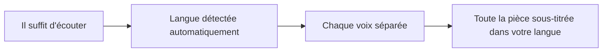
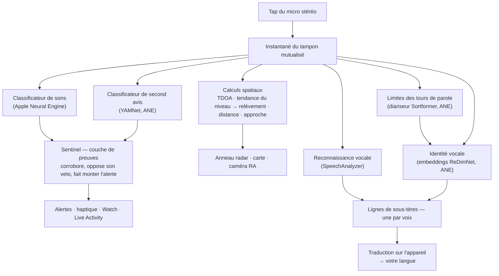
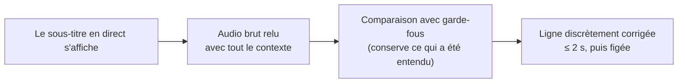
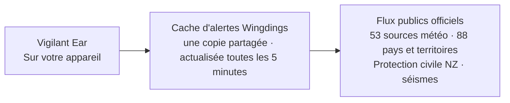

# Vigilant Ear 👂🛡️

*En vigueur à partir de la version 1.1.9 · septembre 2026.*

## Un radar acoustique pour les personnes qui n'entendent pas.

Une app conçue spécialement pour la communauté sourde, malentendante et CODA. La plupart des apps de reconnaissance sonore vous disent *ce qu'est* un son. **Vigilant Ear vous dit où il se trouve, qui le produit et ce qui se dit** — et transforme un iPhone en tricordeur sonore en temps réel qui décrit les sons qui vous entourent.

La direction et la distance d'une sirène. On frappe derrière vous. Les participants d'une conversation, affichés comme autant de voix transcrites distinctes — chacune sous-titrée et placée selon sa direction. Si quelqu'un parle une langue que vous ne lisez pas, ses paroles peuvent vous parvenir **traduites dans la vôtre.** Les alertes arrivent sur votre **écran de verrouillage, dans la Dynamic Island et sur votre Apple Watch** : un coup d'œil suffit.

Tout ce qui compte s'exécute sur l'appareil. L'audio n'est ni enregistré ni envoyé en ligne pour la reconnaissance. Rien n'exige d'entendre quoi que ce soit.

- 🧭 **La direction, pas seulement la détection.** *Quoi, où, qui,* et *ce qui a été dit* — pas simplement « un son s'est produit ».
- 📣 **Nom appelé.** Ajoutez votre nom, celui d'un enfant, d'un partenaire — « commande pour Marie prête » déclenche un tapotement sur la montre et indique la direction.
- 🔒 **Confidentiel dès la conception.** La classification, le sous-titrage et la traduction s'exécutent sur votre iPhone. Les sous-titres sont en direct et éphémères ; ils ne sont pas conservés sous forme d'archive de transcriptions.
- ⌚ **À votre poignet et sur l'écran de verrouillage.** Le compagnon Apple Watch pour la direction + la Live Activity gardent la dernière alerte et sa provenance à portée de regard.
- 🛰️ **Plus de téléphones, une seule oreille partagée.** Constellation relie des iPhone dotés de l'Ultra-Wideband pour fusionner ce que chacun entend en une image directionnelle plus nette.
- 👁️ **Conçu pour les personnes sourdes, malentendantes et CODA.** Retours haptiques distincts, visuels à fort contraste, repères indépendants de la couleur, grandes zones tactiles et respect du réglage Réduire les animations dans toute l'app.

---

## À qui il s'adresse

- **Les utilisateurs sourds, malentendants et CODA** qui veulent une conscience situationnelle des sons — Home Watch (coup à la porte, alarme, bébé, téléphone) et Street Watch (sirène, approche), à laisser activés en toute confiance.
- Toute personne qui a besoin de **sous-titres en direct avec direction et séparation des locuteurs**, ou d'une **traduction sur l'appareil** des personnes assises à proximité.
- Les utilisateurs du monde de l'accessibilité et de la recherche acoustique qui s'intéressent à la localisation des sons sur l'appareil.

> Vigilant Ear est une **aide** à l'accessibilité, et non un dispositif certifié de sécurité des personnes.

---

## Ce qu'il fait

### 🧭 Il voit le son — direction et distance
Grâce aux deux microphones de l'iPhone, Vigilant Ear mesure **l'angle d'un son et s'il se trouve devant ou derrière vous**, maintient cette mesure stable à environ un degré près et la place sous forme de marqueur en direct sur un anneau radar orienté cap en haut et sur une carte. Deux microphones alignés ne peuvent pas, à eux seuls, distinguer la gauche de la droite — un son à 50° sur votre droite et un autre à 50° sur votre gauche arrivent avec le même infime écart de temps — l'app affiche donc la mesure accompagnée d'un **fantôme plus pâle du côté opposé**, et un mouvement du poignet ou un second téléphone tranche la question. La distance est estimée à partir du volume sonore, d'après une courbe étalonnée dans la rue, et affichée pour ce qu'elle est, une estimation : *≈ 50 ft*, avec une fourchette probable — dans les unités du pays où vous vous trouvez, et non dans celles de la langue dans laquelle vous lisez l'app. Déplacez-vous : les marqueurs conservent leur position dans le monde réel. C'est le cœur de l'app : la perception spatiale d'un monde que vous ne pouvez pas entendre. (Chiffres plus bas.)

### 🚨 Il reconnaît les sons importants — et vous avertit
Un classificateur embarqué identifie des centaines de sons du quotidien et surveille les catégories critiques — **sirènes, alarmes — dont une classe dédiée aux alarmes de voiture — sonnettes/coups à la porte, pleurs de bébé, une personne à proximité et météo violente.** Quand l'une d'elles se déclenche, vous recevez une alerte claire à l'écran, une **notification push** facultative et un retour **haptique** distinctif — même lorsque l'app est en arrière-plan ou que le téléphone est en veille. Les catégories critiques sont prêtes par défaut : activer les notifications ne veut donc pas dire « tout est désactivé ». Désactivez toutes les catégories d'alerte et le moteur hiberne complètement en arrière-plan pour économiser la batterie. Une couche **Sentinel** recoupe les alertes avec des preuves indépendantes — direction, mouvement et flux publics — pour que ce qui se déclenche soit corroboré, et non la supposition isolée d'un classificateur. Cela fonctionne dans les deux sens : un passage d'une chanson qui ressemble à une sirène est retenu, mais une vraie sirène qui se répète à travers votre musique passe outre et déclenche l'alerte.

Les alertes de météo violente proviennent de **53 sources gouvernementales officielles couvrant 88 pays et territoires** — gratuites pour tous les utilisateurs. Les alertes de protection civile de la Nouvelle-Zélande sont aussi incluses, avec leur propre interrupteur **Alertes d'urgence**. Seuls les flux qui couvrent l'endroit où vous vous trouvez sont retenus. Au Japon, l'app lit aussi les **bulletins anticipés** du service météorologique national — les avis en langage courant publiés plusieurs jours avant un typhon ou de fortes pluies, et pas seulement les alertes émises une fois le danger arrivé — ainsi que les bulletins d'averses soudaines et de glissements de terrain. Les avis anticipés s'affichent discrètement, sans le son ni la vibration réservés à une véritable alerte.

### ⌚ Apple Watch + Live Activity — un regard, et vous savez
- **Compagnon Apple Watch** — la direction d'une alerte s'affiche sur votre poignet : un coup d'œil vous dit où regarder. Interface Watch repensée, avec l'icône d'oreille de l'app, une disposition de type HUD pour les menaces et un double toucher pour fermer une alerte. Les alertes peuvent afficher la flèche de direction même lorsque l'app Watch n'est pas ouverte.
- **Live Activity** — Vigilant Ear reste sur votre **écran de verrouillage**, dans la **Dynamic Island** et dans la **Pile intelligente de la Watch**, pour que la dernière alerte et son relèvement soient toujours à portée de regard.
- **Alertes des partenaires à votre poignet** — quand le téléphone d'un partenaire Constellation lié déclenche une alerte, celle-ci peut aussi parvenir à votre Watch, direction comprise. Un travail de fiabilisation permet au compagnon de ménager la batterie de la Watch toute la journée.

### 💬 Speaker Mode — sous-titres en direct et directionnels *(gratuit)*
Activez le **Speaker Mode** et Vigilant Ear transcrit les personnes qui parlent près de vous en **blocs de sous-titres, un par voix.** La diarisation des locuteurs, réalisée sur l'appareil, garde les voix distinctes — *qui* dit *quoi* — avec un repère de direction sur l'anneau intérieur. La personne qui parle est mise en évidence ; le texte plus ancien défile hors de vue quand la place vient à manquer.

Deux choses que la plupart des apps de sous-titrage ne font pas : **l'honnêteté sur le degré de confiance** — une discrète marque de qualité sur chaque ligne et des soulignements en pointillés sous les mots douteux vous indiquent quand vous fier à une ligne et quand la revérifier — et **l'autocorrection** : juste après l'arrivée d'une phrase, l'app relit l'audio avec tout le contexte et peut rétablir un mot manqué ou mal compris en deux secondes environ, puis le texte se fige.

**Nom appelé** (Préférences, désactivé jusqu'à ce que vous l'activiez) surveille ces sous-titres pour y repérer les noms que vous avez listés — le vôtre, celui d'un enfant, d'un partenaire. Quand quelqu'un dit « commande pour Marie prête », vous recevez un retour haptique distinct et une alerte sur la Watch avec la direction, et non une bulle de sous-titre de plus. Les mots apparaissent toujours dans le Speaker Mode comme de la parole ; ce tapotement vous indique que c'est *à vous* que l'on parlait.

**Le langage grossier peut être masqué** (Préférences → Sous-titres). Sans cela, les jurons s'affichent en clair, sans rien pour les atténuer, et la personne qui lit n'a aucune chance de détourner le regard avant ; activez cette option et ces mots sont remplacés par des symboles, si bien que la phrase reste lisible sans le mot. C'est la reconnaissance vocale de votre propre appareil qui décide de ce qui est grossier — pas une liste de mots établie par nous — elle suit donc la langue transcrite. Sur un compte déclaré de moins de 18 ans, l'option est toujours activée et affiche un cadenas. Elle s'applique à la parole que *cet* appareil transcrit ; le texte relayé depuis un téléphone jumelé a été transcrit sur celui-ci et arrive sous forme de texte finalisé.

**Le mot sur lequel un locuteur insiste est mis en gras.** À l'oral, « Je n'ai pas dit ÇA » et « Je n'ai pas dit ça » sont deux phrases différentes, et une transcription identique fait entièrement disparaître la différence. L'app guette l'unique mot sur lequel la voix d'un locuteur monte dans les aigus et le met en gras — au plus un par ligne, et aucun quand elle n'est pas sûre, car marquer le mauvais mot, c'est faire dire à quelqu'un ce qu'il n'a pas dit. Désactivé en chinois et en japonais, où la hauteur indique *de quel mot il s'agit* plutôt que l'insistance avec laquelle il a été prononcé.

Les sous-titres sont gratuits ; la traduction automatique est la couche facultative de Power Pack+. Les sous-titres peuvent aussi être **lus à voix haute sur vos appareils auditifs Bluetooth** — gratuitement, dans les Préférences. Les **Tonalités de direction** (gratuites elles aussi, dans Préférences → Sous-titres) ajoutent un signal sonore facultatif, dans l'oreille de votre choix, qui indique où se trouve un locuteur — utile avec un appareil auditif ou une audition unilatérale, et accessible à tous.

### 🌐 Traduction automatique — votre langue, en direct *(Power Pack+)*
Avec le Speaker Mode activé, quand une personne à proximité parle une autre langue, Vigilant Ear peut la détecter et afficher ses sous-titres **dans votre langue**, avec la langue source indiquée sur son bloc. La chaîne — entendre → séparer les locuteurs → transcrire → traduire → afficher — s'exécute **sur l'appareil** ; le seul moment où le réseau intervient est le téléchargement unique d'un pack de langue fourni par Apple, et quand c'est ce téléchargement que vous attendez, l'app vous le dit au lieu de vous laisser devant un texte non traduit. Vous n'avez pas besoin de connaître ni de choisir l'autre langue à l'avance.

C'est, parmi les produits disponibles, ce qui se rapproche le plus du **traducteur universel de la science-fiction** — l'appareil qui comprend, tout simplement. Vigilant Ear détecte la langue de lui-même, suit chaque personne qui parle dans la pièce et les sous-titre toutes dans votre langue — sans écouteurs, sans configuration, sur votre appareil.

```mermaid
graph LR
    A["Il suffit d'écouter"] --> B["Langue détectée automatiquement"] --> C["Chaque voix séparée"] --> D["Toute la pièce sous-titrée dans votre langue"]
```

### 🎵 Perception de la musique et des diffusions *(Power Pack+)*
**ShazamKit** identifie la musique qui passe autour de vous et suit les changements de morceau.

### 🎛️ Acoustic Scope — voir le son comme un ingénieur
Une vue professionnelle et en direct du son qui vous entoure : spectre, spectrogramme, bandes RTA au ⅓ d'octave, chroma et partiels harmoniques — **gratuite pour tous**. **La vue Partiels lit la musique :** chaque son pur est désigné par sa note, avec sa série harmonique à côté ; les sons plus aigus, comme ceux des détecteurs de fumée, sont nommés à leur hauteur réelle, et vous pouvez définir une note cible, tracée sous forme de ligne, sur laquelle chanter ou vous accorder. L'Acoustic Scope ne fait pas chauffer l'appareil — laisser le Spectrogramme ouvert ne coûte presque rien, quelle que soit la durée pendant laquelle vous le regardez. Les outils de capture de sons servant à entraîner vos propres packs personnalisés font partie de Power Pack+.

### 📦 Packs de sons personnalisés — apprenez-lui votre univers *(Power Pack+)*
Apprenez à Vigilant Ear les sons qui comptent pour vous — des oiseaux de votre région au carillon de la porte de votre immeuble. Les packs complémentaires s'ajoutent à la détection intégrée, si bien que les nouveaux sons n'évincent jamais les sirènes et les alarmes. Un guide pas à pas est intégré à l'app.

### 🛰️ Constellation — plusieurs iPhone, une seule oreille partagée *(Power Pack+)*
Avec au moins deux iPhone compatibles Ultra-Wideband (la plupart des modèles depuis l'iPhone 11), **Constellation** les associe pour qu'ils perçoivent la position les uns des autres et fusionnent ce que chacun entend en une image unique et plus précise de la provenance d'un son — un réseau d'écoute distribué et passif. Les sous-titres sont fusionnés eux aussi : chaque téléphone transcrit ce qu'entend son propre microphone, et les mots sont alignés d'un téléphone à l'autre pour que celui qui est le plus proche d'un locuteur apporte ce qu'il a entendu — les mots captés par un seul téléphone sont conservés plutôt que perdus. Les téléphones se connectent **directement entre eux** — sans routeur, sans réseau Wi-Fi partagé et sans internet ; il suffit que le Wi-Fi soit activé, via la même liaison pair-à-pair que celle d'AirDrop. Réservé aux appareils dotés du matériel adéquat. Les sous-titres du maillage antérieurs à l'heure de connexion d'un pair ne sont pas retransmis.

**Messages aux partenaires** — envoyez un court message texte au téléphone d'un partenaire lié ; il arrive dans son fil de sous-titres et peut lui parvenir traduit dans sa langue, sur l'appareil. La messagerie tient compte de l'âge : reposant sur Declared Age Range d'Apple, elle maintient désactivés les échanges de messages entre un adulte et un mineur, sauf si les deux personnes se sont délibérément nommées l'une l'autre. Les alertes et les sous-titres ne sont jamais restreints — seuls les messages de personne à personne le sont.

### 🔗 Remote Link — joindre quelqu'un qui n'est pas avec vous *(Power Pack+ pour démarrer)*
Ce que ferait normalement un appel téléphonique, mais avec de la vidéo et du texte. Vous envoyez un code d'invitation ; l'autre personne rejoint la liaison depuis Vigilant Ear **sans posséder Power Pack+**. Contrairement à Constellation, aucune proximité n'est requise — vous pouvez être n'importe où, l'un comme l'autre.

**Aucun audio n'est utilisé, à aucun moment.** Vidéo et texte uniquement : rien dans la liaison ne dépend de l'audition, d'un côté comme de l'autre — et cela vous donne un moyen d'échanger en langue des signes avec quelqu'un via l'app. L'app elle-même ne comprend pas la langue des signes ; elle transporte la vidéo et vous faites le reste, à deux. La connexion est directe entre les deux téléphones partout où le réseau le permet, et l'app vous indique clairement si elle est en **Direct** ou en **Relayed**, pour que vous sachiez toujours si votre vidéo passe par un relais.

**Les sous-titres voyagent aussi.** Ce que chaque téléphone transcrit s'affiche sur l'autre, traduit dans la langue de la personne qui lit quand c'est nécessaire. Chacun de vous peut mettre la liaison en pause — vidéo et sous-titres — puis la reprendre, et raccrocher depuis l'écran principal.

### 📷 Caméra RA — « voir le son »
Ouvrez la pastille caméra dans la barre de titre et épinglez les sons détectés à leur relèvement réel dans la vue caméra en direct. Les marqueurs se regroupent par locuteur, ou par catégorie de son et par direction, pour que la vue reste lisible ; les sources s'estompent peu à peu quand elles se taisent.

### 🗺️ Cartes, routes et prédiction de trajectoire
Les relèvements sonores sont projetés sur de vraies coordonnées GPS sur la carte. Les bruits de véhicules peuvent être **rattachés aux rues voisines** et leurs trajectoires prédites, pour qu'un camion qui passe apparaisse comme se déplaçant *le long de la route* et non à travers les bâtiments. (Essayez la démo du camion de pompiers.)

### 🪄 Feature Playground — la preuve, sans les oreilles
Le **Feature Playground** est accessible à tous : entraînement Maison et rue (coup à la porte, alarme, bébé, sirène, météo), démos multi-téléphones et de conversation, et un filigrane bien visible pour qu'un exercice ne se fasse jamais passer pour un événement réel. Fermer le panneau arrête proprement les démos (pas de fausse position GPS bloquée, pas d'indicateurs résiduels).

### ♿ L'accessibilité d'abord
Conçu pour les utilisateurs sourds / malentendants / CODA et daltoniens : repères **indépendants de la couleur**, zones tactiles de **≥44 pt**, respect du réglage **Réduire les animations**, **mises en page de droite à gauche** pour les lecteurs de l'arabe, alertes multimodales (haptique + visuel + Watch), et un écran de vérification au démarrage qui affiche l'état des autorisations avec des états vert / gris / rouge bien lisibles (et orange brûlé pour « non autorisé ») — y compris l'autorisation des notifications, qui sert d'interrupteur principal des alertes.

---

## Gratuit et Power Pack+

Le socle de sécurité est **gratuit, pour toujours** :

- **Home Watch et Street Watch** — alertes sonores locales (alarmes, sirènes, coups à la porte/sonnettes, bébé, personne à proximité), transmises à l'écran, par retour haptique et, en option, par notification push.
- **Sous-titres en direct** — Speaker Mode, sur l'appareil, directionnels quand le matériel le permet, avec des marques de confiance honnêtes, une autocorrection en ~2 secondes, une lecture à voix haute facultative vers les appareils auditifs Bluetooth, et les Tonalités de direction.
- **Nom appelé** — des noms facultatifs que vous saisissez (le vôtre, ceux de vos enfants, de votre partenaire). Une correspondance déclenche une alerte Watch/téléphone avec le relèvement, et non un second sous-titre.
- **Standing Watch** — l'état propre de la pièce, toujours actif, sans rien à configurer : un voyant cyan fixe tant que la pièce garde son profil habituel, ambre quand quelque chose change — une nouvelle voix, un silence soudain ou quelque chose qui approche.
- **Alertes de météo violente** — alertes officielles pour votre région, issues de 53 sources gouvernementales dans 88 pays et territoires.
- **Alertes sismiques (monde entier)** — sentez une vibration et voyez sur votre carte la zone où la secousse a été ressentie lorsqu'un séisme est signalé à proximité. Une confirmation issue du flux sismique officiel — pas une alerte précoce : si vous avez senti une secousse, elle vous dit ce que c'était. La détection sur l'appareil des grondements profonds (infrasons) peut armer la vérification dès que le sol bouge.
- **Feature Playground** — alertes d'entraînement et aperçus des fonctionnalités, avec un filigrane APERÇU bien visible.
- **Compagnon Apple Watch et Live Activity** — la direction et la dernière alerte, d'un coup d'œil.
- **Acoustic Scope** — visualisation du son en direct de niveau professionnel, gratuite pour tous. (Les outils de capture pour l'entraînement relèvent de Power Pack+.)

**Power Pack+** est un déblocage unique (**pas un abonnement**) avec un **essai gratuit de 90 jours**. Il ajoute les superpouvoirs :

- **Traduction automatique** — traduction sur l'appareil des paroles prononcées autour de vous, dans votre langue.
- **Constellation** — écoute partagée entre plusieurs iPhone via l'Ultra-Wideband, avec messages aux partenaires.
- **Music ID** — reconnaissance des morceaux par ShazamKit.
- **Packs de sons personnalisés** — des classificateurs complémentaires que vous entraînez pour vos propres sons.

Gratuit ou Power Pack+, **votre audio reste sur l'appareil pour la reconnaissance** — l'offre ne change que les fonctionnalités débloquées, jamais l'endroit où l'audio brut est envoyé pour être analysé.

---

## Comment ça marche (sous le capot)

Vigilant Ear est un pipeline **local d'abord, sur l'appareil**, construit en couches : capturer une seule fois, puis laisser des spécialistes indépendants lire le même son et vérifier le travail les uns des autres. L'audio brut est prélevé sur un tap audio à haute priorité, copié dans une **liste libre de tampons mutualisés** (pas d'emballement des allocations sur le chemin temps réel), puis distribué sans bloquer l'interface :

```mermaid
graph TD
    A["Tap du micro stéréo"] --> B["Instantané du tampon mutualisé"]
    B --> C["Classificateur de sons<br/>(Apple Neural Engine)"]
    B --> Y["Classificateur de second avis<br/>(YAMNet, ANE)"]
    C --> S["Sentinel — couche de preuves<br/>corrobore, oppose son veto, fait monter l'alerte"]
    Y --> S
    S --> H["Alertes · haptique · Watch · Live Activity"]
    B --> D["Calculs spatiaux<br/>TDOA · tendance du niveau → relèvement · distance · approche"]
    D --> R["Anneau radar · carte · caméra RA"]
    B --> F["Reconnaissance vocale<br/>(SpeechAnalyzer)"]
    B --> N["Limites des tours de parole<br/>(diariseur Sortformer, ANE)"]
    N --> E["Identité vocale<br/>(embeddings ReDimNet, ANE)"]
    B --> E
    F --> G["Lignes de sous-titres — une par voix"]
    E --> G
    G --> T["Traduction sur l'appareil<br/>→ votre langue"]
```

Aucun modèle ne fait foi à lui seul. La couche **Sentinel** se place entre la détection et l'alerte : des moteurs indépendants se corroborent ou s'opposent mutuellement leur veto, trame par trame — et quand des preuves répétées issues du monde réel s'accumulent contre un veto (une vraie sirène qui hurle à travers votre musique), les preuves l'emportent et l'alerte se déclenche.

Les sous-titres ont droit à leur propre seconde chance. Chaque phrase finalisée est discrètement relue, avec tout son contexte, depuis un court tampon audio circulaire en mémoire — les corrections arrivent en deux secondes environ, puis le texte se fige pour de bon :

```mermaid
graph LR
    L["Le sous-titre en direct s'affiche"] --> K["Audio brut relu<br/>avec tout le contexte"] --> V["Comparaison avec garde-fous<br/>(conserve ce qui a été entendu)"] --> W["Ligne discrètement corrigée<br/>≤ 2 s, puis figée"]
```

- **Calculs spatiaux** — FFT, différence de temps d'arrivée pondérée par la cohérence (TDOA — privilégier les bandes de fréquences sur lesquelles les deux microphones s'accordent, puis convertir l'infime décalage d'arrivée en relèvement) et suivi d'approche par tendance du niveau, dans des tâches d'arrière-plan. La paire de microphones est lue dans une orientation fixe, pour que la direction fonctionne de la même façon, que vous teniez le téléphone à la verticale ou à l'horizontale.
- **Parole** — `SpeechAnalyzer` / `SpeechTranscriber` d'iOS 26 pour la transcription ; le framework **Translation** d'Apple pour la traduction sur l'appareil. L'identité vocale repose sur des preuves : une voix n'est confirmée comme celle d'une personne réelle qu'à partir de fenêtres sonores indépendantes, et une correspondance incertaine s'affiche comme non attribuée plutôt que de deviner le mauvais nom.
- **Deux modèles pour deux questions** — distinguer les voix exige de savoir *quand le locuteur a changé* et *qui est ce locuteur*, et ce n'est pas le même problème. Un diariseur en streaming **Sortformer** marque les limites des tours de parole ; des embeddings **ReDimNet** déterminent à qui appartient la voix à l'intérieur de chacun. Couper exactement à la limite compte plus qu'il n'y paraît : une fenêtre à cheval sur deux personnes les contient toutes les deux, et aucun modèle d'embeddings ne peut le défaire après coup. Sous les deux se trouve un socle de détection d'activité vocale — si le diariseur se tait dans une pièce difficile au lieu de deviner, les tours de parole sont quand même découpés, si bien que l'app se dégrade au lieu de fondre deux locuteurs en un seul.
- **La vérité sur la musique** — un **détecteur de signature de morceau** fondé sur le chroma est seul juge de la question « de la musique joue-t-elle vraiment ? », car les classificateurs généralistes sont réputés pour qualifier de « musique » des pièces silencieuses et des sirènes. Shazam ne se lance qu'une fois que la signature confirme qu'il y a vraiment quelque chose de musical.
- **Concurrence** — l'isolation de Swift 6 garde nettement séparés le tap du microphone, les calculs acoustiques et la boucle de rendu de l'interface.
- **Efficacité** — le sous-échantillonnage, une classification qui s'adapte à la charge et un usage du réseau conditionné par les preuves rendent l'écoute permanente assez légère pour rester activée.

Les alertes météo et sismiques suivent le chemin inverse de l'audio — rien de ce qui concerne vos sons ne sort jamais, mais des *données* d'alerte arrivent. **Chaque** flux officiel passe par un petit cache que nous exploitons, si bien qu'une seule récupération des données publiques sert tous les utilisateurs — et votre téléphone ne contacte jamais les serveurs d'un gouvernement étranger :

```mermaid
graph LR
    P1["Vigilant Ear<br/>Sur votre appareil"] --> W["Cache d'alertes Wingdings<br/>une copie partagée · actualisée toutes les 5 minutes"]
    W --> N["Flux publics officiels<br/>53 sources météo · 88 pays et territoires<br/>Protection civile NZ · séismes"]
```

---

## Ce que votre téléphone peut entendre — mesures à l'appui

Votre iPhone possède deux microphones distants d'environ six pouces, un baromètre et une très bonne horloge. Cela suffit pour vous dire dans quelle direction se trouve un son, à peu près à quelle distance, s'il vient vers vous et si une porte vient de s'ouvrir. Voici la précision de chacune de ces mesures, la façon dont nous l'avons vérifiée, et pourquoi elle compte si vous ne pouvez pas entendre le son vous-même. La direction et les chiffres associés ont été mesurés sur un iPhone 17 et un iPhone 16 Pro Max en septembre 2026. La distance reste par nature une estimation — nous le disons à l'écran.

**Direction — à un ou deux degrés près.** Un son atteint le microphone du haut avant celui du bas, ou après, et à partir de cet écart l'app calcule de combien le son s'écarte de l'axe du téléphone et s'il se trouve devant ou derrière. Les deux canaux du téléphone ne sont pas de simples microphones mais une image stéréo traitée, et cette image ajoute un motif fixe qui lui est propre dès qu'une pièce est bruyante. L'app apprend désormais ce motif pendant quelques secondes de calme après le lancement et le retire avant de lire la direction.

| Ce que nous avons mesuré | Résultat |
|---|---|
| Erreur médiane sur 96 pièces simulées, du bureau calme à la pièce aux murs durs avec un rapport signal/bruit de 5 dB | 1,0° |
| iPhone 17 sur un bureau, bruit ambiant activé, haut-parleur à 30° de l'axe | 61,7° lus depuis le plan latéral pour 60° attendus, fluctuation de 1,6° |
| Idem, haut-parleur directement sur le côté du téléphone | 4,5° lus pour 0° attendu, fluctuation de 2,2° |
| Idem, haut-parleur droit devant | toutes les lectures au délai maximal, comme il se doit |
| Lectures tombant sur le motif propre à l'image plutôt que sur le son | aucune, quel que soit l'angle |

*Pourquoi c'est important :* si vous n'entendez pas une sirène, « derrière vous, sur le côté » vous dit où regarder. Une mesure stable ne mérite la confiance qu'une fois vérifiée au mètre ruban, et celle-ci l'a été, deux fois, la seconde après que la première vérification s'est révélée trop indulgente.

**Distance — affichée pour ce qu'elle est : une estimation.** Un seul microphone ne peut pas mesurer la distance, seulement le volume sonore, et un camion bruyant au loin peut sonner comme une voiture discrète toute proche. L'app estime la distance à partir du volume grâce à une courbe ajustée dans une vraie rue, puis l'énonce comme le ferait une personne prudente : *environ 50 ft, probablement entre 25 et 100.*

| Ce que nous avons mesuré | Résultat |
|---|---|
| Détections réelles de voitures rejouées à travers l'étalonnage | 1 131 |
| Situées dans les limites de la route de 100 pieds où elles se trouvaient réellement | 73% |
| Voitures sur la voie la plus éloignée | estimées à 78 et 87 ft là où le mètre ruban indiquait 73 et 85 ft |

La route (un carrefour urbain) a été mesurée voie par voie ; quand la courbe se trompe, c'est dans le sens du plus proche. L'étalonnage est verrouillé par un test automatisé pour qu'il ne puisse pas dériver en silence. Les alarmes situées dans votre propre espace, comme un détecteur de fumée, n'ont aucune indication de distance — elles sont déjà dans la pièce avec vous.

**Mouvement — ce qui vient vers vous.** Pour les voitures et les sirènes, un son qui s'amplifie signifie généralement qu'il se rapproche. L'app observe à quelle vitesse le niveau d'un son monte sur quelques secondes : une hausse soutenue d'environ 1,5 dB par seconde (une augmentation nette et régulière du volume) signifie une approche, une baisse équivalente un éloignement, et un son qui cesse de varier n'est plus qualifié ni de l'un ni de l'autre au bout d'environ quatre secondes. Un seul moment fort — un petit coup de klaxon, une porte qui claque — ne peut pas le déclencher. Fondé sur la physique et neuf tests automatisés ; un passage enregistré dans la rue est la prochaine confirmation sur le terrain.

**L'air de la pièce — une porte a une signature.** Le baromètre peut remarquer une porte qui s'ouvre à environ quatorze pieds : la pression baisse quand la porte pivote, puis remonte quand elle se referme. Sur quatorze heures de calme et quinze événements de porte, chaque porte a produit cette forme en deux temps, et rien d'autre dans la maison ne l'a fait.

| Événement | Taux de variation de pression | Forme |
|---|---|---|
| Porte d'entrée, ouverte et fermée, ×10 | 0,6–1,8 Pa/s | baisse, puis remontée, à ~5 s d'intervalle |
| Porte d'entrée, claquée, ×5 | 1,1–2,5 Pa/s | même paire, plus marquée |
| Climatisation fonctionnant par cycles la nuit, ×8 | 0,11–0,46 Pa/s | rampe lente sur plusieurs minutes, identique sur les deux téléphones |
| Une pièce calme | ~0,02 Pa/s | rien |
| Passer à côté, éternuer | — | le capteur de mouvement le remarque et le téléphone l'ignore |

Une porte moustiquaire, qui ne ferme pas la pièce hermétiquement, est restée invisible — exactement comme il se doit. Aujourd'hui, une variation de pression peut apparaître sous forme de grondements profonds sur la carte ; une alerte de porte dédiée aux nuits calmes est mesurée et conçue, mais ce n'est pas encore le comportement par défaut au quotidien.

**Constellation — deux téléphones tranchent la question du côté.** Chaque téléphone du maillage trace une ligne vers le son depuis sa position, et les lignes ne se croisent nettement que d'un seul côté. Quand c'est le cas, le fantôme disparaît et l'app peut de nouveau dire gauche ou droite. En simulation, deux téléphones **distants de 40 mètres** situent une sirène à 50 mètres à environ 2 mètres près.

**Comment une affirmation, ici, devient crédible.** Chaque chiffre est passé par les trois mêmes étapes, dans l'ordre : une pièce simulée dont on connaît la réponse à l'avance ; de petits tests automatisés qui recréent précisément le cas qui tromperait l'app et s'exécutent à chaque modification ; puis les vrais téléphones sur un vrai bureau, avec des distances mesurées à la main. Rien n'est considéré comme précis tant qu'il n'a pas franchi la troisième. Pour quelqu'un qui ne peut pas entendre le son, la parole de l'app est la seule dont il dispose — elle doit se mériter comme un laboratoire mérite la sienne.

Notes approfondies pour les ingénieurs : [Physique](https://vigilantear.com/en/physics/) — TDOA, distance, mouvement, Constellation et détection barométrique, chaque chiffre étant étiqueté MEASURED / BENCHED / MODELLED.

---

## Confidentialité

- **Sur l'appareil, toujours, pour le pipeline principal.** La classification, les calculs spatiaux, la transcription, la diarisation et la traduction s'exécutent sur votre iPhone. L'audio brut n'est ni enregistré ni envoyé en ligne pour la reconnaissance.
- **Les sous-titres sont éphémères.** Les sous-titres en direct restent en mémoire le temps de la session ; les journaux de débogage exportés ne contiennent pas le texte des sous-titres.
- **Aucun SDK publicitaire ni d'analyse comportementale.** Le réseau n'est utilisé, de façon limitée, que pour les cartes, les flux météo publics, les empreintes Shazam facultatives, le contexte routier et les achats sur l'App Store — voir la politique complète.

Tous les détails : [Politique de confidentialité](/fr/privacy/) · [Conditions d'utilisation](/fr/terms/) · [Assistance](/fr/support/)

---

## Matériel et plateformes

- **iPhone (expérience complète).** Fonctionne en portrait comme en paysage — tenez-le comme vous le souhaitez. Microphones stéréo requis pour déterminer la direction. Recommandé : **iPhone 13 ou plus récent**.
- **Apple Watch.** Alertes sur l'app compagnon avec flèche de direction ; fonctionne avec la Live Activity / la Pile intelligente.
- **iPad (natif).** Mise en page adaptative : sur le grand écran, les sous-titres en direct disposent d'un panneau transparent à côté de la carte, qui s'efface quand personne ne parle. Micros monocanal → sous-titres sans direction complète.
- **Constellation** nécessite l'**Ultra-Wideband** — iPhone 11 ou plus récent, hors modèles SE et « e ». Un réseau Wi-Fi n'est **pas** nécessaire : une fois le Wi-Fi activé, les téléphones se découvrent directement, si bien que Constellation fonctionne sans routeur et sans internet tant que les téléphones sont proches les uns des autres.
- **Android.** Version distincte avec le radar principal, les alertes, les sous-titres et la météo ; le maillage Constellation est d'abord pensé pour iOS. Suivez les mises à jour du site du produit à mesure que la parité Android progresse.

---

## Localisation

Entièrement localisé — interface, alertes et sous-titres — en **anglais, espagnol, portugais (Brésil), français, allemand, italien, turc, arabe, japonais, chinois simplifié, chinois traditionnel, coréen, russe, hindi et roumain** (15 langues). Suit la langue du système ou un choix manuel dans l'app. Les sous-titres en roumain fonctionnent sur l'appareil ; Apple Translate ne propose pas le roumain, donc la Traduction automatique affiche l'original pour cette langue.

---

## Statut et avertissement

Vigilant Ear est une **aide expérimentale à l'accessibilité acoustique**, et non un outil certifié de sécurité des personnes. La résolution de la localisation varie selon l'environnement, la météo, le vent et le matériel du microphone. **Restez toujours aussi attentif à votre environnement que d'habitude** — ne comptez pas sur l'app comme seule source d'informations de sécurité.

Certaines fonctionnalités (marqueurs RA de la caméra, passage à l'autorisation Alertes critiques lorsqu'Apple l'accordera, création avancée de sons multi-packs) continuent d'évoluer ; la surveillance Home / Street gratuite et les sous-titres en direct sont le produit auquel vous pouvez vous fier dès le premier jour.

**Sources et licences:** [api.vigilantear.com/sources](https://api.vigilantear.com/sources)

---

**Contact :** [vigilantear@wingdingssocial.com](mailto:vigilantear@wingdingssocial.com)

Fait avec ❤️ pour la communauté sourde et malentendante et pour la recherche acoustique.

    
  <strong>© 2026 Wingdings, Inc.</strong> 
  Tous droits réservés. 
  Brevet en instance

