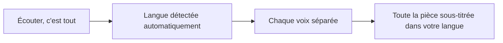
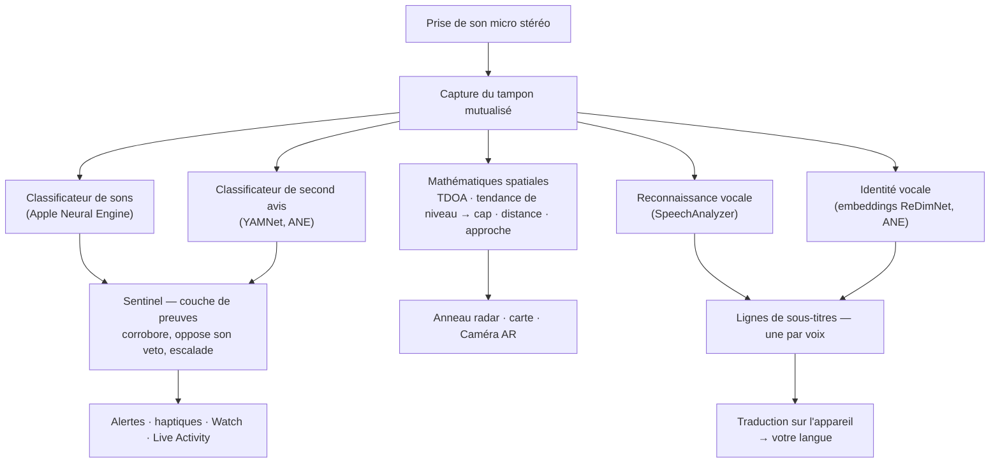
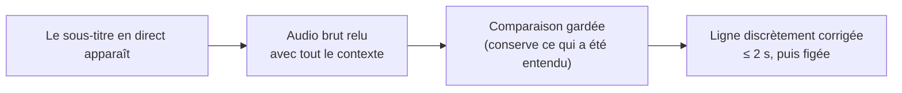
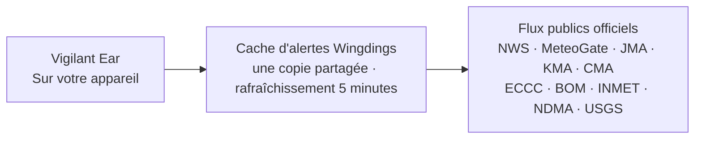

# Vigilant Ear 👂🛡️

*En vigueur à compter de la version 1.1.3 · septembre 2026.*

## Un radar acoustique pour les personnes sourdes et malentendantes.

Une application conçue spécifiquement pour la communauté sourde, malentendante et CODA. La plupart des applications de reconnaissance sonore vous disent *ce qu'est* un son. **Vigilant Ear vous indique où il se trouve, qui le produit et ce qui se dit** — transformant un iPhone en un tricordeur sonore en temps réel qui décrit le son autour de vous.

La direction et la distance d'une sirène. Un coup frappé derrière vous. Les personnes d'une conversation, dessinées sous forme de voix transcrites séparées — chacune sous-titrée et placée directionnellement. Si quelqu'un parle une langue que vous ne lisez pas, ses mots peuvent arriver **traduits dans la vôtre.** Les alertes atteignent votre **Écran de verrouillage (Lock Screen), Dynamic Island et Apple Watch**, il suffit donc d'un coup d'œil.

Tout ce qui compte s'exécute sur l'appareil. L'audio n'est pas enregistré ni téléversé pour la reconnaissance. Rien ne dépend de l'audition.

- 🧭 **Direction, et pas seulement détection.** *Quoi, où, qui,* et *ce qui a été dit* — et pas simplement « un son s'est produit ».
- 🔒 **Privé par conception.** La classification, le sous-titrage et la traduction s'exécutent sur votre iPhone. Les sous-titres sont en direct et éphémères ; ils ne sont pas sauvegardés sous forme d'archives de transcription.
- ⌚ **À votre poignet et sur l'Écran de verrouillage.** Le compagnon de direction Apple Watch et Live Activity gardent la dernière alerte et sa provenance à portée de regard.
- 🛰️ **Plusieurs téléphones, une oreille partagée.** Constellation relie les iPhones Ultra-Wideband pour fusionner ce que chacun entend en une image directionnelle plus précise.
- 👁️ **Conçu pour les sourds, malentendants et CODA.** Retours haptiques distincts, visuels à contraste élevé, indices indépendants de la couleur, grandes cibles d'appui et respect du paramètre Réduire les animations partout.

---

## Pour qui

- **Les personnes sourdes, malentendantes et CODA** qui veulent une conscience situationnelle des sons — Home Watch (coup, alarme, bébé, téléphone) et Street Watch (sirène, approche) que vous pouvez laisser allumés et auxquels vous pouvez faire confiance.
- Quiconque a besoin de **sous-titres en direct avec direction et séparation des locuteurs**, ou d'une **traduction sur l'appareil** des personnes assises à proximité.
- Les personnes qui s'intéressent à l'accessibilité ou à la recherche acoustique et à la localisation sonore sur l'appareil.

> Vigilant Ear est une **aide** à l'accessibilité, et non un dispositif certifié de sécurité des personnes.

---

## Ce qu'elle fait

### 🧭 Elle voit le son — direction et distance
En utilisant les deux microphones de l'iPhone, Vigilant Ear mesure **l'angle d'un son et s'il se trouve devant vous ou derrière vous**, maintient cette lecture stable à environ un degré près, et la place sous forme de marqueur en direct sur un anneau radar orienté vers l'avant et une carte. Deux microphones sur une même ligne ne peuvent pas, à eux seuls, distinguer la gauche de la droite — un son à 50° à votre droite et un à 50° à votre gauche arrivent avec le même minuscule décalage temporel — l'application dessine donc la lecture plus un **fantôme plus pâle de l'autre côté**, et un tour de poignet ou un second téléphone tranche. La distance est estimée à partir de l'intensité selon une courbe calibrée en rue et affichée comme l'estimation qu'elle est : *≈ 50 ft*, avec une plage probable. Déplacez-vous, et les marqueurs conservent leur position dans le monde réel. C'est le cœur de l'application : une conscience spatiale d'un monde que vous ne pouvez pas entendre. (Chiffres ci-dessous.)

### 🚨 Elle reconnaît les sons importants — et vous avertit
Un classificateur sur l'appareil identifie des centaines de sons du quotidien et surveille les catégories critiques — **sirènes, alarmes — y compris une classe dédiée d'alarme de voiture —, sonnettes/coups, pleurs de bébé, une personne à proximité, et alertes météo extrêmes.** Lorsqu'un son se déclenche, vous obtenez une alerte claire à l'écran, une **notification push** (optionnelle) et un retour **haptique** distinct — même si l'application est en arrière-plan ou que le téléphone est en veille. Les catégories critiques sont prêtes par défaut afin que l'activation des notifications ne signifie pas « tout désactiver ». Désactivez toutes les catégories d'alerte et le moteur hibernera complètement en arrière-plan pour économiser la batterie. Une couche **Sentinel** recoupe les alertes avec des preuves indépendantes — direction, mouvement et flux publics — afin que ce qui se déclenche soit corroboré, et non la simple supposition d'un classificateur isolé. Ça marche dans les deux sens : un instant qui ressemble à une sirène dans une chanson est retenu, mais une vraie sirène qui se répète à travers votre musique perce et alerte.

Les alertes météorologiques extrêmes proviennent de flux publics officiels — **NWS** pour les États-Unis, **MeteoGate** pour l'Europe, **CMA** pour la Chine, **KMA** pour la Corée, **JMA** pour le Japon, **ECCC** pour le Canada, **BOM** pour l'Australie, **INMET** pour le Brésil, et **NDMA** pour l'Inde — gratuitement pour tous les utilisateurs. Les flux sont restreints à ceux qui couvrent l'endroit où vous vous trouvez. Au Japon, l'application lit aussi les **bulletins anticipés** de la JMA — les avis en langage clair publiés plusieurs jours avant un typhon ou de fortes pluies, et pas seulement les alertes une fois le danger arrivé — ainsi que les bulletins d'averse soudaine et de glissement de terrain. Les avis anticipés s'affichent discrètement, sans le son ni la vibration réservés à une vraie alerte.

### ⌚ Apple Watch + Live Activity — un coup d'œil et vous savez
- **Application compagnon Apple Watch** — la direction d'une alerte pointe sur votre poignet afin qu'un coup d'œil vous dise où regarder. Interface utilisateur repensée pour la Watch avec l'icône de l'oreille de l'application, l'affichage tête haute (HUD) des menaces, et un double tapotement pour fermer une alerte. Les alertes peuvent toujours afficher la flèche de direction lorsque l'application Watch n'est pas ouverte.
- **Live Activity (Activité en direct)** — Vigilant Ear reste sur votre **Écran de verrouillage**, dans la **Dynamic Island**, et dans la **Pile intelligente (Smart Stack) de la Watch**, afin que la dernière alerte et son cap soient toujours à portée de regard.
- **Alertes des partenaires à votre poignet** — lorsque le téléphone d'un partenaire Constellation associé déclenche une alerte, elle peut aussi atteindre votre Watch, direction comprise. Une passe de fiabilité garde le compagnon léger pour la batterie de la Watch toute la journée.

### 💬 Mode Locuteur (Speaker Mode) — sous-titres en direct et directionnels *(gratuit)*
Activez le **Mode Locuteur (Speaker Mode)** et Vigilant Ear transcrit les personnes qui parlent près de vous en **blocs de sous-titres, un par voix.** La diarisation des locuteurs sur l'appareil garde les voix distinctes — *qui* dit *quoi* — avec un indicateur directionnel sur l'anneau intérieur. Le locuteur en direct est mis en surbrillance ; le texte plus ancien défile pour faire de la place.

Deux choses que la plupart des applications de sous-titrage ne font pas : **l'honnêteté sur la confiance** — une marque de qualité discrète par ligne et des soulignements en pointillés sous les mots douteux vous disent quand faire confiance à une ligne et quand la revérifier — et **l'autocorrection** : juste après qu'une phrase se pose, l'application relit l'audio avec tout le contexte et peut restaurer un mot manqué ou mal entendu en environ deux secondes, puis le texte se fige.

Les sous-titres sont gratuits ; la traduction automatique est le niveau Power Pack+ optionnel. Les sous-titres peuvent aussi être **lus à voix haute sur vos appareils auditifs Bluetooth** — gratuitement, dans les Préférences. Les **Direction Tones** (aussi gratuits, dans Préférences → Sous-titres) ajoutent un indice audio optionnel dans l'oreille de votre choix qui signale où se trouve un locuteur — utile avec une aide auditive ou une audition unilatérale, et disponible pour tout le monde.

### 🌐 Auto-traduction des locuteurs (Speaker Auto-Translate) — votre langue, en direct *(Power Pack+)*
Avec le Mode Locuteur activé, lorsqu'une personne à proximité parle une autre langue, Vigilant Ear peut la détecter et afficher ses sous-titres **dans votre langue**, avec la langue source indiquée sur son bloc. La chaîne — écouter → séparer les locuteurs → transcrire → traduire → afficher — s'exécute **sur l'appareil** ; la seule utilisation du réseau est un téléchargement unique du pack linguistique depuis Apple. Vous n'avez pas besoin de connaître ou de choisir l'autre langue en premier.

C'est ce qui se rapproche le plus du **traducteur universel de la science-fiction** — l'appareil qui comprend, tout simplement. Vigilant Ear détecte la langue par lui-même, suit chaque personne qui parle dans la pièce et les sous-titre toutes dans votre langue — sans écouteurs, sans réglage, sur votre appareil.

```mermaid
graph LR
    A["Écouter, c'est tout"] --> B["Langue détectée automatiquement"] --> C["Chaque voix séparée"] --> D["Toute la pièce sous-titrée dans votre langue"]
```

### 🎵 Reconnaissance de musique et de diffusion *(Power Pack+)*
**ShazamKit** identifie la musique qui joue autour de vous et suit les changements de chanson.

### 🎛️ Acoustic Scope — voir le son comme un ingénieur
Une vue professionnelle et en direct du son autour de vous : spectre, spectrogramme, bandes RTA au tiers d'octave, chroma et partiels harmoniques — **gratuit pour tous**. Les outils de capture de sons pour entraîner vos propres packs font partie de Power Pack+.

### 📦 Packs de sons personnalisés — apprenez-lui votre monde *(Power Pack+)*
Apprenez à Vigilant Ear les sons qui comptent pour vous — des oiseaux locaux à la sonnette de votre immeuble. Les packs s'ajoutent à la détection intégrée sans jamais évincer sirènes et alarmes. Un guide pas à pas est inclus dans l'app.

### 🛰️ Constellation — plusieurs iPhones, une oreille partagée *(Power Pack+)*
Avec deux iPhones ou plus équipés de la technologie Ultra-Wideband (la plupart depuis l'iPhone 11), **Constellation** les associe afin qu'ils puissent détecter la position des autres et fusionner ce que chacun entend en une image unique et plus précise de la provenance d'un son — un réseau d'écoute distribué et passif. Les sous-titres sont fusionnés aussi : chaque téléphone transcrit ce que son propre microphone entend, et les mots sont alignés d'un téléphone à l'autre pour que celui le plus proche d'un locuteur contribue ce qu'il a entendu — les mots qu'un seul téléphone a captés sont conservés plutôt que perdus. Les téléphones se connectent **directement entre eux** : pas de routeur, pas de réseau Wi-Fi partagé et pas d'internet ; il suffit que le Wi-Fi soit activé, via la même liaison pair-à-pair qu'utilise AirDrop. Restreint aux appareils dotés du matériel approprié. Les sous-titres en réseau mesh antérieurs à l'heure de connexion d'un pair ne sont pas retransmis.

**Messages entre partenaires** — envoyez un court texte vers le téléphone d'un partenaire associé ; il apparaît dans son fil de sous-titres et peut arriver traduit dans sa langue, sur l'appareil. La messagerie tient compte de l'âge : fondée sur la tranche d'âge déclarée d'Apple, la messagerie entre un adulte et un mineur reste désactivée à moins que les deux ne se soient délibérément nommés l'un l'autre. Les alertes et les sous-titres ne sont jamais restreints — seuls les messages de personne à personne le sont.

### 🔗 Remote Link — joindre quelqu'un qui n'est pas avec vous *(Power Pack+ pour démarrer)*
Ce qu'un appel téléphonique ferait normalement, fait avec de la vidéo et du texte à la place. Vous envoyez un code d'invitation ; l'autre personne rejoint depuis Vigilant Ear **sans posséder Power Pack+**. Contrairement à Constellation, il n'y a pas d'exigence de proximité — vous pouvez être n'importe où.

**Aucun audio n'est utilisé à aucun moment.** Vidéo et texte uniquement, afin que rien dans la liaison ne dépende de l'audition d'un côté ou de l'autre — et cela vous donne un moyen de signer avec quelqu'un via l'application. L'application elle-même ne comprend pas la langue des signes ; elle transporte la vidéo et vous deux faites le reste. La connexion est directe entre les deux téléphones partout où le réseau le permet, et l'application vous indique clairement si elle est **Directe (Direct)** ou **Relais (Relayed)**, afin que vous sachiez toujours si votre vidéo passe par un relais.

### 📷 Caméra AR — « voir le son »
Ouvrez la pastille de la caméra sur la barre de titre et épinglez les sons détectés à leur orientation réelle dans la vue en direct de la caméra. Les marqueurs se regroupent par locuteur ou par catégorie de son et par direction pour que la vue reste lisible ; les sources s'estompent avec le temps lorsqu'elles deviennent silencieuses.

### 🗺️ Cartes, routes et prédiction de trajectoire
Les caps sonores se projettent sur les coordonnées GPS réelles sur la carte. Les bruits de véhicules peuvent être **calés sur les rues à proximité** et leurs trajectoires prédites pour qu'un camion qui passe s'affiche comme se déplaçant *le long de la route* plutôt qu'à travers les bâtiments. (Essayez la démo du camion de pompiers.)

### 🪄 Terrain de jeu des fonctionnalités — prouvez-le sans oreilles
Le **Terrain de jeu des fonctionnalités** est public pour tous : entraînements Maison et Rue (Home & Street) (coup, alarme, bébé, sirène, météo), démos multi-téléphones et de conversation, et un filigrane clair pour que la pratique ne se fasse jamais passer pour un événement réel. La fermeture du panneau met fin proprement aux démos (pas de fausse position GPS bloquée, pas de drapeaux restants).

### ♿ L'accessibilité avant tout
Conçu pour les utilisateurs sourds, malentendants, CODA et daltoniens : des indices **indépendants de la couleur**, des cibles tactiles de **≥ 44 pt**, le respect du paramètre **Réduire les animations**, des alertes multimodales (haptiques + visuelles + Watch), et un écran de vérification au démarrage qui affiche l'état des permissions avec des états clairs vert / gris / rouge (et « refusé » orange brûlé) — y compris l'octroi des notifications qui agit comme l'interrupteur d'alerte principal.

---

## Gratuit et Power Pack+

Le cœur de la sécurité est **gratuit, pour toujours** :

- **Home Watch & Street Watch** — alertes sonores locales (alarmes, sirènes, coups/sonnettes, bébé, personne à proximité) avec notification à l'écran, haptique et push en option.
- **Sous-titres en direct** — Mode Locuteur (Speaker Mode), sur l'appareil, directionnel là où le matériel le permet, avec marques de confiance honnêtes, autocorrection d'environ 2 secondes, sortie vocale optionnelle vers les appareils auditifs Bluetooth, et Direction Tones.
- **Standing Watch** — l'état de la pièce elle-même, toujours actif et sans rien à configurer : un témoin cyan fixe tant que la pièce conserve son schéma habituel, ambre quand quelque chose change — une nouvelle voix, un silence soudain ou quelque chose qui s'approche.
- **Alertes météo extrêmes** — NWS, MeteoGate (Europe — servi frais depuis notre cache d'alertes de 5 minutes), CMA, KMA, JMA (Japon), ECCC (Canada), BOM (Australie), INMET (Brésil) et NDMA (Inde) pour votre région.
- **Alertes sismiques (USGS, monde entier)** — ressentez une vibration et visualisez sur votre carte la zone qui a ressenti le séisme lorsqu'un tremblement de terre est signalé à proximité. Une confirmation issue du flux officiel de l'USGS — pas une alerte précoce : si vous avez senti une secousse, ceci vous dit ce que c'était. La détection de grondements profonds (infrasons) sur l'appareil peut armer la vérification dès que le sol bouge.
- **Terrain de jeu des fonctionnalités** — alertes d'entraînement et aperçus des fonctionnalités avec un filigrane PREVIEW bien visible.
- **Compagnon Apple Watch & Live Activity** — direction et dernière alerte consultables d'un coup d'œil.
- **Acoustic Scope** — visualisation sonore en direct de niveau professionnel, gratuit pour tous. (Les outils de capture pour l'entraînement font partie de Power Pack+.)

Le **Power Pack+** est un déblocage unique (**pas un abonnement**) avec un **essai gratuit de 90 jours**. Il ajoute les superpouvoirs suivants :

- **Auto-traduction des locuteurs (Speaker Auto-Translate)** — traduction sur l'appareil de la parole environnante vers votre langue.
- **Constellation** — audition partagée sur plusieurs iPhones via Ultra-Wideband, avec messages entre partenaires.
- **Music ID** — reconnaissance de chansons via ShazamKit.
- **Packs de sons personnalisés** — des classificateurs additionnels que vous entraînez pour vos propres sons.

Que ce soit en version Gratuite ou Power Pack+, **votre audio reste sur l'appareil pour la reconnaissance** — le niveau modifie seulement quelles fonctionnalités sont débloquées, jamais l'endroit où l'audio brut est envoyé pour analyse.

---

## Comment ça marche (sous le capot)

Vigilant Ear est un pipeline **prioritairement local, sur l'appareil**, construit en couches : capturer une fois, puis laisser des spécialistes indépendants lire le même son et vérifier le travail les uns des autres. L'audio brut est capturé sur un point d'écoute (tap) à haute priorité, copié dans une **liste libre de tampons mutualisée (pooled buffer free-list)** (pas de surcharge d'allocation sur le chemin en temps réel), et distribué sans bloquer l'interface utilisateur :

```mermaid
graph TD
    A["Prise de son micro stéréo"] --> B["Capture du tampon mutualisé"]
    B --> C["Classificateur de sons<br/>(Apple Neural Engine)"]
    B --> Y["Classificateur de second avis<br/>(YAMNet, ANE)"]
    C --> S["Sentinel — couche de preuves<br/>corrobore, oppose son veto, escalade"]
    Y --> S
    S --> H["Alertes · haptiques · Watch · Live Activity"]
    B --> D["Mathématiques spatiales<br/>TDOA · tendance de niveau → cap · distance · approche"]
    D --> R["Anneau radar · carte · Caméra AR"]
    B --> F["Reconnaissance vocale<br/>(SpeechAnalyzer)"]
    B --> E["Identité vocale<br/>(embeddings ReDimNet, ANE)"]
    F --> G["Lignes de sous-titres — une par voix"]
    E --> G
    G --> T["Traduction sur l'appareil<br/>→ votre langue"]
```

Aucun modèle n'est crédité seul. La couche **Sentinel** s'intercale entre la détection et l'alerte : des moteurs indépendants se corroborent ou s'opposent un veto image par image — et lorsque des preuves réelles répétées s'accumulent contre un veto (une vraie sirène qui hurle à travers votre musique), les preuves l'emportent et l'alerte se déclenche.

Les sous-titres ont leur propre seconde chance. Chaque phrase finalisée est discrètement relue depuis un court anneau audio en mémoire avec tout le contexte — les corrections arrivent en environ deux secondes, puis le texte se fige pour de bon :

```mermaid
graph LR
    L["Le sous-titre en direct apparaît"] --> K["Audio brut relu<br/>avec tout le contexte"] --> V["Comparaison gardée<br/>(conserve ce qui a été entendu)"] --> W["Ligne discrètement corrigée<br/>≤ 2 s, puis figée"]
```

- **Mathématiques spatiales** — FFT, Différence de Temps d'Arrivée pondérée par la cohérence (TDOA — favoriser les bandes de fréquences sur lesquelles les deux microphones sont d'accord, puis convertir le minuscule décalage d'arrivée en un cap), et suivi d'approche par tendance de niveau sur des tâches en arrière-plan. La paire de microphones est lue dans une orientation fixe afin que la direction fonctionne de la même façon que vous teniez le téléphone à la verticale ou à l'horizontale.
- **Parole** — `SpeechAnalyzer` / `SpeechTranscriber` sous iOS 26 pour la transcription ; les embeddings **ReDimNet** pour l'identité vocale ; le framework **Translation** d'Apple pour la traduction sur l'appareil. L'identité vocale est fondée sur des preuves : une voix n'est confirmée comme une personne réelle qu'à partir de fenêtres de son indépendantes, et une correspondance incertaine s'affiche comme non attribuée plutôt que de deviner le mauvais nom.
- **Vérité musicale** — un **détecteur de signature de chanson** fondé sur le chroma détient la décision « de la musique joue-t-elle vraiment ? », parce que les classificateurs généraux appellent fameusement les pièces silencieuses et les sirènes « musique ». Shazam ne s'exécute qu'une fois que la signature confirme qu'il y a vraiment quelque chose de musical.
- **Concurrence** — l'isolation de Swift 6 maintient le point d'écoute du microphone, les mathématiques acoustiques et la boucle de rendu de l'interface utilisateur proprement séparés.
- **Efficacité** — le sous-échantillonnage, la classification adaptative à la charge et l'usage réseau conditionné par les preuves permettent de maintenir une écoute permanente suffisamment légère pour être laissée activée.

La météo et les alertes sismiques prennent le chemin inverse de l'audio — rien de votre son ne sort jamais, mais des *données* d'alerte entrent. **Chaque** flux officiel passe par un petit cache que nous opérons, afin qu'un seul appel aux données publiques serve tous les utilisateurs — et que votre téléphone ne contacte jamais les serveurs d'un gouvernement étranger :

```mermaid
graph LR
    P1["Vigilant Ear<br/>Sur votre appareil"] --> W["Cache d'alertes Wingdings<br/>une copie partagée · rafraîchissement 5 minutes"]
    W --> N["Flux publics officiels<br/>NWS · MeteoGate · JMA · KMA · CMA<br/>ECCC · BOM · INMET · NDMA · USGS"]
```

---

## Ce que votre téléphone peut entendre — mesures

Votre iPhone a deux microphones espacés d'environ quinze centimètres (six inches), un baromètre et une très bonne horloge. Cela suffit pour vous dire de quel côté vient un son, à peu près à quelle distance, s'il s'approche, et si une porte vient de s'ouvrir. Voici à quel point chacune de ces mesures est précise, comment nous l'avons vérifiée, et pourquoi cela compte si vous ne pouvez pas entendre le son vous-même. La direction et les chiffres associés ont été mesurés sur un iPhone 17 et un iPhone 16 Pro Max en septembre 2026. La distance reste par nature une estimation — nous le disons à l'écran.

**Direction — à quelques degrés près.** Un son atteint le microphone du haut avant celui du bas, ou après, et à partir de cet écart l'application calcule à quel point le son s'écarte de l'axe du téléphone et s'il est devant ou derrière. Les deux canaux du téléphone ne sont pas de simples microphones, mais une image stéréo traitée, et cette image ajoute un motif fixe qui lui est propre dès qu'une pièce est bruyante. L'application apprend maintenant ce motif à partir de quelques secondes de calme après le lancement et l'enlève avant de lire la direction.

| Ce que nous avons mesuré | Résultat |
|---|---|
| Erreur médiane sur 96 pièces simulées, du bureau calme à la pièce aux murs durs à 5 dB de rapport signal/bruit | 1.0° |
| iPhone 17 sur un bureau, bruit de pièce activé, haut-parleur à 30° de l'axe | lecture 61.7° depuis le plan latéral contre 60° attendus, oscillation 1.6° |
| Idem, haut-parleur droit sur le côté du téléphone | lecture 4.5° contre 0° attendus, oscillation 2.2° |
| Idem, haut-parleur droit devant | chaque lecture au délai maximal, comme il se doit |
| Lectures tombant sur le motif propre de l'image plutôt que sur le son | aucune, à aucun angle |

*Pourquoi ça compte :* si vous n'entendez pas une sirène, « derrière vous, un peu sur le côté » vous dit où regarder. Une lecture qui tient bon ne mérite d'être crue qu'une fois vérifiée au mètre ruban, et celle-ci l'a été, deux fois — la seconde après que le premier contrôle se soit révélé trop indulgent.

**Distance — affichée comme l'estimation qu'elle est.** Un seul microphone ne peut pas mesurer la distance, seulement l'intensité, et un camion fort loin peut sonner comme une voiture calme de près. L'application estime la distance à partir de l'intensité selon une courbe calibrée en rue réelle, puis la dit comme le ferait une personne prudente : *environ 50 ft, probablement entre 25 et 100.*

| Ce que nous avons mesuré | Résultat |
|---|---|
| Détections de voitures réelles rejouées à travers la calibration | 1,131 |
| Atterrissage à l'intérieur de la route de 100 pieds où elles se trouvaient vraiment | 73% |
| Voitures de la voie lointaine | estimées à 78 et 87 ft là où le mètre ruban disait 73 et 85 ft |

La route (un carrefour urbain) a été mesurée voie par voie ; quand la courbe se trompe, elle se trompe du côté proche. La calibration est verrouillée par un test automatisé pour qu'elle ne dérive pas en silence. Les alarmes dans votre propre espace, comme un détecteur de fumée, n'ont aucun chiffre de distance — elles sont déjà dans la pièce avec vous.

**Mouvement — qui s'approche de vous.** Pour les voitures et les sirènes, devenir plus fort signifie en général se rapprocher. L'application surveille à quelle vitesse le niveau d'un son monte sur quelques secondes : une montée soutenue d'environ 1,5 dB par seconde (une hausse claire et régulière de l'intensité) signifie une approche, une baisse correspondante signifie un éloignement, et un son qui cesse de changer cesse d'être appelé l'un ou l'autre après environ quatre secondes. Un seul instant fort — un coup de klaxon, un claquement de porte — ne peut pas le déclencher. Fondé sur la physique et neuf tests automatisés ; un passage en rue enregistré est la prochaine confirmation sur le terrain.

**L'air de la pièce — une porte a une signature.** Le baromètre peut remarquer une porte qui s'ouvre à environ quatre mètres et demi (quatorze pieds) : la pression baisse quand la porte s'ouvre, puis rebondit quand elle se ferme. Sur quatorze heures de calme et quinze événements de porte, chaque porte a produit cette forme en deux temps et rien d'autre dans la maison ne l'a fait.

| Événement | Vitesse de pression | Forme |
|---|---|---|
| Porte d'entrée, ouverte et fermée, ×10 | 0.6–1.8 Pa/s | baisse, puis rebond, ~5 s d'écart |
| Porte d'entrée, claquée, ×5 | 1.1–2.5 Pa/s | la même paire, plus haute |
| Climatisation en cycle la nuit, ×8 | 0.11–0.46 Pa/s | rampe lente sur des minutes, identique sur les deux téléphones |
| Une pièce calme | ~0.02 Pa/s | rien |
| Passer devant, éternuer | — | le capteur de mouvement le remarque et le téléphone l'ignore |

Une porte moustiquaire, qui n'étanchéifie pas la pièce, était invisible — exactement comme il se doit. Aujourd'hui un décalage de pression peut s'afficher comme des grondements profonds sur la carte ; une alerte de porte dédiée pour la nuit calme est mesurée et conçue, et n'est pas encore le défaut quotidien.

**Constellation — deux téléphones tranchent le côté.** Chaque téléphone du mesh tire une ligne vers le son depuis l'endroit où il se trouve, et les lignes ne se croisent nettement que d'un seul côté. Quand elles le font, le fantôme disparaît et l'application peut à nouveau dire gauche ou droite. En simulation, deux téléphones **à 40 m l'un de l'autre** placent une sirène à 50 m à environ **2 m** près.

**Comment quoi que ce soit ici est cru.** Chaque chiffre a passé les mêmes trois portes, dans l'ordre : une pièce simulée dont la réponse est connue d'avance ; de petits tests automatisés qui recréent le cas exact qui tromperait l'application et s'exécutent à chaque changement ; puis les vrais téléphones sur un vrai bureau avec des distances mesurées à la main. Rien ne compte comme précis tant qu'il n'a pas survécu au troisième. Pour quelqu'un qui ne peut pas entendre le son, la parole de l'application est la seule parole — elle doit être gagnée comme un laboratoire la gagne.

Notes plus approfondies pour les ingénieurs : [Physics](https://vigilantear.com/en/physics/) — TDOA, distance, mouvement, Constellation et détection barométrique, avec chaque chiffre étiqueté MEASURED / BENCHED / MODELLED.

---

## Confidentialité

- **Sur l'appareil, toujours pour le pipeline principal.** La classification, les mathématiques spatiales, la transcription, la diarisation et la traduction s'exécutent sur votre iPhone. L'audio brut n'est pas enregistré ni téléversé pour la reconnaissance.
- **Les sous-titres sont éphémères.** Les sous-titres en direct restent en mémoire pendant la session ; les journaux de débogage exportés n'incluent pas le texte des sous-titres.
- **Aucun SDK publicitaire ou d'analyse comportementale.** L'utilisation limitée du réseau est uniquement pour les cartes, les flux météo publics, les empreintes audio Shazam optionnelles, le contexte routier et les achats sur l'App Store — voir la politique complète.

Détails complets : [PRIVACY.md](PRIVACY.md) · [TERMS.md](TERMS.md) · [SUPPORT.md](SUPPORT.md)

---

## Matériel et plateformes

- **iPhone (expérience complète).** Fonctionne en portrait comme en paysage — tenez-le comme vous voulez. Microphones stéréo requis pour la radiogoniométrie (direction). Recommandé : **iPhone 13 ou plus récent**.
- **Apple Watch.** Alertes compagnon avec flèche de direction ; fonctionne avec Live Activity / Pile intelligente (Smart Stack).
- **iPad (natif).** Mise en page adaptative : sur grand écran, les sous-titres en direct disposent d'un panneau translucide à côté de la carte, qui s'efface quand personne ne parle. Micros monocanal → sous-titres sans direction complète.
- **Constellation** nécessite l'**Ultra-Wideband** — iPhone 11 ou ultérieur, à l'exclusion des modèles SE et « e ». Il n'a **pas** besoin d'un réseau Wi-Fi : avec le Wi-Fi activé, les téléphones se découvrent directement, donc Constellation fonctionne sans routeur et sans internet tant que les téléphones sont proches.
- **Android.** Version séparée avec le radar principal, les alertes, les sous-titres et la météo ; le réseau mesh Constellation est d'abord disponible sur iOS. Voir les mises à jour du site du produit à mesure que la parité Android progresse.

---

## Localisation

Entièrement localisé — interface, alertes et sous-titres — en **anglais, espagnol, portugais (Brésil), français, allemand, italien, arabe, japonais, chinois simplifié, coréen, russe et hindi** (12 langues). Suit les paramètres régionaux du système ou un choix manuel dans l'application.

---

## Statut et clause de non-responsabilité

Vigilant Ear est une **aide expérimentale à l'accessibilité acoustique**, et non un outil certifié de sécurité des personnes. La résolution de la localisation varie en fonction de l'environnement, de la météo, du vent et du matériel du microphone. **Maintenez toujours votre conscience habituelle de l'environnement** — ne vous y fiez pas comme votre seule source d'informations de sécurité.

Certaines capacités (marqueurs AR de caméra, mise à niveau du droit aux alertes critiques lorsqu'elles sont accordées par Apple, création de sons multi-pack avancée) continuent d'évoluer ; la surveillance Maison / Rue (Home / Street watch) gratuite et les sous-titres en direct sont le produit auquel vous pouvez faire confiance dès le premier jour.

---

**Contact :** [vigilantear@wingdingssocial.com](mailto:vigilantear@wingdingssocial.com)

Fait avec ❤️ pour la communauté sourde/malentendante et la recherche acoustique.

    
  <strong>© 2026 Wingdings, Inc.</strong> 
  Tous droits réservés. 
  Brevet en instance

