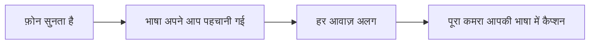
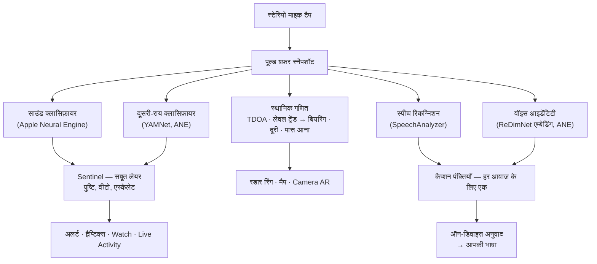
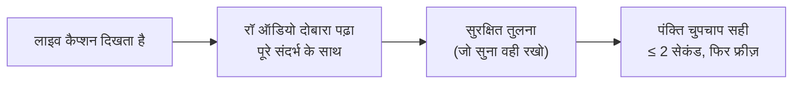
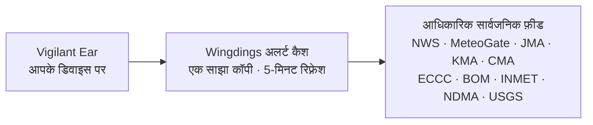

# Vigilant Ear 👂🛡️

*संस्करण 1.1.3 · सितंबर 2026 से प्रभावी।*

## जो सुन नहीं सकते, उनके लिए एक ध्वनिक रडार।

यह ऐप खास तौर पर बधिर, कम-सुनने वाले, और CODA समुदाय के लिए बना है। ज़्यादातर साउंड-रिकग्निशन ऐप सिर्फ बताते हैं कि *आवाज़ क्या है*। **Vigilant Ear बताता है कि वह कहाँ है, कौन कर रहा है, और क्या कह रहा है** — यानी iPhone को एक रियल-टाइम सोनिक ट्राइकॉर्डर में बदल देता है जो आपके आसपास की आवाज़ का वर्णन करता है।

सायरन की दिशा और दूरी। आपके पीछे की दस्तक। बातचीत में लोग अलग-अलग ट्रांसक्राइब्ड आवाज़ों के रूप में — हर एक कैप्शन के साथ और दिशा के साथ रखा हुआ। अगर कोई ऐसी भाषा बोल रहा है जिसे आप नहीं पढ़ते, तो उनके शब्द **आपकी भाषा में अनुवादित** आ सकते हैं। अलर्ट आपके **Lock Screen, Dynamic Island, और Apple Watch** तक पहुँचते हैं — बस एक नज़र काफी।

जो चीज़ें मायने रखती हैं, वे सब डिवाइस पर ही चलती हैं। पहचान के लिए ऑडियो रिकॉर्ड या अपलोड नहीं होता। कुछ भी सुनने पर निर्भर नहीं करता।

- 🧭 **सिर्फ डिटेक्शन नहीं — दिशा।** *क्या, कहाँ, कौन,* और *क्या कहा गया* — सिर्फ “कोई आवाज़ हुई” नहीं।
- 🔒 **डिजाइन से ही निजी।** क्लासिफिकेशन, कैप्शनिंग, और अनुवाद आपके iPhone पर चलते हैं। कैप्शन लाइव और क्षणिक होते हैं; उन्हें ट्रांसक्रिप्ट आर्काइव के रूप में सेव नहीं किया जाता।
- ⌚ **कलाई और Lock Screen पर।** Apple Watch दिशा साथी + Live Activity — आखिरी अलर्ट और वह किस तरफ से आया, एक नज़र में।
- 🛰️ **ज़्यादा फ़ोन, एक साझा कान।** Constellation Ultra-Wideband iPhone को जोड़कर हर फ़ोन की सुनी हुई आवाज़ को मिलाता है — दिशा की तस्वीर और तेज़ हो जाती है।
- 👁️ **Deaf / HoH / CODA के लिए बना।** अलग-अलग हैप्टिक्स, हाई-कॉन्ट्रास्ट विज़ुअल्स, रंग-स्वतंत्र संकेत, बड़े टैप टारगेट, और हर जगह Reduce Motion का सम्मान।

---

## यह किसके लिए है

- **बधिर, कम-सुनने वाले, और CODA उपयोगकर्ता** जो आवाज़ की स्थितिगत जागरूकता चाहते हैं — Home Watch (दस्तक, अलार्म, बच्चा, फ़ोन) और Street Watch (सायरन, पास आना) जिन्हें चालू छोड़कर भरोसा किया जा सके।
- कोई भी जिसे **दिशा और स्पीकर सेपरेशन के साथ लाइव कैप्शन** चाहिए, या पास बैठे लोगों का **ऑन-डिवाइस अनुवाद**।
- एक्सेसिबिलिटी और ध्वनिक-शोध उपयोगकर्ता जो ऑन-डिवाइस साउंड लोकलाइज़ेशन में रुचि रखते हैं।

> Vigilant Ear एक एक्सेसिबिलिटी **सहायता** है, प्रमाणित जीवन-सुरक्षा डिवाइस नहीं।

---

## यह क्या करता है

### 🧭 यह आवाज़ देखता है — दिशा और दूरी
iPhone के दो माइक्रोफ़ोन से Vigilant Ear **आवाज़ का कोण मापता है और बताता है कि वह आपके आगे है या पीछे**, उस रीडिंग को लगभग एक डिग्री तक स्थिर रखता है, और उसे हेडिंग-अप रडार रिंग और मैप पर लाइव मार्कर के रूप में रखता है। एक लाइन पर दो माइक्रोफ़ोन अपने आप बाएँ-दाएँ नहीं बता सकते — आपके दाएँ 50° और बाएँ 50° की आवाज़ एक ही छोटे समय-अंतराल से आती है — इसलिए ऐप रीडिंग के साथ **दूसरी तरफ़ एक हल्का घोस्ट** भी दिखाता है, और कलाई घुमाने या दूसरे फ़ोन से बात तय हो जाती है। दूरी लाउडनेस से स्ट्रीट-कैलिब्रेटेड कर्व के ख़िलाफ़ अनुमानित होती है और उसी रूप में दिखती है: *≈ 50 ft*, संभावित रेंज के साथ। आप हिलें, तो मार्कर अपनी वास्तविक दुनिया की जगह पर बने रहते हैं। यही मूल है: उस दुनिया की स्थानिक जागरूकता जिसे आप सुन नहीं सकते। (नीचे नंबर।)

### 🚨 यह महत्वपूर्ण आवाज़ें पहचानता है — और आपको चेताता है
एक ऑन-डिवाइस क्लासिफ़ायर सैकड़ों रोज़मर्रा की आवाज़ें पहचानता है और महत्वपूर्ण श्रेणियाँ देखता है — **सायरन, अलार्म — जिसमें एक समर्पित कार-अलार्म क्लास शामिल है — डोरबेल/दस्तक, बच्चे का रोना, पास कोई व्यक्ति, और गंभीर मौसम।** जब इनमें से कोई पहचाना जाता है, आपको साफ़ ऑन-स्क्रीन अलर्ट, वैकल्पिक **पुश नोटिफ़िकेशन**, और एक अलग **हैप्टिक** मिलता है — भले ऐप बैकग्राउंड में हो या फ़ोन सो रहा हो। महत्वपूर्ण श्रेणियाँ डिफ़ॉल्ट रूप से तैयार रहती हैं, ताकि नोटिफ़िकेशन चालू करने का मतलब “सब बंद” न हो। सभी अलर्ट श्रेणियाँ बंद करें तो बैकग्राउंड में इंजन पूरी तरह हाइबरनेट हो जाता है — बैटरी बचाने के लिए। एक **Sentinel** लेयर अलर्ट को स्वतंत्र सबूतों — दिशा, मोशन, और सार्वजनिक फ़ीड — से क्रॉस-चेक करती है, ताकि जो अलर्ट आए वह पुष्टि किया हुआ हो, अकेला क्लासिफ़ायर अंदाज़ा नहीं। यह दोनों तरफ़ काम करता है: गाने के अंदर सायरन जैसी आवाज़ रोकी जाती है, लेकिन आपके म्यूज़िक से बार-बार गुज़रने वाला असली सायरन टूटकर अलर्ट देता है।

गंभीर-मौसम चेतावनियाँ आधिकारिक सार्वजनिक फ़ीड से आती हैं — अमेरिका **NWS**, यूरोप **MeteoGate**, **China CMA**, **Korea KMA**, **Japan JMA**, **Canada ECCC**, **Australia BOM**, **Brazil INMET**, और **India NDMA** — सभी उपयोगकर्ताओं के लिए मुफ़्त। फ़ीड आपके स्थान को कवर करने वाली तक सीमित की जाती हैं। जापान में ऐप JMA के **अग्रिम बुलेटिन** भी पढ़ता है — टाइफ़ून या भारी बारिश से दिनों पहले जारी सादे-भाषा नोटिस, सिर्फ़ ख़तरा आने के बाद की चेतावनियाँ नहीं — साथ ही अचानक मूसलधार और लैंडस्लाइड बुलेटिन। अग्रिम नोटिस शांति से दिखाए जाते हैं, असली चेतावनी के लिए आरक्षित आवाज़ और कंपन के बिना।

### ⌚ Apple Watch + Live Activity — देखो और जानो
- **Apple Watch साथी** — अलर्ट की दिशा आपकी कलाई पर इंगित होती है, ताकि एक नज़र बताए कि कहाँ देखना है। नया Watch UI ऐप के ईयर आइकन, थ्रेट HUD लेआउट, और अलर्ट ख़ारिज करने के लिए डबल-टैप के साथ। Watch ऐप खुला न हो तब भी अलर्ट दिशा तीर दिखा सकते हैं।
- **Live Activity** — Vigilant Ear आपके **Lock Screen**, **Dynamic Island**, और **Watch Smart Stack** पर रहता है, ताकि आखिरी अलर्ट और उसकी दिशा हमेशा एक नज़र दूर हो।
- **कलाई पर पार्टनर अलर्ट** — जब लिंक किया हुआ Constellation पार्टनर का फ़ोन अलर्ट उठाए, वह आपके Watch तक भी पहुँच सकता है, दिशा सहित। एक रिलायबिलिटी पास साथी को पूरे दिन Watch बैटरी पर हल्का रखता है।

### 💬 Speaker Mode — लाइव, दिशात्मक कैप्शन *(मुफ़्त)*
**Speaker Mode** चालू करें और Vigilant Ear पास बात कर रहे लोगों को **कैप्शन ब्लॉक में ट्रांसक्राइब करता है — हर आवाज़ के लिए एक।** ऑन-डिवाइस स्पीकर डायराइज़ेशन आवाज़ें अलग रखता है — *कौन* *क्या* कह रहा है — इनर रिंग पर दिशात्मक संकेत के साथ। लाइव स्पीकर हाइलाइट होता है; जगह की ज़रूरत पर पुराना टेक्स्ट स्क्रॉल होकर हट जाता है।

दो चीज़ें जो ज़्यादातर कैप्शन ऐप नहीं करते: **विश्वास के बारे में ईमानदारी** — हर पंक्ति पर सूक्ष्म क्वालिटी मार्क और संदिग्ध शब्दों के नीचे डॉटेड अंडरलाइन बताते हैं कब लाइन पर भरोसा करें और कब दोबारा जाँचें — और **स्व-सुधार**: वाक्य आने के तुरंत बाद ऐप पूरे संदर्भ के साथ ऑडियो दोबारा पढ़ता है और कुछ सेकंड में छूटा या गलत सुना शब्द वापस ला सकता है, फिर टेक्स्ट फ्रीज़ हो जाता है।

कैप्शन मुफ़्त हैं; ऑटोमैटिक अनुवाद वैकल्पिक Power Pack+ लेयर है। कैप्शन आपके **Bluetooth हियरिंग डिवाइस पर ज़ोर से बोले** भी जा सकते हैं — मुफ़्त, Preferences में। **Direction Tones** (भी मुफ़्त, Preferences → Captions) वैकल्पिक ऑडियो संकेत जोड़ते हैं — जिस कान में आप चुनें — कि स्पीकर कहाँ है — हियरिंग ऐड या एक तरफ़ सुनने वाले के लिए उपयोगी, और सभी के लिए उपलब्ध।

### 🌐 Speaker Auto-Translate — आपकी भाषा, लाइव *(Power Pack+)*
Speaker Mode चालू होने पर, जब पास कोई व्यक्ति दूसरी भाषा बोलता है, Vigilant Ear उसे पहचान सकता है और उनके कैप्शन **आपकी भाषा में** दिखा सकता है, स्रोत भाषा उनके ब्लॉक पर दिखती है। श्रृंखला — सुनना → स्पीकर अलग करना → ट्रांसक्राइब → अनुवाद → दिखाना — **डिवाइस पर** चलती है; नेटवर्क का एकमात्र पल Apple से एक बार भाषा-पैक डाउनलोड है। आपको पहले दूसरी भाषा जानने या चुनने की ज़रूरत नहीं।

बाज़ार में उपलब्ध चीज़ों में यह **साइंस फ़िक्शन के यूनिवर्सल ट्रांसलेटर** के सबसे क़रीब है — वह डिवाइस जो बस समझ लेता है। Vigilant Ear भाषा खुद पहचानता है, कमरे में हर स्पीकर का पीछा करता है, और सबको आपकी भाषा में कैप्शन करता है — न ईयरबड, न सेटअप, आपके डिवाइस पर।

### 🎵 म्यूज़िक और ब्रॉडकास्ट जागरूकता *(Power Pack+)*
**ShazamKit** आपके आसपास बजने वाला म्यूज़िक पहचानता है और गाने के बदलाव ट्रैक करता है।

### 🎛️ Acoustic Scope — आवाज़ को इंजीनियर की तरह देखो
आपके आसपास की आवाज़ का प्रोफ़ेशनल लाइव व्यू: स्पेक्ट्रम, स्पेक्ट्रोग्राम, ⅓-ऑक्टेव RTA बैंड, क्रोमा, और हार्मोनिक पार्टियल्स — **सबके लिए मुफ़्त**। अपने कस्टम पैक ट्रेन करने के लिए आवाज़ कैप्चर करने वाले टूल Power Pack+ का हिस्सा हैं।

### 📦 Custom Sound Packs — इसे अपनी दुनिया सिखाओ *(Power Pack+)*
Vigilant Ear को वे आवाज़ें सिखाएँ जो आपके लिए मायने रखती हैं — स्थानीय पक्षियों से लेकर आपके बिल्डिंग के डोर चाइम तक। ऐड-ऑन पैक बिल्ट-इन डिटेक्शन के ऊपर स्टैक होते हैं, ताकि नई आवाज़ें सायरन और अलार्म को कभी न दबाएँ। स्टेप-बाय-स्टेप गाइड ऐप में ही बनी है।

### 🛰️ Constellation — कई iPhone, एक साझा कान *(Power Pack+)*
दो या ज़्यादा Ultra-Wideband-सक्षम iPhone (ज़्यादातर iPhone 11 से) के साथ, **Constellation** उन्हें जोड़ता है ताकि वे एक-दूसरे की स्थिति महसूस करें और हर एक की सुनी आवाज़ को एक ही, ज़्यादा सटीक तस्वीर में मिलाएँ — कि आवाज़ कहाँ से आ रही है — एक वितरित, निष्क्रिय सुनने वाला ऐरे। कैप्शन भी फ्यूज़ होते हैं: हर फ़ोन अपने माइक्रोफ़ोन की सुनी बात ट्रांसक्राइब करता है, और शब्द फ़ोनों में अलाइन होते हैं ताकि स्पीकर के सबसे क़रीब वाले फ़ोन का योगदान रहे — जो शब्द सिर्फ़ एक फ़ोन ने पकड़े, वे खोने के बजाय रखे जाते हैं। फ़ोन **सीधे एक-दूसरे से** जुड़ते हैं — न राउटर, न साझा Wi-Fi नेटवर्क, न इंटरनेट; Wi-Fi बस ऑन होना चाहिए, उसी पीयर-टू-पीयर लिंक पर जो AirDrop इस्तेमाल करता है। सही हार्डवेयर वाले डिवाइस तक गेटेड। पीयर के कनेक्ट समय से पुराने मेश कैप्शन दोबारा नहीं भेजे जाते।

**पार्टनर संदेश** — लिंक किए पार्टनर के फ़ोन पर त्वरित टेक्स्ट भेजें; वह उनके कैप्शन फ़ीड में लगता है और ऑन-डिवाइस उनकी भाषा में अनुवादित आ सकता है। मैसेजिंग उम्र-जागरूक है: Apple के Declared Age Range पर बना — वयस्क और नाबालिग के बीच टेक्स्टिंग तब तक बंद रहती है जब तक दोनों ने जानबूझकर एक-दूसरे का नाम न रखा हो। अलर्ट और कैप्शन कभी गेट नहीं होते — सिर्फ़ व्यक्ति-से-व्यक्ति टेक्स्टिंग।

### 🔗 Remote Link — जो आपके पास नहीं है, उस तक पहुँचें *(शुरू करने के लिए Power Pack+)*
जो काम आम तौर पर एक फ़ोन कॉल करती है, वही वीडियो और टेक्स्ट से। आप एक आमंत्रण कोड भेजते हैं; सामने वाला व्यक्ति Vigilant Ear के भीतर से जुड़ जाता है — उसके पास **Power Pack+ होना ज़रूरी नहीं**। Constellation के विपरीत यहाँ पास होने की कोई शर्त नहीं है — आप दोनों दुनिया में कहीं भी हो सकते हैं।

**किसी भी समय ऑडियो का उपयोग नहीं होता।** सिर्फ़ वीडियो और टेक्स्ट, इसलिए दोनों तरफ़ कुछ भी सुनने पर निर्भर नहीं करता — और इससे आप ऐप के ज़रिए साइन लैंग्वेज में बात भी कर सकते हैं। ऐप ख़ुद साइन लैंग्वेज नहीं समझता; वह सिर्फ़ वीडियो पहुँचाता है, बाक़ी आप दोनों पर है। जहाँ नेटवर्क अनुमति देता है, कनेक्शन सीधे दोनों फ़ोन के बीच बनता है, और ऐप साफ़ दिखाता है कि वह **Direct** है या **Relayed** — ताकि आपको हमेशा पता रहे कि आपका वीडियो किसी रिले से होकर जा रहा है या नहीं।

### 📷 Camera AR — “आवाज़ देखो”
टाइटल रेल पर कैमरा पिल खोलें और पहचानी आवाज़ों को लाइव कैमरा व्यू में उनकी असली दिशा पर पिन करें। मार्कर स्पीकर या साउंड श्रेणी और दिशा के हिसाब से क्लस्टर होते हैं ताकि व्यू पढ़ने लायक रहे; स्रोत चुप होने पर समय के साथ फीके पड़ जाते हैं।

### 🗺️ मैप, सड़कें और पथ पूर्वानुमान
साउंड बियरिंग मैप पर असली GPS निर्देशांक पर प्रोजेक्ट होते हैं। वाहन की आवाज़ें **पास की सड़कों पर स्नैप** हो सकती हैं और उनके पथ का अनुमान लगाया जा सकता है, ताकि गुज़रता ट्रक *सड़क के साथ* चलता दिखे, इमारतों के बीच से नहीं। (फ़ायर-ट्रक डेमो आज़माएँ।)

### 🪄 Feature Playground — बिना कान के साबित करो
**Feature Playground** सबके लिए सार्वजनिक है: Home और Street अभ्यास (दस्तक, अलार्म, बच्चा, सायरन, मौसम), मल्टी-फ़ोन और बातचीत डेमो, और साफ़ वॉटरमार्क ताकि अभ्यास कभी लाइव इवेंट का नाटक न करे। पैनल बंद करने पर डेमो साफ़ हट जाते हैं (न अटका GPS स्पूफ़, न बचे झंडे)।

### ♿ एक्सेसिबिलिटी पहले
बधिर / कम-सुनने वाले / CODA और कलर-ब्लाइंड उपयोगकर्ताओं के लिए बना: **रंग-स्वतंत्र** संकेत, **≥44 pt** टैप टारगेट, **Reduce Motion** सम्मान, मल्टीमॉडल अलर्ट (हैप्टिक + विज़ुअल + Watch), और स्टार्टअप वेरिफ़िकेशन स्क्रीन जो अनुमति स्थिति हरे / ग्रे / लाल (और बर्न्ट-ऑरेंज “अनुमति नहीं”) अवस्थाओं में दिखाती है — नोटिफ़िकेशन ग्रांट सहित जो मास्टर अलर्ट स्विच की तरह काम करता है।

---

## मुफ़्त और Power Pack+

सुरक्षा कोर **हमेशा के लिए मुफ़्त** है:

- **Home Watch और Street Watch** — स्थानीय साउंड अलर्ट (अलार्म, सायरन, दस्तक/डोरबेल, बच्चा, पास व्यक्ति) ऑन-स्क्रीन, हैप्टिक, और वैकल्पिक पुश डिलीवरी के साथ।
- **लाइव कैप्शन** — Speaker Mode, ऑन-डिवाइस, जहाँ हार्डवेयर अनुमति दे दिशात्मक, ईमानदार कॉन्फ़िडेंस मार्क, ~2-सेकंड स्व-सुधार, Bluetooth हियरिंग डिवाइस पर वैकल्पिक बोला आउटपुट, और Direction Tones।
- **Standing Watch** — कमरे की अपनी स्थिति, हमेशा ऑन, कॉन्फ़िगर करने को कुछ नहीं: कमरा अपना पैटर्न रखे तो स्थिर स्यान (नीला-हरा) लैंप, कुछ बदले — नई आवाज़, अचानक सन्नाटा, या कुछ पास आना — तो एम्बर।
- **गंभीर-मौसम अलर्ट** — आपके क्षेत्र के लिए NWS, MeteoGate (यूरोप — हमारे 5-मिनट अलर्ट कैश से ताज़ा), CMA, KMA, JMA (जापान), ECCC (कनाडा), BOM (ऑस्ट्रेलिया), INMET (ब्राज़ील), और NDMA (भारत)।
- **भूकंप अलर्ट (USGS, दुनिया भर)** — पास भूकंप रिपोर्ट होने पर बज़ महसूस करें और मैप पर प्रभावित क्षेत्र देखें। आधिकारिक USGS फ़ीड से पुष्टि — अर्ली वार्निंग नहीं: अगर आपको कंपन महसूस हुआ, यह बताता है कि वह क्या था। ऑन-डिवाइस डीप-रंबल (इन्फ़्रासाउंड) सेंसिंग ज़मीन हिलते ही जाँच तैयार कर सकती है।
- **Feature Playground** — साफ़ PREVIEW वॉटरमार्क के साथ अभ्यास अलर्ट और फ़ीचर प्रीव्यू।
- **Apple Watch साथी और Live Activity** — एक नज़र में दिशा और आखिरी अलर्ट।
- **Acoustic Scope** — प्रो-ग्रेड लाइव साउंड विज़ुअलाइज़ेशन, सबके लिए मुफ़्त। (कैप्चर-फ़ॉर-ट्रेनिंग टूल Power Pack+ हैं।)

**Power Pack+** एक बार का अनलॉक है (**सब्सक्रिप्शन नहीं**) **90-दिन के मुफ़्त ट्रायल** के साथ। यह सुपरपावर जोड़ता है:

- **Speaker Auto-Translate** — पास की बातचीत का ऑन-डिवाइस अनुवाद आपकी भाषा में।
- **Constellation** — Ultra-Wideband पर मल्टी-iPhone साझा सुनना, पार्टनर संदेशों के साथ।
- **Music ID** — ShazamKit गाना पहचान।
- **Custom Sound Packs** — अपनी आवाज़ों के लिए आप जो ऐड-ऑन क्लासिफ़ायर ट्रेन करें।

मुफ़्त हो या Power Pack+, **पहचान के लिए आपका ऑडियो डिवाइस पर ही रहता है** — टियर सिर्फ़ बदलता है कि कौन से फ़ीचर अनलॉक हैं, कभी नहीं कि रॉ ऑडियो विश्लेषण के लिए कहाँ भेजा जाए।

---

## यह कैसे काम करता है (अंदर की बात)

Vigilant Ear एक **लोकल-फ़र्स्ट, ऑन-डिवाइस** पाइपलाइन है, परतों में बनी: एक बार कैप्चर, फिर स्वतंत्र विशेषज्ञ वही आवाज़ पढ़ें और एक-दूसरे के काम की जाँच करें। रॉ ऑडियो हाई-प्रायॉरिटी टैप पर कैप्चर होता है, **पूल्ड बफ़र फ़्री-लिस्ट** में कॉपी होता है (रियलटाइम पथ पर एलोक थ्रैश नहीं), और UI रोके बिना फैन-आउट होता है:

किसी एक मॉडल पर अकेले भरोसा नहीं। **Sentinel** लेयर डिटेक्शन और अलर्टिंग के बीच बैठती है: स्वतंत्र इंजन फ़्रेम-बाय-फ़्रेम एक-दूसरे की पुष्टि या वीटो करते हैं — और जब दोहराया वास्तविक सबूत वीटो के ख़िलाफ़ जमा हो (आपके म्यूज़िक से गुज़रता असली सायरन), सबूत जीतता है और अलर्ट जारी होता है।

कैप्शन को भी दूसरी मौक़ा मिलता है। हर फ़ाइनलाइज़्ड वाक्य चुपचाप छोटे इन-मेमोरी ऑडियो रिंग से पूरे संदर्भ के साथ दोबारा पढ़ा जाता है — सुधार लगभग दो सेकंड में लगते हैं, फिर टेक्स्ट हमेशा के लिए फ्रीज़:

- **स्थानिक गणित** — FFT, कोहेरेंस-वेटेड Time Difference of Arrival (**TDOA** — आगमन का समय अंतर: दोनों माइक्रोफ़ोन जिन फ़्रीक्वेंसी बैंड पर सहमत हों उन्हें तरजीह, फिर छोटे आगमन अंतराल को बियरिंग में बदलना), और बैकग्राउंड टास्क पर लेवल-ट्रेंड अप्रोच ट्रैकिंग। माइक्रोफ़ोन जोड़ी तय ओरिएंटेशन में पढ़ी जाती है ताकि दिशा एक जैसी रहे — फ़ोन सीधा पकड़ें या आड़ा।
- **स्पीच** — ट्रांसक्रिप्शन के लिए iOS 26 `SpeechAnalyzer` / `SpeechTranscriber`; वॉइस आइडेंटिटी के लिए **ReDimNet** स्पीकर एम्बेडिंग; ऑन-डिवाइस अनुवाद के लिए Apple का **Translation** फ़्रेमवर्क। वॉइस आइडेंटिटी सबूत-आधारित है: आवाज़ को असली व्यक्ति तभी माना जाता है जब स्वतंत्र साउंड विंडो से पुष्टि हो, और अनिश्चित मैच गलत नाम अनुमान लगाने के बजाय अनअट्रिब्यूटेड दिखता है।
- **म्यूज़िक सत्य** — क्रोमा **सॉन्ग-सिग्नेचर डिटेक्टर** तय करता है “क्या सच में म्यूज़िक बज रहा है?”, क्योंकि सामान्य क्लासिफ़ायर चुप कमरे और सायरन को भी अक्सर “म्यूज़िक” कह देते हैं। Shazam तभी चलता है जब सिग्नेचर सहमत हो कि सच में कुछ संगीतमय है।
- **Concurrency** — Swift 6 आइसोलेशन माइक्रोफ़ोन टैप, ध्वनिक गणित, और UI रेंडर लूप को साफ़ अलग रखता है।
- **दक्षता** — डाउनसैंपलिंग, लोड-एडैप्टिव क्लासिफ़िकेशन, और सबूत-गेटेड नेटवर्क उपयोग हमेशा-सुनने को इतना हल्का रखते हैं कि चालू छोड़ा जा सके।

मौसम ऑडियो के उल्टे रास्ते पर चलता है — आपकी आवाज़ कभी बाहर नहीं जाती, लेकिन अलर्ट *डेटा* अंदर आता है। **हर** आधिकारिक फ़ीड हमारे संचालित छोटे कैश से गुज़रती है, ताकि सार्वजनिक डेटा का एक फ़ेच हर उपयोगकर्ता की सेवा करे — और आपका फ़ोन कभी किसी विदेशी सरकार के सर्वर से संपर्क न करे:

---

## आपका फ़ोन क्या सुन सकता है — मापा गया

आपके iPhone में लगभग छह इंच अलग दो माइक्रोफ़ोन, एक बैरोमीटर, और बहुत अच्छी घड़ी है। इतना काफी है कि बताए आवाज़ किस तरफ़ है, मोटे तौर पर कितनी दूर, क्या आपकी तरफ़ आ रही है, और क्या अभी दरवाज़ा खुला। यहाँ हर चीज़ कितनी सटीक है, हमने कैसे जाँचा, और अगर आप खुद आवाज़ नहीं सुन सकते तो यह क्यों मायने रखता है। दिशा और संबंधित आँकड़े सितंबर 2026 में iPhone 17 और iPhone 16 Pro Max पर मापे गए। दूरी स्वभाव से अनुमान ही रहती है — हम स्क्रीन पर यही कहते हैं।

**दिशा — लगभग दो डिग्री तक।** आवाज़ टॉप माइक्रोफ़ोन तक बॉटम से पहले पहुँचती है, या बाद में, और उस अंतराल से ऐप निकालता है कि फ़ोन की धुरी से आवाज़ कितनी दूर है और वह आपके आगे है या पीछे। फ़ोन के दो चैनल सादे माइक्रोफ़ोन नहीं, बल्कि प्रोसेस्ड स्टेरियो इमेज हैं — और जब कमरा शोरगुल वाला हो, वह इमेज अपनी एक तय पैटर्न भी जोड़ देती है। ऐप अब लॉन्च के बाद कुछ शांत सेकंड से वह पैटर्न सीखता है और दिशा पढ़ने से पहले उसे हटा देता है।

| हमने क्या मापा | परिणाम |
|---|---|
| 96 सिम्युलेटेड कमरों में मीडियन एरर — शांत ऑफ़िस से सख़्त दीवारों वाले कमरे तक, 5 dB SNR पर | 1.0° |
| डेस्क पर iPhone 17, कमरे का शोर ऑन, स्पीकर अक्ष से 30° दूर | साइड प्लेन से 61.7° पढ़ा, अपेक्षित 60°, डगमगाहट 1.6° |
| वही, स्पीकर सीधे फ़ोन की तरफ़ से | 4.5° पढ़ा, अपेक्षित 0°, डगमगाहट 2.2° |
| वही, स्पीकर सीधे आगे | हर रीडिंग अधिकतम देरी पर, जैसा होना चाहिए |
| रीडिंग इमेज की अपनी पैटर्न पर लैंड होना, आवाज़ पर नहीं | किसी भी कोण पर नहीं |

*यह क्यों मायने रखता है:* अगर आप सायरन नहीं सुन सकते, “आपके पीछे, एक तरफ़” बताता है कहाँ देखें। जो रीडिंग स्थिर रहे, उस पर भरोसा तभी सही है जब टेप मेज़र से जाँची गई हो — और यह दो बार जाँची गई, दूसरी बार इसलिए क्योंकि पहली जाँच ज़्यादा नरम निकली।

**दूरी — उसी अनुमान के रूप में दिखती है।** एक माइक्रोफ़ोन दूरी नहीं माप सकता, सिर्फ़ लाउडनेस — और दूर तेज़ ट्रक पास शांत कार जैसा लग सकता है। ऐप लाउडनेस से दूरी का अनुमान असली सड़क पर फ़िट कर्व से लगाता है, फिर सावधानी से कहता है: *लगभग 50 ft, संभवतः 25 और 100 के बीच।*

| हमने क्या मापा | परिणाम |
|---|---|
| कैलिब्रेशन से रीप्ले किए गए असली कार डिटेक्शन | 1,131 |
| उसी 100-फ़ुट सड़क पर लैंड जहाँ वे सच में थे | 73% |
| दूर-लेन कारें | अनुमान 78 और 87 ft जहाँ टेप ने 73 और 85 ft कहा |

सड़क (शहर का चौराहा) लेन-दर-लेन मापी गई; जब कर्व ग़लत हो, वह पास की तरफ़ ग़लत होता है। कैलिब्रेशन ऑटोमेटेड टेस्ट से लॉक है ताकि चुपचाप न खिसके। आपके अपने स्पेस के अंदर अलार्म — जैसे स्मोक डिटेक्टर — को दूरी का आंकड़ा नहीं मिलता — वे पहले से आपके साथ कमरे में हैं।

**मोशन — आपकी तरफ़ आना।** कारों और सायरन के लिए, ज़्यादा तेज़ होना आमतौर पर क़रीब आना है। ऐप कुछ सेकंड में देखता है कि साउंड लेवल कितनी तेज़ी से बढ़ता है: लगभग 1.5 dB प्रति सेकंड की टिकाऊ चढ़ाई (लाउडनेस में साफ़, स्थिर बढ़त) मतलब पास आना, मिलती गिरावट मतलब जाना, और जो आवाज़ बदलना बंद करे उसे लगभग चार सेकंड बाद न पास न जा रहा कहा जाता है। एक अकेला तेज़ पल — हॉर्न टैप, दरवाज़ा पटकना — इसे ट्रिगर नहीं कर सकता। फ़िज़िक्स और नौ ऑटोमेटेड टेस्ट पर बना; रिकॉर्डेड स्ट्रीट पास-बाय अगली फ़ील्ड पुष्टि है।

**कमरे की हवा — दरवाज़े का सिग्नेचर।** बैरोमीटर लगभग चौदह फ़ुट दूर दरवाज़ा खुलना नोटिस कर सकता है: दरवाज़ा झूलते दबाव गिरता है, बंद होने पर वापस उठता है। चौदह घंटे शांति और पंद्रह दरवाज़ा इवेंट में हर दरवाज़े ने वह दो-भाग वाला आकार बनाया और घर में और कुछ ने नहीं।

| इवेंट | दबाव दर | आकार |
|---|---|---|
| सामने का दरवाज़ा, खोला और बंद, ×10 | 0.6–1.8 Pa/s | गिरावट, फिर उछाल, ~5 सेकंड अलग |
| सामने का दरवाज़ा, पटककर, ×5 | 1.1–2.5 Pa/s | वही जोड़ी, ऊँची |
| रात भर AC साइकलिंग, ×8 | 0.11–0.46 Pa/s | मिनटों में धीमी रैंप, दोनों फ़ोन पर एक जैसी |
| शांत कमरा | ~0.02 Pa/s | कुछ नहीं |
| पास से गुज़रना, छींकना | — | मोशन सेंसर नोटिस करता है और फ़ोन नज़रअंदाज़ करता है |

स्क्रीन डोर, जो कमरे को सील नहीं करता, अदृश्य था — ठीक जैसा होना चाहिए। आज दबाव बदलाव मैप पर डीप रंबल के रूप में दिख सकता है; समर्पित शांत-रात दरवाज़ा अलर्ट मापा और डिज़ाइन किया जा चुका है, और अभी रोज़मर्रा का डिफ़ॉल्ट नहीं है।

**Constellation — दो फ़ोन तरफ़ तय करते हैं।** मेश पर हर फ़ोन जहाँ बैठा है वहाँ से आवाज़ की तरफ़ रेखा खींचता है, और रेखाएँ साफ़ सिर्फ़ एक तरफ़ मिलती हैं। जब मिलती हैं, घोस्ट गायब होता है और ऐप फिर बाएँ या दाएँ कह सकता है। सिम्युलेशन में, **40 मीटर** अलग दो फ़ोन 50 मीटर दूर सायरन को लगभग 2 मीटर के भीतर रखते हैं।

**यहाँ किसी भी चीज़ पर भरोसा कैसे बनता है।** हर नंबर उन्हीं तीन द्वारों से गुज़रा, क्रम में: सिम्युलेटेड कमरा जहाँ जवाब पहले से पता; छोटे ऑटोमेटेड टेस्ट जो ठीक वही केस दोहराते हैं जो ऐप को धोखा दे और हर बदलाव पर चलें; फिर असली डेस्क पर असली फ़ोन, हाथ से मापी दूरियाँ। तीसरे तक न टिके तो कुछ भी सटीक नहीं गिना जाता। जो आवाज़ सुन नहीं सकता, उसके लिए ऐप का शब्द ही एकमात्र शब्द है — उसे उसी तरह कमाना चाहिए जैसे लैब कमाती है।

इंजीनियरों के लिए गहरी नोट्स: [Physics](https://vigilantear.com/en/physics/) — TDOA, दूरी, मोशन, Constellation, और बैरोमेट्रिक डिटेक्शन, हर आंकड़ा MEASURED / BENCHED / MODELLED टैग के साथ।

---

## गोपनीयता

- **कोर पाइपलाइन के लिए हमेशा ऑन-डिवाइस।** क्लासिफ़िकेशन, स्थानिक गणित, ट्रांसक्रिप्शन, डायराइज़ेशन, और अनुवाद आपके iPhone पर चलते हैं। पहचान के लिए रॉ ऑडियो रिकॉर्ड या अपलोड नहीं होता।
- **कैप्शन क्षणिक हैं।** लाइव कैप्शन सेशन के लिए मेमोरी में रहते हैं; एक्सपोर्टेड डिबग लॉग में कैप्शन टेक्स्ट नहीं होता।
- **कोई विज्ञापन या बिहेवियरल एनालिटिक्स SDK नहीं।** सीमित नेटवर्क उपयोग सिर्फ़ मैप, सार्वजनिक मौसम फ़ीड, वैकल्पिक Shazam फ़िंगरप्रिंट, रोड कॉन्टेक्स्ट, और App Store खरीदारी के लिए — पूरी नीति देखें।

पूरा विवरण: [PRIVACY.md](PRIVACY.md) · [TERMS.md](TERMS.md) · [SUPPORT.md](SUPPORT.md)

---

## हार्डवेयर और प्लेटफ़ॉर्म

- **iPhone (पूरा अनुभव)।** पोर्ट्रेट या लैंडस्केप में काम करता है — जैसे चाहें पकड़ें। दिशा खोजने के लिए स्टेरियो माइक्रोफ़ोन ज़रूरी। अनुशंसित **iPhone 13 या नया**।
- **Apple Watch.** दिशा तीर के साथ साथी अलर्ट; Live Activity / Smart Stack के साथ काम करता है।
- **iPad (नेटिव ऐप)।** एडैप्टिव लेआउट: बड़ी स्क्रीन पर लाइव कैप्शन को मैप के बगल में पारदर्शी पैनल मिलता है जो बात न होने पर सिमट जाता है। सिंगल-चैनल माइक → पूरी दिशा के बिना कैप्शन।
- **Constellation** को **Ultra-Wideband** चाहिए — iPhone 11 या बाद का, SE और “e” मॉडल छोड़कर। इसे Wi-Fi *नेटवर्क* की ज़रूरत नहीं: Wi-Fi ऑन होने पर फ़ोन एक-दूसरे को सीधे खोजते हैं, इसलिए Constellation बिना राउटर और बिना इंटरनेट काम करता है जब तक फ़ोन पास हों।
- **Android.** अलग बिल्ड कोर रडार, अलर्ट, कैप्शन, और मौसम के साथ; Constellation मेश पहले iOS पर है। Android पैरिटी बढ़ने पर प्रोडक्ट साइट अपडेट देखें।

---

## स्थानीयकरण

पूरी तरह स्थानीयकृत — इंटरफ़ेस, अलर्ट, और कैप्शन — **अंग्रेज़ी, स्पेनिश, पुर्तगाली (ब्राज़ील), फ़्रेंच, जर्मन, इटालियन, अरबी, जापानी, सरलीकृत चीनी, कोरियाई, रूसी, और हिन्दी** में (12 भाषाएँ)। सिस्टम लोकैल या ऐप में मैन्युअल चुनाव का पालन करता है।

---

## स्थिति और अस्वीकरण

Vigilant Ear एक **प्रयोगात्मक ध्वनिक-एक्सेसिबिलिटी सहायता** है, प्रमाणित जीवन-सुरक्षा उपयोगिता नहीं। लोकलाइज़ेशन रिज़ॉल्यूशन आसपास, मौसम, हवा, और माइक्रोफ़ोन हार्डवेयर के साथ बदलता है। **अपनी सामान्य पर्यावरणीय जागरूकता हमेशा बनाए रखें** — इसे सुरक्षा जानकारी का एकमात्र स्रोत न बनाएँ।

कुछ क्षमताएँ (कैमरा AR मार्कर, Apple से मिलने पर Critical Alerts एंटाइटेलमेंट अपग्रेड, एडवांस्ड मल्टी-पैक साउंड ऑथरिंग) विकसित होती रहती हैं; मुफ़्त Home / Street वॉच और लाइव कैप्शन वही प्रोडक्ट हैं जिन पर दिन एक से भरोसा कर सकते हैं।

---

**संपर्क:** [vigilantear@wingdingssocial.com](mailto:vigilantear@wingdingssocial.com)

D/HH समुदाय और ध्वनिक शोध के लिए ❤️ के साथ बनाया।

    
  <strong>© 2026 Wingdings, Inc.</strong> 
  All rights reserved. 
  Patent Pending

