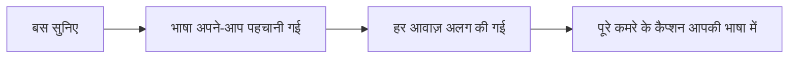
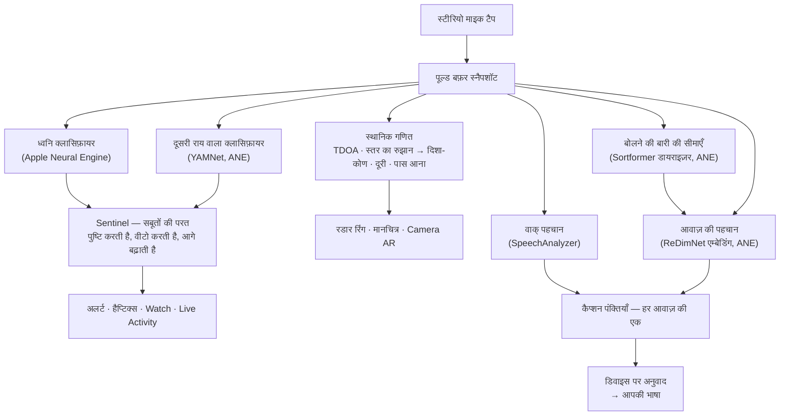
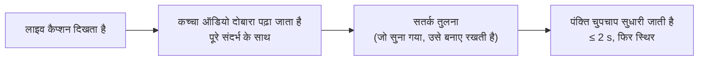
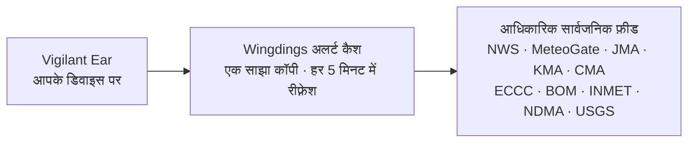

# Vigilant Ear 👂🛡️

*संस्करण 1.1.9 · सितंबर 2026 से प्रभावी।*

## उन लोगों के लिए एक ध्वनिक रडार, जो सुन नहीं सकते।

यह ऐप ख़ास तौर पर बधिर, कम सुनने वाले और CODA समुदाय के लिए बनाया गया है। ज़्यादातर ध्वनि-पहचान ऐप आपको बस यह बताते हैं कि कोई आवाज़ *क्या* है। **Vigilant Ear बताता है कि आवाज़ कहाँ है, कौन उसे निकाल रहा है, और वे क्या कह रहे हैं** — यह iPhone को एक रियल-टाइम ध्वनिक ट्राइकॉर्डर में बदल देता है, जो आपके आसपास की आवाज़ों का ब्योरा देता है।

सायरन की दिशा और दूरी। आपके पीछे से आती खटखट। बातचीत में शामिल लोग, अलग-अलग ट्रांसक्राइब की गई आवाज़ों के रूप में — हर एक का अपना कैप्शन, हर एक अपनी दिशा में। अगर कोई ऐसी भाषा बोल रहा है जिसे आप नहीं पढ़ते, तो उसके शब्द **आपकी भाषा में अनुवाद होकर** आ सकते हैं। अलर्ट आपकी **लॉक स्क्रीन, Dynamic Island और Apple Watch** तक पहुँचते हैं, ताकि एक नज़र डालना ही काफ़ी हो।

जो कुछ भी मायने रखता है, वह डिवाइस पर ही चलता है। पहचान के लिए ऑडियो न रिकॉर्ड किया जाता है, न अपलोड। किसी भी चीज़ के लिए कुछ सुनना ज़रूरी नहीं।

- 🧭 **सिर्फ़ आवाज़ का पता नहीं, उसकी दिशा भी।** *क्या, कहाँ, कौन,* और *क्या कहा गया* — महज़ “कोई आवाज़ हुई” नहीं।
- 📣 **नाम पुकारा गया।** अपना, किसी बच्चे का या साथी का नाम सूची में डालें — “Marie का ऑर्डर तैयार” सुनते ही घड़ी पर टैप होता है और वह बताती है कि आवाज़ किस ओर से आई।
- 🔒 **डिज़ाइन से ही निजी।** वर्गीकरण, कैप्शनिंग और अनुवाद आपके iPhone पर चलते हैं। कैप्शन लाइव और क्षणिक होते हैं; उन्हें ट्रांसक्रिप्ट संग्रह के रूप में सहेजा नहीं जाता।
- ⌚ **आपकी कलाई पर और लॉक स्क्रीन पर।** Apple Watch का दिशा-सहायक ऐप + Live Activity, आख़िरी अलर्ट और वह किस तरफ़ से आया — दोनों को बस एक नज़र की दूरी पर रखते हैं।
- 🛰️ **ज़्यादा फ़ोन, एक साझा कान।** Constellation, Ultra-Wideband वाले iPhone को आपस में जोड़ता है, ताकि हर फ़ोन जो सुनता है उसे मिलाकर दिशा की ज़्यादा साफ़ तस्वीर बने।
- 👁️ **बधिर / कम सुनने वाले / CODA लोगों के लिए बना।** साफ़ अलग पहचाने जाने वाले हैप्टिक्स, हाई-कॉन्ट्रास्ट विज़ुअल, रंग पर निर्भर न रहने वाले संकेत, बड़े टैप टारगेट, और हर जगह Reduce Motion का सम्मान।

---

## यह किसके लिए है

- **बधिर, कम सुनने वाले और CODA उपयोगकर्ता**, जो अपने आसपास की आवाज़ों के प्रति सजग रहना चाहते हैं — Home Watch (खटखट, अलार्म, बच्चा, फ़ोन) और Street Watch (सायरन, पास आती आवाज़), जिन्हें आप चालू छोड़ सकते हैं और जिन पर भरोसा कर सकते हैं।
- कोई भी, जिसे **दिशा के साथ और हर वक्ता को अलग दिखाने वाले लाइव कैप्शन** चाहिए, या पास बैठे लोगों की बातों का **डिवाइस पर ही अनुवाद**।
- सुलभता और ध्वनिक शोध से जुड़े उपयोगकर्ता, जिनकी रुचि डिवाइस पर ही ध्वनि-स्रोत का स्थान पता लगाने में है।

> Vigilant Ear सुलभता के लिए एक **सहायक साधन** है, कोई प्रमाणित जीवन-सुरक्षा उपकरण नहीं।

---

## यह क्या करता है

### 🧭 यह आवाज़ को देखता है — दिशा और दूरी
iPhone के दो माइक्रोफ़ोन की मदद से Vigilant Ear **आवाज़ का कोण, और यह कि वह आपके आगे है या पीछे**, मापता है, उस रीडिंग को लगभग एक डिग्री के भीतर स्थिर रखता है, और उसे हेडिंग-अप रडार रिंग और मानचित्र पर एक लाइव मार्कर के रूप में दिखाता है। एक ही रेखा पर लगे दो माइक्रोफ़ोन अपने-आप बाएँ और दाएँ में फ़र्क़ नहीं कर सकते — आपके दाईं ओर 50° से आती आवाज़ और बाईं ओर 50° से आती आवाज़, दोनों एक जैसे बेहद छोटे समय-अंतर के साथ पहुँचती हैं — इसलिए ऐप रीडिंग के साथ **दूसरी ओर एक हल्की परछाईं** भी दिखाता है, और कलाई का एक मोड़ या दूसरा फ़ोन इसे सुलझा देता है। दूरी का अनुमान आवाज़ की तीव्रता से, सड़क पर कैलिब्रेट किए गए एक वक्र के आधार पर लगाया जाता है, और उसे अनुमान के रूप में ही दिखाया जाता है: *≈ 50 ft*, संभावित दायरे के साथ — उस देश की इकाइयों में जहाँ आप हैं, न कि उस भाषा के हिसाब से जिसमें आप ऐप पढ़ते हैं। आप चलें-फिरें, तब भी मार्कर असली दुनिया में अपनी जगह पर टिके रहते हैं। यही इसका मूल है: उस दुनिया की स्थानिक समझ, जिसे आप सुन नहीं सकते। (आँकड़े नीचे।)

### 🚨 यह ज़रूरी आवाज़ों को पहचानता है — और आपको सावधान करता है
डिवाइस पर चलने वाला एक क्लासिफ़ायर सैकड़ों रोज़मर्रा की आवाज़ें पहचानता है और गंभीर श्रेणियों पर नज़र रखता है — **सायरन, अलार्म — जिनमें कार-अलार्म की एक अलग श्रेणी भी शामिल है — डोरबेल/खटखट, बच्चे का रोना, पास में कोई व्यक्ति, और गंभीर मौसम।** जब इनमें से कोई ट्रिगर होती है, तो आपको स्क्रीन पर एक साफ़ अलर्ट, वैकल्पिक **पुश सूचना**, और एक अलग **हैप्टिक** मिलता है — तब भी जब ऐप बैकग्राउंड में हो या फ़ोन स्लीप में हो। गंभीर श्रेणियाँ डिफ़ॉल्ट रूप से तैयार रहती हैं, ताकि सूचनाएँ चालू करने का मतलब “सब कुछ बंद” न हो। सभी अलर्ट श्रेणियाँ बंद कर दें, तो बैटरी बचाने के लिए बैकग्राउंड में इंजन पूरी तरह सुप्त अवस्था में चला जाता है। एक **Sentinel** परत अलर्ट को स्वतंत्र सबूतों — दिशा, गति और सार्वजनिक फ़ीड — से मिलाकर जाँचती है, ताकि जो अलर्ट बजे उसकी पुष्टि हो चुकी हो, वह किसी अकेले क्लासिफ़ायर का अंदाज़ा न हो। यह दोनों तरफ़ काम करता है: किसी गाने के भीतर सायरन जैसा कोई पल रोक लिया जाता है, लेकिन आपके संगीत के बीच बार-बार बजता असली सायरन उस रोक को तोड़कर अलर्ट दे देता है।

गंभीर मौसम की चेतावनियाँ आधिकारिक सार्वजनिक फ़ीड से आती हैं — अमेरिका का **NWS**, यूरोप का **MeteoGate**, **चीन CMA**, **कोरिया KMA**, **जापान JMA**, **कनाडा ECCC**, **ऑस्ट्रेलिया BOM**, **ब्राज़ील INMET**, और **भारत NDMA** — सभी उपयोगकर्ताओं के लिए मुफ़्त। फ़ीड को उन्हीं तक सीमित रखा जाता है जो आपके स्थान को कवर करती हैं। जापान में ऐप JMA के **अग्रिम बुलेटिन** भी पढ़ता है — टाइफ़ून या भारी बारिश से कई दिन पहले जारी होने वाली सरल भाषा की सूचनाएँ, न कि सिर्फ़ ख़तरा आ जाने के बाद जारी होने वाली चेतावनियाँ — और साथ ही अचानक मूसलाधार बारिश और भूस्खलन के बुलेटिन भी। अग्रिम सूचनाएँ चुपचाप दिखाई जाती हैं, बिना उस आवाज़ और कंपन के जो असली चेतावनी के लिए रखे गए हैं।

### ⌚ Apple Watch + Live Activity — एक नज़र में जानें
- **Apple Watch सहायक ऐप** — आपकी कलाई पर अलर्ट की दिशा की ओर इशारा होता है, ताकि एक नज़र में पता चल जाए कि कहाँ देखना है। नए सिरे से डिज़ाइन किया गया Watch UI, जिसमें ऐप का कान वाला आइकन, ख़तरा-HUD लेआउट, और अलर्ट हटाने के लिए डबल-टैप है। Watch ऐप खुला न हो, तब भी अलर्ट दिशा का तीर दिखा सकते हैं।
- **Live Activity** — Vigilant Ear आपकी **लॉक स्क्रीन** पर, **Dynamic Island** में और **Watch Smart Stack** में बना रहता है, ताकि आख़िरी अलर्ट और उसका दिशा-कोण हमेशा बस एक नज़र की दूरी पर हों।
- **कलाई पर साथी के अलर्ट** — जब Constellation से जुड़े किसी साथी का फ़ोन अलर्ट देता है, तो वह अलर्ट दिशा समेत आपकी Watch तक भी पहुँच सकता है। विश्वसनीयता पर किए गए सुधार की बदौलत सहायक ऐप पूरे दिन Watch की बैटरी पर हल्का रहता है।

### 💬 Speaker Mode — लाइव, दिशा बताने वाले कैप्शन *(मुफ़्त)*
**Speaker Mode** चालू करें, और Vigilant Ear आपके आसपास बात कर रहे लोगों की बातें **कैप्शन ब्लॉक में ट्रांसक्राइब करता है, हर आवाज़ का एक ब्लॉक।** डिवाइस पर होने वाला स्पीकर डायराइज़ेशन आवाज़ों को अलग-अलग रखता है — *कौन* *क्या* कह रहा है — और भीतरी रिंग पर दिशा का संकेत देता है। जो व्यक्ति अभी बोल रहा है, उसे हाइलाइट किया जाता है; जगह की ज़रूरत पड़ने पर पुराना टेक्स्ट स्क्रॉल होकर हट जाता है।

दो चीज़ें, जो ज़्यादातर कैप्शन ऐप नहीं करते: **भरोसे के स्तर के बारे में ईमानदारी** — हर पंक्ति पर एक हल्का-सा गुणवत्ता चिह्न और संदिग्ध शब्दों के नीचे बिंदुदार रेखाएँ बताती हैं कि कब किसी पंक्ति पर भरोसा करें और कब दोबारा जाँच लें — और **ख़ुद को सुधारना**: कोई वाक्य पूरा होते ही ऐप पूरे संदर्भ के साथ ऑडियो को दोबारा पढ़ता है और एक-दो सेकंड के भीतर छूटा हुआ या ग़लत सुना गया शब्द बहाल कर सकता है, फिर टेक्स्ट स्थिर हो जाता है।

**नाम पुकारा गया** (प्राथमिकताएँ में; जब तक आप चालू न करें, बंद रहता है) उन कैप्शन में आपकी सूची के नामों पर नज़र रखता है — आपका, किसी बच्चे का, किसी साथी का। जब कोई कहता है “Marie का ऑर्डर तैयार,” तो आपको एक अलग हैप्टिक और दिशा के साथ Watch अलर्ट मिलता है, न कि एक और कैप्शन बबल। शब्द Speaker Mode में बोली के रूप में दिखते रहते हैं; यह वह टैप है जो बताता है कि बात *आपसे* की जा रही थी।

**अपशब्द छिपाए जा सकते हैं** (प्राथमिकताएँ → कैप्शन)। वरना गालियाँ सीधे-सादे टेक्स्ट के रूप में आती हैं, उन्हें नरम करने वाला कुछ नहीं होता, और पढ़ने वाले को पहले से नज़र हटा लेने का मौक़ा नहीं मिलता; इसे चालू करें, तो वे शब्द प्रतीकों से बदल दिए जाते हैं, ताकि वाक्य उस शब्द के बिना भी पढ़ा जा सके। क्या अपशब्द माना जाए, यह आपके डिवाइस का अपना वाक्-पहचान इंजन तय करता है — हमारी कोई शब्द-सूची नहीं — इसलिए यह उसी भाषा के हिसाब से चलता है जिसे ट्रांसक्राइब किया जा रहा है। जिस खाते को 18 से कम उम्र का घोषित किया गया है, उस पर यह हमेशा चालू रहता है और ताले का निशान दिखाता है। यह उस बोली पर लागू होता है जिसे *यह* डिवाइस ट्रांसक्राइब करता है; जोड़े गए फ़ोन से भेजा गया टेक्स्ट वहीं ट्रांसक्राइब हुआ था और तैयार टेक्स्ट के रूप में पहुँचता है।

**बोलने वाले ने जिस शब्द पर ज़ोर दिया, वह बोल्ड में दिखता है।** बोलकर कहे जाएँ, तो "मैंने ‘वह’ नहीं कहा" और "मैंने वह नहीं कहा" दो अलग वाक्य हैं, और एक जैसा ट्रांसक्रिप्ट यह फ़र्क़ पूरी तरह खो देता है। ऐप उस एक शब्द को पकड़ता है जिस पर बोलने वाले की आवाज़ का सुर ऊपर उठा, और उसे बोल्ड कर देता है — एक पंक्ति में ज़्यादा से ज़्यादा एक, और जब पक्का न हो तो एक भी नहीं, क्योंकि ग़लत शब्द चिह्नित करना किसी से वह कहलवाना है जो उसने कहा ही नहीं। चीनी और जापानी में यह बंद रहता है, क्योंकि वहाँ सुर यह बताता है कि *शब्द कौन-सा है*, न कि उस पर कितना ज़ोर दिया गया।

कैप्शन मुफ़्त हैं; अपने-आप होने वाला अनुवाद Power Pack+ की वैकल्पिक परत है। कैप्शन को **आपके ब्लूटूथ हियरिंग डिवाइस पर बोलकर भी सुनाया जा सकता है** — मुफ़्त, प्राथमिकताएँ में। **दिशा टोन** (ये भी मुफ़्त, प्राथमिकताएँ → कैप्शन में) आपके चुने हुए कान में एक वैकल्पिक ऑडियो संकेत जोड़ते हैं, जो बताता है कि बोलने वाला कहाँ है — हियरिंग एड के साथ या सिर्फ़ एक कान से सुनने वालों के लिए उपयोगी, और हर किसी के लिए उपलब्ध।

### 🌐 स्वतः-अनुवाद — आपकी भाषा, लाइव *(Power Pack+)*
Speaker Mode चालू होने पर, जब पास का कोई व्यक्ति दूसरी भाषा बोलता है, तो Vigilant Ear उसे पहचानकर उसके कैप्शन **आपकी भाषा में** दिखा सकता है, और उसके ब्लॉक पर मूल भाषा भी दिखाई जाती है। पूरी कड़ी — सुनना → वक्ताओं को अलग करना → ट्रांसक्राइब करना → अनुवाद करना → दिखाना — **डिवाइस पर ही** चलती है; नेटवर्क की ज़रूरत सिर्फ़ एक बार पड़ती है, जब Apple से भाषा-पैक डाउनलोड होता है, और अगर आप उसी डाउनलोड का इंतज़ार कर रहे हों, तो ऐप आपको बिना अनुवाद वाले टेक्स्ट को ताकते रहने देने के बजाय साफ़ यही बता देता है। आपको पहले से दूसरी भाषा जानने या चुनने की ज़रूरत नहीं।

आज उपलब्ध चीज़ों में यह **साइंस फ़िक्शन के यूनिवर्सल ट्रांसलेटर** के सबसे क़रीब है — वह उपकरण जो बस समझ जाता है। Vigilant Ear भाषा ख़ुद पहचानता है, कमरे में हर वक्ता पर नज़र रखता है, और सबके कैप्शन आपकी भाषा में दिखाता है — न ईयरबड, न कोई सेटअप, सब आपके डिवाइस पर।

### 🎵 संगीत और प्रसारण की जानकारी *(Power Pack+)*
**ShazamKit** आपके आसपास बज रहे संगीत को पहचानता है और गाने के बदलावों पर भी नज़र रखता है।

### 🎛️ Acoustic Scope — आवाज़ को एक इंजीनियर की नज़र से देखें
आपके आसपास की आवाज़ का पेशेवर स्तर का लाइव दृश्य: स्पेक्ट्रम, स्पेक्ट्रोग्राम, ⅓-ऑक्टेव RTA बैंड, क्रोमा, और हार्मोनिक आंशिक स्वर — **सबके लिए मुफ़्त**। **‘आंशिक’ टैब संगीत पढ़ता है:** हर स्वर को उसके नोट के नाम से बताया जाता है और बगल में उसकी हार्मोनिक शृंखला दिखती है, स्मोक अलार्म जैसी ऊँची आवाज़ों को उनकी असली पिच पर नाम दिया जाता है, और आप एक लक्ष्य नोट तय कर सकते हैं, जो एक रेखा के रूप में दिखता है, ताकि आप उसके साथ मिलाकर गा सकें या साज़ ट्यून कर सकें। इसे चलाने पर फ़ोन ठंडा रहता है — स्पेक्ट्रोग्राम खुला छोड़ने पर लगभग कुछ भी ख़र्च नहीं होता, चाहे आप कितनी भी देर देखें। अपने ख़ुद के कस्टम पैक ट्रेन करने के लिए आवाज़ें कैप्चर करने वाले टूल Power Pack+ का हिस्सा हैं।

### 📦 कस्टम साउंड पैक — इसे अपनी दुनिया सिखाएँ *(Power Pack+)*
Vigilant Ear को वे आवाज़ें सिखाएँ जो आपके लिए मायने रखती हैं — स्थानीय पक्षियों से लेकर आपकी बिल्डिंग की डोर-चाइम तक। ऐड-ऑन पैक पहले से मौजूद पहचान के ऊपर जुड़ते हैं, इसलिए नई आवाज़ें कभी सायरन और अलार्म को पीछे नहीं धकेलतीं। ऐप में ही चरण-दर-चरण गाइड मौजूद है।

### 🛰️ Constellation — कई iPhone, एक साझा कान *(Power Pack+)*
Ultra-Wideband वाले दो या ज़्यादा iPhone (iPhone 11 से लेकर अब तक के ज़्यादातर मॉडल) होने पर, **Constellation** उन्हें आपस में जोड़ता है, ताकि वे एक-दूसरे की स्थिति भाँप सकें और हर फ़ोन जो सुनता है, उसे मिलाकर एक ही, ज़्यादा सटीक तस्वीर बना सकें कि आवाज़ कहाँ से आ रही है — सुनने वाली एक वितरित, निष्क्रिय सरणी। कैप्शन भी मिलाए जाते हैं: हर फ़ोन वही ट्रांसक्राइब करता है जो उसका अपना माइक्रोफ़ोन सुनता है, और सभी फ़ोन के शब्दों का आपस में मिलान किया जाता है, ताकि जो फ़ोन वक्ता के सबसे पास है, उसका सुना हुआ शामिल हो — जो शब्द सिर्फ़ एक फ़ोन ने पकड़े, वे खोते नहीं, रखे जाते हैं। फ़ोन **सीधे एक-दूसरे से** जुड़ते हैं — न राउटर, न साझा Wi-Fi नेटवर्क, न इंटरनेट; बस Wi-Fi चालू होना चाहिए, और जुड़ाव उसी पीयर-टू-पीयर लिंक पर होता है जिसका इस्तेमाल AirDrop करता है। यह सिर्फ़ सही हार्डवेयर वाले डिवाइस पर ही उपलब्ध है। किसी पीयर के जुड़ने के समय से पुराने मेश कैप्शन दोबारा नहीं भेजे जाते।

**साथियों को संदेश** — जुड़े हुए साथी के फ़ोन पर एक छोटा-सा टेक्स्ट भेजें; वह उनकी कैप्शन फ़ीड में आ जाता है और डिवाइस पर ही उनकी भाषा में अनुवाद होकर पहुँच सकता है। मैसेजिंग उम्र का ध्यान रखती है: यह Apple के Declared Age Range पर आधारित है, और किसी वयस्क और नाबालिग के बीच टेक्स्टिंग तब तक बंद रहती है, जब तक दोनों ने जान-बूझकर एक-दूसरे को नाम न दिया हो। अलर्ट और कैप्शन पर कभी कोई रोक नहीं होती — रोक सिर्फ़ व्यक्ति-से-व्यक्ति टेक्स्टिंग पर है।

### 🔗 Remote Link — उस तक पहुँचें जो आपके साथ नहीं है *(शुरू करने के लिए Power Pack+)*
जो काम आम तौर पर फ़ोन कॉल से होता है, वही काम वीडियो और टेक्स्ट से। आप एक आमंत्रण कोड भेजते हैं; दूसरा व्यक्ति **Power Pack+ के बिना** ही Vigilant Ear के भीतर से जुड़ जाता है। Constellation के विपरीत, यहाँ पास-पास होने की कोई शर्त नहीं — आप दोनों कहीं भी हो सकते हैं।

**किसी भी समय ऑडियो का इस्तेमाल नहीं होता।** सिर्फ़ वीडियो और टेक्स्ट, इसलिए इस लिंक की कोई भी चीज़ किसी भी छोर पर सुनने पर निर्भर नहीं करती — और इससे आपको ऐप के ज़रिए किसी से सांकेतिक भाषा में बात करने का एक रास्ता मिलता है। ऐप ख़ुद सांकेतिक भाषा नहीं समझता; वह वीडियो पहुँचाता है, बाक़ी आप दोनों करते हैं। जहाँ भी नेटवर्क इजाज़त देता है, कनेक्शन दोनों फ़ोन के बीच सीधा होता है, और ऐप साफ़-साफ़ दिखाता है कि कनेक्शन **Direct** है या **Relayed**, ताकि आपको हमेशा पता रहे कि आपका वीडियो किसी रिले से होकर जा रहा है या नहीं।

**कैप्शन भी साथ जाते हैं।** हर फ़ोन जो ट्रांसक्राइब करता है, वह दूसरे फ़ोन पर दिखता है — ज़रूरत हो तो पढ़ने वाले की भाषा में अनुवाद होकर। आप दोनों में से कोई भी लिंक को — वीडियो और कैप्शन, दोनों को — रोक सकता है और फिर से चालू कर सकता है, और मुख्य स्क्रीन से ही लिंक ख़त्म कर सकता है।

### 📷 Camera AR — “आवाज़ को देखिए”
शीर्षक पट्टी पर कैमरा पिल खोलें और पहचानी गई आवाज़ों को लाइव कैमरा दृश्य में उनके असली दिशा-कोण पर पिन करें। मार्कर वक्ता के हिसाब से, या ध्वनि की श्रेणी और दिशा के हिसाब से समूह बना लेते हैं, ताकि दृश्य पढ़ने लायक बना रहे; स्रोत चुप हो जाने पर समय के साथ धीरे-धीरे फीके पड़ जाते हैं।

### 🗺️ मानचित्र, सड़कें और रास्ते का पूर्वानुमान
आवाज़ों के दिशा-कोण मानचित्र पर असली GPS निर्देशांकों में बदलकर दिखाए जाते हैं। वाहनों की आवाज़ों को **पास की सड़कों पर स्नैप किया जा सकता है** और उनके रास्ते का अनुमान लगाया जा सकता है, ताकि गुज़रता हुआ ट्रक इमारतों के आर-पार नहीं, बल्कि *सड़क के साथ-साथ* चलता दिखे। (फ़ायर-ट्रक डेमो आज़माएँ।)

### 🪄 Feature Playground — बिना सुने परखें
**Feature Playground** सबके लिए खुला है: Home और Street अभ्यास (खटखट, अलार्म, बच्चा, सायरन, मौसम), कई फ़ोन वाले और बातचीत वाले डेमो, और एक साफ़ वॉटरमार्क, ताकि अभ्यास कभी असली घटना होने का दिखावा न करे। पैनल बंद करते ही डेमो पूरी तरह साफ़ हट जाते हैं (न कोई अटकी हुई नकली GPS लोकेशन, न कोई बचे हुए फ़्लैग)।

### ♿ सुलभता सबसे पहले
बधिर / कम सुनने वाले / CODA और रंग-अंधता वाले उपयोगकर्ताओं के लिए बना: **रंग पर निर्भर न रहने वाले** संकेत, **≥44 pt** के टैप टारगेट, **Reduce Motion** का सम्मान, अरबी पढ़ने वालों के लिए **दाएँ-से-बाएँ लेआउट**, कई माध्यमों वाले अलर्ट (हैप्टिक + दृश्य + Watch), और ऐप शुरू होने पर एक सत्यापन स्क्रीन, जो अनुमतियों की स्थिति साफ़ हरे / स्लेटी / लाल (और “अनुमति नहीं” के लिए गहरे नारंगी) रंगों में दिखाती है — इसमें सूचनाओं की अनुमति भी शामिल है, जो सभी अलर्ट के मुख्य स्विच का काम करती है।

---

## मुफ़्त और Power Pack+

सुरक्षा का मूल हिस्सा **हमेशा के लिए मुफ़्त** है:

- **Home Watch और Street Watch** — आसपास की आवाज़ों के अलर्ट (अलार्म, सायरन, खटखट/डोरबेल, बच्चा, पास में कोई व्यक्ति), जो स्क्रीन पर, हैप्टिक से और वैकल्पिक रूप से पुश सूचना के ज़रिए मिलते हैं।
- **लाइव कैप्शन** — Speaker Mode, डिवाइस पर ही, जहाँ हार्डवेयर साथ दे वहाँ दिशा के साथ; भरोसे के ईमानदार निशान, ~2 सेकंड में अपने-आप सुधार, ब्लूटूथ हियरिंग डिवाइस पर वैकल्पिक रूप से बोलकर सुनाना, और दिशा टोन।
- **नाम पुकारा गया** — आपके टाइप किए हुए वैकल्पिक नाम (आपका, बच्चों का, साथी का)। नाम मिलने पर दिशा-कोण के साथ Watch/फ़ोन पर अलर्ट आता है, कोई दूसरा कैप्शन नहीं।
- **Standing Watch** — कमरे की अपनी स्थिति, हमेशा चालू, सेट करने के लिए कुछ नहीं: जब तक कमरा अपने ढर्रे पर बना रहता है, एक स्थिर सियान लैंप, और कुछ बदलते ही एम्बर — कोई नई आवाज़, अचानक सन्नाटा, या कुछ पास आता हुआ।
- **गंभीर मौसम के अलर्ट** — आपके क्षेत्र के लिए NWS, MeteoGate (यूरोप — हमारे 5-मिनट वाले अलर्ट कैश से ताज़ा), CMA, KMA, JMA (जापान), ECCC (कनाडा), BOM (ऑस्ट्रेलिया), INMET (ब्राज़ील), और NDMA (भारत)।
- **भूकंप अलर्ट (USGS, दुनिया भर में)** — जब आसपास किसी भूकंप की सूचना आती है, तो आपको एक कंपन महसूस होता है और मानचित्र पर वह इलाक़ा दिखता है जहाँ झटके महसूस किए गए। यह आधिकारिक USGS फ़ीड से मिली पुष्टि है — पूर्व-चेतावनी नहीं: अगर आपने झटके महसूस किए, तो यह बताता है कि वह क्या था। डिवाइस पर होने वाली गहरी गड़गड़ाहट (इन्फ़्रासाउंड) की पहचान, ज़मीन हिलते ही इस जाँच को सक्रिय कर सकती है।
- **Feature Playground** — साफ़ दिखने वाले प्रीव्यू वॉटरमार्क के साथ अभ्यास अलर्ट और सुविधाओं की झलक।
- **Apple Watch सहायक ऐप और Live Activity** — एक नज़र में दिशा और आख़िरी अलर्ट।
- **Acoustic Scope** — पेशेवर स्तर का लाइव ध्वनि विज़ुअलाइज़ेशन, सबके लिए मुफ़्त। (ट्रेनिंग के लिए कैप्चर करने वाले टूल Power Pack+ में हैं।)

**Power Pack+** एक बार का अनलॉक है (**सब्सक्रिप्शन नहीं**), **90 दिन के मुफ़्त ट्रायल** के साथ। यह ये सुपरपावर जोड़ता है:

- **स्वतः-अनुवाद** — आसपास की बातचीत का डिवाइस पर ही आपकी भाषा में अनुवाद।
- **Constellation** — Ultra-Wideband के ज़रिए कई iPhone का साझा श्रवण, साथियों को संदेश भेजने की सुविधा के साथ।
- **Music ID** — ShazamKit से गाने की पहचान।
- **कस्टम साउंड पैक** — अपनी आवाज़ों के लिए आपके द्वारा ट्रेन किए गए ऐड-ऑन क्लासिफ़ायर।

मुफ़्त हो या Power Pack+, **पहचान के लिए आपका ऑडियो डिवाइस पर ही रहता है** — फ़र्क़ सिर्फ़ इतना है कि कौन-सी सुविधाएँ अनलॉक होती हैं; इससे यह कभी नहीं बदलता कि कच्चा ऑडियो विश्लेषण के लिए कहाँ भेजा जाता है।

---

## यह कैसे काम करता है (परदे के पीछे)

Vigilant Ear एक **लोकल-फ़र्स्ट, डिवाइस पर चलने वाली** पाइपलाइन है, जो परतों में बनी है: आवाज़ एक बार कैप्चर करें, फिर स्वतंत्र विशेषज्ञों को वही आवाज़ पढ़ने दें और एक-दूसरे के काम की जाँच करने दें। कच्चा ऑडियो एक हाई-प्रायोरिटी टैप पर कैप्चर होता है, एक **पूल्ड बफ़र फ़्री-लिस्ट** में कॉपी किया जाता है (रियल-टाइम पथ पर बार-बार मेमोरी एलोकेशन की उठा-पटक नहीं), और UI को रोके बिना अलग-अलग हिस्सों तक पहुँचाया जाता है:

किसी भी एक मॉडल पर अकेले भरोसा नहीं किया जाता। **Sentinel** परत पहचान और अलर्ट के बीच बैठती है: स्वतंत्र इंजन फ़्रेम-दर-फ़्रेम एक-दूसरे की पुष्टि करते हैं या उन्हें वीटो करते हैं — और जब किसी वीटो के ख़िलाफ़ असली दुनिया के सबूत बार-बार जमा होते जाते हैं (आपके संगीत के बीच गूँजता असली सायरन), तो सबूत जीतते हैं और अलर्ट बज उठता है।

कैप्शन को भी अपना दूसरा मौक़ा मिलता है। हर अंतिम रूप ले चुका वाक्य, मेमोरी में रखी एक छोटी ऑडियो रिंग से पूरे संदर्भ के साथ चुपचाप दोबारा पढ़ा जाता है — सुधार लगभग दो सेकंड के भीतर हो जाते हैं, फिर टेक्स्ट हमेशा के लिए स्थिर हो जाता है:

- **स्थानिक गणित** — FFT, कोहेरेंस-भारित आगमन समय-अंतर (TDOA — उन फ़्रीक्वेंसी बैंड को तरजीह देना जिन पर दोनों माइक्रोफ़ोन सहमत हों, फिर पहुँचने में लगे बेहद छोटे अंतर को दिशा-कोण में बदलना), और बैकग्राउंड टास्क पर स्तर के रुझान से पास आने की ट्रैकिंग। माइक्रोफ़ोन की जोड़ी को एक तय ओरिएंटेशन में पढ़ा जाता है, ताकि दिशा एक जैसी काम करे, चाहे आप फ़ोन सीधा पकड़ें या आड़ा।
- **स्पीच** — ट्रांसक्रिप्शन के लिए iOS 26 का `SpeechAnalyzer` / `SpeechTranscriber`; डिवाइस पर अनुवाद के लिए Apple का **Translation** फ़्रेमवर्क। आवाज़ की पहचान सबूतों पर आधारित है: किसी आवाज़ को असली व्यक्ति के रूप में तभी पक्का माना जाता है, जब आवाज़ की स्वतंत्र विंडो से इसकी पुष्टि हो, और अनिश्चित मिलान को ग़लत नाम का अंदाज़ा लगाने के बजाय बिना नाम के दिखाया जाता है।
- **दो सवालों के लिए दो मॉडल** — आवाज़ों को अलग-अलग पहचानने के लिए यह जानना ज़रूरी है कि *वक्ता कब बदला* और *वह वक्ता कौन है*, और ये एक ही समस्या नहीं हैं। एक **Sortformer** स्ट्रीमिंग डायराइज़र बोलने की बारियों की सीमाएँ चिह्नित करता है; **ReDimNet** एम्बेडिंग तय करते हैं कि हर बारी के भीतर किसकी आवाज़ है। सीमा पर ही काटना जितना सुनने में लगता है, उससे कहीं ज़्यादा अहम है: जो विंडो दो लोगों के बीच फैली हो, उसमें दोनों होते हैं, और कोई भी एम्बेडिंग मॉडल बाद में इसे पलट नहीं सकता। इन दोनों के नीचे आवाज़ की गतिविधि पहचानने वाली एक बुनियादी परत है — अगर किसी मुश्किल कमरे में डायराइज़र अंदाज़ा लगाने के बजाय चुप हो जाए, तब भी बारियाँ काटी जाती हैं, ताकि ऐप दो वक्ताओं को मिलाकर एक करने के बजाय सिर्फ़ थोड़ा कमज़ोर पड़े।
- **संगीत की सच्चाई** — "क्या सचमुच संगीत बज रहा है?" का फ़ैसला एक क्रोमा-आधारित **गीत-सिग्नेचर डिटेक्टर** करता है, क्योंकि सामान्य क्लासिफ़ायर शांत कमरों और सायरन को भी "संगीत" कह देने के लिए बदनाम हैं। Shazam तभी चलता है जब सिग्नेचर भी सहमत हो कि वहाँ सचमुच कुछ संगीतमय है।
- **कॉन्करेंसी** — Swift 6 आइसोलेशन माइक्रोफ़ोन टैप, ध्वनिक गणित और UI रेंडर लूप को साफ़-साफ़ अलग रखता है।
- **दक्षता** — डाउनसैंपलिंग, लोड के हिसाब से ढलने वाला वर्गीकरण, और सबूत मिलने पर ही नेटवर्क का इस्तेमाल, हमेशा सुनते रहने को इतना हल्का रखते हैं कि इसे चालू छोड़ा जा सके।

मौसम और भूकंप के अलर्ट ऑडियो के उलटे रास्ते पर चलते हैं — आपके ऑडियो से जुड़ा कुछ भी कभी बाहर नहीं जाता, लेकिन अलर्ट का *डेटा* अंदर आता है। **हर** आधिकारिक फ़ीड हमारे द्वारा चलाए जाने वाले एक छोटे कैश से होकर आती है, ताकि सार्वजनिक डेटा को एक बार लाने से ही हर उपयोगकर्ता का काम चल जाए — और आपका फ़ोन कभी किसी विदेशी सरकार के सर्वर से संपर्क नहीं करता:

---

## आपका फ़ोन क्या सुन सकता है — मापकर देखा गया

आपके iPhone में लगभग छह इंच की दूरी पर लगे दो माइक्रोफ़ोन, एक बैरोमीटर और एक बहुत अच्छी घड़ी है। इतना यह बताने के लिए काफ़ी है कि आवाज़ किस तरफ़ है, मोटे तौर पर कितनी दूर है, क्या वह आपकी ओर आ रही है, और क्या अभी-अभी कोई दरवाज़ा खुला। नीचे बताया गया है कि इनमें से हर चीज़ कितनी सटीक है, हमने इसे कैसे जाँचा, और अगर आप ख़ुद वह आवाज़ नहीं सुन सकते, तो यह क्यों मायने रखता है। दिशा और उससे जुड़े आँकड़े सितंबर 2026 में एक iPhone 17 और एक iPhone 16 Pro Max पर मापे गए। दूरी अपने स्वभाव से ही एक अनुमान रहती है — हम स्क्रीन पर यही कहते हैं।

**दिशा — एक-दो डिग्री तक।** आवाज़ ऊपर वाले माइक्रोफ़ोन तक नीचे वाले से पहले पहुँचती है, या बाद में, और उसी अंतर से ऐप यह निकालता है कि आवाज़ फ़ोन की धुरी से कितनी हटकर है और वह सामने है या पीछे। फ़ोन के दोनों चैनल सीधे-सादे माइक्रोफ़ोन नहीं, बल्कि प्रोसेस की गई एक स्टीरियो इमेज हैं, और जब भी कमरे में शोर होता है, यह इमेज अपना एक तय पैटर्न जोड़ देती है। ऐप अब लॉन्च के बाद के कुछ शांत सेकंडों से यह पैटर्न सीख लेता है और दिशा पढ़ने से पहले उसे हटा देता है।

| हमने क्या मापा | नतीजा |
|---|---|
| 96 सिम्युलेटेड कमरों में मीडियन त्रुटि, शांत दफ़्तर से लेकर 5 dB SNR पर सख़्त दीवारों वाले कमरे तक | 1.0° |
| डेस्क पर रखा iPhone 17, कमरे का शोर चालू, स्पीकर धुरी से 30° हटकर | बगल वाले तल से 61.7° पढ़ा, जबकि अपेक्षित 60° था; डगमगाहट 1.6° |
| वही, स्पीकर ठीक फ़ोन के बगल की सीध में | 4.5° पढ़ा, जबकि अपेक्षित 0° था; डगमगाहट 2.2° |
| वही, स्पीकर ठीक सामने | हर रीडिंग अधिकतम देरी पर, जैसा होना चाहिए |
| आवाज़ के बजाय इमेज के अपने पैटर्न पर पड़ने वाली रीडिंग | कोई नहीं, किसी भी कोण पर |

*यह क्यों मायने रखता है:* अगर आप सायरन नहीं सुन सकते, तो "आपके पीछे, एक तरफ़" आपको बताता है कि कहाँ देखना है। स्थिर बनी रहने वाली रीडिंग पर तभी भरोसा करना ठीक है, जब उसे मापने के फ़ीते से जाँचा गया हो, और इसे जाँचा गया — दो बार; दूसरी बार तब, जब पहली जाँच ज़रूरत से ज़्यादा नरम निकली।

**दूरी — जो अनुमान है, उसे अनुमान के रूप में ही दिखाया जाता है।** एक माइक्रोफ़ोन दूरी नहीं माप सकता, सिर्फ़ आवाज़ की तीव्रता, और दूर का तेज़ ट्रक पास की धीमी कार जैसा सुनाई दे सकता है। ऐप एक असली सड़क पर फ़िट किए गए वक्र की मदद से आवाज़ की तीव्रता से दूरी का अनुमान लगाता है, और फिर उसे वैसे ही कहता है जैसे कोई सावधान व्यक्ति कहेगा: *लगभग 50 ft, शायद 25 से 100 के बीच।*

| हमने क्या मापा | नतीजा |
|---|---|
| कैलिब्रेशन से दोबारा गुज़ारे गए असली कार डिटेक्शन | 1,131 |
| जिस 100-फ़ुट सड़क पर कारें सचमुच थीं, उसी के भीतर आए अनुमान | 73% |
| दूर वाली लेन की कारें | अनुमान 78 और 87 ft, जबकि फ़ीते ने 73 और 85 ft बताया |

सड़क (शहर का एक चौराहा) को लेन-दर-लेन मापा गया; जब वक्र चूकता है, तो पास की तरफ़ चूकता है। कैलिब्रेशन एक ऑटोमेटेड टेस्ट से लॉक है, ताकि वह चुपचाप खिसक न सके। आपकी अपनी जगह के भीतर के अलार्म, जैसे स्मोक डिटेक्टर, को दूरी का कोई आँकड़ा दिया ही नहीं जाता — वे पहले से ही आपके साथ कमरे में हैं।

**गति — आपकी ओर आना।** कारों और सायरन के मामले में, आवाज़ का तेज़ होना आम तौर पर पास आने का मतलब होता है। ऐप देखता है कि कुछ सेकंडों में किसी आवाज़ का स्तर कितनी तेज़ी से बढ़ता है: लगभग 1.5 dB प्रति सेकंड की लगातार बढ़त (आवाज़ की तीव्रता में साफ़, स्थिर बढ़ोतरी) का मतलब है पास आना, उतनी ही गिरावट का मतलब है दूर जाना, और जो आवाज़ बदलना बंद कर दे, उसे लगभग चार सेकंड बाद इनमें से कुछ भी कहना बंद कर दिया जाता है। एक अकेला तेज़ पल — हॉर्न की एक छोटी-सी आवाज़, दरवाज़े का पटकना — इसे ट्रिगर नहीं कर सकता। यह भौतिकी और नौ ऑटोमेटेड टेस्ट पर आधारित है; सड़क पर पास से गुज़रती गाड़ी की रिकॉर्डिंग अगली फ़ील्ड पुष्टि है।

**कमरे की हवा — दरवाज़े का अपना सिग्नेचर होता है।** बैरोमीटर लगभग चौदह फ़ुट दूर खुलते दरवाज़े को भाँप सकता है: दरवाज़ा घूमते समय दबाव गिरता है, फिर बंद होते समय वापस उछलता है। चौदह घंटे की शांति और दरवाज़े की पंद्रह घटनाओं के दौरान, हर दरवाज़े ने यही दो हिस्सों वाला आकार बनाया, और घर में किसी और चीज़ ने नहीं।

| घटना | दबाव बदलने की दर | आकार |
|---|---|---|
| सामने का दरवाज़ा, खोला और बंद किया, ×10 | 0.6–1.8 Pa/s | गिरावट, फिर उछाल, ~5 s के अंतर पर |
| सामने का दरवाज़ा, ज़ोर से पटका, ×5 | 1.1–2.5 Pa/s | वही जोड़ी, ज़्यादा ऊँची |
| रात भर एयर कंडीशनिंग का चलना-रुकना, ×8 | 0.11–0.46 Pa/s | मिनटों में धीमी ढलान, दोनों फ़ोन पर एक जैसी |
| शांत कमरा | ~0.02 Pa/s | कुछ नहीं |
| पास से गुज़रना, छींकना | — | मोशन सेंसर इसे पकड़ लेता है और फ़ोन इसे अनदेखा कर देता है |

जाली वाला दरवाज़ा, जो कमरे को हवाबंद नहीं करता, दिखा ही नहीं — ठीक वैसे ही, जैसा होना चाहिए। आज दबाव में बदलाव मानचित्र पर गहरी गड़गड़ाहट के रूप में दिख सकता है; शांत रात के लिए दरवाज़े का एक अलग अलर्ट मापा और डिज़ाइन किया जा चुका है, लेकिन अभी यह रोज़ की डिफ़ॉल्ट सुविधा नहीं है।

**Constellation — दो फ़ोन तरफ़ तय कर देते हैं।** मेश का हर फ़ोन अपनी जगह से आवाज़ की ओर एक रेखा खींचता है, और ये रेखाएँ सिर्फ़ एक ही तरफ़ साफ़ तौर पर एक-दूसरे को काटती हैं। जब ऐसा होता है, तो परछाईं ग़ायब हो जाती है और ऐप फिर से बाएँ या दाएँ बता सकता है। सिमुलेशन में, **40 मीटर की दूरी पर रखे** दो फ़ोन 50 मीटर दूर के सायरन की जगह लगभग 2 मीटर के भीतर तक बता देते हैं।

**यहाँ की किसी भी बात पर भरोसा कैसे बनता है।** हर आँकड़ा क्रम से उन्हीं तीन कसौटियों से गुज़रा: एक सिम्युलेटेड कमरा, जिसका जवाब पहले से पता हो; छोटे ऑटोमेटेड टेस्ट, जो ठीक वही स्थिति दोबारा बनाते हैं जो ऐप को धोखा दे सकती है, और हर बदलाव पर चलते हैं; फिर असली डेस्क पर असली फ़ोन, जिनकी दूरियाँ हाथ से मापी गईं। जब तक कोई चीज़ तीसरी कसौटी पर खरी न उतरे, उसे सटीक नहीं माना जाता। जो व्यक्ति आवाज़ नहीं सुन सकता, उसके लिए ऐप की बात के सिवा कोई और बात नहीं होती — यह भरोसा वैसे ही कमाया जाना चाहिए, जैसे कोई प्रयोगशाला कमाती है।

इंजीनियरों के लिए विस्तृत नोट्स: [भौतिकी](https://vigilantear.com/en/physics/) — TDOA, दूरी, गति, Constellation और बैरोमीटर से पहचान, जिनमें हर आँकड़े पर MEASURED / BENCHED / MODELLED का टैग लगा है।

---

## गोपनीयता

- **मूल पाइपलाइन के लिए, हमेशा डिवाइस पर।** वर्गीकरण, स्थानिक गणित, ट्रांसक्रिप्शन, डायराइज़ेशन और अनुवाद आपके iPhone पर चलते हैं। पहचान के लिए कच्चा ऑडियो न रिकॉर्ड किया जाता है, न अपलोड।
- **कैप्शन क्षणिक होते हैं।** लाइव कैप्शन सत्र के दौरान मेमोरी में रहते हैं; एक्सपोर्ट किए गए डिबग लॉग में कैप्शन का टेक्स्ट शामिल नहीं होता।
- **कोई विज्ञापन या व्यवहार-विश्लेषण SDK नहीं।** नेटवर्क का सीमित इस्तेमाल सिर्फ़ मानचित्र, सार्वजनिक मौसम फ़ीड, वैकल्पिक Shazam फ़िंगरप्रिंट, सड़क की जानकारी और App Store ख़रीदारी के लिए होता है — पूरी नीति देखें।

पूरी जानकारी: [गोपनीयता नीति](/hi/privacy/) · [सेवा की शर्तें](/hi/terms/) · [सहायता](/hi/support/)

---

## हार्डवेयर और प्लेटफ़ॉर्म

- **iPhone (पूरा अनुभव)।** पोर्ट्रेट या लैंडस्केप, दोनों में काम करता है — जैसे चाहें पकड़ें। दिशा का पता लगाने के लिए स्टीरियो माइक्रोफ़ोन ज़रूरी हैं। अनुशंसित: **iPhone 13 या उससे नया**।
- **Apple Watch।** दिशा के तीर के साथ सहायक ऐप के अलर्ट; Live Activity / Smart Stack के साथ काम करता है।
- **iPad (नेटिव)।** अनुकूली लेआउट: बड़ी स्क्रीन पर लाइव कैप्शन को मानचित्र के बगल में एक पारदर्शी पैनल मिलता है, जो कोई न बोल रहा हो तो सिमट जाता है। सिंगल-चैनल माइक → पूरी दिशा के बिना कैप्शन।
- **Constellation** के लिए **Ultra-Wideband** चाहिए — iPhone 11 या उसके बाद का, SE और “e” मॉडल को छोड़कर। इसे Wi-Fi नेटवर्क की ज़रूरत **नहीं** है: Wi-Fi चालू होने पर फ़ोन एक-दूसरे को सीधे ढूँढ लेते हैं, इसलिए जब तक फ़ोन एक-दूसरे के पास हों, Constellation बिना राउटर और बिना इंटरनेट के काम करता है।
- **Android।** मूल रडार, अलर्ट, कैप्शन और मौसम के साथ एक अलग बिल्ड; Constellation मेश पहले iOS के लिए है। जैसे-जैसे Android बाक़ी सुविधाओं की बराबरी पर पहुँचता है, प्रोडक्ट साइट पर अपडेट देखें।

---

## स्थानीयकरण

पूरी तरह स्थानीयकृत — इंटरफ़ेस, अलर्ट और कैप्शन — **अंग्रेज़ी, स्पेनिश, पुर्तगाली (ब्राज़ील), फ़्रेंच, जर्मन, इतालवी, तुर्की, अरबी, जापानी, सरलीकृत चीनी, पारंपरिक चीनी, कोरियाई, रूसी, हिन्दी और रोमानियाई** में (15 भाषाएँ)। यह सिस्टम की भाषा-सेटिंग या ऐप में आपके मैन्युअल चुनाव का पालन करता है। रोमानियाई कैप्शन डिवाइस पर काम करते हैं; Apple Translate में रोमानियाई नहीं है, इसलिए स्वतः-अनुवाद उस भाषा के लिए मूल टेक्स्ट दिखाता है।

---

## स्थिति और अस्वीकरण

Vigilant Ear एक **प्रायोगिक ध्वनिक-सुलभता सहायक साधन** है, कोई प्रमाणित जीवन-सुरक्षा उपकरण नहीं। ध्वनि-स्रोत का स्थान बताने की बारीकी आसपास के माहौल, मौसम, हवा और माइक्रोफ़ोन हार्डवेयर के साथ बदलती है। **अपने आसपास के प्रति अपनी सामान्य सजगता हमेशा बनाए रखें** — इसे सुरक्षा जानकारी का अपना एकमात्र स्रोत न मानें।

कुछ क्षमताएँ (कैमरा AR मार्कर, Apple से मंज़ूरी मिलने पर Critical Alerts एंटाइटलमेंट का अपग्रेड, कई पैक वाली उन्नत ध्वनि-रचना) लगातार विकसित हो रही हैं; मुफ़्त Home / Street Watch और लाइव कैप्शन वह उत्पाद हैं, जिन पर आप पहले दिन से भरोसा कर सकते हैं।

---

**संपर्क:** [vigilantear@wingdingssocial.com](mailto:vigilantear@wingdingssocial.com)

बधिर और कम सुनने वाले समुदाय तथा ध्वनिक शोध के लिए ❤️ से बनाया गया।

    
  <strong>© 2026 Wingdings, Inc.</strong> 
  सर्वाधिकार सुरक्षित। 
  पेटेंट लंबित

