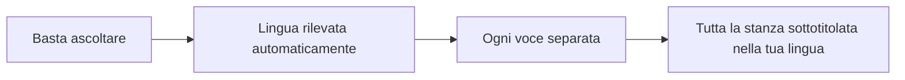
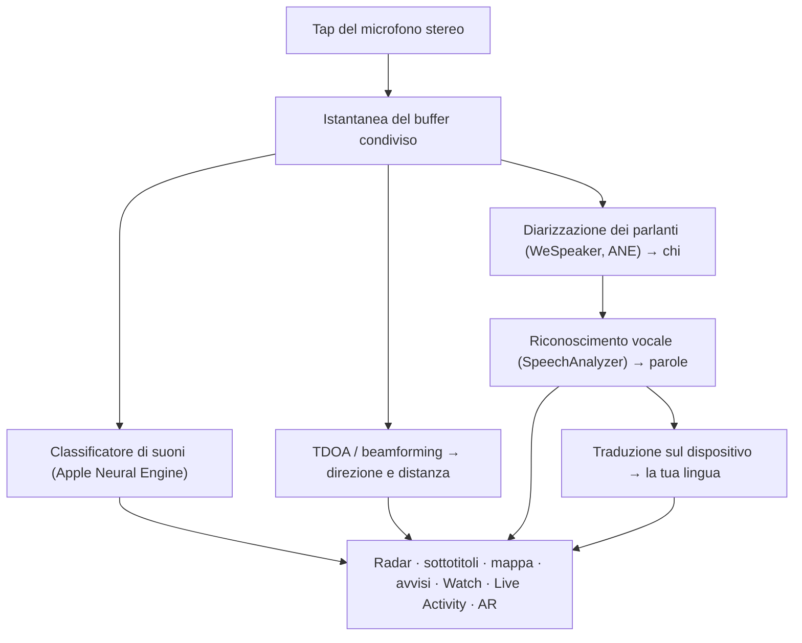

# Vigilant Ear 👂🛡️

*Un radar acustico per chi non può sentire.*

Un'app costruita appositamente per la comunità dei sordi, degli ipoudenti e dei CODA. La maggior parte delle app di riconoscimento dei suoni ti dice *che cos'è* un suono. **Vigilant Ear ti dice dov'è, chi lo sta producendo e che cosa sta dicendo** — trasformando un iPhone in un tricorder sonoro in tempo reale che descrive il suono intorno a te.

La direzione e la distanza di una sirena. Un colpo alle tue spalle. Le persone di una conversazione, disegnate come voci trascritte separate — ognuna sottotitolata e collocata direzionalmente. Se qualcuno parla una lingua che non leggi, le sue parole possono arrivare **tradotte nella tua.** Gli avvisi raggiungono la tua **schermata di blocco, la Dynamic Island e l'Apple Watch**, così basta un'occhiata.

Tutto ciò che conta viene eseguito sul dispositivo. L'audio non viene registrato né caricato in rete per il riconoscimento. Nulla dipende dal riuscire a sentire.

- 🧭 **Direzione, non solo rilevamento.** *Cosa, dove, chi* e *che cosa è stato detto* — non semplicemente «si è verificato un suono».
- 🔒 **Privato fin dalla progettazione.** Classificazione, sottotitoli e traduzione vengono eseguiti sul tuo iPhone. I sottotitoli sono in diretta ed effimeri; non vengono salvati come archivio di trascrizioni.
- ⌚ **Al polso e sulla schermata di blocco.** Il companion di direzione per Apple Watch + Live Activity tengono l'ultimo avviso e la sua provenienza a portata di sguardo.
- 🛰️ **Più telefoni, un unico orecchio condiviso.** Constellation collega gli iPhone dotati di Ultra-Wideband per fondere ciò che ciascuno sente in un'immagine direzionale più nitida.
- 👁️ **Fatta per sordi / ipoudenti / CODA.** Feedback aptici distinti, grafica ad alto contrasto, segnali indipendenti dal colore, ampie aree di tocco e rispetto dell'impostazione Riduci movimento ovunque.

---

## A chi è rivolta

- **Utenti sordi, ipoudenti e CODA** che vogliono una consapevolezza situazionale del suono — Home Watch (bussata, allarme, pianto del bambino, telefono) e Street Watch (sirena, avvicinamento) che puoi lasciare attivi e di cui puoi fidarti.
- Chiunque abbia bisogno di **sottotitoli in diretta con direzione e separazione dei parlanti**, o della **traduzione sul dispositivo** delle persone sedute lì vicino.
- Utenti dell'accessibilità e della ricerca acustica interessati alla localizzazione dei suoni sul dispositivo.

> Vigilant Ear è un **ausilio** per l'accessibilità, non un dispositivo certificato per la sicurezza delle persone.

---

## Che cosa fa

### 🧭 Vede il suono — direzione e distanza
Usando i microfoni stereo dell'iPhone, Vigilant Ear stima **la direzione e la distanza approssimativa** dei suoni intorno a te e li colloca come marcatori in tempo reale su un anello radar orientato nel senso di marcia e su una mappa. Muoviti, e i marcatori mantengono la loro posizione nel mondo reale. Questo è il cuore dell'app: la consapevolezza spaziale di un mondo che non puoi sentire.

### 🚨 Riconosce i suoni importanti — e ti avvisa
Un classificatore sul dispositivo identifica centinaia di suoni quotidiani e sorveglia le categorie critiche — **sirene, allarmi — inclusa una classe dedicata all'allarme auto —, campanelli/bussate, pianto di bambino, una persona nelle vicinanze e condizioni meteo estreme.** Quando una scatta, ricevi un avviso chiaro sullo schermo, una **notifica push** opzionale e un segnale **aptico** distintivo — anche quando l'app è in background o il telefono è in standby. Le categorie critiche sono pronte per impostazione predefinita, così abilitare le notifiche non significa «tutto spento». Disattiva tutte le categorie di avviso e il motore va in completa ibernazione mentre è in background, per risparmiare batteria. Un livello **Sentinel** incrocia gli avvisi con prove indipendenti — direzione, movimento e feed pubblici — così ciò che scatta è corroborato, non la congettura di un classificatore isolato.

Gli avvisi di maltempo estremo provengono da feed pubblici ufficiali — **NWS** per gli Stati Uniti, **MeteoGate** per l'Europa, **CMA** per la Cina, **KMA** per la Corea, **JMA** per il Giappone, **ECCC** per il Canada e **INMET** per il Brasile — gratuiti per tutti gli utenti. I feed vengono ristretti a quelli che coprono il luogo in cui ti trovi.

### ⌚ Apple Watch + Live Activity — un'occhiata e sai
- **Companion per Apple Watch** — la direzione di un avviso viene indicata al polso, così un'occhiata ti dice dove guardare. Interfaccia del Watch ridisegnata con l'icona dell'orecchio dell'app, il layout HUD delle minacce e il doppio tocco per chiudere un avviso. Gli avvisi possono comunque mostrare la freccia di direzione quando l'app del Watch non è aperta.
- **Live Activity** — Vigilant Ear rimane sulla tua **schermata di blocco**, nella **Dynamic Island** e nella **Smart Stack del Watch**, così l'ultimo avviso e la sua direzione sono sempre a portata di sguardo.
- **Avvisi dei partner al polso** — quando il telefono di un partner Constellation collegato lancia un avviso, questo può raggiungere anche il tuo Watch, direzione inclusa. Un intervento di affidabilità mantiene il companion leggero sulla batteria del Watch per tutta la giornata.

### 💬 Modalità parlante (Speaker Mode) — sottotitoli in diretta e direzionali *(gratis)*
Attiva la **Modalità parlante (Speaker Mode)** e Vigilant Ear trascrive le persone che parlano vicino a te in **blocchi di sottotitoli, uno per voce.** La diarizzazione dei parlanti sul dispositivo mantiene le voci distinte — *chi* dice *che cosa* — con un indicatore direzionale sull'anello interno. Il parlante attivo è evidenziato; il testo più vecchio scorre via man mano che serve spazio. I sottotitoli sono gratuiti; la traduzione automatica è il livello opzionale Power Pack+. I sottotitoli possono anche essere **letti ad alta voce sui tuoi dispositivi acustici Bluetooth** — gratis, nelle Preferenze.

### 🌐 Speaker Auto-Translate — la tua lingua, in diretta *(Power Pack+)*
Con la Modalità parlante attiva, quando una persona vicina parla un'altra lingua, Vigilant Ear può rilevarla e mostrare i suoi sottotitoli **nella tua lingua**, con la lingua di origine indicata sul suo blocco. La catena — ascoltare → separare i parlanti → trascrivere → tradurre → mostrare — viene eseguita **sul dispositivo**; l'unico momento di rete è il download una tantum del pacchetto lingua da Apple. Non devi conoscere né scegliere prima l'altra lingua.

È la cosa più vicina in circolazione al **traduttore universale della fantascienza** — il dispositivo che semplicemente capisce. Vigilant Ear rileva la lingua da solo, segue ogni persona che parla nella stanza e le sottotitola tutte nella tua lingua — senza auricolari, senza configurazione, sul tuo dispositivo.

### 🎵 Riconoscimento di musica e trasmissioni *(Power Pack+)*
**ShazamKit** identifica la musica che suona intorno a te e segue i cambi di brano.

### 🎛️ Oscilloscopio Acustico — vedi il suono come un ingegnere *(Power Pack+)*
Una vista professionale e in tempo reale del suono intorno a te: spettro, spettrogramma, bande RTA a ⅓ di ottava, chroma e parziali armonici — più gli strumenti per catturare i suoni con cui addestrare i tuoi pacchetti personalizzati.

### 📦 Pacchetti di Suoni Personalizzati — insegnale il tuo mondo *(Power Pack+)*
Insegna a Vigilant Ear i suoni che contano per te — dagli uccelli locali al campanello del tuo palazzo. I pacchetti aggiuntivi si sommano al rilevamento integrato, così i nuovi suoni non tolgono mai spazio a sirene e allarmi. Una guida passo passo è inclusa nell'app.

### 🛰️ Constellation — molti iPhone, un unico orecchio condiviso *(Power Pack+)*
Con due o più iPhone dotati di Ultra-Wideband (la maggior parte a partire dall'iPhone 11), **Constellation** li accoppia perché possano percepire la posizione l'uno dell'altro e fondere ciò che ciascuno sente in un'immagine unica e più precisa della provenienza di un suono — una rete di ascolto passiva e distribuita. Riservato ai dispositivi con l'hardware adatto. I sottotitoli della rete mesh precedenti al momento di connessione di un peer non vengono ritrasmessi.

**Messaggi tra partner** — invia un breve testo al telefono di un partner collegato; compare nel suo feed dei sottotitoli e può arrivare tradotto nella sua lingua, sul dispositivo. La messaggistica tiene conto dell'età: basata sulla fascia d'età dichiarata di Apple (Declared Age Range), la messaggistica tra un adulto e un minore resta disattivata a meno che entrambi non si siano nominati deliberatamente a vicenda. Avvisi e sottotitoli non vengono mai limitati — solo i messaggi da persona a persona.

### 📷 Fotocamera AR — «vedi il suono»
Apri la pillola della fotocamera sulla barra del titolo e fissa i suoni rilevati alla loro direzione reale nella vista in diretta della fotocamera. I marcatori si raggruppano per parlante o per categoria di suono e direzione, così la vista resta leggibile; le sorgenti sbiadiscono col tempo quando tacciono.

### 🗺️ Mappe, strade e previsione dei percorsi
Le direzioni dei suoni vengono proiettate su coordinate GPS reali sulla mappa. I suoni dei veicoli possono essere **agganciati alle strade vicine** e i loro percorsi previsti, così un camion di passaggio appare in movimento *lungo la strada* anziché attraverso gli edifici. (Prova la demo del camion dei pompieri.)

### 🪄 Parco giochi delle funzionalità — provalo senza orecchie
Il **Parco giochi delle funzionalità (Feature Playground)** è pubblico per tutti: esercitazioni Casa e Strada (bussata, allarme, bambino, sirena, meteo), demo multi-telefono e di conversazione, e una filigrana ben visibile perché la pratica non si spacci mai per un evento reale. La chiusura del pannello smonta le demo in modo pulito (nessuna falsa posizione GPS bloccata, nessun flag residuo).

### ♿ Accessibilità prima di tutto
Costruita per utenti sordi / ipoudenti / CODA e daltonici: segnali **indipendenti dal colore**, aree di tocco **≥ 44 pt**, rispetto di **Riduci movimento**, avvisi multimodali (aptico + visivo + Watch) e una schermata di verifica all'avvio che mostra lo stato dei permessi con stati chiari verde / grigio / rosso (e «non consentito» arancione bruciato) — inclusa la concessione delle notifiche che funge da interruttore generale degli avvisi.

---

## Gratis e Power Pack+

Il nucleo di sicurezza è **gratuito, per sempre**:

- **Home Watch e Street Watch** — avvisi sonori locali (allarmi, sirene, bussate/campanelli, bambino, persona nelle vicinanze) con notifica sullo schermo, aptica e push opzionale.
- **Sottotitoli in diretta** — Modalità parlante, sul dispositivo, direzionale dove l'hardware lo consente, con uscita vocale opzionale verso i dispositivi acustici Bluetooth.
- **Standing Watch** — la condizione della stanza stessa, sempre attiva e senza nulla da configurare: una spia ciano fissa finché la stanza mantiene il suo schema, ambra quando qualcosa cambia — una voce nuova, un silenzio improvviso o qualcosa che si avvicina.
- **Avvisi di maltempo estremo** — NWS, MeteoGate, CMA, KMA, JMA (Giappone), ECCC (Canada), INMET (Brasile) per la tua regione.
- **Avvisi sismici (USGS, in tutto il mondo)** — senti una vibrazione e vedi sulla mappa l'area che ha avvertito la scossa quando viene segnalato un terremoto nelle vicinanze. Una conferma dal feed ufficiale dell'USGS — non un allarme preventivo: se hai sentito tremare, questo ti dice che cos'era. Il rilevamento sul dispositivo dei rombi profondi (infrasuoni) può armare la verifica nell'istante in cui il suolo si muove.
- **Parco giochi delle funzionalità** — avvisi di esercitazione e anteprime delle funzioni con una chiara filigrana PREVIEW.
- **Companion per Apple Watch e Live Activity** — direzione e ultimo avviso a portata di sguardo.

**Power Pack+** è uno sblocco una tantum (**non un abbonamento**) con una **prova gratuita di 90 giorni**. Aggiunge i superpoteri:

- **Speaker Auto-Translate** — traduzione sul dispositivo del parlato vicino nella tua lingua.
- **Constellation** — ascolto condiviso multi-iPhone via Ultra-Wideband, con messaggi tra partner.
- **Music ID** — riconoscimento dei brani con ShazamKit.
- **Oscilloscopio Acustico** — visualizzazione del suono in tempo reale di livello professionale e strumenti di cattura.
- **Pacchetti di Suoni Personalizzati** — classificatori aggiuntivi che addestri per i tuoi suoni.

Gratis o Power Pack+, **il tuo audio resta sul dispositivo per il riconoscimento** — il livello cambia solo quali funzioni sono sbloccate, mai dove viene inviato l'audio grezzo per l'analisi.

---

## Come funziona (sotto il cofano)

Vigilant Ear è una pipeline **local-first, sul dispositivo**. L'audio grezzo viene catturato su un tap ad alta priorità, copiato in una **free-list di buffer condivisi (pooled buffer free-list)** (nessuna raffica di allocazioni sul percorso in tempo reale) e distribuito a processori indipendenti senza bloccare l'interfaccia né interrompere il flusso:

- **Matematica spaziale** — FFT, differenza dei tempi di arrivo (Time-Difference-of-Arrival) e tracciamento Doppler su task in background.
- **Parlato** — `SpeechAnalyzer` / `SpeechTranscriber` di iOS 26 per la trascrizione; embedding **WeSpeaker** per l'identità vocale; il framework **Translation** di Apple per la traduzione sul dispositivo.
- **Concorrenza** — l'isolamento di Swift 6 mantiene il tap del microfono, la matematica acustica e il ciclo di rendering dell'interfaccia nettamente separati.
- **Efficienza** — il sottocampionamento e la classificazione adattiva al carico mantengono l'ascolto continuo abbastanza leggero da poterlo lasciare attivo.

---

## Privacy

- **Sul dispositivo, sempre, per la pipeline principale.** Classificazione, matematica spaziale, trascrizione, diarizzazione e traduzione vengono eseguite sul tuo iPhone. L'audio grezzo non viene registrato né caricato in rete per il riconoscimento.
- **I sottotitoli sono effimeri.** I sottotitoli in diretta restano in memoria per la durata della sessione; i log di debug esportati non includono il testo dei sottotitoli.
- **Nessun SDK pubblicitario o di analisi comportamentale.** L'uso limitato della rete riguarda solo mappe, feed meteo pubblici, impronte Shazam opzionali, contesto stradale e acquisti sull'App Store — vedi l'informativa completa.

Dettagli completi: [PRIVACY.md](PRIVACY.md) · [TERMS.md](TERMS.md) · [SUPPORT.md](SUPPORT.md)

---

## Hardware e piattaforme

- **iPhone (esperienza completa).** Funziona in verticale o in orizzontale — tienilo come preferisci. Microfoni stereo richiesti per la localizzazione direzionale. Consigliato **iPhone 13 o più recente**.
- **Apple Watch.** Avvisi companion con freccia di direzione; funziona con Live Activity / Smart Stack.
- **iPad (nativo).** Layout adattivo: sul grande schermo, i sottotitoli in diretta hanno un pannello trasparente accanto alla mappa che si ritira quando nessuno parla. Microfoni monocanale → sottotitoli senza direzione completa.
- **Constellation** richiede l'**Ultra-Wideband** — iPhone 11 o successivo, esclusi i modelli SE ed «e».
- **Android.** Build separata con il radar principale, gli avvisi, i sottotitoli e il meteo; la rete mesh Constellation è prima su iOS. Segui gli aggiornamenti sul sito del prodotto man mano che cresce la parità con Android.

**Versione attuale sull'App Store:** 1.1.0. Costruita per l'iOS moderno (era SpeechAnalyzer).

---

## Localizzazione

Completamente localizzata — interfaccia, avvisi e sottotitoli — in **inglese, spagnolo, portoghese (Brasile), francese, tedesco, italiano, arabo, giapponese, cinese semplificato, coreano e russo** (11 lingue). Segue le impostazioni internazionali del sistema o una scelta manuale nell'app.

---

## Stato e avvertenze

Vigilant Ear è un **ausilio sperimentale per l'accessibilità acustica**, non uno strumento certificato per la sicurezza delle persone. La risoluzione della localizzazione varia con l'ambiente, il meteo, il vento e l'hardware del microfono. **Mantieni sempre la tua abituale consapevolezza dell'ambiente** — non affidarti a questa app come unica fonte di informazioni sulla sicurezza.

Alcune capacità (marcatori AR della fotocamera, aggiornamento dell'entitlement Avvisi Critici quando concesso da Apple, creazione avanzata di suoni multi-pacchetto) continuano a evolversi; la sorveglianza gratuita Casa / Strada (Home / Street Watch) e i sottotitoli in diretta sono il prodotto di cui puoi fidarti dal primo giorno.

---

**Contatto:** [vigilantear@wingdingssocial.com](mailto:vigilantear@wingdingssocial.com)

Fatto con ❤️ per la comunità dei sordi e degli ipoudenti e per la ricerca acustica.

    
  <strong>© 2026 Wingdings, Inc.</strong> 
  Tutti i diritti riservati. 
  Brevetto in corso di registrazione

