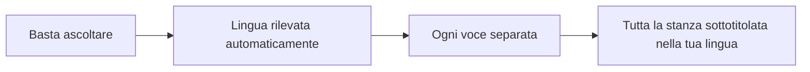
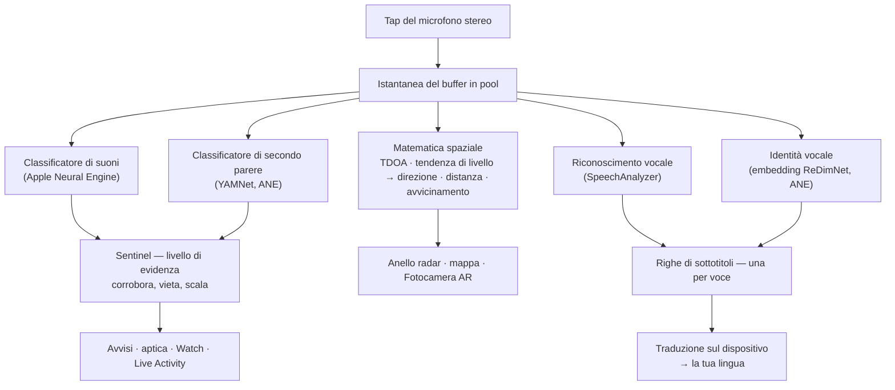
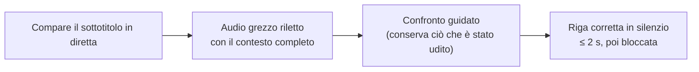
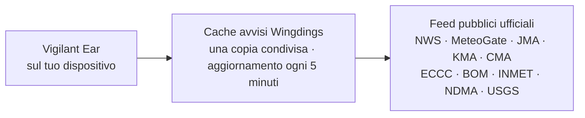

# Vigilant Ear 👂🛡️

*In vigore dalla versione 1.1.5 · settembre 2026.*

## Un radar acustico per chi non può sentire.

Un'app costruita appositamente per la comunità delle persone sorde, degli ipoudenti e dei CODA. La maggior parte delle app di riconoscimento dei suoni ti dice *che cos'è* un suono. **Vigilant Ear ti dice dov'è, chi lo sta producendo e che cosa sta dicendo** — trasformando un iPhone in un tricorder sonoro in tempo reale che descrive il suono intorno a te.

La direzione e la distanza di una sirena. Un colpo alle tue spalle. Le persone di una conversazione, disegnate come voci trascritte separate — ognuna sottotitolata e collocata direzionalmente. Se qualcuno parla una lingua che non leggi, le sue parole possono arrivare **tradotte nella tua.** Gli avvisi raggiungono la tua **schermata di blocco, la Dynamic Island e l'Apple Watch**, così basta un'occhiata.

Tutto ciò che conta viene eseguito sul dispositivo. L'audio non viene registrato né caricato in rete per il riconoscimento. Nulla dipende dal riuscire a sentire.

- 🧭 **Direzione, non solo rilevamento.** *Cosa, dove, chi* e *che cosa è stato detto* — non semplicemente «si è verificato un suono».
- 🔒 **Privato fin dalla progettazione.** Classificazione, sottotitoli e traduzione vengono eseguiti sul tuo iPhone. I sottotitoli sono in diretta ed effimeri; non vengono salvati come archivio di trascrizioni.
- ⌚ **Al polso e sulla schermata di blocco.** Il companion di direzione per Apple Watch + Live Activity tengono l'ultimo avviso e la sua provenienza a portata di sguardo.
- 🛰️ **Più telefoni, un unico orecchio condiviso.** Constellation collega gli iPhone dotati di Ultra-Wideband per fondere ciò che ciascuno sente in un'immagine direzionale più nitida.
- 👁️ **Fatta per persone sorde / ipoudenti / CODA.** Feedback aptici distinti, grafica ad alto contrasto, segnali indipendenti dal colore, ampie aree di tocco e rispetto dell'impostazione Riduci movimento ovunque.

---

## A chi è rivolta

- **Utenti sordi, ipoudenti e CODA** che vogliono una consapevolezza situazionale del suono — Home Watch (bussata, allarme, pianto del bambino, telefono) e Street Watch (sirena, avvicinamento) che puoi lasciare attivi e di cui puoi fidarti.
- Chiunque abbia bisogno di **sottotitoli in diretta con direzione e separazione dei parlanti**, o della **traduzione sul dispositivo** delle persone sedute lì vicino.
- Utenti dell'accessibilità e della ricerca acustica interessati alla localizzazione dei suoni sul dispositivo.

> Vigilant Ear è un **ausilio** per l'accessibilità, non un dispositivo certificato per la sicurezza delle persone.

---

## Che cosa fa

### 🧭 Vede il suono — direzione e distanza
Usando i due microfoni dell'iPhone, Vigilant Ear misura **l'angolo di un suono e se è davanti a te o dietro**, tiene quella lettura stabile entro circa un grado e la colloca come marcatore in tempo reale su un anello radar orientato secondo l'orientamento del dispositivo e su una mappa. Due microfoni su una sola linea non bastano da soli a distinguere sinistra e destra — un suono a 50° a destra e uno a 50° a sinistra arrivano con lo stesso minuscolo scarto temporale — quindi l'app disegna la lettura più un **fantasma più tenue sull'altro lato**, e una rotazione del polso o un secondo telefono risolvono l'ambiguità. La distanza è stimata dalla rumorosità rispetto a una curva calibrata in strada e viene mostrata per quello che è: *≈ 15 m*, con un intervallo plausibile. Muoviti, e i marcatori mantengono la loro posizione nel mondo reale. Questo è il cuore dell'app: la consapevolezza spaziale di un mondo che non puoi sentire. (Numeri più sotto.)

### 🚨 Riconosce i suoni importanti — e ti avvisa
Un classificatore sul dispositivo identifica centinaia di suoni quotidiani e sorveglia le categorie critiche — **sirene, allarmi — inclusa una classe dedicata all'allarme auto —, campanelli/bussate, pianto di bambino, una persona nelle vicinanze e condizioni meteo estreme.** Quando una scatta, ricevi un avviso chiaro sullo schermo, una **notifica push** opzionale e un segnale **aptico** distintivo — anche quando l'app è in background o il telefono è in standby. Le categorie critiche sono pronte per impostazione predefinita, così abilitare le notifiche non significa «tutto spento». Disattiva tutte le categorie di avviso e il motore va in completa ibernazione mentre è in background, per risparmiare batteria. Un livello **Sentinel** incrocia gli avvisi con prove indipendenti — direzione, movimento e feed pubblici — così ciò che scatta è corroborato, non la congettura di un classificatore isolato. Funziona in entrambe le direzioni: un momento che assomiglia a una sirena dentro una canzone viene trattenuto, ma una sirena vera che si ripete attraverso la tua musica passa e ti avvisa.

Gli avvisi di maltempo estremo provengono da feed pubblici ufficiali — **NWS** per gli Stati Uniti, **MeteoGate** per l'Europa, **CMA** per la Cina, **KMA** per la Corea, **JMA** per il Giappone, **ECCC** per il Canada, **BOM** per l'Australia, **INMET** per il Brasile e **NDMA** per l'India — gratuiti per tutti gli utenti. I feed vengono ristretti a quelli che coprono il luogo in cui ti trovi. In Giappone l'app legge anche i **bollettini anticipati** della JMA — gli avvisi in linguaggio semplice emessi giorni prima di un tifone o di piogge intense, non solo le allerte quando il pericolo è già arrivato — più i bollettini di nubifragio improvviso e di frana. Gli avvisi anticipati vengono mostrati in modo discreto, senza il suono e la vibrazione riservati a un'allerta reale.

### ⌚ Apple Watch + Live Activity — un'occhiata e sai
- **Companion per Apple Watch** — la direzione di un avviso viene indicata al polso, così un'occhiata ti dice dove guardare. Interfaccia del Watch ridisegnata con l'icona dell'orecchio dell'app, il layout HUD delle minacce e il doppio tocco per chiudere un avviso. Gli avvisi possono comunque mostrare la freccia di direzione quando l'app del Watch non è aperta.
- **Live Activity** — Vigilant Ear rimane sulla tua **schermata di blocco**, nella **Dynamic Island** e nella **Smart Stack del Watch**, così l'ultimo avviso e la sua direzione sono sempre a portata di sguardo.
- **Avvisi dei partner al polso** — quando il telefono di un partner Constellation collegato lancia un avviso, questo può raggiungere anche il tuo Watch, direzione inclusa. Un passaggio di affidabilità mantiene il companion leggero sulla batteria del Watch per tutta la giornata.

### 💬 Modalità parlante (Speaker Mode) — sottotitoli in diretta e direzionali *(gratis)*
Attiva la **Modalità parlante (Speaker Mode)** e Vigilant Ear trascrive le persone che parlano vicino a te in **blocchi di sottotitoli, uno per voce.** La diarizzazione dei parlanti sul dispositivo mantiene le voci distinte — *chi* dice *che cosa* — con un indicatore direzionale sull'anello interno. Il parlante attivo è evidenziato; il testo più vecchio scorre via man mano che serve spazio.

Due cose che la maggior parte delle app di sottotitoli non fa: **onestà sulla confidenza** — un segno di qualità discreto per riga e sottolineature tratteggiate sotto le parole dubbie ti dicono quando fidarti di una riga e quando ricontrollare — e **autocorrezione**: subito dopo che una frase si consolida, l'app rilegge l'audio con il contesto completo e può ripristinare una parola mancata o fraintesa entro un paio di secondi, poi il testo si blocca.

I sottotitoli sono gratuiti; la traduzione automatica è il livello opzionale Power Pack+. I sottotitoli possono anche essere **letti ad alta voce sui tuoi dispositivi acustici Bluetooth** — gratis, nelle Preferenze. I **toni di direzione (Direction Tones)** (anche gratis, in Preferenze → Sottotitoli) aggiungono un segnale audio opzionale nell'orecchio che scegli per indicare dove si trova un parlante — utili con un apparecchio acustico o con udito unilaterale, e disponibili per chiunque.

### 🌐 Speaker Auto-Translate — la tua lingua, in diretta *(Power Pack+)*
Con la Modalità parlante attiva, quando una persona vicina parla un'altra lingua, Vigilant Ear può rilevarla e mostrare i suoi sottotitoli **nella tua lingua**, con la lingua di origine indicata sul suo blocco. La catena — ascoltare → separare i parlanti → trascrivere → tradurre → mostrare — viene eseguita **sul dispositivo**; l'unico momento di rete è il download una tantum del pacchetto lingua da Apple. Non devi conoscere né scegliere prima l'altra lingua.

È la cosa più vicina in circolazione al **traduttore universale della fantascienza** — il dispositivo che semplicemente capisce. Vigilant Ear rileva la lingua da solo, segue ogni persona che parla nella stanza e le sottotitola tutte nella tua lingua — senza auricolari, senza configurazione, sul tuo dispositivo.

### 🎵 Riconoscimento di musica e trasmissioni *(Power Pack+)*
**ShazamKit** identifica la musica che suona intorno a te e segue i cambi di brano.

### 🎛️ Acoustic Scope — vedi il suono come un ingegnere
Una vista professionale e in tempo reale del suono intorno a te: spettro, spettrogramma, bande RTA a ⅓ di ottava, chroma e parziali armonici — **gratis per tutti**. Gli strumenti per catturare suoni e addestrare i tuoi pacchetti fanno parte di Power Pack+.

### 📦 Pacchetti di suoni personalizzati — insegnale il tuo mondo *(Power Pack+)*
Insegna a Vigilant Ear i suoni che contano per te — dagli uccelli locali al campanello del tuo palazzo. I pacchetti aggiuntivi si sommano al rilevamento integrato, così i nuovi suoni non tolgono mai spazio a sirene e allarmi. Una guida passo passo è inclusa nell'app.

### 🛰️ Constellation — molti iPhone, un unico orecchio condiviso *(Power Pack+)*
Con due o più iPhone dotati di Ultra-Wideband (la maggior parte a partire dall'iPhone 11), **Constellation** li accoppia perché possano percepire la posizione l'uno dell'altro e fondere ciò che ciascuno sente in un'immagine unica e più precisa della provenienza di un suono — una rete di ascolto passiva e distribuita. Anche i sottotitoli vengono fusi: ogni telefono trascrive ciò che sente il proprio microfono, e le parole vengono allineate tra i telefoni così quello più vicino a un parlante contribuisce ciò che ha captato — le parole catturate da un solo telefono vengono conservate invece di perdersi. I telefoni si connettono **direttamente tra loro**: nessun router, nessuna rete Wi-Fi condivisa e nessuna connessione a internet; basta che il Wi-Fi sia acceso, sullo stesso collegamento peer-to-peer che usa AirDrop. Riservato ai dispositivi con l'hardware adatto. I sottotitoli della rete mesh precedenti al momento di connessione di un peer non vengono ritrasmessi.

**Messaggi tra partner** — invia un breve testo al telefono di un partner collegato; compare nel suo feed dei sottotitoli e può arrivare tradotto nella sua lingua, sul dispositivo. La messaggistica tiene conto dell'età: basata sulla fascia d'età dichiarata di Apple (Declared Age Range), la messaggistica tra un adulto e un minore resta disattivata a meno che entrambi non si siano nominati deliberatamente a vicenda. Avvisi e sottotitoli non vengono mai limitati — solo i messaggi da persona a persona.

### 🔗 Remote Link — raggiungi qualcuno che non è con te *(Power Pack+ per iniziare)*
Quello che di solito farebbe una telefonata, fatto con video e testo. Invii un codice di invito; l'altra persona entra da dentro Vigilant Ear **senza dover avere Power Pack+**. A differenza di Constellation non serve la vicinanza — potete essere ovunque.

**In nessun momento viene usato l'audio.** Solo video e testo, così il collegamento non dipende dall'udito a nessuna delle due estremità — e ti dà un modo per comunicare in lingua dei segni con qualcuno attraverso l'app. L'app stessa non interpreta la lingua dei segni; trasporta il video e il resto lo fate voi due. La connessione è diretta tra i due telefoni ovunque la rete lo permetta, e l'app ti mostra chiaramente se è **Diretta** o **Inoltrata (Relayed)**, così sai sempre se il video passa attraverso un relay.

### 📷 Fotocamera AR — «vedi il suono»
Apri la pillola della fotocamera sulla barra del titolo e fissa i suoni rilevati alla loro direzione reale nella vista in diretta della fotocamera. I marcatori si raggruppano per parlante o per categoria di suono e direzione, così la vista resta leggibile; le sorgenti sbiadiscono col tempo quando tacciono.

### 🗺️ Mappe, strade e previsione dei percorsi
Le direzioni dei suoni vengono proiettate su coordinate GPS reali sulla mappa. I suoni dei veicoli possono essere **agganciati alle strade vicine** e i loro percorsi previsti, così un camion di passaggio appare in movimento *lungo la strada* anziché attraverso gli edifici. (Prova la demo del camion dei pompieri.)

### 🪄 Feature Playground — provalo senza orecchie
Il **Feature Playground** è pubblico per tutti: esercitazioni Casa e Strada (bussata, allarme, bambino, sirena, meteo), demo multi-telefono e di conversazione, e una filigrana ben visibile perché la pratica non si spacci mai per un evento reale. La chiusura del pannello smonta le demo in modo pulito (nessuna falsa posizione GPS bloccata, nessun flag residuo).

### ♿ Accessibilità prima di tutto
Costruita per utenti sordi / ipoudenti / CODA e daltonici: segnali **indipendenti dal colore**, aree di tocco **≥ 44 pt**, rispetto di **Riduci movimento**, avvisi multimodali (aptico + visivo + Watch) e una schermata di verifica all'avvio che mostra lo stato dei permessi con stati chiari verde / grigio / rosso (e «non consentito» arancione bruciato) — inclusa la concessione delle notifiche che funge da interruttore generale degli avvisi.

---

## Gratis e Power Pack+

Il nucleo di sicurezza è **gratuito, per sempre**:

- **Home Watch e Street Watch** — avvisi sonori locali (allarmi, sirene, bussate/campanelli, bambino, persona nelle vicinanze) con notifica sullo schermo, aptica e push opzionale.
- **Sottotitoli in diretta** — Modalità parlante, sul dispositivo, direzionale dove l'hardware lo consente, con segni di confidenza onesti, autocorrezione in ~2 secondi, uscita vocale opzionale verso i dispositivi acustici Bluetooth e toni di direzione.
- **Standing Watch** — la condizione della stanza stessa, sempre attiva e senza nulla da configurare: una spia ciano fissa finché la stanza mantiene il suo schema, ambra quando qualcosa cambia — una voce nuova, un silenzio improvviso o qualcosa che si avvicina.
- **Avvisi di maltempo estremo** — NWS, MeteoGate (Europa — servito fresco dalla nostra cache di avvisi a 5 minuti), CMA, KMA, JMA (Giappone), ECCC (Canada), BOM (Australia), INMET (Brasile) e NDMA (India) per la tua regione.
- **Avvisi sismici (USGS, in tutto il mondo)** — avverti una vibrazione e vedi sulla mappa l'area che ha avvertito la scossa quando viene segnalato un terremoto nelle vicinanze. Una conferma dal feed ufficiale dell'USGS — non un allarme preventivo: se hai avvertito tremare, questo ti dice che cos'era. Il rilevamento sul dispositivo dei rombi profondi (infrasuoni) può armare la verifica nell'istante in cui il suolo si muove.
- **Feature Playground** — avvisi di esercitazione e anteprime delle funzioni con una chiara filigrana PREVIEW.
- **Companion per Apple Watch e Live Activity** — direzione e ultimo avviso a portata di sguardo.
- **Acoustic Scope** — visualizzazione del suono in tempo reale di livello professionale, gratis per tutti. (Gli strumenti di cattura per l'addestramento sono di Power Pack+.)

**Power Pack+** è uno sblocco una tantum (**non un abbonamento**) con una **prova gratuita di 90 giorni**. Aggiunge i superpoteri:

- **Speaker Auto-Translate** — traduzione sul dispositivo del parlato vicino nella tua lingua.
- **Constellation** — ascolto condiviso multi-iPhone via Ultra-Wideband, con messaggi tra partner.
- **Music ID** — riconoscimento dei brani con ShazamKit.
- **Pacchetti di suoni personalizzati** — classificatori aggiuntivi che addestri per i tuoi suoni.

Gratis o Power Pack+, **il tuo audio resta sul dispositivo per il riconoscimento** — il livello cambia solo quali funzioni sono sbloccate, mai dove viene inviato l'audio grezzo per l'analisi.

---

## Come funziona (sotto il cofano)

Vigilant Ear è una pipeline **local-first, sul dispositivo** costruita a strati: cattura una volta, poi lascia che specialisti indipendenti leggano lo stesso suono e controllino il lavoro l'uno dell'altro. L'audio grezzo viene catturato su un tap ad alta priorità, copiato in una **free-list di buffer in pool** (nessuna raffica di allocazioni sul percorso in tempo reale) e distribuito senza bloccare l'interfaccia:

Nessun modello singolo viene fidato da solo. Il livello **Sentinel** sta tra il rilevamento e l'avviso: motori indipendenti si corroborano o si vietano a vicenda fotogramma per fotogramma — e quando prove ripetute dal mondo reale si accumulano contro un veto (una sirena vera che urla attraverso la tua musica), l'evidenza vince e l'avviso scatta.

I sottotitoli hanno una seconda chance tutta loro. Ogni frase finalizzata viene riletta in silenzio da un breve anello audio in memoria con il contesto completo — le correzioni arrivano entro circa due secondi, poi il testo si blocca per sempre:

- **Matematica spaziale** — FFT, differenza dei tempi di arrivo ponderata per coerenza (TDOA — privilegia le bande di frequenza su cui entrambi i microfoni concordano, poi trasforma il minuscolo ritardo di arrivo in una direzione) e tracciamento dell'avvicinamento dalla tendenza di livello su task in background. La coppia di microfoni viene letta in un orientamento fisso, così la direzione funziona allo stesso modo sia che tu tenga il telefono in verticale sia di lato.
- **Parlato** — `SpeechAnalyzer` / `SpeechTranscriber` di iOS 26 per la trascrizione; embedding **ReDimNet** per l'identità vocale; il framework **Translation** di Apple per la traduzione sul dispositivo. L'identità vocale è basata su evidenze: una voce viene confermata come persona reale solo da finestre di suono indipendenti, e una corrispondenza incerta resta non attribuita invece di indovinare il nome sbagliato.
- **Verità sulla musica** — un rilevatore di **firma del brano** basato sul chroma decide se «sta davvero suonando della musica», perché i classificatori generici chiamano spesso «musica» stanze silenziose e sirene. Shazam parte solo quando la firma concorda che qualcosa di musicale c'è davvero.
- **Concorrenza** — l'isolamento di Swift 6 mantiene il tap del microfono, la matematica acustica e il ciclo di rendering dell'interfaccia nettamente separati.
- **Efficienza** — il sottocampionamento, la classificazione adattiva al carico e l'uso della rete condizionato all'evidenza mantengono l'ascolto continuo abbastanza leggero da poterlo lasciare attivo.

Il meteo e gli avvisi sismici prendono la strada opposta rispetto all'audio — nulla del tuo suono esce mai, ma i *dati* di allerta entrano. **Ogni** feed ufficiale passa attraverso una piccola cache che gestiamo noi, così un solo prelievo dei dati pubblici serve tutti gli utenti — e il tuo telefono non contatta mai i server di un governo straniero:

---

## Cosa può «sentire» il tuo telefono — misure

Il tuo iPhone ha due microfoni a circa quindici centimetri di distanza, un barometro e un orologio molto preciso. Basta per dirti da che parte viene un suono, all'incirca quanto è lontano, se ti si sta avvicinando e se una porta si è appena aperta. Ecco quanto è accurata ciascuna di queste misure, come l'abbiamo verificata e perché conta se non puoi sentire il suono da solo. Direzione e cifre correlate sono state misurate su un iPhone 17 e un iPhone 16 Pro Max a settembre 2026. La distanza resta per natura una stima — e lo diciamo sullo schermo.

**Direzione — entro un paio di gradi.** Un suono raggiunge il microfono superiore prima di quello inferiore, o dopo, e da quello scarto l'app calcola quanto il suono è fuori dall'asse del telefono e se è davanti o dietro. I due canali del telefono non sono microfoni grezzi ma un'immagine stereo elaborata, e quella immagine aggiunge un pattern fisso tutto suo quando la stanza è rumorosa. L'app ora impara quel pattern da pochi secondi di quiete dopo l'avvio e lo toglie prima di leggere la direzione.

| Cosa abbiamo misurato | Risultato |
|---|---|
| Errore mediano su 96 stanze simulate, dall'ufficio silenzioso a una stanza a pareti dure a 5 dB SNR | 1,0° |
| iPhone 17 sulla scrivania, rumore di stanza acceso, altoparlante a 30° fuori asse | lettura 61,7° dal piano laterale contro i 60° attesi, oscillazione 1,6° |
| Stesso setup, altoparlante dritto di lato al telefono | lettura 4,5° contro i 0° attesi, oscillazione 2,2° |
| Stesso setup, altoparlante dritto davanti | ogni lettura al ritardo massimo, come deve essere |
| Letture che finiscono sul pattern dell'immagine invece che sul suono | nessuna, a qualsiasi angolo |

*Perché conta:* se non puoi sentire una sirena, «dietro di te, un po' di lato» ti dice dove guardare. Una lettura che resta ferma vale la fiducia solo dopo essere stata controllata con un metro a nastro, e questa lo è stata, due volte — la seconda dopo che il primo controllo si era rivelato troppo indulgente.

**Distanza — mostrata come la stima che è.** Un solo microfono non misura la distanza, solo la rumorosità, e un camion forte lontano può sembrare un'auto silenziosa da vicino. L'app stima la distanza dalla rumorosità con una curva calibrata su una strada reale, poi la dice come farebbe una persona attenta: *circa 15 m, probabilmente tra 8 e 30.*

| Cosa abbiamo misurato | Risultato |
|---|---|
| Rilevamenti reali di auto riprodotti attraverso la calibrazione | 1.131 |
| Atterrati entro i 30 metri di strada su cui erano davvero | 73% |
| Auto sulla corsia lontana | stimate a 24 e 27 m dove il metro diceva 22 e 26 m |

La strada (un incrocio cittadino) è stata misurata corsia per corsia; quando la curva sbaglia, sbaglia dal lato vicino. La calibrazione è bloccata da un test automatico così non può spostarsi in silenzio. Gli allarmi nel tuo spazio, come un rilevatore di fumo, non ricevono alcuna cifra di distanza — sono già nella stanza con te.

**Movimento — in avvicinamento.** Per auto e sirene, diventare più forti di solito significa avvicinarsi. L'app osserva quanto velocemente sale il livello di un suono in pochi secondi: una salita sostenuta di circa 1,5 dB al secondo (un aumento chiaro e costante di rumorosità) significa avvicinamento, una discesa corrispondente significa allontanamento, e un suono che smette di cambiare smette di essere chiamato l'uno o l'altro dopo circa quattro secondi. Un singolo momento forte — un colpo di clacson, uno sbattere di porta — non può attivarlo. Basato sulla fisica e su nove test automatici; un passaggio stradale registrato è la prossima conferma sul campo.

**L'aria nella stanza — una porta ha una firma.** Il barometro può notare l'apertura di una porta a circa quattro metri e mezzo: la pressione scende mentre la porta si apre, poi rimbalza quando si chiude. In quattordici ore di quiete e quindici eventi di porta, ogni porta ha prodotto quella forma a due parti e nient'altro in casa l'ha fatto.

| Evento | Velocità di pressione | Forma |
|---|---|---|
| Porta d'ingresso, aperta e chiusa, ×10 | 0,6–1,8 Pa/s | calo, poi rimbalzo, ~5 s di distanza |
| Porta d'ingresso, sbattuta, ×5 | 1,1–2,5 Pa/s | stessa coppia, più alta |
| Aria condizionata che cicla di notte, ×8 | 0,11–0,46 Pa/s | rampa lenta su minuti, identica su entrambi i telefoni |
| Una stanza quieta | ~0,02 Pa/s | nulla |
| Passare accanto, starnutire | — | il sensore di movimento se ne accorge e il telefono lo ignora |

Una zanzariera, che non sigilla la stanza, era invisibile — esattamente come deve essere. Oggi uno spostamento di pressione può comparire come rombi profondi sulla mappa; un avviso dedicato per la porta nella notte quieta è misurato e progettato, e non è ancora l'impostazione predefinita di tutti i giorni.

**Constellation — due telefoni risolvono il lato.** Ogni telefono sulla mesh traccia una linea verso il suono da dove si trova, e le linee si incrociano in modo pulito solo da un lato. Quando lo fanno, il fantasma scompare e l'app può di nuovo dire sinistra o destra. In simulazione, due telefoni a **40 metri di distanza** collocano una sirena a 50 metri entro circa 2 metri.

**Come si crede a qualsiasi cifra qui.** Ogni numero è passato dagli stessi tre cancelli, in ordine: una stanza simulata con la risposta nota in anticipo; piccoli test automatici che ricreano il caso esatto che ingannerebbe l'app e girano a ogni modifica; poi i telefoni veri su una scrivania vera con distanze misurate a mano. Nulla conta come accurato finché non sopravvive al terzo. Per chi non può sentire il suono, la parola dell'app è l'unica parola — deve essere guadagnata come la guadagna un laboratorio.

Note più profonde per gli ingegneri: [Physics](https://vigilantear.com/it/physics/) — TDOA, distanza, movimento, Constellation e rilevamento barometrico, con ogni cifra etichettata MEASURED / BENCHED / MODELLED.

---

## Privacy

- **Sul dispositivo, sempre, per la pipeline principale.** Classificazione, matematica spaziale, trascrizione, diarizzazione e traduzione vengono eseguite sul tuo iPhone. L'audio grezzo non viene registrato né caricato in rete per il riconoscimento.
- **I sottotitoli sono effimeri.** I sottotitoli in diretta restano in memoria per la durata della sessione; i log di debug esportati non includono il testo dei sottotitoli.
- **Nessun SDK pubblicitario o di analisi comportamentale.** L'uso limitato della rete riguarda solo mappe, feed meteo pubblici, impronte Shazam opzionali, contesto stradale e acquisti sull'App Store — vedi l'informativa completa.

Dettagli completi: [PRIVACY.md](PRIVACY.md) · [TERMS.md](TERMS.md) · [SUPPORT.md](SUPPORT.md)

---

## Hardware e piattaforme

- **iPhone (esperienza completa).** Funziona in verticale o in orizzontale — tienilo come preferisci. Microfoni stereo richiesti per la localizzazione direzionale. Consigliato **iPhone 13 o più recente**.
- **Apple Watch.** Avvisi companion con freccia di direzione; funziona con Live Activity / Smart Stack.
- **iPad (nativo).** Layout adattivo: sul grande schermo, i sottotitoli in diretta hanno un pannello trasparente accanto alla mappa che si ritira quando nessuno parla. Microfoni monocanale → sottotitoli senza direzione completa.
- **Constellation** richiede l'**Ultra-Wideband** — iPhone 11 o successivo, esclusi i modelli SE ed «e». **Non** serve una rete Wi-Fi: con il Wi-Fi acceso i telefoni si trovano direttamente, quindi Constellation funziona senza router e senza internet finché i telefoni sono vicini.
- **Android.** Build separata con il radar principale, gli avvisi, i sottotitoli e il meteo; la rete mesh Constellation è prima su iOS. Segui gli aggiornamenti sul sito del prodotto man mano che cresce la parità con Android.

---

## Localizzazione

Completamente localizzata — interfaccia, avvisi e sottotitoli — in **inglese, spagnolo, portoghese (Brasile), francese, tedesco, italiano, arabo, giapponese, cinese semplificato, coreano, russo e hindi** (12 lingue). Segue le impostazioni internazionali del sistema o una scelta manuale nell'app.

---

## Stato e avvertenze

Vigilant Ear è un **ausilio sperimentale per l'accessibilità acustica**, non uno strumento certificato per la sicurezza delle persone. La risoluzione della localizzazione varia con l'ambiente, il meteo, il vento e l'hardware del microfono. **Mantieni sempre la tua abituale consapevolezza dell'ambiente** — non affidarti a questa app come unica fonte di informazioni sulla sicurezza.

Alcune capacità (marcatori AR della fotocamera, aggiornamento dell'entitlement Avvisi Critici quando concesso da Apple, creazione avanzata di suoni multi-pacchetto) continuano a evolversi; la sorveglianza gratuita Casa / Strada (Home / Street Watch) e i sottotitoli in diretta sono il prodotto di cui puoi fidarti dal primo giorno.

---

**Contatto:** [vigilantear@wingdingssocial.com](mailto:vigilantear@wingdingssocial.com)

Fatto con ❤️ per la comunità D/HH e per la ricerca acustica.

    
  <strong>© 2026 Wingdings, Inc.</strong> 
  Tutti i diritti riservati. 
  Brevetto in corso di registrazione

