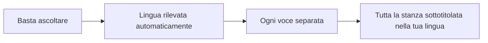
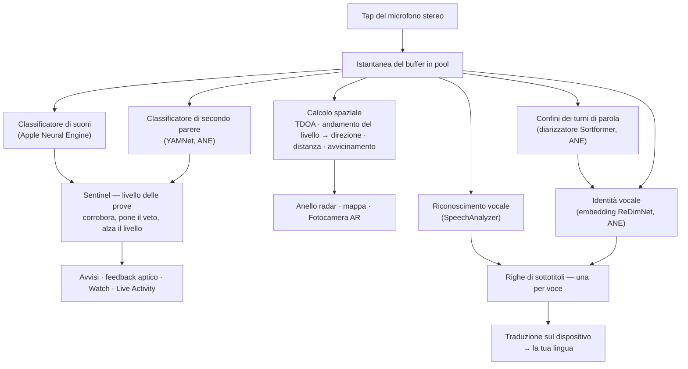
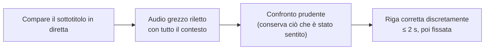
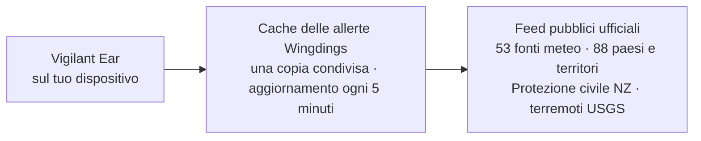

# Vigilant Ear 👂🛡️

*In vigore dalla versione 1.1.9 · settembre 2026.*

## Un radar acustico per chi non sente.

Un'app pensata espressamente per la comunità delle persone sorde, ipoudenti e CODA. La maggior parte delle app di riconoscimento dei suoni ti dice *che cosa* è un suono. **Vigilant Ear ti dice dov'è, chi lo sta producendo e che cosa sta dicendo** — e trasforma un iPhone in un tricorder sonoro in tempo reale che descrive i suoni intorno a te.

La direzione e la distanza di una sirena. Qualcuno che bussa alle tue spalle. Le persone di una conversazione, disegnate come voci trascritte distinte — ognuna sottotitolata e collocata nella sua direzione. Se qualcuno parla una lingua che non leggi, le sue parole possono arrivarti **tradotte nella tua.** Gli avvisi arrivano su **schermata di blocco, Dynamic Island e Apple Watch**, così basta un'occhiata.

Tutto ciò che conta avviene sul dispositivo. L'audio non viene registrato né caricato online per il riconoscimento. Niente richiede di sentire alcunché.

- 🧭 **Direzione, non solo rilevamento.** *Cosa, dove, chi* e *che cosa è stato detto* — non semplicemente «c'è stato un suono».
- 📣 **Nome chiamato.** Aggiungi il tuo nome, quello di un bambino, del partner — «ordine per Marie pronto» ti dà un colpetto sul Watch e ti indica la direzione.
- 🔒 **Privato fin dalla progettazione.** Classificazione, sottotitolazione e traduzione avvengono sul tuo iPhone. I sottotitoli sono in diretta ed effimeri; non vengono salvati come archivio di trascrizioni.
- ⌚ **Al polso e sulla schermata di blocco.** Con l'app complementare per Apple Watch, che indica la direzione, e la Live Activity, l'ultimo avviso e la direzione da cui è arrivato restano a portata di sguardo.
- 🛰️ **Più telefoni, un solo orecchio condiviso.** Constellation collega gli iPhone con Ultra-Wideband per fondere ciò che ognuno sente in un quadro direzionale più nitido.
- 👁️ **Pensata per persone sorde / ipoudenti / CODA.** Feedback aptici distinti, grafica ad alto contrasto, segnali indipendenti dal colore, ampie aree di tocco e rispetto di Riduci movimento in ogni parte dell'app.

---

## Per chi è

- **Utenti sordi, ipoudenti e CODA** che vogliono una consapevolezza situazionale dei suoni — Home Watch (bussata, allarme, bambino, telefono) e Street Watch (sirena, avvicinamento) che puoi lasciare attivi e di cui puoi fidarti.
- Chiunque abbia bisogno di **sottotitoli in diretta con direzione e separazione dei parlanti**, o della **traduzione sul dispositivo** di ciò che dicono le persone sedute vicino.
- Utenti del mondo dell'accessibilità e della ricerca acustica interessati alla localizzazione dei suoni sul dispositivo.

> Vigilant Ear è un **ausilio** per l'accessibilità, non un dispositivo salvavita certificato.

---

## Che cosa fa

### 🧭 Vede il suono — direzione e distanza
Usando i due microfoni dell'iPhone, Vigilant Ear misura **l'angolo di un suono e se si trova davanti o dietro di te**, mantiene quella lettura stabile entro circa un grado e la colloca come marcatore dal vivo su un anello radar orientato nella direzione in cui guardi e su una mappa. Due microfoni sulla stessa linea non sanno distinguere da soli la sinistra dalla destra — un suono a 50° alla tua destra e uno a 50° alla tua sinistra arrivano con lo stesso minuscolo scarto di tempo — quindi l'app disegna la lettura più un **fantasma più tenue sul lato opposto**, e una rotazione del polso o un secondo telefono sciolgono il dubbio. La distanza viene stimata dall'intensità del suono rispetto a una curva calibrata in strada e mostrata per quello che è, una stima: *≈ 50 ft*, con un intervallo probabile — nelle unità di misura del Paese in cui ti trovi, non della lingua in cui leggi l'app. Se ti muovi, i marcatori mantengono la loro posizione nel mondo reale. Questo è il cuore dell'app: la consapevolezza spaziale di un mondo che non puoi sentire. (I numeri più sotto.)

### 🚨 Riconosce i suoni importanti — e ti avvisa
Un classificatore sul dispositivo identifica centinaia di suoni quotidiani e sorveglia le categorie critiche — **sirene, allarmi — compresa una classe dedicata agli allarmi auto — campanelli/bussate, pianto di un bambino, una persona nelle vicinanze e maltempo estremo.** Quando una di queste scatta, ricevi un avviso chiaro sullo schermo, una **notifica push** facoltativa e un **feedback aptico** distinto — anche quando l'app è in background o il telefono è in standby. Le categorie critiche sono pronte fin dall'inizio, così attivare le notifiche non significa partire da «tutto spento». Disattiva tutte le categorie di avviso e, in background, il motore va completamente in ibernazione per risparmiare batteria. Un livello **Sentinel** verifica gli avvisi con prove indipendenti — direzione, movimento e feed pubblici — così ciò che scatta è corroborato, non l'ipotesi isolata di un classificatore. Funziona in entrambi i sensi: un momento che somiglia a una sirena dentro una canzone viene trattenuto, ma una sirena vera che si ripete sopra la tua musica si fa strada e fa scattare l'avviso.

Le allerte di maltempo estremo arrivano da **53 fonti governative ufficiali in 88 paesi e territori** — gratis per tutti gli utenti. Sono incluse anche le allerte di protezione civile della Nuova Zelanda, con un proprio interruttore **Allerte di emergenza**. Le fonti la cui licenza richiede un riconoscimento sono elencate in «Crediti dei dati», in fondo a questa pagina. I feed vengono limitati a quelli che coprono la zona in cui ti trovi. In Giappone l'app legge anche i **bollettini anticipati** della JMA — gli avvisi in linguaggio semplice emessi giorni prima di un tifone o di forti piogge, non solo le allerte diramate quando il pericolo è ormai arrivato — oltre ai bollettini su acquazzoni improvvisi e frane. Gli avvisi anticipati vengono mostrati in modo discreto, senza il suono e la vibrazione riservati a una vera allerta.

### ⌚ Apple Watch + Live Activity — basta un'occhiata
- **App complementare per Apple Watch** — la direzione di un avviso viene indicata sul polso, così un'occhiata ti dice dove guardare. Interfaccia del Watch ridisegnata, con l'icona a orecchio dell'app, un layout HUD delle minacce e il doppio tocco per chiudere un avviso. Gli avvisi possono mostrare la freccia di direzione anche quando l'app del Watch non è aperta.
- **Live Activity** — Vigilant Ear resta sulla **schermata di blocco**, nella **Dynamic Island** e nello **Smart Stack del Watch**, così l'ultimo avviso e la sua direzione sono sempre a portata di sguardo.
- **Avvisi dei partner al polso** — quando il telefono di un partner Constellation collegato genera un avviso, questo può arrivare anche al tuo Watch, direzione compresa. Un intervento mirato sull'affidabilità mantiene l'app complementare leggera sulla batteria del Watch per tutto il giorno.

### 💬 Speaker Mode — sottotitoli in diretta e direzionali *(gratis)*
Attiva la **Speaker Mode** e Vigilant Ear trascrive le persone che parlano vicino a te in **blocchi di sottotitoli, uno per voce.** La diarizzazione dei parlanti sul dispositivo tiene distinte le voci — *chi* sta dicendo *che cosa* — con un'indicazione di direzione sull'anello interno. Chi sta parlando in quel momento viene evidenziato; il testo più vecchio scorre via quando serve spazio.

Due cose che la maggior parte delle app di sottotitoli non fa: **onestà sull'affidabilità** — un discreto segno di qualità su ogni riga e sottolineature a puntini sotto le parole dubbie ti dicono quando fidarti di una riga e quando ricontrollare — e **autocorrezione**: subito dopo che una frase compare, l'app rilegge l'audio con tutto il contesto e può ripristinare una parola persa o fraintesa entro un paio di secondi; poi il testo resta fisso.

**Nome chiamato** (nelle Preferenze, disattivato finché non lo attivi) sorveglia quei sottotitoli cercando i nomi che elenchi — il tuo, quello di un bambino, del partner. Quando qualcuno dice «ordine per Marie pronto», ricevi un feedback aptico distinto e un avviso sul Watch con la direzione, non un altro fumetto di sottotitoli. Le parole compaiono comunque nella Speaker Mode come parlato; questo è il tocco che ti dice che stavano parlando *a te*.

**Il linguaggio volgare può essere mascherato** (Preferenze → Sottotitoli). Altrimenti le parolacce arrivano come testo normale, senza nulla che le attenui, e chi legge non ha modo di distogliere lo sguardo in tempo; attiva questa opzione e quelle parole vengono sostituite da simboli, così la frase si legge comunque, senza la parola. A decidere che cosa conta come volgare è il riconoscimento vocale del tuo dispositivo — non un nostro elenco di parole — quindi segue la lingua che viene trascritta. Su un account dichiarato sotto i 18 anni l'opzione è sempre attiva e mostra un lucchetto. Si applica al parlato che trascrive *questo* dispositivo; il testo inoltrato da un telefono abbinato è stato trascritto lì e arriva come testo già definitivo.

**La parola su cui chi parla ha calcato la voce viene messa in grassetto.** Dette ad alta voce, «Non ho detto QUESTO» e «Non ho detto questo» sono due frasi diverse, e una trascrizione identica ne perde del tutto la differenza. L'app cerca l'unica parola su cui la voce di chi parla si è alzata di tono e la mette in grassetto — al massimo una per riga, e nessuna quando non è sicura, perché evidenziare la parola sbagliata significa mettere in bocca a qualcuno parole che non ha detto. Disattivata in cinese e giapponese, dove l'altezza del tono ti dice *di quale parola si tratta* e non quanto è stata calcata.

I sottotitoli sono gratuiti; la traduzione automatica è il livello opzionale di Power Pack+. I sottotitoli possono anche essere **letti ad alta voce sui tuoi dispositivi uditivi Bluetooth** — gratis, nelle Preferenze. I **Toni di direzione** (anch'essi gratuiti, in Preferenze → Sottotitoli) aggiungono un segnale audio facoltativo, nell'orecchio che scegli, che indica dove si trova chi parla — utili con un apparecchio acustico o con un udito monolaterale, e disponibili per chiunque.

### 🌐 Traduzione automatica — la tua lingua, in diretta *(Power Pack+)*
Con la Speaker Mode attiva, quando una persona vicina parla un'altra lingua, Vigilant Ear può riconoscerla e mostrare i suoi sottotitoli **nella tua lingua**, con la lingua di partenza indicata sul suo blocco. La catena — ascolto → separazione dei parlanti → trascrizione → traduzione → visualizzazione — funziona **sul dispositivo**; l'unico momento in cui serve la rete è il download, una tantum, di un pacchetto lingua da Apple, e quando è quel download che stai aspettando l'app te lo dice, invece di lasciarti davanti a un testo non tradotto. Non devi conoscere né scegliere prima l'altra lingua.

Tra i prodotti già disponibili, è quanto di più vicino esista al **traduttore universale della fantascienza** — il dispositivo che semplicemente capisce. Vigilant Ear riconosce la lingua da solo, segue ogni persona che parla nella stanza e le sottotitola tutte nella tua lingua — senza auricolari, senza configurazione, sul tuo dispositivo.

### 🎵 Riconoscimento di musica e trasmissioni *(Power Pack+)*
**ShazamKit** identifica la musica che suona intorno a te e segue i cambi di brano.

### 🎛️ Acoustic Scope — vedi il suono come un ingegnere
Una vista professionale, in tempo reale, del suono intorno a te: spettro, spettrogramma, bande RTA a ⅓ d'ottava, croma e parziali armoniche — **gratis per tutti**. **La vista Parziali legge la musica:** ogni tono viene indicato con la sua nota e con la sua serie armonica accanto, i suoni più acuti, come quelli dei rilevatori di fumo, vengono indicati alla loro vera altezza, e puoi impostare una nota di riferimento che appare come una linea su cui intonare la voce o accordare uno strumento. Non fa scaldare il telefono — lasciare aperto lo Spettrogramma non costa quasi nulla, per quanto a lungo tu lo guardi. Gli strumenti che catturano suoni per addestrare i tuoi pacchetti personalizzati fanno parte di Power Pack+.

### 📦 Pacchetti audio personalizzati — insegnagli il tuo mondo *(Power Pack+)*
Insegna a Vigilant Ear i suoni che contano per te — dagli uccelli della tua zona al campanello del tuo palazzo. I pacchetti aggiuntivi si sommano al rilevamento integrato, così i nuovi suoni non tolgono mai spazio a sirene e allarmi. Nell'app è integrata una guida passo passo.

### 🛰️ Constellation — tanti iPhone, un solo orecchio condiviso *(Power Pack+)*
Con due o più iPhone dotati di Ultra-Wideband (la maggior parte dall'iPhone 11 in poi), **Constellation** li abbina perché possano percepire la posizione l'uno dell'altro e fondere ciò che ciascuno sente in un unico quadro, più preciso, della provenienza di un suono — un array d'ascolto distribuito e passivo. Anche i sottotitoli vengono fusi: ogni telefono trascrive ciò che sente il proprio microfono, e le parole vengono allineate tra i telefoni in modo che quello più vicino a chi parla contribuisca con ciò che ha sentito — le parole captate da un solo telefono vengono conservate anziché andare perse. I telefoni si collegano **direttamente tra loro** — niente router, niente rete Wi-Fi condivisa e niente internet; basta che il Wi-Fi sia acceso, sullo stesso collegamento peer-to-peer usato da AirDrop. Disponibile solo sui dispositivi con l'hardware adatto. I sottotitoli della mesh precedenti al momento in cui un peer si è connesso non vengono ritrasmessi.

**Messaggi tra partner** — invia un breve messaggio al telefono di un partner collegato; compare nel suo feed dei sottotitoli e può arrivare tradotto nella sua lingua, sul dispositivo. La messaggistica tiene conto dell'età: si basa su Declared Age Range di Apple, e lo scambio di messaggi tra un adulto e un minore resta disattivato a meno che entrambe le persone non si siano deliberatamente assegnate un nome a vicenda. Avvisi e sottotitoli non vengono mai limitati — solo i messaggi da persona a persona.

### 🔗 Remote Link — raggiungi chi non è con te *(Power Pack+ per avviarlo)*
Quello che normalmente farebbe una telefonata, fatto invece con video e testo. Invii un codice d'invito; l'altra persona si collega da dentro Vigilant Ear **senza possedere Power Pack+**. A differenza di Constellation, non serve essere vicini — potete trovarvi ovunque.

**In nessun momento viene usato l'audio.** Solo video e testo, quindi nulla del collegamento dipende dall'udito, da nessuna delle due parti — e ti dà un modo per segnare con qualcuno attraverso l'app. L'app in sé non capisce la lingua dei segni; trasporta il video, e al resto pensate voi due. La connessione è diretta tra i due telefoni ovunque la rete lo consenta, e l'app ti mostra chiaramente se è **Diretta** o **Inoltrata**, così sai sempre se il tuo video sta passando attraverso un relay.

**Anche i sottotitoli viaggiano.** Ciò che ciascun telefono trascrive compare sull'altro, tradotto nella lingua di chi legge quando serve. Ognuno dei due può mettere in pausa il collegamento — video e sottotitoli — e riprenderlo, e riagganciare dalla schermata principale.

### 📷 Fotocamera AR — «vedi il suono»
Tocca il pulsante della fotocamera sulla barra del titolo e fissa i suoni rilevati nella loro direzione reale, dentro la vista dal vivo della fotocamera. I marcatori si raggruppano per parlante oppure per categoria di suono e direzione, così la vista resta leggibile; le sorgenti sbiadiscono col tempo quando tacciono.

### 🗺️ Mappe, strade e previsione dei percorsi
Le direzioni dei suoni vengono proiettate su coordinate GPS reali sulla mappa. I suoni dei veicoli possono essere **agganciati alle strade vicine** e il loro percorso previsto, così un camion che passa appare in movimento *lungo la strada* e non attraverso gli edifici. (Prova la demo del camion dei pompieri.)

### 🪄 Feature Playground — provalo senza bisogno di sentire
Il **Feature Playground** è aperto a tutti: esercitazioni Casa e strada (bussata, allarme, bambino, sirena, meteo), demo con più telefoni e di conversazione, e una filigrana ben visibile perché un'esercitazione non si spacci mai per un evento reale. Chiudere il pannello smonta le demo in modo pulito (nessuna posizione GPS simulata rimasta bloccata, nessun flag residuo).

### ♿ Prima di tutto, l'accessibilità
Pensata per utenti sordi / ipoudenti / CODA e daltonici: segnali **indipendenti dal colore**, aree di tocco **≥44 pt**, rispetto di **Riduci movimento**, **layout da destra a sinistra** per chi legge in arabo, avvisi multimodali (aptici + visivi + Watch) e una schermata di verifica all'avvio che mostra lo stato dei permessi con stati chiari verde / grigio / rosso (e arancione bruciato per «non consentito») — compreso il consenso alle notifiche, che fa da interruttore generale degli avvisi.

---

## Gratis e Power Pack+

Il nucleo di sicurezza è **gratis, per sempre**:

- **Home Watch e Street Watch** — avvisi locali sui suoni (allarmi, sirene, bussate/campanelli, bambino, persona nelle vicinanze) sullo schermo, con feedback aptico e notifica push facoltativa.
- **Sottotitoli in diretta** — Speaker Mode, sul dispositivo, direzionali dove l'hardware lo consente, con indicatori di affidabilità onesti, autocorrezione in ~2 secondi, lettura ad alta voce facoltativa sui dispositivi uditivi Bluetooth e Toni di direzione.
- **Nome chiamato** — nomi facoltativi che scrivi tu (il tuo, dei bambini, del partner). Una corrispondenza genera un avviso su Watch/telefono con la direzione, non un secondo sottotitolo.
- **Standing Watch** — lo stato della stanza stessa, sempre attivo e senza nulla da configurare: una spia ciano fissa finché la stanza mantiene il suo andamento, ambra quando qualcosa cambia — una voce nuova, un silenzio improvviso o qualcosa che si avvicina.
- **Allerte di maltempo estremo** — allerte ufficiali per la tua regione da 53 fonti governative in 88 paesi e territori.
- **Allerte sismiche (USGS, in tutto il mondo)** — senti una vibrazione e vedi sulla mappa l'area in cui è stata avvertita la scossa quando viene segnalato un terremoto nelle vicinanze. È una conferma dal feed ufficiale dell'USGS — non un'allerta precoce: se hai sentito tremare, ti dice che cos'era. Il rilevamento sul dispositivo dei rombi profondi (infrasuoni) può armare la verifica nel momento stesso in cui il suolo si muove.
- **Feature Playground** — avvisi di prova e anteprime delle funzioni con una chiara filigrana ANTEPRIMA.
- **App complementare per Apple Watch e Live Activity** — direzione e ultimo avviso a colpo d'occhio.
- **Acoustic Scope** — visualizzazione del suono dal vivo di livello professionale, gratis per tutti. (Gli strumenti di cattura per l'addestramento fanno parte di Power Pack+.)

**Power Pack+** è uno sblocco una tantum (**non un abbonamento**) con una **prova gratuita di 90 giorni**. Aggiunge i superpoteri:

- **Traduzione automatica** — il parlato di chi ti sta vicino, tradotto sul dispositivo nella tua lingua.
- **Constellation** — ascolto condiviso tra più iPhone tramite Ultra-Wideband, con i messaggi tra partner.
- **Music ID** — riconoscimento dei brani con ShazamKit.
- **Pacchetti audio personalizzati** — classificatori aggiuntivi che addestri tu per i tuoi suoni.

Gratis o con Power Pack+, **per il riconoscimento il tuo audio resta sul dispositivo** — il livello cambia solo quali funzioni sono sbloccate, mai dove viene inviato l'audio grezzo per l'analisi.

---

## Come funziona (sotto il cofano)

Vigilant Ear è una pipeline **local-first, sul dispositivo**, costruita a strati: si cattura una volta sola, poi specialisti indipendenti leggono lo stesso suono e si controllano il lavoro a vicenda. L'audio grezzo viene catturato tramite un tap ad alta priorità, copiato in una **free-list di buffer in pool** (niente allocazioni a raffica sul percorso in tempo reale) e distribuito senza bloccare l'interfaccia:

Nessun modello viene preso per buono da solo. Il livello **Sentinel** si colloca tra il rilevamento e l'avviso: motori indipendenti si confermano o si pongono il veto a vicenda, frame per frame — e quando prove ripetute dal mondo reale si accumulano contro un veto (una sirena vera che ulula sopra la tua musica), vincono le prove e l'avviso scatta.

Anche i sottotitoli hanno una loro seconda possibilità. Ogni frase finalizzata viene riletta discretamente, con tutto il contesto, da un breve buffer audio circolare in memoria — le correzioni arrivano entro circa due secondi, poi il testo resta fisso per sempre:

- **Calcolo spaziale** — FFT, differenza dei tempi di arrivo ponderata sulla coerenza (TDOA — privilegia le bande di frequenza su cui entrambi i microfoni concordano, poi trasforma il minuscolo ritardo di arrivo in una direzione) e tracciamento dell'avvicinamento in base all'andamento del livello, su task in background. La coppia di microfoni viene letta con un orientamento fisso, così la direzione funziona allo stesso modo sia che tu tenga il telefono in verticale sia di lato.
- **Parlato** — `SpeechAnalyzer` / `SpeechTranscriber` di iOS 26 per la trascrizione; il framework **Translation** di Apple per la traduzione sul dispositivo. L'identità vocale si basa sulle prove: una voce viene confermata come persona reale solo a partire da finestre di suono indipendenti, e una corrispondenza incerta viene mostrata come non attribuita invece di azzardare un nome sbagliato.
- **Due modelli per due domande** — per distinguere le voci bisogna sapere *quando è cambiato chi parla* e *chi è quella persona*, e non sono lo stesso problema. Un diarizzatore in streaming **Sortformer** segna i confini tra i turni di parola; gli embedding **ReDimNet** decidono di chi è la voce dentro ciascuno. Tagliare esattamente sul confine conta più di quanto sembri: una finestra a cavallo tra due persone le contiene entrambe, e nessun modello di embedding può rimediare dopo. Sotto entrambi c'è una soglia di base di rilevamento dell'attività vocale — se in una stanza difficile il diarizzatore tace invece di tirare a indovinare, i turni vengono tagliati comunque, così l'app perde precisione invece di fondere due parlanti in uno solo.
- **La verità sulla musica** — un **rilevatore di firme dei brani** basato sul croma ha l'ultima parola sulla domanda «sta davvero suonando musica?», perché i classificatori generici, notoriamente, chiamano «musica» le stanze silenziose e le sirene. Shazam entra in funzione solo quando la firma conferma che c'è davvero qualcosa di musicale.
- **Concorrenza** — l'isolamento di Swift 6 tiene nettamente separati il tap del microfono, i calcoli acustici e il ciclo di rendering dell'interfaccia.
- **Efficienza** — sottocampionamento, classificazione che si adatta al carico e uso della rete subordinato alle prove mantengono l'ascolto continuo abbastanza leggero da poterlo lasciare acceso.

Le allerte meteo e sismiche fanno il percorso opposto rispetto all'audio — nulla dei tuoi suoni esce mai, ma i *dati* delle allerte entrano. **Ogni** feed ufficiale passa attraverso una piccola cache gestita da noi, così un solo recupero dei dati pubblici serve tutti gli utenti — e il tuo telefono non contatta mai i server di un governo straniero:

---

## Che cosa può sentire il tuo telefono — misure alla mano

Il tuo iPhone ha due microfoni a circa sei pollici l'uno dall'altro, un barometro e un orologio molto preciso. Basta per dirti da che parte arriva un suono, più o meno quanto è lontano, se si sta avvicinando e se una porta si è appena aperta. Ecco quanto è accurata ciascuna di queste cose, come l'abbiamo verificato e perché conta se il suono non puoi sentirlo tu stesso. La direzione e i dati correlati sono stati misurati su un iPhone 17 e un iPhone 16 Pro Max a settembre 2026. La distanza resta per sua natura una stima — e sullo schermo lo diciamo.

**Direzione — entro un paio di gradi.** Un suono raggiunge il microfono superiore prima di quello inferiore, o dopo, e da quello scarto l'app calcola di quanto il suono si discosta dall'asse del telefono e se si trova davanti o dietro. I due canali del telefono non sono semplici microfoni ma un'immagine stereo elaborata, e quell'immagine aggiunge uno schema fisso tutto suo ogni volta che una stanza è rumorosa. Ora l'app impara quello schema da pochi secondi di quiete dopo l'avvio e lo rimuove prima di leggere la direzione.

| Che cosa abbiamo misurato | Risultato |
|---|---|
| Errore mediano su 96 stanze simulate, da un ufficio silenzioso a una stanza con pareti riflettenti a 5 dB di SNR | 1,0° |
| iPhone 17 su una scrivania, rumore ambientale attivo, altoparlante a 30° dall'asse | letti 61,7° dal piano laterale (attesi 60°), oscillazione 1,6° |
| Stessa prova, altoparlante direttamente di lato al telefono | letti 4,5° (attesi 0°), oscillazione 2,2° |
| Stessa prova, altoparlante direttamente davanti | ogni lettura al ritardo massimo, come dev'essere |
| Letture cadute sullo schema proprio dell'immagine anziché sul suono | nessuna, a qualsiasi angolo |

*Perché conta:* se non puoi sentire una sirena, «dietro di te, un po' di lato» ti dice dove guardare. Una lettura che resta ferma merita fiducia solo dopo essere stata verificata con un metro a nastro, e questa lo è stata, due volte: la seconda dopo che il primo controllo si era rivelato troppo indulgente.

**Distanza — mostrata per quello che è, una stima.** Un microfono non può misurare la distanza, solo l'intensità, e un camion rumoroso lontano può sembrare un'auto silenziosa vicina. L'app stima la distanza dall'intensità usando una curva ricavata su una strada vera, poi la esprime come farebbe una persona scrupolosa: *circa 50 ft, probabilmente tra 25 e 100.*

| Che cosa abbiamo misurato | Risultato |
|---|---|
| Rilevamenti reali di auto rianalizzati con la calibrazione | 1.131 |
| Stime cadute entro i 100 ft di strada su cui le auto si trovavano davvero | 73% |
| Auto sulla corsia lontana | stimate a 78 e 87 ft, dove il metro indicava 73 e 85 ft |

La strada (un incrocio cittadino) è stata misurata corsia per corsia; quando la curva sbaglia, sbaglia dal lato vicino. La calibrazione è bloccata da un test automatico, così non può spostarsi senza che nessuno se ne accorga. Gli allarmi nel tuo stesso spazio, come un rilevatore di fumo, non ricevono alcuna cifra di distanza — sono già nella stanza con te.

**Movimento — sta venendo verso di te.** Per auto e sirene, diventare più forti di solito significa avvicinarsi. L'app osserva quanto velocemente sale il livello di un suono nell'arco di pochi secondi: una salita costante di circa 1,5 dB al secondo (un aumento di volume chiaro e regolare) significa avvicinamento, una discesa equivalente significa allontanamento, e un suono che smette di cambiare smette di essere indicato come l'uno o l'altro dopo circa quattro secondi. Un singolo momento forte — un colpo di clacson, una porta sbattuta — non può attivarlo. Si basa sulla fisica e su nove test automatici; la prossima conferma sul campo è il passaggio registrato di un veicolo in strada.

**L'aria nella stanza — una porta ha una firma.** Il barometro può accorgersi di una porta che si apre a circa quattordici piedi di distanza: la pressione cala mentre la porta si muove, poi risale quando si chiude. In quattordici ore di quiete e quindici eventi legati alla porta, ogni porta ha prodotto quella forma in due tempi e nient'altro in casa l'ha fatto.

| Evento | Velocità di variazione della pressione | Forma |
|---|---|---|
| Porta d'ingresso, aperta e chiusa, ×10 | 0,6–1,8 Pa/s | calo, poi risalita, a ~5 s di distanza |
| Porta d'ingresso, sbattuta, ×5 | 1,1–2,5 Pa/s | stessa coppia, più alta |
| Aria condizionata che si accende e si spegne di notte, ×8 | 0,11–0,46 Pa/s | rampa lenta nell'arco di minuti, identica su entrambi i telefoni |
| Una stanza silenziosa | ~0,02 Pa/s | niente |
| Passare accanto, starnutire | — | il sensore di movimento se ne accorge e il telefono lo ignora |

Una porta a zanzariera, che non chiude ermeticamente la stanza, è risultata invisibile — esattamente come dovrebbe. Oggi uno sbalzo di pressione può comparire sulla mappa come rombi profondi; un avviso dedicato alle porte nelle notti silenziose è stato misurato e progettato, e non è ancora l'impostazione predefinita di tutti i giorni.

**Constellation — due telefoni risolvono il lato.** Ogni telefono della mesh traccia una linea verso il suono dal punto in cui si trova, e le linee si incrociano nettamente solo da un lato. Quando succede, il fantasma scompare e l'app può di nuovo dire sinistra o destra. In simulazione, due telefoni **a 40 metri l'uno dall'altro** collocano una sirena distante 50 metri con un margine di circa 2 metri.

**Come qui un dato diventa credibile.** Ogni numero ha superato gli stessi tre controlli, nell'ordine: una stanza simulata con la risposta nota in anticipo; piccoli test automatici che ricreano esattamente il caso che ingannerebbe l'app e vengono eseguiti a ogni modifica; poi i telefoni veri su una scrivania vera, con le distanze misurate a mano. Niente viene considerato accurato finché non supera il terzo. Per chi non può sentire il suono, la parola dell'app è l'unica parola — e va guadagnata come se la guadagna un laboratorio.

Note più approfondite per ingegneri: [Fisica](https://vigilantear.com/en/physics/) — TDOA, distanza, movimento, Constellation e rilevamento barometrico, con ogni cifra etichettata MEASURED / BENCHED / MODELLED.

---

## Privacy

- **Sul dispositivo, sempre, per la pipeline principale.** Classificazione, calcolo spaziale, trascrizione, diarizzazione e traduzione avvengono sul tuo iPhone. L'audio grezzo non viene registrato né caricato online per il riconoscimento.
- **I sottotitoli sono effimeri.** I sottotitoli in diretta restano in memoria per la durata della sessione; i log di debug esportati non includono il testo dei sottotitoli.
- **Nessun SDK pubblicitario o di analisi comportamentale.** L'uso limitato della rete riguarda solo mappe, feed meteo pubblici, impronte Shazam facoltative, contesto stradale e acquisti sull'App Store — vedi l'informativa completa.

Tutti i dettagli: [Informativa sulla privacy](/it/privacy/) · [Termini di servizio](/it/terms/) · [Supporto](/it/support/)

---

## Hardware e piattaforme

- **iPhone (esperienza completa).** Funziona in verticale o in orizzontale — tienilo come preferisci. Per individuare la direzione servono microfoni stereo. Consigliato **iPhone 13 o successivo**.
- **Apple Watch.** Avvisi sull'app complementare con freccia di direzione; funziona con Live Activity / Smart Stack.
- **iPad (app nativa).** Layout adattivo: sul grande schermo, i sottotitoli in diretta hanno un pannello trasparente accanto alla mappa, che si ritira quando nessuno parla. Microfoni a canale singolo → sottotitoli senza direzione completa.
- **Constellation** richiede **Ultra-Wideband** — iPhone 11 o successivi, esclusi i modelli SE ed «e». **Non** richiede una rete Wi-Fi: con il Wi-Fi acceso, i telefoni si trovano direttamente tra loro, quindi Constellation funziona senza router e senza internet, purché i telefoni siano vicini l'uno all'altro.
- **Android.** Versione separata con il radar principale, avvisi, sottotitoli e meteo; la mesh Constellation è pensata prima di tutto per iOS. Segui gli aggiornamenti sul sito del prodotto man mano che cresce la parità di funzioni su Android.

---

## Localizzazione

Completamente localizzata — interfaccia, avvisi e sottotitoli — in **inglese, spagnolo, portoghese (Brasile), francese, tedesco, italiano, turco, arabo, giapponese, cinese semplificato, cinese tradizionale, coreano, russo, hindi e rumeno** (15 lingue). Segue la lingua del sistema o una scelta manuale nell'app. I sottotitoli in rumeno funzionano sul dispositivo; Apple Translate non supporta il rumeno, quindi per quella lingua la Traduzione automatica mostra l'originale.

---

## Stato e avvertenze

Vigilant Ear è un **ausilio sperimentale per l'accessibilità acustica**, non uno strumento salvavita certificato. La risoluzione della localizzazione dei suoni varia in base all'ambiente, al meteo, al vento e all'hardware del microfono. **Mantieni sempre la tua consueta attenzione a ciò che ti circonda** — non affidarti all'app come unica fonte di informazioni sulla sicurezza.

Alcune funzionalità (i marcatori AR della fotocamera, il passaggio all'autorizzazione per gli Avvisi critici quando concessa da Apple, la creazione avanzata di suoni su più pacchetti) sono ancora in evoluzione; la sorveglianza gratuita di Home / Street Watch e i sottotitoli in diretta sono il prodotto di cui puoi fidarti dal primo giorno.

## Crediti dei dati

Alcune fonti ufficiali pubblicano le loro allerte con licenze aperte che richiedono un riconoscimento:

- **Messico** — Servicio Meteorológico Nacional (CONAGUA), CC BY 4.0
- **Argentina** — Servicio Meteorológico Nacional (Argentina), CC BY 4.0
- **Germania** — Quelle: Länderübergreifendes Hochwasserportal (LHP), www.hochwasserzentralen.de, CC BY 4.0
- **Nuova Zelanda** — National Emergency Management Agency (NEMA), CC BY 4.0
- **Europa** — EUMETNET MeteoAlarm via MeteoGate, meteoalarm.org

---

**Contatti:** [vigilantear@wingdingssocial.com](mailto:vigilantear@wingdingssocial.com)

Fatto con ❤️ per la comunità sorda e ipoudente e per la ricerca acustica.

    
  <strong>© 2026 Wingdings, Inc.</strong> 
  Tutti i diritti riservati. 
  Brevetto in attesa di concessione

