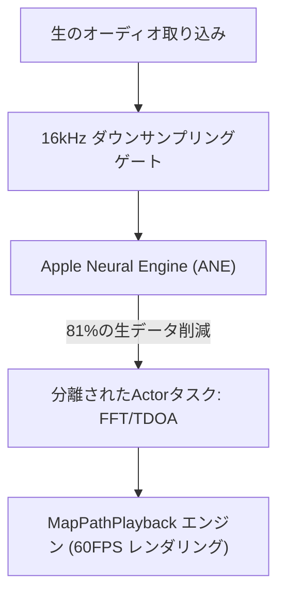

# VigilantEar 👂🛡️ (Apple Edition)

**有効日:** 2026年6月6日

**VigilantEar** は、聴覚障害者（D/HH）コミュニティにリアルタイムの方向および空間認識を提供するために設計された、高度で超高性能なiOS音響研究およびアクセシビリティツールです。従来の音声認識ソフトウェアは音が「何」であるかを特定するだけですが、VigilantEarは包括的な戦術レーダーとして機能し、エッジコンピューティングによる機械学習と高度な音響物理学を組み合わせて、音が「どこから」発生しているか、その推定距離、そして絶対的な経路の軌跡を正確に追跡します。

---

## 🌍 グローバル展開とローカリゼーション

世界中のユーザーをサポートするため、このプラットフォームは以下をサポートする完全なネイティブローカリゼーションマトリックスを備えています：

- **英語**
- **スペイン語 (Español)**
- **ポルトガル語 (Português)**
- **中国語 (简体中文)**
- **フランス語 (Français)**
- **ドイツ語 (Deutsch)**
- **日本語 (日本語)**

すべての戦術オーバーレイ、HUDアラート、および設定メニューは、システムのロケールに合わせて動的に調整されます。

---

## 🚀 主な機能と能力

- **スマートパワーゲーティング**: バッテリーの寿命を最大化し、システムリソースを保護するため、システムは条件付きバックグラウンドモニターを実装しています。ユーザーが5つの主要な緊急アラートカテゴリを無効にした場合、マイクの取り込みループと処理エンジンはバックグラウンド時に自動的に完全なハイバネーション（休止状態）に入ります。
- **シネマティック戦術シミュレーション**: 現実世界の音響トリガーを必要とせずに、サイレン、アラーム、ドアベル、近くの人、悪天候という5つの重要な `.emergency` トラックすべてのハプティックシグネチャと視覚的応答をユーザーがテストできる、堅牢なオンデバイスシミュレーションスイートが含まれています。消防車シミュレーションは、分離されたシネマティックな60FPSの物理再生エンジン上で安全に動作し、音響ポーリングとは無関係に視覚的に魅力的なマップ操作を保証します。
- **マルチターゲットトラッカー (MTT)**: 物理的な永続性マッピングとペアになった一意のUUIDセッションマーカーを使用して、独立した環境音のシグネチャを同時に分離および追跡します。
- **ShazamKit統合**: 空間レーダー上に動的にマッピングされるリアルタイムの環境音楽識別。
- **地理的道路スナップと物理エンジン**: 相対的な数学的音響方位をグローバルGPS座標に投影し、MapKit統合を介してリアルタイムの車両ベクトルを検証済みの道路にインテリジェントにスナップし、専用の `VehiclePathPredictor` を使用してその経路を予測します。

---

## 🧬 コアアーキテクチャとニューラル演算エンジン

VigilantEarは、最新のiOSハードウェアのパフォーマンスと並行処理の保証を完全に中心に構築されたカスタムの **SoundML Push アーキテクチャ** を利用しています。

## ⚡ アーキテクチャの分離

高周波入力タップと複雑なマップ描画を継続的に処理しながら、完全にブロックされない120HzのUIスレッドを維持するために、プラットフォームはSwift 6の分離機能による厳密な関心の分離を使用しています：

- **MapPath セッションレジストリ (DisplayLink)**: MapKitビューの更新を音響処理から分離する分離されたCADisplayLinkエンジンを備えており、シルクのように滑らかな60フレーム/秒のマーカーグライド、フェージングドップラートレイル、シネマティックなオブジェクトトラッキングを保証します。
- **MicrophoneManager (MainActor)**: HUDをスムーズに駆動するために、UIバウンドのプロパティ、デバイスの向きの状態、および位置メトリクスを厳密に分離します。
- **AcousticEngine (非分離 / バックグラウンド Actor)**: 低レベルのAVAudioEngineの状態とハードウェア操作を管理します。取り込みバッファは高優先度のタップスレッドで直接ディープコピーされ、スレッドホップを強制したりMain Actorを停止させたりすることなく、スナップショットを処理アクターに直接渡し、マイクロスタッターを完全に排除します。

### 🧠 数学的最小化

- **オフロードと削減**: オーディオフレームは処理の前に厳密な16kHzダウンサンプリングゲートを通過し、分類ベクトルがApple Neural Engine (ANE) によって処理される前に生データのフットプリントを81%削減します。
- **並列空間演算**: 高速フーリエ変換 (FFT)、到着時間差 (TDOA) 計算、ドップラートラッキングアルゴリズムを含む高性能な数学的パイプラインは、完全に分離された非同期スレッド内で実行されます。

### 📊 パフォーマンスベンチマーク

- **アクティブモード**: 標準の6コアプロセッサ全体でわずか6%のCPUフットプリントで、包括的なライブHUDトラッキングと60FPSの予測マップトレイルを提供します。
- **最小化 / バックグラウンドモード**: アプリケーションが最小化されると、コンピューティングは33%以上低下し、熱への影響が無視できるわずか4%のCPU使用率で絶対的な環境監視を維持します。

---

## 🛠️ 技術スタック (2026)

- **言語**: Swift 6 (厳密な並行処理、Checked Sendableモデル、Actor分離)
- **フレームワーク**: SwiftUI, MapKit (Annotation & Timeline オーバーレイ), Accelerate Framework (vDSP), SoundML
- **ハードウェアベースライン**: iPhone 13以降 (TDOA方位精度にはステレオマイクアライメントが必要)

---

## 📊 プライバシーとセキュリティのガードレール

- **ローカルファーストの分離**: すべてのオーディオ分類、スペクトル演算、および方位投影は、排他的にオンデバイスで行われます。生のオーディオストリームは、いかなる条件下でも録音、キャッシュ、または送信されることはありません。
- **リモートでのテレメトリおよび診断の非収集**: VigilantEarは、完全にお客様のデバイス上（ローカル）で動作するように設計されています。当社がリモートでテレメトリ、クラッシュログ、診断記録、または利用統計 of 収集、送信、または保存を行うことは一切ありません。

---

## ⚖️ 免責事項

VigilantEarは、実験的な音響研究および空間アクセシビリティ支援ツールです。生命安全ユーティリティとしての認定は受けていません。トラッキングの解像度は、地域のトポロジー、一般的な気象、風の状況、マイクのハードウェアキャリブレーションに基づいて動的に変動する可能性があります。ユーザーは常に通常の環境認識を維持する必要があります。

**連絡先メールアドレス:** [vigilantear@wingdingssocial.com](mailto:vigilantear@wingdingssocial.com)

VigilantEarは、注意を払って構築されたアクセシビリティツールです。責任を持って使用してください。

D/HHコミュニティと音響研究のために、愛（❤️）を込めて作られました。

© 2026 Wingdings, Inc.  
全著作権所有。
