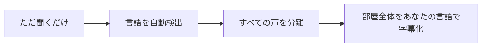
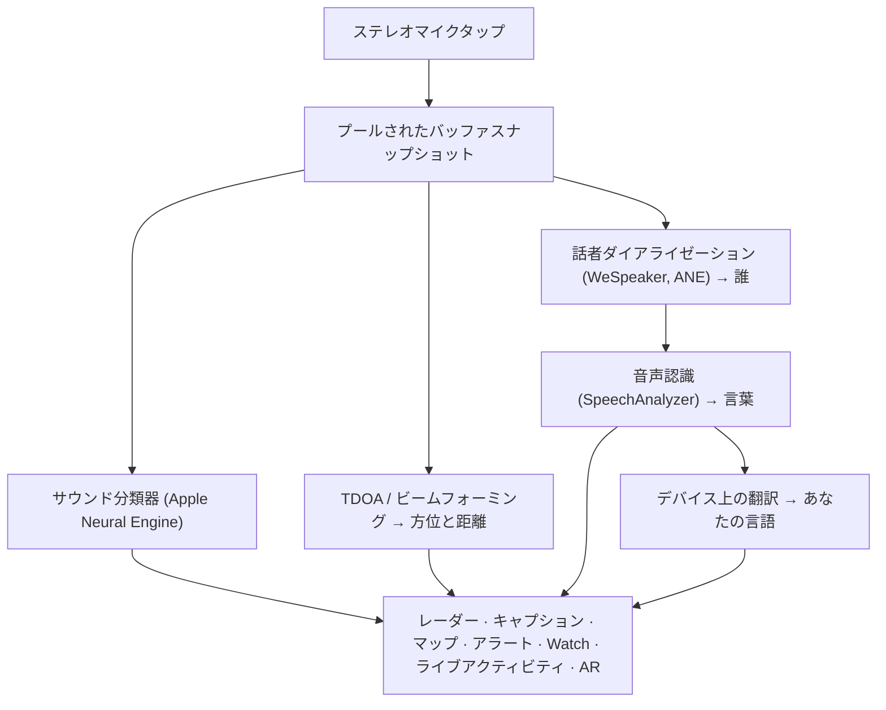

# Vigilant Ear 👂🛡️

*耳が不自由な方のための音響レーダー。*

聴覚障害者および難聴者のコミュニティ向けに特別に構築されたアプリ。ほとんどの音声認識アプリは、それが*何の*音であるかを教えてくれます。**Vigilant Ear は、それがどこにあるのか、誰が発しているのか、何を言っているのかを教えてくれます。** — iPhone を、周囲の音を説明するリアルタイムの音波トライコーダーに変えます。

サイレンの方向と距離。あなたの後ろでのノック音。会話中の人々を、キャプションが付けられ、方向を合わせて配置された、個別の文字起こしされた音声として描画します。もし誰かがあなたが読めない言語を話している場合、その言葉は**あなたの言語に翻訳されて**届きます。アラートは**ロック画面、Dynamic Island、Apple Watch** に届くため、一目で十分です。

重要なものはすべてデバイス上で実行されます。認識のために音声が録音されたり、アップロードされたりすることはありません。何も聞こえることに依存しません。

- 🧭 **検出だけでなく、方向も。** 単に「音が鳴った」だけでなく、*何が、どこで、誰が、何と言ったか*。
- 🔒 **設計によるプライバシー保護。** 分類、キャプション、翻訳は iPhone 上で実行されます。キャプションはライブで一時的なものです。アーカイブとして保存されることはありません。
- ⌚ **手首とロック画面に。** Apple Watch の方向コンパニオン + ライブアクティビティにより、最後のアラートとそれがどの方向から来たのかを一目で確認できます。
- 🛰️ **より多くの電話、共有される一つの耳。** Constellation は Ultra-Wideband (超広帯域) iPhone をリンクし、それぞれが聞いているものを融合して、より鮮明な方向の全体像を作成します。
- 👁️ **ろう者 / 難聴者向け。** 独特の触覚(ハプティクス)、高コントラストの視覚効果、色に依存しない手がかり、大きなタップターゲット、「視差効果を減らす(Reduce Motion)」の尊重が全体にわたって行われています。

---

## 対象者

- 音の状況認識を求める**ろう者および難聴者のユーザー** — Home Watch (ノック、アラーム、赤ちゃん、電話) と Street Watch (サイレン、接近) をオンにしたまま信頼できます。
- **方向と話者分離を伴うライブキャプション**、または近くに座っている人の**デバイス上での翻訳**を必要とする人。
- デバイス上の音源定位に関心のあるアクセシビリティおよび音響研究のユーザー。

> Vigilant Ear はアクセシビリティの**支援ツール**であり、認定された生命安全装置ではありません。

---

## できること

### 🧭 音を見る — 方向と距離
iPhone のステレオマイクを使用して、Vigilant Ear は周囲の音の**方位とおおよその距離**を推定し、ヘディングアップのレーダーリングとマップ上にライブマーカーとして配置します。移動しても、マーカーは現実世界の同じ位置を保持します。これがコアです：聞こえない世界の空間認識。

### 🚨 重要な音を認識し、警告する
デバイス上の分類器が何百もの日常的な音を識別し、重要なカテゴリ（**サイレン、アラーム、ドアベル/ノック、赤ちゃんの泣き声、近くにいる人、悪天候**）を監視します。いずれかが発生すると、明確な画面上のアラート、オプションの**プッシュ通知**、およびアプリがバックグラウンドにある場合や電話がスリープ状態の場合でも、明確な**触覚(ハプティック)**が得られます。重要なカテゴリはデフォルトで準備ができているため、通知を有効にしても「すべてオフ」になるわけではありません。すべてのアラートカテゴリをオフにすると、エンジンはバックグラウンドにある間、バッテリーを節約するために完全に休止状態になります。

悪天候の警告は、公式のパブリック CAP フィードから取得されます — 米国の **NWS**、ヨーロッパの **MeteoGate**、**中国の CMA**、および**韓国の KMA** — すべてのユーザーが無料で利用できます。フィードは、あなたのいる場所をカバーするものに絞り込まれます。

### ⌚ Apple Watch + ライブアクティビティ — 一目でわかる
- **Apple Watch コンパニオン** — アラートの方向が手首で示されるため、どこを見るべきかが一目でわかります。アプリアイコン、脅威 HUD レイアウト、およびアラートを閉じるダブルタップを備えた再設計された Watch UI。Watch アプリが開いていないときでも、アラートに方向の矢印を表示できます。
- **ライブアクティビティ** — Vigilant Ear は**ロック画面**、**Dynamic Island**、および **Watch スマートスタック**にとどまるため、最後のアラートとその方位を常に一目で確認できます。

### 💬 スピーカーモード — ライブで方向を伴うキャプション *(無料)*
**スピーカーモード**をオンにすると、Vigilant Ear は近くで話している人を**声ごとに1つのキャプションブロック**に文字起こしします。デバイス上の話者ダイアライゼーションにより、音声が明確に区別されます — *誰*が*何*を言っているか — 内部リングに方向の手がかりがあります。ライブスピーカーがハイライトされ、スペースが必要になると古いテキストはスクロールして消えます。キャプションは無料です。自動翻訳はオプションの Power Pack+ レイヤーです。

### 🌐 スピーカー自動翻訳 — あなたの言語で、ライブで *(Power Pack+)*
スピーカーモードがオンの場合、近くにいる人が別の言語を話すと、Vigilant Ear はそれを検出し、そのキャプションを**あなたの言語**でレンダリングし、元の言語をそのブロックに表示できます。聞く → 話者を分離する → 文字起こしする → 翻訳する → 表示する、というチェーンは**デバイス上で**実行されます。ネットワークを使用するのは、Apple から言語パックを1回ダウンロードするときだけです。事前に他の言語を知っているか、選択する必要はありません。

これは、SF が夢見た**ユニバーサル翻訳機** — ただ理解してくれる装置 — に最も近い現実のプロダクトです。Vigilant Ear は言語を自動で検出し、部屋で話すすべての人を追いかけ、全員をあなたの言語で字幕化します — イヤホン不要、設定不要、処理はデバイス上で。

### 🎵 音楽と放送の認識 *(Power Pack+)*
**ShazamKit** は周囲で流れている音楽を識別し、曲の変更を追跡します。部屋にいる人ではなく、テレビやラジオから聞こえてくるような声には、**📻** のタグが付けられます — 言葉は表示されたままであり、正直にラベル付けされます。

### 🎛️ アコースティックスコープ — エンジニアのように音を見る *(Power Pack+)*
周囲の音をプロ仕様でライブ表示:スペクトラム、スペクトログラム、1/3オクターブRTAバンド、クロマ、倍音パーシャル。さらに、独自パックの学習用に音を収録するツールも搭載。

### 📦 カスタムサウンドパック — あなたの世界を学習させる *(Power Pack+)*
身近な鳥の声から建物のドアチャイムまで、あなたに必要な音を Vigilant Ear に学習させられます。追加パックは内蔵検出に積み重なる方式で、サイレンや警報を妨げることはありません。手順ガイドをアプリ内に収録。

### 🛰️ Constellation — 多くの iPhone、共有される一つの耳 *(Power Pack+)*
2つ以上の Ultra-Wideband (超広帯域) 対応 iPhone (iPhone 11 以降のほとんど) があれば、**Constellation** がそれらをペアリングし、互いの位置を感知し、それぞれが聞いているものを融合して、音がどこから来ているのかを単一の、より正確な全体像にします — 分散型のパッシブリスニングアレイ。適切なハードウェアを備えたデバイスに限定されます。ピアの接続時間よりも古いメッシュキャプションは再送信されません。

### 📷 カメラ AR — 「音を見る」
タイトルレールのカメラピルを開き、検出された音をライブカメラビュー内の実際の方向(方位)にピン留めします。マーカーは話者ごと、または音のカテゴリと方向ごとにクラスタリングされるため、ビューは読みやすいままです。音源が静かになると、マーカーは時間の経過とともにフェードアウトします。

### 🗺️ マップ、道路、経路予測
音の方位は、マップ上の実際の GPS 座標に投影されます。車両の音は**近くの道路にスナップ**され、その経路が予測されるため、通過するトラックは建物を通り抜けるのではなく、*道路に沿って*移動しているように読み取れます。(消防車のデモを試してみてください。)

### 🪄 機能プレイグラウンド — 耳なしで証明する
**機能プレイグラウンド**は誰でも公開されています：ホーム＆ストリートの練習 (ノック、アラーム、赤ちゃん、サイレン、天気)、マルチ電話や会話のデモ、そして練習が実際のイベントと見なされないようにするための明確なウォーターマーク。パネルを閉じると、デモがきれいに破棄されます (スタックした GPS スプーフィングや、残ったフラグはありません)。

### ♿ アクセシビリティ・ファースト
ろう者 / 難聴者および色覚多様性ユーザー向けに構築：**色に依存しない**手がかり、**44 pt 以上**のタップターゲット、**「視差効果を減らす(Reduce Motion)」**の尊重、マルチモーダルアラート (触覚 + 視覚 + Watch)、およびクリアな緑 / 灰色 / 赤 (および許可されていない状態の「焦げたオレンジ」) で権限のステータスを示すスタートアップ確認画面 — マスターアラートスイッチとして機能する通知の許可を含みます。

---

## 無料と Power Pack+

安全に関するコア機能は**永久に無料**です：

- **Home Watch と Street Watch** — 画面上、触覚、およびオプションのプッシュ配信によるローカルサウンドアラート (アラーム、サイレン、ノック/ドアベル、赤ちゃん、近くにいる人)。
- **ライブキャプション** — スピーカーモード、デバイス上、ハードウェアが許す限りの方向性。
- **悪天候 CAP** — お住まいの地域の NWS、MeteoGate、CMA、KMA。
- **機能プレイグラウンド** — 明確な PREVIEW ウォーターマーク付きの練習用アラートと機能プレビュー。
- **Apple Watch コンパニオンとライブアクティビティ** — 一目でわかる方向と最後のアラート。

**Power Pack+** は1回限りのロック解除 (**サブスクリプションではありません**) で、**90日間の無料トライアル**が付いています。以下のスーパーパワーが追加されます：

- **スピーカー自動翻訳** — 近くの音声をあなたの言語にデバイス上で翻訳。
- **Constellation** — Ultra-Wideband を介したマルチ iPhone 共有リスニング。
- **音楽 ID** — ShazamKit による曲の認識。
- **アコースティックスコープ** — プロ仕様のライブ音響ビジュアライゼーションと収録ツール。
- **カスタムサウンドパック** — 自分の音を学習させられる追加クラシファイア。

無料版でも Power Pack+ でも、**認識のための音声はデバイス上にとどまります** — 階層が変わるのは、どの機能がロック解除されるかだけであり、分析のために生音声が送信される場所が変わることは決してありません。

---

## 仕組み (舞台裏)

Vigilant Ear は、**ローカルファースト、デバイス上**のパイプラインです。生音声は高優先度のタップでキャプチャされ、**プールされたバッファフリーリスト** (リアルタイムパスでのアロケーションのスラッシングなし) にコピーされ、UI をストールさせたりストリーマーを中断したりすることなく、独立したプロセッサに展開されます：

- **空間数学** — バックグラウンドタスクでの FFT、到着時間差 (TDOA)、ドップラー追跡。
- **音声** — iOS 26 `SpeechAnalyzer` / `SpeechTranscriber` による文字起こし。音声識別のための **WeSpeaker** エンベディング。デバイス上での翻訳のための Apple の **Translation** フレームワーク。
- **並行性** — Swift 6 アイソレーションにより、マイクタップ、音響数学、および UI レンダリングループが明確に分離されます。
- **効率性** — ダウンサンプリングと負荷適応型分類により、常にオンにしておけるほど「常時リスニング」を軽く保ちます。

---

## プライバシー

- **コアパイプラインは常にデバイス上で。** 分類、空間数学、文字起こし、ダイアライゼーション、および翻訳は iPhone 上で実行されます。認識のために生音声が録音されたりアップロードされたりすることはありません。
- **キャプションは一時的なものです。** ライブキャプションはセッション中はメモリにとどまります。エクスポートされたデバッグログにはキャプションテキストは含まれません。
- **広告や行動分析 SDK はありません。** 制限されたネットワークの使用は、マップ、公共の天気フィード、オプションの Shazam フィンガープリント、道路のコンテキスト、および App Store での購入のみです — 完全なポリシーを参照してください。

詳細: [PRIVACY.md](PRIVACY.md) · [TERMS.md](TERMS.md) · [SUPPORT.md](SUPPORT.md)

---

## ハードウェアとプラットフォーム

- **iPhone (フルエクスペリエンス)。** 方向探知にはステレオマイクが必要です。**iPhone 13 以降**を推奨します。
- **Apple Watch。** 方向の矢印付きのコンパニオンアラート。ライブアクティビティ / スマートスタックで動作します。
- **iPad (キャプション中心)。** シングルチャンネルマイク → 完全な方向情報を持たないキャプション。
- **Constellation** には **Ultra-Wideband** が必要です — iPhone 11 以降 (SE および「e」モデルを除く)。
- **Android。** コアレーダー、アラート、キャプション、天気を備えた個別のビルド。Constellation メッシュは iOS ファーストです。Android の同等性が高まるにつれて、製品サイトのアップデートをご覧ください。

**現在の App Store バージョン:** 1.0.7。最新の iOS (SpeechAnalyzer 時代) 向けに構築されています。

---

## ローカライズ

インターフェース、アラート、およびキャプションは、**英語、スペイン語、ポルトガル語 (ブラジル)、フランス語、ドイツ語、アラビア語、日本語、簡体字中国語、および韓国語** (9言語) に完全にローカライズされています。システムロケール、またはアプリ内の手動選択に従います。

---

## ステータスと免責事項

Vigilant Ear は**実験的な音響アクセシビリティ支援ツール**であり、認定された生命安全ユーティリティではありません。定位の解像度は、周囲の環境、天候、風、およびマイクのハードウェアによって異なります。**常に通常の環境認識を維持してください** — 安全情報の唯一のソースとしてこれに依存しないでください。

一部の機能 (カメラ AR マーカー、Apple によって付与された場合の Critical Alerts (重大な通知) エンタイトルメントのアップグレード、高度なマルチパックサウンドオーサリング) は進化し続けています。無料の Home / Street watch とライブキャプションは、初日から信頼できる製品です。

---

**連絡先:** [vigilantear@wingdingssocial.com](mailto:vigilantear@wingdingssocial.com)

D/HH コミュニティと音響研究のために ❤️ を込めて作られました。

    
  <strong>© 2026 Wingdings, Inc.</strong> 
  All rights reserved. 
  Patent Pending

