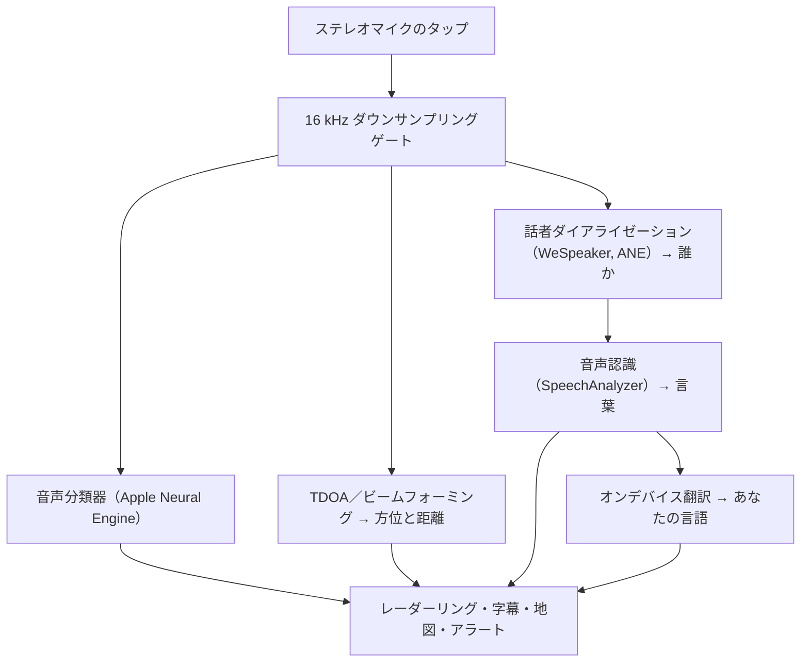

# Vigilant Ear 👂🛡️ (Apple版)

*耳の聞こえない人のための音響レーダー。*

ろう者・難聴者（Deaf/HH）コミュニティのために専用に作られたアプリです。ほとんどの音認識アプリは、それが*どんな*音なのかを教えてくれます。**Vigilant Earは、その音がどこにあり、誰が出していて、何を話しているのかを教えてくれます**——iPhoneをリアルタイムの音響トライコーダーに変え、まわりの音を視覚的に描き出します。

サイレンの方向と距離。背後でのノック。会話の中にいる人々が、別々の文字起こしされた声として描かれ——一人ひとりに字幕が付き、話者ごとに方向を示して配置されます。読めない言語を誰かが話していても、その言葉は**あなたの言語に翻訳されて**届きます。

すべてはデバイス上で動作します。録音も、キャッシュも、外部への送信も一切ありません。

---

## 対象となる方

- 音の状況認識を求める**ろう者・難聴者**の方——単に「音がした」だけでなく、*何が、どこで、誰が、何を話したのか*まで。
- **方向と話者分離を備えたライブ字幕**や、近くにいる友人の言葉の**オンデバイス翻訳**を必要とする、すべての方。
- オンデバイスでの音源定位に関心のある、音響研究やアクセシビリティの探求者の方。

> Vigilant Earはアクセシビリティの**補助**であり、認証された生命安全機器ではありません。

---

## できること

### 🧭 音を「見る」——方向と距離
iPhoneのステレオマイクを使い、Vigilant Earはまわりの音の**方位とおおよその距離**を推定し、進行方向を上にしたレーダーリングと地図の上にライブのドットとして配置します。移動しても、ドットは現実の位置を保ちます。これが核となる機能——聞こえない世界の空間的な把握です。

### 🚨 重要な音を認識し、警告します
オンデバイスの分類器が**300種類以上の日常的な音**を識別し、重要なカテゴリ——**サイレン、アラーム、ドアベル／ノック、近くにいる人、悪天候**——を見張ります。いずれかが発生すると、画面に分かりやすいアラートが表示され、任意で**プッシュ通知**も届きます。アプリがバックグラウンドにあっても、端末がスリープ中でも作動します。すべてのアラートカテゴリをオフにすれば、バックグラウンド時にエンジンは完全に休止し、バッテリーを節約します。

悪天候の警報は、公式の公共フィードから取得します。アメリカの**NWS**は無料で標準搭載。ヨーロッパの**MeteoAlarm**ネットワークと**中国のCMA**はPremiumに含まれます。フィードは、実際に現在地をカバーするものへ自動的に絞り込まれます。

### 💬 スピーカーモード——ライブで方向付きの字幕 *(Premium)*
**スピーカーモード**をオンにすると、Vigilant Earは近くで話している人々を**声ごとに1つずつの字幕ブロック**として文字起こしします。オンデバイスの話者ダイアライゼーションが声を聞き分けるので、各人がそれぞれのブロックと個性的なアイコンを保ち——*誰*が*何*を話しているのかが分かります——内側のリングには小さな円が表示され、その人が部屋のどこにいるかを示します。今話している人がハイライトされ、古いテキストはゆっくりと、または新しいテキストのためのスペースが必要になると、スクロールして消えていきます。

### 🌐 スピーカー自動翻訳——聞こえない言語を、自分の言語で読む *(Premium)*
スピーカーモードがオンのとき、近くにいる人が別の言語を話すと、Vigilant Earはそれを検知し、その人の字幕を**あなたの言語で**ライブ表示します。元の「翻訳元」の言語はブロックのタイトルバーに表示されます。一連の流れ——聞く → 話者を分ける → 文字起こしする → 翻訳する → 表示する——はすべて**デバイス上で完結**します。ネットワークを使う唯一の瞬間は、Appleからの一度きりの言語パックのダウンロードだけです。別の言語を話す友人を持つろう者にとって、これは**事前にその言語を知って選んでおく必要なく**、相手側の会話をリアルタイムで読めることを意味します。

### 🎵 音楽・放送の認識 *(Premium)*
**ShazamKit**がまわりで流れている音楽を識別し、曲の変わり目を自動で検知しながらタイトルを表示します。そして、声が部屋にいる人ではなくテレビやラジオから来ていると思われる場合には、その場にいる人と取り違えるのではなく**📻**のタグが付きます——言葉自体はそのまま表示され、ただ正直にラベル付けされるだけです。

### 🛰️ コンステレーション——複数のiPhone、ひとつの共有された耳 *(Premium)*
Ultra-Wideband対応のiPhone（iPhone 11以降の多くが該当）が2台以上あれば、**コンステレーション**モードがそれらをペアリングし、互いの位置を感知（AppleのNearby Interaction／UWBによる）した上で、それぞれが聞き取った内容を融合させ、音がどこから来ているかをはるかに精密な一枚の像にまとめます——いわば分散型でパッシブな**合成開口ソナー**です。対応するハードウェアを備えた端末に限定されます。

### 🗺️ 地図・道路・経路予測
音の方位は実際のGPS座標に投影され、地図ビュー上に描かれます。乗り物の音は（オープンソースの道路データフィードを使って）**近くの道路にスナップ**され、その経路が予測されるため、通り過ぎる車は建物の中を漂うのではなく*道路に沿って*移動するものとして表示されます。（消防車のデモを試して、その動きをプレビューしてみてください。）

---

## 無料版とPremium

安全の核となる機能は**永久に無料**です：

- **ローカルの音アラート**——アラーム、サイレン、ドアベル／ノック、近くにいる人——をオンデバイスで検知し、画面表示とプッシュで警告します。
- アメリカ向けの**NWS悪天候警報**。

買い切りの**Premiumアンロック**——最初に無料トライアルが付き、**サブスクリプションではありません**——を購入すると、状況認識のレイヤーがすべて追加されます：

- **スピーカーモード**——ライブで方向付き、話者ごとの字幕。
- **スピーカー自動翻訳**——近くの会話をオンデバイスであなたの言語に翻訳。
- **コンステレーション**——Ultra-Wideband経由で複数のiPhoneによる共有された聴覚。
- **音楽識別**——ShazamKitによる楽曲認識。
- **国際的な気象フィード**——ヨーロッパ（MeteoAlarm）と中国（CMA）。

無料版でもPremiumでも、**すべてはデバイス上で動作します**——ティアによって変わるのはどの機能がアンロックされるかだけで、あなたの音声がどこへ行くかは決して変わりません。

---

## 仕組み（内部の動作）

Vigilant Earは**ローカルファースト・オンデバイス**のパイプラインです。生の音声は高優先度のタップで取り込まれ、コピーされた上で、UIを一切止めることなく独立した処理アクターへと分配されます：

- **空間計算**——高速フーリエ変換、到来時間差（TDOA）、Dopplerトラッキングが、切り離されたバックグラウンドタスク上で動作します。
- **音声**——iOS 26の`SpeechAnalyzer`／`SpeechTranscriber`が文字起こしを担い、**WeSpeaker**の埋め込みが音声を個別の声へとクラスタリングし、Appleの**Translation**フレームワークがオンデバイス翻訳を行います。
- **並行処理**——Swift 6の厳格なアイソレーションにより、マイクのタップ、音響計算、地図の`CADisplayLink`レンダリングループがきれいに分離されるため、他のすべてがバックグラウンドで高負荷に動いていても、UIはスムーズなまま（目標は60 FPSでのマーカー移動）に保たれます。
- **効率**——16 kHzのダウンサンプリングゲートが、分類器の見るデータをおよそ80%削減し、アクティブ時のフットプリントを軽く、バックグラウンドの「常時リスニング」モードをさらに軽く保ちます。

---

## プライバシー

- **常に、オンデバイス。** すべての分類、空間計算、文字起こし、ダイアライゼーション（話者の特徴／識別）、翻訳は、あなたのiPhone上で行われます。生の音声が録音、キャッシュ、送信されることは決してありません。
- **文字起こしは一時的です。** 字幕はセッション中のみメモリ上に存在し、保存もアップロードもされません。
- **テレメトリなし。** 分析データ、クラッシュログ、利用データがサーバーへ送信されることはありません。

詳細はこちら： [PRIVACY.md](PRIVACY.md) · [TERMS.md](TERMS.md) · [SUPPORT.md](SUPPORT.md)

---

## ハードウェアとプラットフォーム

- **iPhone（フル体験）。** 方向探知にはステレオマイクを備えたiPhoneが必要です。iPhone 13以降を推奨します。
- **iPad（字幕のみ）。** iPadはオーディオチャンネルが1つしかないため、文字起こしと字幕はできますが方向を計算できません——据え置きの大画面ディスプレイとして好適です。
- **コンステレーション**には**Ultra-Wideband**が必要です——iPhone 11以降（SEおよび「e」モデルを除く）。

---

## ローカライズ

インターフェース、アラート、字幕のすべてが、**英語、スペイン語、ポルトガル語、フランス語、ドイツ語、アラビア語、日本語、簡体字中国語**（8言語）に完全対応しています。システムのロケール設定に従うほか、アプリ内で手動で選ぶこともできます。

---

## ステータスと免責事項

Vigilant Earは**実験的な音響アクセシビリティ補助**であり、認証された生命安全ユーティリティではありません。定位の精度は、周囲の環境、天候、風、マイクのハードウェアによって変わります。**常に普段どおりの周囲への注意を保ってください**——これを唯一の安全情報源として頼らないでください。

---

**お問い合わせ：** [vigilantear@wingdingssocial.com](mailto:vigilantear@wingdingssocial.com)

ろう者・難聴者（D/HH）コミュニティと音響研究のために、❤️を込めて作りました。

© 2026 Wingdings, Inc. All rights reserved.
