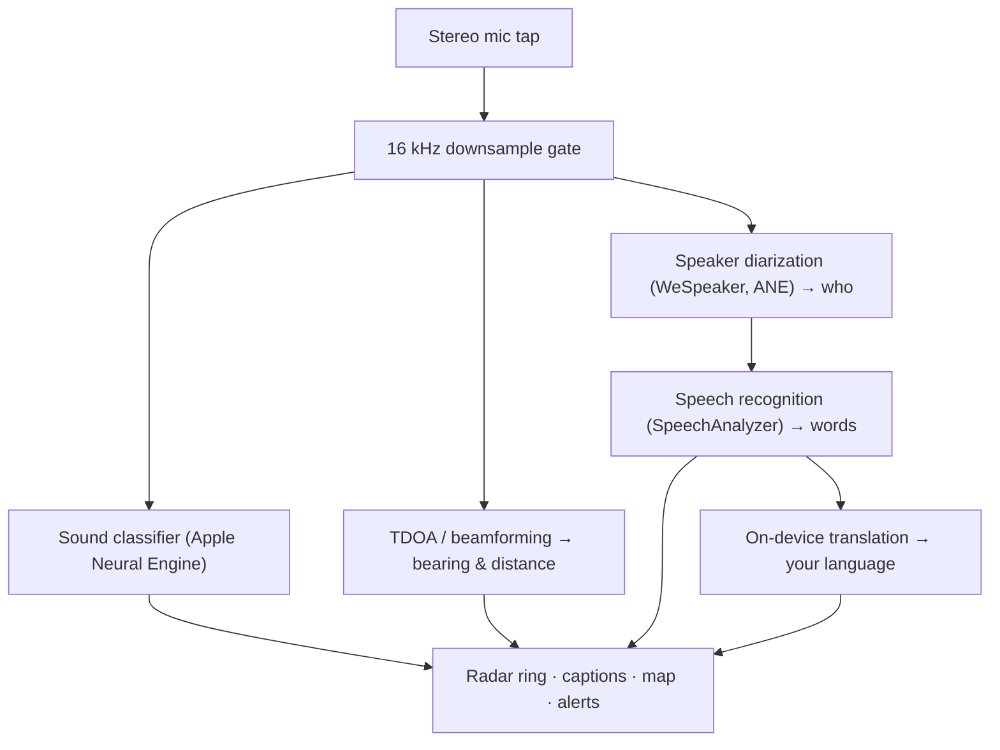

# Vigilant Ear 👂🛡️ (Apple Edition)

*耳の聞こえない方のための音響レーダー。*

Deaf/HH（聴覚障害・難聴）コミュニティのために作られたアプリです！ほとんどの音声認識アプリは「何の音か」を教えてくれます。**Vigilant Ear は「どこから」「誰が」「何を言っているか」をお伝えします** — iPhone をリアルタイムの音響トリコーダーに変え、周囲の音を視覚的に描写します。

サイレンの方向と距離。背後でのノック音。会話している人々が、それぞれ転写された声として表示され、一人ひとりのキャプションが方向とともに配置されます。もし近くの人が読めない言語で話していても、**あなたの言語に翻訳されて届きます。**

すべてデバイス上で動作します。録音・キャッシュ・送信は一切行いません。

---

## 対象ユーザー

- 「音が鳴った」というだけでなく、*何が、どこで、誰が、何を言ったか*を知りたい**聴覚障害・難聴のユーザー**。
- 方向別・話者別の**ライブキャプション**や、近くにいる友人の会話の**デバイス上翻訳**を必要とする方。
- デバイス上の音源定位に興味のある音響研究者やアクセシビリティ愛好者。

> Vigilant Ear はアクセシビリティ**補助ツール**であり、認定された生命安全装置ではありません。

---

## 機能紹介

### 🧭 音が見える — 方向と距離

iPhone のステレオマイクを使用して、Vigilant Ear は周囲の音の**方位と大まかな距離**を推定し、ライブのドットとして方位固定のレーダーリングとマップ上に表示します。移動しても、ドットはリアルワールドの位置を保持します。これがコアです：聞こえない世界における空間認識。

### 🚨 重要な音を認識して警告

デバイス上の分類器が **300以上の日常音**を識別し、重要カテゴリ — **サイレン、アラーム、ドアベル/ノック、近くにいる人、悪天候** — を常時監視します。これらが検知されると、画面に明確なアラートが表示され、アプリがバックグラウンドにある場合や画面がオフの場合でも**プッシュ通知**が届きます。すべてのアラートカテゴリをオフにすると、バックグラウンド時にエンジンが完全に休眠してバッテリーを節約します。

悪天候の警告は公式の公共フィードから取得されます：米国の **NWS** は無料で内蔵されており、欧州の **MeteoGate** ネットワークと**中国の CMA** はPremiumの一部です。フィードは現在地をカバーするものに自動的に絞り込まれます。

### 💬 Speaker Mode — ライブ方向別キャプション *（Premium）*

**Speaker Mode** をオンにすると、Vigilant Ear は近くで話している人々を**キャプションブロックとして、声ごとに一つずつ**書き起こします。デバイス上のスピーカーダイアリゼーションが声を識別するため、それぞれの人が自分のブロックと個性的なアイコンを持ち、誰が何を言っているかを把握できます。内側のリングの小さな丸がその人の位置を指し示します。ライブ中の話者はハイライトされ、古いテキストはゆっくりスクロールするか、新しいテキストのスペースが必要になると消えます。

### 🌐 Speaker Auto-Translate — 聞こえない言語をあなたの言語で読む *（Premium）*

Speaker Mode をオンにした状態で、近くにいる人が別の言語を話すと、Vigilant Ear がそれを検知し、**あなたの言語でキャプションをリアルタイムに表示**します。「元の言語」の識別がそのブロックのタイトルバーに表示されます。聞く → 話者分離 → 書き起こし → 翻訳 → 表示 という一連の流れが**すべてデバイス上で動作**します。唯一ネットワークを使う場面は、Apple からの一回限りの言語パックのダウンロードです。別の言語を話す友人を持つ聴覚障害者にとっては、**事前にその言語を把握して選択する必要なく**、リアルタイムで相手の会話を読めることを意味します。

### 🎵 音楽・放送の認識 *（Premium）*

**ShazamKit** が周囲で流れている音楽を識別し、曲名を表示します（曲の変化も自動検知）。また、声が部屋にいる人ではなくテレビやラジオから来ているように見える場合は、その話者と間違えずに **📻** のタグを付けます — 内容は引き続き表示されますが、正直にラベル付けされます。

### 🛰️ Constellation — 複数の iPhone が一つの耳になる *（Premium）*

Ultra-Wideband 対応の iPhone（iPhone 11以降の多くのモデル）が2台以上あれば、**Constellation** モードで互いの位置を感知し（Apple の Nearby Interaction / UWB 経由）、それぞれが聞いた音を融合させて、音の発生源をより精密に把握できます — 分散型の受動的な**合成開口ソナー**のようなものです。対応ハードウェアを持つデバイスのみ利用できます。

### 🗺️ マップ、道路、経路予測

音の方位が実際のGPS座標に投影され、マップビューに描画されます。車両の音は**近くの道路にスナップ**され（オープンソースの道路データフィードを使用）、その経路が予測されるため、通過する車が建物を通り抜けるのではなく**道路沿いを移動する**ように表示されます。（デモの消防車機能でプレビューできます。）

---

## 無料と Premium

安全機能のコアは**無料・永続**です：

- **ローカル音声アラート** — アラーム、サイレン、ドアベル/ノック、近くにいる人 — デバイス上で検知、画面とプッシュで警告。
- 米国向け **NWS 悪天候警告**。

一回限りの**Premium アンロック** — 無料トライアル付き、**サブスクリプションではありません** — が完全な状況認識レイヤーを追加します：

- **Speaker Mode** — ライブ・方向別・話者ごとのキャプション。
- **Speaker Auto-Translate** — 近くの会話をデバイス上であなたの言語に翻訳。
- **Constellation** — Ultra-Wideband を通じた複数 iPhone 共有聴覚。
- **Music ID** — ShazamKit による楽曲認識。
- **国際気象フィード** — 欧州（MeteoGate）と中国（CMA）。

無料でも Premium でも、**すべてデバイス上で動作します** — ティアが変わるのは使用できる機能のみであり、音声データの送信先が変わることはありません。

---

## 仕組み（内部構造）

Vigilant Ear は**ローカルファースト・オンデバイス**のパイプラインです。生の音声は高優先度のタップでキャプチャされ、コピーされて、UIをブロックすることなく独立した処理アクターに並列配信されます：

- **空間計算** — 高速フーリエ変換、到達時間差（TDOA）、ドップラー追跡がデタッチされたバックグラウンドタスクで動作します。
- **音声** — iOS 26 の `SpeechAnalyzer`/`SpeechTranscriber` が文字起こしを担当し、**WeSpeaker** 埋め込みが音声を個別の声にクラスタリングし、Apple の **Translation** フレームワークがデバイス上翻訳を行います。
- **並行処理** — Swift 6 の厳格なアイソレーションにより、マイクのタップ、音響計算、マップの `CADisplayLink` レンダーループが明確に分離されており、その他すべてがバックグラウンドで全力稼働中でも UI はスムーズ（目標60FPSのマーカー移動）に保たれます。
- **効率性** — 16 kHz ダウンサンプリングゲートにより分類器が処理するデータが約80%削減され、アクティブ時のフットプリントが軽く、バックグラウンドの「常時リスニング」モードはさらに軽量に保たれます。

---

## プライバシー

- **常にデバイス上で。** すべての分類、空間計算、文字起こし、ダイアリゼーション（話者の声紋識別）、および翻訳はお使いの iPhone 上で行われます。生の音声データは録音・キャッシュ・送信されません。
- **文字起こしは一時的なものです。** キャプションはセッション中メモリに存在し、保存やアップロードは行われません。
- **テレメトリなし。** 分析情報、クラッシュログ、使用データはいかなるサーバーにも送信されません。

詳細はこちら：[PRIVACY.md](PRIVACY.md) · [TERMS.md](TERMS.md) · [SUPPORT.md](SUPPORT.md)

---

## ハードウェアとプラットフォーム

- **iPhone（フル体験）。** 方向探知にはステレオマイク付き iPhone が必要です。iPhone 13以降を推奨します。
- **iPad（キャプションのみ）。** iPad は単一オーディオチャンネルのみを公開するため、文字起こしとキャプションは行いますが方向計算はできません — 固定の大画面ディスプレイとしては最適です。
- **Constellation** には **Ultra-Wideband** が必要です — iPhone 11以降（SE および「e」モデルを除く）。

---

## ローカライズ

インターフェース、アラート、キャプションを含め、**英語、スペイン語、ポルトガル語、フランス語、ドイツ語、アラビア語、日本語、および簡体字中国語**（8言語）に完全ローカライズ済みです。システムのロケール設定に従うか、アプリ内で手動で選択できます。

---

## ステータスと免責事項

Vigilant Ear は**実験的な音響アクセシビリティ補助ツール**であり、認定された生命安全装置ではありません。ローカライズの解像度は周囲の環境、天候、風、およびマイクのハードウェアによって異なります。**通常の環境認識を常に維持してください** — 安全情報の唯一の情報源として本アプリに依存しないでください。

---

**連絡先：** [vigilantear@wingdingssocial.com](mailto:vigilantear@wingdingssocial.com)

D/HH コミュニティと音響研究への❤️を込めて制作。

© 2026 Wingdings, Inc. All rights reserved.
