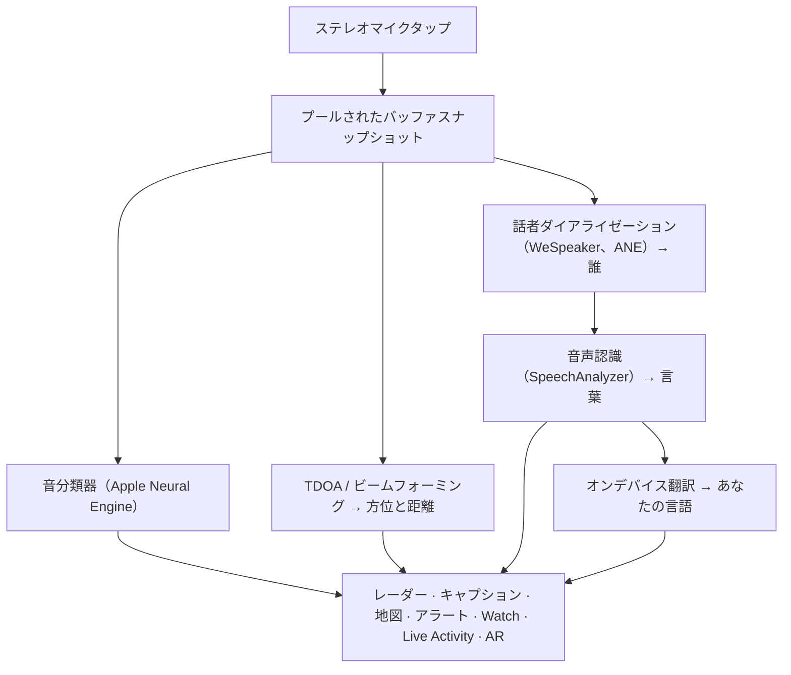

# Vigilant Ear 👂🛡️

*聞こえない人のための音響レーダー。*

ろう者・難聴者コミュニティのために特に作られたアプリです。ほとんどの音認識アプリは、音が*何か*を教えてくれます。**Vigilant Ear は、それがどこにあり、誰が発していて、何を言っているかまで伝えます** — iPhone を、周囲の音を記述するリアルタイムのソニック・トライコーダーに変えます。

サイレンの方向と距離。後ろからのノック。会話の中の人々を、別々の文字起こしされた声として描き — それぞれにキャプションが付き、方向付きで配置されます。読めない言語で話されていても、その言葉は**あなたの言語に翻訳されて**届きます。アラートは**ロック画面、Dynamic Island、Apple Watch**に届くので、一目で十分です。

重要な処理はすべてデバイス上で動きます。音声は認識のために録音・アップロードされません。何かを「聞く」ことには依存しません。

- 🧭 **検出だけでなく方向。** *何が、どこで、誰が、何を言ったか* — 単に「音がした」だけではありません。
- 🔒 **設計からプライバシー。** 分類、キャプション、翻訳は iPhone 上で動作します。キャプションはライブで一時的であり、トランスクリプトのアーカイブとしては保存されません。
- ⌚ **手首とロック画面に。** Apple Watch の方向コンパニオン + Live Activity で、最後のアラートとその方向がいつでも一目でわかります。
- 🛰️ **複数の電話、ひとつの共有の耳。** Constellation は Ultra-Wideband 対応の iPhone を接続し、それぞれが聞いたものを融合して、より鋭い方向の像をつくります。
- 👁️ **ろう者 / 難聴者のために。** 明確な触覚、高コントラストのビジュアル、色に依存しない手がかり、大きなタップターゲット、Reduce Motion への配慮を全体に。

---

## 対象ユーザー

- **ろう者・難聴者のユーザー** — 音の状況認識が欲しい方。Home Watch（ノック、アラーム、赤ちゃん、電話）と Street Watch（サイレン、接近）をオンにして信頼できる状態にできます。
- **方向と話者分離付きのライブキャプション**、または近くにいる人の**オンデバイス翻訳**が必要な方。
- オンデバイスの音源定位に関心のあるアクセシビリティ・音響研究ユーザー。

> Vigilant Ear はアクセシビリティのための**支援ツール**であり、認証された生命安全装置ではありません。

---

## できること

### 🧭 音を見る — 方向と距離
iPhone のステレオマイクを使い、Vigilant Ear は周囲の音の**方位とおおよその距離**を推定し、進行方向上向きのレーダーリングと地図上にライブマーカーとして配置します。移動しても、マーカーは現実世界の位置を保ちます。これが中核です — 聞こえない世界の空間認識。

### 🚨 重要な音を認識し — 警告する
オンデバイスの分類器が日常の何百もの音を識別し、重要なカテゴリ — **サイレン、アラーム、ドアベル/ノック、赤ちゃんの泣き声、近くの人、厳しい天候** — を監視します。検出されると、明確な画面上アラート、任意の**プッシュ通知**、特徴的な**触覚**が届きます — アプリがバックグラウンドでも、電話がスリープでも。重要なカテゴリは初期状態で準備済みなので、通知を有効にしても「すべてオフ」にはなりません。アラートカテゴリをすべてオフにすると、バックグラウンド中はエンジンが完全に休止してバッテリーを節約します。

厳しい天候の警告は公式の公開 CAP フィード — 米国 **NWS**、欧州 **MeteoGate**、**China CMA**、**Korea KMA** — から取得し、全ユーザーに無料です。フィードは現在地をカバーするものに絞られます。

### ⌚ Apple Watch + Live Activity — 一目でわかる
- **Apple Watch コンパニオン** — アラートの方向が手首に指し示され、どちらを見るべきか一目でわかります。アプリの耳アイコン、脅威 HUD レイアウト、ダブルタップで最小化など、Watch UI を再設計。Watch アプリが開いていなくても、方向矢印を表示できます。
- **Live Activity** — Vigilant Ear は**ロック画面**、**Dynamic Island**、**Watch Smart Stack**に残り、最後のアラートとその方位が常に一目でわかります。

### 💬 Speaker Mode — ライブ、方向付きキャプション *（無料）*
**Speaker Mode** をオンにすると、近くで話している人を**声ごとのキャプションブロック**に文字起こしします。オンデバイスの話者ダイアライゼーションが声を区別し — *誰が* *何を* 言っているか — 内側のリングに方向の手がかりを付けます。話している声は強調され、古いテキストはスペースが必要になるとスクロールして消えます。キャプションは無料で、自動翻訳は任意の Power Pack+ レイヤーです。

### 🌐 Speaker Auto-Translate — あなたの言語で、ライブ *（Power Pack+）*
Speaker Mode オン時、近くの人が別の言語で話すと、Vigilant Ear はそれを検出し、キャプションを**あなたの言語**で表示し、ブロック上に元の言語を示します。聞取 → 話者分離 → 文字起こし → 翻訳 → 表示の連鎖は**デバイス上**で動き、ネットワークが必要なのは Apple からの言語パックの一回限りのダウンロードだけです。相手の言語を先に知ったり選んだりする必要はありません。

### 🎵 音楽と放送の認識 *（Power Pack+）*
**ShazamKit** が周囲で再生されている音楽を識別し、曲の変化を追跡します。部屋の中の人ではなくテレビやラジオから来ているように聞こえる声は **📻** でタグ付けされます — 言葉はそのまま表示され、正直にラベルされます。

### 🛰️ Constellation — 複数の iPhone、ひとつの共有の耳 *（Power Pack+）*
Ultra-Wideband 対応の iPhone が 2 台以上あると（iPhone 11 以降の多く）、**Constellation** がそれらをペアリングし、互いの位置を感知して、それぞれが聞いたものを融合し、音の発生源がどこかをより精密に捉えます — 分散型のパッシブ聴取アレイです。必要なハードウェアがあるデバイスに限定されます。ピアの接続時刻より古いメッシュキャプションは再送信されません。

### 📷 Camera AR — 「音を見る」*（プレビュー）*
タイトルレールのカメラピルを開き、検出された音をライブカメラビュー内の実際の方位にピン留めします。マーカーは話者、または音カテゴリと方向ごとにまとまり、見やすく保たれます。音源が静かになると、経年フェードします。

### 🗺️ 地図、道路、経路予測
音の方位は地図上の実際の GPS 座標に投影されます。車両の音は**近くの道路にスナップ**され、経路が予測されるので、通り過ぎるトラックが建物を突き抜けるのではなく*道路に沿って*動いているように読めます。（消防車デモを試してください。）

### 🪄 Demo Mode — 耳がなくても証明する
**Demo Mode** は誰でも公開利用可能です：Home & Street 練習（ノック、アラーム、赤ちゃん、サイレン、天候）、複数電話と会話デモ、そして明確な **DEMO:** 透かしで、練習がライブイベントに見せかけないようにします。パネルを閉じるとデモはきれいに解体されます（GPS スプーフの残留なし、フラグの取り残しなし）。

### ♿ アクセシビリティ最優先
ろう者・難聴者および色覚多様性のあるユーザー向け：**色に依存しない**手がかり、**≥44 pt** のタップターゲット、**Reduce Motion** への配慮、マルチモーダルアラート（触覚 + 視覚 + Watch）、権限状態を緑 / グレー / 赤（および許可拒否の焦げオレンジ）で示す起動時検証画面 — マスターアラートスイッチとなる通知許可を含む。

---

## 無料と Power Pack+

安全の中核は**永久に無料**です：

- **Home Watch & Street Watch** — ローカル音アラート（アラーム、サイレン、ノック/ドアベル、赤ちゃん、近くの人）を画面上、触覚、任意のプッシュで配信。
- **ライブキャプション** — Speaker Mode、オンデバイス、ハードウェアが許す限り方向付き。
- **厳しい天候 CAP** — 地域向けの NWS、MeteoGate、CMA、KMA。
- **Demo Mode** — DEMO 透かし付きの練習アラートと機能プレビュー。
- **Apple Watch コンパニオン & Live Activity** — 一目でわかる方向と最後のアラート。

**Power Pack+** は一回限りのアンロック（**サブスクリプションではありません**）で、**90 日間の無料トライアル**があります。追加の強力な機能：

- **Speaker Auto-Translate** — 近くの発話をあなたの言語へオンデバイス翻訳。
- **Constellation** — Ultra-Wideband による複数 iPhone の共有聴取。
- **Music ID** — ShazamKit による曲認識。

無料でも Power Pack+ でも、**認識のための音声はデバイス上に留まります** — ティアが変えるのはどの機能が解放されるかだけであり、生の音声が分析のためにどこへ送られるかは変わりません。

---

## 仕組み（内部）

Vigilant Ear は**ローカルファースト、オンデバイス**のパイプラインです。生の音声は高優先度タップで取り込まれ、**プールされたバッファのフリーリスト**にコピーされ（リアルタイム経路でのアロケーション・スラッシュなし）、UI を止めたりストリーマーを中断したりせずに独立プロセッサへ分配されます：

- **空間計算** — バックグラウンドタスクでの FFT、Time-Difference-of-Arrival、ドップラー追跡。
- **音声** — 文字起こしには iOS 26 の `SpeechAnalyzer` / `SpeechTranscriber`；声の身元には **WeSpeaker** 埋め込み；オンデバイス翻訳には Apple の **Translation** フレームワーク。
- **並行性** — Swift 6 の分離により、マイクタップ、音響計算、UI レンダーループをきれいに分けます。
- **効率** — ダウンサンプリングと負荷適応型分類により、常時リスニングをオンのままにできるほど軽く保ちます。

---

## プライバシー

- **中核パイプラインは常にオンデバイス。** 分類、空間計算、文字起こし、ダイアライゼーション、翻訳は iPhone 上で動作します。生の音声は認識のために録音・アップロードされません。
- **キャプションは一時的。** ライブキャプションはセッション中メモリに留まり、エクスポートされたデバッグログにキャプション本文は含まれません。
- **広告や行動分析 SDK なし。** 限定的なネットワーク利用は、地図、公開天気フィード、任意の Shazam フィンガープリント、道路コンテキスト、App Store 購入のみ — 完全なポリシーを参照。

詳細：[PRIVACY.md](PRIVACY.md) · [TERMS.md](TERMS.md) · [SUPPORT.md](SUPPORT.md)

---

## ハードウェアとプラットフォーム

- **iPhone（フル体験）。** 方向探知にはステレオマイクが必要。推奨は **iPhone 13 以降**。
- **Apple Watch。** 方向矢印付きコンパニオンアラート；Live Activity / Smart Stack と連携。
- **iPad（キャプション中心）。** シングルチャンネルマイク → 完全な方向なしのキャプション。
- **Constellation** には **Ultra-Wideband** が必要 — iPhone 11 以降（SE および「e」モデルを除く）。
- **Android。** コアレーダー、アラート、キャプション、天候を備えた別ビルド；Constellation メッシュは iOS 優先。Android のパリティが進むにつれ製品サイトの更新を参照。

**現在の Apple マーケティングバージョン：** 1.0.7（進行中 / 出荷トラック）。最新の iOS（SpeechAnalyzer 世代）向けに構築。

---

## ローカライズ

インターフェース、アラート、キャプションを **英語、スペイン語、ポルトガル語（ブラジル）、フランス語、ドイツ語、アラビア語、日本語、簡体字中国語、韓国語**（9 言語）に完全ローカライズ。システムロケール、またはアプリ内の手動選択に従います。

---

## ステータスと免責

Vigilant Ear は**実験的な音響アクセシビリティ支援**であり、認証された生命安全ユーティリティではありません。定位の精度は周囲、天候、風、マイクハードウェアによって変わります。**通常の環境認識を常に維持してください** — 安全情報の唯一の情報源として頼らないでください。

一部の機能（カメラ AR マーカー、Apple から付与された場合の Critical Alerts 権限アップグレード、高度なマルチパック音オーサリング）は進化を続けています；無料の Home / Street watch とライブキャプションが、初日に信頼できる製品です。

---

**お問い合わせ：** [vigilantear@wingdingssocial.com](mailto:vigilantear@wingdingssocial.com)

D/HH コミュニティと音響研究のために ❤️ で作りました。

    
  <strong>© 2026 Wingdings, Inc.</strong> 
  All rights reserved. 
  Patent Pending

