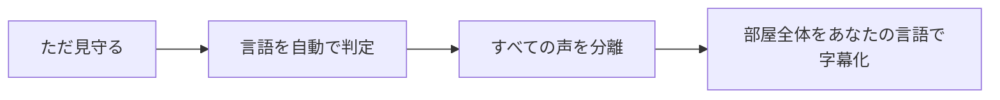
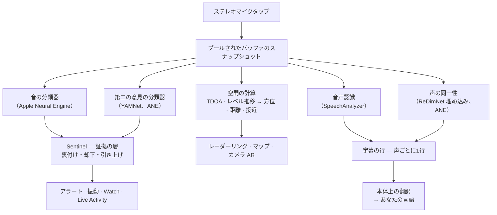
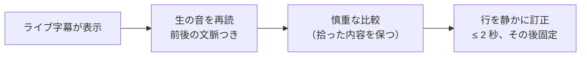
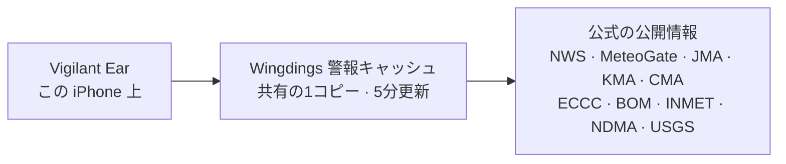

# Vigilant Ear 👂🛡️

*バージョン 1.1.5 · 2026年9月 時点。*

## 聞こえることには依存しない、音のレーダー。

ろう者・難聴者・中途失聴者・CODA のコミュニティ向けに作ったアプリです。多くの音認識アプリは「それが何の音か」を教えます。**Vigilant Ear は、どこにあるか、誰が発しているか、何を言っているかまで伝えます** — iPhone がまわりの音を説明し、方向つきで見せるリアルタイムの音響レーダーです。

サイレンの向きと距離。後ろのノック。会話の相手を、声ごとに分けた字幕として描き、それぞれに方向を付けます。読めない言語で話されていても、**あなたの言語に訳して**届けることができます。アラートは**ロック画面、Dynamic Island、Apple Watch** に届くので、一目で確認できます。

大切な処理はすべてこの iPhone の中で動きます。認識のために音を録音したりアップロードしたりしません。聞こえることには依存しません。

- 🧭 **検出だけではない。方向まで。** 「音がした」ではなく、*何が・どこで・誰が・何と言ったか*。
- 🔒 **はじめからプライベート。** 分類・字幕・翻訳はこの iPhone 上で動きます。字幕はライブで一時的なもの。アーカイブとして保存しません。
- ⌚ **手首とロック画面に。** Apple Watch の方向コンパニオンと Live Activity で、最後のアラートと来た向きを一目で確認できます。
- 🛰️ **複数の iPhone、ひとつの共有の耳。** Constellation は Ultra-Wideband 対応の iPhone をつなぎ、それぞれが拾った音を合わせて、より鋭い方向の絵にします。
- 👁️ **ろう者 / 難聴者 / CODA 向け。** はっきりした振動、高コントラストの表示、色だけに頼らない手がかり、大きなタップ領域、「視差効果を減らす」（Reduce Motion）への対応を全体で意識しています。

---

## こんな方へ

- まわりの音の状況を把握したい**ろう者・難聴者・中途失聴者・CODA の方** — Home Watch（ノック、アラーム、赤ちゃん、電話）と Street Watch（サイレン、接近）をオンにしたまま信頼して使えます。
- **方向と話者分離つきのライブ字幕**、または近くにいる人の**この iPhone 上での翻訳**が必要な方。
- 本体上での音源定位に関心のある、アクセシビリティや音響研究の方。

> Vigilant Ear はアクセシビリティの**支援ツール**であり、認定された生命安全装置ではありません。

---

## できること

### 🧭 音を見る — 方向と距離
iPhone のふたつのマイクで、Vigilant Ear は音の**角度と、前か後ろか**を測り、読み取りをだいたい1度の安定さで保ち、正面が上のレーダーリングとマップにライブのマーカーとして置きます。一直線上のふたつのマイクだけでは左右を自分では区別できません — 右50°の音と左50°の音は、同じわずかな時間差で届くためです。そのためアプリは読み取りに加え、**反対側に薄いゴースト**を描き、手首を回すか、もう一台の iPhone で確定します。距離は、道路で合わせた曲線に対する大きさから推定し、*≈ 50 ft* のように、推定であることとありそうな幅をそのまま示します。動いてもマーカーは現実の位置を保ちます。聞こえない世界の空間認識 — それが中心です。（数値は下にあります。）

### 🚨 大切な音を認識し、知らせる
本体上の分類器が日常の何百もの音を見分け、重要なカテゴリ — **サイレン、アラーム（専用のカーアラームクラスを含む）、ドアベル／ノック、赤ちゃんの泣き声、近くにいる人、悪天候** — を見守ります。どれかが発報すると、画面のはっきりしたアラート、任意の**プッシュ通知**、はっきりした**振動**が届きます。アプリが裏にいても、画面が消えていても同じです。重要なカテゴリは最初から用意されているので、通知をオンにしても「全部オフ」にはなりません。アラートのカテゴリをすべてオフにすると、裏にいるあいだエンジンは完全に休止してバッテリーを節約します。**Sentinel** 層が、方向・動き・公開情報など独立した証拠とアラートを照合するので、発報は単独の分類器の当て推量ではなく、裏付けのあるものになります。両方向に働きます。曲の中のサイレンっぽい一瞬は抑えられ、音楽の向こうで本物のサイレンが繰り返されると突き抜けて知らせます。

悪天候の警告は公式の公開情報から届きます — 米国 **NWS**、欧州 **MeteoGate**、**中国 CMA**、**韓国 KMA**、**日本 気象庁（JMA）**、**カナダ ECCC**、**オーストラリア BOM**、**ブラジル INMET**、**インド NDMA** — すべてのユーザーに無料です。情報は、いまいる場所をカバーするものに絞られます。日本では気象庁の**事前の解説情報**も読みます — 台風や大雨の何日も前に出る平易な文面で、危険が近づいてから出る警報だけではありません。急な大雨や土砂災害の情報も含みます。事前の案内は静かに表示し、本物の警報用に取ってある音と振動は使いません。

### ⌚ Apple Watch + Live Activity — 一目で分かる
- **Apple Watch コンパニオン** — アラートの向きが手首で指し示されるので、どこを見ればよいか一目で分かります。アプリの耳アイコン、脅威 HUD レイアウト、ダブルタップでアラートを閉じる機能を備えた、作り直した Watch UI。Watch アプリが開いていなくても、アラートに方向の矢印を出せます。
- **Live Activity** — Vigilant Ear は**ロック画面**、**Dynamic Island**、**Watch のスマートスタック**に残るので、最後のアラートとその向きをいつでも一目で確認できます。
- **パートナーのアラートも手首へ** — つながった Constellation パートナーの iPhone がアラートを出すと、向きつきであなたの Watch にも届きます。信頼性の見直しで、コンパニオンは一日中 Watch のバッテリーにやさしく動きます。

### 💬 Speaker Mode — 方向つきライブ字幕 *(無料)*
**Speaker Mode** をオンにすると、Vigilant Ear は近くで話している人を**声ごとにひとつの字幕ブロック**に文字起こしします。本体上の話者分離で声を分け、*誰*が*何*を言っているかを、内側リングの方向の手がかりとともに示します。いま話している人が強調され、古い文は必要に応じてスクロールして消えます。

多くの字幕アプリがやらないことがふたつあります。**信頼度の正直さ** — 行ごとのさりげない品質マークと、あやしい語の下の点線で、信じてよい行と確認した方がよい行が分かります。そして**自己訂正**：文が確定した直後に、前後の文脈つきで音をもう一度読み直し、聞き逃しや誤りを数秒以内に直してから、文を固定します。

字幕は無料。自動翻訳は任意の Power Pack+ の層です。字幕を **Bluetooth の補聴デバイスで読み上げる**こともできます — 無料、設定から。**Direction Tones**（これも無料、設定 → 字幕）は、選んだ耳側に短い音で話者の向きを知らせる任意の手がかりです。補聴器や片耳だけ聞こえる場合に役立ち、誰でも使えます。

### 🌐 話者の自動翻訳 — あなたの言語で、ライブ *(Power Pack+)*
Speaker Mode がオンのとき、近くの人が別の言語を話すと、Vigilant Ear はその言語を見つけ、字幕を**あなたの言語**で出し、元の言語をそのブロックに示せます。拾う → 話者を分ける → 文字起こし → 翻訳 → 表示、の流れは**この iPhone の中**で動きます。ネットを使うのは、Apple から言語パックを一度だけダウンロードするときだけです。相手の言語をあらかじめ知ったり選んだりする必要はありません。

SF の**万能翻訳機** — ただ理解してくれる装置 — に、いま出荷できるものでいちばん近いものです。Vigilant Ear は言語を自分で見つけ、部屋のすべての話者を追い、全員をあなたの言語で字幕化します。イヤホン不要、特別な設定不要、処理はこの iPhone 上です。

```mermaid
graph LR
    A["ただ見守る"] --> B["言語を自動で判定"] --> C["すべての声を分離"] --> D["部屋全体をあなたの言語で字幕化"]
```

### 🎵 音楽と放送の把握 *(Power Pack+)*
**ShazamKit** がまわりで流れている音楽を識別し、曲の切り替わりを追います。

### 🎛️ Acoustic Scope — エンジニアのように音を見る
まわりの音をプロ向けにライブ表示：スペクトラム、スペクトログラム、1/3オクターブ RTA バンド、クロマ、倍音。**すべての方に無料**です。自分用パックの学習のために音を収録するツールは Power Pack+ に含まれます。

### 📦 カスタムサウンドパック — あなたの世界を教える *(Power Pack+)*
身近な鳥の声から建物のドアチャイムまで、あなたに大切な音を Vigilant Ear に教えられます。追加パックは内蔵の検出の上に積むので、新しい音がサイレンやアラームを押しのけることはありません。手順ガイドはアプリ内にあります。

### 🛰️ Constellation — 複数の iPhone、ひとつの共有の耳 *(Power Pack+)*
Ultra-Wideband 対応の iPhone が2台以上あると（iPhone 11 以降のほとんど）、**Constellation** がそれらをつなぎ、互いの位置を感じ取り、それぞれが拾った音を合わせて、音がどこから来ているかの、より正確なひとつの絵にします — 分散した、受動的に音を拾う配列です。字幕も合わせます。各 iPhone が自分のマイクで拾った言葉を文字起こしし、端末間で揃えるので、話者にいちばん近い一台が聞いた内容が寄与します。一台だけが拾った言葉も、消さずに残します。iPhone どうしは**直接**つながります — ルーターも、同じ Wi-Fi ネットワークも、インターネットも不要です。Wi-Fi をオンにしておけば、AirDrop と同じピアツーピアのしくみで互いを見つけます。必要なハードウェアがある端末に限られます。相手がつながった時刻より古いメッシュ字幕は再送しません。

**パートナーメッセージ** — つながったパートナーの iPhone に短いテキストを送れます。相手の字幕の流れに入り、本体上で相手の言語に訳されて届くこともあります。メッセージは年齢に配慮しています。Apple の申告年齢範囲（Declared Age Range）に基づき、大人と未成年の間のテキストは、双方が意図的に相手に名前を付けない限りオフのままです。アラートと字幕が制限されることはありません — 制限されるのは人と人のテキストだけです。

### 🔗 Remote Link（リモートリンク）— そばにいない相手に届ける *(始める側は Power Pack+)*
ふつう電話が担うことを、映像と文字で行います。招待コードを送り、相手は Vigilant Ear アプリの中から参加します — **Power Pack+ を持っていなくても**構いません。Constellation と違い、近さが条件ではありません。お二人はどこにいても使えます。

**音声はいっさい使いません。** 映像と文字だけなので、どちらの側でも聞こえることには依存しません。アプリを通して手話でやり取りすることもできます。ただしアプリ自体が手話を理解するわけではありません。映像を運び、あとはお二人にお任せする形です。接続はネットワークが許すかぎりふたつの iPhone のあいだで直接つながり、アプリは**Direct（直接）**か **Relayed（中継）**かをはっきり示すので、映像が中継を通っているかどうかをいつでも確認できます。

### 📷 カメラ AR — 「音を見る」
タイトルレールのカメラボタンを開き、検出した音をライブカメラの実方位にピン留めします。マーカーは話者ごと、または音のカテゴリと方向ごとにまとまるので、画面は読みやすいままです。静かになると音源は時間とともに薄くなります。

### 🗺️ マップ、道路、経路予測
音の向きはマップ上の実際の GPS 座標に投影されます。車両の音は**近くの道路にスナップ**され、経路が予測されるので、通り過ぎるトラックは建物を突き抜けるのではなく、*道路に沿って*動いているように読めます。（消防車のデモを試してみてください。）

### 🪄 Feature Playground — 耳に頼らず確かめる
**Feature Playground** は誰でも公開されています。Home と Street の練習（ノック、アラーム、赤ちゃん、サイレン、天気）、複数台と会話のデモ、練習が本物の出来事に見えないような、はっきりした透かし。パネルを閉じるとデモはきれいに破棄されます（GPS のなりすましもフラグも残りません）。

### ♿ アクセシビリティ・ファースト
ろう者 / 難聴者 / CODA、および色覚多様性の方向け：**色だけに頼らない**手がかり、**44 pt 以上**のタップ領域、**「視差効果を減らす」（Reduce Motion）**への対応、マルチモーダルな知らせ（振動 + 画面 + Watch）、権限の状態を緑 / 灰色 / 赤（および許可されていないときの焦げたオレンジ）ではっきり示す起動時の確認画面 — マスターのアラートスイッチになる通知の許可も含みます。

---

## 無料と Power Pack+

安全のコアは**ずっと無料**です：

- **Home Watch と Street Watch** — 画面・振動・任意のプッシュによる、身近な音のアラート（アラーム、サイレン、ノック／ドアベル、赤ちゃん、近くにいる人）。
- **ライブ字幕** — Speaker Mode、本体上、ハードウェアが許すかぎり方向つき。信頼度の正直なマーク、約2秒の自己訂正、Bluetooth 補聴デバイスへの任意の読み上げ、Direction Tones。
- **Standing Watch（部屋の見守り）** — 部屋そのものの様子を、設定なしで常時オン。いつものパターンのあいだは安定したシアンのランプ、何かが変わると — 新しい声、突然の静けさ、近づいてくる何か — アンバー。
- **悪天候警報** — いまの地域向けに NWS、MeteoGate（欧州 — 当方の5分キャッシュから新しい情報を配信）、CMA、KMA、JMA（日本）、ECCC（カナダ）、BOM（オーストラリア）、INMET（ブラジル）、NDMA（インド）。
- **地震アラート（USGS、全世界）** — 近くで地震が報告されると振動で知らせ、揺れが感じられた地域をマップに出します。公式 USGS 情報による確認であり、**緊急地震速報ではありません**。揺れを感じたとき、それが何だったかを知らせます。本体上の深い揺れ（超低周波）の検知が、地面が動いた瞬間に確認を起動できます。
- **Feature Playground** — はっきりした PREVIEW 透かしつきの練習アラートと機能プレビュー。
- **Apple Watch コンパニオンと Live Activity** — 一目で分かる方向と最後のアラート。
- **Acoustic Scope** — プロ向けのライブ音響表示。すべての方に無料です。（学習用の収録ツールは Power Pack+。）

**Power Pack+** は一度きりの解除（**サブスクリプションではありません**）で、**90日間の無料トライアル**が付きます。次の力が加わります：

- **話者の自動翻訳** — 近くの話し声をあなたの言語に、本体上で翻訳。
- **Constellation** — Ultra-Wideband 経由の複数 iPhone で音を共有して拾うしくみ。パートナーメッセージつき。
- **音楽 ID** — ShazamKit による曲の認識。
- **カスタムサウンドパック** — 自分の音を学習させられる追加の分類器。

無料でも Power Pack+ でも、**認識のための音はこの iPhone の中にとどまります** — 変わるのはどの機能が使えるかだけで、分析のために生の音がどこへ送られるかが変わることはありません。

---

## 仕組み（舞台裏）

Vigilant Ear は**ローカル優先・本体上**のパイプラインで、層に分かれています。一度取り込み、独立した専門処理が同じ音を読み、互いの仕事を確かめます。生の音は高優先度のタップで取り込み、**プールされたバッファの空きリスト**（リアルタイム経路での割り当て荒れなし）にコピーし、UI を止めずに広げます：

```mermaid
graph TD
    A["ステレオマイクタップ"] --> B["プールされたバッファのスナップショット"]
    B --> C["音の分類器<br/>（Apple Neural Engine）"]
    B --> Y["第二の意見の分類器<br/>（YAMNet、ANE）"]
    C --> S["Sentinel — 証拠の層<br/>裏付け・却下・引き上げ"]
    Y --> S
    S --> H["アラート · 振動 · Watch · Live Activity"]
    B --> D["空間の計算<br/>TDOA · レベル推移 → 方位 · 距離 · 接近"]
    D --> R["レーダーリング · マップ · カメラ AR"]
    B --> F["音声認識<br/>（SpeechAnalyzer）"]
    B --> E["声の同一性<br/>（ReDimNet 埋め込み、ANE）"]
    F --> G["字幕の行 — 声ごとに1行"]
    E --> G
    G --> T["本体上の翻訳<br/>→ あなたの言語"]
```

ひとつのモデルだけを信じません。**Sentinel** 層が検出とアラートのあいだに座り、独立したエンジンがフレームごとに互いを裏付けたり却下したりします。却下に対して現実の証拠が積み重なると（音楽の向こうで本物のサイレンが鳴り続けるなど）、証拠が勝ち、アラートが発報します。

字幕にも第二のチャンスがあります。確定した文は、短いメモリ内の音リングから前後の文脈つきで静かに読み直されます。訂正はおよそ2秒以内に入り、その後文は固定されます：

```mermaid
graph LR
    L["ライブ字幕が表示"] --> K["生の音を再読<br/>前後の文脈つき"] --> V["慎重な比較<br/>（拾った内容を保つ）"] --> W["行を静かに訂正<br/>≤ 2 秒、その後固定"]
```

- **空間の計算** — FFT、コヒーレンス加重の到着時間差（TDOA — 両方のマイクが一致する周波数帯を優先し、わずかな到着の遅れを方位に変える）、レベル推移による接近の追跡をバックグラウンドで。マイク対は固定の向きで読むので、縦持ちでも横持ちでも方向の扱いは同じです。
- **音声** — iOS 26 の `SpeechAnalyzer` / `SpeechTranscriber` で文字起こし。声の同一性には **ReDimNet** 埋め込み。本体上の翻訳には Apple の **Translation** フレームワーク。声の同一性は証拠ベースです。独立した音の窓から実在の人だと確認されたときだけ名前を付け、あやしい一致は推測せず未帰属として出します。
- **音楽の真実** — クロマの**曲シグネチャ検出**が「本当に音楽が流れているか」を決めます。一般の分類器は静かな部屋やサイレンを「音楽」と呼びがちだからです。シグネチャが音楽だと認めたときだけ Shazam が動きます。
- **並行性** — Swift 6 の分離で、マイクのタップ、音響の計算、UI の描画ループをきれいに分けます。
- **効率** — ダウンサンプリング、負荷に応じた分類、証拠でゲートしたネット利用で、常時音を拾ったまま使える軽さに保ちます。

天気と地震の警報は、音とは逆の道です。あなたの音が外に出ることはありませんが、警報の*データ*は入ってきます。**すべての**公式情報は、当方が運用する小さなキャッシュを通ります。公開データを一度取れば全ユーザーに届き、この iPhone が外国政府のサーバーに直接つながることはありません：

```mermaid
graph LR
    P1["Vigilant Ear<br/>この iPhone 上"] --> W["Wingdings 警報キャッシュ<br/>共有の1コピー · 5分更新"]
    W --> N["公式の公開情報<br/>NWS · MeteoGate · JMA · KMA · CMA<br/>ECCC · BOM · INMET · NDMA · USGS"]
```

---

## この iPhone が拾えるもの — 実測

あなたの iPhone には、およそ6インチ離れたふたつのマイク、気圧計、とてもよい時計があります。それで、音がどちらから来たか、だいたいどれくらい遠いか、近づいているか、ドアが今開いたかが分かります。それぞれの精度、確かめ方、そして自分では音に気づけないときになぜ大事かを書きます。方向と関連の数字は、2026年9月に iPhone 17 と iPhone 16 Pro Max で測りました。距離は性質上あくまで推定です — 画面にもそう出します。

**方向 — 数度以内。** 音は上のマイクに下より先に届くか、後に届くか。その差から、iPhone の軸からどれだけずれ、前か後ろかを出します。ふたつのチャンネルは素のマイクではなく処理されたステレオ像で、部屋がうるさいと固有の固定パターンが乗ります。アプリは起動後の静かな数秒でそのパターンを学び、方向を読む前に取り除きます。

| 測ったこと | 結果 |
|---|---|
| 静かなオフィスから硬い壁の部屋（5 dB SNR）まで、96の模擬部屋での中央誤差 | 1.0° |
| 机上の iPhone 17、部屋の騒音あり、スピーカーが軸から30° | 側面基準で期待60°に対し読取61.7°、ゆらぎ1.6° |
| 同上、スピーカーが iPhone の真横 | 期待0°に対し読取4.5°、ゆらぎ2.2° |
| 同上、スピーカーが真正面 | すべての読取が最大遅延 — あるべき姿 |
| 音ではなく像の固有パターンに乗った読取 | どの角度でもなし |

*なぜ大事か：* サイレンに自分で気づけないとき、「後ろ、少し横」はどこを見るかを教えます。じっとしている読取は、メジャーで確かめて初めて信頼できます。これは二度確かめました。最初の確認が甘すぎたと分かったあとに、もう一度です。

**距離 — 推定であることをそのまま示す。** マイクひとつでは距離は測れず、大きさだけです。遠くのうるさいトラックは、近くの静かな車と同じ大きさに聞こえることがあります。アプリは道路で合わせた曲線で大きさから距離を推定し、慎重な人が言うように出します：*およそ50 ft、おそらく25から100のあいだ。*

| 測ったこと | 結果 |
|---|---|
| 校正を通して再生した実車の検出 | 1,131 |
| 実際にいた100フィート道路の内側に収まった割合 | 73% |
| 遠い車線の車 | メジャーが73 ftと85 ftのところを、78 ftと87 ftと推定 |

道路（市街の交差点）は車線ごとに測りました。曲線がずれるときは、近い側にずれます。校正は自動テストで固定し、静かにドリフトしないようにしています。煙感知器など自分の空間の中のアラームには距離を出しません — すでに同じ部屋にいるからです。

**動き — 近づいている。** 車やサイレンでは、だいたい大きくなると近づいています。アプリは数秒でのレベルの上がり方を見ます。約1.5 dB/秒の持続した上昇（はっきりした、安定した大きさの増加）なら接近、同じだけの下降なら遠ざかり、変化が止まると約4秒でどちらでもなくなる扱いです。一瞬の大きさ — クラクションのひと押し、ドアの閉まる音 — では発報しません。物理と9つの自動テストの上に組み立てています。録った道路の通過が次の現地確認です。

**部屋の空気 — ドアには形がある。** 気圧計はおよそ14フィート先のドアの開きに気づきます。ドアが開くと気圧が下がり、閉まると戻ります。静かな14時間と15回のドアで、すべてのドアがその二段の形を作り、家の中のほかのものは作りませんでした。

| 出来事 | 気圧の変化率 | 形 |
|---|---|---|
| 玄関の開閉、×10 | 0.6–1.8 Pa/s | 下がり、その後戻り、約5秒間隔 |
| 玄関の強い閉まり、×5 | 1.1–2.5 Pa/s | 同じ対、より高い |
| 夜間のエアコンのサイクル、×8 | 0.11–0.46 Pa/s | 数分にわたるゆるい傾斜、両機で同じ |
| 静かな部屋 | ~0.02 Pa/s | なし |
| 通り過ぎる、くしゃみ | — | モーションセンサーが気づき、iPhone は無視 |

部屋を密閉しない網戸は見えませんでした — そうあるべきです。いま気圧の変化はマップ上の低い振動として出せます。静かな夜向けの専用ドアアラートは測り、設計済みで、まだ日常の初期設定ではありません。

**Constellation — 二台で左右を確定。** メッシュ上の各 iPhone が、座っている位置から音へ線を引き、線がきれいに交わるのは片側だけです。交わるとゴーストが消え、アプリは再び左右を言えます。シミュレーションでは、**40メートル離れた**二台が、50メートル先のサイレンをおよそ2メートル以内に置きます。

**ここにある数字の信じ方。** どの数字も同じ三つの関門を、この順で通りました。答えが先に分かっている模擬の部屋。アプリをだます正確なケースを再現し、変更のたびに走る小さな自動テスト。そして机の上の実機と、手で測った距離。第三まで生き残るまで正確とは言いません。自分では音に気づけない人にとって、アプリの言葉が唯一の言葉です — 研究室がそうするように、稼ぎ取るべきものです。

エンジニア向けの詳しいメモ：[Physics](https://vigilantear.com/en/physics/) — TDOA、距離、動き、Constellation、気圧による検出。各数字に MEASURED / BENCHED / MODELLED のタグつき。

---

## プライバシー

- **コアの流れは常に本体上。** 分類、空間の計算、文字起こし、話者分離、翻訳は iPhone 上で動きます。認識のために生の音を録音したりアップロードしたりしません。
- **字幕は一時的。** ライブ字幕はセッション中メモリにあり、書き出したデバッグログに字幕の文は入りません。
- **広告や行動分析の SDK はありません。** 限られたネット利用は、マップ、公開の気象情報、任意の Shazam フィンガープリント、道路の文脈、App Store の購入だけです — 詳しくはポリシー全文を。

詳細: [PRIVACY.md](PRIVACY.md) · [TERMS.md](TERMS.md) · [SUPPORT.md](SUPPORT.md)

---

## ハードウェアとプラットフォーム

- **iPhone（フル体験）。** 縦でも横でも使えます — 好きな持ち方で。方向探知にはステレオマイクが必要です。**iPhone 13 以降**を推奨します。
- **Apple Watch。** 方向の矢印つきコンパニオンアラート。Live Activity / スマートスタックで動作します。
- **iPad（ネイティブ）。** 適応レイアウト：大画面ではライブ字幕がマップ横の透けたパネルになり、誰も話していないときは隠れます。単一チャンネルマイク → 完全な方向なしの字幕。
- **Constellation** には **Ultra-Wideband** が必要です — iPhone 11 以降（SE および「e」モデルを除く）。Wi-Fi **ネットワークは不要**です。Wi-Fi をオンにしておけば iPhone どうしが直接見つけ合うので、ルーターもインターネットもない場所でも、近くにあれば動きます。
- **Android。** コアのレーダー、アラート、字幕、天気を備えた別ビルド。Constellation メッシュは iOS が先です。Android の同等性が広がるにつれ、製品サイトの更新をご覧ください。

---

## ローカライズ

インターフェース、アラート、字幕は、**英語、スペイン語、ポルトガル語（ブラジル）、フランス語、ドイツ語、イタリア語、アラビア語、日本語、簡体字中国語、韓国語、ロシア語、ヒンディー語**（12言語）に完全対応しています。システムの言語、またはアプリ内の手動選択に従います。

---

## ステータスと免責事項

Vigilant Ear は**実験的な音響アクセシビリティ支援ツール**であり、認定された生命安全ユーティリティではありません。定位の解像度は周囲の環境、天候、風、マイクのハードウェアによって変わります。**いつもの環境への注意はそのまま続けてください** — 安全情報の唯一の源としてこれに頼らないでください。

一部の機能（カメラ AR マーカー、Apple が付与した場合の Critical Alerts 権限のアップグレード、高度なマルチパック音の作成）は進化を続けています。無料の Home / Street Watch とライブ字幕は、初日から信頼できる製品です。

---

**連絡先:** [vigilantear@wingdingssocial.com](mailto:vigilantear@wingdingssocial.com)

D/HH コミュニティと音響研究のために ❤️ を込めて作りました。

    
  <strong>© 2026 Wingdings, Inc.</strong> 
  All rights reserved. 
  Patent Pending

