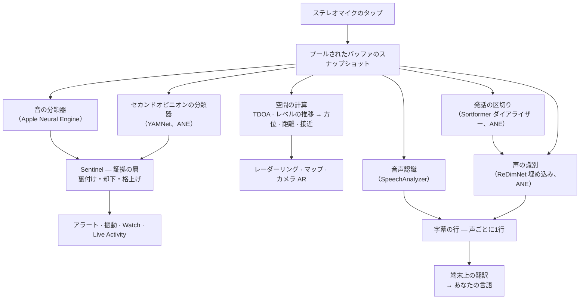
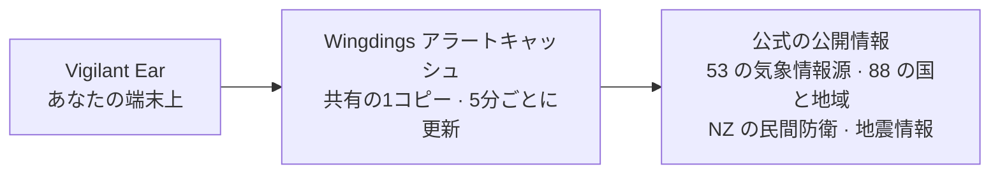

# Vigilant Ear 👂🛡️

*バージョン 1.1.9 · 2026年9月 時点の内容です。*

## 聞こえない人のための、音響レーダー。

ろう者・難聴者・CODA のコミュニティのために作られたアプリです。多くの音認識アプリは、その音が*何か*を教えてくれます。Vigilant Ear は、その音が**どこにあり、誰が出していて、何を言っているのか**を伝えます — iPhone を、まわりの音を説明してくれるリアルタイムの音響トリコーダーに変えるのです。

サイレンの方向と距離。背後のノック。会話に加わる人たちは、文字起こしされた別々の声として描き分けられます — 一人ひとりに字幕が付き、それぞれの方向に配置されます。あなたが読めない言語で誰かが話していても、その言葉を**あなたの言語に翻訳して**届けられます。アラートは**ロック画面、Dynamic Island、Apple Watch** に届くので、ひと目見るだけで十分です。

大切な処理はすべて端末上で動きます。認識のために音声を録音したりアップロードしたりすることはありません。何かが聞こえることに頼っている部分は、ひとつもありません。

- 🧭 **検出だけでなく、方向まで**。伝えるのは*何が・どこで・誰が*、そして*何と言ったか* — 単に「音がした」ということではありません。
- 📣 **名前呼び**。自分の名前、子どもやパートナーの名前を登録しておくと、「マリー様のご注文ができました」の一言で Watch がタップして知らせ、その方向を指し示します。
- 🔒 **設計段階からプライベート**。音の分類、字幕、翻訳はあなたの iPhone 上で動きます。字幕はその場かぎりのライブ表示で、文字起こしのアーカイブとして保存されることはありません。
- ⌚ **手首にも、ロック画面にも**。Apple Watch の方向コンパニオンと Live Activity で、直近のアラートと、それがどちらから来たのかを、いつでもひと目で確認できます。
- 🛰️ **複数の iPhone で、ひとつの耳を共有**。Constellation は Ultra-Wideband 対応の iPhone どうしをつなぎ、それぞれが聞いた音を統合して、より鮮明な方向の像を描きます。
- 👁️ **ろう者 / 難聴者 / CODA のために**。区別しやすい振動、高コントラストの表示、色に頼らない手がかり、大きなタップ領域を備え、全体を通して「視差効果を減らす」設定にも対応しています。

---

## こんな方のために

- 音の状況を把握したい**ろう者・難聴者・CODA のユーザー** — オンにしたまま信頼して任せられる Home Watch（ノック、アラーム、赤ちゃん、電話）と Street Watch（サイレン、接近）。
- **方向と話者の区別がついたライブ字幕**や、近くに座っている人の言葉の**端末上での翻訳**を必要とするすべての方。
- 端末上での音源定位に関心のある、アクセシビリティや音響研究の分野のユーザー。

> Vigilant Ear はアクセシビリティのための**補助ツール**であり、認定を受けた生命安全装置ではありません。

---

## できること

### 🧭 音が見える — 方向と距離
Vigilant Ear は iPhone の2つのマイクを使って**音の角度と、その音が前方か後方か**を測定し、読み取りのぶれを約1度に抑えて安定させ、向いている方向が上になるレーダーリングとマップ上に、ライブのマーカーとして表示します。一直線に並んだ2つのマイクだけでは、左右を区別できません — 右50°の音と左50°の音は、同じわずかな時間差で届くからです — そこでアプリは、読み取った方向に加えて**反対側に、より薄いゴースト**を描き、手首をひとひねりするか、もう1台の iPhone があれば、どちらなのかが確定します。距離は、実際の道路で校正した曲線に音の大きさを照らし合わせて推定し、推定値であることがわかる形で表示します。たとえば *≈ 50 ft* と、ありそうな範囲を添えて — 単位は、アプリを読んでいる言語ではなく、あなたが今いる国のものです。移動しても、マーカーは現実世界での位置を保ちます。これが核心です — 聞こえない世界を、空間として把握すること。（数値は後述します。）

### 🚨 大切な音を聞き分けて、知らせる
端末上の分類器が日常の何百種類もの音を識別し、重要なカテゴリを見守ります — **サイレン、アラーム（カーアラーム専用のクラスを含む）、ドアベル／ノック、赤ちゃんの泣き声、近くにいる人、そして悪天候**。いずれかが検出されると、画面上のはっきりしたアラート、任意の**プッシュ通知**、そして区別しやすい**振動**でお知らせします — アプリがバックグラウンドにあっても、iPhone がスリープ中でも。重要なカテゴリは最初から有効になっているので、通知をオンにしたのに「全部オフ」だった、ということにはなりません。アラートのカテゴリをすべてオフにすると、バックグラウンドではエンジンが完全に休止し、バッテリーを節約します。アラートは **Sentinel** 層が、方向、動き、公開情報といった独立した証拠と照合するので、発報されるのは裏付けのあるものであり、分類器ひとつの当て推量ではありません。これは両方向に働きます。曲の中のサイレンに似た一瞬は保留されますが、音楽の向こうで本物のサイレンが繰り返し鳴れば、それを突き抜けてアラートが出ます。

悪天候の警報は、**88 の国と地域をカバーする 53 の公式な政府情報源**から届きます — すべてのユーザーに無料です。ニュージーランドの民間防衛の緊急警報も含まれ、専用の「**緊急アラート**」スイッチで管理できます。情報源は、あなたが今いる場所をカバーするものに絞り込まれます。日本では、危険が到来してから出される警報だけでなく、国の気象機関の**事前の気象情報**も読み取ります — 台風や大雨の数日前に出される、平易な文章のお知らせです。さらに、記録的短時間大雨情報と土砂災害警戒情報も読み取ります。事前のお知らせは、本物の警報のためにとってある音と振動を使わずに、静かに表示されます。

### ⌚ Apple Watch + Live Activity — ひと目でわかる
- **Apple Watch コンパニオン** — アラートの方向が手首の上で示されるので、ひと目でどこを見ればよいかがわかります。アプリの耳のアイコン、脅威 HUD のレイアウト、ダブルタップでアラートを閉じる操作を備えた、新しいデザインの Watch UI。Watch アプリを開いていないときでも、アラートに方向の矢印を表示できます。
- **Live Activity** — Vigilant Ear は**ロック画面**と **Dynamic Island**、そして **Watch のスマートスタック**に表示され続けるので、直近のアラートとその方位を、いつでもひと目で確認できます。
- **パートナーのアラートも手首に** — つながっている Constellation パートナーの iPhone がアラートを出すと、方向も含めて、あなたの Watch にも届けられます。信頼性を見直したことで、コンパニオンは一日中、Watch のバッテリーに負担をかけずに動きます。

### 💬 Speaker Mode — 方向つきのライブ字幕 *（無料）*
**Speaker Mode** をオンにすると、Vigilant Ear は近くで話している人の言葉を**声ごとに1つずつの字幕ブロック**として文字起こしします。端末上の話者分離によって声が区別されるので*誰*が*何*を言っているのかがわかり、内側のリングには方向の手がかりも表示されます。いま話している人が強調表示され、古いテキストはスペースが必要になると流れて消えていきます。

多くの字幕アプリがやらないことが2つあります。1つは**信頼度についての正直さ** — 行ごとの控えめな品質マークと、あやしい語の下に引かれる点線が、どの行なら信じてよく、どこを確かめ直すべきかを教えてくれます。もう1つは**自己修正**です。文が確定した直後に、アプリは前後の文脈をすべて踏まえて音声を読み直し、聞き逃した語や聞き違えた語を2秒ほどで直すことができ、その後テキストは固定されます。

**名前呼び**（設定にあり、オンにするまではオフ）は、あなたが登録した名前 — 自分、子ども、パートナーの名前 — が字幕に出てこないかを見張ります。誰かが「マリー様のご注文ができました」と言うと、字幕の吹き出しがもう1つ増えるのではなく、区別しやすい振動と、方向つきの Watch アラートでお知らせします。言葉そのものは、Speaker Mode に発話としてそのまま表示されます。これは、相手が*あなたに*話しかけていたことを知らせるタップです。

**不適切な言葉は伏せ字にできます**（設定 → 字幕）。そうしなければ、罵り言葉は和らげるものもなく、そのまま文字として届き、読む人には先に目をそらす余地がありません。これをオンにすると、それらの語は記号に置き換えられ、その語がなくても文として読めます。何が対象になるかを決めるのは、私たちが用意した単語リストではなく、端末自身の音声認識です。そのため、文字起こしされている言語にそのまま対応します。18歳未満と申告されたアカウントでは常にオンになり、錠のマークが表示されます。対象になるのは*この*端末が文字起こしする音声です。ペアリングしたもう1台から中継されたテキストは、そちらで文字起こしされたもので、完成したテキストとして届きます。

**話し手が力を込めた語は、太字で示されます**。声に出して言えば、「I didn't say THAT」と「I didn't say that」はまったく別の文ですが、同じ文字起こしになってしまえば、その違いは完全に失われます。アプリは、話し手の声の高さが持ち上がった1語を見つけて太字にします — 1行につき最大1語、確信が持てないときは何も付けません。違う語を強調すれば、その人が言ってもいないことを言わせることになるからです。中国語と日本語ではオフです。これらの言語では、声の高さが伝えるのは*どの語なのか*であって、どれだけ強く言ったかではないからです。

字幕は無料です。自動翻訳は、オプションの Power Pack+ で加わる機能です。字幕は **Bluetooth のヒアリングデバイスで読み上げる**こともできます — 無料で、設定から使えます。「**方向トーン**」（これも無料、設定 → 字幕）は、選んだ側の耳に任意の音の合図を加え、話し手がどこにいるかを知らせます — 補聴器を使っている場合や、片耳だけが聞こえる場合に役立ち、誰でも使えます。

### 🌐 自動翻訳 — あなたの言語で、その場で *（Power Pack+）*
Speaker Mode がオンのとき、近くの人が別の言語を話すと、Vigilant Ear はそれを検出して、その人の字幕を**あなたの言語で**表示できます。その人のブロックには元の言語が示されます。聞く → 話者を分ける → 文字起こし → 翻訳 → 表示、という一連の流れは**端末上で**動きます。ネットワークを使うのは Apple から言語パックを一度ダウンロードするときだけで、そのダウンロード待ちのときは、翻訳されていないテキストを見せたままにせず、アプリがそう知らせます。相手の言語を前もって知っている必要も、選んでおく必要もありません。

これは、実際に出荷されている製品の中で **SF の万能翻訳機**にもっとも近いものです — ただ理解してくれる、あの装置です。Vigilant Ear は言語を自分で判別し、部屋にいるすべての話し手を追いかけ、全員の言葉をあなたの言語で字幕にします — イヤホンも設定も不要で、あなたの端末上で。

```mermaid
graph LR
    A["ただ聞き取るだけ"] --> B["言語を自動で判別"] --> C["すべての声を分離"] --> D["部屋全体をあなたの言語で字幕に"]
```

### 🎵 音楽と放送の把握 *（Power Pack+）*
**ShazamKit** が、まわりで流れている音楽を識別し、曲の切り替わりを追跡します。

### 🎛️ Acoustic Scope — エンジニアのように音を見る
まわりの音を、プロ仕様のビューでライブ表示します。スペクトラム、スペクトログラム、⅓オクターブ RTA バンド、クロマ、倍音 — **すべての人に無料**です。「倍音」表示は**音楽を読み取ります**。それぞれの音には音名が付き、その横に倍音列が並びます。火災報知器のような高い音も本来の高さの音名で示され、目標の音を設定すると線として表示されるので、それに合わせて歌ったりチューニングしたりできます。動作は軽く、スペクトログラムを開いたままにしても、どれだけ長く見ていても、負荷はほとんどかかりません。自分だけのカスタムサウンドパックを学習させるために音を収録するツールは、Power Pack+ に含まれます。

### 📦 カスタムサウンドパック — あなたの世界を教える *（Power Pack+）*
近所の鳥の声から建物のドアチャイムまで、あなたにとって大切な音を Vigilant Ear に教えられます。追加パックは内蔵の検出の上に重ねて動くので、新しい音がサイレンやアラームを押しのけることは決してありません。手順を追って進められるガイドが、アプリに組み込まれています。

### 🛰️ Constellation — 複数の iPhone で、ひとつの耳を共有 *（Power Pack+）*
**Constellation** は、Ultra-Wideband 対応の iPhone が2台以上あるとき（iPhone 11 以降のほとんどの機種）、それらをペアリングして互いの位置を感知できるようにし、それぞれが聞いた音を統合して、音がどこから来ているのかを1つのより精密な像にまとめます — 分散型の、受動的なリスニングアレイです。字幕も統合されます。各 iPhone は自分のマイクが聞いた内容を文字起こしし、その言葉を端末間で揃えるので、話し手にいちばん近い1台が聞いた内容が生かされます — 1台だけが拾った言葉も、失われずに残ります。iPhone どうしは**互いに直接**つながります — ルーターも、共有の Wi-Fi ネットワークも、インターネットも不要です。Wi-Fi がオンになってさえいればよく、AirDrop と同じピアツーピアの接続を使います。必要なハードウェアを備えた端末に限られます。相手が接続した時刻より古いメッシュ字幕は、再送されません。

**パートナーメッセージ** — つながっているパートナーの iPhone に短いテキストを送れます。メッセージは相手の字幕の流れに表示され、端末上で相手の言語に翻訳されて届くこともあります。メッセージ機能は年齢に配慮しています。Apple の Declared Age Range に基づき、大人と未成年のあいだのテキストのやり取りは、双方が意図して互いに名前を付けていないかぎりオフのままです。アラートと字幕が制限されることは決してありません — 制限されるのは、人と人とのテキストのやり取りだけです。

### 🔗 Remote Link — そばにいない相手とつながる *（開始には Power Pack+）*
ふだんなら電話が担う役割を、映像とテキストで果たします。あなたが招待コードを送ると、相手は **Power Pack+ を持っていなくても** Vigilant Ear の中から参加できます。Constellation と違って、近くにいる必要はありません — お二人がどこにいても使えます。

**音声はどの時点でもいっさい使いません**。映像とテキストだけなので、リンクのどの部分も、どちらの側でも聞こえることに依存しません — そして、アプリを通して誰かと手話で話す手段にもなります。アプリ自体が手話を理解するわけではありません。アプリが映像を運び、あとはお二人で行います。ネットワークが許すかぎり、接続は2台の iPhone のあいだで直接つながります。アプリはそれが「**直接**」か「**中継**」かをはっきり表示するので、映像が中継を経由しているかどうかを、いつでも把握できます。

**字幕も届きます**。それぞれの iPhone が文字起こしした内容は相手の画面に表示され、必要なときは読む人の言語に翻訳されます。どちらからでも、リンク（映像と字幕）を一時停止したり再開したりでき、メイン画面からリンクを終了できます。

### 📷 カメラ AR — 「音を見る」
タイトルレールのカメラボタンを開くと、検出された音を、ライブのカメラ映像の中の実際の方位にピン留めできます。マーカーは話し手ごと、または音のカテゴリと方向ごとにまとまるので、画面は見やすいままです。音源は静かになると、時間とともに薄れていきます。

### 🗺️ マップ、道路、経路予測
音の方位は、マップ上の実際の GPS 座標に投影されます。車両の音は**近くの道路にスナップ**させて経路を予測できるので、通り過ぎるトラックは、建物を突き抜けるのではなく*道路に沿って*動いているように表示されます。（消防車のデモを試してみてください。）

### 🪄 Feature Playground — 耳を使わずに確かめる
**Feature Playground** は、すべての人に公開されています。「自宅と外出」の練習（ノック、アラーム、赤ちゃん、サイレン、天気）、複数台の iPhone や会話のデモがあり、練習が決して本物の出来事を装わないよう、はっきりした透かしが入ります。パネルを閉じると、デモはきれいに片付けられます（GPS の偽装が残ったままになったり、フラグが残ったりしません）。

### ♿ アクセシビリティを第一に
ろう者 / 難聴者 / CODA、そして色覚特性のある方のために作られています。手がかりは**色に頼らず**、タップ領域は**44 pt 以上**、「**視差効果を減らす**」設定を尊重し、アラビア語の読者には**右から左へのレイアウト**を用意しています。アラートはマルチモーダル（振動 + 画面表示 + Watch）で、起動時の確認画面では、権限の状態がはっきりした緑 / グレー / 赤（「許可されていない」はバーントオレンジ）で示されます — アラート全体のマスタースイッチとなる通知の許可も含めて。

---

## 無料版と Power Pack+

安全のための中核機能は**ずっと無料**です：

- **Home Watch と Street Watch** — 身近な音のアラート（アラーム、サイレン、ノック／ドアベル、赤ちゃん、近くにいる人）を、画面表示、振動、任意のプッシュ通知でお届けします。
- **ライブ字幕** — Speaker Mode。端末上で動作し、ハードウェアが対応していれば方向つき。正直な信頼度マーク、約2秒の自己修正、Bluetooth のヒアリングデバイスへの任意の読み上げ、方向トーンを備えています。
- **名前呼び** — 自分で入力する任意の名前（自分、子ども、パートナー）。一致すると、字幕がもう1つ増えるのではなく、方位つきの Watch / iPhone のアラートでお知らせします。
- **Standing Watch** — 部屋そのものの状態を、設定なしで常に見守ります。部屋がいつものパターンを保っているあいだはシアンのランプが点灯し続け、何かが変わると — 新しい声、急な静けさ、何かの接近 — 琥珀色になります。
- **悪天候アラート** — あなたの地域に応じて、88 の国と地域の 53 の政府情報源から公式の警報が届きます。
- **地震アラート（全世界）** — 近くで地震が報告されると、振動で知らせ、揺れを感じた地域をマップに表示します。公式の地震フィードによる確認であり、緊急地震速報ではありません。揺れを感じたときに、それが何だったのかを教えてくれるものです。端末上での低い振動（超低周波音）の検知によって、地面が動いたその瞬間に確認を始められます。
- **Feature Playground** — はっきりした「プレビュー」の透かしが入った、練習用アラートと機能のプレビュー。
- **Apple Watch コンパニオンと Live Activity** — ひと目でわかる方向と、直近のアラート。
- **Acoustic Scope** — プロ仕様のライブ音響ビジュアライゼーション。すべての人に無料です。（学習用の収録ツールは Power Pack+ です。）

**Power Pack+** は **90日間の無料トライアル**が付いた、一度きりのアンロック（**サブスクリプションではありません**）です。次のようなスーパーパワーが加わります：

- **自動翻訳** — 近くの人の話し言葉を、端末上であなたの言語に翻訳します。
- **Constellation** — Ultra-Wideband による、複数の iPhone での聴覚の共有。パートナーメッセージつき。
- **Music ID** — ShazamKit による曲の認識。
- **カスタムサウンドパック** — あなた自身の音のために、自分で学習させる追加の分類器。

無料版でも Power Pack+ でも**認識のための音声は端末の中にとどまります** — プランによって変わるのは使える機能だけで、分析のために生の音声が送られる先が変わることは決してありません。

---

## 仕組み（舞台裏）

Vigilant Ear は、層を重ねて作られた**ローカル優先・端末上**のパイプラインです。音の取り込みは一度だけで、あとは独立した専門処理が同じ音を読み取り、互いの仕事を確かめ合います。生の音声は優先度の高いタップで取り込まれて**プールされたバッファのフリーリスト**にコピーされ（リアルタイム経路でのメモリ割り当ての乱発はありません）、UI を止めることなく各処理へ分配されます：

```mermaid
graph TD
    A["ステレオマイクのタップ"] --> B["プールされたバッファのスナップショット"]
    B --> C["音の分類器<br/>（Apple Neural Engine）"]
    B --> Y["セカンドオピニオンの分類器<br/>（YAMNet、ANE）"]
    C --> S["Sentinel — 証拠の層<br/>裏付け・却下・格上げ"]
    Y --> S
    S --> H["アラート · 振動 · Watch · Live Activity"]
    B --> D["空間の計算<br/>TDOA · レベルの推移 → 方位 · 距離 · 接近"]
    D --> R["レーダーリング · マップ · カメラ AR"]
    B --> F["音声認識<br/>（SpeechAnalyzer）"]
    B --> N["発話の区切り<br/>（Sortformer ダイアライザー、ANE）"]
    N --> E["声の識別<br/>（ReDimNet 埋め込み、ANE）"]
    B --> E
    F --> G["字幕の行 — 声ごとに1行"]
    E --> G
    G --> T["端末上の翻訳<br/>→ あなたの言語"]
```

どのモデルも、単独では信頼されません。検出とアラートのあいだには **Sentinel** 層があり、独立したエンジンがフレームごとに互いを裏付けたり却下したりします — そして、却下に反する現実の証拠が繰り返し積み重なったときは（音楽の向こうで本物のサイレンが鳴り続けているときなど）、証拠が勝ち、アラートが発報されます。

字幕にも、独自のやり直しのチャンスがあります。確定した文はどれも、メモリ内の短い音声リングから前後の文脈をすべて踏まえて静かに読み直されます — 修正はおよそ2秒以内に反映され、その後テキストは完全に固定されます：

```mermaid
graph LR
    L["ライブ字幕が表示される"] --> K["生の音声を読み直す<br/>前後の文脈をすべて踏まえて"] --> V["慎重な比較<br/>（聞き取った内容を守る）"] --> W["行を静かに修正<br/>≤ 2 s、その後は固定"]
```

- **空間の計算** — FFT、コヒーレンスで重み付けした到達時間差（TDOA — 両方のマイクの結果が一致する周波数帯を優先し、わずかな到達の遅れを方位に変換します）、そしてレベルの推移による接近の追跡を、バックグラウンドのタスクで行います。マイクの組は固定された向きで読み取るので、iPhone を縦に持っても横に持っても、方向は同じように機能します。
- **音声** — 文字起こしには iOS 26 の `SpeechAnalyzer` / `SpeechTranscriber`、端末上の翻訳には Apple の **Translation** フレームワークを使います。声の識別は証拠に基づいています。声は、独立した複数の音の区間からのみ実在の人物として確認され、一致が不確かなときは、間違った名前を推測するのではなく、未特定として表示されます。
- **2つの問いに、2つのモデル** — 声を聞き分けるには*話し手がいつ替わったか*と*その話し手が誰か*を知る必要があり、この2つは同じ問題ではありません。発話の区切りを付けるのは **Sortformer** のストリーミング話者分離で、それぞれの区間の中にある声が誰のものかを決めるのは **ReDimNet** の埋め込みです。区切りどおりに切ることは、思った以上に重要です。2人にまたがる区間には2人ともが含まれてしまい、どんな埋め込みモデルも後からそれを取り消すことはできません。その両方の下には音声区間検出の土台があり、難しい部屋でダイアライザーが推測せずに黙り込んでも、発話は区切られます。そのためアプリは、2人の話し手を1人に混ぜてしまうのではなく、精度を落としながらも動作を続けます。
- **音楽の真実** — 「本当に音楽が流れているのか？」の判断は、クロマの**曲シグネチャ検出器**が受け持ちます。一般的な分類器は、静かな部屋やサイレンを「音楽」と判定してしまうことでよく知られているからです。Shazam が動くのは、シグネチャが「たしかに音楽がある」と認めたときだけです。
- **並行処理** — Swift 6 の分離（isolation）によって、マイクのタップ、音響の計算、UI の描画ループがきれいに分けられています。
- **効率** — ダウンサンプリング、負荷に応じた分類、証拠に基づいてゲートされたネットワーク利用によって、常時の聞き取りを、オンのままにしておけるほど軽く保っています。

天気と地震のアラートは、音声とは逆の道をたどります — あなたの音が外に出ることは一切ありませんが、アラートの*データ*は入ってきます。公式の情報源は**すべて**当社が運用する小さなキャッシュを通るので、公開データを一度取得すればすべてのユーザーに届けられます — そして、あなたの iPhone が外国政府のサーバーに接続することは決してありません：

```mermaid
graph LR
    P1["Vigilant Ear<br/>あなたの端末上"] --> W["Wingdings アラートキャッシュ<br/>共有の1コピー · 5分ごとに更新"]
    W --> N["公式の公開情報<br/>53 の気象情報源 · 88 の国と地域<br/>NZ の民間防衛 · 地震情報"]
```

---

## あなたの iPhone に聞こえるもの — 実測

あなたの iPhone には、約6インチ離れた2つのマイクと、気圧計、そしてとても正確な時計があります。それだけで、音がどちらから来ているのか、だいたいどのくらい離れているのか、近づいてきているのか、そしてドアがたった今開いたのかがわかります。ここでは、それぞれの精度と、その確かめ方、そして自分ではその音が聞こえない場合になぜそれが重要なのかを説明します。方向とその関連の数値は、2026年9月に iPhone 17 と iPhone 16 Pro Max で測定しました。距離は性質上、推定値にとどまります — 画面上でもそう明示しています。

**方向 — 誤差は2度ほど**。音は上のマイクに下のマイクより先に届くか、あとに届くかのどちらかで、その差からアプリは、音が iPhone の軸からどれだけずれているのか、そして前方なのか後方なのかを割り出します。iPhone の2つのチャンネルは素のマイクではなく、処理されたステレオ像であり、部屋が騒がしいときには、その像に固有の決まったパターンが加わります。アプリは現在、起動後の静かな数秒間でそのパターンを学習し、方向を読み取る前に取り除いています。

| 測定した項目 | 結果 |
|---|---|
| 静かなオフィスから 5 dB SNR の硬い壁の部屋まで、96 の模擬的な部屋での誤差の中央値 | 1.0° |
| 机の上の iPhone 17、部屋の騒音あり、スピーカーは軸から 30° | 側面の平面から 61.7° と読み取り（期待値は 60°）、揺らぎは 1.6° |
| 同じ条件で、スピーカーを iPhone の真横に置いた場合 | 4.5° と読み取り（期待値は 0°）、揺らぎは 2.2° |
| 同じ条件で、スピーカーを真正面に置いた場合 | すべての読み取りが最大遅延 — 本来そうなるべきとおり |
| 音ではなく、像そのもののパターンを拾ってしまった読み取り | どの角度でもなし |

*なぜ重要か*：サイレンが聞こえないとき、「後ろの、片側寄り」という情報があれば、どこを見ればよいかがわかります。安定した読み取りも、巻尺で確かめてはじめて信頼に値します。この読み取りは2回確かめました。2回目は、1回目の確認が甘すぎたとわかったあとに行ったものです。

**距離 — 推定値であることをそのまま示します**。マイク1つでは距離は測れず、測れるのは音の大きさだけです。遠くの大きなトラックが、近くの静かな車のように聞こえることもあります。アプリは、実際の道路で当てはめた曲線を使って音の大きさから距離を推定し、慎重な人ならこう言うだろう、という形で示します — *約50 ft、おそらく25から100のあいだ*。

| 測定した項目 | 結果 |
|---|---|
| 校正に通して再生した、実際の車の検出 | 1,131 |
| 実際に走っていた100フィートの道路の範囲内に収まったもの | 73% |
| 遠い車線の車 | 巻尺で 73 ft と 85 ft のところを、78 ft と 87 ft と推定 |

その道路（市街地の交差点）は、車線ごとに測定しました。曲線が外れるときは、近い側に外れます。校正は自動テストで固定されているので、知らないうちにずれていくことはありません。火災報知器のような、あなた自身の空間の中にあるアラームには、距離の数値は一切表示しません — それらはすでに、あなたと同じ部屋にあるからです。

**動き — こちらへ近づいてくる音**。車やサイレンの場合、音が大きくなるのは、たいてい近づいているということです。アプリは、音のレベルが数秒のあいだにどれだけ速く上がるかを見ています。毎秒約1.5 dBの上昇（はっきりとした、安定した音量の増加）が続けば接近中、同じだけの下降なら遠ざかっていると判断し、変化しなくなった音は、約4秒後にどちらとも呼ばれなくなります。一瞬の大きな音 — クラクションを軽く鳴らす音や、ドアをバタンと閉める音 — では判定は起こりません。物理と9つの自動テストに基づいて作られており、実際の道路で車が通り過ぎる様子を録音して確かめることが、次の現地確認です。

**部屋の空気 — ドアには固有のサインがある**。気圧計は、約14フィート離れたドアが開くのに気づくことができます。ドアが動くときに気圧が下がり、閉まるときに戻るのです。静かな14時間と15回のドアの出来事を通して、すべてのドアがこの2段階の形を描き、家の中のほかのものは、どれもこの形を描きませんでした。

| 出来事 | 気圧の変化率 | 形 |
|---|---|---|
| 玄関ドアの開閉、×10 | 0.6–1.8 Pa/s | 下がってから戻る、間隔は ~5 s |
| 玄関ドアを強く閉める、×5 | 1.1–2.5 Pa/s | 同じ組み合わせで、より大きい |
| 夜間のエアコンの運転サイクル、×8 | 0.11–0.46 Pa/s | 数分かけてゆっくり変化、2台の iPhone で同一 |
| 静かな部屋 | ~0.02 Pa/s | 何もなし |
| そばを歩く、くしゃみをする | — | モーションセンサーが検知し、iPhone はそれを無視 |

部屋を密閉しない網戸は、まったく検出されませんでした — まさにそうあるべきとおりです。現在、気圧の変化はマップ上で低い振動として表示されることがあります。静かな夜のための専用のドアアラートは、測定と設計を終えていますが、まだ日常の初期設定にはなっていません。

**Constellation — 2台で左右が決まる**。メッシュ上の各 iPhone は、自分のいる位置から音に向かって線を引き、その線がきれいに交わるのは片側だけです。交わるとゴーストが消え、アプリは再び左右を示せるようになります。シミュレーションでは、互いに**40メートル離れた**2台の iPhone が、50メートル先のサイレンの位置を約2メートル以内の精度で特定します。

**ここにある数値が信頼を得るまで**。どの数値も、同じ3つの関門を、この順番で通過しました。まず、答えがあらかじめわかっている模擬的な部屋。次に、アプリをだますような状況をそのまま再現し、変更のたびに実行される小さな自動テスト。そして、実際の机の上に置いた実際の iPhone と、手で測った距離。3つ目を通過するまでは、何ひとつ正確とはみなしません。その音が聞こえない人にとって、アプリの言葉が唯一の言葉です — だからこそ、研究室がそうするように、信頼は勝ち取られるべきものなのです。

エンジニア向けの詳しい解説：[物理](https://vigilantear.com/en/physics/)（英語） — TDOA、距離、動き、Constellation、気圧による検出について、すべての数値に MEASURED / BENCHED / MODELLED のタグを付けて説明しています。

---

## プライバシー

- **中核の処理は、常に端末上で**。音の分類、空間の計算、文字起こし、話者分離、翻訳は、あなたの iPhone 上で動きます。認識のために生の音声を録音したりアップロードしたりすることはありません。
- **字幕はその場かぎり**。ライブ字幕はセッションのあいだメモリ上にあるだけで、書き出したデバッグログに字幕のテキストは含まれません。
- **広告や行動分析の SDK はありません**。ネットワークの利用は限られており、マップ、公開の気象情報、任意の Shazam フィンガープリント、道路のコンテキスト、App Store での購入のためだけです — 詳しくはポリシー全文をご覧ください。

詳細：[プライバシーポリシー](/ja/privacy/) · [利用規約](/ja/terms/) · [サポート](/ja/support/)

---

## ハードウェアとプラットフォーム

- **iPhone（すべての機能）**。縦向きでも横向きでも使えます — 好きなように持ってください。方向の特定にはステレオマイクが必要です。推奨は **iPhone 13 以降**です。
- **Apple Watch**。方向の矢印つきのコンパニオンアラート。Live Activity / スマートスタックと連携します。
- **iPad（ネイティブ）**。画面に合わせたレイアウト：大きな画面では、ライブ字幕がマップの横の透けるパネルに表示され、誰も話していないときはしまわれます。シングルチャンネルのマイク → 完全な方向表示のない字幕。
- **Constellation** には **Ultra-Wideband** が必要です — iPhone 11 以降（SE および「e」モデルを除く）。Wi-Fi ネットワークは**必要ありません**。Wi-Fi をオンにしておけば iPhone どうしが直接見つけ合うので、iPhone が互いに近くにあるかぎり、ルーターもインターネットもなしで Constellation が動作します。
- **Android**。コアのレーダー、アラート、字幕、天気を備えた別のビルドです。Constellation のメッシュは iOS が先行しています。Android での機能の同等化が進むにつれ、製品サイトの更新情報をご確認ください。

---

## ローカライズ

**英語、スペイン語、ポルトガル語（ブラジル）、フランス語、ドイツ語、イタリア語、トルコ語、アラビア語、日本語、簡体字中国語、繁体字中国語、韓国語、ロシア語、ヒンディー語、ルーマニア語**（15言語）に、インターフェース、アラート、字幕のすべてが完全にローカライズされています。システムの言語設定、またはアプリ内での手動の選択に従います。ルーマニア語の字幕は端末上で動作しますが、Apple Translate にはルーマニア語がないため、この言語では自動翻訳は原文を表示します。

---

## ステータスと免責事項

Vigilant Ear は**実験的な音響アクセシビリティ支援ツール**であり、認定を受けた生命安全のためのユーティリティではありません。定位の分解能は、周囲の環境、天候、風、マイクのハードウェアによって変わります。周囲への**ふだんどおりの注意を、常に保ってください** — 安全に関する情報源として、これだけに頼らないでください。

一部の機能（カメラ AR のマーカー、Apple から付与された場合の「重大な通知」権限へのアップグレード、高度なマルチパックのサウンド作成）は、引き続き進化しています。無料の Home / Street Watch とライブ字幕は、初日から信頼できる製品です。

**情報源とライセンス:** [api.vigilantear.com/sources](https://api.vigilantear.com/sources)

---

**お問い合わせ**：[vigilantear@wingdingssocial.com](mailto:vigilantear@wingdingssocial.com)

ろう者・難聴者（D/HH）のコミュニティと音響研究のために、❤️ を込めて作りました。

    
  <strong>© 2026 Wingdings, Inc.</strong> 
  All rights reserved. 
  特許出願中

