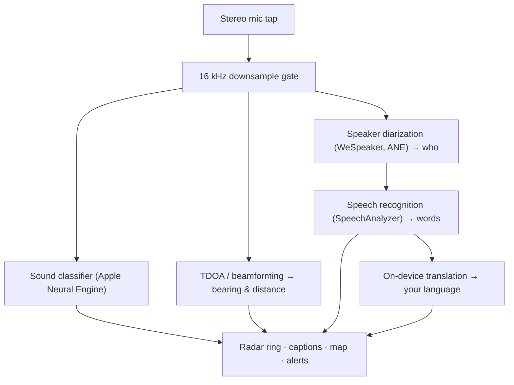

# Vigilant Ear 👂🛡️ (Apple Edition)

*소리를 들을 수 없는 사람들을 위한 음향 레이더.*

농인/난청인(Deaf/HH) 커뮤니티를 위해 특별히 만든 앱입니다! 대부분의 소리 인식 앱은 그 소리가 *무엇*인지 알려줍니다. **Vigilant Ear는 소리가 어디에 있는지, 누가 내는 소리인지, 무슨 말을 하고 있는지 알려줍니다** — iPhone을 실시간 소닉 트라이코더로 바꾸어 주변의 소리를 시각적으로 표현해 줍니다.

사이렌의 방향과 거리. 등 뒤에서 들리는 노크. 대화 중인 사람들을 화자별로 분리된 음성으로 표시 — 각 사람의 말이 자막으로 표시되고 화자별로 방향이 표시됩니다. 상대방이 읽을 수 없는 언어로 말하고 있다면 그 말은 **여러분의 언어로 번역되어** 도착합니다.

모든 처리는 기기에서 이루어집니다. 어떤 것도 녹음되거나, 저장되거나, 어디로도 전송되지 않습니다.

- 🧭 **감지를 넘어, 방향까지.** 대부분의 앱은 소리가 *무엇*인지 알려줍니다 — Vigilant Ear는 소리가 *어디에* 있는지, *누가* 내는지, *무슨 말을 하는지* 보여줍니다.
- 🔒 **설계부터 프라이버시 중심.** 모든 인식, 자막, 번역이 사용자의 iPhone에서 이루어집니다. 어떤 것도 녹음되거나 어디로도 전송되지 않습니다.
- 🛰️ **여러 대의 폰, 하나의 공유된 귀.** Constellation은 Ultra-Wideband iPhone들을 연결하여 각 기기가 듣는 소리를 융합해 더 선명한 방향 정보를 만들어 냅니다.
- 🔋 **배터리 부담 최소화.** 유휴 상태에서는 절전 모드로 전환되는 상시 청취 모드 — 계속 켜 두어도 될 만큼 가볍게 설계되었습니다.
- 👁️ **농인/난청인(Deaf/HoH) 커뮤니티를 위한 설계.** 햅틱, 고대비 시각 효과, 색상에 의존하지 않는 신호를 전반에 적용했습니다.

---

## 이런 분들을 위한 앱입니다

- 단순히 "소리가 났다"가 아니라 *무엇이, 어디서, 누가, 무슨 말을 했는지*까지 — 소리에 대한 상황 인식을 원하는 **농인 및 난청인 사용자**.
- **방향과 화자 분리가 포함된 실시간 자막**이나, 곁에 있는 친구의 말을 **기기에서 바로 번역**하는 기능이 필요한 모든 분.
- 온디바이스 소리 위치 추적에 관심 있는 음향 연구 및 접근성 분야의 탐구자.

> Vigilant Ear는 접근성 **보조 도구**이며, 인증된 인명 안전 장치가 아닙니다.

---

## 주요 기능

### 🧭 소리를 봅니다 — 방향과 거리
Vigilant Ear는 iPhone의 스테레오 마이크를 사용해 주변 소리의 **방위와 대략적인 거리**를 추정하고, 진행 방향 기준 레이더 링과 지도 위에 실시간 점으로 표시합니다. 사용자가 이동해도 점들은 실제 세계의 위치를 유지합니다. 이것이 핵심입니다: 들을 수 없는 세계에 대한 공간적 인식.

### 🚨 중요한 소리를 인식하고 경고합니다
온디바이스 분류기가 **300가지 이상의 일상 소리**를 식별하고 핵심 카테고리 — **사이렌, 경보, 초인종/노크, 근처에 있는 사람, 악천후** — 를 주시합니다. 이 중 하나가 감지되면 앱이 백그라운드에 있거나 휴대폰이 잠자기 상태여도 명확한 화면 알림과 선택적 **푸시 알림**을 받습니다. 모든 알림 카테고리를 끄면 백그라운드 상태에서 엔진이 완전히 절전 모드로 전환되어 배터리를 절약합니다.

악천후 경보는 공식 공공 피드에서 제공됩니다: 미국의 **NWS**는 기본 무료로 내장되어 있으며, 유럽의 **MeteoGate** 네트워크와 **중국의 CMA**는 Premium에 포함됩니다. 피드는 사용자의 실제 위치를 커버하는 것들로 자동으로 좁혀집니다.

### 💬 Speaker Mode — 실시간 방향 자막 *(Premium)*
**Speaker Mode**를 켜면 Vigilant Ear가 주변에서 말하는 사람들의 대화를 **음성별로 하나씩, 자막 블록**으로 전사합니다. 온디바이스 화자 분리(diarization)가 음성들을 구별하므로, 각 사람은 자신만의 블록과 개성 있는 아이콘을 유지합니다 — *누가* *무슨 말을* 하는지 — 내부 링의 작은 원이 그 사람의 실내 위치를 알려줍니다. 현재 말하는 화자는 강조 표시되며, 이전 텍스트는 천천히, 또는 새 텍스트를 위한 공간이 필요할 때 스크롤되어 사라집니다.

### 🌐 Speaker Auto-Translate — 들을 수 없는 언어를 나의 언어로 읽기 *(Premium)*
Speaker Mode가 켜진 상태에서 근처의 사람이 다른 언어로 말하면, Vigilant Ear가 이를 감지하고 그 사람의 자막을 실시간으로 **여러분의 언어로** 표시하며, 블록 제목 표시줄에 원본("from") 언어 식별 정보를 보여줍니다. 전체 과정 — 듣기 → 화자 분리 → 전사 → 번역 → 표시 — 이 **전부 기기에서** 실행되며, 네트워크가 사용되는 유일한 순간은 Apple에서 언어 팩을 최초 한 번 다운로드할 때뿐입니다. 다른 언어를 쓰는 친구를 둔 농인에게 이는 **그 언어가 무엇인지 미리 알고 선택할 필요 없이** 상대방의 대화를 실시간으로 읽을 수 있다는 것을 의미합니다.

### 🎵 음악 및 방송 인식 *(Premium)*
**ShazamKit**이 주변에서 재생되는 음악을 식별해 제목을 표시하며, 곡 변경 시그니처를 자동으로 감지합니다. 또한 어떤 음성이 실내의 사람이 아니라 TV나 라디오에서 나오는 것으로 보이면, 실제 사람으로 오인되는 대신 **📻** 태그가 붙습니다 — 말은 그대로 표시되지만 정직하게 구분되어 표시됩니다.

### 🛰️ Constellation — 여러 대의 iPhone, 하나의 공유된 귀 *(Premium)*
Ultra-Wideband를 지원하는 iPhone 두 대 이상(iPhone 11 이후 대부분의 모델)이 있으면 **Constellation** 모드가 기기들을 페어링하여 서로의 위치를 감지하고(Apple의 Nearby Interaction / UWB 사용), 각 기기가 듣는 소리를 융합해 소리의 출처를 훨씬 더 정밀하게 파악합니다 — 일종의 분산형 수동 **합성 개구 소나(synthetic-aperture sonar)**입니다. 이 기능은 해당 하드웨어를 갖춘 기기에서만 사용할 수 있습니다.

### 🗺️ 지도, 도로, 경로 예측
소리의 방위는 실제 GPS 좌표로 투영되어 지도 뷰에 그려집니다. 차량 소리는 (오픈 소스 도로 데이터 피드를 통해) **인근 도로에 스냅**되고 경로가 예측되므로, 지나가는 차가 건물을 통과하며 떠도는 것이 아니라 *도로를 따라* 이동하는 것으로 표시됩니다.  (소방차 데모를 실행해 미리 확인해 보세요.)

---

## 무료 및 Premium

핵심 안전 기능은 **영구 무료**입니다:

- **로컬 소리 알림** — 경보, 사이렌, 초인종/노크, 근처에 있는 사람 — 기기에서 감지되며 화면 및 푸시 경고를 제공합니다.
- 미국을 대상으로 하는 **NWS 악천후 경보**.

일회성 **Premium 잠금 해제** — 무료 체험으로 시작할 수 있으며 **구독이 아닙니다** — 는 완전한 상황 인식 계층을 추가합니다:

- **Speaker Mode** — 실시간, 방향 표시, 화자별 자막.
- **Speaker Auto-Translate** — 주변 대화를 여러분의 언어로 번역하는 온디바이스 번역.
- **Constellation** — Ultra-Wideband를 통한 다중 iPhone 공유 청취.
- **Music ID** — ShazamKit 음악 인식.
- **국제 기상 피드** — 유럽(MeteoGate) 및 중국(CMA).

무료든 Premium이든, **모든 처리는 기기에서 이루어집니다** — 등급에 따라 잠금 해제되는 기능만 달라질 뿐, 오디오가 전송되는 곳은 절대 바뀌지 않습니다.

---

## 작동 원리 (내부 구조)

Vigilant Ear는 **로컬 우선, 온디바이스** 파이프라인입니다. 원시 오디오는 고우선순위 탭에서 캡처되고, 복사된 뒤, UI를 전혀 지연시키지 않으면서 독립적인 처리 액터들로 분배됩니다:

- **공간 연산** — 고속 푸리에 변환, 도달 시간차(Time-Difference-of-Arrival), 도플러 추적이 분리된 백그라운드 작업에서 실행됩니다.
- **음성** — iOS 26의 `SpeechAnalyzer`/`SpeechTranscriber`가 전사를 담당하고, **WeSpeaker** 임베딩이 오디오를 서로 다른 음성으로 클러스터링하며, Apple의 **Translation** 프레임워크가 온디바이스 번역을 수행합니다.
- **동시성** — Swift 6의 엄격한 격리(strict isolation)가 마이크 탭, 음향 연산, 지도의 `CADisplayLink` 렌더 루프를 깔끔하게 분리하여, 다른 모든 작업이 백그라운드에서 바쁘게 돌아가는 동안에도 UI가 부드럽게 유지됩니다(목표: 60 FPS 마커 글라이드).
- **효율성** — 16 kHz 다운샘플링 게이트가 분류기에 전달되는 데이터를 약 80% 줄여, 활성 상태의 리소스 사용량을 가볍게 유지하고 백그라운드 "상시 청취" 모드는 더욱 가볍게 만듭니다.

---

## 프라이버시

- **언제나 온디바이스.** 모든 분류, 공간 연산, 전사, 화자 분리(화자 시그니처/식별), 번역이 사용자의 iPhone에서 이루어집니다. 원시 오디오는 절대 녹음, 캐시, 전송되지 않습니다.
- **자막은 일시적입니다.** 자막은 세션 동안 메모리에만 존재하며 저장되거나 업로드되지 않습니다.
- **텔레메트리 없음.** 분석 데이터, 크래시 로그, 사용 데이터가 어떤 서버로도 전송되지 않습니다.

자세한 내용: [PRIVACY.md](PRIVACY.md) · [TERMS.md](TERMS.md) · [SUPPORT.md](SUPPORT.md)

---

## 하드웨어 및 플랫폼

- **iPhone(전체 기능).** 방향 탐지에는 스테레오 마이크가 있는 iPhone이 필요합니다. iPhone 13 이상을 권장합니다.
- **iPad(자막 전용).** iPad는 단일 오디오 채널만 제공하므로 전사와 자막은 가능하지만 방향 계산은 할 수 없습니다 — 고정형 대화면 디스플레이 용도로 적합합니다.
- **Constellation**에는 **Ultra-Wideband**가 필요합니다 — SE 및 "e" 모델을 제외한 iPhone 11 이상.

---

## 현지화

인터페이스, 알림, 자막 모두 **영어, 스페인어, 포르투갈어, 프랑스어, 독일어, 아랍어, 일본어, 중국어 간체, 한국어**(9개 언어)로 완전히 현지화되어 있습니다.  시스템 로케일 설정을 따르거나 앱에서 직접 선택할 수 있습니다.

---

## 상태 및 면책 조항

Vigilant Ear는 **실험적인 음향 접근성 보조 도구**이며, 인증된 인명 안전 장치가 아닙니다. 위치 추적의 정밀도는 주변 환경, 날씨, 바람, 마이크 하드웨어에 따라 달라집니다. **항상 평소의 환경 인식을 유지하세요** — 이 앱을 유일한 안전 정보원으로 의존하지 마세요.

---

**문의:** [vigilantear@wingdingssocial.com](mailto:vigilantear@wingdingssocial.com)

농인/난청인(D/HH) 커뮤니티와 음향 연구를 위해 ❤️을 담아 만들었습니다.

© 2026 Wingdings, Inc. All rights reserved.
