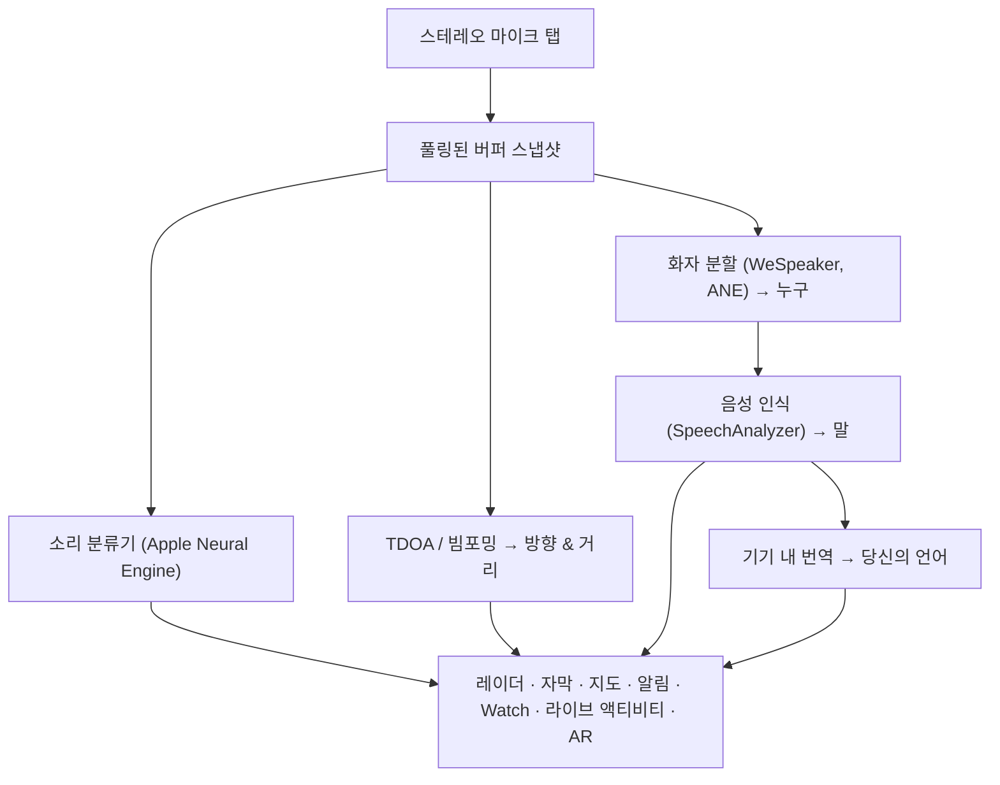

# Vigilant Ear 👂🛡️

*듣지 못하는 사람들을 위한 음향 레이더.*

농인 및 난청 커뮤니티를 위해 특별히 제작된 앱입니다. 대부분의 소리 인식 앱은 소리가 *무엇*인지 알려줍니다. **Vigilant Ear는 소리가 어디에 있는지, 누가 내고 있는지, 그리고 무슨 말을 하고 있는지 알려주어**, iPhone을 주변 소리를 묘사하는 실시간 음향 트라이코더로 탈바꿈시킵니다.

사이렌의 방향과 거리. 등 뒤에서 들리는 노크 소리. 대화 중인 사람들을 분리된 텍스트로 표시 — 각각 자막이 달리고 방향에 맞게 배치됩니다. 읽지 못하는 언어로 누군가 말하고 있다면, 그들의 말이 **당신의 언어로 번역되어** 도착할 수 있습니다. 알림은 **잠금 화면, 다이내믹 아일랜드(Dynamic Island) 및 Apple Watch**에 도달하므로 한 번 훑어보는 것만으로도 충분합니다.

중요한 모든 기능은 기기 내에서 실행됩니다. 오디오는 인식을 위해 녹음되거나 업로드되지 않습니다. 아무것도 소리를 듣는 것에 의존하지 않습니다.

- 🧭 **단순한 감지가 아닌 방향.** 단순히 "소리가 났다"가 아니라 *무엇을, 어디서, 누가,* 그리고 *무슨 말을 했는지* 알려줍니다.
- 🔒 **개인 정보 보호를 고려한 설계.** 분류, 자막 생성 및 번역은 iPhone 기기 내에서 실행됩니다. 자막은 실시간으로 제공되며 일시적입니다. 트랜스크립트 아카이브로 저장되지 않습니다.
- ⌚ **손목과 잠금 화면에서.** Apple Watch 방향 컴패니언 + 라이브 액티비티(Live Activity)를 통해 마지막 알림과 그 알림이 어느 방향에서 왔는지 한눈에 확인할 수 있습니다.
- 🛰️ **여러 대의 스마트폰, 하나의 공유된 귀.** Constellation은 초광대역(Ultra-Wideband) iPhone들을 연결하여 각 기기가 듣는 것을 더 선명한 방향성 그림으로 통합합니다.
- 👁️ **농인 / 난청인을 위한 제작.** 뚜렷한 햅틱, 고대비 시각 효과, 색상에 의존하지 않는 신호, 큰 탭 타겟, 그리고 동작 줄이기(Reduce Motion) 존중이 전체적으로 적용되었습니다.

---

## 대상 사용자

- 주변 소리의 상황 인식을 원하는 **농인 및 난청 사용자** — 켜두고 신뢰할 수 있는 Home Watch (노크, 알람, 아기, 전화) 및 Street Watch (사이렌, 접근).
- **방향과 화자 분리가 포함된 실시간 자막**이나 근처에 앉아 있는 사람들의 **기기 내 번역**이 필요한 모든 분.
- 기기 내 소리 위치 추적에 관심 있는 접근성 및 음향 연구 사용자.

> Vigilant Ear는 접근성 **보조 도구**이며, 인증된 인명 안전 기기가 아닙니다.

---

## 주요 기능

### 🧭 소리를 봅니다 — 방향 및 거리
iPhone의 스테레오 마이크를 사용하여, Vigilant Ear는 주변 소리의 **방향과 대략적인 거리**를 추정하고 헤딩 업(heading-up) 레이더 링과 지도에 실시간 마커로 배치합니다. 이동하면 마커가 실제 세계의 위치를 유지합니다. 이것이 핵심입니다: 들을 수 없는 세계의 공간적 인식.

### 🚨 중요한 소리를 인식합니다 — 그리고 경고합니다
기기 내 분류기가 수백 가지 일상적인 소리를 식별하고 중요 카테고리 — **사이렌, 알람, 초인종/노크, 아기 울음소리, 근처의 사람, 그리고 악천후** — 를 감시합니다. 이 중 하나가 발생하면, 앱이 백그라운드에 있거나 기기가 잠자기 상태일 때도 화면 알림, 선택적인 **푸시 알림**, 그리고 뚜렷한 **햅틱**을 받게 됩니다. 중요 카테고리는 기본적으로 준비되어 있으므로 알림을 활성화한다고 해서 "모든 것이 꺼지는" 것은 아닙니다. 모든 알림 카테고리를 끄면 백그라운드 상태일 때 배터리를 절약하기 위해 엔진이 완전히 최대 절전 모드로 들어갑니다.

악천후 경보는 공식 공공 CAP 피드에서 가져옵니다 — 미국 **NWS**, 유럽 **MeteoGate**, **중국 CMA**, 그리고 **한국 KMA** — 모든 사용자에게 무료로 제공됩니다. 피드는 사용자가 있는 위치를 커버하는 것으로 좁혀집니다.

### ⌚ Apple Watch + 라이브 액티비티 — 훑어보고 알기
- **Apple Watch 컴패니언** — 손목에서 알림의 방향을 가리켜 어디를 봐야 할지 한눈에 알려줍니다. 앱 귀 아이콘, 위협 HUD 레이아웃, 그리고 두 번 탭하여 알림을 닫을 수 있는 재설계된 Watch UI. Watch 앱이 열려 있지 않아도 알림에 방향 화살표가 계속 표시될 수 있습니다.
- **라이브 액티비티(Live Activity)** — Vigilant Ear는 **잠금 화면**, **다이내믹 아일랜드(Dynamic Island)**, 그리고 **Watch 스마트 스택(Smart Stack)**에 유지되므로 마지막 알림과 그 방향을 항상 한눈에 볼 수 있습니다.

### 💬 Speaker Mode — 실시간, 방향성 자막 *(무료)*
**Speaker Mode**를 켜면 Vigilant Ear가 근처에서 말하는 사람들을 **음성당 하나의 자막 블록**으로 변환합니다. 기기 내 화자 분할(diarization)이 내부 링의 방향 신호와 함께 음성을 구별 — *누가* *무엇을* 말하고 있는지 — 합니다. 실시간으로 말하는 사람이 강조 표시되고, 공간이 필요할 때 오래된 텍스트는 스크롤되어 사라집니다. 자막은 무료입니다; 자동 번역은 선택적인 Power Pack+ 레이어입니다.

### 🌐 Speaker Auto-Translate — 당신의 언어로, 실시간 *(Power Pack+)*
Speaker Mode가 켜진 상태에서 근처의 사람이 다른 언어로 말하면, Vigilant Ear가 이를 감지하고 해당 블록에 출발어와 함께 **당신의 언어로** 자막을 렌더링할 수 있습니다. 듣기 → 화자 분리 → 전사(transcribe) → 번역 → 표시의 체인이 **기기 내에서** 실행됩니다; 유일한 네트워크 사용은 Apple에서 일회성 언어 팩을 다운로드할 때뿐입니다. 다른 언어를 미리 알거나 선택할 필요가 없습니다.

이것은 SF가 약속한 **만능 통역기** — 그냥 알아듣는 기계 — 에 가장 가까운 현실입니다. 이어버드 통역기는 먼저 언어 쌍을 고르게 하고, 한 사람의 목소리를 한 사람의 귀에만 통역합니다. Vigilant Ear는 언어를 스스로 감지하고, 방 안에서 말하는 모든 사람을 따라가며, 모두를 내 언어의 자막으로 보여줍니다 — 이어버드도, 설정도 필요 없이, 기기에서 바로.

### 🎵 음악 및 방송 인식 *(Power Pack+)*
**ShazamKit**은 주변에서 재생되는 음악을 식별하고 노래 변경을 추적합니다. 음성이 방 안의 사람이 아니라 TV나 라디오에서 나오는 것처럼 보일 때, 해당 음성에는 **📻** 태그가 지정됩니다 — 말은 여전히 표시되고 정직하게 레이블이 지정됩니다.

### 🎛️ 어쿠스틱 스코프 — 엔지니어처럼 소리를 보다 *(Power Pack+)*
주변 소리를 전문가급으로 실시간 표시: 스펙트럼, 스펙트로그램, 1/3옥타브 RTA 밴드, 크로마, 배음 부분음. 나만의 팩 학습을 위한 소리 캡처 도구도 제공됩니다.

### 📦 맞춤형 사운드 팩 — 나의 세계를 가르치세요 *(Power Pack+)*
동네 새소리부터 건물 초인종까지, 나에게 중요한 소리를 Vigilant Ear에 학습시키세요. 추가 팩은 기본 감지 위에 쌓이는 방식이라 사이렌과 경보를 밀어내지 않습니다. 단계별 가이드가 앱에 포함되어 있습니다.

### 🛰️ Constellation — 여러 대의 iPhone, 하나의 공유된 귀 *(Power Pack+)*
두 대 이상의 초광대역(Ultra-Wideband) 지원 iPhone (iPhone 11 이후 대부분의 모델)을 사용하면, **Constellation**이 이를 페어링하여 서로의 위치를 감지하고 각 기기가 듣는 것을 소리가 어디서 오는지에 대한 하나의 더 정확한 그림으로 융합합니다 — 분산된 수동적인 청취 배열. 올바른 하드웨어를 가진 기기로 제한됩니다. 피어의 연결 시간보다 오래된 메시 자막은 재전송되지 않습니다.

### 📷 카메라 AR — "소리를 보세요"
타이틀 레일에 있는 카메라 알약(pill)을 열고 라이브 카메라 뷰에서 감지된 소리를 실제 방향에 고정합니다. 마커는 화자별로 또는 소리 카테고리와 방향별로 클러스터링되어 뷰를 읽기 쉽게 유지합니다; 소스가 조용해지면 나이에 따라 서서히 사라집니다.

### 🗺️ 지도, 도로 및 경로 예측
소리 방향이 지도의 실제 GPS 좌표에 투영됩니다. 차량 소리는 **가까운 도로에 스냅(snap)**될 수 있으며 경로가 예측되어 지나가는 트럭이 건물을 통과하는 것이 아니라 *도로를 따라* 이동하는 것으로 읽힙니다. (소방차 데모를 시도해 보세요.)

### 🪄 기능 플레이그라운드 — 귀 없이 증명하기
**기능 플레이그라운드**는 모두에게 공개되어 있습니다: Home & Street 연습 (노크, 알람, 아기, 사이렌, 날씨), 다중 전화 및 대화 데모, 그리고 연습이 실제 이벤트인 척하지 않도록 명확한 워터마크가 있습니다. 패널을 닫으면 데모가 깨끗하게 종료됩니다 (GPS 스푸핑이 멈추거나 찌꺼기 플래그가 남지 않음).

### ♿ 접근성 최우선
농인 / 난청인 및 색각 이상 사용자를 위한 제작: **색상에 의존하지 않는** 신호, **≥44 pt** 탭 타겟, **동작 줄이기(Reduce Motion)** 존중, 다중 모드 알림 (햅틱 + 시각 + Watch), 그리고 명확한 녹색 / 회색 / 빨간색 (및 주황색 "허용되지 않음") 상태로 권한 상태를 보여주는 시작 확인 화면 — 마스터 알림 스위치 역할을 하는 알림 부여 포함.

---

## 무료 및 Power Pack+

안전 핵심 기능은 **영원히 무료**입니다:

- **Home Watch & Street Watch** — 로컬 소리 알림 (알람, 사이렌, 노크/초인종, 아기, 근처의 사람)을 화면, 햅틱 및 선택적 푸시로 전달.
- **실시간 자막** — Speaker Mode, 기기 내, 하드웨어가 허용하는 곳에서의 방향성.
- **악천후 CAP** — 해당 지역의 NWS, MeteoGate, CMA, KMA.
- **기능 플레이그라운드** — 명확한 PREVIEW 워터마크가 있는 연습 알림 및 기능 미리보기.
- **Apple Watch 컴패니언 및 라이브 액티비티(Live Activity)** — 한눈에 볼 수 있는 방향과 마지막 알림.

**Power Pack+**는 **90일 무료 평가판**이 포함된 일회성 잠금 해제(**구독이 아님**)입니다. 다음과 같은 초능력을 추가합니다:

- **Speaker Auto-Translate** — 근처 음성을 기기 내에서 사용자의 언어로 번역.
- **Constellation** — 초광대역(Ultra-Wideband)을 통한 다중 iPhone 공유 청각.
- **음악 식별** — ShazamKit 노래 인식.
- **어쿠스틱 스코프** — 전문가급 실시간 소리 시각화 및 캡처 도구.
- **맞춤형 사운드 팩** — 내 소리로 직접 학습시키는 추가 분류기.

무료든 Power Pack+든, **사용자의 오디오는 인식을 위해 기기에 머무릅니다** — 티어는 잠금 해제되는 기능만 변경하며, 원시 오디오가 분석을 위해 전송되는 위치는 절대 변경하지 않습니다.

---

## 작동 방식 (내부 구조)

Vigilant Ear는 **로컬 우선, 기기 내** 파이프라인입니다. 원시 오디오는 우선순위가 높은 탭에서 캡처되어, UI를 지연시키거나 스트리머를 방해하지 않고 **풀링된 버퍼 프리 리스트(pooled buffer free-list)** (실시간 경로에서 할당 스래싱 없음)에 복사된 후 독립적인 프로세서로 분산(fan-out)됩니다:

- **공간 수학** — 백그라운드 작업에서의 FFT, 도달 시간차(Time-Difference-of-Arrival), 도플러 추적.
- **음성** — 전사를 위한 iOS 26 `SpeechAnalyzer` / `SpeechTranscriber`; 음성 신원을 위한 **WeSpeaker** 임베딩; 기기 내 번역을 위한 Apple의 **Translation** 프레임워크.
- **동시성** — Swift 6 분리는 마이크 탭, 음향 수학, 그리고 UI 렌더 루프를 깨끗하게 분리된 상태로 유지합니다.
- **효율성** — 다운샘플링과 부하 적응형 분류는 항상 듣고 있는 상태를 켜두기에 충분히 가볍게 유지합니다.

---

## 개인 정보 보호

- **핵심 파이프라인을 위해 항상 기기 내에서 처리.** 분류, 공간 수학, 전사, 화자 분할, 번역은 사용자의 iPhone에서 실행됩니다. 원시 오디오는 인식을 위해 녹음되거나 업로드되지 않습니다.
- **자막은 일시적입니다.** 실시간 자막은 세션 동안 메모리에 유지됩니다; 내보낸 디버그 로그에는 자막 텍스트가 포함되지 않습니다.
- **광고 또는 행동 분석 SDK 없음.** 제한된 네트워크 사용은 오직 지도, 공공 날씨 피드, 선택적인 Shazam 지문, 도로 컨텍스트, 그리고 App Store 구매만을 위한 것입니다 — 전체 정책을 참조하세요.

전체 세부 정보: [PRIVACY_ko.md](PRIVACY_ko.md) · [TERMS_ko.md](TERMS_ko.md) · [SUPPORT_ko.md](SUPPORT_ko.md)

---

## 하드웨어 및 플랫폼

- **iPhone (전체 경험).** 방향 찾기를 위해 스테레오 마이크가 필요합니다. **iPhone 13 이상** 권장.
- **Apple Watch.** 방향 화살표가 있는 컴패니언 알림; 라이브 액티비티(Live Activity) / 스마트 스택(Smart Stack)과 함께 작동.
- **iPad (자막 중심).** 단일 채널 마이크 → 완전한 방향이 없는 자막.
- **Constellation**은 **초광대역(Ultra-Wideband)**이 필요합니다 — iPhone 11 이상 (SE 및 "e" 모델 제외).
- **Android.** 핵심 레이더, 알림, 자막, 날씨가 포함된 별도의 빌드; Constellation 메시는 iOS 우선입니다. Android 패리티가 증가함에 따라 제품 사이트 업데이트를 확인하세요.

**현재 App Store 버전:** 1.0.7. 최신 iOS (SpeechAnalyzer 시대)를 위해 빌드되었습니다.

---

## 지역화

인터페이스, 알림 및 자막 등 완전히 지역화되어 **영어, 스페인어, 포르투갈어(브라질), 프랑스어, 독일어, 아랍어, 일본어, 중국어(간체), 한국어** (9개 언어)로 제공됩니다. 시스템 로케일 또는 앱 내 수동 선택을 따릅니다.

---

## 상태 및 면책 조항

Vigilant Ear는 **실험적인 음향 접근성 보조 도구**이며, 인증된 인명 안전 유틸리티가 아닙니다. 지역화 해상도는 주변 환경, 날씨, 바람, 그리고 마이크 하드웨어에 따라 다릅니다. **항상 일반적인 주변 인식을 유지하세요** — 유일한 안전 정보 출처로 이에 의존하지 마세요.

일부 기능(카메라 AR 마커, Apple에서 승인한 경우 중요 알림(Critical Alerts) 자격 업그레이드, 고급 다중 팩 소리 저작)은 계속 발전하고 있습니다; 무료 Home / Street watch와 실시간 자막은 첫날부터 신뢰할 수 있는 제품입니다.

---

**연락처:** [vigilantear@wingdingssocial.com](mailto:vigilantear@wingdingssocial.com)

농인 및 난청 커뮤니티와 음향 연구를 위해 ❤️로 제작되었습니다.

    
  <strong>© 2026 Wingdings, Inc.</strong> 
  모든 권리 보유. 
  특허 출원 중

