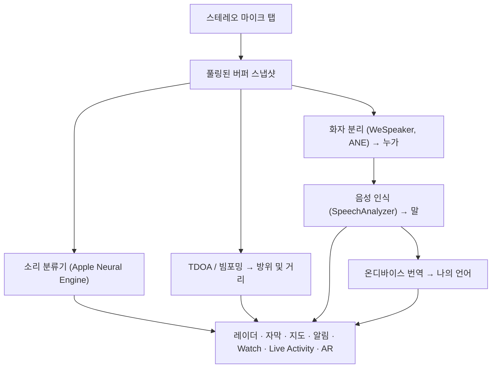

# Vigilant Ear 👂🛡️

*들을 수 없는 사람들을 위한 음향 레이더.*

농인 및 난청인 커뮤니티를 위해 특별히 만든 앱입니다. 대부분의 소리 인식 앱은 소리가 *무엇*인지 알려줍니다. **Vigilant Ear는 소리가 어디에 있는지, 누가 내는지, 무슨 말을 하는지 알려줍니다** — iPhone을 실시간 소닉 트라이코더로 바꾸어 주변의 소리를 설명해 줍니다.

사이렌의 방향과 거리. 등 뒤에서 들리는 노크. 대화 중인 사람들을 분리된 전사 음성으로 표시 — 각 사람의 말이 자막으로 달리고 방향과 함께 배치됩니다. 상대방이 읽을 수 없는 언어로 말하고 있다면, 그 말은 **여러분의 언어로 번역되어** 도착합니다. 알림은 **잠금 화면, Dynamic Island, Apple Watch**에 도달하므로 한 번 흘끗 보는 것만으로 충분합니다.

중요한 처리는 전부 기기에서 실행됩니다. 인식용으로 오디오를 녹음하거나 업로드하지 않습니다. 어떤 것도 듣는 능력에 의존하지 않습니다.

- 🧭 **감지를 넘어 방향까지.** *무엇, 어디, 누가,* 그리고 *무슨 말을 했는지* — 단순히 “소리가 났다”가 아닙니다.
- 🔒 **설계부터 프라이버시 중심.** 분류, 자막, 번역이 사용자의 iPhone에서 실행됩니다. 자막은 실시간이며 일시적입니다. 자막 기록 아카이브로 저장되지 않습니다.
- ⌚ **손목과 잠금 화면에.** Apple Watch 방향 컴패니언 + Live Activity로 마지막 알림과 그 방향을 한눈에 확인할 수 있습니다.
- 🛰️ **여러 대의 폰, 하나의 공유된 귀.** Constellation이 Ultra-Wideband iPhone들을 연결하여 각 기기가 듣는 소리를 융합해 더 선명한 방향 정보를 만듭니다.
- 👁️ **Deaf / HoH를 위한 설계.** 구분되는 햅틱, 고대비 시각, 색상에 의존하지 않는 신호, 큰 탭 영역, 전 구간 Reduce Motion 존중.

---

## 이런 분들을 위한 앱입니다

- **농인 및 난청인 사용자** — Home Watch(노크, 경보, 아기, 전화)와 Street Watch(사이렌, 접근)를 켜 두고 믿을 수 있는 소리 상황 인식이 필요한 분.
- **방향과 화자 분리가 있는 실시간 자막**, 또는 곁에 앉은 사람들의 말을 **온디바이스 번역**해야 하는 모든 분.
- 온디바이스 소리 위치 추적에 관심 있는 접근성 및 음향 연구 사용자.

> Vigilant Ear는 접근성 **보조 도구**이며, 인증된 인명 안전 장치가 아닙니다.

---

## 주요 기능

### 🧭 소리를 봅니다 — 방향과 거리
iPhone의 스테레오 마이크를 사용해 Vigilant Ear가 주변 소리의 **방위와 대략적인 거리**를 추정하고, 진행 방향 기준 레이더 링과 지도 위에 실시간 마커로 표시합니다. 사용자가 이동해도 마커는 실제 세계의 위치를 유지합니다. 이것이 핵심입니다: 들을 수 없는 세계에 대한 공간적 인식.

### 🚨 중요한 소리를 인식하고 경고합니다
온디바이스 분류기가 수백 가지 일상 소리를 식별하고 핵심 카테고리 — **사이렌, 경보, 초인종/노크, 아기 울음, 근처에 있는 사람, 악천후** — 를 주시합니다. 하나가 감지되면 명확한 화면 알림, 선택적 **푸시 알림**, 구분되는 **햅틱**을 받습니다 — 앱이 백그라운드에 있거나 휴대폰이 잠자기 상태여도 마찬가지입니다. 핵심 카테고리는 기본적으로 준비되어 있어 알림을 켜도 “전부 꺼짐”이 되지 않습니다. 모든 알림 카테고리를 끄면 백그라운드에서 엔진이 완전히 절전 모드로 전환되어 배터리를 절약합니다.

악천후 경보는 공식 공공 CAP 피드에서 제공됩니다 — 미국 **NWS**, 유럽 **MeteoGate**, **중국 CMA**, **한국 KMA** — 모든 사용자에게 무료입니다. 피드는 사용자의 위치를 커버하는 것으로 좁혀집니다.

### ⌚ Apple Watch + Live Activity — 흘끗 보고 알기
- **Apple Watch 컴패니언** — 알림의 방향이 손목에 표시되어 어디를 봐야 하는지 한눈에 알 수 있습니다. 앱 귀 아이콘, 위협 HUD 레이아웃, 더블 탭으로 최소화하는 재설계된 Watch UI. Watch 앱이 열려 있지 않아도 알림에 방향 화살표가 표시될 수 있습니다.
- **Live Activity** — Vigilant Ear가 **잠금 화면**, **Dynamic Island**, **Watch Smart Stack**에 남아, 마지막 알림과 그 방위를 항상 한 번 흘끗 보는 거리에 둡니다.

### 💬 Speaker Mode — 실시간 방향 자막 *(무료)*
**Speaker Mode**를 켜면 Vigilant Ear가 주변에서 말하는 사람들의 대화를 **음성별로 하나씩 자막 블록**으로 전사합니다. 온디바이스 화자 분리(diarization)가 음성을 구별하여 *누가* *무슨 말을* 하는지 보여 주며, 내부 링에 방향 단서를 표시합니다. 현재 말하는 화자는 강조되고, 이전 텍스트는 공간이 필요할 때 스크롤되어 사라집니다. 자막은 무료이며, 자동 번역은 선택적 Power Pack+ 레이어입니다.

### 🌐 Speaker Auto-Translate — 나의 언어로, 실시간 *(Power Pack+)*
Speaker Mode가 켜진 상태에서 근처의 사람이 다른 언어로 말하면, Vigilant Ear가 이를 감지하고 그 사람의 자막을 **여러분의 언어로** 표시하며, 해당 블록에 원본 언어를 보여 줍니다. 듣기 → 화자 분리 → 전사 → 번역 → 표시의 연쇄가 **기기에서** 실행되며, 네트워크가 사용되는 유일한 순간은 Apple에서 언어 팩을 최초 한 번 다운로드할 때뿐입니다. 상대 언어를 미리 알거나 선택할 필요가 없습니다.

### 🎵 음악 및 방송 인식 *(Power Pack+)*
**ShazamKit**이 주변에서 재생되는 음악을 식별하고 곡 변경을 추적합니다. 음성이 방 안의 사람이 아니라 TV나 라디오에서 나오는 것으로 보이면 **📻** 태그가 붙습니다 — 말은 그대로 표시되지만 정직하게 라벨링됩니다.

### 🛰️ Constellation — 여러 대의 iPhone, 하나의 공유된 귀 *(Power Pack+)*
Ultra-Wideband를 지원하는 iPhone 두 대 이상(iPhone 11 이후 대부분의 모델)이 있으면 **Constellation**이 기기들을 페어링하여 서로의 위치를 감지하고, 각 기기가 듣는 소리를 융합해 소리의 출처를 더 정밀하게 파악합니다 — 분산형 수동 청취 어레이입니다. 해당 하드웨어를 갖춘 기기로 제한됩니다. 피어 연결 시간보다 오래된 메시 자막은 재전송되지 않습니다.

### 📷 Camera AR — “소리를 보기” *(미리보기)*
제목 레일의 카메라 필을 열어 감지된 소리를 실시간 카메라 뷰의 실제 방위에 고정합니다. 마커는 화자별 또는 소리 카테고리·방향별로 클러스터링되어 뷰를 읽기 쉽게 유지하며, 소스가 조용해지면 시간에 따라 페이드됩니다.

### 🗺️ 지도, 도로 및 경로 예측
소리 방위가 지도상의 실제 GPS 좌표에 투영됩니다. 차량 소리는 **근처 도로에 스냅**되고 경로가 예측되어, 지나가는 트럭이 건물을 통과하는 것이 아니라 *도로를 따라* 이동하는 것처럼 읽힙니다. (소방차 데모를 시도해 보세요.)

### 🪄 Demo Mode — 귀 없이도 증명하기
**Demo Mode**는 모두에게 공개됩니다: Home & Street 연습(노크, 경보, 아기, 사이렌, 날씨), 다중 폰 및 대화 데모, 연습이 실시간 이벤트로 위장하지 않도록 명확한 **DEMO:** 워터마크. 패널을 닫으면 데모 상태가 깨끗이 정리됩니다(고착된 GPS 스푸프 없음, 남은 플래그 없음).

### ♿ 접근성 우선
농인/난청인 및 색각 이상 사용자를 위해 설계: **색상에 의존하지 않는** 신호, **≥44 pt** 탭 영역, **Reduce Motion** 존중, 다중 모달 알림(햅틱 + 시각 + Watch), 권한 상태를 명확한 초록/회색/빨강(및 연소 주황 “비허용”)으로 보여 주는 시작 확인 화면 — 마스터 알림 스위치 역할을 하는 알림 허용 포함.

---

## 무료 및 Power Pack+

안전 코어는 **영원히 무료**입니다:

- **Home Watch & Street Watch** — 로컬 소리 알림(경보, 사이렌, 노크/초인종, 아기, 근처에 있는 사람)을 화면, 햅틱, 선택적 푸시로 전달.
- **실시간 자막** — Speaker Mode, 온디바이스, 하드웨어가 허용하는 경우 방향 포함.
- **악천후 CAP** — 지역별 NWS, MeteoGate, CMA, KMA.
- **Demo Mode** — DEMO 워터마크가 있는 연습 알림 및 기능 미리보기.
- **Apple Watch 컴패니언 및 Live Activity** — 한눈에 보는 방향과 마지막 알림.

**Power Pack+**는 일회성 잠금 해제(**구독이 아님**)이며 **90일 무료 체험**이 포함됩니다. 다음 슈퍼파워를 추가합니다:

- **Speaker Auto-Translate** — 주변 음성을 여러분의 언어로 온디바이스 번역.
- **Constellation** — Ultra-Wideband를 통한 다중 iPhone 공유 청취.
- **Music ID** — ShazamKit 곡 인식.

무료든 Power Pack+든, **인식을 위한 오디오는 기기에 머뭅니다** — 티어는 잠금 해제되는 기능만 바꾸며, 원시 오디오가 분석을 위해 전송되는 위치를 바꾸지 않습니다.

---

## 작동 방식 (내부 구조)

Vigilant Ear는 **로컬 우선, 온디바이스** 파이프라인입니다. 원시 오디오는 고우선순위 탭에서 캡처되고 **풀링된 버퍼 프리리스트**에 복사되며(실시간 경로에서 할당 스래싱 없음), UI를 멈추거나 스트리머를 방해하지 않고 독립 프로세서로 분기됩니다:

- **공간 수학** — 백그라운드 작업에서 FFT, Time-Difference-of-Arrival, 도플러 추적.
- **음성** — 전사용 iOS 26 `SpeechAnalyzer` / `SpeechTranscriber`; 음성 정체성을 위한 **WeSpeaker** 임베딩; 온디바이스 번역을 위한 Apple **Translation** 프레임워크.
- **동시성** — Swift 6 격리가 마이크 탭, 음향 수학, UI 렌더 루프를 깔끔하게 분리.
- **효율** — 다운샘플링과 부하 적응형 분류가 상시 청취를 계속 켜 둘 만큼 가볍게 유지.

---

## 개인정보 보호

- **코어 파이프라인은 항상 온디바이스.** 분류, 공간 수학, 전사, 화자 분리, 번역이 사용자의 iPhone에서 실행됩니다. 원시 오디오는 인식용으로 녹음되거나 업로드되지 않습니다.
- **자막은 일시적입니다.** 실시간 자막은 세션 동안 메모리에 머무르며, 내보낸 디버그 로그에는 자막 텍스트가 포함되지 않습니다.
- **광고 또는 행동 분석 SDK 없음.** 제한된 네트워크 사용은 지도, 공공 날씨 피드, 선택적 Shazam 지문, 도로 컨텍스트, App Store 구매에만 해당합니다 — 전체 정책 참조.

전체 세부 정보: [PRIVACY.md](PRIVACY.md) · [TERMS.md](TERMS.md) · [SUPPORT.md](SUPPORT.md)

---

## 하드웨어 및 플랫폼

- **iPhone (전체 경험).** 방향 찾기에 스테레오 마이크 필요. **iPhone 13 이상** 권장.
- **Apple Watch.** 방향 화살표가 있는 컴패니언 알림; Live Activity / Smart Stack과 연동.
- **iPad (자막 중심).** 단일 채널 마이크 → 전체 방향 없이 자막.
- **Constellation**에는 **Ultra-Wideband** 필요 — iPhone 11 이상, SE 및 “e” 모델 제외.
- **Android.** 코어 레이더, 알림, 자막, 날씨가 있는 별도 빌드; Constellation 메시는 iOS 우선. Android 기능 동등성이 커짐에 따라 제품 사이트 업데이트를 확인하세요.

**현재 Apple 마케팅 버전:** 1.0.7 (진행 중 / 출시 트랙). 최신 iOS(SpeechAnalyzer 시대)용으로 빌드됨.

---

## 현지화

인터페이스, 알림, 자막이 **영어, 스페인어, 포르투갈어(브라질), 프랑스어, 독일어, 아랍어, 일본어, 중국어 간체, 한국어**로 완전히 현지화되어 있습니다(9개 언어). 시스템 로케일 또는 앱 내 수동 선택을 따릅니다.

---

## 상태 및 면책

Vigilant Ear는 **실험적 음향 접근성 보조 도구**이며, 인증된 인명 안전 유틸리티가 아닙니다. 위치 추정 해상도는 주변 환경, 날씨, 바람, 마이크 하드웨어에 따라 달라집니다. **항상 일상적인 환경 인식을 유지하세요** — 안전 정보의 유일한 출처로 의존하지 마세요.

일부 기능(카메라 AR 마커, Apple이 부여할 때의 Critical Alerts entitlement 업그레이드, 고급 다중 팩 사운드 저작)은 계속 발전합니다. 무료 Home / Street watch와 실시간 자막은 첫날부터 믿을 수 있는 제품입니다.

---

**문의:** [vigilantear@wingdingssocial.com](mailto:vigilantear@wingdingssocial.com)

D/HH 커뮤니티와 음향 연구를 위해 ❤️로 만들었습니다.

    
  <strong>© 2026 Wingdings, Inc.</strong> 
  All rights reserved. 
  Patent Pending

