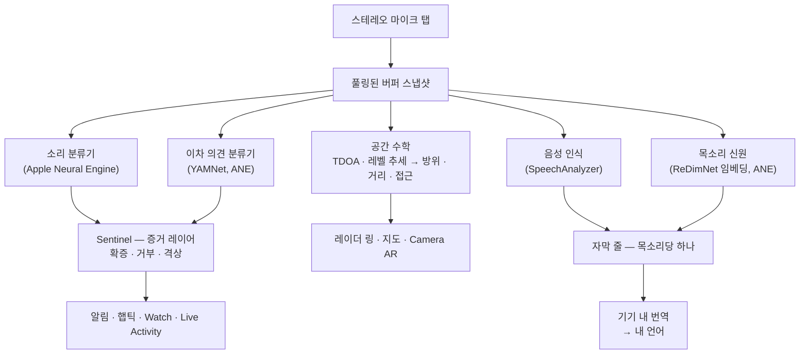
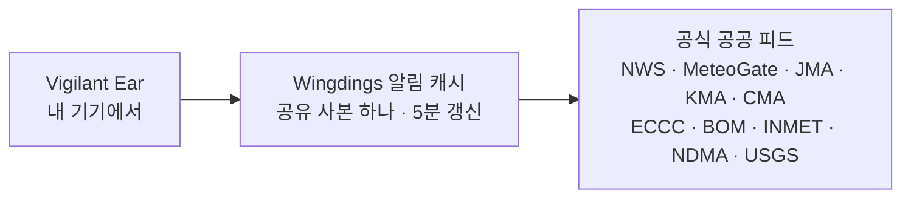

# Vigilant Ear 👂🛡️

*버전 1.1.4 기준 · 2026년 9월.*

## 듣지 못하는 사람들을 위한 음향 레이더.

농인·난청·CODA 커뮤니티를 위해 특별히 만든 앱입니다. 대부분의 소리 인식 앱은 소리가 *무엇인지*만 알려 줍니다. **Vigilant Ear는 소리가 어디에 있는지, 누가 내고 있는지, 무슨 말을 하고 있는지까지 알려 줍니다** — iPhone을 주변 소리를 묘사하는 실시간 음향 트라이코더로 바꿉니다.

사이렌의 방향과 거리. 등 뒤에서 나는 노크. 대화 속 사람들을 목소리마다 분리된 자막으로 — 각각 방향까지 맞춰 표시합니다. 읽지 못하는 언어로 누군가 말하고 있다면, 그 말이 **당신의 언어로 번역되어** 도착할 수 있습니다. 알림은 **잠금 화면, Dynamic Island, Apple Watch**까지 닿으니 한눈이면 충분합니다.

중요한 처리는 전부 기기 안에서 돌아갑니다. 인식용으로 오디오를 녹음하거나 업로드하지 않습니다. 무엇도 ‘듣는 것’에 의존하지 않습니다.

- 🧭 **감지만이 아니라 방향.** 단순히 “소리가 났다”가 아니라 *무엇을, 어디서, 누가,* 그리고 *무슨 말을 했는지*.
- 🔒 **설계부터 사생활 보호.** 분류·자막·번역은 iPhone에서 실행됩니다. 자막은 실시간·일회성이며, 대화 기록 아카이브로 저장되지 않습니다.
- ⌚ **손목과 잠금 화면에서.** Apple Watch 방향 컴패니언 + Live Activity로 마지막 알림과 어느 쪽에서 왔는지 한눈에.
- 🛰️ **여러 대의 폰, 하나의 공유된 귀.** Constellation이 Ultra-Wideband iPhone을 묶어 각 기기가 잡아낸 소리를 더 선명한 방향 그림으로 합칩니다.
- 👁️ **농인 / 난청 / CODA를 위해.** 구분되는 햅틱, 고대비 시각, 색에 의존하지 않는 신호, 큰 탭 영역, 전역 Reduce Motion 존중.

---

## 대상 사용자

- 소리에 대한 상황 인식이 필요한 **농인·난청·CODA 사용자** — 켜 두고 믿을 수 있는 Home Watch(노크, 알람, 아기, 전화)와 Street Watch(사이렌, 접근).
- **방향과 화자 분리가 있는 실시간 자막**, 또는 옆에 앉은 사람의 **기기 내 번역**이 필요한 모든 분.
- 기기 내 소리 위치 추정에 관심 있는 접근성·음향 연구 사용자.

> Vigilant Ear는 접근성 **보조 도구**이지, 인증된 생명 안전 기기가 아닙니다.

---

## 주요 기능

### 🧭 소리를 봅니다 — 방향과 거리
iPhone의 마이크 두 개로 Vigilant Ear는 **소리의 각도와 앞인지 뒤인지**를 재고, 그 값을 약 1° 수준으로 안정시킨 뒤, **헤딩 업 레이더 링(진행 방향 위)**과 지도에 실시간 마커로 올립니다. 한 줄에 놓인 마이크 두 개만으로는 왼쪽·오른쪽을 스스로 구분할 수 없습니다 — 오른쪽 50°와 왼쪽 50°는 같은 아주 작은 시간차로 도착합니다 — 그래서 앱은 측정값과 함께 **반대쪽에 옅은 고스트**를 그리고, 손목을 돌리거나 두 번째 폰이 있으면 쪽을 확정합니다. 거리는 거리 보정 곡선에 맞춘 크기(라우드니스)로 추정하며, 추정임을 그대로 보여 줍니다: *≈ 50 ft*, 가능 범위와 함께. 움직여도 마커는 실제 세계 위치를 유지합니다. 핵심은 이것입니다 — 들을 수 없는 세계에 대한 공간 인식. (수치는 아래.)

### 🚨 중요한 소리를 알아채고 — 경고합니다
기기 안 분류기가 수백 가지 일상 소리를 식별하고, 중요 범주 — **사이렌, 알람(전용 차량 경보 클래스 포함), 초인종/노크, 아기 울음, 근처의 사람, 악천후** — 를 지켜봅니다. 그중 하나가 뜨면 화면 알림, 선택적 **푸시 알림**, 구분되는 **햅틱**이 옵니다 — 앱이 백그라운드에 있거나 폰이 잠들어 있어도. 중요 범주는 기본으로 준비되어 있어, 알림을 켠다고 “전부 꺼짐”이 되지 않습니다. 알림 범주를 모두 끄면 백그라운드에서 엔진이 완전히 최대 절전으로 들어가 배터리를 아낍니다. **Sentinel** 레이어가 알림을 방향·움직임·공공 피드 같은 독립 증거와 교차 확인해, 단일 분류기의 추측이 아니라 뒷받침된 것만 울리게 합니다. 양방향으로 작동합니다: 노래 속 사이렌 비슷한 순간은 붙잡히지만, 음악 사이로 반복되는 **진짜 사이렌**은 뚫고 나와 알립니다.

악천후 경보는 공식 공공 피드에서 옵니다 — 미국 **NWS**, 유럽 **MeteoGate**, **중국 CMA**, **한국 KMA**, **일본 JMA**, **캐나다 ECCC**, **호주 BOM**, **브라질 INMET**, **인도 NDMA** — 모든 사용자에게 무료입니다. 피드는 지금 위치를 덮는 것만으로 좁혀집니다. 일본에서는 JMA의 **사전 공보**도 읽습니다 — 태풍·호우가 오기 *며칠 전*에 나오는 쉬운 말 안내이며, 위험이 닥친 뒤의 경보만이 아닙니다 — 급호우·산사태 공보도 포함합니다. 사전 안내는 조용히 보여 주고, 진짜 경보에만 쓰는 소리·진동은 쓰지 않습니다.

### ⌚ Apple Watch + Live Activity — 한눈에 알기
- **Apple Watch 컴패니언** — 손목에서 알림 방향을 가리켜, 어디를 볼지 한눈에 알 수 있습니다. 앱 귀 아이콘, 위협 HUD 레이아웃, 더블 탭으로 알림 닫기가 있는 새 Watch UI. Watch 앱이 열려 있지 않아도 방향 화살표가 표시될 수 있습니다.
- **Live Activity** — Vigilant Ear가 **잠금 화면**, **Dynamic Island**, **Watch Smart Stack**에 남아, 마지막 알림과 방위가 언제나 한눈 거리에 있습니다.
- **손목의 파트너 알림** — 연결된 Constellation 파트너의 폰이 알림을 올리면, 방향까지 포함해 내 Watch에도 올 수 있습니다. 안정성 패스로 하루 종일 Watch 배터리 부담을 가볍게 유지합니다.

### 💬 Speaker Mode — 실시간·방향성 자막 *(무료)*
**Speaker Mode**를 켜면 Vigilant Ear가 근처에서 말하는 사람을 **목소리당 하나의 자막 블록**으로 받아 적습니다. 기기 안 화자 분리(diarization)가 목소리를 구분하고 — *누가* *무엇을* 말하는지 — 안쪽 링에 방향 신호를 둡니다. 지금 말하는 사람은 강조되고, 공간이 필요하면 오래된 텍스트는 스크롤되어 사라집니다.

대부분의 자막 앱이 하지 않는 두 가지: **신뢰도에 대한 정직함** — 줄마다 미세한 품질 표시와, 의심스러운 단어 아래의 점선 밑줄이 “이 줄은 믿어도 되는지 / 다시 볼지”를 알려 줍니다 — 그리고 **자기 보정**: 문장이 막 잡히면 앱이 전체 맥락으로 오디오를 다시 읽고, 몇 초 안에 놓치거나 잘못 잡은 단어를 되돌릴 수 있습니다. 그다음 텍스트는 고정됩니다.

자막은 무료이고, 자동 번역은 선택적 Power Pack+ 레이어입니다. 자막을 **Bluetooth 청각 기기로 소리 내어 읽게** 할 수도 있습니다 — 무료, 환경설정에서. **Direction Tones**(역시 무료, 환경설정 → Captions)는 선택한 쪽 귀에, 화자가 어디에 있는지 알려 주는 선택적 오디오 신호를 더합니다 — 보청기나 한쪽만 듣는 분에게 유용하고, 누구에게나 열려 있습니다.

### 🌐 Speaker Auto-Translate — 내 언어로, 실시간 *(Power Pack+)*
Speaker Mode가 켜진 상태에서 근처 사람이 다른 언어로 말하면, Vigilant Ear가 이를 감지하고 그 블록에 원어를 표시한 채 자막을 **당신의 언어로** 보여줄 수 있습니다. 흐름 — 감지 → 화자 분리 → 전사 → 번역 → 표시 — 은 **기기 안**에서 돌아가며, 네트워크가 필요한 순간은 Apple에서 언어 팩을 한 번 받을 때뿐입니다. 상대 언어를 미리 알거나 고를 필요가 없습니다.

시나리오 SF의 **만능 통역기** — 그냥 알아듣는 장치 — 에 가장 가까운 실물입니다. Vigilant Ear가 언어를 스스로 찾고, 방 안 화자를 따라가며, 모두 내 언어 자막으로 보여 줍니다 — 이어버드도, 설정도 없이, 기기에서.

```mermaid
graph LR
    A["폰이 감지"] --> B["언어 자동 인식"] --> C["목소리마다 분리"] --> D["방 전체를 내 언어 자막으로"]
```

### 🎵 음악·방송 인식 *(Power Pack+)*
**ShazamKit**이 주변에서 재생되는 음악을 식별하고 곡 변경을 추적합니다.

### 🎛️ Acoustic Scope — 엔지니어처럼 소리를 보기
주변 소리의 전문가급 실시간 뷰: 스펙트럼, 스펙트로그램, ⅓옥타브 RTA 밴드, 크로마, 배음 부분음 — **누구나 무료**. 나만의 팩을 학습시키려 소리를 캡처하는 도구는 Power Pack+에 포함됩니다.

### 📦 Custom Sound Packs — 내 세계를 가르치기 *(Power Pack+)*
동네 새소리부터 건물 현관 차임까지, 나에게 중요한 소리를 Vigilant Ear에 가르치세요. 추가 팩은 기본 감지 위에 쌓이므로, 새 소리가 사이렌·알람을 밀어내지 않습니다. 단계별 가이드가 앱에 들어 있습니다.

### 🛰️ Constellation — 여러 대의 iPhone, 하나의 공유된 귀 *(Power Pack+)*
Ultra-Wideband를 지원하는 iPhone 두 대 이상(대개 iPhone 11부터)이면 **Constellation**이 서로를 페어링해 위치를 감지하고, 각 기기가 잡아낸 소리를 소리가 어디서 오는지에 대한 더 정확한 한 장의 그림으로 합칩니다 — **분산형 수동 감지 배열**. 자막도 융합됩니다: 각 폰이 자기 마이크가 잡은 말을 전사하고, 말들이 폰 사이에서 맞춰져 화자에 가장 가까운 폰의 기여가 남습니다 — 한 폰만 잡은 단어도 버리지 않고 지킵니다. 폰끼리 **직접** 연결됩니다 — 공유기·공유 Wi-Fi·인터넷 불필요; Wi-Fi만 켜져 있으면 AirDrop과 같은 피어 투 피어 링크로 연결됩니다. 해당 하드웨어가 있는 기기로 제한됩니다. 피어 연결 시각보다 오래된 메시 자막은 다시 보내지 않습니다.

**파트너 메시지** — 연결된 파트너 폰에 짧은 글을 보내면 상대 자막 피드에 뜨고, 기기 안에서 상대 언어로 번역되어 올 수 있습니다. 메시징은 연령을 인식합니다: Apple의 Declared Age Range 위에 올려, 성인과 미성년자 사이의 문자는 양쪽이 의도적으로 서로를 이름으로 지정하지 않으면 꺼진 채로 둡니다. 알림과 자막은 절대 막지 않습니다 — 사람 대 사람 문자만 제한합니다.

### 🔗 Remote Link — 옆에 없는 사람에게 닿기 *(시작하려면 Power Pack+)*
보통 전화 한 통이 할 일을, 영상과 글으로. 초대 코드를 보내면 상대는 Vigilant Ear 안에서 참여합니다 — **Power Pack+가 없어도 됩니다**. Constellation과 달리 가까이 있을 필요가 없습니다 — 세상 어디에 있어도 됩니다.

**오디오는 어떤 순간에도 쓰지 않습니다.** 영상과 글뿐이라, 링크의 어느 쪽도 ‘듣는 것’에 의존하지 않습니다 — 그리고 앱을 통해 수어로 이야기할 길도 됩니다. 앱 자체가 수어를 이해하진 않습니다; 영상을 전달할 뿐이고, 나머지는 두 사람입니다. 네트워크가 허용하면 연결은 두 폰 사이에서 직접 이루어지고, 앱은 **Direct**인지 **Relayed**인지 분명히 보여 줍니다 — 영상이 중계를 거치는지 언제나 알 수 있게.

### 📷 Camera AR — “소리를 보세요”
타이틀 레일의 카메라 버튼을 열어, 감지된 소리를 라이브 카메라 뷰의 실제 방위에 고정합니다. 마커는 화자별, 또는 소리 범주·방향별로 묶여 읽기 쉽게 유지되고; 소스가 조용해지면 서서히 사라집니다.

### 🗺️ 지도, 도로, 경로 예측
소리 방위가 지도의 실제 GPS 좌표에 투영됩니다. 차량 소리는 **근처 도로에 스냅**되고 경로가 예측되어, 지나가는 트럭이 건물 사이가 아니라 *길을 따라* 움직이는 것처럼 읽힙니다. (소방차 데모를 시도해 보세요.)

### 🪄 Feature Playground — 귀 없이도 확인하기
**Feature Playground**는 모두에게 공개됩니다: Home·Street 연습(노크, 알람, 아기, 사이렌, 날씨), 다중 폰·대화 데모, 그리고 연습이 실제 이벤트인 척하지 않도록 하는 명확한 워터마크. 패널을 닫으면 데모가 깨끗이 정리됩니다(GPS 스푸핑이 남거나 플래그가 남지 않음).

### ♿ 접근성 최우선
농인 / 난청 / CODA·색각 이상 사용자를 위해: **색에 의존하지 않는** 신호, **≥44 pt** 탭 영역, **Reduce Motion** 존중, 다중 모드 알림(햅틱 + 시각 + Watch), 그리고 권한 상태를 초록 / 회색 / 빨강(및 탄 주황 “허용 안 됨”)으로 보여 주는 시작 확인 화면 — 마스터 알림 스위치 역할을 하는 알림 허용 포함.

---

## 무료 및 Power Pack+

안전 핵심은 **영원히 무료**입니다:

- **Home Watch & Street Watch** — 로컬 소리 알림(알람, 사이렌, 노크/초인종, 아기, 근처의 사람)을 화면·햅틱·선택적 푸시로.
- **실시간 자막** — Speaker Mode, 기기 안, 하드웨어가 허용하면 방향성, 정직한 신뢰도 표시, 약 2초 자기 보정, Bluetooth 청각 기기로의 선택적 음성 출력, Direction Tones.
- **Standing Watch** — 방 자체의 상태, 설정할 것 없이 항상 켜짐: 방이 평소 패턴을 유지하면 안정된 시안(청록) 램프, 무언가 바뀌면 — 새 목소리, 갑작스러운 고요, 다가오는 무언가 — 호박색.
- **악천후 경보** — 해당 지역의 NWS, MeteoGate(유럽 — 저희 **5분** 알림 캐시에서 신선하게 제공), CMA, KMA, JMA(일본), ECCC(캐나다), BOM(호주), INMET(브라질), NDMA(인도).
- **지진 알림(USGS, 전 세계)** — 근처 지진이 보고되면 진동을 느끼고, 체감 지역을 지도에서 봅니다. 공식 USGS 피드의 확인이며 조기 경보가 아닙니다 — 흔들림을 느꼈다면, 그게 무엇이었는지 알려 줍니다. 기기 안 깊은 울림(초저주파) 감지가 지면이 움직이는 순간 확인을 무장시킬 수 있습니다.
- **Feature Playground** — 명확한 PREVIEW 워터마크가 있는 연습 알림·기능 미리보기.
- **Apple Watch 컴패니언 & Live Activity** — 한눈에 보는 방향과 마지막 알림.
- **Acoustic Scope** — 전문가급 실시간 소리 시각화, 누구나 무료. (학습용 캡처 도구는 Power Pack+.)

**Power Pack+**는 **90일 무료 체험**이 있는 일회성 잠금 해제(**구독 아님**)입니다. 다음 초능력을 더합니다:

- **Speaker Auto-Translate** — 근처 말을 기기 안에서 내 언어로 번역.
- **Constellation** — Ultra-Wideband로 여러 iPhone이 공유 감지, 파트너 메시지 포함.
- **Music ID** — ShazamKit 곡 인식.
- **Custom Sound Packs** — 내 소리로 학습시키는 추가 분류기.

무료든 Power Pack+든, **인식용 오디오는 기기에 머뭅니다** — 티어가 바꾸는 것은 어떤 기능이 열리는지뿐이며, 원본 오디오가 분석을 위해 어디로 가는지는 절대 바꾸지 않습니다.

---

## 작동 방식 (내부 구조)

Vigilant Ear는 **로컬 우선·기기 내** 파이프라인으로, 층층이 쌓여 있습니다: 한 번 캡처한 뒤, 독립 전문가들이 같은 소리를 읽고 서로의 일을 점검합니다. 원본 오디오는 고우선 탭에서 잡혀 **풀링된 버퍼 프리 리스트**로 복사되고(실시간 경로에서 할당 스래싱 없음), UI를 멈추지 않고 분기됩니다:

```mermaid
graph TD
    A["스테레오 마이크 탭"] --> B["풀링된 버퍼 스냅샷"]
    B --> C["소리 분류기<br/>(Apple Neural Engine)"]
    B --> Y["이차 의견 분류기<br/>(YAMNet, ANE)"]
    C --> S["Sentinel — 증거 레이어<br/>확증 · 거부 · 격상"]
    Y --> S
    S --> H["알림 · 햅틱 · Watch · Live Activity"]
    B --> D["공간 수학<br/>TDOA · 레벨 추세 → 방위 · 거리 · 접근"]
    D --> R["레이더 링 · 지도 · Camera AR"]
    B --> F["음성 인식<br/>(SpeechAnalyzer)"]
    B --> E["목소리 신원<br/>(ReDimNet 임베딩, ANE)"]
    F --> G["자막 줄 — 목소리당 하나"]
    E --> G
    G --> T["기기 내 번역<br/>→ 내 언어"]
```

어느 한 모델만 믿지 않습니다. **Sentinel** 레이어가 감지와 알림 사이에 앉아, 독립 엔진이 프레임마다 서로 확증하거나 거부합니다 — 그리고 거부에도 불구하고 반복되는 현실 증거가 쌓이면(음악 사이로 울리는 진짜 사이렌), 증거가 이기고 알림이 나갑니다.

자막에도 두 번째 기회가 있습니다. 확정된 문장마다 짧은 인메모리 오디오 링에서 전체 맥락으로 조용히 다시 읽고 — 보정은 약 두 초 안에 반영된 뒤, 텍스트는 영구히 고정됩니다:

```mermaid
graph LR
    L["실시간 자막 표시"] --> K["원본 오디오 재독<br/>전체 맥락으로"] --> V["보호된 비교<br/>(들은 것을 유지)"] --> W["줄이 조용히 보정<br/>≤ 2초, 이후 고정"]
```

- **공간 수학** — FFT, 코히어런스 가중 Time Difference of Arrival(**TDOA** — 도착 시간차: 두 마이크가 합의하는 주파수 밴드를 우선하고, 아주 작은 도착 지연을 방위로 바꿈), 백그라운드 작업의 레벨 추세 접근 추적. 마이크 쌍은 고정 방향으로 읽어, 폰을 세로로 들든 가로로 들든 방향이 같게 동작합니다.
- **음성** — 전사에는 iOS 26 `SpeechAnalyzer` / `SpeechTranscriber`; 목소리 신원에는 **ReDimNet** 화자 임베딩; 기기 내 번역에는 Apple **Translation** 프레임워크. 목소리 신원은 증거 기반입니다: 독립된 소리 창에서 확인될 때만 실제 사람으로 보고, 불확실한 매치는 잘못된 이름을 짐작하지 않고 미귀속으로 둡니다.
- **음악의 진실** — 크로마 **곡 시그니처 감지기**가 “정말 음악이 나는가?”를 결정합니다. 일반 분류기는 조용한 방과 사이렌도 자주 “음악”이라고 부르기 때문입니다. Shazam은 시그니처가 실제로 음악적인 무언가가 있다고 동의할 때만 돌아갑니다.
- **Concurrency** — Swift 6 격리가 마이크 탭, 음향 수학, UI 렌더 루프를 깨끗이 나눕니다.
- **효율** — 다운샘플링, 부하 적응형 분류, 증거로 제한된 네트워크 사용으로 **항상 감지 중인** 상태를 켜 두기 충분할 만큼 가볍게 유지합니다.

날씨와 지진 알림은 오디오와 반대 길을 탑니다 — 소리에 관한 것은 밖으로 나가지 않고, 알림 *데이터*만 들어옵니다. **모든** 공식 피드는 저희가 운영하는 작은 캐시를 거치므로, 공공 데이터 한 번의 fetch가 모든 사용자를 섬기고 — 폰이 외국 정부 서버에 직접 닿지 않습니다:

```mermaid
graph LR
    P1["Vigilant Ear<br/>내 기기에서"] --> W["Wingdings 알림 캐시<br/>공유 사본 하나 · 5분 갱신"]
    W --> N["공식 공공 피드<br/>NWS · MeteoGate · JMA · KMA · CMA<br/>ECCC · BOM · INMET · NDMA · USGS"]
```

---

## 휴대전화가 감지하는 소리 — 측정값

iPhone에는 약 15 cm(약 6인치) 떨어진 마이크 두 개, 기압계, 아주 좋은 시계가 있습니다. 이것으로 소리가 어느 쪽인지, 대략 얼마나 먼지, 다가오는지, 방금 문이 열렸는지를 말할 수 있습니다. 아래는 각각의 정확도, 어떻게 확인했는지, 그리고 그 소리를 직접 들을 수 없을 때 왜 중요한지입니다. 방향과 관련 수치는 2026년 9월 iPhone 17과 iPhone 16 Pro Max에서 측정했습니다. 거리는 본질적으로 추정입니다 — 화면에도 그렇게 적습니다.

**방향 — 대략 1~2°.** 소리가 위 마이크에 아래보다 먼저, 또는 나중에 도착하고, 그 간격으로 앱은 폰 장축에서 얼마나 벗어났는지, 앞인지 뒤인지를 뽑습니다. 폰의 두 채널은 날것 마이크가 아니라 처리된 스테레오 이미지이며, 방이 시끄러울 때 그 이미지가 고정된 자체 패턴을 더합니다. 앱은 이제 실행 직후 조용한 몇 초로 그 패턴을 배우고, 방향을 읽기 전에 빼 냅니다.

| 무엇을 측정했나 | 결과 |
|---|---|
| 96개 시뮬레이션 방의 중앙값 오차 — 조용한 사무실부터 단단한 벽 방까지, 5 dB SNR | 1.0° |
| 책상 위 iPhone 17, 방 소음 켜짐, 스피커가 축에서 30° | 측면 평면 기준 61.7° 판독, 기대 60°, 흔들림 1.6° |
| 동일, 스피커가 폰 바로 옆 | 4.5° 판독, 기대 0°, 흔들림 2.2° |
| 동일, 스피커가 바로 앞 | 모든 판독이 최대 지연 — 그래야 하는 대로 |
| 이미지 자체 패턴에 떨어지고 소리가 아닌 판독 | 어떤 각도에서도 없음 |

*왜 중요한가:* 사이렌을 들을 수 없다면 “등 뒤, 한쪽”이 어디를 볼지 알려 줍니다. 안정된 판독은 줄자로 대조했을 때만 믿을 만하고 — 이 수치는 두 번 대조했으며, 첫 검증이 너무 관대했던 뒤 다시 했습니다.

**거리 — 추정 그대로 표시.** 마이크 하나로 거리를 잴 수는 없고 크기만 재며, 먼 곳의 큰 트럭은 가까운 조용한 차처럼 들릴 수 있습니다. 앱은 실제 거리에서 맞춘 곡선으로 크기에서 거리를 추정한 뒤, 신중히 말합니다: *약 50 ft, 아마 25~100 사이.*

| 무엇을 측정했나 | 결과 |
|---|---|
| 보정에 다시 돌린 실제 차량 감지 | 1,131 |
| 실제로 있던 100피트 도로 안에 착지 | 73% |
| 먼 차선 차량 | 추정 78·87 ft, 줄자 73·85 ft |

도로(도시 교차로)는 차선별로 쟀고, 곡선이 틀릴 때는 가까운 쪽으로 틀립니다. 보정은 자동 테스트로 잠가 조용히 밀리지 않게 했습니다. 연기 감지기처럼 이미 같은 방 안에 있는 알람에는 거리 숫자를 주지 않습니다 — 이미 함께 있으니까요.

**움직임 — 다가옴.** 차와 사이렌에서는 커지는 것이 보통 가까워짐입니다. 앱은 몇 초 동안 소리 레벨이 얼마나 빨리 오르는지 봅니다: 초당 약 1.5 dB의 지속 상승(분명하고 꾸준한 커짐)은 접근, 같은 하강은 떠남, 변화가 멈추면 약 4초 뒤 어느 쪽도 아니라고 합니다. 한 번의 큰 순간 — 경적 탭, 문 쾅 — 으로는 트리거되지 않습니다. 물리와 자동 테스트 아홉 개 위에 올려 두었고, 녹음된 거리 통과가 다음 현장 확인입니다.

**방의 공기 — 문에는 서명이 있다.** 기압계는 약 14피트(약 4.3 m) 밖 문 열림을 알아챌 수 있습니다: 문이 열리면 기압이 내려가고, 닫히면 되돌아옵니다. 14시간 고요와 문 이벤트 15회에서, 모든 문이 그 두 부분 형태를 만들었고 집 안의 다른 것은 만들지 않았습니다.

| 이벤트 | 기압 변화율 | 형태 |
|---|---|---|
| 현관문, 열고 닫음 ×10 | 0.6–1.8 Pa/s | 하강 후 반등, 약 5초 간격 |
| 현관문, 쾅 ×5 | 1.1–2.5 Pa/s | 같은 쌍, 더 큼 |
| 밤중 에어컨 사이클 ×8 | 0.11–0.46 Pa/s | 수분에 걸친 느린 램프, 두 폰에서 동일 |
| 조용한 방 | ~0.02 Pa/s | 없음 |
| 지나가기, 재채기 | — | 모션 센서가 알아채고 폰이 무시 |

방을 밀폐하지 않는 스크린 도어는 보이지 않았습니다 — 그래야 맞습니다. 오늘은 기압 변화가 지도의 깊은 울림으로 나타날 수 있고; 고요한 밤 전용 문 알림은 측정·설계까지 끝났지만 아직 일상 기본값은 아닙니다.

**Constellation — 폰 두 대가 쪽을 확정.** 메시의 각 폰이 자기 자리에서 소리 쪽으로 선을 긋고, 선은 한쪽에서만 깨끗이 교차합니다. 교차하면 고스트가 사라지고 앱이 다시 왼쪽·오른쪽을 말할 수 있습니다. 시뮬레이션에서 **40 m** 떨어진 폰 두 대가 50 m 밖 사이렌을 약 2 m 안에 둡니다.

**여기 숫자가 어떻게 믿히나.** 모든 수치는 같은 세 문을 순서대로 통과했습니다: 답이 미리 알려진 시뮬레이션 방; 앱을 속일 바로 그 경우를 재현해 변경마다 도는 작은 자동 테스트; 그다음 실제 책상의 실제 폰과 손으로 잰 거리. 세 번째를 견디지 못하면 정확하다고 치지 않습니다. 그 소리를 들을 수 없는 사람에게 앱의 말은 유일한 말이므로 — 실험실이 신뢰를 얻듯 얻어야 합니다.

엔지니어를 위한 더 깊은 노트: [Physics](https://vigilantear.com/ko/physics/) — TDOA, 거리, 움직임, Constellation, 기압 감지, 모든 수치에 MEASURED / BENCHED / MODELLED 태그.

---

## 개인 정보 보호

- **핵심 파이프라인은 항상 기기 안.** 분류, 공간 수학, 전사, 화자 분리, 번역은 iPhone에서 실행됩니다. 인식용으로 원본 오디오를 녹음하거나 업로드하지 않습니다.
- **자막은 일회성.** 실시간 자막은 세션 동안 메모리에 머물며, 내보낸 디버그 로그에는 자막 텍스트가 들어가지 않습니다.
- **광고·행동 분석 SDK 없음.** 제한된 네트워크 사용은 지도, 공공 날씨 피드, 선택적 Shazam 지문, 도로 맥락, App Store 구매뿐입니다 — 전체 정책을 보세요.

전체 세부 정보: [PRIVACY_ko.md](PRIVACY_ko.md) · [TERMS_ko.md](TERMS_ko.md) · [SUPPORT_ko.md](SUPPORT_ko.md)

---

## 하드웨어 및 플랫폼

- **iPhone (전체 경험).** 세로·가로 모두 — 편한 대로 쥐세요. 방향 찾기에는 스테레오 마이크가 필요합니다. **iPhone 13 이상** 권장.
- **Apple Watch.** 방향 화살표가 있는 컴패니언 알림; Live Activity / Smart Stack과 함께 동작.
- **iPad (네이티브).** 적응형 레이아웃: 큰 화면에서는 실시간 자막이 지도 옆 반투명 패널에 뜨고, 아무도 말하지 않으면 접힙니다. 단일 채널 마이크 → 완전한 방향 없는 자막.
- **Constellation**에는 **Ultra-Wideband**가 필요합니다 — iPhone 11 이상, SE와 “e” 모델 제외. Wi-Fi *네트워크*는 **필요 없습니다**: Wi-Fi만 켜져 있으면 폰끼리 직접 서로를 찾으므로, 공유기·인터넷 없이도 가까이 있으면 동작합니다.
- **Android.** 핵심 레이더·알림·자막·날씨가 있는 별도 빌드; Constellation 메시는 iOS 우선. Android 패리티가 커지면 제품 사이트 업데이트를 보세요.

---

## 지역화

인터페이스·알림·자막까지 완전히 지역화되어 **영어, 스페인어, 포르투갈어(브라질), 프랑스어, 독일어, 이탈리아어, 아랍어, 일본어, 중국어(간체), 한국어, 러시아어, 힌디어** (12개 언어)로 제공됩니다. 시스템 로케일 또는 앱 안 수동 선택을 따릅니다.

---

## 상태 및 면책 조항

Vigilant Ear는 **실험적 음향 접근성 보조 도구**이며, 인증된 생명 안전 유틸리티가 아닙니다. 위치 추정 해상도는 주변·날씨·바람·마이크 하드웨어에 따라 달라집니다. **평소의 환경 인식을 언제나 유지하세요** — 유일한 안전 정보원으로 쓰지 마세요.

일부 기능(카메라 AR 마커, Apple이 승인하면 Critical Alerts entitlement 업그레이드, 고급 다중 팩 소리 저작)은 계속 진화합니다; 무료 Home / Street watch와 실시간 자막은 첫날부터 믿을 수 있는 제품입니다.

---

**연락처:** [vigilantear@wingdingssocial.com](mailto:vigilantear@wingdingssocial.com)

농인·난청(D/HH)·CODA 커뮤니티와 음향 연구를 위해 ❤️로 만들었습니다.

    
  <strong>© 2026 Wingdings, Inc.</strong> 
  모든 권리 보유. 
  특허 출원 중

