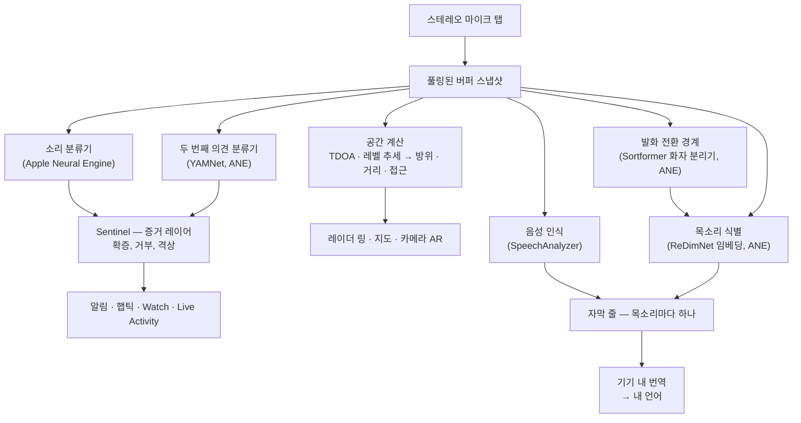
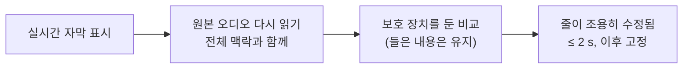
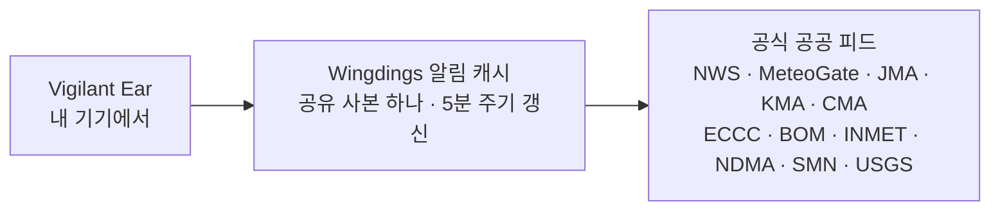

# Vigilant Ear 👂🛡️

*버전 1.1.9 기준 · 2026년 9월.*

## 들을 수 없는 사람을 위한 음향 레이더.

농인·난청인·CODA 커뮤니티를 위해 특별히 만든 앱입니다. 대부분의 소리 인식 앱은 소리가 *무엇*인지 알려 줍니다. **Vigilant Ear는 그 소리가 어디에 있는지, 누가 내는지, 무슨 말을 하는지 알려 줍니다** — iPhone을 주변의 소리를 묘사해 주는 실시간 음향 트라이코더로 바꿔 줍니다.

사이렌의 방향과 거리. 등 뒤에서 나는 노크 소리. 대화 속 사람들은 목소리마다 따로 받아 적혀 화면에 그려집니다 — 한 사람 한 사람에게 자막이 붙고 방향에 맞게 배치됩니다. 누군가 내가 읽지 못하는 언어로 말하고 있다면, 그 말이 **내 언어로 번역되어** 도착할 수 있습니다. 알림은 **잠금 화면, Dynamic Island, Apple Watch**까지 전달되므로 흘끗 보는 것으로 충분합니다.

중요한 것은 모두 기기에서 실행됩니다. 인식을 위해 오디오를 녹음하거나 업로드하지 않습니다. 어떤 기능도 소리를 듣는 데 의존하지 않습니다.

- 🧭 **감지를 넘어 방향까지.** *무엇이, 어디서, 누가,* 그리고 *무슨 말을 했는지* — 단순히 “소리가 났다”가 아닙니다.
- 📣 **이름 호명.** 내 이름, 아이, 파트너의 이름을 등록하세요 — “Marie 님 주문 나왔습니다”라는 말에 Watch가 톡 두드리며 어느 쪽인지 가리킵니다.
- 🔒 **설계부터 개인정보 보호.** 분류, 자막 생성, 번역은 iPhone에서 실행됩니다. 자막은 실시간으로 표시되고 곧 사라지며, 대화록 아카이브로 저장되지 않습니다.
- ⌚ **손목과 잠금 화면에서.** Apple Watch 방향 컴패니언 + Live Activity 덕분에 마지막 알림과 그 알림이 온 방향을 늘 한눈에 볼 수 있습니다.
- 🛰️ **여러 대의 휴대폰, 함께 쓰는 하나의 귀.** Constellation은 초광대역(UWB) iPhone들을 연결해, 각 기기가 듣는 소리를 합쳐 더 선명한 방향 그림을 만듭니다.
- 👁️ **농인 / 난청인 / CODA를 위해 만들었습니다.** 구별되는 햅틱, 고대비 화면, 색에 의존하지 않는 신호, 큰 탭 영역, 그리고 앱 전체에서 동작 줄이기 설정을 존중합니다.

---

## 누구를 위한 앱인가

- 소리에 대한 상황 인식을 원하는 **농인·난청인·CODA 사용자** — 켜 두고 믿을 수 있는 Home Watch(노크, 알람, 아기, 전화)와 Street Watch(사이렌, 접근).
- **방향과 화자 구분이 담긴 실시간 자막**, 또는 가까이 앉은 사람들의 말을 **기기 내 번역**으로 봐야 하는 모든 분.
- 기기 내 음원 위치 추정에 관심 있는 접근성 및 음향 연구 분야 사용자.

> Vigilant Ear는 접근성 **보조 도구**이며, 인증된 생명 안전 기기가 아닙니다.

---

## 주요 기능

### 🧭 소리를 봅니다 — 방향과 거리
Vigilant Ear는 iPhone의 마이크 두 개로 **소리의 각도와, 그 소리가 앞에 있는지 뒤에 있는지**를 측정하고, 그 값을 약 1도 이내로 안정되게 유지하며, 진행 방향이 위를 향하는 레이더 링과 지도에 실시간 마커로 표시합니다. 한 직선 위에 놓인 마이크 두 개는 그것만으로는 왼쪽과 오른쪽을 구별하지 못합니다 — 오른쪽 50°에서 온 소리와 왼쪽 50°에서 온 소리가 똑같이 아주 작은 시간 차로 도착하기 때문입니다 — 그래서 앱은 측정값과 함께 **반대쪽에 더 흐린 고스트**를 그리고, 손목을 한 번 돌리거나 두 번째 휴대폰이 있으면 어느 쪽인지 확정됩니다. 거리는 도로에서 보정한 곡선에 소리 크기를 대어 추정하며, 추정치임을 그대로 드러내 표시합니다: *≈ 50 ft*, 그리고 가능성이 높은 범위와 함께 — 앱을 읽는 언어가 아니라 지금 있는 나라의 단위로 표시됩니다. 움직여도 마커는 실제 세계의 위치를 유지합니다. 이것이 핵심입니다. 들을 수 없는 세계를 공간적으로 인식하는 것. (수치는 아래에 있습니다.)

### 🚨 중요한 소리를 인식하고 — 경고합니다
기기 내 분류기가 수백 가지 일상 소리를 식별하고 중요한 범주를 지켜봅니다. 바로 **사이렌, 알람 — 자동차 경보음 전용 클래스 포함 — 초인종/노크, 아기 울음소리, 근처의 사람, 악천후**입니다. 그중 하나가 감지되면 분명한 화면 알림, 선택 사항인 **푸시 알림**, 구별되는 **햅틱**을 받습니다 — 앱이 백그라운드에 있거나 휴대폰이 잠자기 상태일 때도 마찬가지입니다. 중요한 범주는 기본적으로 준비된 상태이므로, 알림을 켠다고 해서 “모두 꺼짐”에서 시작하지 않습니다. 알림 범주를 모두 끄면 백그라운드에 있는 동안 엔진이 완전히 휴면 상태로 들어가 배터리를 아낍니다. **Sentinel** 레이어는 방향, 움직임, 공공 피드 같은 독립적인 증거와 알림을 교차 확인하므로, 울리는 알림은 분류기 하나의 추측이 아니라 뒷받침된 결과입니다. 이 확인은 양방향으로 작동합니다. 노래 속 사이렌처럼 들리는 순간은 보류되지만, 음악 사이로 반복해 울리는 진짜 사이렌은 음악을 뚫고 알림을 보냅니다.

악천후 경보는 공식 공공 피드에서 옵니다 — 미국 **NWS**, 유럽 **MeteoGate**, **중국 CMA**, **한국 KMA**, **일본 JMA**, **캐나다 ECCC**, **호주 BOM**, **브라질 INMET**, **인도 NDMA**, **멕시코 SMN** — 모든 사용자에게 무료입니다. 멕시코 경보는 멕시코의 Servicio Meteorológico Nacional에서 CC BY 4.0 라이선스로 공개합니다. 피드는 지금 있는 곳을 담당하는 것들로 좁혀집니다. 일본에서는 JMA의 **사전 기상 정보**도 읽습니다 — 위험이 닥친 뒤 발표되는 경보만이 아니라, 태풍이나 폭우가 오기 며칠 전에 발표되는 알기 쉬운 말로 된 안내입니다 — 여기에 갑작스러운 폭우 정보와 산사태 정보도 더해집니다. 사전 안내는 진짜 경보에만 쓰는 소리와 진동 없이 조용히 표시됩니다.

### ⌚ Apple Watch + Live Activity — 한눈에 파악
- **Apple Watch 컴패니언** — 알림의 방향을 손목 위에서 가리켜 주므로, 한 번 보면 어디를 봐야 할지 알 수 있습니다. 새롭게 디자인된 Watch UI에는 앱의 귀 아이콘, 위협 HUD 레이아웃, 두 번 탭해 알림을 닫는 기능이 있습니다. Watch 앱이 열려 있지 않아도 알림에 방향 화살표가 표시될 수 있습니다.
- **Live Activity** — Vigilant Ear가 **잠금 화면**, **Dynamic Island**, **Watch 스마트 스택**에 머물러, 마지막 알림과 그 방위를 언제든 한눈에 볼 수 있습니다.
- **손목 위의 파트너 알림** — 연결된 Constellation 파트너의 휴대폰이 알림을 띄우면, 그 알림이 방향 정보까지 담아 내 Watch에도 도착할 수 있습니다. 안정성 개선 작업을 거쳐 컴패니언이 하루 종일 Watch 배터리를 가볍게 사용합니다.

### 💬 Speaker Mode — 방향까지 담은 실시간 자막 *(무료)*
**Speaker Mode**를 켜면 Vigilant Ear가 주변에서 말하는 사람들의 말을 받아 적어 **목소리마다 하나씩, 자막 블록**으로 보여 줍니다. 기기 내 화자 분리(diarization)가 목소리를 서로 구분해 — *누가* *무엇을* 말하는지 — 안쪽 링의 방향 신호와 함께 보여 줍니다. 지금 말하는 사람은 강조되고, 공간이 필요해지면 오래된 텍스트는 스크롤되어 사라집니다.

대부분의 자막 앱이 하지 않는 두 가지가 있습니다. **신뢰도에 대한 정직함** — 줄마다 붙는 은은한 품질 표시와 의심스러운 단어 아래의 점선 밑줄이, 어떤 줄을 믿어도 되고 언제 다시 확인해야 하는지 알려 줍니다 — 그리고 **자기 교정**: 문장이 확정된 직후 앱이 전체 맥락을 가지고 오디오를 다시 읽어, 놓치거나 잘못 들은 단어를 약 2초 안에 바로잡을 수 있으며, 그 뒤 텍스트는 고정됩니다.

**이름 호명**(환경설정, 직접 켜기 전까지는 꺼져 있음)은 등록해 둔 이름이 그 자막에 나오는지 지켜봅니다 — 내 이름, 아이 이름, 파트너 이름. 누군가 “Marie 님 주문 나왔습니다”라고 말하면, 자막 말풍선이 하나 더 생기는 것이 아니라 방향이 담긴 구별되는 햅틱과 Watch 알림을 받습니다. 그 말은 여전히 Speaker Mode에 발화로 표시됩니다. 이 탭은 상대가 *나에게* 말하고 있었다는 신호입니다.

**비속어를 가릴 수 있습니다**(환경설정 → 자막). 이 기능이 없으면 욕설은 누그러뜨릴 장치 없이 평범한 텍스트로 그대로 도착하고, 읽는 사람에게는 미리 눈을 돌릴 기회가 없습니다. 이 기능을 켜면 그런 단어가 기호로 바뀌어, 그 단어 없이도 문장이 읽힙니다. 무엇이 해당하는지는 저희가 만든 단어 목록이 아니라 기기 자체의 음성 인식기가 판단하므로, 받아 적는 언어를 그대로 따라갑니다. 만 18세 미만으로 선언된 계정에서는 항상 켜져 있으며 자물쇠가 표시됩니다. *이* 기기가 받아 적는 말에 적용되며, 페어링된 휴대폰에서 전달된 텍스트는 그쪽에서 받아 적은 것이므로 완성된 텍스트로 도착합니다.

**말하는 사람이 힘주어 말한 단어는 굵게 표시됩니다.** 소리 내어 말하면 “난 ‘그렇게’ 말한 적 없어”와 “난 그렇게 말한 적 없어”는 서로 다른 문장인데, 똑같이 적힌 받아쓰기에서는 그 차이가 완전히 사라집니다. 앱은 말하는 사람의 목소리가 음높이를 올린 단 하나의 단어를 찾아 굵게 표시합니다 — 한 줄에 많아야 하나이고, 확신이 없을 때는 아무것도 표시하지 않습니다. 엉뚱한 단어를 표시하면 그 사람이 하지 않은 말을 한 것처럼 만들기 때문입니다. 중국어와 일본어에서는 꺼져 있습니다. 이 언어들에서 음높이는 얼마나 힘주어 말했는지가 아니라 *어떤 단어인지*를 알려 주기 때문입니다.

자막은 무료이고, 자동 번역은 선택형 Power Pack+ 레이어입니다. 자막을 **Bluetooth 청각 보조기기로 소리 내어 읽어 주게** 할 수도 있습니다 — 무료이며, 환경설정에 있습니다. **방향 톤**(역시 무료, 환경설정 → 자막)은 화자가 어디에 있는지 알려 주는 오디오 신호를 원하는 쪽 귀에 선택적으로 더해 줍니다 — 보청기를 쓰거나 한쪽 귀로만 듣는 경우에 유용하며, 누구나 사용할 수 있습니다.

### 🌐 자동 번역 — 내 언어로, 실시간으로 *(Power Pack+)*
Speaker Mode가 켜져 있을 때 근처 사람이 다른 언어로 말하면, Vigilant Ear가 이를 감지해 그 사람의 자막을 **내 언어로** 보여 줄 수 있으며, 그 사람의 블록에는 원래 언어가 표시됩니다. 듣기 → 화자 분리 → 받아 적기 → 번역 → 표시로 이어지는 전체 과정은 **기기에서** 실행됩니다. 네트워크를 쓰는 순간은 Apple에서 언어 팩을 한 번 내려받을 때뿐이며, 지금 기다리는 것이 그 다운로드라면 번역되지 않은 텍스트만 보게 내버려 두지 않고 앱이 그렇다고 알려 줍니다. 상대의 언어를 미리 알거나 고를 필요가 없습니다.

이것은 현재 출시된 제품 중 **SF 속 만능 번역기**에 가장 가까운 것입니다 — 그냥 알아듣는 장치 말입니다. Vigilant Ear는 언어를 스스로 감지하고, 방 안의 모든 화자를 따라가며, 모두의 말을 내 언어 자막으로 보여 줍니다 — 이어폰도, 설정도 필요 없이, 내 기기에서.

```mermaid
graph LR
    A["그냥 듣기만"] --> B["언어 자동 감지"] --> C["목소리마다 분리"] --> D["방 전체가 내 언어 자막으로"]
```

### 🎵 음악 및 방송 인식 *(Power Pack+)*
**ShazamKit**이 주변에서 재생되는 음악을 식별하고 곡이 바뀌는 것을 추적합니다.

### 🎛️ Acoustic Scope — 엔지니어처럼 소리를 보기
주변 소리를 전문가 수준으로 보여 주는 실시간 화면입니다. 스펙트럼, 스펙트로그램, ⅓옥타브 RTA 대역, 크로마, 배음 부분음을 볼 수 있으며 — **누구나 무료**입니다. **부분음은 음악을 읽습니다:** 각 음에 음이름이 붙고 옆에 그 배음열이 함께 표시되며, 연기 감지기처럼 높은 소리도 실제 음높이로 이름이 붙습니다. 또 목표 음을 정하면 선으로 그려져, 그 선에 맞춰 노래하거나 음을 맞출 수 있습니다. 발열도 적습니다 — 아무리 오래 보고 있어도 스펙트로그램을 열어 두는 부담은 거의 없습니다. 나만의 맞춤형 팩을 학습시키기 위해 소리를 캡처하는 도구는 Power Pack+에 포함됩니다.

### 📦 맞춤형 사운드 팩 — 나의 세계를 가르치기 *(Power Pack+)*
동네 새소리부터 우리 건물의 현관 차임까지, 나에게 중요한 소리를 Vigilant Ear에 가르쳐 보세요. 추가 팩은 기본 감지 위에 쌓이므로, 새로운 소리가 사이렌과 알람을 밀어내는 일은 결코 없습니다. 단계별 안내가 앱에 들어 있습니다.

### 🛰️ Constellation — 여러 대의 iPhone, 함께 쓰는 하나의 귀 *(Power Pack+)*
초광대역(UWB)을 지원하는 iPhone(iPhone 11 이후 대부분의 모델)이 두 대 이상 있으면, **Constellation**이 이들을 페어링해 서로의 위치를 감지하고, 각 기기가 듣는 소리를 합쳐 소리가 어디서 오는지에 대한 하나의 더 정밀한 그림을 만듭니다 — 분산형 수동 청취 어레이입니다. 자막도 합쳐집니다. 각 휴대폰은 자기 마이크로 들은 말을 받아 적고, 그 단어들을 휴대폰 사이에서 맞춰 정렬해 화자에게 가장 가까운 휴대폰이 들은 내용을 반영합니다 — 한 휴대폰만 잡아낸 단어도 사라지지 않고 남습니다. 휴대폰끼리 **서로 직접** 연결됩니다 — 공유기도, 공유 Wi-Fi 네트워크도, 인터넷도 필요 없습니다. Wi-Fi가 켜져 있기만 하면 되며, AirDrop이 쓰는 것과 같은 피어 투 피어 링크로 연결됩니다. 적합한 하드웨어를 갖춘 기기에서만 사용할 수 있습니다. 피어가 연결된 시각보다 오래된 메시 자막은 다시 전송되지 않습니다.

**파트너 메시지** — 연결된 파트너의 휴대폰에 짧은 글을 보내면 상대의 자막 피드에 나타나며, 기기에서 상대의 언어로 번역되어 도착할 수 있습니다. 메시지 기능은 연령을 고려합니다. Apple의 Declared Age Range를 기반으로, 성인과 미성년자 사이의 메시지 주고받기는 두 사람이 모두 의도적으로 서로를 지정하지 않는 한 꺼진 상태로 유지됩니다. 알림과 자막은 결코 제한되지 않습니다 — 제한되는 것은 사람 사이의 메시지 주고받기뿐입니다.

### 🔗 Remote Link — 곁에 없는 사람에게 닿기 *(시작하려면 Power Pack+)*
보통은 전화 통화가 하던 일을 영상과 텍스트로 대신합니다. 내가 초대 코드를 보내면, 상대는 **Power Pack+ 없이도** Vigilant Ear 안에서 참여합니다. Constellation과 달리 가까이 있을 필요가 없습니다 — 두 사람이 어디에 있든 상관없습니다.

**어떤 순간에도 오디오를 사용하지 않습니다.** 영상과 텍스트뿐이므로 링크의 어느 쪽에서도 듣는 것에 의존하지 않으며 — 앱을 통해 누군가와 수어로 대화할 수 있는 방법도 됩니다. 앱 자체는 수어를 이해하지 못합니다. 영상을 전달할 뿐이고 나머지는 두 사람이 합니다. 네트워크가 허용하는 한 연결은 두 휴대폰 사이에서 직접 이루어지며, 앱은 연결이 **직접**인지 **중계**인지 분명하게 보여 주므로, 영상이 중계 서버를 거치고 있는지 언제나 알 수 있습니다.

**자막도 함께 전달됩니다.** 각 휴대폰이 받아 적은 내용이 상대 휴대폰에 나타나며, 필요하면 읽는 사람의 언어로 번역됩니다. 두 사람 중 누구든 링크를 — 영상과 자막 모두 — 일시 정지했다가 다시 이어갈 수 있고, 메인 화면에서 통화를 끊을 수 있습니다.

### 📷 카메라 AR — “소리 보기”
타이틀 레일의 카메라 필을 열어, 감지된 소리를 라이브 카메라 화면 속 실제 방위에 고정해 보세요. 마커는 화자별로, 또는 소리 범주와 방향별로 묶여 화면이 읽기 쉽게 유지되며, 조용해진 소리원은 시간이 지나면서 서서히 흐려집니다.

### 🗺️ 지도, 도로, 경로 예측
소리의 방위가 지도 위 실제 GPS 좌표로 투영됩니다. 차량 소리는 **근처 도로에 맞춰 배치**되고 경로가 예측될 수 있어, 지나가는 트럭이 건물을 뚫고 지나가는 것이 아니라 *도로를 따라* 움직이는 것으로 표시됩니다. (소방차 데모를 해 보세요.)

### 🪄 Feature Playground — 귀 없이도 확인하기
**Feature Playground**는 모두에게 공개되어 있습니다. 집과 거리 연습(노크, 알람, 아기, 사이렌, 날씨), 여러 휴대폰 및 대화 데모, 그리고 연습이 결코 실제 상황인 척하지 않도록 하는 분명한 워터마크가 있습니다. 패널을 닫으면 데모가 깔끔하게 정리됩니다(GPS 위치 위장이 남아 있거나 플래그가 남는 일이 없습니다).

### ♿ 접근성 최우선
농인 / 난청인 / CODA 사용자와 색각 이상 사용자를 위해 만들었습니다: **색에 의존하지 않는** 신호, **≥44 pt** 탭 영역, **동작 줄이기** 설정 존중, 아랍어 사용자를 위한 **오른쪽에서 왼쪽으로 읽는 레이아웃**, 다중 감각 알림(햅틱 + 시각 + Watch), 그리고 권한 상태를 분명한 초록 / 회색 / 빨강(그리고 짙은 주황색 “허용 안 됨”) 상태로 보여 주는 시작 확인 화면 — 마스터 알림 스위치 역할을 하는 알림 허용 여부도 여기에 포함됩니다.

---

## 무료 기능과 Power Pack+

안전 핵심 기능은 **영원히 무료**입니다:

- **Home Watch & Street Watch** — 주변 소리 알림(알람, 사이렌, 노크/초인종, 아기, 근처의 사람)을 화면, 햅틱, 선택형 푸시 알림으로 전달합니다.
- **실시간 자막** — Speaker Mode, 기기 내 처리, 하드웨어가 허용하는 곳에서는 방향 표시, 정직한 신뢰도 표시, 약 2초 내 자기 교정, Bluetooth 청각 보조기기로의 선택형 음성 출력, 그리고 방향 톤.
- **이름 호명** — 원할 때 직접 입력하는 이름(내 이름, 아이, 파트너). 일치하면 두 번째 자막이 아니라 방위가 담긴 Watch/휴대폰 알림이 옵니다.
- **Standing Watch** — 방 자체의 상태를 보여 주며, 설정할 것 없이 항상 켜져 있습니다. 방이 평소 패턴을 유지하는 동안은 청록색 램프가 꾸준히 켜져 있고, 무언가 달라지면 — 새로운 목소리, 갑작스러운 고요, 다가오는 무언가 — 황색으로 바뀝니다.
- **악천후 경보** — 내 지역에 해당하는 NWS, MeteoGate(유럽 — 저희의 5분 주기 경보 캐시에서 최신 상태로 제공), CMA, KMA, JMA(일본), ECCC(캐나다), BOM(호주), INMET(브라질), NDMA(인도), SMN(멕시코).
- **지진 알림(USGS, 전 세계)** — 근처에서 지진이 보고되면 진동으로 알려 주고, 흔들림을 느낀 지역을 지도에서 보여 줍니다. 공식 USGS 피드에서 오는 확인 정보이며 조기 경보가 아닙니다. 흔들림을 느꼈다면 그것이 무엇이었는지 알려 줍니다. 기기 내 깊은 울림(초저주파) 감지가 땅이 움직이는 순간 이 확인을 준비 상태로 만들 수 있습니다.
- **Feature Playground** — 분명한 ‘미리보기’ 워터마크가 붙은 연습 알림과 기능 미리보기.
- **Apple Watch 컴패니언 & Live Activity** — 한눈에 보는 방향과 마지막 알림.
- **Acoustic Scope** — 전문가급 실시간 소리 시각화, 누구나 무료. (학습용 캡처 도구는 Power Pack+에 포함됩니다.)

**Power Pack+는** 일회성 잠금 해제(**구독 아님**)이며 **90일 무료 체험**을 제공합니다. 다음과 같은 초능력을 더해 줍니다:

- **자동 번역** — 근처에서 들리는 말을 기기에서 내 언어로 번역합니다.
- **Constellation** — 초광대역(UWB)으로 여러 iPhone이 함께 듣는 기능, 파트너 메시지 포함.
- **Music ID** — ShazamKit 곡 인식.
- **맞춤형 사운드 팩** — 나만의 소리를 위해 직접 학습시키는 추가 분류기.

무료든 Power Pack+든, **인식을 위한 오디오는 기기에 머뭅니다** — 등급이 바꾸는 것은 어떤 기능이 잠금 해제되는지뿐이며, 원본 오디오가 분석을 위해 어디로 전송되는지는 결코 바꾸지 않습니다.

---

## 작동 방식 (내부 구조)

Vigilant Ear는 여러 층으로 쌓아 올린 **로컬 우선, 기기 내** 파이프라인입니다. 한 번 캡처한 뒤, 독립된 전문가들이 같은 소리를 읽고 서로의 작업을 점검하게 합니다. 원본 오디오는 우선순위가 높은 탭에서 캡처되어 **풀링된 버퍼 프리 리스트**로 복사되고(실시간 경로에서 메모리 할당 스래싱 없음), UI를 멈추지 않고 여러 갈래로 전달됩니다:

```mermaid
graph TD
    A["스테레오 마이크 탭"] --> B["풀링된 버퍼 스냅샷"]
    B --> C["소리 분류기<br/>(Apple Neural Engine)"]
    B --> Y["두 번째 의견 분류기<br/>(YAMNet, ANE)"]
    C --> S["Sentinel — 증거 레이어<br/>확증, 거부, 격상"]
    Y --> S
    S --> H["알림 · 햅틱 · Watch · Live Activity"]
    B --> D["공간 계산<br/>TDOA · 레벨 추세 → 방위 · 거리 · 접근"]
    D --> R["레이더 링 · 지도 · 카메라 AR"]
    B --> F["음성 인식<br/>(SpeechAnalyzer)"]
    B --> N["발화 전환 경계<br/>(Sortformer 화자 분리기, ANE)"]
    N --> E["목소리 식별<br/>(ReDimNet 임베딩, ANE)"]
    B --> E
    F --> G["자막 줄 — 목소리마다 하나"]
    E --> G
    G --> T["기기 내 번역<br/>→ 내 언어"]
```

어떤 모델도 혼자서는 신뢰하지 않습니다. **Sentinel** 레이어는 감지와 알림 사이에 자리합니다. 독립된 엔진들이 프레임마다 서로를 확증하거나 거부하며 — 거부에 맞서는 실제 증거가 반복해서 쌓이면(음악 사이로 울려 대는 진짜 사이렌), 증거가 이기고 알림이 울립니다.

자막에도 따로 두 번째 기회가 있습니다. 확정된 모든 문장은 메모리 속 짧은 오디오 링에서 전체 맥락과 함께 조용히 다시 읽힙니다 — 수정은 약 2초 안에 반영되고, 그 뒤 텍스트는 완전히 고정됩니다:

```mermaid
graph LR
    L["실시간 자막 표시"] --> K["원본 오디오 다시 읽기<br/>전체 맥락과 함께"] --> V["보호 장치를 둔 비교<br/>(들은 내용은 유지)"] --> W["줄이 조용히 수정됨<br/>≤ 2 s, 이후 고정"]
```

- **공간 계산** — FFT, 코히어런스 가중 도달 시간 차(Time Difference of Arrival, TDOA — 두 마이크가 일치하는 주파수 대역을 우선하고, 아주 작은 도달 지연을 방위로 바꿉니다), 그리고 레벨 추세에 기반한 접근 추적을 백그라운드 작업에서 수행합니다. 마이크 쌍은 고정된 방향 기준으로 읽으므로, 휴대폰을 세로로 들든 가로로 들든 방향 판단이 똑같이 작동합니다.
- **음성** — 받아쓰기에는 iOS 26 `SpeechAnalyzer` / `SpeechTranscriber`, 기기 내 번역에는 Apple의 **Translation** 프레임워크를 씁니다. 목소리 식별은 증거에 기반합니다. 독립된 여러 소리 구간에서 확인될 때만 실제 사람으로 인정하며, 불확실한 일치는 엉뚱한 이름을 추측하는 대신 미지정으로 표시합니다.
- **두 가지 질문에 두 가지 모델** — 목소리를 구별하려면 *화자가 언제 바뀌었는지*와 *그 화자가 누구인지*를 알아야 하며, 둘은 같은 문제가 아닙니다. **Sortformer** 스트리밍 화자 분리기가 발화 전환 경계를 표시하고, **ReDimNet** 임베딩이 각 구간 안의 목소리가 누구의 것인지 판단합니다. 경계에서 자르는 일은 생각보다 중요합니다. 두 사람에 걸친 구간에는 두 사람이 모두 들어 있고, 어떤 임베딩 모델도 나중에 그것을 되돌릴 수 없습니다. 두 모델 아래에는 음성 활동 감지라는 바닥이 깔려 있습니다 — 까다로운 공간에서 화자 분리기가 추측하는 대신 침묵하더라도 발화 전환은 여전히 잘리므로, 앱은 두 화자를 하나로 뒤섞는 대신 한 단계 낮은 성능으로 동작합니다.
- **음악 여부 판정** — 크로마 기반 **곡 시그니처 감지기**가 “정말 음악이 나오고 있는가?”라는 판단을 전담합니다. 범용 분류기는 조용한 방이나 사이렌을 “음악”으로 판단하기로 악명이 높기 때문입니다. Shazam은 시그니처가 정말 음악적인 무언가가 있다고 동의할 때에만 실행됩니다.
- **동시성** — Swift 6 격리 기능이 마이크 탭, 음향 계산, UI 렌더 루프를 깔끔하게 분리합니다.
- **효율** — 다운샘플링, 부하에 맞춰 조절되는 분류, 증거가 있을 때만 쓰는 네트워크 덕분에 항상 듣는 상태를 켜 둘 수 있을 만큼 가볍게 유지합니다.

날씨와 지진 알림은 오디오와 정반대의 길을 갑니다 — 내 소리에 관한 것은 무엇도 밖으로 나가지 않고, 알림 *데이터*만 들어옵니다. **모든** 공식 피드는 저희가 운영하는 작은 캐시를 거치므로, 공공 데이터를 한 번 가져와 모든 사용자에게 제공합니다 — 그리고 내 휴대폰은 결코 외국 정부의 서버에 접속하지 않습니다:

```mermaid
graph LR
    P1["Vigilant Ear<br/>내 기기에서"] --> W["Wingdings 알림 캐시<br/>공유 사본 하나 · 5분 주기 갱신"]
    W --> N["공식 공공 피드<br/>NWS · MeteoGate · JMA · KMA · CMA<br/>ECCC · BOM · INMET · NDMA · SMN · USGS"]
```

---

## 휴대폰이 들을 수 있는 것 — 실측 결과

iPhone에는 약 6인치 간격으로 떨어진 마이크 두 개, 기압계, 그리고 아주 정확한 시계가 있습니다. 이것만으로 소리가 어느 쪽에 있는지, 대략 얼마나 멀리 있는지, 나를 향해 다가오는지, 방금 문이 열렸는지를 알려 줄 수 있습니다. 아래는 각각이 얼마나 정확한지, 어떻게 확인했는지, 그리고 그 소리를 직접 들을 수 없다면 왜 중요한지입니다. 방향과 관련 수치는 2026년 9월에 iPhone 17과 iPhone 16 Pro Max에서 측정했습니다. 거리는 본질적으로 추정치로 남습니다 — 화면에서도 그렇게 밝힙니다.

**방향 — 2도 안팎의 정밀도.** 소리는 위쪽 마이크에 아래쪽 마이크보다 먼저, 혹은 나중에 도착하며, 앱은 그 시간 차로 소리가 휴대폰의 축에서 얼마나 벗어나 있는지, 그리고 앞인지 뒤인지를 계산합니다. 휴대폰의 두 채널은 있는 그대로의 마이크 신호가 아니라 처리된 스테레오 이미지이며, 방이 시끄러울 때마다 그 이미지에는 자체적인 고정 패턴이 더해집니다. 이제 앱은 실행 직후 조용한 몇 초 동안 그 패턴을 학습하고, 방향을 읽기 전에 그 패턴을 제거합니다.

| 측정한 항목 | 결과 |
|---|---|
| 시뮬레이션한 방 96곳의 중앙값 오차(조용한 사무실부터 5 dB SNR의 단단한 벽으로 된 방까지) | 1.0° |
| 책상 위의 iPhone 17, 실내 소음 켬, 스피커는 축에서 30° 벗어난 위치 | 측면 평면 기준 61.7°로 측정(예상값 60°), 흔들림 1.6° |
| 같은 조건, 스피커가 휴대폰 옆면 바로 앞 | 4.5°로 측정(예상값 0°), 흔들림 2.2° |
| 같은 조건, 스피커가 바로 정면 | 모든 측정값이 최대 지연, 예상대로 |
| 소리가 아니라 이미지 자체의 패턴에 걸린 측정값 | 어떤 각도에서도 없음 |

*왜 중요한가:* 사이렌을 들을 수 없다면 “등 뒤, 한쪽 옆”이라는 정보가 어디를 봐야 할지 알려 줍니다. 흔들림 없는 측정값도 줄자로 대조해 본 뒤에야 믿을 가치가 있습니다. 이 측정값은 두 번 대조했고, 두 번째는 첫 번째 검증이 너무 후했던 것으로 드러난 뒤였습니다.

**거리 — 추정치임을 그대로 보여 줍니다.** 마이크 하나로는 거리를 잴 수 없고 소리 크기만 잴 수 있으며, 멀리 있는 시끄러운 트럭은 가까이 있는 조용한 차처럼 들릴 수 있습니다. 앱은 실제 도로에서 맞춘 곡선을 이용해 소리 크기로부터 거리를 추정한 다음, 신중한 사람이 말하듯 표현합니다: *약 50 ft, 아마도 25에서 100 사이.*

| 측정한 항목 | 결과 |
|---|---|
| 보정 곡선에 다시 돌려 본 실제 차량 감지 건수 | 1,131 |
| 실제로 지나던 100피트 도로 안에 들어온 비율 | 73% |
| 먼 차선의 차량 | 줄자로 73 ft와 85 ft인 차량을 78 ft와 87 ft로 추정 |

도로(도심 교차로)는 차선별로 측정했으며, 곡선이 틀릴 때는 가까운 쪽으로 틀립니다. 보정값은 자동 테스트로 고정해 두어 모르는 사이에 어긋날 수 없습니다. 연기 감지기처럼 내 공간 안에 있는 알람에는 거리 수치를 아예 표시하지 않습니다 — 이미 나와 같은 방에 있기 때문입니다.

**움직임 — 나를 향해 다가오는지.** 자동차와 사이렌은 소리가 커질수록 대개 가까워지고 있다는 뜻입니다. 앱은 몇 초 동안 소리 레벨이 얼마나 빨리 올라가는지 지켜봅니다. 초당 약 1.5 dB의 꾸준한 상승(분명하고 일정하게 커지는 소리)은 접근, 같은 폭의 하강은 멀어짐을 뜻하며, 변화가 멈춘 소리는 약 4초 뒤에 어느 쪽으로도 판정되지 않습니다. 짧은 경적이나 문이 쾅 닫히는 소리 같은 한순간의 큰 소리로는 작동하지 않습니다. 물리 법칙과 9개의 자동 테스트를 토대로 만들었으며, 도로에서 녹음한 차량 통과 소리가 다음 현장 검증입니다.

**방 안의 공기 — 문에는 고유한 시그니처가 있습니다.** 기압계는 약 14피트 떨어진 곳에서 문이 열리는 것을 알아챌 수 있습니다. 문이 움직이면 기압이 떨어졌다가, 문이 닫히면 다시 올라옵니다. 조용했던 14시간과 문 이벤트 15회 동안, 모든 문이 이 두 단계 모양을 만들었고 집 안의 다른 어떤 것도 그런 모양을 만들지 않았습니다.

| 이벤트 | 기압 변화율 | 모양 |
|---|---|---|
| 현관문, 열고 닫음, ×10 | 0.6–1.8 Pa/s | 하강 후 반등, ~5 s 간격 |
| 현관문, 세게 닫음, ×5 | 1.1–2.5 Pa/s | 같은 쌍, 더 큰 폭 |
| 밤새 켜졌다 꺼지는 에어컨, ×8 | 0.11–0.46 Pa/s | 몇 분에 걸친 느린 변화, 두 휴대폰에서 동일 |
| 조용한 방 | ~0.02 Pa/s | 없음 |
| 옆을 지나감, 재채기 | — | 모션 센서가 알아채고 휴대폰이 무시함 |

방을 밀폐하지 않는 방충문은 보이지 않았습니다 — 정확히 그래야 하는 대로입니다. 현재 기압 변화는 지도에 깊은 울림으로 표시될 수 있습니다. 조용한 밤 전용 문 알림은 측정과 설계를 마쳤지만, 아직 일상적인 기본 기능은 아닙니다.

**Constellation — 휴대폰 두 대가 어느 쪽인지 확정합니다.** 메시에 있는 각 휴대폰은 자기 자리에서 소리 쪽으로 선을 긋고, 그 선들은 한쪽에서만 깔끔하게 교차합니다. 교차하면 고스트가 사라지고 앱은 다시 왼쪽인지 오른쪽인지 말할 수 있습니다. 시뮬레이션에서 **40미터 떨어진** 휴대폰 두 대는 50미터 거리의 사이렌 위치를 약 2미터 이내로 찾아냅니다.

**이 수치들을 믿을 수 있게 되는 과정.** 모든 수치는 같은 세 관문을 순서대로 통과했습니다. 정답을 미리 아는 시뮬레이션 방, 앱을 속일 만한 바로 그 상황을 재현해 변경이 있을 때마다 실행되는 작은 자동 테스트, 그리고 실제 책상 위의 실제 휴대폰과 손으로 잰 거리입니다. 세 번째 관문을 통과하기 전에는 어떤 것도 정확하다고 보지 않습니다. 소리를 들을 수 없는 사람에게는 앱의 말이 유일한 말입니다 — 그러니 그 신뢰는 실험실이 신뢰를 얻는 방식으로 얻어야 합니다.

엔지니어를 위한 더 자세한 설명: [물리학](https://vigilantear.com/en/physics/) — TDOA, 거리, 움직임, Constellation, 기압 감지를 다루며, 모든 수치에 MEASURED / BENCHED / MODELLED 태그가 붙어 있습니다.

---

## 개인정보 보호

- **핵심 파이프라인은 언제나 기기에서.** 분류, 공간 계산, 받아쓰기, 화자 분리, 번역은 iPhone에서 실행됩니다. 인식을 위해 원본 오디오를 녹음하거나 업로드하지 않습니다.
- **자막은 일시적입니다.** 실시간 자막은 세션 동안 메모리에만 머물며, 내보낸 디버그 로그에는 자막 텍스트가 포함되지 않습니다.
- **광고 및 행동 분석 SDK 없음.** 제한적인 네트워크 사용은 지도, 공공 날씨 피드, 선택 사항인 Shazam 지문, 도로 정보, App Store 구매에만 해당합니다 — 전체 방침을 참고하세요.

자세한 내용: [개인정보 처리방침](/ko/privacy/) · [서비스 약관](/ko/terms/) · [지원](/ko/support/)

---

## 하드웨어 및 플랫폼

- **iPhone(모든 기능).** 세로와 가로 방향 모두에서 작동합니다 — 원하는 대로 들고 쓰세요. 방향 탐지에는 스테레오 마이크가 필요합니다. **iPhone 13 이상**을 권장합니다.
- **Apple Watch.** 방향 화살표가 표시되는 컴패니언 알림. Live Activity / 스마트 스택과 함께 작동합니다.
- **iPad(네이티브).** 적응형 레이아웃: 큰 화면에서는 실시간 자막이 지도 옆 반투명 패널에 표시되고, 아무도 말하지 않으면 패널이 접혀 들어갑니다. 단일 채널 마이크 → 완전한 방향 표시 없이 자막 제공.
- **Constellation**에는 **초광대역(UWB) 지원**이 필요합니다 — iPhone 11 이후 모델이며, SE와 “e” 모델은 제외됩니다. Wi-Fi 네트워크는 필요하지 **않습니다**: Wi-Fi가 켜져 있으면 휴대폰끼리 서로를 직접 찾으므로, 휴대폰들이 서로 가까이 있는 한 공유기도 인터넷도 없이 Constellation이 작동합니다.
- **Android.** 핵심 레이더, 알림, 자막, 날씨 기능을 갖춘 별도 빌드이며, Constellation 메시는 iOS가 우선입니다. Android가 iOS와 같은 기능을 갖춰 가는 대로 제품 사이트의 업데이트를 확인하세요.

---

## 현지화

인터페이스, 알림, 자막까지 **영어, 스페인어, 포르투갈어(브라질), 프랑스어, 독일어, 이탈리아어, 튀르키예어, 아랍어, 일본어, 중국어(간체), 중국어(번체), 한국어, 러시아어, 힌디어, 루마니아어**(15개 언어)로 완전히 현지화되어 있습니다. 시스템 언어 설정 또는 앱 안에서 직접 선택한 언어를 따릅니다. 루마니아어 자막은 기기에서 작동하지만, Apple Translate가 루마니아어를 지원하지 않으므로 이 언어에서는 자동 번역이 원문을 그대로 보여 줍니다.

---

## 현황 및 면책 조항

Vigilant Ear는 **실험적인 음향 접근성 보조 도구**이며, 인증된 생명 안전 장치가 아닙니다. 위치 추정의 정밀도는 주변 환경, 날씨, 바람, 마이크 하드웨어에 따라 달라집니다. **평소처럼 주변 환경에 늘 주의를 기울이세요** — 이 앱을 유일한 안전 정보원으로 삼지 마세요.

일부 기능(카메라 AR 마커, Apple이 승인할 경우의 중요 알림 권한 업그레이드, 고급 다중 팩 소리 제작)은 계속 발전하고 있습니다. 무료인 Home / Street watch와 실시간 자막은 첫날부터 믿고 쓸 수 있는 제품입니다.

---

**연락처:** [vigilantear@wingdingssocial.com](mailto:vigilantear@wingdingssocial.com)

농인·난청인(D/HH) 커뮤니티와 음향 연구를 위해 ❤️로 만들었습니다.

    
  <strong>© 2026 Wingdings, Inc.</strong> 
  모든 권리 보유. 
  특허 출원 중

