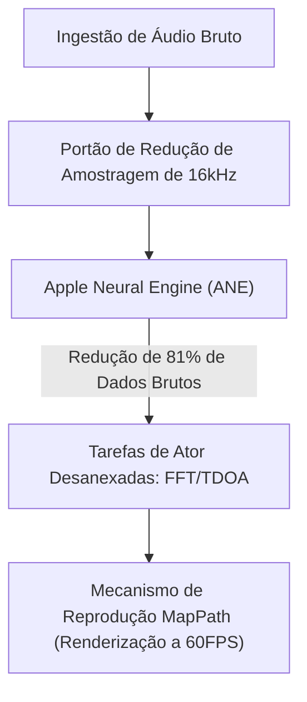

# VigilantEar 👂🛡️ (Edição Apple)

**Data de Vigência:** 6 de junho de 2026

**VigilantEar** é uma ferramenta avançada de pesquisa acústica e acessibilidade para iOS de altíssimo desempenho, projetada para fornecer consciência direcional e espacial em tempo real para a comunidade surda e com deficiência auditiva (D/HH). O software de reconhecimento de som tradicional identifica apenas *o que* é um som; VigilantEar atua como um radar tático abrangente, combinando aprendizado de máquina computado na borda com física acústica sofisticada para rastrear exatamente *de onde* um som se origina, sua distância estimada e sua trajetória absoluta.

---

## 🌍 Alcance Global e Localização

Para apoiar os usuários em todo o mundo, a plataforma apresenta uma matriz de localização nativa completa que suporta:

- **Inglês**
- **Espanhol (Español)**
- **Português (Português)**
- **Chinês (简体中文)**
- **Francês (Français)**
- **Alemão (Deutsch)**
- **Japonês (日本語)**

Todas as sobreposições táticas, alertas de HUD e menus de preferências se ajustam dinamicamente às localidades do sistema.

---

## 🚀 Principais Recursos e Capacidades

- **Gating de Energia Inteligente (Smart Power Gating)**: Para maximizar a longevidade da bateria e proteger os recursos do sistema, o sistema implementa um monitor em segundo plano condicional. Se as cinco categorias principais de alertas de emergência forem desativadas pelo usuário, os loops de ingestão de microfone e os mecanismos de processamento entram automaticamente em hibernação completa enquanto estiverem em segundo plano.
- **Simulação Tática Cinematográfica**: Inclui um robusto conjunto de simulação no dispositivo que permite aos usuários testar assinaturas hápticas e respostas visuais para todas as cinco faixas críticas de `.emergency` (emergência) — Sirenes, Alarmes, Campainhas, Pessoas Próximas e Clima Severo — sem exigir gatilhos acústicos no mundo real. A Simulação de Caminhão de Bombeiros opera de forma segura em um mecanismo de reprodução de física cinematográfica desacoplado a 60FPS, garantindo interações de mapa visualmente impressionantes, independentemente da sondagem acústica.
- **Rastreador de Múltiplos Alvos (Multi-Target Tracker - MTT)**: Isola e rastreia simultaneamente assinaturas de sons ambientais independentes usando marcadores de sessão UUID exclusivos combinados com mapeamento de persistência física.
- **Integração com ShazamKit**: Identificação de música ambiental em tempo real mapeada dinamicamente no radar espacial.
- **Ajuste Geográfico de Estradas e Mecanismo de Física**: Projeta direções matemáticas acústicas relativas em coordenadas GPS globais, ajustando inteligentemente vetores de veículos em tempo real a ruas verificadas via integração com MapKit e prevendo seu caminho usando o `VehiclePathPredictor` dedicado.

---

## 🧬 Arquitetura Principal e o Mecanismo Matemático Neural

O VigilantEar utiliza uma **Arquitetura de Push SoundML** personalizada, construída inteiramente em torno das garantias de desempenho e simultaneidade (concurrency) do hardware iOS moderno.

## ⚡ Desacoplamento Arquitetônico

Para manter uma thread de interface de usuário (UI) a 120Hz completamente desbloqueada enquanto lida continuamente com uma entrada de alta frequência e desenho complexo de mapas, a plataforma usa uma separação estrita de preocupações por meio do isolamento do Swift 6:

- **Registro de Sessão MapPath (DisplayLink)**: Apresenta um mecanismo CADisplayLink desacoplado que isola as atualizações de exibição do MapKit do processamento acústico, garantindo um deslizamento de marcador suave a 60 quadros por segundo, trilhas Doppler em desvanecimento e rastreamento cinematográfico de objetos.
- **MicrophoneManager (MainActor)**: Isola estritamente propriedades vinculadas à interface do usuário, estado de orientação do dispositivo e métricas de localização para conduzir o HUD sem problemas.
- **AcousticEngine (Ator Não-Isolado / Ator de Segundo Plano)**: Gerencia os estados de baixo nível do AVAudioEngine e as operações de hardware. Os buffers de ingestão são profundamente copiados diretamente na thread de captura de alta prioridade, passando instantâneos diretamente para os atores de processamento sem nunca forçar um salto de thread ou travar o Main Actor, eliminando completamente micro-gaguejos (micro-stutters).

### 🧠 Minimização Matemática

- **Descarregamento e Redução**: Os quadros de áudio passam por um rigoroso portão de redução de amostragem de 16kHz antes do processamento, cortando as pegadas de dados brutos em 81% antes que os vetores de classificação sejam processados pela Apple Neural Engine (ANE).
- **Matemática Espacial Paralela**: Pipelines matemáticos de alto desempenho (incluindo Transformadas Rápidas de Fourier (FFT), cálculos de Diferença de Tempo de Chegada (TDOA) e algoritmos de rastreamento Doppler) são executados inteiramente dentro de threads assíncronas desanexadas.

### 📊 Benchmarks de Desempenho

- **Modo Ativo**: Oferece rastreamento de HUD ao vivo abrangente e trilhas de mapa preditivas a 60FPS em um tamanho de apenas 6% de CPU em um processador padrão de 6 núcleos.
- **Modo Minimizado / Segundo Plano**: Quando o aplicativo é minimizado, a computação cai mais de 33%, sustentando uma vigilância ambiental absoluta em apenas 4% da utilização da CPU, com impacto térmico insignificante.

---

## 🛠️ Pilha Técnica (2026)

- **Linguagem**: Swift 6 (Concorrência rigorosa, modelos Sendable verificados, isolamento de Ator)
- **Frameworks**: SwiftUI, MapKit (Sobreposições de Anotação e Linha do Tempo), Accelerate Framework (vDSP), SoundML
- **Linha de Base de Hardware**: iPhone 13 ou mais recente (Alinhamento de microfone estéreo necessário para precisão de direção TDOA)

---

## 📊 Proteções de Privacidade e Segurança

- **Isolamento Local-First**: Todas as classificações de áudio, matemática espectral e projeções de direção ocorrem exclusivamente no dispositivo. Fluxos de áudio brutos nunca são gravados, armazenados em cache ou transmitidos sob nenhuma condição.
- **Sem Telemetria ou Diagnósticos Remotos**: O VigilantEar foi projetado para funcionar de forma totalmente local no seu dispositivo. Não coletamos, transmitimos ou armazenamos nenhuma telemetria remota, logs de falhas, registros de diagnóstico ou estatísticas de uso em nossos servidores.

---

## ⚖️ Aviso Legal

O VigilantEar é um auxílio de acessibilidade espacial e pesquisa acústica experimental. Não é certificado como um utilitário de segurança de vida. A resolução de rastreamento pode flutuar dinamicamente com base na topologia regional, clima predominante, condições de vento e calibração de hardware do microfone. Os usuários devem sempre manter a consciência ambiental normal.

**E-mail de Contato:** [vigilantear@wingdingssocial.com](mailto:vigilantear@wingdingssocial.com)

O VigilantEar é uma ferramenta de acessibilidade construída com cuidado. Por favor, use-o com responsabilidade.

Feito com ❤️ para a comunidade D/HH e pesquisa acústica.

© 2026 Wingdings, Inc.  
Todos os direitos reservados.
