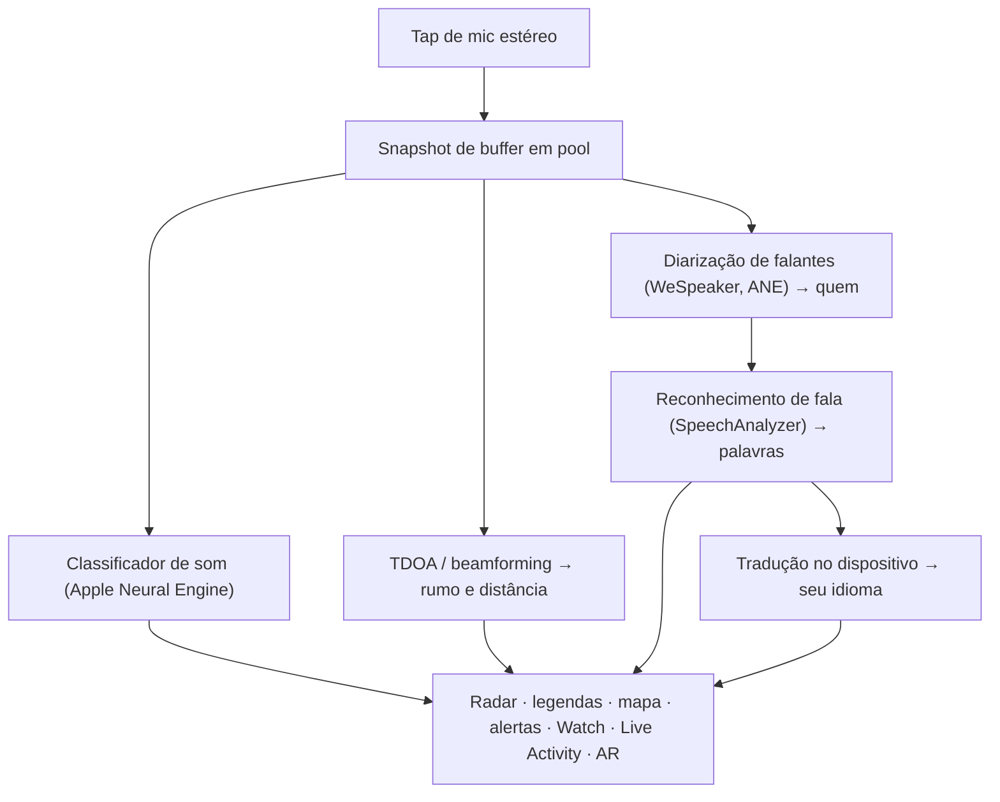

# Vigilant Ear 👂🛡️

*Um radar acústico para quem não consegue ouvir.*

Um app feito especificamente para a comunidade Surda e com deficiência auditiva. A maioria dos apps de reconhecimento de som diz *o que* é um som. **O Vigilant Ear diz onde ele está, quem o está fazendo e o que estão dizendo** — transformando um iPhone em um tricorder sônico em tempo real que descreve o som ao seu redor.

A direção e a distância de uma sirene. Uma batida atrás de você. As pessoas em uma conversa, desenhadas como vozes transcritas separadas — cada uma com legenda e posicionamento direcional. Se alguém fala um idioma que você não lê, as palavras podem chegar **traduzidas para o seu.** Os alertas chegam à sua **Tela de Bloqueio, Dynamic Island e Apple Watch**, para que um olhar seja suficiente.

Tudo o que importa roda no dispositivo. O áudio não é gravado nem enviado para reconhecimento. Nada depende de ouvir algo.

- 🧭 **Direção, não só detecção.** *O quê, onde, quem* e *o que foi dito* — não apenas “um som aconteceu.”
- 🔒 **Privado por design.** Classificação, legendas e tradução rodam no seu iPhone. As legendas são ao vivo e efêmeras; não são salvas como um arquivo de transcrição.
- ⌚ **No seu pulso e na Tela de Bloqueio.** O companion de direção no Apple Watch + Live Activity mantêm o último alerta e de onde veio a um olhar de distância.
- 🛰️ **Mais telefones, um ouvido compartilhado.** O Constellation liga iPhones com Ultra-Wideband para fundir o que cada um ouve em um quadro direcional mais nítido.
- 👁️ **Feito para Surdos / HoH.** Hápticos distintos, visuais de alto contraste, pistas independentes de cor, alvos de toque grandes e respeito ao Reduzir Movimento em todo o app.

---

## Para quem é

- **Usuários Surdos e com deficiência auditiva** que querem consciência situacional do som — Home Watch (batida, alarme, bebê, telefone) e Street Watch (sirene, aproximação) que você pode deixar ligados e confiar.
- Qualquer pessoa que precise de **legendas ao vivo com direção e separação de falantes**, ou **tradução no dispositivo** de pessoas sentadas por perto.
- Usuários de acessibilidade e pesquisa acústica interessados em localização de som no dispositivo.

> O Vigilant Ear é um **auxílio** de acessibilidade, não um dispositivo certificado de segurança de vida.

---

## O que ele faz

### 🧭 Ele enxerga o som — direção e distância
Usando os microfones estéreo do iPhone, o Vigilant Ear estima o **rumo e a distância aproximada** dos sons ao seu redor e os posiciona como marcadores ao vivo em um anel de radar com orientação de cabeçalho e no mapa. Mova-se, e os marcadores mantêm sua posição no mundo real. Este é o núcleo: consciência espacial de um mundo que você não pode ouvir.

### 🚨 Ele reconhece sons importantes — e avisa você
Um classificador no dispositivo identifica centenas de sons cotidianos e monitora as categorias críticas — **sirenes, alarmes, campainhas/batidas, choro de bebê, uma pessoa por perto e clima severo.** Quando um dispara, você recebe um alerta claro na tela, **notificação push** opcional e um **háptico** distinto — mesmo com o app em segundo plano ou o telefone dormindo. As categorias críticas vêm prontas por padrão, para que habilitar notificações não signifique “tudo desligado.” Desative todas as categorias de alerta e o motor hiberna completamente em segundo plano para economizar bateria.

Os avisos de clima severo vêm de feeds CAP públicos oficiais — **NWS** dos EUA, **MeteoGate** da Europa, **CMA** da China e **KMA** da Coreia — gratuitos para todos os usuários. Os feeds são restritos aos que cobrem onde você está.

### ⌚ Apple Watch + Live Activity — olhe e saiba
- **Companion do Apple Watch** — a direção de um alerta aponta no seu pulso, para que um olhar diga para onde olhar. UI do Watch redesenhada com o ícone de orelha do app, layout de HUD de ameaça e toque duplo para minimizar. Os alertas ainda podem mostrar a seta de direção quando o app do Watch não está aberto.
- **Live Activity** — o Vigilant Ear permanece na sua **Tela de Bloqueio**, na **Dynamic Island** e no **Watch Smart Stack**, para que o último alerta e seu rumo estejam sempre a um olhar de distância.

### 💬 Speaker Mode — legendas ao vivo e direcionais *(grátis)*
Ative o **Speaker Mode** e o Vigilant Ear transcreve as pessoas falando perto de você em **blocos de legenda, um por voz.** A diarização de falantes no dispositivo mantém as vozes distintas — *quem* está dizendo *o quê* — com uma pista direcional no anel interno. O falante ao vivo é destacado; textos mais antigos rolam conforme o espaço é necessário. As legendas são grátis; a tradução automática é a camada opcional do Power Pack+.

### 🌐 Speaker Auto-Translate — seu idioma, ao vivo *(Power Pack+)*
Com o Speaker Mode ligado, quando uma pessoa por perto fala outro idioma, o Vigilant Ear pode detectá-lo e renderizar as legendas **no seu idioma**, com o idioma de origem mostrado no bloco. A cadeia — ouvir → separar falantes → transcrever → traduzir → exibir — roda **no dispositivo**; o único momento de rede é um download único de pacote de idioma da Apple. Você não precisa saber ou escolher o outro idioma antes.

### 🎵 Consciência de música e transmissão *(Power Pack+)*
O **ShazamKit** identifica músicas tocando ao seu redor e acompanha mudanças de faixa. Quando uma voz parece vir de uma TV ou rádio em vez de uma pessoa na sala, ela é marcada com um **📻** — as palavras ainda aparecem; são rotuladas honestamente.

### 🛰️ Constellation — vários iPhones, um ouvido compartilhado *(Power Pack+)*
Com dois ou mais iPhones com Ultra-Wideband (a maioria desde o iPhone 11), o **Constellation** os emparelha para que possam perceber a posição um do outro e fundir o que cada um ouve em um quadro único e mais preciso de onde um som está vindo — um array de escuta passiva e distribuída. Restrito a dispositivos com o hardware adequado. Legendas de malha mais antigas do que o horário de conexão de um peer não são retransmitidas.

### 📷 Camera AR — “ver o som” *(prévia)*
Abra a pílula da câmera na barra de título e fixe sons detectados no seu rumo real na visualização ao vivo da câmera. Os marcadores se agrupam por falante ou por categoria de som e direção para manter a vista legível; as fontes desvanecem com a idade quando ficam quietas.

### 🗺️ Mapas, vias e previsão de trajeto
Os rumos de som são projetados em coordenadas GPS reais no mapa. Sons de veículos podem ser **encaixados nas ruas próximas** e seus trajetos previstos, de modo que um caminhão passando aparece se movendo *pela estrada* em vez de atravessar prédios. (Experimente a demo do caminhão de bombeiros.)

### 🪄 Demo Mode — comprove sem ouvidos
O **Demo Mode** é público para todos: prática Home & Street (batida, alarme, bebê, sirene, clima), demos multi-telefone e de conversa, e uma marca d’água clara **DEMO:** para que a prática nunca finja ser um evento ao vivo. Fechar o painel desmonta as demos de forma limpa (sem spoof de GPS preso, sem flags sobrando).

### ♿ Acessibilidade em primeiro lugar
Feito para usuários Surdos / com deficiência auditiva e daltônicos: pistas **independentes de cor**, alvos de toque **≥44 pt**, respeito a **Reduzir Movimento**, alertas multimodais (háptico + visual + Watch) e uma tela de verificação na inicialização que mostra o status das permissões com estados claros verde / cinza / vermelho (e “não permitido” em laranja queimado) — incluindo a concessão de notificação que atua como interruptor mestre de alertas.

---

## Grátis e Power Pack+

O núcleo de segurança é **grátis, para sempre**:

- **Home Watch e Street Watch** — alertas de som local (alarmes, sirenes, batidas/campainhas, bebê, pessoa por perto) com entrega na tela, háptica e push opcional.
- **Legendas ao vivo** — Speaker Mode, no dispositivo, direcional onde o hardware permite.
- **CAP de clima severo** — NWS, MeteoGate, CMA, KMA para a sua região.
- **Demo Mode** — alertas de prática e prévias de recursos com marca d’água DEMO.
- **Companion do Apple Watch e Live Activity** — direção e último alerta de um olhar.

O **Power Pack+** é um desbloqueio único (**não é assinatura**) com um **teste gratuito de 90 dias**. Ele adiciona os superpoderes:

- **Speaker Auto-Translate** — tradução no dispositivo da fala próxima para o seu idioma.
- **Constellation** — audição compartilhada multi-iPhone via Ultra-Wideband.
- **Music ID** — reconhecimento de músicas com ShazamKit.

Grátis ou Power Pack+, **seu áudio permanece no dispositivo para reconhecimento** — o nível só muda quais recursos estão desbloqueados, nunca para onde o áudio bruto é enviado para análise.

---

## Como funciona (por baixo do capô)

O Vigilant Ear é um pipeline **local-first, no dispositivo**. O áudio bruto é capturado em um tap de alta prioridade, copiado para uma **lista livre de buffers em pool** (sem thrash de alocação no caminho em tempo real) e distribuído a processadores independentes sem travar a UI nem interromper o streamer:

- **Matemática espacial** — FFTs, Time-Difference-of-Arrival e rastreamento Doppler em tarefas em segundo plano.
- **Fala** — `SpeechAnalyzer` / `SpeechTranscriber` do iOS 26 para transcrição; embeddings **WeSpeaker** para identidade de voz; framework **Translation** da Apple para tradução no dispositivo.
- **Concorrência** — isolamento do Swift 6 mantém o tap do microfone, a matemática acústica e o loop de renderização da UI limpos e separados.
- **Eficiência** — downsampling e classificação adaptativa à carga mantêm o sempre-ouvir leve o suficiente para deixar ligado.

---

## Privacidade

- **No dispositivo, sempre, para o pipeline central.** Classificação, matemática espacial, transcrição, diarização e tradução rodam no seu iPhone. O áudio bruto não é gravado nem enviado para reconhecimento.
- **As legendas são efêmeras.** As legendas ao vivo ficam na memória durante a sessão; logs de debug exportados não incluem texto de legenda.
- **Sem SDKs de publicidade ou análise comportamental.** O uso limitado de rede é apenas para mapas, feeds públicos de clima, fingerprints opcionais do Shazam, contexto de vias e compras na App Store — veja a política completa.

Detalhes completos: [PRIVACY.md](PRIVACY.md) · [TERMS.md](TERMS.md) · [SUPPORT.md](SUPPORT.md)

---

## Hardware e plataformas

- **iPhone (experiência completa).** Microfones estéreo necessários para localização direcional. Recomendado **iPhone 13 ou mais recente**.
- **Apple Watch.** Alertas companion com seta de direção; funciona com Live Activity / Smart Stack.
- **iPad (focado em legendas).** Mics de canal único → legendas sem direção completa.
- **Constellation** precisa de **Ultra-Wideband** — iPhone 11 ou posterior, excluindo modelos SE e “e”.
- **Android.** Build separado com radar central, alertas, legendas e clima; a malha Constellation é iOS-first. Veja atualizações do site do produto conforme a paridade Android avança.

**Versão de marketing atual da Apple:** 1.0.7 (em andamento / trilha de lançamento). Feito para iOS moderno (era SpeechAnalyzer).

---

## Localização

Totalmente localizado — interface, alertas e legendas — em **inglês, espanhol, português (Brasil), francês, alemão, árabe, japonês, chinês simplificado e coreano** (9 idiomas). Segue o locale do sistema ou uma escolha manual no app.

---

## Status e aviso

O Vigilant Ear é um **auxílio experimental de acessibilidade acústica**, não um utilitário certificado de segurança de vida. A resolução de localização varia com o ambiente, clima, vento e hardware do microfone. **Sempre mantenha sua consciência ambiental normal** — não dependa dele como sua única fonte de informação de segurança.

Algumas capacidades (marcadores de câmera AR, upgrade de entitlement de Critical Alerts quando concedido pela Apple, autoria avançada de packs de som multi) continuam evoluindo; o Home / Street watch grátis e as legendas ao vivo são o produto em que você pode confiar desde o primeiro dia.

---

**Contato:** [vigilantear@wingdingssocial.com](mailto:vigilantear@wingdingssocial.com)

Feito com ❤️ para a comunidade D/HH e a pesquisa acústica.

    
  <strong>© 2026 Wingdings, Inc.</strong> 
  All rights reserved. 
  Patent Pending

