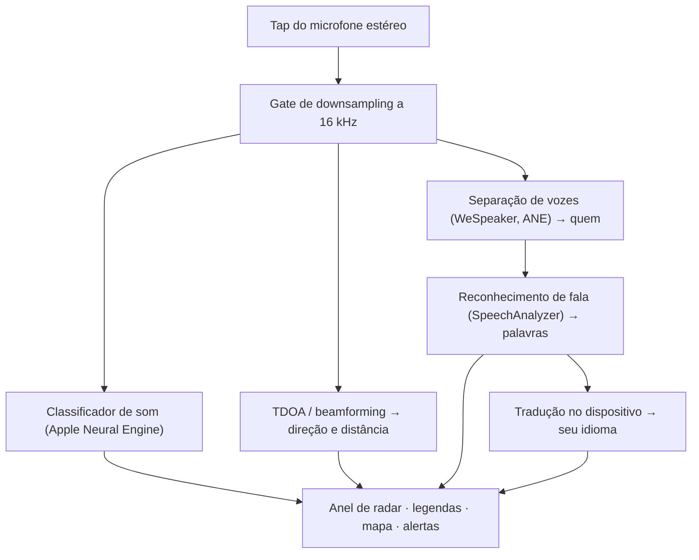

# Vigilant Ear 👂🛡️ (Edição Apple)

*Um radar acústico para quem não pode ouvir.*

Um aplicativo criado especificamente para a comunidade Surda/com deficiência auditiva! A maioria dos apps de reconhecimento de som diz *o que* é um som. **O Vigilant Ear diz onde ele está, quem o está produzindo e o que essa pessoa está dizendo** — transformando um iPhone num tricorder sônico em tempo real para descrever visualmente o som à sua volta.

A direção e a distância de uma sirene. Uma batida atrás de você. As pessoas em uma conversa, desenhadas como vozes transcritas e separadas — cada uma legendada e posicionada direcionalmente por quem fala. Se alguém estiver falando um idioma que você não lê, suas palavras chegam **traduzidas para o seu.**

Tudo é executado no dispositivo. Nada é gravado, armazenado em cache ou enviado para lugar algum.

---

## Para quem é

- **Pessoas surdas e com deficiência auditiva** que querem consciência situacional do som — não apenas "um som aconteceu", mas *o quê, onde, quem* e *o que foi dito.*
- Qualquer pessoa que precise de **legendas ao vivo com direção e separação de quem fala**, ou de **tradução no dispositivo** dos amigos sentados por perto.
- Entusiastas de pesquisa acústica e acessibilidade interessados em localização de som no dispositivo.

> O Vigilant Ear é um **recurso** de acessibilidade, não um dispositivo certificado de segurança crítica.

---

## O que ele faz

### 🧭 Ele enxerga o som — direção e distância
Usando os microfones estéreo do iPhone, o Vigilant Ear estima a **direção e a distância aproximada** dos sons à sua volta e os posiciona como pontos ao vivo em um anel de radar e em um mapa orientados pela sua direção. Mova-se, e os pontos mantêm sua posição no mundo real. Essa é a essência: consciência espacial de um mundo que você não pode ouvir.

### 🚨 Ele reconhece sons importantes — e avisa você
Um classificador no dispositivo identifica **mais de 300 sons do dia a dia** e monitora as categorias críticas — **sirenes, alarmes, campainhas/batidas, uma pessoa por perto e clima severo.** Quando uma delas dispara, você recebe um alerta claro na tela e uma **notificação push** opcional, mesmo com o app em segundo plano ou o telefone em repouso. Desative todas as categorias de alerta e o motor hiberna completamente em segundo plano para economizar bateria.

Os avisos de clima severo vêm de feeds públicos oficiais: o **NWS** dos Estados Unidos já vem incluído gratuitamente; a rede europeia **MeteoAlarm** e a **CMA** da China fazem parte do Premium. Os feeds são automaticamente restringidos àqueles que realmente cobrem o local onde você está.

### 💬 Modo Interlocutor — legendas direcionais ao vivo *(Premium)*
Ative o **Modo Interlocutor** e o Vigilant Ear transcreve as pessoas que conversam por perto em **blocos de legenda, um por voz.** A separação de vozes no dispositivo distingue quem fala, então cada pessoa mantém seu próprio bloco e ícone peculiar — *quem* está dizendo *o quê* — com um pequeno círculo no anel interno indicando a posição dela no ambiente. A pessoa que está falando no momento é destacada; o texto mais antigo desliza lentamente para fora ou conforme se precisa de espaço para texto novo.

### 🌐 Tradução Automática do Interlocutor — leia em seu idioma uma língua que você não pode ouvir *(Premium)*
Com o Modo Interlocutor ativado, quando uma pessoa por perto fala outro idioma, o Vigilant Ear o detecta e exibe as legendas dela **no seu idioma**, ao vivo, com a identificação da língua de origem na barra de título do bloco dela. Toda a cadeia — ouvir → separar quem fala → transcrever → traduzir → exibir — é executada **inteiramente no dispositivo**; o único momento de rede é um download único de pacote de idioma da Apple. Para uma pessoa surda com um amigo que fala outra língua, isso significa ler o lado dele da conversa em tempo real **sem precisar saber qual é esse idioma e escolhê-lo de antemão**.

### 🎵 Consciência de música e transmissões *(Premium)*
O **ShazamKit** identifica a música tocando à sua volta e exibe o título, com detecção automática de assinatura quando a música muda. E quando uma voz parece vir de uma TV ou rádio, em vez de uma pessoa presente no ambiente, ela é marcada com um **📻** em vez de ser confundida com alguém presente — as palavras ainda aparecem; elas apenas são identificadas com honestidade.

### 🛰️ Constellation — muitos iPhones, um ouvido compartilhado *(Premium)*
Com dois ou mais iPhones com Ultra-Wideband (a maioria desde o iPhone 11), o modo **Constellation** os pareia para que possam perceber a posição uns dos outros (via Nearby Interaction / UWB da Apple) e combinar o que cada um ouve em uma imagem única e muito mais precisa de onde um som está vindo — uma espécie de **sonar de abertura sintética** passivo e distribuído. Seu uso é restrito a dispositivos com o hardware adequado.

### 🗺️ Mapas, ruas e previsão de trajeto
As direções dos sons são projetadas em coordenadas GPS reais e desenhadas em uma visualização de mapa. Os sons de veículos são **encaixados nas ruas próximas** (via feeds de dados de vias de código aberto) e seus trajetos são previstos, de modo que um carro passando seja lido como movendo-se *ao longo da rua* em vez de vagar através dos prédios. (Experimente a demonstração do caminhão de bombeiros para ter uma prévia.)

---

## Gratuito e Premium

O núcleo de segurança é **gratuito, para sempre**:

- **Alertas locais de som** — alarmes, sirenes, campainhas/batidas e uma pessoa por perto — detectados no dispositivo, com avisos na tela e por push.
- **Avisos de clima severo do NWS** para os Estados Unidos.

Um desbloqueio **Premium** único — com um teste gratuito para começar, e **não uma assinatura** — adiciona toda a camada de consciência situacional:

- **Modo Interlocutor** — legendas ao vivo, direcionais e por interlocutor.
- **Tradução Automática do Interlocutor** — tradução no dispositivo da fala próxima para o seu idioma.
- **Constellation** — audição compartilhada entre vários iPhones via Ultra-Wideband.
- **ID de Música** — reconhecimento de músicas com o ShazamKit.
- **Feeds internacionais de clima** — Europa (MeteoAlarm) e China (CMA).

Gratuito ou Premium, **tudo é executado no dispositivo** — o nível apenas muda quais recursos estão desbloqueados, nunca para onde vai o seu áudio.

---

## Como funciona (por dentro)

O Vigilant Ear é um pipeline **local-first, no dispositivo**. O áudio bruto é capturado em uma tap de alta prioridade, copiado e distribuído para atores de processamento independentes sem nunca travar a interface:

- **Matemática espacial** — transformadas rápidas de Fourier, Time-Difference-of-Arrival e rastreamento de Doppler rodam em tarefas de segundo plano destacadas.
- **Fala** — o `SpeechAnalyzer`/`SpeechTranscriber` do iOS 26 cuidam da transcrição; os embeddings do **WeSpeaker** agrupam o áudio em vozes distintas; o framework de **Translation** da Apple faz a tradução no dispositivo.
- **Concorrência** — o isolamento estrito do Swift 6 mantém a tap do microfone, a matemática acústica e o loop de renderização do `CADisplayLink` do mapa nitidamente separados, de modo que a interface permaneça fluida (meta de 60 FPS de deslize do marcador) enquanto todo o resto roda a pleno vapor em segundo plano.
- **Eficiência** — o gate de downsampling a 16 kHz reduz em cerca de 80% os dados que o classificador vê, mantendo leve a pegada ativa e ainda mais leve o modo "sempre ouvindo" em segundo plano.

---

## Privacidade

- **No dispositivo, sempre.** Toda a classificação, matemática espacial, transcrição, separação de vozes (assinatura/identificação de quem fala) e tradução acontecem no seu iPhone. O áudio bruto nunca é gravado, armazenado em cache ou transmitido.
- **As transcrições são efêmeras.** As legendas vivem na memória durante a sessão e não são persistidas nem enviadas.
- **Sem telemetria.** Nenhum dado de análise, log de falhas ou de uso é enviado a qualquer servidor.

Detalhes completos: [PRIVACY.md](PRIVACY.md) · [TERMS.md](TERMS.md) · [SUPPORT.md](SUPPORT.md)

---

## Hardware e plataformas

- **iPhone (experiência completa).** Um iPhone com microfone estéreo é necessário para a localização de direção. Recomenda-se iPhone 13 ou mais recente.
- **iPad (apenas legendas).** Os iPads expõem um único canal de áudio, então transcrevem e legendam, mas não conseguem calcular direção — uma boa opção para uma tela grande fixa.
- **Constellation** precisa de **Ultra-Wideband** — iPhone 11 ou posterior, excluindo os modelos SE e "e".

---

## Localização de idiomas

Totalmente localizado — interface, alertas e legendas — em **inglês, espanhol, português, francês, alemão, árabe, japonês e chinês simplificado** (8 idiomas). Eles seguem a configuração de localidade do sistema ou podem ser escolhidos manualmente no app.

---

## Status e isenção de responsabilidade

O Vigilant Ear é um **recurso experimental de acessibilidade acústica**, não um utilitário certificado de segurança crítica. A resolução da localização varia conforme o ambiente, o clima, o vento e o hardware do microfone. **Mantenha sempre sua consciência ambiental normal** — não dependa dele como sua única fonte de informações de segurança.

---

**Contato:** [vigilantear@wingdingssocial.com](mailto:vigilantear@wingdingssocial.com)

Feito com ❤️ para a comunidade D/HH e a pesquisa acústica.

© 2026 Wingdings, Inc. All rights reserved.
