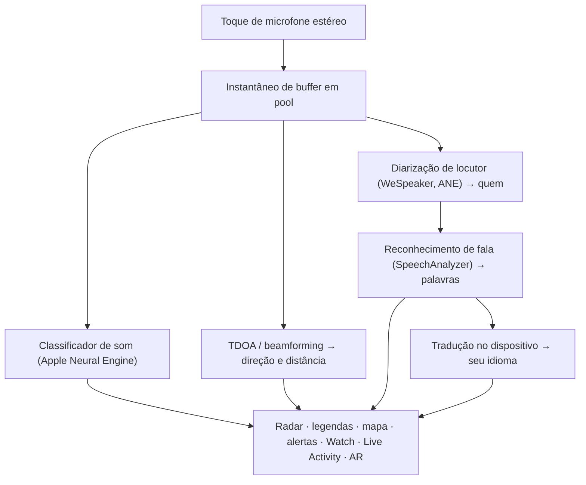

# Vigilant Ear 👂🛡️

*Um radar acústico para pessoas com deficiência auditiva.*

Um aplicativo criado especificamente para a comunidade surda e com deficiência auditiva. A maioria dos aplicativos de reconhecimento de som diz *o que* é um som. **O Vigilant Ear informa onde ele está, quem o está fazendo e o que estão dizendo** — transformando um iPhone em um tricorder sônico em tempo real que descreve o som ao seu redor.

A direção e a distância de uma sirene. Uma batida atrás de você. As pessoas em uma conversa, desenhadas como vozes transcritas separadas — cada uma legendada e posicionada direcionalmente. Se alguém estiver falando um idioma que você não lê, suas palavras podem chegar **traduzidas para o seu.** Os alertas chegam à sua **Tela de Bloqueio, Dynamic Island e Apple Watch**, para que apenas um olhar seja suficiente.

Tudo o que importa é executado no dispositivo. O áudio não é gravado nem enviado para reconhecimento. Nada depende de você ouvir alguma coisa.

- 🧭 **Direção, não apenas detecção.** *O que, onde, quem* e *o que foi dito* — não meramente "um som aconteceu".
- 🔒 **Privado por design.** A classificação, as legendas e a tradução são executadas no seu iPhone. As legendas são ao vivo e efêmeras; elas não são salvas como um arquivo de transcrição.
- ⌚ **No seu pulso e na Tela de Bloqueio.** O companheiro de direção do Apple Watch + Live Activity mantêm o último alerta e de onde ele veio a apenas um olhar de distância.
- 🛰️ **Mais telefones, um ouvido compartilhado.** O Constellation conecta iPhones com Ultra-Wideband para fundir o que cada um ouve em uma imagem direcional mais nítida.
- 👁️ **Feito para Surdos / Deficientes Auditivos.** Respostas táteis distintas, visuais de alto contraste, dicas independentes de cores, grandes alvos de toque e respeito ao Reduzir Movimento em todo o aplicativo.

---

## Para quem é

- **Usuários surdos e com deficiência auditiva** que desejam consciência situacional do som — Home Watch (batida, alarme, bebê, telefone) e Street Watch (sirene, aproximação) que você pode deixar ativados e confiar.
- Qualquer pessoa que precise de **legendas ao vivo com direção e separação de locutores**, ou **tradução no dispositivo** de pessoas sentadas por perto.
- Usuários de acessibilidade e pesquisa acústica interessados na localização de som no dispositivo.

> O Vigilant Ear é um **auxílio** de acessibilidade, não um dispositivo certificado de segurança de vida.

---

## O que ele faz

### 🧭 Ele vê o som — direção e distância
Usando os microfones estéreo do iPhone, o Vigilant Ear estima a **direção e a distância aproximada** dos sons ao seu redor e os coloca como marcadores ao vivo em um anel de radar orientado para cima e no mapa. Mova-se e os marcadores mantêm sua posição no mundo real. Este é o núcleo: consciência espacial de um mundo que você não pode ouvir.

### 🚨 Ele reconhece sons importantes — e avisa você
Um classificador no dispositivo identifica centenas de sons do dia a dia e observa as categorias críticas — **sirenes, alarmes, campainhas/batidas, choro de bebê, uma pessoa por perto e clima severo.** Quando um é disparado, você recebe um alerta claro na tela, **notificação push** opcional e uma **resposta tátil** distinta — mesmo quando o aplicativo está em segundo plano ou o telefone está inativo. As categorias críticas vêm ativadas por padrão, portanto, ativar as notificações não significa "tudo desligado". Desligue todas as categorias de alerta e o mecanismo hiberna totalmente enquanto estiver em segundo plano para economizar bateria.

Avisos de clima severo vêm de feeds públicos oficiais CAP — **NWS** dos EUA, **MeteoGate** da Europa, **CMA** da China e **KMA** da Coreia — gratuitos para todos os usuários. Os feeds são reduzidos àqueles que cobrem onde você está.

### ⌚ Apple Watch + Live Activity — olhe e saiba
- **Companheiro do Apple Watch** — a direção de um alerta aponta em seu pulso, para que um olhar diga onde procurar. Interface do usuário do Watch redesenhada com o ícone de orelha do aplicativo, layout de HUD de ameaças e toque duplo para dispensar um alerta. Os alertas ainda podem mostrar a seta de direção quando o aplicativo do Watch não estiver aberto.
- **Live Activity** — O Vigilant Ear permanece na sua **Tela de Bloqueio**, na **Dynamic Island** e no **Conjunto Inteligente do Watch**, para que o último alerta e sua direção estejam sempre a um olhar de distância.

### 💬 Speaker Mode — legendas ao vivo e direcionais *(grátis)*
Ative o **Speaker Mode** e o Vigilant Ear transcreve as pessoas conversando perto de você em **blocos de legendas, um por voz.** A diarização de locutores no dispositivo mantém as vozes distintas — *quem* está dizendo *o que* — com uma indicação direcional no anel interno. O locutor ao vivo é destacado; o texto mais antigo rola para longe conforme o espaço é necessário. As legendas são gratuitas; a tradução automática é a camada opcional do Power Pack+.

### 🌐 Speaker Auto-Translate — seu idioma, ao vivo *(Power Pack+)*
Com o Speaker Mode ativado, quando uma pessoa próxima fala outro idioma, o Vigilant Ear pode detectá-lo e renderizar suas legendas **no seu idioma**, com o idioma de origem exibido em seu bloco. A cadeia — ouvir → separar locutores → transcrever → traduzir → exibir — é executada **no dispositivo**; o único momento de rede é um download único do pacote de idiomas da Apple. Você não precisa saber ou escolher o outro idioma primeiro.

É o que existe de mais próximo do **tradutor universal da ficção científica** — o aparelho que simplesmente entende. Tradutores de fone exigem que você escolha o par de idiomas primeiro e traduzem uma voz para um único ouvido. O Vigilant Ear detecta o idioma sozinho, acompanha cada pessoa falando na sala e legenda todas no seu idioma — sem fones, sem configuração, no seu aparelho.

### 🎵 Consciência de música e transmissão *(Power Pack+)*
O **ShazamKit** identifica a música tocando ao seu redor e rastreia as mudanças de música. Quando uma voz parece estar vindo de uma TV ou rádio em vez de uma pessoa na sala, ela é marcada com um **📻** — as palavras ainda são exibidas; elas são rotuladas honestamente.

### 🎛️ Escopo Acústico — veja o som como um engenheiro *(Power Pack+)*
Uma visão profissional e ao vivo do som ao seu redor: espectro, espectrograma, bandas RTA de ⅓ de oitava, croma e parciais harmônicos — além de ferramentas para capturar sons e treinar seus próprios pacotes.

### 📦 Pacotes de Som Personalizados — ensine o seu mundo a ele *(Power Pack+)*
Ensine ao Vigilant Ear os sons que importam para você — dos pássaros da região à campainha do seu prédio. Os pacotes adicionais se somam à detecção integrada, sem nunca atrapalhar sirenes e alarmes. Guia passo a passo incluído no app.

### 🛰️ Constellation — muitos iPhones, um ouvido compartilhado *(Power Pack+)*
Com dois ou mais iPhones habilitados para Ultra-Wideband (a maioria desde o iPhone 11), o **Constellation** os emparelha para que possam sentir a posição um do outro e fundir o que cada um ouve em uma imagem única e mais precisa de onde um som está vindo — uma matriz de escuta passiva e distribuída. Limitado a dispositivos com o hardware correto. As legendas de malha mais antigas que o tempo de conexão de um par não são retransmitidas.

### 📷 Câmera AR — “veja o som”
Abra a pílula da câmera na barra de título e fixe os sons detectados em sua direção real na visualização da câmera ao vivo. Os marcadores se agrupam por locutor ou por categoria de som e direção, para que a visualização permaneça legível; as fontes desaparecem com o tempo quando ficam silenciosas.

### 🗺️ Mapas, estradas e previsão de caminho
As direções do som são projetadas em coordenadas GPS reais no mapa. Sons de veículos podem ser **ajustados para ruas próximas** e seus caminhos previstos para que um caminhão passando seja lido como se estivesse se movendo *ao longo da estrada* em vez de através de prédios. (Experimente a demonstração do caminhão de bombeiros.)

### 🪄 Zona de Testes — prove sem os ouvidos
A **Zona de Testes** é pública para todos: prática Home & Street (batida, alarme, bebê, sirene, clima), demonstrações de vários telefones e conversas, e uma marca d'água clara para que a prática nunca se passe por um evento real. Fechar o painel encerra as demonstrações de forma limpa (sem falsificação de GPS travada, sem sinalizadores restantes).

### ♿ Acessibilidade em primeiro lugar
Construído para usuários surdos / com deficiência auditiva e daltônicos: dicas **independentes de cores**, alvos de toque de **≥44 pt**, respeito ao **Reduzir Movimento**, alertas multimodais (tátil + visual + Watch) e uma tela de verificação de inicialização que mostra o status da permissão com estados claros verdes / cinzas / vermelhos (e "não permitido" em laranja queimado) — incluindo a concessão de notificação que atua como o interruptor mestre de alertas.

---

## Gratuito e Power Pack+

O núcleo de segurança é **gratuito, para sempre**:

- **Home Watch e Street Watch** — alertas de som locais (alarmes, sirenes, batidas/campainhas, bebê, pessoa por perto) com entrega na tela, tátil e notificação push opcional.
- **Legendas ao vivo** — Speaker Mode, no dispositivo, direcional onde o hardware permite.
- **Clima severo CAP** — NWS, MeteoGate, CMA, KMA para a sua região.
- **Zona de Testes** — alertas de prática e prévias de recursos com uma clara marca d'água PREVIEW.
- **Companheiro do Apple Watch e Live Activity** — direção visualizável e último alerta.

O **Power Pack+** é um desbloqueio único (**não é uma assinatura**) com um **teste gratuito de 90 dias**. Ele adiciona os superpoderes:

- **Speaker Auto-Translate** — tradução no dispositivo de fala próxima para o seu idioma.
- **Constellation** — audição compartilhada em vários iPhones sobre Ultra-Wideband.
- **Identificação de Música (Music ID)** — reconhecimento de música do ShazamKit.
- **Escopo Acústico** — visualização de som ao vivo de nível profissional e ferramentas de captura.
- **Pacotes de Som Personalizados** — classificadores adicionais que você treina para os seus próprios sons.

Gratuito ou Power Pack+, **seu áudio permanece no dispositivo para reconhecimento** — o nível muda apenas quais recursos são desbloqueados, nunca para onde o áudio bruto é enviado para análise.

---

## Como funciona (sob o capô)

O Vigilant Ear é um pipeline **local em primeiro lugar, no dispositivo**. O áudio bruto é capturado em um toque de alta prioridade, copiado para uma **lista livre de buffer em pool** (sem alocação excessiva no caminho de tempo real) e distribuído para processadores independentes sem travar a interface do usuário ou interromper o transmissor:

- **Matemática espacial** — FFTs, Diferença de Tempo de Chegada (Time-Difference-of-Arrival) e rastreamento Doppler em tarefas em segundo plano.
- **Fala** — iOS 26 `SpeechAnalyzer` / `SpeechTranscriber` para transcrição; embeddings do **WeSpeaker** para identidade de voz; framework de **Tradução** da Apple para tradução no dispositivo.
- **Concorrência** — O isolamento do Swift 6 mantém a captura de microfone, a matemática acústica e o loop de renderização da interface do usuário limpos e separados.
- **Eficiência** — a redução de amostragem e a classificação adaptável à carga mantêm o modo "sempre ouvindo" leve o suficiente para ser deixado ativado.

---

## Privacidade

- **No dispositivo, sempre para o pipeline central.** A classificação, a matemática espacial, a transcrição, a diarização e a tradução são executadas no seu iPhone. O áudio bruto não é gravado nem enviado para reconhecimento.
- **As legendas são efêmeras.** As legendas ao vivo permanecem na memória para a sessão; os registros de depuração exportados não incluem texto de legenda.
- **Sem SDKs de publicidade ou análise comportamental.** O uso limitado da rede é apenas para mapas, feeds públicos de clima, impressões digitais opcionais do Shazam, contexto de estradas e compras na App Store — consulte a política completa.

Detalhes completos: [PRIVACY.md](PRIVACY.md) · [TERMS.md](TERMS.md) · [SUPPORT.md](SUPPORT.md)

---

## Hardware e plataformas

- **iPhone (experiência completa).** Microfones estéreo necessários para encontrar a direção. Recomendado **iPhone 13 ou mais recente**.
- **Apple Watch.** Alertas de companheiro com seta de direção; funciona com Live Activity / Conjunto Inteligente.
- **iPad (focado em legendas).** Microfones de canal único → legendas sem direção completa.
- **Constellation** requer **Ultra-Wideband** — iPhone 11 ou posterior, excluindo os modelos SE e "e".
- **Android.** Compilação separada com radar central, alertas, legendas e clima; a malha Constellation é voltada primeiramente para iOS. Veja as atualizações no site do produto conforme a paridade com o Android cresce.

**Versão atual na App Store:** 1.0.7. Desenvolvido para o iOS moderno (era SpeechAnalyzer).

---

## Localização

Totalmente localizado — interface, alertas e legendas — para **Inglês, Espanhol, Português (Brasil), Francês, Alemão, Árabe, Japonês, Chinês Simplificado e Coreano** (9 idiomas). Segue o idioma do sistema ou uma escolha manual no aplicativo.

---

## Status e aviso de isenção de responsabilidade

O Vigilant Ear é um **auxílio experimental de acessibilidade acústica**, não um utilitário certificado de segurança de vida. A resolução de localização varia com os arredores, clima, vento e hardware do microfone. **Mantenha sempre a sua consciência ambiental normal** — não dependa dele como sua única fonte de informações de segurança.

Algumas capacidades (marcadores de câmera AR, atualização de direitos de Critical Alerts quando concedidos pela Apple, autoria avançada de som em vários pacotes) continuam a evoluir; os alertas gratuitos do Home / Street e as legendas ao vivo são o produto em que você pode confiar desde o primeiro dia.

---

**Contato:** [vigilantear@wingdingssocial.com](mailto:vigilantear@wingdingssocial.com)

Feito com ❤️ para a comunidade Surda/Com deficiência auditiva (D/HH) e pesquisa acústica.

    
  <strong>© 2026 Wingdings, Inc.</strong> 
  Todos os direitos reservados. 
  Patente Pendente

