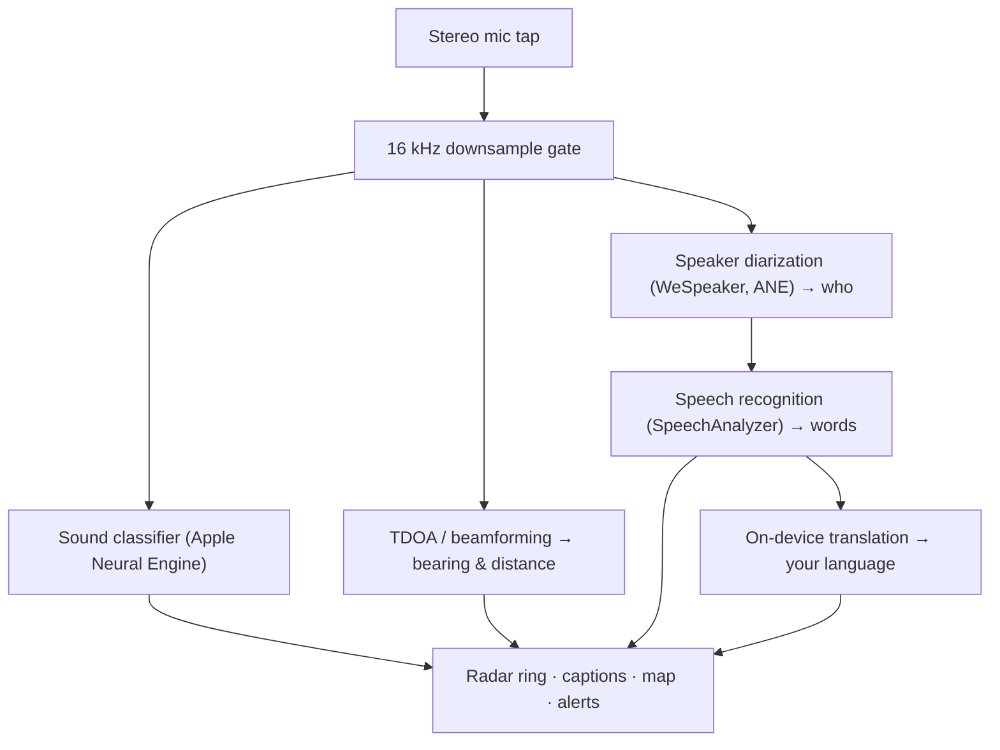

# Vigilant Ear 👂🛡️ (Edição Apple)

*Um radar acústico para quem não consegue ouvir.*

Um aplicativo desenvolvido especificamente para a comunidade Surda/DA! A maioria dos aplicativos de reconhecimento de som diz *o que* é um som. **O Vigilant Ear diz onde ele está, quem está fazendo e o que estão dizendo** — transformando um iPhone em um tricorder sônico em tempo real para descrever visualmente os sons ao seu redor.

A direção e a distância de uma sirene. Uma batida atrás de você. As pessoas em uma conversa, representadas como vozes transcritas separadas — cada uma com legenda e posicionamento direcional por falante. Se alguém está falando em um idioma que você não lê, as palavras chegam **traduzidas para o seu.**

Tudo roda no dispositivo. Nada é gravado, armazenado em cache ou enviado a nenhum lugar.

---

## Para quem é

- **Usuários Surdos e com deficiência auditiva** que desejam consciência situacional dos sons — não apenas "um som aconteceu", mas *o quê, onde, quem* e *o que foi dito.*
- Qualquer pessoa que precise de **legendas ao vivo com direção e separação de falantes**, ou **tradução no dispositivo** de amigos sentados por perto.
- Pesquisadores acústicos e entusiastas de acessibilidade interessados em localização de som no dispositivo.

> Vigilant Ear é um **auxílio** de acessibilidade, não um dispositivo certificado de segurança de vida.

---

## O que ele faz

### 🧭 Ele enxerga o som — direção e distância
Usando os microfones estéreo do iPhone, o Vigilant Ear estima o **rumo e a distância aproximada** dos sons ao seu redor e os posiciona como pontos ao vivo em um anel de radar com cabeçote fixo e no mapa. Mova-se, e os pontos mantêm sua posição no mundo real. Este é o núcleo: consciência espacial de um mundo que você não pode ouvir.

### 🚨 Ele reconhece sons importantes — e o avisa
Um classificador no dispositivo identifica **mais de 300 sons cotidianos** e monitora as categorias críticas — **sirenes, alarmes, campainhas/batidas, uma pessoa próxima e clima severo.** Quando um deles é ativado, você recebe um alerta claro na tela e uma **notificação push** opcional, mesmo quando o aplicativo está em segundo plano ou seu telefone está bloqueado. Desative todas as categorias de alerta e o motor hiberna completamente em segundo plano para economizar bateria.

Alertas de mau tempo provêm de feeds públicos oficiais: o **NWS** dos Estados Unidos está integrado gratuitamente; a rede europeia **MeteoGate** e o **CMA** da China fazem parte do Premium. Os feeds são automaticamente filtrados para os que realmente cobrem onde você está.

### 💬 Speaker Mode — legendas ao vivo e direcionais *(Premium)*
Ative o **Speaker Mode** e o Vigilant Ear transcreve as pessoas que falam perto de você em **blocos de legenda, um por voz.** A diarização de falantes no dispositivo distingue as vozes, para que cada pessoa mantenha seu próprio bloco e ícone exclusivo — *quem* está dizendo *o quê* — com um pequeno círculo no anel interno indicando sua posição na sala. O falante ativo é destacado; textos mais antigos rolam lentamente ou conforme o espaço para novos textos é necessário.

### 🌐 Speaker Auto-Translate — leia um idioma que você não pode ouvir, no seu próprio *(Premium)*
Com o Speaker Mode ativado, quando uma pessoa próxima fala outro idioma, o Vigilant Ear o detecta e renderiza as legendas **no seu idioma**, ao vivo, com a identificação do idioma de origem na barra de título do bloco. Toda a cadeia — ouvir → separar falantes → transcrever → traduzir → exibir — roda **inteiramente no dispositivo**; o único momento de rede é um download único de pacote de idioma da Apple. Para uma pessoa surda com um amigo que fala outro idioma, isso significa ler o lado da conversa dele em tempo real **sem precisar saber de antemão e escolher aquele idioma.**

### 🎵 Identificação de música e transmissões *(Premium)*
O **ShazamKit** identifica músicas tocando ao seu redor e exibe o título com detecção automática de mudança de assinatura de música. E quando uma voz parece vir de uma TV ou rádio em vez de uma pessoa na sala, ela é marcada com um **📻** em vez de ser confundida com alguém presente — as palavras ainda aparecem; elas são apenas rotuladas honestamente.

### 🛰️ Constellation — muitos iPhones, um ouvido compartilhado *(Premium)*
Com dois ou mais iPhones habilitados para Ultra-Wideband (maioria desde o iPhone 11), o modo **Constellation** os emparelha para que possam perceber a posição um do outro (via Nearby Interaction / UWB da Apple) e fundir o que cada um ouve em uma imagem única e muito mais precisa de onde um som está vindo — uma espécie de **sonar de abertura sintética** distribuído e passivo. Restrito a dispositivos com o hardware adequado.

### 🗺️ Mapas, vias e previsão de trajeto
Os rumos de som são projetados em coordenadas GPS reais e desenhados em uma visualização de mapa. Sons de veículos são **fixados às ruas próximas** (via feeds de dados de estradas de código aberto) e seus trajetos são previstos, de modo que um carro passando aparece se movendo *pela rua* em vez de derivar pelos prédios. (Experimente a demonstração do caminhão de bombeiros para visualizar.)

---

## Gratuito e Premium

O núcleo de segurança é **gratuito, para sempre**:

- **Alertas de som locais** — alarmes, sirenes, campainhas/batidas e uma pessoa próxima — detectados no dispositivo, com avisos na tela e por push.
- **Alertas de mau tempo NWS** para os Estados Unidos.

Um **desbloqueio Premium** único — com um período de avaliação gratuito para começar, e **não uma assinatura** — adiciona a camada completa de consciência situacional:

- **Speaker Mode** — legendas ao vivo, direcionais e por falante.
- **Speaker Auto-Translate** — tradução no dispositivo da fala próxima para o seu idioma.
- **Constellation** — audição compartilhada entre múltiplos iPhones via Ultra-Wideband.
- **Music ID** — reconhecimento de músicas pelo ShazamKit.
- **Feeds internacionais de clima** — Europa (MeteoGate) e China (CMA).

Gratuito ou Premium, **tudo roda no dispositivo** — o plano só muda quais recursos são desbloqueados, nunca para onde seu áudio vai.

---

## Como funciona (por baixo dos panos)

Vigilant Ear é um pipeline **local, no dispositivo**. O áudio bruto é capturado em um tap de alta prioridade, copiado e distribuído para atores de processamento independentes sem nunca travar a interface:

- **Matemática espacial** — transformadas rápidas de Fourier, Diferença de Tempo de Chegada (TDOA) e rastreamento Doppler rodam em tarefas separadas em segundo plano.
- **Fala** — `SpeechAnalyzer`/`SpeechTranscriber` do iOS 26 tratam da transcrição; embeddings do **WeSpeaker** agrupam o áudio em vozes distintas; o framework **Translation** da Apple realiza a tradução no dispositivo.
- **Concorrência** — o isolamento estrito do Swift 6 mantém o tap do microfone, a matemática acústica e o loop de renderização `CADisplayLink` do mapa separados de forma limpa, de modo que a interface permanece fluida (meta de 60 FPS para o deslizamento de marcadores) enquanto todo o resto roda em alta carga no segundo plano.
- **Eficiência** — o gate de downsampling para 16 kHz reduz os dados que o classificador processa em ~80%, mantendo o consumo ativo leve e o modo "sempre ouvindo" em segundo plano ainda mais leve.

---

## Privacidade

- **No dispositivo, sempre.** Toda classificação, matemática espacial, transcrição, diarização (assinatura/identificação de falante) e tradução acontecem no seu iPhone. O áudio bruto nunca é gravado, armazenado em cache ou transmitido.
- **As transcrições são efêmeras.** As legendas vivem na memória durante a sessão e não são persistidas ou enviadas.
- **Sem telemetria.** Nenhum dado analítico, log de falha ou dado de uso é enviado a nenhum servidor.

Detalhes completos: [PRIVACY.md](PRIVACY.md) · [TERMS.md](TERMS.md) · [SUPPORT.md](SUPPORT.md)

---

## Hardware e plataformas

- **iPhone (experiência completa).** Um iPhone com microfones estéreo é necessário para localização direcional. Recomendado iPhone 13 ou mais recente.
- **iPad (apenas legendas).** iPads expõem um único canal de áudio, portanto transcrevem e legendam, mas não conseguem calcular direção — uma boa opção para uma tela grande e estacionária.
- **Constellation** requer **Ultra-Wideband** — iPhone 11 ou posterior, exceto os modelos SE e "e".

---

## Localização

Totalmente localizado — interface, alertas e legendas — em **inglês, espanhol, português, francês, alemão, árabe, japonês e chinês simplificado** (8 idiomas). Seguem a configuração de localidade do sistema ou podem ser escolhidos manualmente no aplicativo.

---

## Status e aviso legal

Vigilant Ear é um **auxílio acústico-de-acessibilidade experimental**, não um utilitário certificado de segurança de vida. A resolução de localização varia conforme o entorno, o clima, o vento e o hardware do microfone. **Mantenha sempre sua consciência ambiental normal** — não confie nele como sua única fonte de informação de segurança.

---

**Contato:** [vigilantear@wingdingssocial.com](mailto:vigilantear@wingdingssocial.com)

Feito com ❤️ para a comunidade S/DA e para pesquisa acústica.

© 2026 Wingdings, Inc. All rights reserved.
