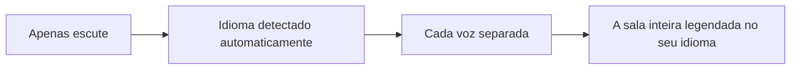
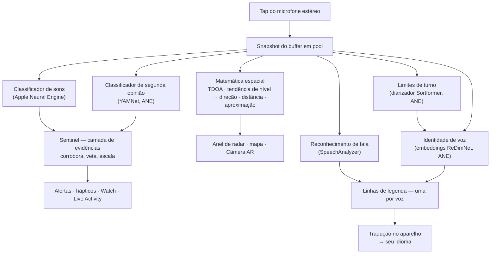
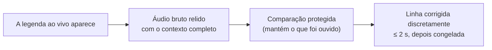
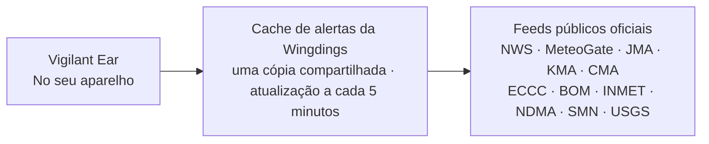

# Vigilant Ear 👂🛡️

*Vigente a partir da versão 1.1.9 · setembro de 2026.*

## Um radar acústico para quem não ouve.

Um app criado especificamente para a comunidade surda, com deficiência auditiva e CODA. A maioria dos apps de reconhecimento de som diz *o que* é um som. **O Vigilant Ear diz onde ele está, quem o está produzindo e o que estão dizendo** — transformando um iPhone em um tricorder sônico em tempo real que descreve o som ao seu redor.

A direção e a distância de uma sirene. Uma batida atrás de você. As pessoas de uma conversa, exibidas como vozes transcritas separadas — cada uma legendada e posicionada na sua direção. Se alguém fala um idioma que você não lê, as palavras podem chegar **traduzidas para o seu.** Os alertas chegam à **Tela de Bloqueio, à Dynamic Island e ao Apple Watch**, então basta um olhar.

Tudo o que importa roda no aparelho. O áudio não é gravado nem enviado para reconhecimento. Nada depende de ouvir coisa alguma.

- 🧭 **Direção, não só detecção.** *O quê, onde, quem* e *o que foi dito* — não apenas “aconteceu um som”.
- 📣 **Nome chamado.** Adicione o seu nome, o de uma criança, o de um parceiro — “pedido da Marie pronto” dá um toque no relógio e aponta a direção.
- 🔒 **Privado por design.** Classificação, legendagem e tradução rodam no seu iPhone. As legendas são ao vivo e efêmeras; não são salvas como um arquivo de transcrições.
- ⌚ **No pulso e na Tela de Bloqueio.** O app complementar de direção do Apple Watch + a Live Activity mantêm o último alerta, e o lado de onde ele veio, a um olhar de distância.
- 🛰️ **Mais telefones, um ouvido compartilhado.** O Constellation conecta iPhones com Ultra-Wideband para fundir o que cada um ouve em uma imagem direcional mais nítida.
- 👁️ **Feito para pessoas surdas, com deficiência auditiva e CODA.** Respostas hápticas distintas, visuais de alto contraste, sinais que não dependem de cor, alvos de toque grandes e respeito ao Reduzir Movimento em todo o app.

---

## Para quem é

- **Usuários surdos, com deficiência auditiva e CODA** que querem consciência situacional do som — Home Watch (batida, alarme, bebê, telefone) e Street Watch (sirene, aproximação) que você pode deixar ligados e em que pode confiar.
- Qualquer pessoa que precise de **legendas ao vivo com direção e separação de falantes** ou de **tradução no aparelho** da fala de quem está sentado por perto.
- Usuários das áreas de acessibilidade e de pesquisa acústica interessados em localização de sons no aparelho.

> O Vigilant Ear é um **auxílio** de acessibilidade, não um dispositivo certificado de segurança da vida.

---

## O que ele faz

### 🧭 Ele vê o som — direção e distância
Com os dois microfones do iPhone, o Vigilant Ear mede o **ângulo de um som e se ele está à sua frente ou atrás de você**, mantém essa leitura estável, com variação de cerca de um grau, e a posiciona como um marcador ao vivo em um anel de radar com o rumo para cima e no mapa. Dois microfones em uma mesma linha não conseguem, sozinhos, distinguir a esquerda da direita — um som 50° à sua direita e outro 50° à sua esquerda chegam com a mesma diferença de tempo minúscula —, então o app desenha a leitura e também um **fantasma mais fraco do outro lado**, e um giro do pulso ou um segundo telefone resolve a dúvida. A distância é estimada pela intensidade do som, com base em uma curva calibrada na rua, e exibida como a estimativa que é: *≈ 50 ft*, com uma faixa provável — nas unidades do país em que você está, e não nas do idioma em que você lê o app. Se você se mover, os marcadores mantêm a posição no mundo real. Este é o núcleo: consciência espacial de um mundo que você não ouve. (Números abaixo.)

### 🚨 Ele reconhece sons importantes — e avisa você
Um classificador no aparelho identifica centenas de sons do dia a dia e vigia as categorias críticas — **sirenes, alarmes — incluindo uma classe dedicada a alarmes de carro —, campainhas/batidas, choro de bebê, uma pessoa por perto e clima severo.** Quando uma delas dispara, você recebe um alerta claro na tela, uma **notificação push** opcional e uma **resposta háptica** distinta — mesmo com o app em segundo plano ou o telefone em repouso. As categorias críticas já vêm prontas por padrão, então ativar as notificações não significa “tudo desligado”. Desative todas as categorias de alerta e o mecanismo hiberna por completo em segundo plano para poupar bateria. Uma camada **Sentinel** confronta os alertas com evidências independentes — direção, movimento e feeds públicos —, para que o que dispara seja corroborado, e não o palpite isolado de um classificador. Funciona nos dois sentidos: um momento com formato de sirene dentro de uma música fica retido, mas uma sirene de verdade que se repete por cima da sua música fura o bloqueio e gera o alerta.

Os alertas de clima severo vêm de feeds públicos oficiais — **NWS** dos EUA, **MeteoGate** da Europa, **CMA da China**, **KMA da Coreia**, **JMA do Japão**, **ECCC do Canadá**, **BOM da Austrália**, **INMET do Brasil**, **NDMA da Índia** e **SMN do México** —, gratuitos para todos os usuários. Os alertas do México são publicados pelo Servicio Meteorológico Nacional do país sob a licença CC BY 4.0. Os feeds são restritos aos que cobrem o lugar onde você está. No Japão, o app também lê os **boletins antecipados** da JMA — os avisos em linguagem simples emitidos dias antes de um tufão ou de chuva forte, e não apenas os alertas emitidos quando o perigo já chegou —, além dos boletins de temporal repentino e de deslizamento de terra. Os avisos antecipados aparecem de forma discreta, sem o som e a vibração reservados a um alerta real.

### ⌚ Apple Watch + Live Activity — um olhar e você já sabe
- **App complementar do Apple Watch** — a direção de um alerta é apontada no seu pulso, então um relance já diz para onde olhar. Interface do Watch redesenhada, com o ícone de orelha do app, layout de HUD de ameaças e toque duplo para dispensar um alerta. Os alertas ainda podem mostrar a seta de direção quando o app do Watch não está aberto.
- **Live Activity** — o Vigilant Ear fica na sua **Tela de Bloqueio**, na **Dynamic Island** e na **Pilha Inteligente do Watch**, então o último alerta e a direção dele estão sempre a um olhar de distância.
- **Alertas de parceiros no seu pulso** — quando o telefone de um parceiro vinculado pelo Constellation dispara um alerta, ele também pode chegar ao seu Watch, inclusive com a direção. Uma revisão de confiabilidade mantém o app complementar leve para a bateria do Watch o dia inteiro.

### 💬 Speaker Mode — legendas ao vivo e direcionais *(grátis)*
Ative o **Speaker Mode** e o Vigilant Ear transcreve as pessoas que falam perto de você em **blocos de legenda, um por voz.** A diarização de falantes no aparelho mantém as vozes separadas — *quem* está dizendo *o quê* — com uma indicação de direção no anel interno. Quem está falando no momento fica em destaque; o texto mais antigo vai saindo da tela quando é preciso espaço.

Duas coisas que a maioria dos apps de legenda não faz: **honestidade sobre a confiança** — uma marca discreta de qualidade em cada linha e sublinhados pontilhados sob as palavras duvidosas dizem quando confiar em uma linha e quando conferir de novo — e **autocorreção**: logo depois que uma frase aparece, o app relê o áudio com o contexto completo e pode restaurar uma palavra perdida ou mal ouvida em uns dois segundos; depois disso, o texto congela.

O **Nome chamado** (em Preferências, desativado até você ativá-lo) vigia essas legendas em busca dos nomes que você cadastrar — o seu, o de uma criança, o de um parceiro. Quando alguém diz “pedido da Marie pronto”, você recebe uma resposta háptica distinta e um alerta no Watch com a direção, e não mais um balão de legenda. As palavras continuam aparecendo no Speaker Mode como fala; este é o toque que avisa que estavam falando *com você*.

**A linguagem ofensiva pode ser ocultada** (Preferências → Legendas). Caso contrário, os palavrões chegam como texto puro, sem nada que os suavize, e quem lê não tem chance de desviar o olhar antes; ative esta opção e essas palavras são substituídas por símbolos, de modo que a frase continua legível sem a palavra. Quem decide o que conta é o próprio reconhecedor de fala do seu aparelho — não uma lista de palavras nossa —, então ele acompanha o idioma que está sendo transcrito. Em uma conta declarada como de menor de 18 anos, a opção fica sempre ativada e mostra um cadeado. Ela vale para a fala que *este* aparelho transcreve; o texto repassado por um telefone pareado foi transcrito lá e chega como texto pronto.

**A palavra enfatizada por quem fala aparece em negrito.** Ditas em voz alta, "Eu não disse ISSO" e "Eu não disse isso" são duas frases diferentes, e uma transcrição idêntica perde essa diferença por completo. O app procura a única palavra em que a voz de quem fala subiu de tom e a coloca em negrito — no máximo uma por linha, e nenhuma quando não tem certeza, porque marcar a palavra errada é pôr palavras na boca de alguém. Fica desativado em chinês e japonês, em que o tom indica *qual palavra é*, e não com quanta força ela foi dita.

As legendas são grátis; a tradução automática é a camada opcional do Power Pack+. As legendas também podem ser **lidas em voz alta nos seus aparelhos auditivos Bluetooth** — grátis, em Preferências. Os **Tons de direção** (também grátis, em Preferências → Legendas) acrescentam um sinal sonoro opcional, no ouvido que você escolher, que indica onde está quem fala — útil com aparelho auditivo ou audição unilateral, e disponível para qualquer pessoa.

### 🌐 Tradução automática — seu idioma, ao vivo *(Power Pack+)*
Com o Speaker Mode ativado, quando uma pessoa por perto fala outro idioma, o Vigilant Ear consegue detectá-lo e mostrar as legendas dela **no seu idioma**, com o idioma de origem indicado no bloco dela. A cadeia — ouvir → separar falantes → transcrever → traduzir → exibir — roda **no aparelho**; o único momento em que a rede entra em jogo é o download, feito uma única vez, de um pacote de idioma da Apple, e, quando é esse download que você está esperando, o app avisa, em vez de deixar você olhando para um texto sem tradução. Você não precisa saber nem escolher o outro idioma antes.

É o que existe de mais próximo, já disponível, do **tradutor universal da ficção científica** — o aparelho que simplesmente entende. O Vigilant Ear detecta o idioma sozinho, acompanha cada falante na sala e legenda todos no seu idioma — sem fones de ouvido, sem configuração, no seu aparelho.

```mermaid
graph LR
    A["Apenas escute"] --> B["Idioma detectado automaticamente"] --> C["Cada voz separada"] --> D["A sala inteira legendada no seu idioma"]
```

### 🎵 Percepção de música e transmissões *(Power Pack+)*
O **ShazamKit** identifica as músicas que tocam ao seu redor e acompanha as trocas de faixa.

### 🎛️ Acoustic Scope — veja o som como um engenheiro
Uma visão profissional, ao vivo, do som ao seu redor: espectro, espectrograma, bandas RTA de ⅓ de oitava, croma e parciais harmônicos — **grátis para todos**. **A aba Parciais lê música:** cada tom é identificado pela sua nota, com a série harmônica ao lado; sons mais agudos, como alarmes de fumaça, são identificados na sua altura real; e você pode definir uma nota-alvo, que aparece como uma linha, para cantar ou afinar por ela. Ele roda sem esquentar — deixar o Espectrograma aberto não custa quase nada, por mais tempo que você fique olhando. As ferramentas que capturam sons para treinar seus próprios pacotes personalizados fazem parte do Power Pack+.

### 📦 Pacotes de Som Personalizados — ensine a ele o seu mundo *(Power Pack+)*
Ensine ao Vigilant Ear os sons que importam para você — dos pássaros da sua região ao sinal sonoro da porta do seu prédio. Os pacotes adicionais se somam à detecção integrada, então sons novos nunca tiram o lugar de sirenes e alarmes. Um guia passo a passo vem embutido no app.

### 🛰️ Constellation — vários iPhones, um ouvido compartilhado *(Power Pack+)*
Com dois ou mais iPhones com Ultra-Wideband (a maioria desde o iPhone 11), o **Constellation** os emparelha para que percebam a posição um do outro e fundam o que cada um ouve em uma única imagem, mais precisa, de onde vem um som — um arranjo de escuta passivo e distribuído. As legendas também são fundidas: cada telefone transcreve o que o próprio microfone ouve, e as palavras são alinhadas entre os telefones para que o mais próximo de quem fala contribua com o que ouviu — palavras que só um telefone captou são mantidas, e não perdidas. Os telefones se conectam **diretamente entre si** — sem roteador, sem rede Wi-Fi compartilhada e sem internet; basta o Wi-Fi estar ligado, pelo mesmo enlace ponto a ponto que o AirDrop usa. Disponível apenas em aparelhos com o hardware adequado. Legendas da malha anteriores ao momento em que um par se conectou não são retransmitidas.

**Mensagens entre parceiros** — envie uma mensagem rápida para o telefone de um parceiro vinculado; ela aparece no feed de legendas da pessoa e pode chegar traduzida para o idioma dela, no aparelho. As mensagens levam a idade em conta: com base no Declared Age Range da Apple, a troca de mensagens entre um adulto e um menor fica desativada, a menos que as duas pessoas tenham, deliberadamente, dado um nome uma à outra. Alertas e legendas nunca são bloqueados — só as mensagens de pessoa para pessoa.

### 🔗 Remote Link — alcance quem não está com você *(Power Pack+ para iniciar)*
O que uma ligação telefônica normalmente faria, só que feito com vídeo e texto. Você envia um código de convite; a outra pessoa entra de dentro do Vigilant Ear **sem ter o Power Pack+**. Ao contrário do Constellation, não há exigência de proximidade — vocês dois podem estar em qualquer lugar.

**Nenhum áudio é usado em momento algum.** Só vídeo e texto, então nada no link depende de ouvir, em nenhuma das pontas — e isso dá a você um jeito de conversar em língua de sinais com alguém pelo app. O app em si não entende língua de sinais; ele transmite o vídeo, e vocês dois fazem o resto. A conexão é direta entre os dois telefones sempre que a rede permite, e o app mostra com clareza se o link está **Direto** ou **Revezado**, para você sempre saber se o seu vídeo está passando por um relay.

**As legendas também viajam.** O que cada telefone transcreve aparece no outro, traduzido para o idioma de quem lê quando necessário. Qualquer um de vocês pode pausar o link — vídeo e legendas — e retomá-lo, e também encerrá-lo pela tela principal.

### 📷 Câmera AR — “veja o som”
Abra a pílula da câmera na barra de título e fixe os sons detectados na direção real deles, na imagem ao vivo da câmera. Os marcadores se agrupam por falante ou por categoria de som e direção, para que a visualização continue legível; as fontes esmaecem com o tempo quando ficam em silêncio.

### 🗺️ Mapas, ruas e previsão de trajeto
As direções dos sons são projetadas sobre coordenadas GPS reais no mapa. Sons de veículos podem ser **encaixados nas ruas próximas** e ter o trajeto previsto, para que um caminhão passando apareça se movendo *ao longo da rua*, e não atravessando prédios. (Experimente a demonstração do caminhão de bombeiros.)

### 🪄 Feature Playground — comprove sem precisar ouvir
O **Feature Playground** é aberto a todos: prática de Casa e rua (batida, alarme, bebê, sirene, clima), demonstrações com vários telefones e de conversa, e uma marca d'água clara para que a prática nunca se passe por um evento real. Fechar o painel desmonta as demonstrações de forma limpa (sem GPS simulado travado, sem flags esquecidas).

### ♿ Acessibilidade em primeiro lugar
Feito para usuários surdos, com deficiência auditiva, CODA e daltônicos: sinais **independentes de cor**, alvos de toque **≥44 pt**, respeito ao **Reduzir Movimento**, **layouts da direita para a esquerda** para leitores de árabe, alertas multimodais (háptico + visual + Watch) e uma tela de verificação na inicialização que mostra o status das permissões com estados claros em verde / cinza / vermelho (e laranja queimado para “não permitido”) — incluindo a permissão de notificações, que funciona como o interruptor geral dos alertas.

---

## Grátis e Power Pack+

O núcleo de segurança é **grátis, para sempre**:

- **Home Watch e Street Watch** — alertas sonoros locais (alarmes, sirenes, batidas/campainhas, bebê, pessoa por perto) com aviso na tela, resposta háptica e notificação push opcional.
- **Legendas ao vivo** — Speaker Mode, no aparelho, direcionais onde o hardware permite, com marcas de confiança honestas, autocorreção em ~2 segundos, leitura em voz alta opcional nos aparelhos auditivos Bluetooth e Tons de direção.
- **Nome chamado** — nomes opcionais que você digita (o seu, dos filhos, do parceiro). Uma correspondência vira um alerta no Watch/telefone com a direção, e não uma segunda legenda.
- **Standing Watch** — a condição do próprio ambiente, sempre ativo e sem nada para configurar: uma lâmpada ciano fixa enquanto o ambiente mantém o seu padrão, âmbar quando algo muda — uma voz nova, um silêncio repentino ou algo se aproximando.
- **Alertas de clima severo** — NWS, MeteoGate (Europa — servido atualizado a partir do nosso cache de alertas de 5 minutos), CMA, KMA, JMA (Japão), ECCC (Canadá), BOM (Austrália), INMET (Brasil), NDMA (Índia) e SMN (México) para a sua região.
- **Alertas de terremoto (USGS, no mundo todo)** — sinta uma vibração e veja no mapa a área que sentiu o tremor quando um terremoto for registrado por perto. Uma confirmação do feed oficial do USGS — não um alerta antecipado: se você sentiu o chão tremer, isto diz o que foi. A detecção de estrondos profundos (infrassom) no aparelho pode armar a verificação no instante em que o chão se move.
- **Feature Playground** — alertas de prática e prévias de recursos com uma marca d'água PRÉVIA bem visível.
- **App complementar do Apple Watch e Live Activity** — direção e último alerta num relance.
- **Acoustic Scope** — visualização de som ao vivo em nível profissional, grátis para todos. (As ferramentas de captura para treinamento fazem parte do Power Pack+.)

O **Power Pack+** é um desbloqueio único (**não é assinatura**) com **teste grátis de 90 dias**. Ele acrescenta os superpoderes:

- **Tradução automática** — tradução no aparelho da fala de quem está por perto para o seu idioma.
- **Constellation** — audição compartilhada entre vários iPhones via Ultra-Wideband, com mensagens entre parceiros.
- **Music ID** — reconhecimento de músicas com o ShazamKit.
- **Pacotes de Som Personalizados** — classificadores adicionais que você treina para os seus próprios sons.

Grátis ou Power Pack+, **seu áudio fica no aparelho para o reconhecimento** — o nível só muda quais recursos estão desbloqueados, nunca para onde o áudio bruto é enviado para análise.

---

## Como funciona (por dentro)

O Vigilant Ear é um pipeline **prioritariamente local, no aparelho**, construído em camadas: capturar uma vez e deixar especialistas independentes lerem o mesmo som e conferirem o trabalho uns dos outros. O áudio bruto é capturado em um tap de alta prioridade, copiado para uma **free-list de buffers em pool** (sem alocações desenfreadas no caminho de tempo real) e distribuído sem travar a interface:

```mermaid
graph TD
    A["Tap do microfone estéreo"] --> B["Snapshot do buffer em pool"]
    B --> C["Classificador de sons<br/>(Apple Neural Engine)"]
    B --> Y["Classificador de segunda opinião<br/>(YAMNet, ANE)"]
    C --> S["Sentinel — camada de evidências<br/>corrobora, veta, escala"]
    Y --> S
    S --> H["Alertas · hápticos · Watch · Live Activity"]
    B --> D["Matemática espacial<br/>TDOA · tendência de nível → direção · distância · aproximação"]
    D --> R["Anel de radar · mapa · Câmera AR"]
    B --> F["Reconhecimento de fala<br/>(SpeechAnalyzer)"]
    B --> N["Limites de turno<br/>(diarizador Sortformer, ANE)"]
    N --> E["Identidade de voz<br/>(embeddings ReDimNet, ANE)"]
    B --> E
    F --> G["Linhas de legenda — uma por voz"]
    E --> G
    G --> T["Tradução no aparelho<br/>→ seu idioma"]
```

Não se confia em nenhum modelo isoladamente. A camada **Sentinel** fica entre a detecção e o alerta: mecanismos independentes corroboram ou vetam uns aos outros quadro a quadro — e, quando evidências repetidas do mundo real se acumulam contra um veto (uma sirene de verdade uivando por cima da sua música), a evidência vence e o alerta dispara.

As legendas ganham a sua própria segunda chance. Cada frase finalizada é relida discretamente a partir de um curto buffer circular de áudio na memória, com o contexto completo — as correções chegam em cerca de dois segundos e, depois, o texto congela de vez:

```mermaid
graph LR
    L["A legenda ao vivo aparece"] --> K["Áudio bruto relido<br/>com o contexto completo"] --> V["Comparação protegida<br/>(mantém o que foi ouvido)"] --> W["Linha corrigida discretamente<br/>≤ 2 s, depois congelada"]
```

- **Matemática espacial** — FFTs, Diferença de Tempo de Chegada ponderada por coerência (TDOA — privilegiar as bandas de frequência em que os dois microfones concordam e, depois, transformar o minúsculo atraso de chegada em uma direção) e rastreamento de aproximação pela tendência de nível, em tarefas em segundo plano. O par de microfones é lido em uma orientação fixa, para que a direção funcione do mesmo jeito, quer você segure o telefone em pé, quer de lado.
- **Fala** — `SpeechAnalyzer` / `SpeechTranscriber` do iOS 26 para a transcrição; o framework **Translation** da Apple para a tradução no aparelho. A identidade de voz se baseia em evidências: uma voz só é confirmada como uma pessoa real a partir de janelas de som independentes, e uma correspondência incerta aparece sem atribuição, em vez de chutar o nome errado.
- **Dois modelos para duas perguntas** — distinguir vozes exige saber *quando o falante mudou* e *quem é esse falante*, e esses não são o mesmo problema. Um diarizador em streaming **Sortformer** marca os limites de turno; embeddings **ReDimNet** decidem de quem é a voz dentro de cada um. Cortar no limite importa mais do que parece: uma janela que abrange duas pessoas contém as duas, e nenhum modelo de embeddings consegue desfazer isso depois. Por baixo dos dois fica um piso de atividade de voz — se o diarizador se cala em um ambiente difícil em vez de chutar, os turnos continuam sendo cortados, então o app perde qualidade em vez de misturar dois falantes em um só.
- **A verdade sobre a música** — um **detector de assinatura musical** baseado em croma é o dono da decisão "tem música tocando de verdade?", porque classificadores genéricos são famosos por chamar de "música" salas silenciosas e sirenes. O Shazam só roda quando a assinatura concorda que há mesmo algo musical ali.
- **Concorrência** — o isolamento do Swift 6 mantém o tap do microfone, a matemática acústica e o loop de renderização da interface nitidamente separados.
- **Eficiência** — subamostragem, classificação adaptável à carga e uso de rede condicionado a evidências mantêm a escuta contínua leve o bastante para ficar ligada.

Os alertas de clima e de terremoto fazem o caminho oposto ao do áudio — nada sobre o seu som jamais sai, mas os *dados* de alerta entram. **Todos** os feeds oficiais passam por um pequeno cache que nós operamos, então uma única busca dos dados públicos atende a todos os usuários — e o seu telefone nunca contata os servidores de um governo estrangeiro:

```mermaid
graph LR
    P1["Vigilant Ear<br/>No seu aparelho"] --> W["Cache de alertas da Wingdings<br/>uma cópia compartilhada · atualização a cada 5 minutos"]
    W --> N["Feeds públicos oficiais<br/>NWS · MeteoGate · JMA · KMA · CMA<br/>ECCC · BOM · INMET · NDMA · SMN · USGS"]
```

---

## O que o seu telefone consegue ouvir — medido

O seu iPhone tem dois microfones a cerca de seis polegadas um do outro, um barômetro e um relógio muito bom. Isso basta para dizer de que lado está um som, mais ou menos a que distância, se ele está vindo na sua direção e se uma porta acabou de abrir. Veja a seguir a precisão de cada uma dessas coisas, como verificamos e por que isso importa se você mesmo não consegue ouvir o som. A direção e os números relacionados foram medidos em um iPhone 17 e em um iPhone 16 Pro Max em setembro de 2026. A distância continua sendo, por natureza, uma estimativa — e dizemos isso na tela.

**Direção — com precisão de uns dois graus.** Um som chega ao microfone de cima antes do de baixo, ou depois, e, a partir dessa diferença, o app calcula o quanto o som está fora do eixo do telefone e se ele está à frente ou atrás. Os dois canais do telefone não são microfones simples, e sim uma imagem estéreo processada, e essa imagem acrescenta um padrão fixo próprio sempre que o ambiente está barulhento. Agora o app aprende esse padrão em alguns segundos de silêncio logo após a abertura e o remove antes de ler a direção.

| O que medimos | Resultado |
|---|---|
| Erro mediano em 96 salas simuladas, de um escritório silencioso a uma sala de paredes duras com SNR de 5 dB | 1,0° |
| iPhone 17 sobre uma mesa, com ruído ambiente ligado, alto-falante a 30° do eixo | leu 61,7° a partir do plano lateral, contra os 60° esperados, oscilação de 1,6° |
| Idem, alto-falante bem na lateral do telefone | leu 4,5° contra os 0° esperados, oscilação de 2,2° |
| Idem, alto-falante bem à frente | todas as leituras no atraso máximo, como deveria ser |
| Leituras que caíram no padrão próprio da imagem em vez de no som | nenhuma, em nenhum ângulo |

*Por que isso importa:* se você não consegue ouvir uma sirene, "atrás de você, um pouco para o lado" diz para onde olhar. Uma leitura que fica estável só merece confiança depois de ser conferida com uma trena, e esta foi, duas vezes, a segunda depois que a primeira conferência se mostrou generosa demais.

**Distância — mostrada como a estimativa que é.** Um microfone não consegue medir distância, só intensidade, e um caminhão barulhento ao longe pode soar como um carro silencioso bem perto. O app estima a distância pela intensidade usando uma curva ajustada em uma rua de verdade e depois a informa como uma pessoa cuidadosa faria: *cerca de 50 ft, provavelmente entre 25 e 100.*

| O que medimos | Resultado |
|---|---|
| Detecções reais de carros reprocessadas pela calibração | 1.131 |
| Que caíram dentro da via de 100 pés em que de fato estavam | 73% |
| Carros na faixa mais distante | estimados em 78 e 87 ft, onde a trena marcou 73 e 85 ft |

A via (um cruzamento urbano) foi medida faixa por faixa; quando a curva erra, erra para o lado mais próximo. A calibração é travada por um teste automatizado, para que não possa se desviar sem que ninguém perceba. Alarmes dentro do seu próprio espaço, como um detector de fumaça, não recebem nenhuma indicação de distância — eles já estão no mesmo ambiente que você.

**Movimento — vindo na sua direção.** Para carros e sirenes, ficar mais alto geralmente significa chegar mais perto. O app observa a rapidez com que o nível de um som sobe ao longo de alguns segundos: uma subida sustentada de cerca de 1,5 dB por segundo (um aumento claro e constante de intensidade) significa aproximação, uma queda equivalente significa afastamento, e um som que para de mudar deixa de ser classificado como um ou outro depois de cerca de quatro segundos. Um único momento alto — um toque de buzina, uma porta batendo — não consegue acioná-lo. Baseado em física e em nove testes automatizados; uma passagem gravada na rua é a próxima confirmação em campo.

**O ar no cômodo — uma porta tem assinatura.** O barômetro consegue perceber uma porta se abrindo a cerca de quatorze pés de distância: a pressão cai enquanto a porta gira e volta a subir quando ela se fecha. Ao longo de quatorze horas de silêncio e quinze eventos de porta, todas as portas produziram esse formato em duas partes, e nada mais na casa produziu.

| Evento | Taxa de variação da pressão | Formato |
|---|---|---|
| Porta da frente, aberta e fechada, ×10 | 0,6–1,8 Pa/s | queda, depois retorno, com ~5 s de intervalo |
| Porta da frente, batida com força, ×5 | 1,1–2,5 Pa/s | o mesmo par, mais acentuado |
| Ar-condicionado ligando e desligando durante a noite, ×8 | 0,11–0,46 Pa/s | rampa lenta ao longo de minutos, idêntica nos dois telefones |
| Um cômodo silencioso | ~0,02 Pa/s | nada |
| Passar andando, espirrar | — | o sensor de movimento percebe e o telefone ignora |

Uma porta de tela, que não veda o cômodo, ficou invisível — exatamente como deveria. Hoje, uma variação de pressão pode aparecer no mapa como estrondos profundos; um alerta dedicado de porta para noites silenciosas já foi medido e projetado, e ainda não é o padrão do dia a dia.

**Constellation — dois telefones resolvem o lado.** Cada telefone da malha traça uma linha em direção ao som a partir de onde está, e as linhas só se cruzam de forma limpa de um lado. Quando isso acontece, o fantasma desaparece e o app volta a poder dizer esquerda ou direita. Em simulação, dois telefones **a 40 metros um do outro** localizam uma sirene a 50 metros de distância com margem de cerca de 2 metros.

**Como qualquer coisa aqui ganha credibilidade.** Cada número passou pelos mesmos três crivos, nesta ordem: uma sala simulada com a resposta conhecida de antemão; pequenos testes automatizados que recriam exatamente o caso que enganaria o app e rodam a cada mudança; depois, os telefones reais sobre uma mesa real, com distâncias medidas à mão. Nada é considerado preciso até sobreviver ao terceiro. Para quem não consegue ouvir o som, a palavra do app é a única palavra — ela deve ser conquistada do jeito que um laboratório a conquista.

Notas mais aprofundadas para engenheiros: [Física](https://vigilantear.com/en/physics/) — TDOA, distância, movimento, Constellation e detecção barométrica, com cada valor marcado como MEASURED / BENCHED / MODELLED.

---

## Privacidade

- **No aparelho, sempre, para o pipeline principal.** Classificação, matemática espacial, transcrição, diarização e tradução rodam no seu iPhone. O áudio bruto não é gravado nem enviado para reconhecimento.
- **As legendas são efêmeras.** As legendas ao vivo ficam na memória durante a sessão; os logs de depuração exportados não incluem o texto das legendas.
- **Sem SDKs de publicidade ou de análise comportamental.** O uso limitado da rede é apenas para mapas, feeds públicos de clima, impressões acústicas opcionais do Shazam, contexto de vias e compras na App Store — veja a política completa.

Detalhes completos: [Privacidade](/pt-BR/privacy/) · [Termos](/pt-BR/terms/) · [Suporte](/pt-BR/support/)

---

## Hardware e plataformas

- **iPhone (experiência completa).** Funciona na vertical ou na horizontal — segure como preferir. Microfones estéreo são necessários para identificar a direção. Recomendado: **iPhone 13 ou mais recente**.
- **Apple Watch.** Alertas no app complementar com seta de direção; funciona com a Live Activity / Pilha Inteligente.
- **iPad (nativo).** Layout adaptável: na tela grande, as legendas ao vivo ganham um painel translúcido ao lado do mapa, que se recolhe quando ninguém está falando. Microfones de canal único → legendas sem direção completa.
- O **Constellation** precisa de **Ultra-Wideband** — iPhone 11 ou posterior, exceto os modelos SE e “e”. Ele **não** precisa de uma rede Wi-Fi: com o Wi-Fi ligado, os telefones se descobrem diretamente, então o Constellation funciona sem roteador e sem internet, desde que os telefones estejam perto um do outro.
- **Android.** Build separado com o radar principal, alertas, legendas e clima; a malha do Constellation prioriza o iOS. Acompanhe as atualizações no site do produto à medida que a paridade com o Android avança.

---

## Idiomas

Totalmente localizado — interface, alertas e legendas — para **inglês, espanhol, português (Brasil), francês, alemão, italiano, turco, árabe, japonês, chinês simplificado, chinês tradicional, coreano, russo, hindi e romeno** (15 idiomas). Segue o idioma do sistema ou uma escolha manual no app. As legendas em romeno funcionam no aparelho; o Apple Translate não tem romeno, então a Tradução automática mostra o original nesse idioma.

---

## Status e aviso legal

O Vigilant Ear é um **auxílio experimental de acessibilidade acústica**, não um utilitário certificado de segurança da vida. A resolução da localização dos sons varia conforme o entorno, o clima, o vento e o hardware do microfone. **Mantenha sempre a sua atenção habitual ao ambiente** — não dependa dele como sua única fonte de informações de segurança.

Alguns recursos (marcadores da câmera AR, o upgrade para o entitlement de Alertas Críticos quando concedido pela Apple, criação avançada de sons com vários pacotes) continuam evoluindo; o Home / Street Watch gratuito e as legendas ao vivo são o produto em que você pode confiar desde o primeiro dia.

---

**Contato:** [vigilantear@wingdingssocial.com](mailto:vigilantear@wingdingssocial.com)

Feito com ❤️ para a comunidade de surdos e pessoas com deficiência auditiva, e para a pesquisa acústica.

    
  <strong>© 2026 Wingdings, Inc.</strong> 
  Todos os direitos reservados. 
  Patente pendente

