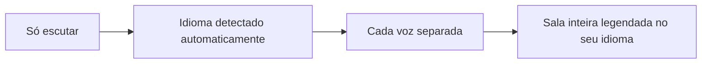
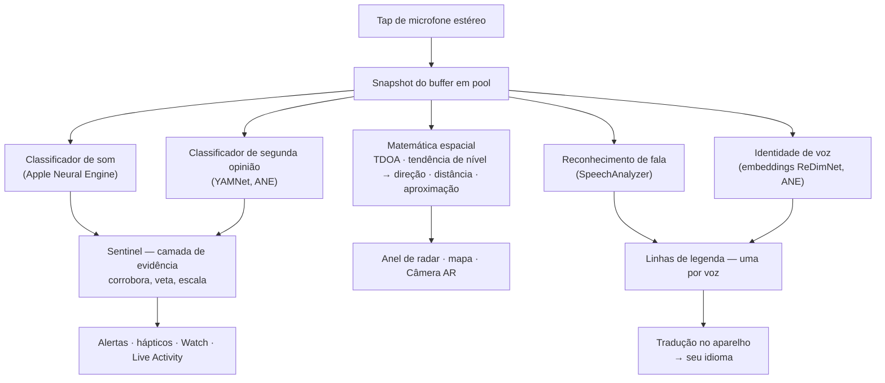
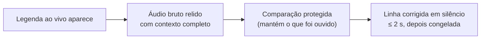
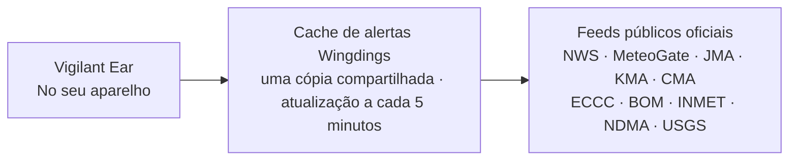

# Vigilant Ear 👂🛡️

*Vigente a partir da versão 1.1.4 · setembro de 2026.*

## Um radar acústico para quem não ouve.

Um app feito especialmente para a comunidade surda, com deficiência auditiva e CODA. A maioria dos apps de reconhecimento de som diz *o que* é um som. **O Vigilant Ear diz onde ele está, quem o está fazendo e o que estão dizendo** — transformando um iPhone num tricorder sônico em tempo real que descreve o som ao seu redor.

A direção e a distância de uma sirene. Uma batida atrás de você. As pessoas numa conversa, desenhadas como vozes transcritas separadas — cada uma legendada e posicionada na direção certa. Se alguém fala um idioma que você não lê, as palavras podem chegar **traduzidas para o seu.** Os alertas chegam à **Tela de Bloqueio, Dynamic Island e Apple Watch**, para um olhar bastar.

Tudo o que importa roda no aparelho. O áudio não é gravado nem enviado para reconhecimento. Nada depende de ouvir.

- 🧭 **Direção, não só detecção.** *O quê, onde, quem* e *o que foi dito* — não apenas “aconteceu um som.”
- 🔒 **Privado por design.** Classificação, legendas e tradução rodam no seu iPhone. As legendas são ao vivo e efêmeras; não ficam arquivadas como transcrição.
- ⌚ **No pulso e na Tela de Bloqueio.** O companheiro de direção do Apple Watch + Live Activity mantêm o último alerta e de onde veio a um olhar de distância.
- 🛰️ **Mais iPhones, um ouvido compartilhado.** O Constellation liga iPhones com Ultra-Wideband para fundir o que cada um captura numa imagem direcional mais nítida.
- 👁️ **Feito para Surdos / deficientes auditivos / CODA.** Hápticos distintos, visuais de alto contraste, sinais independentes de cor, alvos de toque grandes e respeito a Reduzir Movimento em todo o app.

---

## Para quem é

- **Usuários surdos, com deficiência auditiva e CODA** que querem consciência situacional do som — Home Watch (batida, alarme, bebê, telefone) e Street Watch (sirene, aproximação) que você pode deixar ligados e confiar.
- Quem precisa de **legendas ao vivo com direção e separação de falantes**, ou **tradução no aparelho** de pessoas perto de você.
- Pessoas de acessibilidade e pesquisa acústica interessadas em localização de som no dispositivo.

> O Vigilant Ear é um **auxílio** de acessibilidade, não um dispositivo certificado de segurança de vida.

---

## O que ele faz

### 🧭 Ele vê o som — direção e distância
Com os dois microfones do iPhone, o Vigilant Ear mede o **ângulo de um som e se ele está à sua frente ou atrás**, mantém essa leitura estável por cerca de um grau e coloca um marcador ao vivo num anel de radar orientado para cima e no mapa. Dois microfones numa linha não distinguem esquerda de direita sozinhos — um som a 50° à direita e outro a 50° à esquerda chegam com o mesmo atraso mínimo — então o app desenha a leitura mais um **fantasma mais fraco do outro lado**, e um giro do pulso ou um segundo telefone resolve. A distância é estimada pela intensidade sonora contra uma curva calibrada na rua e aparece como a estimativa que é: *≈ 50 ft*, com uma faixa provável. Você se move e os marcadores mantêm a posição no mundo real. Este é o núcleo: consciência espacial de um mundo que você não ouve. (Números abaixo.)

### 🚨 Ele reconhece sons importantes — e avisa você
Um classificador no aparelho identifica centenas de sons do dia a dia e vigia as categorias críticas — **sirenes, alarmes — inclusive uma classe dedicada de alarme de carro —, campainhas/batidas, choro de bebê, pessoa por perto e clima severo.** Quando um dispara, você recebe um alerta claro na tela, **notificação push** opcional e um **háptico** distinto — mesmo com o app em segundo plano ou o telefone dormindo. As categorias críticas já vêm prontas, então ativar notificações não significa “tudo desligado.” Desligue todas as categorias de alerta e o motor hiberna por completo em segundo plano para poupar bateria. Uma camada **Sentinel** cruza os alertas com evidências independentes — direção, movimento e feeds públicos — para que o que dispara seja corroborado, não o palpite isolado de um classificador. Funciona nos dois sentidos: um momento com cara de sirene dentro de uma música é segurado, mas uma sirene de verdade se repetindo por cima da sua música passa e alerta.

Avisos de clima severo vêm de feeds públicos oficiais — **NWS** dos EUA, **MeteoGate** da Europa, **CMA** da China, **KMA** da Coreia, **JMA** do Japão, **ECCC** do Canadá, **BOM** da Austrália, **INMET** do Brasil e **NDMA** da Índia — gratuitos para todos. Os feeds são filtrados para os que cobrem onde você está. No Japão o app também lê os **boletins antecipados** da JMA — avisos em linguagem simples emitidos dias antes de um tufão ou chuva forte, não só os alertas depois que o perigo chegou — além dos boletins de chuva súbita e deslizamento. Avisos antecipados aparecem com discreção, sem o som e a vibração reservados a um alerta real.

### ⌚ Apple Watch + Live Activity — um olhar e você sabe
- **Companheiro do Apple Watch** — a direção de um alerta aponta no pulso, para um olhar dizer para onde olhar. Interface do Watch redesenhada com o ícone de orelha do app, layout de HUD de ameaça e toque duplo para dispensar um alerta. Os alertas ainda podem mostrar a seta de direção com o app do Watch fechado.
- **Live Activity** — o Vigilant Ear fica na **Tela de Bloqueio**, na **Dynamic Island** e na **Pilha Inteligente do Watch**, para o último alerta e sua direção ficarem sempre a um olhar.
- **Alertas de parceiro no pulso** — quando o iPhone de um parceiro do Constellation dispara um alerta, ele também pode chegar ao seu Watch, com a direção. Uma passagem de confiabilidade mantém o companheiro leve na bateria do Watch o dia inteiro.

### 💬 Speaker Mode — legendas ao vivo e direcionais *(grátis)*
Ligue o **Speaker Mode** e o Vigilant Ear transcreve quem fala perto de você em **blocos de legenda, um por voz.** A diarização de falantes no aparelho mantém as vozes distintas — *quem* diz *o quê* — com uma indicação direcional no anel interno. O falante ao vivo fica em destaque; o texto mais antigo sobe conforme falta espaço.

Duas coisas que a maioria dos apps de legenda não faz: **honestidade sobre a confiança** — uma marca sutil de qualidade por linha e sublinhados pontilhados sob palavras duvidosas dizem quando confiar e quando conferir de novo — e **autocorreção**: logo depois que uma frase cai, o app relê o áudio com contexto completo e pode restaurar uma palavra perdida ou mal ouvida em cerca de dois segundos; aí o texto congela.

As legendas são grátis; a tradução automática é a camada opcional do Power Pack+. As legendas também podem ser **faladas nos seus aparelhos auditivos Bluetooth** — grátis, em Preferências. Os **Tons de Direção** (também grátis, em Preferências → Legendas) adicionam um sinal de áudio opcional no ouvido que você escolher, indicando onde está o falante — útil com aparelho auditivo ou audição unilateral, e disponível para qualquer pessoa.

### 🌐 Speaker Auto-Translate — seu idioma, ao vivo *(Power Pack+)*
Com o Speaker Mode ligado, quando alguém perto fala outro idioma, o Vigilant Ear pode detectá-lo e mostrar as legendas **no seu idioma**, com o idioma de origem no bloco. A cadeia — ouvir → separar falantes → transcrever → traduzir → exibir — roda **no aparelho**; o único momento de rede é o download único do pacote de idioma da Apple. Você não precisa saber nem escolher o outro idioma antes.

É o que existe de mais perto do **tradutor universal da ficção científica** — o aparelho que simplesmente entende. O Vigilant Ear detecta o idioma sozinho, acompanha cada falante na sala e legenda todos no seu idioma — sem fones, sem configuração, no seu aparelho.

```mermaid
graph LR
    A["Só escutar"] --> B["Idioma detectado automaticamente"] --> C["Cada voz separada"] --> D["Sala inteira legendada no seu idioma"]
```

### 🎵 Consciência de música e transmissão *(Power Pack+)*
O **ShazamKit** identifica música tocando ao seu redor e acompanha as trocas de faixa.

### 🎛️ Acoustic Scope — veja o som como um engenheiro
Uma visão profissional ao vivo do som ao seu redor: espectro, espectrograma, bandas RTA de ⅓ de oitava, croma e parciais harmônicos — **grátis para todos**. As ferramentas que capturam sons para treinar seus próprios pacotes fazem parte do Power Pack+.

### 📦 Pacotes de som personalizados — ensine o seu mundo *(Power Pack+)*
Ensine ao Vigilant Ear os sons que importam para você — dos pássaros da região à campainha do prédio. Pacotes adicionais se somam à detecção integrada, sem empurrar sirenes e alarmes para fora. Guia passo a passo dentro do app.

### 🛰️ Constellation — vários iPhones, um ouvido compartilhado *(Power Pack+)*
Com dois ou mais iPhones com Ultra-Wideband (a maioria desde o iPhone 11), o **Constellation** os emparelha para sentirem a posição um do outro e fundirem o que cada um captura numa imagem mais precisa de onde vem o som — um arranjo de escuta passiva e distribuída. As legendas também são fundidas: cada telefone transcreve o que o próprio microfone captura, e as palavras se alinham entre os aparelhos para o mais próximo de um falante contribuir com o que ouviu — palavras que só um telefone pegou são mantidas, não perdidas. Os iPhones se conectam **direto entre si** — sem roteador, sem Wi‑Fi compartilhado e sem internet; basta o Wi‑Fi ligado, pelo mesmo enlace ponto a ponto do AirDrop. Restrito a aparelhos com o hardware certo. Legendas da malha mais antigas que o horário de conexão de um par não são retransmitidas.

**Mensagens entre parceiros** — envie um texto rápido ao iPhone de um parceiro vinculado; ele cai no feed de legendas e pode chegar traduzido para o idioma dele, no aparelho. As mensagens respeitam a idade: com base na Faixa Etária Declarada da Apple, conversa por texto entre adulto e menor fica desligada a menos que os dois tenham se indicado deliberadamente um ao outro. Alertas e legendas nunca são bloqueados — só o texto de pessoa para pessoa.

### 🔗 Remote Link — alcance quem não está com você *(Power Pack+ para começar)*
O que uma ligação faria, feito com vídeo e texto. Você envia um código de convite; a outra pessoa entra de dentro do Vigilant Ear **sem ter Power Pack+**. Diferente do Constellation, não há exigência de proximidade — vocês dois podem estar em qualquer lugar.

**Nenhum áudio é usado em momento algum.** Só vídeo e texto, então nada na ligação depende de ouvir em nenhuma ponta — e você ganha um jeito de sinalizar com alguém pelo app. O app em si não entende língua de sinais; ele leva o vídeo e vocês dois fazem o resto. A conexão é direta entre os dois iPhones quando a rede permite, e o app mostra com clareza se está **Direta** ou **Revezada (Relayed)**, para você sempre saber se o vídeo passa por um relay.

### 📷 Câmera AR — “veja o som”
Abra a pílula da câmera na barra de título e fixe os sons detectados na direção real na câmera ao vivo. Os marcadores se agrupam por falante ou por categoria de som e direção para a vista continuar legível; as fontes vão sumindo quando ficam em silêncio.

### 🗺️ Mapas, ruas e previsão de trajeto
As direções do som projetam-se em coordenadas GPS reais no mapa. Sons de veículos podem ser **encaixados em ruas próximas** e ter o trajeto previsto para um caminhão passar *pela rua* em vez de atravessar prédios. (Experimente a demo do caminhão de bombeiros.)

### 🪄 Zona de Testes — prove sem ouvir
A **Zona de Testes** é pública para todos: prática Home & Street (batida, alarme, bebê, sirene, clima), demos de vários iPhones e de conversa, e uma marca d’água clara para a prática nunca se passar por evento ao vivo. Fechar o painel derruba as demos com limpeza (sem GPS falso preso, sem flags sobrando).

### ♿ Acessibilidade em primeiro lugar
Feito para Surdos / deficientes auditivos / CODA e pessoas daltônicas: sinais **independentes de cor**, alvos de toque **≥44 pt**, respeito a **Reduzir Movimento**, alertas multimodais (háptico + visual + Watch) e uma tela de verificação na abertura que mostra o status das permissões com estados claros verde / cinza / vermelho (e “não permitido” em laranja queimado) — inclusive a concessão de notificação que funciona como interruptor mestre dos alertas.

---

## Grátis e Power Pack+

O núcleo de segurança é **grátis, para sempre**:

- **Home Watch e Street Watch** — alertas de som locais (alarmes, sirenes, batidas/campainhas, bebê, pessoa por perto) na tela, com háptico e push opcional.
- **Legendas ao vivo** — Speaker Mode, no aparelho, direcionais onde o hardware permite, com marcas honestas de confiança, autocorreção em ~2 segundos, saída falada opcional para aparelhos auditivos Bluetooth e Tons de Direção.
- **Standing Watch** — a condição da própria sala, sempre ligado e sem configurar: lâmpada ciano constante enquanto o padrão da sala se mantém, âmbar quando algo muda — voz nova, silêncio súbito ou algo se aproximando.
- **Alertas de clima severo** — NWS, MeteoGate (Europa — servido fresco do nosso cache de alertas de 5 minutos), CMA, KMA, JMA (Japão), ECCC (Canadá), BOM (Austrália), INMET (Brasil) e NDMA (Índia) para a sua região.
- **Alertas de terremoto (USGS, mundial)** — sinta uma vibração e veja no mapa a área que sentiu o tremor quando um terremoto for reportado por perto. Confirmação do feed oficial do USGS — não é alerta precoce: se você sentiu o chão, isto diz o que foi. A detecção no aparelho de estrondo profundo (infrassom) pode armar a verificação no instante em que o solo se move.
- **Zona de Testes** — alertas de prática e prévias de recursos com marca d’água PREVIEW clara.
- **Companheiro do Apple Watch e Live Activity** — direção e último alerta num olhar.
- **Acoustic Scope** — visualização ao vivo de som em nível profissional, grátis para todos. (As ferramentas de captura para treino são Power Pack+.)

O **Power Pack+** é um desbloqueio único (**não é assinatura**) com **90 dias de teste grátis**. Ele adiciona os superpoderes:

- **Speaker Auto-Translate** — tradução no aparelho da fala próxima para o seu idioma.
- **Constellation** — audição compartilhada em vários iPhones via Ultra-Wideband, com mensagens entre parceiros.
- **Music ID** — reconhecimento de faixas com ShazamKit.
- **Pacotes de som personalizados** — classificadores extras que você treina para os seus sons.

Grátis ou Power Pack+, **seu áudio fica no aparelho para reconhecimento** — o nível só muda quais recursos estão liberados, nunca para onde o áudio bruto vai para análise.

---

## Como funciona (por baixo dos panos)

O Vigilant Ear é um pipeline **local em primeiro lugar, no aparelho**, em camadas: captura uma vez e deixa especialistas independentes lerem o mesmo som e checarem o trabalho uns dos outros. O áudio bruto é capturado num tap de alta prioridade, copiado para uma **lista livre de buffers em pool** (sem alocação frenética no caminho de tempo real) e distribuído sem travar a interface:

```mermaid
graph TD
    A["Tap de microfone estéreo"] --> B["Snapshot do buffer em pool"]
    B --> C["Classificador de som<br/>(Apple Neural Engine)"]
    B --> Y["Classificador de segunda opinião<br/>(YAMNet, ANE)"]
    C --> S["Sentinel — camada de evidência<br/>corrobora, veta, escala"]
    Y --> S
    S --> H["Alertas · hápticos · Watch · Live Activity"]
    B --> D["Matemática espacial<br/>TDOA · tendência de nível → direção · distância · aproximação"]
    D --> R["Anel de radar · mapa · Câmera AR"]
    B --> F["Reconhecimento de fala<br/>(SpeechAnalyzer)"]
    B --> E["Identidade de voz<br/>(embeddings ReDimNet, ANE)"]
    F --> G["Linhas de legenda — uma por voz"]
    E --> G
    G --> T["Tradução no aparelho<br/>→ seu idioma"]
```

Nenhum modelo é confiado sozinho. A camada **Sentinel** fica entre detecção e alerta: motores independentes corroboram ou vetam uns aos outros quadro a quadro — e quando evidência real repetida se acumula contra um veto (uma sirene de verdade uivando por cima da sua música), a evidência vence e o alerta dispara.

As legendas ganham uma segunda chance. Cada frase finalizada é relida em silêncio a partir de um anel curto de áudio na memória, com contexto completo — correções chegam em cerca de dois segundos e o texto congela de vez:

```mermaid
graph LR
    L["Legenda ao vivo aparece"] --> K["Áudio bruto relido<br/>com contexto completo"] --> V["Comparação protegida<br/>(mantém o que foi ouvido)"] --> W["Linha corrigida em silêncio<br/>≤ 2 s, depois congelada"]
```

- **Matemática espacial** — FFTs, Diferença de Tempo de Chegada ponderada por coerência (TDOA — favorece as bandas em que os dois microfones concordam e transforma o atraso mínimo em direção) e rastreamento de aproximação por tendência de nível em tarefas em segundo plano. O par de microfones é lido numa orientação fixa para a direção funcionar igual com o telefone em pé ou de lado.
- **Fala** — `SpeechAnalyzer` / `SpeechTranscriber` do iOS 26 para transcrição; embeddings de falante **ReDimNet** para identidade de voz; framework de **Tradução** da Apple para tradução no aparelho. Identidade de voz baseada em evidência: uma voz só é confirmada como pessoa real a partir de janelas independentes de som, e um pareamento incerto aparece sem atribuição em vez de chutar o nome errado.
- **Verdade musical** — um detector de **assinatura de faixa** por croma decide se “tem música tocando de verdade?”, porque classificadores gerais adoram chamar salas silenciosas e sirenes de “música.” O Shazam só roda quando a assinatura concorda que há algo musical.
- **Concorrência** — o isolamento do Swift 6 mantém o tap do microfone, a matemática acústica e o loop de renderização da UI bem separados.
- **Eficiência** — downsampling, classificação adaptativa à carga e uso de rede condicionado a evidência mantêm o “sempre ouvindo” leve o bastante para deixar ligado.

O clima e os alertas sísmicos tomam o caminho oposto do áudio — nada do seu som sai, mas *dados* de alerta entram. **Todo** feed oficial passa por um cache pequeno que operamos, para uma busca dos dados públicos servir a todos — e seu telefone nunca contata servidores de um governo estrangeiro:

```mermaid
graph LR
    P1["Vigilant Ear<br/>No seu aparelho"] --> W["Cache de alertas Wingdings<br/>uma cópia compartilhada · atualização a cada 5 minutos"]
    W --> N["Feeds públicos oficiais<br/>NWS · MeteoGate · JMA · KMA · CMA<br/>ECCC · BOM · INMET · NDMA · USGS"]
```

---

## O que o seu iPhone consegue ouvir — medido

Seu iPhone tem dois microfones a cerca de quinze centímetros de distância, um barômetro e um relógio muito bom. Isso basta para dizer de que lado está um som, mais ou menos a que distância, se está se aproximando e se uma porta acabou de abrir. Aqui está a precisão de cada um, como checamos e por que isso importa se você não ouve o som. Direção e números relacionados foram medidos num iPhone 17 e num iPhone 16 Pro Max em setembro de 2026. Distância continua sendo estimativa por natureza — e dizemos isso na tela.

**Direção — a uns poucos graus.** Um som chega ao microfone de cima antes do de baixo, ou depois, e desse atraso o app calcula quão longe do eixo do telefone está o som e se está na frente ou atrás. Os dois canais do telefone não são microfones “crus”, e sim uma imagem estéreo processada, e essa imagem acrescenta um padrão fixo próprio quando o ambiente está barulhento. O app agora aprende esse padrão em alguns segundos quietos após a abertura e o remove antes de ler a direção.

| O que medimos | Resultado |
|---|---|
| Erro mediano em 96 salas simuladas, do escritório silencioso à sala de paredes duras a 5 dB de SNR | 1,0° |
| iPhone 17 na mesa, ruído ambiente ligado, alto-falante a 30° do eixo | leu 61,7° a partir do plano lateral contra 60° esperados, oscilação 1,6° |
| Idem, alto-falante bem de lado do telefone | leu 4,5° contra 0° esperado, oscilação 2,2° |
| Idem, alto-falante bem à frente | toda leitura no atraso máximo, como deveria |
| Leituras caindo no padrão próprio da imagem em vez do som | nenhuma, em nenhum ângulo |

*Por que importa:* se você não ouve uma sirene, “atrás de você, um pouco de lado” diz para onde olhar. Uma leitura que fica firme só merece confiança depois de conferida com trena — e esta foi, duas vezes; na segunda, depois que a primeira checagem se mostrou generosa demais.

**Distância — mostrada como a estimativa que é.** Um microfone não mede distância, só intensidade, e um caminhão alto longe pode parecer um carro quieto perto. O app estima a distância pela intensidade com uma curva ajustada numa rua de verdade e fala como alguém cuidadoso: *cerca de 50 ft, provavelmente entre 25 e 100.*

| O que medimos | Resultado |
|---|---|
| Detecções reais de carro replayadas pela calibração | 1.131 |
| Dentro da faixa de 100 pés da rua em que de fato estavam | 73% |
| Carros na faixa longe | estimados 78 e 87 ft onde a trena deu 73 e 85 ft |

A rua (um cruzamento urbano) foi medida faixa a faixa; quando a curva erra, erra para o lado de perto. A calibração fica travada por um teste automatizado para não derivar em silêncio. Alarmes no seu próprio espaço, como detector de fumaça, não recebem figura de distância — já estão na sala com você.

**Movimento — vindo na sua direção.** Em carros e sirenes, ficar mais alto costuma significar chegar mais perto. O app observa quão rápido o nível de um som sobe em alguns segundos: uma subida sustentada de cerca de 1,5 dB por segundo (aumento claro e estável de intensidade) significa aproximação, uma queda equivalente significa afastamento, e um som que para de mudar deixa de ser chamado de um ou outro depois de cerca de quatro segundos. Um estalo alto isolado — buzina curta, porta batendo — não dispara. Baseado em física e nove testes automatizados; uma passagem de rua gravada é a próxima confirmação de campo.

**O ar na sala — uma porta tem assinatura.** O barômetro percebe uma porta abrindo a cerca de quatro metros e meio: a pressão cai enquanto a porta gira e volta quando fecha. Em quatorze horas de quietude e quinze eventos de porta, cada porta fez esse formato em duas partes e mais nada na casa fez.

| Evento | Taxa de pressão | Formato |
|---|---|---|
| Porta da frente, aberta e fechada, ×10 | 0,6–1,8 Pa/s | queda, depois retorno, ~5 s de intervalo |
| Porta da frente, batida, ×5 | 1,1–2,5 Pa/s | o mesmo par, mais alto |
| Ar-condicionado ciclando de madrugada, ×8 | 0,11–0,46 Pa/s | rampa lenta em minutos, idêntica nos dois telefones |
| Sala quieta | ~0,02 Pa/s | nada |
| Passar andando, espirrar | — | o sensor de movimento nota e o telefone ignora |

Uma porta de tela, que não veda a sala, ficou invisível — exatamente como deveria. Hoje um deslocamento de pressão pode aparecer como estrondos profundos no mapa; um alerta dedicado de porta em noite quieta está medido e desenhado, e ainda não é o padrão do dia a dia.

**Constellation — dois telefones fecham o lado.** Cada telefone na malha traça uma linha até o som de onde está, e as linhas só se cruzam limpas de um lado. Quando cruzam, o fantasma some e o app volta a poder dizer esquerda ou direita. Em simulação, dois telefones a **40 metros** colocam uma sirene a 50 metros com cerca de 2 metros de erro.

**Como qualquer número aqui ganha crédito.** Todo valor passou pelos mesmos três portões, nesta ordem: sala simulada com a resposta conhecida de antemão; testes automatizados pequenos que recriam o caso exato que enganaria o app e rodam a cada mudança; depois os telefones de verdade numa mesa de verdade com distâncias medidas à mão. Nada conta como preciso até sobreviver ao terceiro. Para quem não ouve o som, a palavra do app é a única palavra — precisa ser conquistada do jeito que um laboratório conquista.

Notas mais profundas para engenheiros: [Physics](https://vigilantear.com/en/physics/) — TDOA, distância, movimento, Constellation e detecção barométrica, com cada figura marcada MEASURED / BENCHED / MODELLED.

---

## Privacidade

- **No aparelho, sempre, para o pipeline central.** Classificação, matemática espacial, transcrição, diarização e tradução rodam no seu iPhone. O áudio bruto não é gravado nem enviado para reconhecimento.
- **Legendas são efêmeras.** As legendas ao vivo ficam na memória da sessão; logs de depuração exportados não incluem texto de legenda.
- **Sem SDKs de publicidade ou analytics comportamental.** Uso de rede limitado só a mapas, feeds públicos de clima, impressões digitais opcionais do Shazam, contexto de ruas e compras na App Store — veja a política completa.

Detalhes completos: [PRIVACY.md](PRIVACY.md) · [TERMS.md](TERMS.md) · [SUPPORT.md](SUPPORT.md)

---

## Hardware e plataformas

- **iPhone (experiência completa).** Funciona em retrato ou paisagem — segure como quiser. Microfones estéreo necessários para achar a direção. Recomendado **iPhone 13 ou mais recente**.
- **Apple Watch.** Alertas do companheiro com seta de direção; funciona com Live Activity / Pilha Inteligente.
- **iPad (nativo).** Layout adaptativo: na tela grande, as legendas ao vivo ganham um painel translúcido ao lado do mapa que se recolhe quando ninguém fala. Microfones de canal único → legendas sem direção completa.
- **Constellation** precisa de **Ultra-Wideband** — iPhone 11 ou posterior, excluindo SE e modelos “e”. **Não** precisa de rede Wi‑Fi: com o Wi‑Fi ligado, os iPhones se descobrem direto, então o Constellation funciona sem roteador e sem internet enquanto estiverem perto.
- **Android.** Build separado com radar central, alertas, legendas e clima; a malha Constellation é iOS primeiro. Acompanhe as atualizações no site do produto conforme a paridade com Android cresce.

---

## Localização

Totalmente localizado — interface, alertas e legendas — em **inglês, espanhol, português (Brasil), francês, alemão, italiano, árabe, japonês, chinês simplificado, coreano, russo e hindi** (12 idiomas). Segue o idioma do sistema ou uma escolha manual no app.

---

## Status e aviso

O Vigilant Ear é um **auxílio experimental de acessibilidade acústica**, não um utilitário certificado de segurança de vida. A resolução de localização varia com o entorno, clima, vento e hardware do microfone. **Mantenha sempre a sua consciência ambiental de sempre** — não dependa dele como única fonte de informação de segurança.

Algumas capacidades (marcadores de câmera AR, upgrade de entitlement de Critical Alerts quando a Apple conceder, autoria avançada de som em vários pacotes) continuam evoluindo; o Home / Street Watch grátis e as legendas ao vivo são o produto em que você pode confiar no primeiro dia.

---

**Contato:** [vigilantear@wingdingssocial.com](mailto:vigilantear@wingdingssocial.com)

Feito com ❤️ para a comunidade surda e com deficiência auditiva (D/HH) e para a pesquisa acústica.

    
  <strong>© 2026 Wingdings, Inc.</strong> 
  Todos os direitos reservados. 
  Patente pendente

