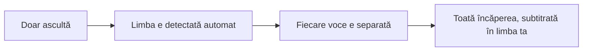
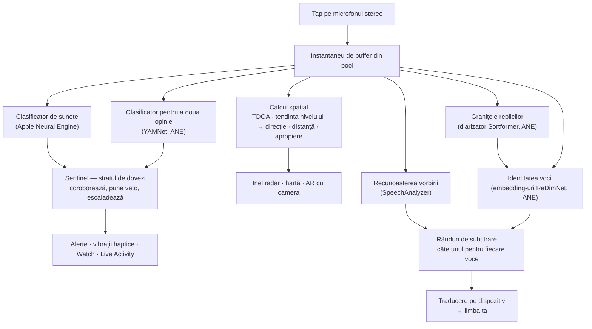
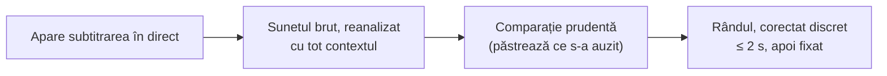
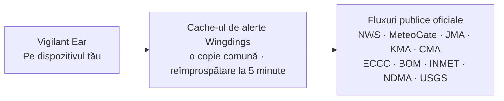

# Vigilant Ear 👂🛡️

*În vigoare începând cu versiunea 1.1.9 · septembrie 2026.*

## Un radar acustic pentru oamenii care nu aud.

O aplicație creată special pentru comunitatea persoanelor surde, hipoacuzice și CODA. Majoritatea aplicațiilor de recunoaștere a sunetelor îți spun *ce* este un sunet. **Vigilant Ear îți spune unde se află, cine îl produce și ce spune** — transformând un iPhone într-un tricorder sonic în timp real, care descrie sunetele din jurul tău.

Direcția și distanța unei sirene. Un ciocănit în spatele tău. Oamenii dintr-o conversație, afișați ca voci separate și transcrise — fiecare subtitrată și plasată după direcția din care vine. Dacă cineva vorbește o limbă pe care n-o citești, cuvintele sale pot ajunge la tine **traduse în limba ta.** Alertele ajung pe **ecranul de blocare, în Dynamic Island și pe Apple Watch**, așa că o privire e de ajuns.

Tot ce contează rulează pe dispozitiv. Sunetul nu este nici înregistrat, nici încărcat pentru recunoaștere. Nimic nu depinde de auz.

- 🧭 **Direcție, nu doar detecție.** *Ce, unde, cine* și *ce s-a spus* — nu doar „s-a produs un sunet”.
- 📣 **Nume strigat.** Adaugă numele tău, al unui copil, al partenerului — „comanda pentru Marie e gata” îți face ceasul să vibreze și arată din ce parte.
- 🔒 **Privat prin concepție.** Clasificarea, subtitrarea și traducerea rulează pe iPhone-ul tău. Subtitrările sunt în direct și efemere; nu sunt salvate ca arhivă de transcrieri.
- ⌚ **La încheietură și pe ecranul de blocare.** Aplicația însoțitoare de direcție pentru Apple Watch + Live Activity îți păstrează ultima alertă și direcția din care a venit la o privire distanță.
- 🛰️ **Mai multe telefoane, o ureche comună.** Constellation conectează iPhone-uri cu Ultra-Wideband pentru a combina ce aude fiecare într-o imagine direcțională mai clară.
- 👁️ **Făcut pentru surzi / hipoacuzici / CODA.** Vibrații haptice distincte, elemente vizuale cu contrast ridicat, indicii independente de culoare, zone de atingere mari și respectarea setării Reducere mișcare în toată aplicația.

---

## Pentru cine este

- **Utilizatori surzi, hipoacuzici și CODA** care își doresc conștientizare situațională a sunetelor — Home Watch (bătaie în ușă, alarmă, bebeluș, telefon) și Street Watch (sirenă, apropiere), pe care le poți lăsa pornite și pe care te poți baza.
- Oricine are nevoie de **subtitrări în direct, cu direcție și separarea vorbitorilor**, sau de **traducere pe dispozitiv** a celor care stau în apropiere.
- Utilizatori din domeniul accesibilității și al cercetării acustice, interesați de localizarea sunetelor pe dispozitiv.

> Vigilant Ear este un **ajutor** de accesibilitate, nu un dispozitiv certificat pentru siguranța vieții.

---

## Ce face

### 🧭 Vede sunetul — direcție și distanță
Folosind cele două microfoane ale iPhone-ului, Vigilant Ear măsoară **unghiul unui sunet și dacă acesta se află în fața ta sau în spatele tău**, menține citirea stabilă în limita a circa un grad și o plasează ca marcaj în timp real pe un inel radar orientat după direcția în care ești întors și pe hartă. Două microfoane aflate pe aceeași linie nu pot deosebi singure stânga de dreapta — un sunet aflat la 50° în dreapta ta și unul aflat la 50° în stânga ta ajung cu același decalaj minuscul de timp — așa că aplicația afișează citirea plus o **fantomă mai palidă pe partea opusă**, iar o rotire a încheieturii sau un al doilea telefon lămurește situația. Distanța este estimată din intensitatea sunetului, pe baza unei curbe calibrate pe stradă, și este afișată ca ceea ce este, o estimare: *≈ 50 ft*, cu un interval probabil — în unitățile de măsură ale țării în care te afli, nu în cele ale limbii în care citești aplicația. Când te miști, marcajele își păstrează poziția din lumea reală. Acesta e miezul: conștientizarea spațială a unei lumi pe care n-o poți auzi. (Cifrele, mai jos.)

### 🚨 Recunoaște sunetele importante — și te avertizează
Un clasificator care rulează pe dispozitiv identifică sute de sunete cotidiene și urmărește categoriile critice — **sirene, alarme — inclusiv o clasă dedicată alarmelor auto — sonerii/bătăi în ușă, plâns de bebeluș, o persoană în apropiere și vreme severă.** Când una dintre ele se declanșează, primești o alertă clară pe ecran, o **notificare push** opțională și o **vibrație haptică** distinctă — chiar și atunci când aplicația rulează în fundal sau telefonul este în repaus. Categoriile critice sunt pregătite din start, așa că activarea notificărilor nu înseamnă „totul oprit”. Dacă oprești toate categoriile de alertă, motorul intră complet în hibernare cât timp aplicația e în fundal, ca să economisească bateria. Un strat **Sentinel** verifică alertele prin comparație cu dovezi independente — direcție, mișcare și fluxuri publice — astfel încât ce se declanșează este coroborat, nu presupunerea izolată a unui singur clasificator. Funcționează în ambele sensuri: un moment dintr-o melodie care seamănă cu o sirenă este reținut, dar o sirenă reală care se repetă peste muzica ta răzbate și declanșează alerta.

Avertizările de vreme severă provin din fluxuri publice oficiale — **NWS** din SUA, **MeteoGate** din Europa, **CMA China**, **KMA Coreea**, **JMA Japonia**, **ECCC Canada**, **BOM Australia**, **INMET Brazilia** și **NDMA India** — gratuite pentru toți utilizatorii. Fluxurile sunt restrânse la cele care acoperă zona în care te afli. În Japonia, aplicația citește și **buletinele anticipate** ale JMA — anunțurile în limbaj simplu emise cu zile înainte de un taifun sau de ploi abundente, nu doar avertizările emise după ce pericolul a sosit — plus buletinele despre averse bruște și alunecări de teren. Anunțurile anticipate sunt afișate discret, fără sunetul și vibrația rezervate unei avertizări reale.

### ⌚ Apple Watch + Live Activity — o privire și știi
- **Aplicația însoțitoare pentru Apple Watch** — direcția unei alerte îți este indicată la încheietură, așa că o privire îți spune unde să te uiți. Interfață Watch reproiectată, cu pictograma-ureche a aplicației, aspect HUD pentru amenințări și atingere dublă pentru a închide o alertă. Alertele pot afișa săgeata de direcție chiar și atunci când aplicația de pe Watch nu este deschisă.
- **Live Activity** — Vigilant Ear rămâne pe **ecranul de blocare**, în **Dynamic Island** și în **Watch Smart Stack**, așa că ultima alertă și direcția ei sunt mereu la o privire distanță.
- **Alertele partenerilor, pe încheietura ta** — când telefonul unui partener Constellation conectat emite o alertă, aceasta poate ajunge și pe Watch-ul tău, inclusiv cu direcția. O rundă de îmbunătățiri pentru fiabilitate face ca aplicația însoțitoare să consume puțin din bateria Watch-ului pe tot parcursul zilei.

### 💬 Speaker Mode — subtitrări în direct, cu direcție *(gratuit)*
Pornește **Speaker Mode**, iar Vigilant Ear transcrie ce spun oamenii din apropierea ta în **blocuri de subtitrare, câte unul pentru fiecare voce.** Diarizarea vorbitorilor, făcută pe dispozitiv, ține vocile separate — *cine* spune *ce* — cu un indiciu de direcție pe inelul interior. Vorbitorul activ este evidențiat; textul mai vechi iese prin derulare pe măsură ce e nevoie de spațiu.

Două lucruri pe care majoritatea aplicațiilor de subtitrare nu le fac: **onestitate privind gradul de încredere** — un semn discret de calitate pe fiecare rând și sublinieri punctate sub cuvintele îndoielnice îți arată când te poți baza pe un rând și când e bine să verifici — și **autocorectare**: imediat după ce o propoziție apare, aplicația reanalizează sunetul cu tot contextul și poate recupera un cuvânt ratat sau auzit greșit în circa două secunde, apoi textul îngheață.

**Nume strigat** (în Preferințe, dezactivat până îl activezi) urmărește în acele subtitrări numele pe care le-ai trecut în listă — al tău, al unui copil, al partenerului. Când cineva spune „comanda pentru Marie e gata”, primești o vibrație haptică distinctă și o alertă pe Watch, cu direcția, nu încă o bulă de subtitrare. Cuvintele apar în continuare în Speaker Mode, ca vorbire; aceasta este vibrația care îți spune că vorbeau *cu tine*.

**Limbajul vulgar poate fi mascat** (Preferințe → Subtitrări). Altfel, înjurăturile apar ca text simplu, fără nimic care să le atenueze, iar cine citește nu are nicio șansă să-și ferească privirea la timp; activează opțiunea, iar acele cuvinte sunt înlocuite cu simboluri, astfel încât propoziția se poate citi și fără ele. Ce se consideră limbaj vulgar decide recunoașterea vocală a propriului tău dispozitiv — nu o listă de cuvinte întocmită de noi — așa că se adaptează limbii transcrise. Pe un cont declarat ca fiind sub 18 ani, opțiunea este mereu activă și afișează un lacăt. Se aplică vorbirii pe care o transcrie *acest* dispozitiv; textul retransmis de la un telefon asociat a fost transcris acolo și ajunge ca text finalizat.

**Cuvântul pe care a apăsat vorbitorul este marcat cu aldine.** Rostite cu voce tare, „N-am spus ASTA” și „N-am spus asta” sunt două propoziții diferite, iar o transcriere identică pierde complet diferența. Aplicația caută singurul cuvânt pe care vocea vorbitorului l-a rostit pe un ton mai înalt și îl scrie cu aldine — cel mult unul pe rând și niciunul atunci când nu e sigură, pentru că a marca un cuvânt greșit înseamnă a-i pune cuiva vorbe în gură. Funcția e oprită în chineză și japoneză, unde înălțimea tonului îți spune *despre ce cuvânt este vorba*, nu cât de apăsat a fost rostit.

Subtitrările sunt gratuite; traducerea automată este stratul opțional din Power Pack+. Subtitrările pot fi și **citite cu voce tare prin dispozitivele tale auditive Bluetooth** — gratuit, din Preferințe. Funcția **Tonuri de direcție** (tot gratuită, în Preferințe → Subtitrări) adaugă un semnal sonor opțional, în urechea pe care o alegi, care indică unde se află un vorbitor — util cu un aparat auditiv sau cu auz doar pe o parte, și disponibil oricui.

### 🌐 Traducere automată — limba ta, în direct *(Power Pack+)*
Cu Speaker Mode pornit, când o persoană din apropiere vorbește altă limbă, Vigilant Ear o poate detecta și îi poate afișa subtitrările **în limba ta**, cu limba sursă indicată pe blocul ei. Lanțul — ascultare → separarea vorbitorilor → transcriere → traducere → afișare — rulează **pe dispozitiv**; singurul moment în care se folosește rețeaua este descărcarea unică a unui pachet de limbă de la Apple, iar când aștepți tocmai această descărcare, aplicația îți spune asta, în loc să te lase să te uiți la un text netradus. Nu trebuie să știi sau să alegi dinainte cealaltă limbă.

Este cel mai apropiat lucru disponibil astăzi de **traducătorul universal din science-fiction** — dispozitivul care pur și simplu înțelege. Vigilant Ear detectează singur limba, urmărește fiecare vorbitor din încăpere și îi subtitrează pe toți în limba ta — fără căști, fără configurare, pe dispozitivul tău.

### 🎵 Muzică și emisiuni: știi ce se aude *(Power Pack+)*
**ShazamKit** identifică muzica ce se aude în jurul tău și urmărește schimbările de melodie.

### 🎛️ Acoustic Scope — vezi sunetul ca un inginer
O vizualizare profesională, în direct, a sunetelor din jurul tău: spectru, spectrogramă, benzi RTA de ⅓ de octavă, chroma și parțiale armonice — **gratuită pentru toată lumea**. **Vederea Parțiale citește muzica:** fiecare ton este numit după nota sa, cu seria sa armonică alături, sunetele mai înalte, cum ar fi alarmele de fum, sunt numite la înălțimea lor reală, iar tu poți seta o notă-țintă, afișată ca o linie după care să cânți sau să-ți acordezi instrumentul. Nu încălzește telefonul — dacă lași deschisă vederea Spectrogramă, costul e aproape nul, oricât de mult ai privi. Instrumentele care captează sunete pentru antrenarea propriilor pachete personalizate fac parte din Power Pack+.

### 📦 Pachete de sunete personalizate — învață-l sunetele lumii tale *(Power Pack+)*
Învață Vigilant Ear sunetele care contează pentru tine — de la păsările din zonă până la soneria clădirii tale. Pachetele suplimentare se adaugă peste detecția încorporată, așa că sunetele noi nu dau niciodată la o parte sirenele și alarmele. Un ghid pas cu pas este inclus în aplicație.

### 🛰️ Constellation — mai multe iPhone-uri, o ureche comună *(Power Pack+)*
Cu două sau mai multe iPhone-uri cu Ultra-Wideband (majoritatea modelelor de la iPhone 11 încoace), **Constellation** le asociază astfel încât să-și poată percepe reciproc poziția și să combine ce aude fiecare într-o singură imagine, mai precisă, a locului din care vine un sunet — o rețea de ascultare distribuită și pasivă. Și subtitrările sunt combinate: fiecare telefon transcrie ce aude propriul microfon, iar cuvintele sunt aliniate între telefoane, astfel încât cel mai apropiat de vorbitor contribuie cu ce a auzit — cuvintele prinse de un singur telefon sunt păstrate, nu pierdute. Telefoanele se conectează **direct între ele** — fără router, fără rețea Wi-Fi comună și fără internet; Wi-Fi-ul trebuie doar să fie pornit, iar conexiunea folosește aceeași legătură peer-to-peer ca AirDrop. Disponibil doar pe dispozitivele cu hardware-ul potrivit. Subtitrările din rețeaua mesh mai vechi decât momentul în care s-a conectat un telefon partener nu sunt retransmise.

**Mesaje către parteneri** — trimite un mesaj scurt pe telefonul unui partener conectat; acesta ajunge în fluxul său de subtitrări și poate sosi tradus în limba sa, pe dispozitiv. Mesageria ține cont de vârstă: construită pe Declared Age Range de la Apple, ea menține dezactivat schimbul de mesaje dintre un adult și un minor, cu excepția cazului în care ambele persoane și-au dat deliberat un nume una alteia. Alertele și subtitrările nu sunt niciodată restricționate — doar mesajele de la persoană la persoană.

### 🔗 Remote Link — ia legătura cu cineva care nu e lângă tine *(Power Pack+ pentru a iniția)*
Ceea ce ar face în mod normal un apel telefonic, realizat însă prin video și text. Trimiți un cod de invitație; cealaltă persoană se alătură din aplicația Vigilant Ear **fără să dețină Power Pack+**. Spre deosebire de Constellation, nu e nevoie să fiți aproape unul de altul — puteți fi oriunde.

**Nu se folosește audio în niciun moment.** Doar video și text, așa că nimic din acest link nu depinde de auz, la niciunul dintre capete — și îți oferă o cale de a comunica în limbaj mimico-gestual cu cineva prin aplicație. Aplicația în sine nu înțelege limbajul mimico-gestual; ea transmite videoul, iar voi doi faceți restul. Conexiunea este directă între cele două telefoane oriunde rețeaua permite, iar aplicația îți arată clar dacă este **Direct** sau **Relayed**, ca să știi mereu dacă videoul tău trece printr-un releu.

**Și subtitrările circulă.** Ce transcrie fiecare telefon apare pe celălalt, tradus în limba celui care citește atunci când e nevoie. Oricare dintre voi poate pune linkul pe pauză — video și subtitrări — îl poate relua și îl poate închide din ecranul principal.

### 📷 AR cu camera — „vezi sunetul”
Deschide pastila camerei de pe bara de titlu și fixează sunetele detectate pe direcția lor reală, în imaginea camerei, în timp real. Marcajele se grupează după vorbitor sau după categoria de sunet și direcție, ca imaginea să rămână lizibilă; sursele se estompează treptat când tac.

### 🗺️ Hărți, drumuri și predicția traseului
Direcțiile sunetelor sunt proiectate pe coordonate GPS reale, pe hartă. Sunetele vehiculelor pot fi **ancorate la străzile din apropiere**, iar traseele lor pot fi prezise, astfel încât un camion care trece apare deplasându-se *de-a lungul drumului*, nu prin clădiri. (Încearcă demonstrația cu mașina de pompieri.)

### 🪄 Feature Playground — convinge-te fără să auzi nimic
**Feature Playground** este deschis tuturor: exerciții Casă și stradă (bătaie în ușă, alarmă, bebeluș, sirenă, meteo), demonstrații cu mai multe telefoane și de conversație, plus un filigran clar, pentru ca exercițiul să nu se dea niciodată drept un eveniment real. Închiderea panoului oprește curat demonstrațiile (nicio locație GPS simulată rămasă blocată, niciun indicator rămas activ).

### ♿ Accesibilitatea pe primul loc
Creat pentru utilizatori surzi / hipoacuzici / CODA și pentru utilizatorii daltoniști: indicii **independente de culoare**, zone de atingere de **≥44 pt**, respectarea setării **Reducere mișcare**, **afișare de la dreapta la stânga** pentru cititorii de limbă arabă, alerte multimodale (haptic + vizual + Watch) și un ecran de verificare la pornire care arată starea permisiunilor prin stări clare verde / gri / roșu (și portocaliu ars pentru „nepermis”) — inclusiv permisiunea pentru notificări, care funcționează drept comutatorul principal al alertelor.

---

## Gratuit și Power Pack+

Nucleul de siguranță este **gratuit, pentru totdeauna**:

- **Home Watch și Street Watch** — alerte sonore locale (alarme, sirene, bătăi în ușă/sonerii, bebeluș, persoană în apropiere), afișate pe ecran, prin vibrații haptice și, opțional, prin notificări push.
- **Subtitrări în direct** — Speaker Mode, pe dispozitiv, cu direcție acolo unde hardware-ul permite, cu semne oneste de încredere, autocorectare în ~2 secunde, redare vocală opțională prin dispozitivele auditive Bluetooth și Tonuri de direcție.
- **Nume strigat** — nume opționale pe care le tastezi tu (al tău, ale copiilor, al partenerului). O potrivire înseamnă o alertă pe Watch/telefon, cu direcția, nu o a doua subtitrare.
- **Standing Watch** — starea proprie a încăperii, mereu activ, fără nimic de configurat: o lampă cyan constantă cât timp încăperea își păstrează tiparul, chihlimbar când ceva se schimbă — o voce nouă, o liniște bruscă sau ceva care se apropie.
- **Alerte de vreme severă** — NWS, MeteoGate (Europa — livrat proaspăt din cache-ul nostru de alerte, reîmprospătat la 5 minute), CMA, KMA, JMA (Japonia), ECCC (Canada), BOM (Australia), INMET (Brazilia) și NDMA (India), pentru regiunea ta.
- **Alerte de cutremur (USGS, în toată lumea)** — simți o vibrație și vezi pe hartă zona în care s-a resimțit, atunci când e raportat un cutremur în apropiere. O confirmare din fluxul oficial USGS — nu o avertizare timpurie: dacă ai simțit o zguduitură, asta îți spune ce a fost. Detecția pe dispozitiv a huruielilor joase (infrasunete) poate activa verificarea în clipa în care se mișcă pământul.
- **Feature Playground** — alerte de exercițiu și previzualizări ale funcțiilor, cu un filigran PREVIZUALIZARE clar.
- **Aplicația însoțitoare pentru Apple Watch și Live Activity** — direcția și ultima alertă, dintr-o privire.
- **Acoustic Scope** — vizualizare profesională a sunetului în direct, gratuită pentru toată lumea. (Instrumentele de captare pentru antrenare fac parte din Power Pack+.)

**Power Pack+** este o deblocare unică (**nu un abonament**), cu o **perioadă de probă gratuită de 90 de zile**. Adaugă superputerile:

- **Traducere automată** — traducerea pe dispozitiv a vorbirii din apropiere în limba ta.
- **Constellation** — auz comun pe mai multe iPhone-uri prin Ultra-Wideband, cu mesaje către parteneri.
- **Music ID** — recunoașterea melodiilor cu ShazamKit.
- **Pachete de sunete personalizate** — clasificatori suplimentari pe care îi antrenezi pentru propriile sunete.

Gratuit sau cu Power Pack+, **sunetul tău rămâne pe dispozitiv pentru recunoaștere** — nivelul ales schimbă doar ce funcții sunt deblocate, niciodată locul în care este trimis sunetul brut pentru analiză.

---

## Cum funcționează (sub capotă)

Vigilant Ear este un flux de procesare **în primul rând local, pe dispozitiv**, construit în straturi: sunetul e captat o singură dată, apoi specialiști independenți citesc același sunet și își verifică reciproc munca. Sunetul brut este preluat printr-un tap audio de prioritate ridicată, copiat într-o **listă de buffere libere dintr-un pool** (fără avalanșe de alocări de memorie pe calea de timp real) și distribuit mai departe fără să blocheze interfața:

Niciun model nu este crezut pe cuvânt de unul singur. Stratul **Sentinel** se află între detecție și alertare: motoare independente se confirmă sau își pun veto reciproc, cadru cu cadru — iar când dovezile repetate din lumea reală se adună împotriva unui veto (o sirenă reală care urlă peste muzica ta), dovezile câștigă și alerta se declanșează.

Subtitrările au și ele propria a doua șansă. Fiecare propoziție finalizată este reanalizată discret, cu tot contextul, dintr-un scurt buffer audio circular ținut în memorie — corecturile apar în circa două secunde, apoi textul rămâne fixat definitiv:

- **Calcul spațial** — FFT-uri, diferența de timp de sosire ponderată după coerență (TDOA — se favorizează benzile de frecvență asupra cărora ambele microfoane sunt de acord, apoi micul decalaj de sosire este transformat într-o direcție) și urmărirea apropierii după tendința nivelului, în sarcini de fundal. Perechea de microfoane este citită într-o orientare fixă, astfel încât direcția funcționează la fel, indiferent dacă ții telefonul vertical sau orizontal.
- **Vorbire** — `SpeechAnalyzer` / `SpeechTranscriber` din iOS 26 pentru transcriere; framework-ul **Translation** de la Apple pentru traducerea pe dispozitiv. Identitatea vocii se bazează pe dovezi: o voce este confirmată ca aparținând unei persoane reale doar pe baza unor ferestre de sunet independente, iar o potrivire nesigură apare ca neatribuită, în loc să se ghicească un nume greșit.
- **Două modele pentru două întrebări** — ca să deosebești vocile trebuie să afli *când s-a schimbat vorbitorul* și *cine este acel vorbitor*, iar acestea nu sunt aceeași problemă. Un diarizator în flux continuu **Sortformer** marchează granițele replicilor; embedding-urile **ReDimNet** decid a cui voce se află în fiecare dintre ele. Tăierea exact pe graniță contează mai mult decât pare: o fereastră care se întinde peste doi oameni îi conține pe amândoi, iar niciun model de embedding nu mai poate corecta asta ulterior. Sub ambele se află un prag de activitate vocală — dacă, într-o încăpere dificilă, diarizatorul tace în loc să ghicească, replicile sunt totuși delimitate, așa că aplicația se degradează în loc să contopească doi vorbitori într-unul singur.
- **Adevărul despre muzică** — un **detector de semnătură a melodiilor** bazat pe chroma are ultimul cuvânt în decizia „chiar se aude muzică?”, pentru că clasificatorii generali sunt renumiți pentru faptul că numesc „muzică” încăperile tăcute și sirenele. Shazam rulează doar după ce semnătura confirmă că acolo chiar este ceva muzical.
- **Concurență** — izolarea din Swift 6 ține separate în mod curat preluarea audio de la microfon, calculele acustice și bucla de randare a interfeței.
- **Eficiență** — subeșantionarea, clasificarea adaptată la încărcare și folosirea rețelei condiționată de dovezi mențin ascultarea permanentă suficient de ușoară încât s-o poți lăsa pornită.

Alertele meteo și de cutremur urmează drumul invers față de sunet — nimic legat de sunetul tău nu iese vreodată, dar *datele* alertelor intră. **Fiecare** flux oficial trece printr-un mic cache operat de noi, astfel încât o singură preluare a datelor publice deservește toți utilizatorii — iar telefonul tău nu contactează niciodată serverele unui guvern străin:

---

## Ce poate auzi telefonul tău — măsurat

iPhone-ul tău are două microfoane aflate la circa șase inci unul de altul, un barometru și un ceas foarte bun. Asta e suficient ca să-ți spună din ce parte vine un sunet, cam cât de departe e, dacă se apropie de tine și dacă tocmai s-a deschis o ușă. Iată cât de precisă este fiecare dintre aceste informații, cum am verificat și de ce contează dacă nu poți auzi tu însuți sunetul. Direcția și cifrele asociate au fost măsurate pe un iPhone 17 și pe un iPhone 16 Pro Max în septembrie 2026. Distanța rămâne, prin natura ei, o estimare — o spunem și pe ecran.

**Direcția — cu o precizie de un grad sau două.** Un sunet ajunge la microfonul de sus înaintea celui de jos sau după el, iar din acest decalaj aplicația calculează cât de departe de axa telefonului se află sunetul și dacă este în față sau în spate. Cele două canale ale telefonului nu sunt simple microfoane, ci o imagine stereo procesată, iar această imagine adaugă un tipar fix propriu ori de câte ori încăperea este zgomotoasă. Acum, aplicația învață acest tipar din câteva secunde de liniște de după pornire și îl elimină înainte de a citi direcția.

| Ce am măsurat | Rezultat |
|---|---|
| Eroarea mediană în 96 de încăperi simulate, de la un birou liniștit la o încăpere cu pereți duri, la 5 dB SNR | 1,0° |
| iPhone 17 pe un birou, cu zgomot ambiental pornit, difuzor la 30° față de axă | a indicat 61,7° față de planul lateral, comparativ cu 60° așteptate, oscilație 1,6° |
| La fel, difuzor exact în dreptul laturii telefonului | a indicat 4,5° comparativ cu 0° așteptate, oscilație 2,2° |
| La fel, difuzor drept în față | fiecare citire la întârzierea maximă, așa cum trebuie |
| Citiri care cad pe tiparul propriu al imaginii în loc de sunet | niciuna, la niciun unghi |

*De ce contează:* dacă nu poți auzi o sirenă, „în spatele tău, puțin într-o parte” îți spune unde să te uiți. O citire care stă pe loc merită încredere doar după ce a fost verificată cu ruleta, iar aceasta a fost verificată de două ori, a doua oară după ce prima verificare s-a dovedit prea îngăduitoare.

**Distanța — afișată ca ceea ce este: o estimare.** Un microfon nu poate măsura distanța, ci doar intensitatea sunetului, iar un camion zgomotos aflat departe poate suna ca o mașină silențioasă aflată aproape. Aplicația estimează distanța din intensitate folosind o curbă ajustată pe o stradă reală, apoi o exprimă așa cum ar face-o o persoană atentă: *circa 50 ft, probabil între 25 și 100.*

| Ce am măsurat | Rezultat |
|---|---|
| Detecții reale de mașini, rulate din nou prin calibrare | 1.131 |
| Plasate în interiorul celor 100 de picioare de drum pe care se aflau de fapt | 73% |
| Mașini de pe banda îndepărtată | estimate la 78 și 87 ft, acolo unde ruleta arăta 73 și 85 ft |

Drumul (o intersecție din oraș) a fost măsurat bandă cu bandă; când curba greșește, greșește în sensul unei distanțe mai mici. Calibrarea este blocată printr-un test automat, ca să nu poată deriva pe nesimțite. Alarmele din propriul tău spațiu, cum ar fi un detector de fum, nu primesc deloc o cifră de distanță — sunt deja în încăpere cu tine.

**Mișcarea — se apropie de tine.** La mașini și sirene, un sunet care devine mai puternic înseamnă de obicei că se apropie. Aplicația urmărește cât de repede crește nivelul unui sunet pe parcursul câtorva secunde: o creștere susținută de circa 1,5 dB pe secundă (o intensificare clară și constantă) înseamnă apropiere, o scădere similară înseamnă îndepărtare, iar un sunet care nu se mai schimbă nu mai primește niciuna dintre aceste etichete după circa patru secunde. Un singur moment zgomotos — un claxon scurt, o ușă trântită — nu poate declanșa detecția. Bazat pe fizică și pe nouă teste automate; o trecere pe stradă înregistrată este următoarea confirmare pe teren.

**Aerul din încăpere — o ușă are o semnătură.** Barometrul poate observa o ușă care se deschide la circa paisprezece picioare distanță: presiunea scade în timp ce ușa se mișcă, apoi revine când aceasta se închide. Pe parcursul a paisprezece ore de liniște și a cincisprezece evenimente legate de uși, fiecare ușă a produs acea formă în două părți, și nimic altceva din casă nu a produs-o.

| Eveniment | Rata de variație a presiunii | Formă |
|---|---|---|
| Ușa de la intrare, deschisă și închisă, ×10 | 0,6–1,8 Pa/s | scădere, apoi revenire, la ~5 s distanță |
| Ușa de la intrare, trântită, ×5 | 1,1–2,5 Pa/s | aceeași pereche, mai amplă |
| Aerul condiționat pornind și oprindu-se peste noapte, ×8 | 0,11–0,46 Pa/s | pantă lentă, pe parcursul câtorva minute, identică pe ambele telefoane |
| O încăpere liniștită | ~0,02 Pa/s | nimic |
| Cineva care trece pe lângă, un strănut | — | senzorul de mișcare observă, iar telefonul ignoră evenimentul |

O ușă cu plasă, care nu etanșează încăperea, a fost invizibilă — exact cum trebuie. În prezent, o variație de presiune poate apărea pe hartă ca huruieli joase; o alertă dedicată pentru uși, în nopțile liniștite, a fost măsurată și proiectată, dar nu este încă setarea implicită de zi cu zi.

**Constellation — două telefoane lămuresc partea.** Fiecare telefon din rețea trasează o linie spre sunet, din locul în care se află, iar liniile se intersectează clar doar pe o parte. Când se întâmplă asta, fantoma dispare și aplicația poate spune din nou stânga sau dreapta. În simulare, două telefoane aflate **la 40 de metri unul de altul** localizează o sirenă aflată la 50 de metri cu o precizie de circa 2 metri.

**Cum ajunge ceva de aici să fie crezut.** Fiecare cifră a trecut prin aceleași trei filtre, în ordine: o încăpere simulată, cu răspunsul cunoscut dinainte; teste automate mici, care recreează exact cazul care ar păcăli aplicația și rulează la fiecare modificare; apoi telefoanele reale, pe un birou real, cu distanțe măsurate de mână. Nimic nu e considerat precis până nu trece și de al treilea. Pentru cineva care nu poate auzi sunetul, cuvântul aplicației e singurul cuvânt — și ar trebui câștigat așa cum îl câștigă un laborator.

Note mai detaliate pentru ingineri: [Fizică](https://vigilantear.com/en/physics/) — TDOA, distanță, mișcare, Constellation și detecție barometrică, cu fiecare cifră etichetată MEASURED / BENCHED / MODELLED.

---

## Confidențialitate

- **Pe dispozitiv, întotdeauna, pentru fluxul de procesare principal.** Clasificarea, calculul spațial, transcrierea, diarizarea și traducerea rulează pe iPhone-ul tău. Sunetul brut nu este nici înregistrat, nici încărcat pentru recunoaștere.
- **Subtitrările sunt efemere.** Subtitrările în direct rămân în memorie pe durata sesiunii; jurnalele de depanare exportate nu includ textul subtitrărilor.
- **Fără SDK-uri de publicitate sau de analiză comportamentală.** Rețeaua este folosită limitat, doar pentru hărți, fluxuri meteo publice, amprente Shazam opționale, contextul rutier și achiziții din App Store — vezi politica completă.

Toate detaliile: [Politica de confidențialitate](/ro/privacy/) · [Termeni de serviciu](/ro/terms/) · [Suport](/ro/support/)

---

## Hardware și platforme

- **iPhone (experiență completă).** Funcționează în modul portret sau peisaj — ține-l cum vrei. Pentru determinarea direcției sunt necesare microfoane stereo. Recomandat: **iPhone 13 sau mai nou**.
- **Apple Watch.** Alerte în aplicația însoțitoare, cu săgeată de direcție; funcționează cu Live Activity / Smart Stack.
- **iPad (nativ).** Aspect adaptiv: pe ecranul mare, subtitrările în direct au un panou transparent lângă hartă, care se retrage când nu vorbește nimeni. Microfoane cu un singur canal → subtitrări fără direcție completă.
- **Constellation** necesită **Ultra-Wideband** — iPhone 11 sau mai nou, cu excepția modelelor SE și „e”. **Nu** necesită o rețea Wi-Fi: cu Wi-Fi-ul pornit, telefoanele se descoperă direct unul pe altul, așa că Constellation funcționează fără router și fără internet, atâta timp cât telefoanele sunt aproape unul de altul.
- **Android.** Versiune separată, cu radarul de bază, alerte, subtitrări și meteo; rețeaua mesh Constellation apare mai întâi pe iOS. Urmărește noutățile de pe site-ul produsului, pe măsură ce versiunea Android se apropie de paritate.

---

## Localizare

Localizată complet — interfață, alerte și subtitrări — în **engleză, spaniolă, portugheză (Brazilia), franceză, germană, italiană, turcă, arabă, japoneză, chineză simplificată, chineză tradițională, coreeană, rusă, hindi și română** (15 limbi). Urmează limba sistemului sau o alegere manuală din aplicație. Subtitrările în română funcționează pe dispozitiv; Apple Translate nu are limba română, așa că funcția Traducere automată afișează originalul pentru această limbă.

---

## Stadiu și declinarea răspunderii

Vigilant Ear este un **ajutor experimental pentru accesibilitate acustică**, nu un instrument certificat pentru siguranța vieții. Rezoluția localizării variază în funcție de împrejurimi, vreme, vânt și hardware-ul microfonului. **Păstrează-ți întotdeauna atenția obișnuită la mediul înconjurător** — nu te baza pe aplicație ca unică sursă de informații de siguranță.

Unele capabilități (marcajele AR din imaginea camerei, trecerea la dreptul pentru Alerte critice când este acordat de Apple, crearea avansată de sunete în mai multe pachete) continuă să evolueze; supravegherea gratuită Home / Street și subtitrările în direct sunt produsul pe care te poți baza din prima zi.

---

**Contact:** [vigilantear@wingdingssocial.com](mailto:vigilantear@wingdingssocial.com)

Făcut cu ❤️ pentru comunitatea surzilor și hipoacuzicilor și pentru cercetarea acustică.

    
  <strong>© 2026 Wingdings, Inc.</strong> 
  Toate drepturile rezervate. 
  Brevet în curs de înregistrare

