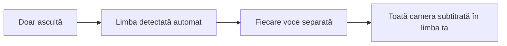
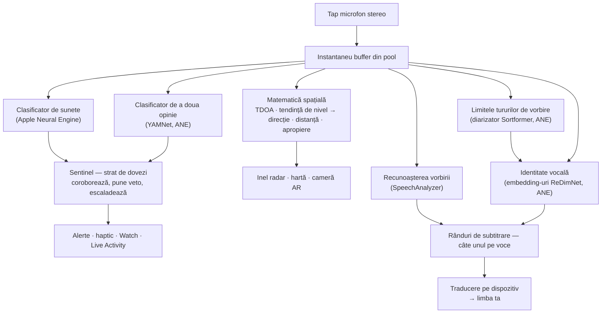
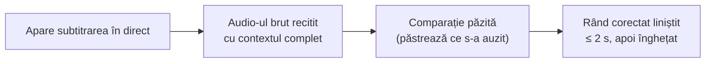
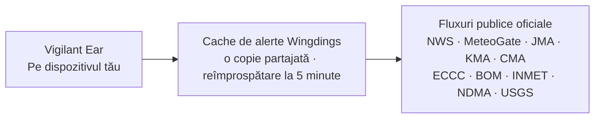

# Vigilant Ear 👂🛡️

*În vigoare de la versiunea 1.1.8 · septembrie 2026.*

## Un radar acustic pentru oamenii care nu aud.

O aplicație construită anume pentru comunitatea surzilor, hipoacuzicilor și CODA. Majoritatea aplicațiilor de recunoaștere a sunetelor îți spun *ce* e un sunet. **Vigilant Ear îți spune unde e, cine îl face și ce spune** — transformând un iPhone într-un tricorder sonic în timp real care descrie sunetul din jurul tău.

Direcția și distanța unei sirene. O bătaie în spatele tău. Oamenii dintr-o conversație, desenați ca voci transcrise separate — fiecare subtitrată și plasată direcțional. Dacă cineva vorbește o limbă pe care n-o citești, vorbele lui pot sosi **traduse în a ta.** Alertele ajung pe **ecranul de blocare, Dynamic Island și Apple Watch**, astfel încât o privire e de ajuns.

Tot ce contează rulează pe dispozitiv. Audio-ul nu e înregistrat și nu e încărcat pentru recunoaștere. Nimic nu depinde de a auzi ceva.

- 🧭 **Direcție, nu doar detecție.** *Ce, unde, cine* și *ce s-a spus* — nu doar „s-a întâmplat un sunet”.
- 📣 **Name Called.** Listează-ți numele, al unui copil, al partenerului — „comanda pentru Marie e gata” atinge ceasul și arată în ce parte.
- 🔒 **Privat din construcție.** Clasificarea, subtitrarea și traducerea rulează pe iPhone-ul tău. Subtitrările sunt în direct și efemere; nu sunt salvate ca arhivă de transcrieri.
- ⌚ **La încheietură și pe ecranul de blocare.** Companionul de direcție Apple Watch + Live Activity țin ultima alertă și din ce parte a venit la o privire distanță.
- 🛰️ **Mai multe telefoane, un auz partajat.** Constellation leagă iPhone-uri cu Ultra-Wideband ca să topească ce aude fiecare într-o imagine direcțională mai ascuțită.
- 👁️ **Făcut pentru surzi / hipoacuzici / CODA.** Haptic distinct, vizuale cu contrast mare, indicii independente de culoare, ținte de atingere mari și respect pentru Reduce Motion peste tot.

---

## Pentru cine e

- **Utilizatori surzi, hipoacuzici și CODA** care vor conștientizare situativă a sunetului — Home Watch (bătaie, alarmă, bebeluș, telefon) și Street Watch (sirenă, apropiere) pe care le poți lăsa pornite și în care te poți încrede.
- Oricine are nevoie de **subtitrări în direct cu direcție și separarea vorbitorilor**, sau de **traducere pe dispozitiv** a oamenilor așezați în apropiere.
- Utilizatori de accesibilitate și cercetare acustică interesați de localizarea sunetelor pe dispozitiv.

> Vigilant Ear este un **ajutor** de accesibilitate, nu un dispozitiv certificat de siguranță a vieții.

---

## Ce face

### 🧭 Vede sunetul — direcție și distanță
Folosind cele două microfoane ale iPhone-ului, Vigilant Ear măsoară **unghiul unui sunet și dacă e în fața ta sau în spatele tău**, ține acea citire stabilă până la circa un grad și o pune ca marcaj în direct pe un inel radar orientat după cap și pe hartă. Două microfoane pe o singură linie nu pot distinge stânga de dreapta singure — un sunet la 50° în dreapta ta și unul la 50° în stânga sosesc cu același mic decalaj de timp — așa că aplicația desenează citirea plus o **fantomă mai palidă pe cealaltă parte**, iar o rotire a încheieturii sau un al doilea telefon o tranșează. Distanța e estimată din tărie față de o curbă calibrată pe stradă și e arătată ca estimarea care e: *≈ 50 ft*, cu un interval probabil. Te muți, și marcajele își țin poziția din lumea reală. Ăsta e nucleul: conștientizarea spațială a unei lumi pe care n-o poți auzi. (Cifre mai jos.)

### 🚨 Recunoaște sunete importante — și te avertizează
Un clasificator pe dispozitiv identifică sute de sunete de zi cu zi și veghează categoriile critice — **sirene, alarme — inclusiv o clasă dedicată de alarmă auto —, sonerii/bătăi, plâns de bebeluș, o persoană în apropiere și vreme severă.** Când una se declanșează, primești o alertă clară pe ecran, o **notificare push** opțională și un **haptic** distinct — chiar și când aplicația e în fundal sau telefonul doarme. Categoriile critice sunt gata implicit, astfel încât activarea notificărilor nu înseamnă „totul oprit”. Oprește toate categoriile de alertă și motorul hibernează complet cât e în fundal, ca să economisească bateria. Un strat **Sentinel** verifică alertele față de dovezi independente — direcție, mișcare și fluxuri publice — astfel încât ce se declanșează e coroborat, nu ghicitul unui clasificator singur. Merge în ambele sensuri: un moment în formă de sirenă dintr-o melodie e ținut, dar o sirenă adevărată care se repetă prin muzica ta trece și alertează.

Avertizările de vreme severă vin din fluxuri publice oficiale — **NWS** SUA, **MeteoGate** Europa, **China CMA**, **Korea KMA**, **Japan JMA**, **Canada ECCC**, **Australia BOM**, **Brazil INMET** și **India NDMA** — gratuite pentru toți utilizatorii. Fluxurile sunt îngustate la cele care acoperă unde ești. În Japonia aplicația citește și **buletinele în avans** ale JMA — anunțurile în limbaj simplu emise cu zile înainte de un taifun sau de ploaie puternică, nu doar avertizările emise odată ce pericolul a sosit — plus buletinele de aversă bruscă și de alunecare de teren. Anunțurile în avans sunt arătate liniștit, fără sunetul și vibrația rezervate unei avertizări reale.

### ⌚ Apple Watch + Live Activity — o privire și știi
- **Companion Apple Watch** — direcția unei alerte arată pe încheietură, astfel încât o privire îți spune unde să te uiți. Interfață Watch redesenată cu iconița ureche a aplicației, layout Threat HUD și dublu-atingere ca să închizi o alertă. Alertele pot totuși arăta săgeata de direcție când aplicația Watch nu e deschisă.
- **Live Activity** — Vigilant Ear rămâne pe **ecranul de blocare**, în **Dynamic Island** și în **Watch Smart Stack**, astfel încât ultima alertă și direcția ei sunt întotdeauna la o privire distanță.
- **Alerte de partener pe încheietură** — când telefonul unui partener Constellation legat ridică o alertă, poate ajunge și pe Watch-ul tău, direcție inclusă. O trecere de fiabilitate ține companionul ușor pe bateria Watch toată ziua.

### 💬 Speaker Mode — subtitrări în direct, direcționale *(gratuit)*
Pornește **Speaker Mode** și Vigilant Ear transcrie oamenii care vorbesc lângă tine în **blocuri de subtitrare, câte unul pe voce.** Diarizarea vorbitorilor pe dispozitiv ține vocile distincte — *cine* spune *ce* — cu un indiciu direcțional pe inelul interior. Vorbitorul în direct e evidențiat; textul mai vechi se derulează pe măsură ce e nevoie de spațiu.

Două lucruri pe care majoritatea aplicațiilor de subtitrare nu le fac: **cinste despre încredere** — un semn subtil de calitate pe rând și sublinieri punctate sub cuvintele îndoielnice îți spun când să te încrezi într-un rând și când să verifici din nou — și **autocorectare**: imediat după ce o propoziție aterizează, aplicația recitește audio-ul cu contextul complet și poate recupera un cuvânt ratat sau auzit greșit în vreo două secunde, apoi textul îngheață.

**Name Called** (Preferințe, oprit până îl pornești tu) veghează acele subtitrări după numele pe care le listezi — al tău, al unui copil, al partenerului. Când cineva spune „comanda pentru Marie e gata”, primești un haptic distinct și o alertă pe Watch cu direcție, nu un alt balon de subtitrare. Vorbele tot apar în Speaker Mode ca vorbire; asta e atingerea că vorbeau *cu tine*.

**Limbajul dur poate fi mascat** (Preferințe → Subtitrări). Înjurăturile sosesc altfel ca text simplu, fără nimic care să le înmoaie, iar cititorul n-are nicio șansă să-și întoarcă privirea întâi; pornește asta și acele cuvinte sunt înlocuite cu simboluri, astfel încât propoziția tot se citește fără cuvânt. Recunoscătorul de vorbire al dispozitivului tău decide ce contează — nu o listă de cuvinte a noastră — deci urmează limba transcrisă. Pe un cont declarat ca sub 18 ani e întotdeauna pornit și arată un lacăt. Se aplică vorbirii pe care o transcrie *acest* dispozitiv; textul retransmis de pe un telefon asociat a fost transcris acolo și sosește ca text gata.

**Cuvântul pe care un vorbitor l-a apăsat e marcat cu aldine.** Spuse cu voce tare, „n-am spus ASTA” și „n-am spus asta” sunt două propoziții diferite, iar o transcriere identică pierde diferența cu totul. Aplicația veghează după unicul cuvânt pe care vocea vorbitorului l-a ridicat în înălțime și îl pune aldine — cel mult unul pe rând, și nimic deloc când nu e sigură, pentru că marcarea cuvântului greșit pune vorbe în gura cuiva. Oprit în chineză și japoneză, unde înălțimea îți spune *care cuvânt e*, nu cât de tare a fost împins.

Subtitrările sunt gratuite; traducerea automată e stratul opțional Power Pack+. Subtitrările pot fi și **spuse cu voce tare către dispozitivele tale auditive Bluetooth** — gratuit, în Preferințe. **Direction Tones** (tot gratuit, în Preferințe → Subtitrări) adaugă un indiciu audio opțional în urechea pe care o alegi, care semnalează unde e un vorbitor — util cu un aparat auditiv sau cu auz unilateral, și disponibil oricui.

### 🌐 Auto-Translate — limba ta, în direct *(Power Pack+)*
Cu Speaker Mode pornit, când o persoană din apropiere vorbește altă limbă, Vigilant Ear o poate detecta și arăta subtitrările **în limba ta**, cu limba sursă arătată pe blocul lor. Lanțul — auzi → separă vorbitorii → transcrie → traduce → afișează — rulează **pe dispozitiv**; singurul moment de rețea e descărcarea unică a pachetului de limbă de la Apple. Nu trebuie să cunoști sau să alegi mai întâi cealaltă limbă.

Asta e cel mai apropiat lucru de **traducătorul universal din science-fiction** care se livrează acum — dispozitivul care pur și simplu înțelege. Vigilant Ear detectează limba de unul singur, urmărește fiecare vorbitor din cameră și îi subtitrează pe toți în limba ta — fără căști, fără configurare, pe dispozitivul tău.

### 🎵 Conștientizare muzică și emisiuni *(Power Pack+)*
**ShazamKit** identifică muzica care cântă în jurul tău și urmărește schimbările de melodie.

### 🎛️ Acoustic Scope — vezi sunetul ca un inginer
O vedere profesională în direct a sunetului din jurul tău: spectru, spectrogramă, benzi RTA de ⅓ octavă, chroma și parțiale armonice — **gratuit pentru toată lumea**. Uneltele care capturează sunete pentru antrenarea pachetelor tale personalizate fac parte din Power Pack+.

### 📦 Pachete de sunete personalizate — învață-l lumea ta *(Power Pack+)*
Învață Vigilant Ear sunetele care contează pentru tine — de la păsările locale până la soneria clădirii tale. Pachetele suplimentare se stivuiesc peste detecția încorporată, astfel încât sunetele noi nu înghesuie niciodată sirenele și alarmele. Un ghid pas cu pas e construit în aplicație.

### 🛰️ Constellation — multe iPhone-uri, un auz partajat *(Power Pack+)*
Cu două sau mai multe iPhone-uri cu Ultra-Wideband (majoritatea de la iPhone 11 încoace), **Constellation** le asociază astfel încât să simtă poziția unul altuia și să topească ce aude fiecare într-o singură imagine, mai precisă, a de unde vine un sunet — un array de ascultare pasiv, distribuit. Subtitrările sunt topite și ele: fiecare telefon transcrie ce aude propriul microfon, iar vorbele sunt aliniate între telefoane astfel încât cel mai aproape de un vorbitor contribuie ce a auzit — vorbele prinse de un singur telefon sunt păstrate, nu pierdute. Telefoanele se conectează **direct unul la altul** — fără router, fără rețea Wi-Fi partajată și fără internet; Wi-Fi trebuie pur și simplu să fie pornit, pe același link peer-to-peer pe care îl folosește AirDrop. Limitat la dispozitivele cu hardware-ul potrivit. Subtitrările mesh mai vechi decât momentul de conectare al unui peer nu sunt retransmise.

**Mesaje de partener** — trimite un text scurt pe telefonul unui partener legat; aterizează în fluxul lui de subtitrări și poate sosi tradus în limba lui, pe dispozitiv. Mesageria ține seama de vârstă: construită pe Declared Age Range de la Apple, mesajele între un adult și un minor rămân oprite dacă amândoi nu s-au numit deliberat unul pe altul. Alertele și subtitrările nu sunt niciodată blocate — doar mesajele de la persoană la persoană.

### 🔗 Remote Link — ajungi la cineva care nu e cu tine *(Power Pack+ ca să pornești)*
Ce-ar face de obicei un apel telefonic, făcut cu video și text. Trimiți un cod de invitație; cealaltă persoană se alătură din interiorul Vigilant Ear **fără să dețină Power Pack+**. Spre deosebire de Constellation, nu e nevoie de proximitate — puteți fi oriunde.

**Niciun audio nu e folosit în niciun moment.** Doar video și text, astfel încât nimic din link nu depinde de auz la niciun capăt — și îți dă un mod să semnezi cu cineva prin aplicație. Aplicația însăși nu înțelege limba semnelor; poartă video-ul, iar voi doi faceți restul. Conexiunea e directă între cele două telefoane oriunde rețeaua permite, iar aplicația îți arată limpede dacă e **Direct** sau **Relayed**, astfel încât știi întotdeauna dacă video-ul trece printr-un releu.

### 📷 Cameră AR — „vezi sunetul”
Deschide pastila camerei de pe bara de titlu și prinde sunetele detectate la direcția lor reală în vederea live a camerei. Marcajele se grupează după vorbitor sau după categorie de sunet și direcție, astfel încât vederea rămâne citibilă; sursele se estompează când tac.

### 🗺️ Hărți, drumuri și predicția traseului
Direcțiile sunetelor se proiectează pe coordonate GPS reale pe hartă. Sunetele de vehicule pot fi **prinse de străzile din apropiere** și traseele lor prezise, astfel încât un camion care trece se citește ca deplasându-se *de-a lungul drumului*, nu prin clădiri. (Încearcă demonstrația cu mașina de pompieri.)

### 🪄 Feature Playground — dovedește-l fără urechi
**Feature Playground** e public pentru toată lumea: exerciții Home & Street (bătaie, alarmă, bebeluș, sirenă, meteo), demonstrații multi-telefon și de conversație, și o filigrană clară astfel încât exercițiul nu pretinde niciodată că e un eveniment în direct. Închiderea panoului desface demonstrațiile curat (fără GPS fals blocat, fără flaguri rămase).

### ♿ Accesibilitate mai întâi
Construit pentru utilizatori surzi / hipoacuzici / CODA și daltoniști: indicii **independente de culoare**, ținte de atingere **≥44 pt**, respect pentru **Reduce Motion**, alerte multimodale (haptic + vizual + Watch) și un ecran de verificare la pornire care arată starea permisiunilor cu stări clare verde / gri / roșu (și „nepermis” portocaliu-ars) — inclusiv acordul de notificare care acționează ca comutatorul principal de alertă.

---

## Gratuit și Power Pack+

Nucleul de siguranță e **gratuit, pentru totdeauna**:

- **Home Watch și Street Watch** — alerte sonore locale (alarme, sirene, bătăi/sonerii, bebeluș, persoană în apropiere) cu livrare pe ecran, haptic și push opțional.
- **Subtitrări în direct** — Speaker Mode, pe dispozitiv, direcțional acolo unde hardware-ul permite, cu semne cinstite de încredere, autocorectare în ~2 secunde, ieșire vorbită opțională către dispozitive auditive Bluetooth și Direction Tones.
- **Name Called** — nume opționale pe care le tastezi (al tău, copii, partener). O potrivire e o alertă pe Watch/telefon cu direcție, nu o a doua subtitrare.
- **Standing Watch** — starea camerei însăși, mereu pornită, fără nimic de configurat: o lampă ciană constantă cât camera își ține tiparul, ambră când ceva se schimbă — o voce nouă, liniște bruscă sau ceva care se apropie.
- **Alerte de vreme severă** — NWS, MeteoGate (Europa — servit proaspăt din cache-ul nostru de alerte de 5 minute), CMA, KMA, JMA (Japonia), ECCC (Canada), BOM (Australia), INMET (Brazilia) și NDMA (India) pentru regiunea ta.
- **Alerte de cutremur (USGS, în toată lumea)** — simți o vibrație și vezi pe hartă zona care a simțit-o când e raportat un cutremur în apropiere. O confirmare din fluxul oficial USGS — nu un avertisment timpuriu: dacă ai simțit zguduirea, asta îți spune ce a fost. Senzorul pe dispozitiv de vuiet profund (infrasunet) poate arma verificarea în clipa în care se mișcă pământul.
- **Feature Playground** — alerte de exercițiu și anteprime de funcții cu o filigrană PREVIEW clară.
- **Companion Apple Watch și Live Activity** — direcție și ultima alertă la o privire.
- **Acoustic Scope** — vizualizare profesională a sunetului în direct, gratuită pentru toată lumea. (Uneltele de captură pentru antrenare sunt Power Pack+.)

**Power Pack+** este o deblocare unică (**nu un abonament**) cu o **perioadă de probă gratuită de 90 de zile**. Adaugă superputerile:

- **Auto-Translate** — traducere pe dispozitiv a vorbirii din apropiere în limba ta.
- **Constellation** — auz partajat pe mai multe iPhone-uri prin Ultra-Wideband, cu mesaje de partener.
- **Music ID** — recunoaștere de melodii cu ShazamKit.
- **Pachete de sunete personalizate** — clasificatori suplimentari pe care îi antrenezi pentru propriile sunete.

Gratuit sau Power Pack+, **audio-ul tău rămâne pe dispozitiv pentru recunoaștere** — nivelul schimbă doar care funcții sunt deblocate, niciodată unde e trimis audio-ul brut pentru analiză.

---

## Cum funcționează (sub capotă)

Vigilant Ear e o conductă **local-first, pe dispozitiv**, construită pe straturi: capturează o dată, apoi lasă specialiști independenți să citească același sunet și să-și verifice munca unii altora. Audio-ul brut e capturat pe un tap de prioritate înaltă, copiat într-o **listă liberă de buffere din pool** (fără rafale de alocare pe calea în timp real) și distribuit fără să blocheze interfața:

Niciun model nu e crezut singur. Stratul **Sentinel** stă între detecție și alertare: motoare independente se coroborează sau își pun veto cadru cu cadru — și când dovezile din lumea reală se adună împotriva unui veto (o sirenă adevărată care urlă prin muzica ta), dovezile câștigă și alerta se declanșează.

Subtitrările își primesc propria a doua șansă. Fiecare propoziție finalizată e recitită liniștit dintr-un inel scurt de audio din memorie, cu contextul complet — corecturile aterizează în vreo două secunde, apoi textul îngheață de tot:

- **Matematică spațială** — FFT-uri, Time Difference of Arrival ponderat pe coerență (TDOA — favorizează benzile de frecvență pe care ambele microfoane sunt de acord, apoi transformă micul decalaj de sosire într-o direcție) și urmărirea apropierii după tendința de nivel, pe sarcini de fundal. Perechea de microfoane e citită într-o orientare fixă, astfel încât direcția merge la fel fie că ții telefonul drept, fie pe o parte.
- **Vorbire** — `SpeechAnalyzer` / `SpeechTranscriber` iOS 26 pentru transcriere; cadrul **Translation** de la Apple pentru traducere pe dispozitiv. Identitatea vocală e bazată pe dovezi: o voce e confirmată ca persoană reală doar din ferestre independente de sunet, iar o potrivire nesigură apare neatribuită în loc să ghicească numele greșit.
- **Două modele pentru două întrebări** — a distinge vocile cere *când s-a schimbat vorbitorul* și *cine e vorbitorul*, și nu sunt aceeași problemă. Un diarizator de flux **Sortformer** marchează limitele de tură; embedding-urile **ReDimNet** decid a cui voce stă în fiecare. Tăierea pe limită contează mai mult decât sună: o fereastră care calcă pe doi oameni îi conține pe amândoi, și niciun model de embedding nu poate repara asta după. Sub amândouă stă un prag de activitate vocală — dacă diarizatorul tace într-o cameră grea în loc să ghicească, turele tot se taie, astfel încât aplicația se degradează în loc să topească doi vorbitori într-unul.
- **Adevărul muzicii** — un **detector de semnătură de melodie** chroma deține decizia „cântă chiar muzică?”, pentru că clasificatorii generali numesc celebru camerele tăcute și sirenele „muzică”. Shazam rulează doar odată ce semnătura e de acord că e ceva muzical acolo.
- **Concurență** — izolarea Swift 6 ține tap-ul de microfon, matematica acustică și bucla de randare a interfeței curat separate.
- **Eficiență** — downsampling, clasificare adaptivă la sarcină și folosirea rețelei doar când e dovadă țin ascultarea mereu pornită destul de ușoară ca s-o lași deschisă.

Alertele meteo și de cutremur iau calea opusă față de audio — nimic din sunetul tău nu iese, dar *datele* de alertă intră. **Fiecare** flux oficial trece printr-un cache mic pe care îl operăm, astfel încât o preluare a datelor publice servește fiecărui utilizator — și telefonul tău nu contactează niciodată serverele unui guvern străin:

---

## Ce poate auzi telefonul tău — măsurat

iPhone-ul tău are două microfoane la circa șase inci distanță, un barometru și un ceas foarte bun. Asta e destul ca să-ți spună în ce parte e un sunet, aproximativ cât de departe, dacă vine spre tine și dacă tocmai s-a deschis o ușă. Iată cât de precis e fiecare, cum am verificat și de ce contează dacă nu poți auzi sunetul tu însuți. Direcția și cifrele înrudite au fost măsurate pe un iPhone 17 și un iPhone 16 Pro Max în septembrie 2026. Distanța rămâne o estimare prin natură — o spunem pe ecran.

**Direcție — până la câteva grade.** Un sunet ajunge la microfonul de sus înaintea celui de jos, sau după, și din acel decalaj aplicația calculează cât de departe de axa telefonului e sunetul și dacă e în față sau în spate. Cele două canale ale telefonului nu sunt microfoane simple, ci o imagine stereo prelucrată, iar acea imagine adaugă un tipar fix al ei ori de câte ori o cameră e zgomotoasă. Aplicația învață acum acel tipar din câteva secunde liniștite după lansare și îl scoate înainte să citească direcția.

| Ce am măsurat | Rezultat |
|---|---|
| Eroare mediană pe 96 de camere simulate, de la birou liniștit la cameră cu pereți duri la 5 dB SNR | 1,0° |
| iPhone 17 pe un birou, zgomot de cameră pornit, difuzor la 30° de axă | a citit 61,7° din planul lateral față de 60° așteptați, oscilație 1,6° |
| La fel, difuzor drept pe o parte a telefonului | a citit 4,5° față de 0° așteptați, oscilație 2,2° |
| La fel, difuzor drept în față | fiecare citire la întârzierea maximă, cum trebuie |
| Citiri care aterizează pe tiparul imaginii în loc de sunet | niciuna, la niciun unghi |

*De ce contează:* dacă nu poți auzi o sirenă, „în spatele tău, puțin într-o parte” îți spune unde să te uiți. O citire care stă nemișcată merită încredere abia după ce a fost verificată față de un metru, și aceasta a fost, de două ori, a doua oară după ce prima verificare s-a dovedit prea blândă.

**Distanță — arătată ca estimarea care e.** Un microfon nu poate măsura distanța, doar tăria, iar un camion tare departe poate suna ca o mașină liniștită de aproape. Aplicația estimează distanța din tărie folosind o curbă potrivită pe o stradă reală, apoi o spune cum ar spune-o un om atent: *circa 50 ft, probabil între 25 și 100.*

| Ce am măsurat | Rezultat |
|---|---|
| Detecții reale de mașini reluate prin calibrare | 1.131 |
| Aterizate pe cei 100 de picioare de drum pe care erau de fapt | 73% |
| Mașini pe banda îndepărtată | estimate 78 și 87 ft unde metrul spunea 73 și 85 ft |

Drumul (o intersecție de oraș) a fost măsurat bandă cu bandă; când curba greșește, greșește spre aproape. Calibrarea e blocată de un test automat, astfel încât nu poate deriva în tăcere. Alarmele din propriul spațiu, ca un detector de fum, nu primesc nicio cifră de distanță — sunt deja în cameră cu tine.

**Mișcare — vine spre tine.** Pentru mașini și sirene, a se face mai tare înseamnă de obicei a se apropia. Aplicația veghează cât de repede urcă nivelul unui sunet în câteva secunde: o urcare susținută de circa 1,5 dB pe secundă (o creștere clară, constantă a tăriei) înseamnă apropiere, o cădere potrivită înseamnă plecare, iar un sunet care nu se mai schimbă nu mai e numit nici una, nici alta după circa patru secunde. Un singur moment tare — o atingere de claxon, o trântire de ușă — nu o poate declanșa. Construit pe fizică și nouă teste automate; o trecere înregistrată pe stradă e următoarea confirmare pe teren.

**Aerul din cameră — o ușă are o semnătură.** Barometrul poate observa o ușă care se deschide la circa paisprezece picioare: presiunea scade pe măsură ce ușa se leagănă, apoi revine când se închide. Pe paisprezece ore de liniște și cincisprezece evenimente de ușă, fiecare ușă a făcut acea formă în două părți și nimic altceva din casă n-a făcut-o.

| Eveniment | Rată de presiune | Formă |
|---|---|---|
| Ușa din față, deschisă și închisă, ×10 | 0,6–1,8 Pa/s | scădere, apoi revenire, ~5 s distanță |
| Ușa din față, trântită, ×5 | 1,1–2,5 Pa/s | aceeași pereche, mai înaltă |
| Aerul condiționat care ciclizează noaptea, ×8 | 0,11–0,46 Pa/s | rampă lentă pe minute, identică pe ambele telefoane |
| O cameră liniștită | ~0,02 Pa/s | nimic |
| Trecere pe lângă, strănut | — | senzorul de mișcare observă și telefonul ignoră |

O ușă de plasă, care nu etanșează camera, a fost invizibilă — exact cum trebuie. Azi o schimbare de presiune poate apărea ca vuiete profunde pe hartă; o alertă dedicată de ușă în noapte liniștită e măsurată și proiectată, și nu e încă implicitul de fiecare zi.

**Constellation — două telefoane tranșează partea.** Fiecare telefon de pe mesh trasează o linie spre sunet de unde stă, iar liniile se intersectează curat doar pe o parte. Când o fac, fantoma dispare și aplicația poate spune din nou stânga sau dreapta. În simulare, două telefoane la **40 de metri distanță** plasează o sirenă la 50 de metri până la circa 2 metri.

**Cum e crezut orice de aici.** Fiecare cifră a trecut prin aceleași trei porți, în ordine: o cameră simulată cu răspunsul cunoscut dinainte; teste automate mici care recreează cazul exact care ar păcăli aplicația și rulează la fiecare schimbare; apoi telefoanele reale pe un birou real, cu distanțe măsurate de mână. Nimic nu contează ca precis până supraviețuiește celei de-a treia. Pentru cine nu poate auzi sunetul, vorba aplicației e singura vorbă — trebuie câștigată cum o câștigă un laborator.

Note mai adânci pentru ingineri: [Physics](https://vigilantear.com/en/physics/) — TDOA, distanță, mișcare, Constellation și detecție barometrică, cu fiecare cifră etichetată MEASURED / BENCHED / MODELLED.

---

## Confidențialitate

- **Pe dispozitiv, întotdeauna, pentru conducta de bază.** Clasificarea, matematica spațială, transcrierea, diarizarea și traducerea rulează pe iPhone-ul tău. Audio-ul brut nu e înregistrat și nu e încărcat pentru recunoaștere.
- **Subtitrările sunt efemere.** Subtitrările în direct rămân în memorie pe durata sesiunii; jurnalele de depanare exportate nu includ textul subtitrărilor.
- **Fără SDK-uri de publicitate sau de analiză comportamentală.** Folosirea limitată a rețelei e doar pentru hărți, fluxuri meteo publice, amprente Shazam opționale, context stradal și cumpărături din App Store — vezi politica completă.

Detalii complete: [PRIVACY.md](PRIVACY.md) · [TERMS.md](TERMS.md) · [SUPPORT.md](SUPPORT.md)

---

## Hardware și platforme

- **iPhone (experiență completă).** Merge în portret sau peisaj — ține-l cum vrei. Microfoane stereo necesare pentru găsirea direcției. Recomandat **iPhone 13 sau mai nou**.
- **Apple Watch.** Alerte companion cu săgeată de direcție; merge cu Live Activity / Smart Stack.
- **iPad (nativ).** Layout adaptiv: pe ecranul mare, subtitrările în direct primesc un panou transparent lângă hartă, care se strânge când nu vorbește nimeni. Microfoane pe un canal → subtitrări fără direcție completă.
- **Constellation** are nevoie de **Ultra-Wideband** — iPhone 11 sau ulterior, exclus modelele SE și „e”. **Nu** are nevoie de o rețea Wi-Fi: cu Wi-Fi pornit, telefoanele se descoperă direct, astfel încât Constellation merge fără router și fără internet cât timp telefoanele sunt aproape unul de altul.
- **Android.** Build separat cu radarul de bază, alerte, subtitrări și meteo; mesh-ul Constellation e întâi pe iOS. Vezi actualizările de pe site-ul produsului pe măsură ce crește paritatea Android.

---

## Localizare

Complet localizată — interfață, alerte și subtitrări — în **engleză, spaniolă, portugheză (Brazilia), franceză, germană, italiană, turcă, arabă, japoneză, chineză simplificată, coreeană, rusă, hindi și română** (14 limbi). Urmează limba sistemului sau o alegere manuală în aplicație. Subtitrările în română funcționează pe dispozitiv; Apple Translate nu are română, așa că Auto-Translate arată textul original pentru această limbă.

---

## Stare și avertisment

Vigilant Ear este un **ajutor experimental de accesibilitate acustică**, nu o utilitate certificată de siguranță a vieții. Rezoluția localizării variază cu împrejurimile, vremea, vântul și hardware-ul microfonului. **Păstrează-ți întotdeauna conștientizarea obișnuită a mediului** — nu te baza pe ea ca unica sursă de informații de siguranță.

Unele capabilități (marcaje AR de cameră, actualizarea entitlement-ului Critical Alerts când e acordat de Apple, autoratul avansat de sunete pe mai multe pachete) continuă să evolueze; veghea gratuită Home / Street și subtitrările în direct sunt produsul în care te poți încrede din prima zi.

---

**Contact:** [vigilantear@wingdingssocial.com](mailto:vigilantear@wingdingssocial.com)

Făcut cu ❤️ pentru comunitatea D/HH și cercetarea acustică.

    
  <strong>© 2026 Wingdings, Inc.</strong> 
  Toate drepturile rezervate. 
  Brevet în curs de înregistrare

