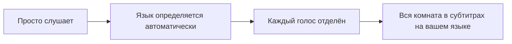
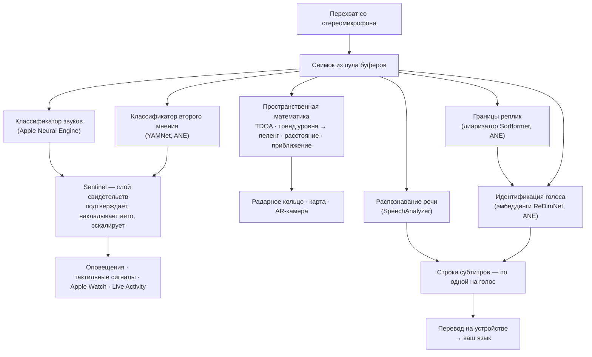
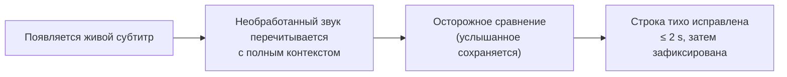
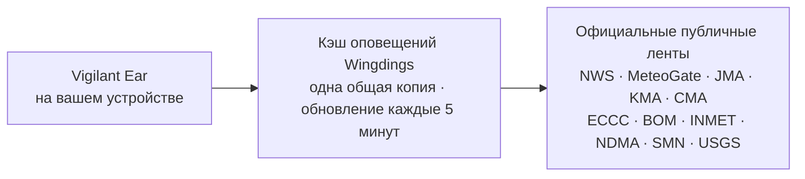

# Vigilant Ear 👂🛡️

*Действует начиная с версии 1.1.9 · сентябрь 2026 г.*

## Акустический радар для тех, кто не слышит.

Приложение, созданное специально для сообщества глухих, слабослышащих и CODA. Большинство приложений для распознавания звуков сообщают вам, *что* это за звук. **Vigilant Ear сообщает, где он, кто его издаёт и что говорят** — и превращает iPhone в звуковой трикордер реального времени, который описывает звуки вокруг вас.

Направление и расстояние до сирены. Стук у вас за спиной. Участники разговора, показанные как отдельные расшифрованные голоса, — каждый со своими субтитрами и на своём направлении. Если кто-то говорит на языке, который вы не читаете, его слова могут приходить **переведёнными на ваш.** Оповещения появляются на **экране блокировки, в Dynamic Island и на Apple Watch**, так что достаточно одного взгляда.

Всё, что имеет значение, работает на самом устройстве. Звук не записывается и не загружается на сервер для распознавания. Ничто не требует, чтобы вы что-то слышали.

- 🧭 **Направление, а не только обнаружение.** *Что, где, кто* и *что было сказано* — а не просто «прозвучал какой-то звук».
- 📣 **«Имя названо».** Внесите в список своё имя, имя ребёнка, партнёра — и фраза «заказ для Мари готов» даст тактильный сигнал на часах и укажет, откуда она прозвучала.
- 🔒 **Приватность заложена в основу.** Классификация, субтитры и перевод выполняются на вашем iPhone. Субтитры живые и эфемерные: они не сохраняются в архив расшифровок.
- ⌚ **На запястье и на экране блокировки.** Компаньон для Apple Watch с указанием направления + Live Activity держат последнее оповещение и направление, откуда оно пришло, на расстоянии одного взгляда.
- 🛰️ **Больше телефонов — одно общее ухо.** Constellation связывает iPhone с Ultra-Wideband и объединяет то, что слышит каждый из них, в более чёткую картину направлений.
- 👁️ **Создано для глухих / слабослышащих / CODA.** Различимые тактильные сигналы, высококонтрастное оформление, подсказки, не зависящие от цвета, крупные области нажатия и соблюдение настройки «Уменьшение движения» во всём приложении.

---

## Для кого это

- **Глухие, слабослышащие пользователи и CODA**, которым нужна ситуационная осведомлённость о звуках, — Home Watch (стук, сигнализация, ребёнок, телефон) и Street Watch (сирена, приближение), которые можно оставить включёнными и которым можно доверять.
- Все, кому нужны **живые субтитры с направлением и разделением говорящих** или **перевод на устройстве** речи людей, сидящих рядом.
- Пользователи из сферы доступности и акустических исследований, которых интересует локализация звука на устройстве.

> Vigilant Ear — это **вспомогательное средство** доступности, а не сертифицированное устройство для защиты жизни.

---

## Что оно умеет

### 🧭 Оно видит звук — направление и расстояние
С помощью двух микрофонов iPhone Vigilant Ear измеряет **угол, под которым приходит звук, и то, впереди он или позади вас**, удерживает это показание стабильным с точностью около градуса и ставит его живым маркером на радарное кольцо с ориентацией по курсу и на карту. Два микрофона на одной линии сами по себе не могут отличить левое от правого — звук в 50° справа от вас и звук в 50° слева приходят с одной и той же крошечной разницей во времени, — поэтому приложение рисует показание и **более бледный «призрак» с другой стороны**, а поворот запястья или второй телефон снимает вопрос. Расстояние оценивается по громкости с помощью кривой, откалиброванной на улице, и показывается именно как оценка: *≈ 50 ft*, с вероятным диапазоном — в единицах страны, где вы находитесь, а не языка, на котором вы читаете приложение. Когда вы двигаетесь, маркеры остаются на своих реальных местах. В этом суть: пространственная осведомлённость о мире, который вы не слышите. (Цифры — ниже.)

### 🚨 Оно распознаёт важные звуки — и предупреждает вас
Классификатор на устройстве распознаёт сотни повседневных звуков и следит за критическими категориями — **сирены, сигнализации — включая отдельный класс автомобильной сигнализации — дверные звонки/стук, плач ребёнка, человек рядом и опасная погода.** Когда одна из них срабатывает, вы получаете понятное оповещение на экране, необязательное **push-уведомление** и характерный **тактильный сигнал** — даже когда приложение работает в фоне или телефон спит. Критические категории по умолчанию готовы к работе, так что включение уведомлений не означает «всё выключено». Выключите все категории оповещений — и в фоне движок полностью засыпает, экономя батарею. Слой **Sentinel** сверяет оповещения с независимыми свидетельствами — направлением, движением и публичными лентами, — так что срабатывает подтверждённое, а не одиночная догадка классификатора. Это работает в обе стороны: похожий на сирену момент внутри песни придерживается, но настоящая сирена, повторяющаяся сквозь вашу музыку, прорывается и вызывает оповещение.

Предупреждения об опасной погоде поступают из официальных публичных лент — **NWS** в США, **MeteoGate** в Европе, **CMA** в Китае, **KMA** в Корее, **JMA** в Японии, **ECCC** в Канаде, **BOM** в Австралии, **INMET** в Бразилии, **NDMA** в Индии и **SMN** в Мексике — бесплатно для всех пользователей. В Мексике предупреждения публикует национальная метеослужба Servicio Meteorológico Nacional по лицензии CC BY 4.0. Набор лент сужается до тех, что охватывают ваше местоположение. В Японии приложение также читает **предварительные бюллетени** JMA — уведомления простым языком, которые выпускаются за несколько дней до тайфуна или сильного дождя, а не только предупреждения, выпускаемые, когда опасность уже наступила, — а также бюллетени о внезапных ливнях и оползнях. Предварительные уведомления показываются тихо, без звука и вибрации, которые приберегаются для настоящего предупреждения.

### ⌚ Apple Watch + Live Activity — один взгляд, и всё ясно
- **Компаньон для Apple Watch** — направление оповещения показывается прямо на запястье, так что одного взгляда достаточно, чтобы понять, куда смотреть. Обновлённый интерфейс Apple Watch с иконкой-ухом приложения, экраном угрозы в стиле HUD и двойным касанием для закрытия оповещения. Оповещения всё равно могут показывать стрелку направления, когда приложение на часах не открыто.
- **Live Activity** — Vigilant Ear остаётся на **экране блокировки**, в **Dynamic Island** и в **Smart Stack на Apple Watch**, так что последнее оповещение и его пеленг всегда на расстоянии одного взгляда.
- **Оповещения партнёров на запястье** — когда телефон связанного с вами партнёра по Constellation поднимает оповещение, оно может дойти и до ваших часов, вместе с направлением. Благодаря доработке надёжности компаньон весь день бережно расходует батарею часов.

### 💬 Speaker Mode — живые субтитры с направлением *(бесплатно)*
Включите **Speaker Mode**, и Vigilant Ear будет расшифровывать речь людей рядом с вами в **блоки субтитров — по одному на каждый голос.** Диаризация говорящих на устройстве разделяет голоса — *кто* говорит *что* — и показывает подсказку о направлении на внутреннем кольце. Текущий говорящий подсвечивается; старый текст уходит с экрана, когда нужно место.

Две вещи, которых не делает большинство приложений для субтитров: **честность в оценке уверенности** — ненавязчивая отметка качества в каждой строке и пунктирное подчёркивание под сомнительными словами показывают, когда строке можно доверять, а когда стоит перепроверить, — и **самокоррекция**: сразу после того, как предложение появилось на экране, приложение перечитывает звук с полным контекстом и может в течение пары секунд восстановить пропущенное или неверно расслышанное слово, после чего текст фиксируется.

Функция **«Имя названо»** («Настройки»; выключена, пока вы её не включите) отслеживает в этих субтитрах имена из вашего списка — ваше, ребёнка, партнёра. Когда кто-то говорит «заказ для Мари готов», вы получаете отдельный тактильный сигнал и оповещение на часах с направлением, а не ещё один пузырь субтитров. Сами слова по-прежнему появляются в Speaker Mode как речь; а этот сигнал означает, что обращались *к вам*.

**Нецензурную лексику можно скрывать** (Настройки → Подписи). Иначе ругательства приходят обычным текстом, который ничем не смягчён, и у читающего нет возможности заранее отвести взгляд; включите эту функцию — и такие слова заменятся символами, так что фраза по-прежнему читается, только без этого слова. Что считать нецензурным, решает собственный распознаватель речи вашего устройства — а не наш список слов, — поэтому он следует языку, на котором идёт расшифровка. Для учётной записи с заявленным возрастом младше 18 лет функция всегда включена и отмечена значком замка. Она применяется к речи, которую расшифровывает *это* устройство; текст, переданный с сопряжённого телефона, был расшифрован там и приходит уже готовым.

**Слово, на которое говорящий сделал упор, выделяется жирным.** Вслух «Я ЭТОГО не говорил» и «Я этого не говорил» — два разных предложения, а одинаковая расшифровка полностью теряет эту разницу. Приложение ищет то единственное слово, на котором голос говорящего поднялся по высоте тона, и выделяет его жирным — не больше одного в строке и вообще ничего, если оно не уверено, потому что выделить не то слово — значит приписать человеку то, чего он не говорил. В китайском и японском это отключено: там высота тона показывает, *какое это слово*, а не насколько сильно на него нажали.

Субтитры бесплатны; автоматический перевод — необязательный слой Power Pack+. Субтитры также можно **озвучивать через ваши Bluetooth-слуховые устройства** — бесплатно, в «Настройках». **Тоны направления** (тоже бесплатно, в разделе Настройки → Подписи) добавляют необязательный звуковой сигнал в выбранном вами ухе, который подсказывает, где находится говорящий, — это полезно при слуховом аппарате или одностороннем слухе и доступно всем.

### 🌐 Автоперевод — ваш язык в реальном времени *(Power Pack+)*
Когда включён Speaker Mode и человек рядом говорит на другом языке, Vigilant Ear может распознать этот язык и показать его субтитры **на вашем языке**, указав на его блоке исходный язык. Вся цепочка — услышать → разделить говорящих → расшифровать → перевести → показать — работает **на устройстве**; единственное обращение к сети — однократная загрузка языкового пакета от Apple, и если вы ждёте именно этой загрузки, приложение прямо об этом сообщает, а не оставляет вас смотреть на непереведённый текст. Вам не нужно заранее знать или выбирать чужой язык.

Из всего, что уже выпущено, это ближе всего к **универсальному переводчику из научной фантастики** — устройству, которое просто понимает. Vigilant Ear сам определяет язык, следит за каждым говорящим в комнате и показывает субтитры для всех на вашем языке — без наушников, без настройки, на вашем устройстве.

### 🎵 Осведомлённость о музыке и эфире *(Power Pack+)*
**ShazamKit** определяет музыку, играющую вокруг вас, и отслеживает смену песен.

### 🎛️ Acoustic Scope — видеть звук как инженер
Профессиональное живое отображение звуков вокруг вас: спектр, спектрограмма, полосы RTA в ⅓ октавы, хрома и гармонические частичные тоны — **бесплатно для всех**. **Вкладка «Частичные» читает музыку:** каждый тон подписан своей нотой, а рядом показан его гармонический ряд, более высокие звуки — например, дымовые извещатели — называются по их истинной высоте, а ещё можно задать целевую ноту, которая рисуется линией, чтобы петь или настраивать инструмент по ней. Работает без нагрева — держать вкладку «Спектрограмма» открытой почти ничего не стоит, сколько бы вы ни смотрели. Инструменты записи звуков для обучения ваших собственных пакетов входят в Power Pack+.

### 📦 Пользовательские звуковые пакеты — научите его своему миру *(Power Pack+)*
Научите Vigilant Ear звукам, которые важны вам, — от местных птиц до дверного звонка в вашем доме. Дополнительные пакеты накладываются поверх встроенного обнаружения, поэтому новые звуки никогда не вытесняют сирены и сигнализации. Пошаговое руководство встроено в приложение.

### 🛰️ Constellation — много iPhone, одно общее ухо *(Power Pack+)*
Если у вас два или больше iPhone с Ultra-Wideband (большинство моделей начиная с iPhone 11), **Constellation** связывает их, чтобы они чувствовали положение друг друга и сводили услышанное каждым в единую, более точную картину того, откуда идёт звук, — распределённую пассивную слушающую решётку. Субтитры тоже объединяются: каждый телефон расшифровывает то, что слышит его собственный микрофон, а слова выравниваются между телефонами так, чтобы ближайший к говорящему телефон вносил то, что услышал он, — слова, которые уловил только один телефон, сохраняются, а не теряются. Телефоны соединяются **напрямую друг с другом** по тому же одноранговому каналу, который использует AirDrop, — без роутера, без общей сети Wi-Fi и без интернета; нужно лишь, чтобы Wi-Fi был включён. Доступно только на устройствах с подходящим оборудованием. Субтитры сети, появившиеся раньше момента подключения участника, повторно не передаются.

**Сообщения партнёрам** — отправьте короткий текст на телефон связанного партнёра; он попадёт в его ленту субтитров и может прийти переведённым на его язык, прямо на устройстве. Обмен сообщениями учитывает возраст: на основе Declared Age Range от Apple переписка между взрослым и несовершеннолетним остаётся выключенной, пока оба человека сознательно не присвоят друг другу имена. Оповещения и субтитры никогда не ограничиваются — только личная переписка.

### 🔗 Remote Link — связь с тем, кого нет рядом *(для запуска нужен Power Pack+)*
То, что обычно делает телефонный звонок, — но с помощью видео и текста. Вы отправляете код приглашения; другой человек присоединяется прямо из Vigilant Ear, **не имея Power Pack+**. В отличие от Constellation, находиться рядом не нужно — вы двое можете быть где угодно.

**Звук не используется ни на каком этапе.** Только видео и текст, поэтому в этой связи ничто не зависит от слуха ни на одной из сторон — и это даёт вам возможность общаться с кем-то на жестовом языке через приложение. Само приложение жестовый язык не понимает: оно передаёт видео, а остальное делаете вы вдвоём. Соединение идёт напрямую между двумя телефонами везде, где это позволяет сеть, и приложение ясно показывает, какой у связи путь — **«Прямой»** или **«Через релей»**, — так что вы всегда знаете, проходит ли ваше видео через релей.

**Субтитры тоже передаются.** То, что расшифровывает каждый телефон, появляется на другом — в переводе на язык читающего, когда это нужно. Любой из вас может поставить связь на паузу — и видео, и субтитры — и возобновить её, а также завершить звонок с главного экрана.

### 📷 AR-камера — «увидеть звук»
Откройте капсулу камеры на верхней панели и закрепите обнаруженные звуки по их реальному пеленгу в живом изображении с камеры. Маркеры группируются по говорящему или по категории звука и направлению, чтобы картинка оставалась читаемой; источники постепенно блёкнут, когда затихают.

### 🗺️ Карты, дороги и прогноз траектории
Пеленги звуков проецируются на реальные GPS-координаты на карте. Звуки транспорта могут **привязываться к ближайшим улицам**, а их траектории — прогнозироваться, так что проезжающий грузовик выглядит движущимся *по дороге*, а не сквозь здания. (Попробуйте демо с пожарной машиной.)

### 🪄 Feature Playground — проверьте, не полагаясь на слух
**Feature Playground** открыт для всех: тренировки «Дом и улица» (стук, сигнализация, ребёнок, сирена, погода), демо с несколькими телефонами и с разговором, а также чёткий водяной знак, чтобы тренировка никогда не выдавала себя за реальное событие. Закрытие панели аккуратно сворачивает демо (никакой застрявшей подмены GPS, никаких оставшихся флагов).

### ♿ Доступность прежде всего
Создано для глухих / слабослышащих / CODA и пользователей с нарушениями цветовосприятия: подсказки, **не зависящие от цвета**, области нажатия **≥44 pt**, соблюдение настройки **«Уменьшение движения»**, **интерфейс справа налево** для читателей на арабском, мультимодальные оповещения (тактильные + визуальные + Apple Watch) и экран проверки при запуске, который показывает статус разрешений понятными состояниями — зелёным / серым / красным (и жжёно-оранжевым «запрещено»), — включая разрешение на уведомления, которое служит главным выключателем оповещений.

---

## Бесплатно и Power Pack+

Ядро безопасности — **бесплатно, навсегда**:

- **Home Watch и Street Watch** — локальные звуковые оповещения (сигнализации, сирены, стук/дверные звонки, ребёнок, человек рядом) с выводом на экран, тактильным сигналом и необязательным push-уведомлением.
- **Живые субтитры** — Speaker Mode, на устройстве, с направлением там, где позволяет оборудование, с честными отметками уверенности, самокоррекцией за ~2 секунды, необязательной озвучкой через Bluetooth-слуховые устройства и функцией «Тоны направления».
- **«Имя названо»** — необязательные имена, которые вы вводите сами (ваше, детей, партнёра). Совпадение — это оповещение на часах/телефоне с пеленгом, а не второй субтитр.
- **Standing Watch** — состояние самой комнаты, всегда включено и ничего не нужно настраивать: ровная голубая лампа, пока комната сохраняет свой привычный рисунок, и янтарная, когда что-то меняется, — новый голос, внезапная тишина или что-то приближается.
- **Оповещения об опасной погоде** — NWS, MeteoGate (Европа — свежие данные из нашего 5-минутного кэша оповещений), CMA, KMA, JMA (Япония), ECCC (Канада), BOM (Австралия), INMET (Бразилия), NDMA (Индия) и SMN (Мексика) для вашего региона.
- **Оповещения о землетрясениях (USGS, по всему миру)** — когда поблизости зарегистрировано землетрясение, вы почувствуете вибрацию и увидите на карте область, где его ощутили. Это подтверждение из официальной ленты USGS, а не раннее предупреждение: если вы почувствовали толчки, оно скажет, что это было. Обнаружение «глубоких грохотов» (инфразвука) на устройстве может привести проверку в готовность в тот момент, когда земля приходит в движение.
- **Feature Playground** — тренировочные оповещения и предпросмотр функций с чётким водяным знаком ПРЕВЬЮ.
- **Компаньон для Apple Watch и Live Activity** — направление и последнее оповещение с одного взгляда.
- **Acoustic Scope** — живая визуализация звука профессионального уровня, бесплатно для всех. (Инструменты записи для обучения входят в Power Pack+.)

**Power Pack+** — это разовая разблокировка (**не подписка**) с **90-дневным бесплатным пробным периодом**. Он добавляет суперспособности:

- **Автоперевод** — перевод речи людей рядом на ваш язык прямо на устройстве.
- **Constellation** — общий слух нескольких iPhone через Ultra-Wideband, с сообщениями партнёрам.
- **Music ID** — распознавание песен с помощью ShazamKit.
- **Пользовательские звуковые пакеты** — дополнительные классификаторы, которые вы обучаете на собственных звуках.

Бесплатно или с Power Pack+ — **для распознавания ваш звук остаётся на устройстве**: уровень доступа меняет только то, какие функции разблокированы, и никогда — то, куда отправляется необработанный звук для анализа.

---

## Как это работает (под капотом)

Vigilant Ear — это **прежде всего локальный, работающий на устройстве** конвейер, построенный слоями: звук захватывается один раз, а затем независимые специалисты читают один и тот же звук и проверяют работу друг друга. Необработанный звук снимается высокоприоритетным перехватом (tap), копируется в **пул буферов со списком свободных блоков** (никакой лавины выделений памяти на пути реального времени) и раздаётся дальше, не подтормаживая интерфейс:

Ни одной модели не доверяют в одиночку. Слой **Sentinel** находится между обнаружением и оповещением: независимые движки кадр за кадром подтверждают друг друга или накладывают вето — а когда против вето накапливаются повторяющиеся реальные свидетельства (настоящая сирена, воющая сквозь вашу музыку), свидетельства побеждают, и оповещение срабатывает.

У субтитров есть собственный второй шанс. Каждое завершённое предложение незаметно перечитывается из короткого кольцевого аудиобуфера в памяти с полным контекстом — исправления появляются примерно в течение двух секунд, после чего текст фиксируется окончательно:

- **Пространственная математика** — БПФ, взвешенная по когерентности разность времени прихода (TDOA: предпочтение отдаётся частотным полосам, в которых оба микрофона согласны, а затем крошечная задержка прихода превращается в пеленг) и отслеживание приближения по тренду уровня — всё это в фоновых задачах. Пара микрофонов считывается в фиксированной ориентации, поэтому направление определяется одинаково, держите ли вы телефон вертикально или боком.
- **Речь** — `SpeechAnalyzer` / `SpeechTranscriber` из iOS 26 для расшифровки; фреймворк Apple **Translation** для перевода на устройстве. Идентификация голоса основана на свидетельствах: голос подтверждается как реальный человек только по независимым фрагментам звука, а неуверенное совпадение показывается без подписи, вместо того чтобы наугад подставить неверное имя.
- **Две модели для двух вопросов** — чтобы различать голоса, нужно знать, *когда сменился говорящий* и *кто этот говорящий*, а это разные задачи. Потоковый диаризатор **Sortformer** размечает границы реплик; эмбеддинги **ReDimNet** определяют, чей голос звучит внутри каждой из них. Резать именно по границе важнее, чем кажется: окно, захватывающее двух людей, содержит обоих, и никакая модель эмбеддингов потом этого не исправит. Под обеими моделями лежит нижний уровень — детектор голосовой активности: если в трудной комнате диаризатор замолкает, вместо того чтобы гадать, реплики всё равно разрезаются, так что качество работы приложения снижается, но двух говорящих в одного оно не сливает.
- **Правда о музыке** — **детектор сигнатуры песни** на основе хромы отвечает за решение «играет ли на самом деле музыка?», потому что универсальные классификаторы печально известны тем, что называют тихие комнаты и сирены «музыкой». Shazam запускается, только когда сигнатура подтверждает, что там действительно звучит что-то музыкальное.
- **Параллелизм** — изоляция Swift 6 чётко разделяет перехват микрофона, акустическую математику и цикл отрисовки интерфейса.
- **Эффективность** — понижение частоты дискретизации, классификация с адаптацией к нагрузке и обращение к сети только при наличии свидетельств делают постоянное прослушивание достаточно лёгким, чтобы его можно было не выключать.

Оповещения о погоде и землетрясениях идут в обратном направлении по сравнению со звуком: ничего из вашего звука наружу никогда не уходит, но *данные* оповещений приходят. **Каждая** официальная лента проходит через небольшой кэш, которым управляем мы, так что одна загрузка публичных данных обслуживает всех пользователей — и ваш телефон никогда не обращается к серверам иностранного правительства:

---

## Что может услышать ваш телефон — по результатам измерений

У вашего iPhone два микрофона примерно в шести дюймах друг от друга, барометр и очень точные часы. Этого достаточно, чтобы сказать, с какой стороны звук, примерно на каком он расстоянии, приближается ли он к вам и не открылась ли только что дверь. Ниже — насколько точно каждое из этих измерений, как мы это проверяли и почему это важно, если вы сами не слышите звук. Направление и связанные с ним показатели измерены на iPhone 17 и iPhone 16 Pro Max в сентябре 2026 года. Расстояние по своей природе остаётся оценкой — мы так и пишем на экране.

**Направление — с точностью до пары градусов.** Звук достигает верхнего микрофона раньше нижнего или позже, и по этой разнице приложение вычисляет, насколько звук отклонён от оси телефона и находится ли он впереди или позади. Два канала телефона — это не просто микрофоны, а обработанная стереокартина, и эта стереокартина добавляет собственный фиксированный узор всякий раз, когда в комнате шумно. Теперь приложение за несколько тихих секунд после запуска изучает этот узор и убирает его, прежде чем определять направление.

| Что мы измеряли | Результат |
|---|---|
| Медианная ошибка по 96 смоделированным комнатам, от тихого офиса до комнаты с жёсткими стенами при SNR 5 dB | 1,0° |
| iPhone 17 на столе, комнатный шум включён, колонка в 30° от оси | показание 61,7° от боковой плоскости при ожидаемых 60°, разброс 1,6° |
| То же, колонка точно сбоку от телефона | показание 4,5° при ожидаемых 0°, разброс 2,2° |
| То же, колонка прямо впереди | все показания на максимальной задержке, как и должно быть |
| Показания, которые легли на собственный узор стереокартины, а не на звук | ни одного, ни под каким углом |

*Почему это важно:* если вы не слышите сирену, «позади вас, чуть в стороне» подсказывает, куда смотреть. Устойчивому показанию стоит доверять только после того, как его сверили с рулеткой, — и это показание сверяли дважды, причём второй раз — после того как первая проверка оказалась слишком снисходительной.

**Расстояние — показывается именно как оценка.** Один микрофон не может измерить расстояние — только громкость, а громкий грузовик вдалеке может звучать как тихая машина вблизи. Приложение оценивает расстояние по громкости с помощью кривой, подобранной на реальной улице, и формулирует это так, как сказал бы осторожный человек: *около 50 ft, скорее всего от 25 до 100.*

| Что мы измеряли | Результат |
|---|---|
| Реальные обнаружения машин, прогнанные через калибровку | 1 131 |
| Попали в пределы 100-футовой дороги, на которой машины действительно находились | 73% |
| Машины на дальней полосе | оценка 78 и 87 ft, а по рулетке — 73 и 85 ft |

Дорогу (городской перекрёсток) измеряли полоса за полосой; когда кривая ошибается, она ошибается в сторону «ближе». Калибровка зафиксирована автоматическим тестом, чтобы она не могла незаметно уплыть. Сигнализации внутри вашего собственного пространства, например дымовой извещатель, вообще не получают оценки расстояния — они уже в одной комнате с вами.

**Движение — приближается к вам.** У машин и сирен рост громкости обычно означает приближение. Приложение следит за тем, как быстро уровень звука растёт в течение нескольких секунд: устойчивый рост примерно на 1,5 dB в секунду (явное, ровное увеличение громкости) означает приближение, такой же спад — удаление, а если звук перестал меняться, примерно через четыре секунды с него снимается и та, и другая метка. Один громкий момент — короткий гудок, хлопок двери — не может это вызвать. В основе — физика и девять автоматических тестов; следующее полевое подтверждение — запись проезда машины по улице.

**Воздух в комнате — у двери есть своя сигнатура.** Барометр может заметить, как открывается дверь примерно в четырнадцати футах: давление проседает, когда дверь распахивается, а затем восстанавливается, когда она закрывается. За четырнадцать часов тишины и пятнадцать событий с дверью каждая дверь давала эту двухчастную форму — и больше ничто в доме её не давало.

| Событие | Скорость изменения давления | Форма |
|---|---|---|
| Входная дверь открыта и закрыта, ×10 | 0,6–1,8 Pa/s | провал, затем восстановление, с интервалом ~5 s |
| Входная дверь захлопнута, ×5 | 1,1–2,5 Pa/s | та же пара, выше |
| Циклы кондиционера ночью, ×8 | 0,11–0,46 Pa/s | медленное нарастание в течение минут, одинаковое на обоих телефонах |
| Тихая комната | ~0,02 Pa/s | ничего |
| Кто-то прошёл мимо, чихнул | — | датчик движения это замечает, и телефон событие игнорирует |

Москитная дверь, которая не герметизирует комнату, осталась невидимой — именно так, как и должно быть. Сегодня перепад давления может отображаться на карте как «глубокий грохот»; отдельное оповещение об открытии двери тихой ночью измерено и спроектировано, но пока не стало повседневной настройкой по умолчанию.

**Constellation — два телефона определяют сторону.** Каждый телефон в сети проводит линию к звуку из того места, где он находится, и линии чётко пересекаются только с одной стороны. Когда это происходит, «призрак» исчезает, и приложение снова может сказать, слева звук или справа. В моделировании два телефона **на расстоянии 40 метров друг от друга** определяют положение сирены, находящейся в 50 метрах, с точностью около 2 метров.

**Как здесь что-либо заслуживает доверия.** Каждое число прошло через одни и те же три рубежа, по порядку: смоделированная комната с заранее известным ответом; небольшие автоматические тесты, которые воссоздают именно тот случай, что обманул бы приложение, и запускаются при каждом изменении; затем настоящие телефоны на настоящем столе с расстояниями, измеренными вручную. Ничто не считается точным, пока не выдержит третий рубеж. Для того, кто не слышит звук, слово приложения — единственное слово, и заслужить его нужно так, как это делает лаборатория.

Более подробные заметки для инженеров: [Физика](https://vigilantear.com/en/physics/) — TDOA, расстояние, движение, Constellation и барометрическое обнаружение; каждая цифра помечена как MEASURED / BENCHED / MODELLED.

---

## Конфиденциальность

- **На устройстве — всегда, для основного конвейера.** Классификация, пространственная математика, расшифровка, диаризация и перевод выполняются на вашем iPhone. Необработанный звук не записывается и не загружается на сервер для распознавания.
- **Субтитры эфемерны.** Живые субтитры хранятся в памяти на время сеанса; экспортируемые журналы отладки не содержат текста субтитров.
- **Никаких SDK для рекламы или поведенческой аналитики.** Сеть используется ограниченно и только для карт, публичных погодных лент, необязательных отпечатков Shazam, дорожного контекста и покупок в App Store — см. полную политику.

Подробнее: [Политика конфиденциальности](/ru/privacy/) · [Условия использования](/ru/terms/) · [Поддержка](/ru/support/)

---

## Оборудование и платформы

- **iPhone (все возможности).** Работает в портретной и альбомной ориентации — держите его как удобно. Для определения направления нужны стереомикрофоны. Рекомендуется **iPhone 13 или новее**.
- **Apple Watch.** Оповещения компаньона со стрелкой направления; работает с Live Activity / Smart Stack.
- **iPad (нативное приложение).** Адаптивный интерфейс: на большом экране живые субтитры получают полупрозрачную панель рядом с картой, которая убирается, когда никто не говорит. Одноканальные микрофоны → субтитры без полноценного направления.
- Для **Constellation** нужен **Ultra-Wideband** — iPhone 11 или новее, кроме моделей SE и «e». Сеть Wi-Fi ему **не** нужна: при включённом Wi-Fi телефоны находят друг друга напрямую, поэтому Constellation работает без роутера и без интернета, пока телефоны находятся рядом друг с другом.
- **Android.** Отдельная сборка с основным радаром, оповещениями, субтитрами и погодой; сеть Constellation — в первую очередь для iOS. Следите за обновлениями на сайте продукта по мере того, как Android-версия приближается к паритету.

---

## Локализация

Приложение полностью локализовано — интерфейс, оповещения и субтитры — на **английский, испанский, португальский (Бразилия), французский, немецкий, итальянский, турецкий, арабский, японский, упрощённый китайский, традиционный китайский, корейский, русский, хинди и румынский** (15 языков). Язык берётся из системных настроек или выбирается вручную в приложении. Субтитры на румынском работают на устройстве; в Apple Translate нет румынского, поэтому для этого языка Автоперевод показывает оригинал.

---

## Статус и отказ от ответственности

Vigilant Ear — это **экспериментальное вспомогательное средство акустической доступности**, а не сертифицированный инструмент для защиты жизни. Точность локализации звука зависит от обстановки, погоды, ветра и микрофонного оборудования. **Всегда сохраняйте привычное внимание к окружающей обстановке** — не полагайтесь на приложение как на единственный источник информации о безопасности.

Некоторые возможности (маркеры AR-камеры, переход на Critical Alerts, когда Apple выдаст на это право, расширенное создание звуков для нескольких пакетов) продолжают развиваться; бесплатные Home / Street Watch и живые субтитры — это продукт, которому можно доверять с первого дня.

---

**Контакты:** [vigilantear@wingdingssocial.com](mailto:vigilantear@wingdingssocial.com)

Сделано с ❤️ для сообщества глухих и слабослышащих и для акустических исследований.

    
  <strong>© 2026 Wingdings, Inc.</strong> 
  Все права защищены. 
  Патент заявлен

