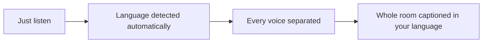
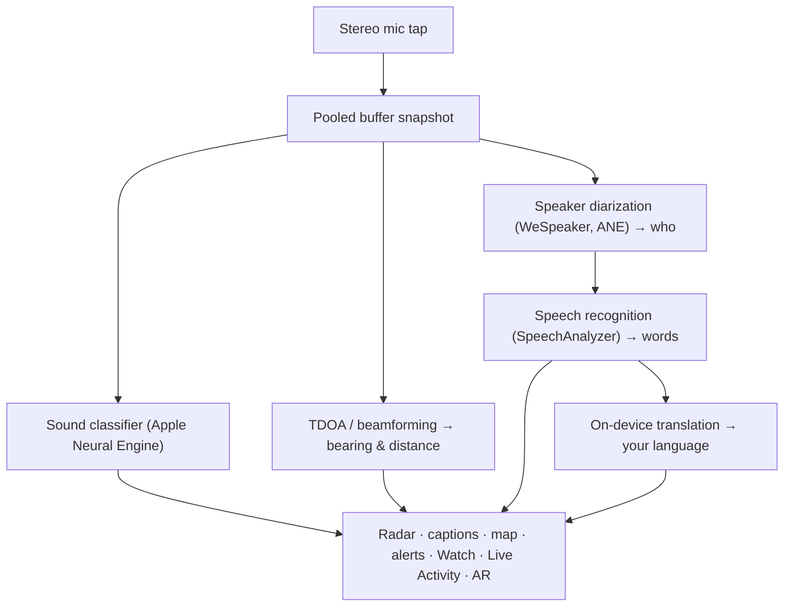

# Vigilant Ear 👂🛡️

*Акустический радар для тех, кто не слышит.*

Приложение, созданное специально для сообщества глухих, слабослышащих и CODA. Большинство приложений распознавания звука говорят, *что* это за звук. **Vigilant Ear говорит, где он, кто его издаёт и что говорят** — превращая iPhone в «звуковой трикордер» реального времени, который описывает акустику вокруг вас.

Направление и расстояние сирены. Стук за спиной. Участники разговора — как отдельные расшифрованные голоса, каждый с субтитрами и направлением. Если кто-то говорит на языке, который вы не читаете, слова могут прийти **переведёнными на ваш**. Оповещения доходят до **экрана блокировки, Dynamic Island и Apple Watch** — достаточно взгляда.

Всё важное работает на устройстве. Аудио не записывается и не загружается для распознавания. Ничто не требует, чтобы вы что-то услышали.

- 🧭 **Направление, а не только обнаружение.** *Что, где, кто* и *что сказано* — а не просто «что-то прозвучало».
- 🔒 **Приватность по задумке.** Классификация, субтитры и перевод работают на вашем iPhone. Субтитры живые и эфемерные; они не сохраняются как архив расшифровок.
- ⌚ **На запястье и на экране блокировки.** Компаньон Apple Watch с направлением + Live Activity держат последнее оповещение и его азимут на расстоянии одного взгляда.
- 🛰️ **Несколько телефонов — одно общее ухо.** Constellation связывает iPhone с Ultra-Wideband, чтобы объединить то, что слышит каждый, в более точную направленную картину.
- 👁️ **Сделано для глухих / слабослышащих / CODA.** Различимая тактильная отдача, высокий контраст, подсказки без опоры только на цвет, крупные зоны нажатия и уважение к Reduce Motion.

---

## Для кого это

- **Глухие, слабослышащие и CODA-пользователи**, которым нужна ситуационная осведомлённость о звуке — Home Watch (стук, сигнализация, ребёнок, телефон) и Street Watch (сирена, приближение), которые можно оставить включёнными и которым можно доверять.
- Всем, кому нужны **живые субтитры с направлением и разделением говорящих** или **перевод на устройстве** речи людей рядом.
- Пользователям доступности и акустических исследований, интересующимся локализацией звука на устройстве.

> Vigilant Ear — **средство доступности**, а не сертифицированное устройство жизнеобеспечения.

---

## Что оно делает

### 🧭 Видит звук — направление и расстояние
Используя стереомикрофоны iPhone, Vigilant Ear оценивает **азимут и приблизительное расстояние** звуков вокруг вас и размещает их живыми маркерами на радарном кольце «носом вперёд» и на карте. Когда вы двигаетесь, маркеры удерживают реальное положение в мире. Это ядро: пространственная осведомлённость о мире, который вы не слышите.

### 🚨 Узнаёт важные звуки — и предупреждает
Классификатор на устройстве распознаёт сотни бытовых звуков и следит за критическими категориями — **сирены, сигнализации (включая отдельный класс автомобильной сигнализации), дверные звонки/стуки, плач ребёнка, человек рядом и суровая погода.** Когда срабатывает одно из них, вы получаете ясное экранное оповещение, необязательное **push-уведомление** и различимую **тактильную отдачу** — даже когда приложение в фоне или телефон «спит». Критические категории по умолчанию готовы к работе, так что включение уведомлений не означает «всё выключено». Выключите все категории оповещений — и движок полностью «засыпает» в фоне, экономя батарею. Слой **Sentinel** сверяет оповещения с независимыми признаками — направлением, движением и публичными лентами — чтобы срабатывания были подтверждены, а не одной догадкой классификатора.

Предупреждения о суровой погоде приходят из официальных публичных лент — **NWS** (США), **MeteoGate** (Европа), **CMA** (Китай), **KMA** (Корея), **JMA** (Япония), **ECCC** (Канада) и **INMET** (Бразилия) — бесплатно для всех. Ленты сужаются до тех, что покрывают ваше местоположение.

### ⌚ Apple Watch + Live Activity — взглянул и понял
- **Компаньон Apple Watch** — направление оповещения указывается на запястье, чтобы одним взглядом понять, куда смотреть. Обновлённый UI Watch с иконкой уха, HUD угрозы и двойным тапом для закрытия оповещения. Стрелка направления может показываться, даже когда приложение на часах не открыто.
- **Live Activity** — Vigilant Ear остаётся на **экране блокировки**, в **Dynamic Island** и в **Smart Stack** на часах, так что последнее оповещение и его азимут всегда на расстоянии одного взгляда.
- **Оповещения партнёра на запястье** — когда телефон связанного партнёра Constellation поднимает оповещение, оно может дойти и до ваших часов, с направлением. Проход по надёжности держит компаньон лёгким для батареи часов весь день.

### 💬 Speaker Mode — живые направленные субтитры *(бесплатно)*
Включите **Speaker Mode**, и Vigilant Ear расшифровывает речь людей рядом в **блоки субтитров — по одному на голос.** Диаризация говорящих на устройстве разделяет голоса — *кто* говорит *что* — с направленной подсказкой на внутреннем кольце. Активный говорящий подсвечивается; старый текст уходит по мере нехватки места. Субтитры бесплатны; автоматический перевод — необязательный слой Power Pack+. Субтитры также можно **озвучивать на Bluetooth-слуховые устройства** — бесплатно, в настройках.

### 🌐 Speaker Auto-Translate — ваш язык, вживую *(Power Pack+)*
При включённом Speaker Mode, когда человек рядом говорит на другом языке, Vigilant Ear может определить его и показать субтитры **на вашем языке**, с исходным языком на блоке. Цепочка — услышать → разделить говорящих → расшифровать → перевести → показать — работает **на устройстве**; единственный сетевой момент — разовая загрузка языкового пакета от Apple. Вам не нужно заранее знать или выбирать чужой язык.

Это ближайшее к **универсальному переводчику из научной фантастики** из того, что уже поставляется: устройство, которое просто понимает. Vigilant Ear сам определяет язык, следит за каждым говорящим в комнате и даёт субтитры на вашем языке — без наушников, без сложной настройки, на вашем устройстве.

### 🎵 Музыка и эфир *(Power Pack+)*
**ShazamKit** распознаёт музыку вокруг вас и отслеживает смену треков.

### 🎛️ Acoustic Scope — увидеть звук как инженер *(Power Pack+)*
Профессиональный живой вид звука вокруг: спектр, спектрограмма, полосы RTA ⅓ октавы, chroma и гармонические парциалы — плюс инструменты захвата звуков для обучения собственных пакетов.

### 📦 Пользовательские звуковые пакеты — научите его вашему миру *(Power Pack+)*
Научите Vigilant Ear звукам, которые важны вам — от местных птиц до дверного звонка вашего здания. Дополнительные пакеты накладываются поверх встроенного обнаружения, так что новые звуки никогда не вытесняют сирены и сигнализации. Пошаговое руководство встроено в приложение.

### 🛰️ Constellation — много iPhone, одно общее ухо *(Power Pack+)*
С двумя и более iPhone с Ultra-Wideband (большинство с iPhone 11) **Constellation** связывает их, чтобы они знали взаимное положение и объединяли то, что слышит каждый, в более точную картину источника звука — распределённый пассивный слушающий массив. Доступно на устройствах с нужным железом. Mesh-субтитры старше времени подключения пира не ретранслируются.

**Сообщения партнёру** — отправьте короткий текст на телефон связанного партнёра; он попадает в ленту субтитров и может прийти переведённым на его язык, на устройстве. Обмен сообщениями учитывает возраст: на базе Declared Age Range от Apple переписка взрослого с несовершеннолетним остаётся выключенной, пока оба человека намеренно не назовут друг друга. Оповещения и субтитры никогда не блокируются — только личные текстовые сообщения.

### 📷 Camera AR — «увидеть звук»
Откройте капсулу камеры на верхней панели и закрепите обнаруженные звуки по реальному азимуту в живом виде камеры. Маркеры группируются по говорящему или по категории звука и направлению, чтобы картинка оставалась читаемой; источники затухают, когда замолкают.

### 🗺️ Карты, дороги и прогноз пути
Азимуты звуков проецируются на реальные GPS-координаты на карте. Звуки транспорта могут **«прилипать» к ближайшим улицам**, а их путь — предсказываться, чтобы проезжающий грузовик читался как движение *по дороге*, а не сквозь здания. (Попробуйте демо с пожарной машиной.)

### 🪄 Feature Playground — докажите без ушей
**Feature Playground** открыт для всех: домашние и уличные тренировки (стук, сигнализация, ребёнок, сирена, погода), демо нескольких телефонов и разговора, и явный водяной знак, чтобы тренировка никогда не притворялась живым событием. Закрытие панели чисто снимает демо (без застрявшего GPS-spoof и оставшихся флагов).

### ♿ Сначала доступность
Сделано для глухих / слабослышащих / CODA и пользователей с нарушением цветовосприятия: **не завязанные только на цвет** подсказки, зоны нажатия **≥44 pt**, уважение к **Reduce Motion**, мультимодальные оповещения (тактильность + визуал + Watch) и экран стартовой проверки разрешений с ясными зелёным / серым / красным (и жжёно-оранжевым «запрещено») состояниями — включая разрешение уведомлений как главный выключатель оповещений.

---

## Бесплатно и Power Pack+

Ядро безопасности **бесплатно навсегда**:

- **Home Watch и Street Watch** — локальные звуковые оповещения (сигнализации, сирены, стуки/звонки, ребёнок, человек рядом) с экранной, тактильной и необязательной push-доставкой.
- **Живые субтитры** — Speaker Mode, на устройстве, с направлением где позволяет железо, с необязательным озвучиванием на Bluetooth-слуховые устройства.
- **Standing Watch** — состояние самой комнаты, всегда включено и без какой-либо настройки: ровная циановая лампа, пока комната держит свой привычный рисунок, янтарная, когда что-то меняется — новый голос, внезапная тишина или что-то приближающееся.
- **Оповещения о суровой погоде** — NWS, MeteoGate, CMA, KMA, JMA (Япония), ECCC (Канада), INMET (Бразилия) для вашего региона.
- **Оповещения о землетрясениях (USGS, по всему миру)** — вибрация и зона на карте, когда рядом зарегистрировано землетрясение. Подтверждение из официальной ленты USGS — не система раннего предупреждения: если вы почувствовали тряску, это объясняет, что это было. Глубокий «гул» (инфразвук) на устройстве может заранее «взвести» проверку в момент, когда земля движется.
- **Feature Playground** — тренировочные оповещения и превью функций с явной меткой PREVIEW.
- **Компаньон Apple Watch и Live Activity** — направление и последнее оповещение с одного взгляда.

**Power Pack+** — одноразовая разблокировка (**не подписка**) с **90-дневным бесплатным пробным периодом**. Добавляет «суперсилы»:

- **Speaker Auto-Translate** — перевод речи рядом на ваш язык на устройстве.
- **Constellation** — общий «слух» нескольких iPhone через Ultra-Wideband, с сообщениями партнёру.
- **Music ID** — распознавание песен через ShazamKit.
- **Acoustic Scope** — профессиональная живая визуализация звука и инструменты захвата.
- **Пользовательские звуковые пакеты** — дополнительные классификаторы, которые вы обучаете под свои звуки.

Бесплатно или с Power Pack+ — **ваше аудио остаётся на устройстве для распознавания**: уровень только меняет, какие функции разблокированы, а не куда уходит «сырое» аудио для анализа.

---

## Как это устроено (под капотом)

Vigilant Ear — **локальный, on-device** конвейер. «Сырое» аудио захватывается на высокоприоритетном tap, копируется в **pooled free-list буферов** (без thrash аллокаций на realtime-пути) и расходится независимым процессорам, не блокируя UI и не прерывая streamer:

- **Пространственная математика** — FFT, Time-Difference-of-Arrival и Doppler-трекинг на фоновых задачах.
- **Речь** — iOS 26 `SpeechAnalyzer` / `SpeechTranscriber` для расшифровки; эмбеддинги **WeSpeaker** для идентичности голоса; фреймворк **Translation** Apple для перевода на устройстве.
- **Параллельность** — изоляция Swift 6 чисто разделяет tap микрофона, акустическую математику и цикл отрисовки UI.
- **Эффективность** — даунсэмплинг и адаптивная к нагрузке классификация держат always-listening достаточно лёгким, чтобы оставлять включённым.

---

## Конфиденциальность

- **On-device для основного конвейера.** Классификация, пространственная математика, расшифровка, диаризация и перевод работают на вашем iPhone. «Сырое» аудио не записывается и не загружается для распознавания.
- **Субтитры эфемерны.** Живые субтитры остаются в памяти на сессию; экспортируемые отладочные журналы не содержат текста субтитров.
- **Нет SDK рекламы и поведенческой аналитики.** Ограниченное использование сети — только карты, публичные погодные ленты, необязательные отпечатки Shazam, дорожный контекст и покупки App Store — см. полную политику.

Подробности: [PRIVACY.md](PRIVACY.md) · [TERMS.md](TERMS.md) · [SUPPORT.md](SUPPORT.md)

---

## Железо и платформы

- **iPhone (полный опыт).** Работает в портретной и ландшафтной ориентации — держите как удобно. Для пеленгации нужны стереомикрофоны. Рекомендуется **iPhone 13 или новее**.
- **Apple Watch.** Компаньонные оповещения со стрелкой направления; работает с Live Activity / Smart Stack.
- **iPad (нативно).** Адаптивная вёрстка: на большом экране живые субтитры получают полупрозрачную панель рядом с картой, которая убирается, когда никто не говорит. Одноканальные микрофоны → субтитры без полного направления.
- **Constellation** требует **Ultra-Wideband** — iPhone 11 или новее, кроме SE и моделей «e».
- **Android.** Отдельная сборка с ядром радара, оповещениями, субтитрами и погодой; mesh Constellation — в первую очередь iOS. Следите за обновлениями сайта продукта по мере роста паритета Android.

**Текущая версия App Store:** 1.1.0. Собрано для современного iOS (эпоха SpeechAnalyzer).

---

## Локализация

Полностью локализованы интерфейс, оповещения и субтитры на **английский, испанский, португальский (Бразилия), французский, немецкий, арабский, японский, упрощённый китайский, корейский, русский и итальянский** (11 языков). Следует системной локали или ручному выбору в приложении.

---

## Статус и отказ от ответственности

Vigilant Ear — **экспериментальное средство акустической доступности**, а не сертифицированная утилита жизнеобеспечения. Точность локализации зависит от окружения, погоды, ветра и микрофонного железа. **Всегда сохраняйте обычную осведомлённость об окружении** — не полагайтесь на него как на единственный источник информации о безопасности.

Некоторые возможности (маркеры camera AR, апгрейд Critical Alerts при выдаче Apple, расширенное авторство multi-pack) продолжают развиваться; бесплатные Home / Street watch и живые субтитры — продукт, которому можно доверять с первого дня.

---

**Контакт:** [vigilantear@wingdingssocial.com](mailto:vigilantear@wingdingssocial.com)

Сделано с ❤️ для сообщества глухих и слабослышащих и акустических исследований.

    
  <strong>© 2026 Wingdings, Inc.</strong> 
  All rights reserved. 
  Patent Pending

