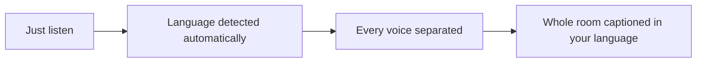
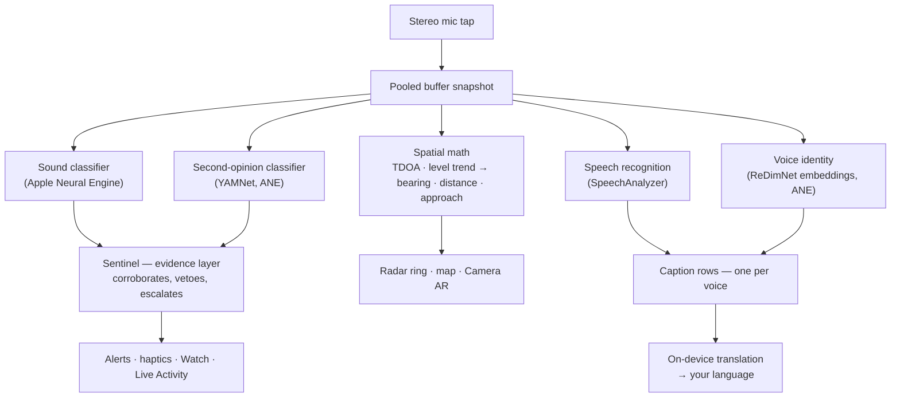
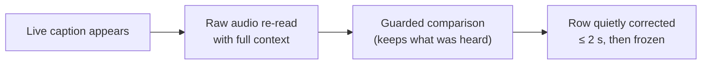
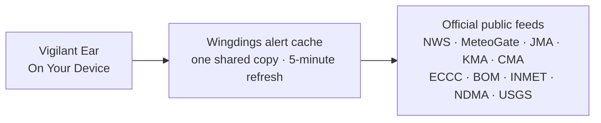

# Vigilant Ear 👂🛡️

*Действует с версии 1.1.3 · сентябрь 2026.*

## Акустический радар для тех, кто не слышит.

Приложение, созданное специально для сообщества глухих, слабослышащих и CODA. Большинство приложений распознавания звука говорят, *что* это за звук. **Vigilant Ear говорит, где он, кто его издаёт и что говорят** — превращая iPhone в «звуковой трикордер» реального времени, который описывает акустику вокруг вас.

Направление и расстояние сирены. Стук за спиной. Участники разговора — как отдельные расшифрованные голоса, каждый с субтитрами и направлением. Если кто-то говорит на языке, который вы не читаете, слова могут прийти **переведёнными на ваш**. Оповещения доходят до **экрана блокировки, Dynamic Island и Apple Watch** — достаточно взгляда.

Всё важное работает на устройстве. Аудио не записывается и не загружается для распознавания. Ничто не требует, чтобы вы что-то услышали.

- 🧭 **Направление, а не только обнаружение.** *Что, где, кто* и *что сказано* — а не просто «что-то прозвучало».
- 🔒 **Приватность по задумке.** Классификация, субтитры и перевод работают на вашем iPhone. Субтитры живые и недолговечные; они не сохраняются как архив расшифровок.
- ⌚ **На запястье и на экране блокировки.** Компаньон Apple Watch с направлением + Live Activity держат последнее оповещение и его азимут на расстоянии одного взгляда.
- 🛰️ **Несколько телефонов — одно общее ухо.** Constellation связывает iPhone с Ultra-Wideband, чтобы объединить то, что слышит каждый, в более точную направленную картину.
- 👁️ **Сделано для глухих / слабослышащих / CODA.** Различимая тактильная отдача, высокий контраст, подсказки без опоры только на цвет, крупные зоны нажатия и уважение к Reduce Motion.

---

## Для кого это

- **Глухие, слабослышащие и CODA-пользователи**, которым нужна ситуационная осведомлённость о звуке — Home Watch (стук, сигнализация, ребёнок, телефон) и Street Watch (сирена, приближение), которые можно оставить включёнными и которым можно доверять.
- Всем, кому нужны **живые субтитры с направлением и разделением говорящих** или **перевод на устройстве** речи людей рядом.
- Пользователям доступности и акустических исследований, интересующимся локализацией звука на устройстве.

> Vigilant Ear — **средство доступности**, а не сертифицированное устройство обеспечения безопасности жизни.

---

## Что оно делает

### 🧭 Видит звук — направление и расстояние
Используя два микрофона iPhone, Vigilant Ear измеряет **угол звука и то, впереди он или позади вас**, удерживает показание с точностью около градуса и ставит его живым маркером на радарном кольце «носом вперёд» и на карте. Два микрофона на одной линии сами по себе не различают лево и право — звук в 50° справа и звук в 50° слева приходят с одинаковой крошечной разницей во времени — поэтому приложение рисует показание плюс **более бледный «призрак» с другой стороны**, а поворот запястья или второй телефон снимают неоднозначность. Расстояние оценивается по громкости по уличной калибровочной кривой и показывается именно как оценка: *≈ 50 ft*, с вероятным диапазоном. Когда вы двигаетесь, маркеры удерживают реальное положение в мире. Это ядро: пространственная осведомлённость о мире, который вы не слышите. (Цифры ниже.)

### 🚨 Узнаёт важные звуки — и предупреждает
Классификатор на устройстве распознаёт сотни бытовых звуков и следит за критическими категориями — **сирены, сигнализации — включая отдельный класс автомобильной сигнализации — дверные звонки/стуки, плач ребёнка, человек рядом и суровая погода.** Когда срабатывает одно из них, вы получаете ясное экранное оповещение, необязательное **push-уведомление** и различимую **тактильную отдачу** — даже когда приложение в фоне или телефон «спит». Критические категории по умолчанию готовы к работе, так что включение уведомлений не означает «всё выключено». Выключите все категории оповещений — и движок полностью «засыпает» в фоне, экономя батарею. Слой **Sentinel** сверяет оповещения с независимыми признаками — направлением, движением и публичными лентами — чтобы срабатывания были подтверждены, а не одной догадкой классификатора. Работает в обе стороны: сиреноподобный момент внутри песни удерживается, а настоящая сирена, повторяющаяся сквозь вашу музыку, пробивается и даёт оповещение.

Предупреждения о суровой погоде приходят из официальных публичных лент — **NWS** (США), **MeteoGate** (Европа), **CMA** (Китай), **KMA** (Корея), **JMA** (Япония), **ECCC** (Канада), **BOM** (Австралия), **INMET** (Бразилия) и **NDMA** (Индия) — бесплатно для всех. Ленты сужаются до тех, что покрывают ваше местоположение. В Японии приложение также читает **предварительные бюллетени** JMA — понятные уведомления за несколько дней до тайфуна или сильного дождя, а не только предупреждения, когда опасность уже рядом — плюс бюллетени о внезапном ливне и оползнях. Предварительные сообщения показываются спокойно, без звука и вибрации, которые оставлены для настоящего предупреждения.

### ⌚ Apple Watch + Live Activity — взглянул и понял
- **Компаньон Apple Watch** — направление оповещения указывается на запястье, чтобы одним взглядом понять, куда смотреть. Обновлённый UI Watch с иконкой уха, HUD угрозы и двойным тапом для закрытия оповещения. Стрелка направления может показываться, даже когда приложение на часах не открыто.
- **Live Activity** — Vigilant Ear остаётся на **экране блокировки**, в **Dynamic Island** и в **Smart Stack** на часах, так что последнее оповещение и его азимут всегда на расстоянии одного взгляда.
- **Оповещения партнёра на запястье** — когда телефон связанного партнёра Constellation поднимает оповещение, оно может дойти и до ваших часов, с направлением. Доработка надёжности держит компаньон лёгким для батареи часов весь день.

### 💬 Speaker Mode — живые направленные субтитры *(бесплатно)*
Включите **Speaker Mode**, и Vigilant Ear расшифровывает речь людей рядом в **блоки субтитров — по одному на голос.** Диаризация говорящих на устройстве разделяет голоса — *кто* говорит *что* — с направленной подсказкой на внутреннем кольце. Активный говорящий подсвечивается; старый текст уходит по мере нехватки места.

Две вещи, которых нет у большинства приложений субтитров: **честность о уверенности** — тонкая пометка качества в каждой строке и пунктирное подчёркивание сомнительных слов показывают, когда строке можно доверять, а когда лучше перепроверить — и **самокоррекция**: сразу после того, как предложение «встало», приложение заново читает аудио с полным контекстом и может восстановить пропущенное или неверно услышанное слово за пару секунд, после чего текст замирает.

Субтитры бесплатны; автоматический перевод — необязательный слой Power Pack+. Субтитры также можно **озвучивать на Bluetooth-слуховые устройства** — бесплатно, в настройках. **Direction Tones** (тоже бесплатно, в Preferences → Captions) добавляют необязательный звуковой сигнал в выбранном ухе, указывающий, где находится говорящий — полезно со слуховым аппаратом или при одностороннем слухе, и доступно всем.

### 🌐 Speaker Auto-Translate — ваш язык, вживую *(Power Pack+)*
При включённом Speaker Mode, когда человек рядом говорит на другом языке, Vigilant Ear может определить его и показать субтитры **на вашем языке**, с исходным языком на блоке. Цепочка — услышать → разделить говорящих → расшифровать → перевести → показать — работает **на устройстве**; единственный сетевой момент — разовая загрузка языкового пакета от Apple. Вам не нужно заранее знать или выбирать чужой язык.

Это ближайшее к **универсальному переводчику из научной фантастики** из того, что уже поставляется: устройство, которое просто понимает. Vigilant Ear сам определяет язык, следит за каждым говорящим в комнате и даёт субтитры на вашем языке — без наушников, без сложной настройки, на вашем устройстве.

### 🎵 Музыка и эфир *(Power Pack+)*
**ShazamKit** распознаёт музыку вокруг вас и отслеживает смену треков.

### 🎛️ Acoustic Scope — увидеть звук как инженер
Профессиональный живой вид звука вокруг: спектр, спектрограмма, полосы RTA ⅓ октавы, chroma и гармонические парциалы — **бесплатно для всех**. Инструменты захвата звуков для обучения собственных наборов входят в Power Pack+.

### 📦 Пользовательские звуковые пакеты — научите его вашему миру *(Power Pack+)*
Научите Vigilant Ear звукам, которые важны вам — от местных птиц до дверного звонка вашего здания. Дополнительные пакеты накладываются поверх встроенного обнаружения, так что новые звуки никогда не вытесняют сирены и сигнализации. Пошаговое руководство встроено в приложение.

### 🛰️ Constellation — много iPhone, одно общее ухо *(Power Pack+)*
С двумя и более iPhone с Ultra-Wideband (большинство с iPhone 11) **Constellation** связывает их, чтобы они знали взаимное положение и объединяли то, что слышит каждый, в более точную картину источника звука — распределённый пассивный слушающий массив. Субтитры тоже объединяются: каждый телефон расшифровывает то, что слышит его микрофон, а слова выравниваются между телефонами так, чтобы ближайший к говорящему вносил услышанное — слова, которые поймал только один телефон, сохраняются, а не теряются. Телефоны соединяются **напрямую друг с другом** — без роутера, без общей сети Wi-Fi и без интернета; достаточно, чтобы Wi-Fi был включён, по тому же одноранговому каналу, который использует AirDrop. Доступно на устройствах с нужным железом. Mesh-субтитры старше времени подключения пира не ретранслируются.

**Сообщения партнёру** — отправьте короткий текст на телефон связанного партнёра; он попадает в ленту субтитров и может прийти переведённым на его язык, на устройстве. Обмен сообщениями учитывает возраст: на базе Declared Age Range от Apple переписка взрослого с несовершеннолетним остаётся выключенной, пока оба человека намеренно не назовут друг друга. Оповещения и субтитры никогда не блокируются — только личные текстовые сообщения.

### 🔗 Remote Link — связаться с тем, кого нет рядом *(Power Pack+ для старта)*
То, что обычно делает телефонный звонок, — но через видео и текст. Вы отправляете код приглашения; другой человек заходит из Vigilant Ear **без покупки Power Pack+**. В отличие от Constellation, близость не нужна — вы можете быть где угодно.

**Аудио не используется ни на каком этапе.** Только видео и текст, поэтому связь ни на одной стороне не зависит от слуха — и вы можете жестикулировать друг другу через приложение. Само приложение не понимает язык жестов; оно передаёт видео, а остальное делаете вы двое. Соединение прямое между двумя телефонами там, где сеть это позволяет, и приложение ясно показывает, **Direct** это или **Relayed**, чтобы вы всегда знали, идёт ли видео через ретранслятор.

### 📷 Camera AR — «увидеть звук»
Откройте капсулу камеры на верхней панели и закрепите обнаруженные звуки по реальному азимуту в живом виде камеры. Маркеры группируются по говорящему или по категории звука и направлению, чтобы картинка оставалась читаемой; источники затухают, когда замолкают.

### 🗺️ Карты, дороги и прогноз пути
Азимуты звуков проецируются на реальные GPS-координаты на карте. Звуки транспорта могут **«прилипать» к ближайшим улицам**, а их путь — предсказываться, чтобы проезжающий грузовик читался как движение *по дороге*, а не сквозь здания. (Попробуйте демо с пожарной машиной.)

### 🪄 Feature Playground — докажите без ушей
**Feature Playground** открыт для всех: домашние и уличные тренировки (стук, сигнализация, ребёнок, сирена, погода), демо нескольких телефонов и разговора, и явный водяной знак, чтобы тренировка никогда не притворялась живым событием. Закрытие панели чисто снимает демо (без застрявшего GPS-spoof и оставшихся флагов).

### ♿ Сначала доступность
Сделано для глухих / слабослышащих / CODA и пользователей с нарушением цветовосприятия: **не завязанные только на цвет** подсказки, зоны нажатия **≥44 pt**, уважение к **Reduce Motion**, мультимодальные оповещения (тактильность + визуал + Watch) и экран стартовой проверки разрешений с ясными зелёным / серым / красным (и жжёно-оранжевым «запрещено») состояниями — включая разрешение уведомлений как главный выключатель оповещений.

---

## Бесплатно и Power Pack+

Ядро безопасности **бесплатно навсегда**:

- **Home Watch и Street Watch** — локальные звуковые оповещения (сигнализации, сирены, стуки/звонки, ребёнок, человек рядом) с экранной, тактильной и необязательной push-доставкой.
- **Живые субтитры** — Speaker Mode, на устройстве, с направлением где позволяет железо, с честными пометками уверенности, самокоррекцией примерно за 2 секунды, необязательным озвучиванием на Bluetooth-слуховые устройства и Direction Tones.
- **Standing Watch** — состояние самой комнаты, всегда включено и без какой-либо настройки: ровная циановая лампа, пока комната держит свой привычный рисунок, янтарная, когда что-то меняется — новый голос, внезапная тишина или что-то приближающееся.
- **Оповещения о суровой погоде** — NWS, MeteoGate (Европа — свежие данные из нашего 5-минутного кэша оповещений), CMA, KMA, JMA (Япония), ECCC (Канада), BOM (Австралия), INMET (Бразилия) и NDMA (Индия) для вашего региона.
- **Оповещения о землетрясениях (USGS, по всему миру)** — вибрация и зона на карте, когда рядом зарегистрировано землетрясение. Подтверждение из официальной ленты USGS — не система раннего предупреждения: если вы почувствовали тряску, это объясняет, что это было. Глубокий «гул» (инфразвук) на устройстве может заранее «взвести» проверку в момент, когда земля движется.
- **Feature Playground** — тренировочные оповещения и превью функций с явной меткой PREVIEW.
- **Компаньон Apple Watch и Live Activity** — направление и последнее оповещение с одного взгляда.
- **Acoustic Scope** — профессиональная живая визуализация звука, бесплатно для всех. (Инструменты захвата для обучения входят в Power Pack+.)

**Power Pack+** — одноразовая разблокировка (**не подписка**) с **90-дневным бесплатным пробным периодом**. Добавляет «суперсилы»:

- **Speaker Auto-Translate** — перевод речи рядом на ваш язык на устройстве.
- **Constellation** — общий «слух» нескольких iPhone через Ultra-Wideband, с сообщениями партнёру.
- **Music ID** — распознавание песен через ShazamKit.
- **Пользовательские звуковые пакеты** — дополнительные классификаторы, которые вы обучаете под свои звуки.

Бесплатно или с Power Pack+ — **ваше аудио остаётся на устройстве для распознавания**: уровень только меняет, какие функции разблокированы, а не куда уходит «сырое» аудио для анализа.

---

## Как это устроено (под капотом)

Vigilant Ear — **локальный, on-device** конвейер из слоёв: захват один раз, затем независимые специалисты читают один и тот же звук и сверяют работу друг друга. «Сырое» аудио захватывается на высокоприоритетном tap, копируется в **pooled free-list буферов** (без thrash аллокаций на realtime-пути) и расходится, не блокируя UI:

Ни одной модели не доверяют в одиночку. Слой **Sentinel** стоит между обнаружением и оповещением: независимые движки подтверждают или отклоняют друг друга кадр за кадром — а когда повторные реальные признаки накапливаются против veto (настоящая сирена сквозь вашу музыку), побеждают признаки, и оповещение срабатывает.

Субтитры получают второй шанс. Каждое завершённое предложение тихо перечитывается из короткого кольцевого буфера аудио в памяти с полным контекстом — исправления приходят примерно за две секунды, после чего текст окончательно замирает:

- **Пространственная математика** — FFT, взвешенный по когерентности Time Difference of Arrival (TDOA — предпочитаются частотные полосы, в которых оба микрофона согласны, затем крошечная задержка прибытия превращается в азимут) и отслеживание приближения по тренду уровня на фоновых задачах. Пара микрофонов читается в фиксированной ориентации, так что направление работает одинаково, держите ли вы телефон вертикально или боком.
- **Речь** — iOS 26 `SpeechAnalyzer` / `SpeechTranscriber` для расшифровки; эмбеддинги **ReDimNet** для идентичности голоса; фреймворк **Translation** Apple для перевода на устройстве. Идентичность голоса основана на признаках: голос подтверждается как реальный человек только по независимым окнам звука, а неуверенное совпадение показывается без атрибуции, а не с угаданным неверным именем.
- **Музыкальная «правда»** — детектор **song-signature** по chroma решает, «играет ли на самом деле музыка?», потому что общие классификаторы знаменито называют тихие комнаты и сирены «музыкой». Shazam запускается только когда подпись согласна, что музыкальное действительно есть.
- **Параллельность** — изоляция Swift 6 чисто разделяет tap микрофона, акустическую математику и цикл отрисовки UI.
- **Эффективность** — даунсэмплинг, адаптивная к нагрузке классификация и сетевое использование, ограниченное признаками, держат always-listening достаточно лёгким, чтобы оставлять включённым.

Погода идёт противоположным путём от аудио — ваш звук никогда не уходит наружу, но *данные* оповещений приходят. **Каждая** официальная лента проходит через небольшой кэш, который мы ведём, так что один запрос публичных данных обслуживает всех пользователей — и ваш телефон никогда не обращается к серверам иностранного правительства:

---

## Что слышит ваш телефон — измерения

У iPhone два микрофона примерно в шести дюймах друг от друга, барометр и очень хорошие часы. Этого достаточно, чтобы сказать, в какую сторону звук, примерно насколько далеко, приближается ли он и только что ли открылась дверь. Ниже — насколько точен каждый из этих пунктов, как мы проверяли и почему это важно, если вы сами звук не слышите. Направление и связанные цифры измерены на iPhone 17 и iPhone 16 Pro Max в сентябре 2026 года. Расстояние по природе остаётся оценкой — мы так и пишем на экране.

**Направление — с точностью до пары градусов.** Звук достигает верхнего микрофона раньше нижнего или позже, и по этому промежутку приложение вычисляет, насколько звук смещён от оси телефона и впереди он или позади. Два канала телефона — не «голые» микрофоны, а обработанное стереоизображение, и это изображение добавляет свой фиксированный рисунок, когда в комнате шумно. Приложение теперь учит этот рисунок за несколько тихих секунд после запуска и убирает его перед чтением направления.

| Что измеряли | Результат |
|---|---|
| Медианная ошибка по 96 смоделированным комнатам, от тихого офиса до жёсткостенной комнаты при 5 dB SNR | 1,0° |
| iPhone 17 на столе, комнатный шум включён, динамик 30° от оси | прочитано 61,7° от боковой плоскости при ожидаемых 60°, дрожание 1,6° |
| То же, динамик прямо сбоку от телефона | прочитано 4,5° при ожидаемых 0°, дрожание 2,2° |
| То же, динамик прямо впереди | каждое показание на максимальной задержке, как и должно |
| Показания, попавшие на собственный рисунок изображения вместо звука | ни одного, ни под каким углом |

*Почему это важно:* если вы не слышите сирену, «позади, чуть сбоку» говорит, куда смотреть. Показанию, которое стоит на месте, стоит доверять только после проверки рулеткой — и это было сделано дважды, второй раз после того, как первая проверка оказалась слишком мягкой.

**Расстояние — показано именно как оценка.** Один микрофон не измеряет расстояние, только громкость, а громкий грузовик далеко может звучать как тихий автомобиль вблизи. Приложение оценивает расстояние по громкости по кривой, подогнанной на реальной улице, и формулирует это так, как сказал бы осторожный человек: *около 50 ft, скорее всего между 25 и 100.*

| Что измеряли | Результат |
|---|---|
| Реальные детекции автомобилей, проигранные через калибровку | 1 131 |
| Попадания внутрь 100-футовой дороги, на которой они реально были | 73% |
| Автомобили дальней полосы | оценка 78 и 87 ft при рулетке 73 и 85 ft |

Дорога (городской перекрёсток) измерена полоса за полосой; когда кривая ошибается, она ошибается в сторону ближе. Калибровка зафиксирована автотестом, чтобы не «уплывала» молча. Сигнализации в вашем пространстве, например дымовой датчик, не получают цифры расстояния вовсе — они уже в комнате с вами.

**Движение — приближается к вам.** Для автомобилей и сирен рост громкости обычно означает приближение. Приложение смотрит, как быстро уровень звука растёт за несколько секунд: устойчивый подъём около 1,5 dB в секунду (ясный, ровный рост громкости) означает приближение, такой же спад — удаление, а звук, который перестал меняться, перестаёт называться тем или другим примерно через четыре секунды. Один громкий момент — короткий гудок, хлопок двери — не может это вызвать. Построено на физике и девяти автотестах; записанный уличный проезд — следующая полевая проверка.

**Воздух в комнате — у двери есть подпись.** Барометр может заметить открытие двери примерно в четырнадцати футах: давление падает, когда дверь распахивается, затем отскакивает при закрытии. За четырнадцать часов тишины и пятнадцать событий двери каждая дверь давала эту двухчастную форму, а больше ничего в доме — нет.

| Событие | Скорость давления | Форма |
|---|---|---|
| Входная дверь, открыта и закрыта, ×10 | 0,6–1,8 Pa/s | спад, затем отскок, ~5 с между ними |
| Входная дверь, хлопнула, ×5 | 1,1–2,5 Pa/s | та же пара, выше |
| Кондиционер ночью, ×8 | 0,11–0,46 Pa/s | медленный подъём за минуты, одинаковый на обоих телефонах |
| Тихая комната | ~0,02 Pa/s | ничего |
| Проход мимо, чихание | — | датчик движения замечает, и телефон игнорирует |

Сетчатая дверь, которая не уплотняет комнату, была невидима — именно так и должно быть. Сегодня сдвиг давления может показываться как глубокий гул на карте; отдельное ночное оповещение о двери измерено и спроектировано, но пока не повседневный default.

**Constellation — два телефона снимают сторону.** Каждый телефон в mesh проводит линию к звуку из своего положения, и линии чисто пересекаются только с одной стороны. Когда это происходит, «призрак» исчезает, и приложение снова может сказать «лево» или «право». В симуляции два телефона **в 40 метрах** ставят сирену в 50 метрах с точностью около 2 метров.

**Как чему-либо здесь верят.** Каждая цифра прошла одни и те же три ворота по порядку: смоделированная комната с заранее известным ответом; небольшие автотесты, которые воссоздают точный случай, который обманул бы приложение, и запускаются на каждое изменение; затем реальные телефоны на реальном столе с расстояниями, измеренными вручную. Ничто не считается точным, пока не пережило третье. Для того, кто не слышит звук, слово приложения — единственное слово: его нужно заслужить так, как это делает лаборатория.

Более глубокие заметки для инженеров: [Physics](https://vigilantear.com/en/physics/) — TDOA, расстояние, движение, Constellation и барометрическое обнаружение, с каждой цифрой с меткой MEASURED / BENCHED / MODELLED.

---

## Конфиденциальность

- **On-device всегда для основного конвейера.** Классификация, пространственная математика, расшифровка, диаризация и перевод работают на вашем iPhone. «Сырое» аудио не записывается и не загружается для распознавания.
- **Субтитры недолговечны.** Живые субтитры остаются в памяти на сессию; экспортируемые отладочные журналы не содержат текста субтитров.
- **Нет SDK рекламы и поведенческой аналитики.** Ограниченное использование сети — только карты, публичные погодные ленты, необязательные отпечатки Shazam, дорожный контекст и покупки App Store — см. полную политику.

Подробности: [PRIVACY.md](PRIVACY.md) · [TERMS.md](TERMS.md) · [SUPPORT.md](SUPPORT.md)

---

## Железо и платформы

- **iPhone (полный опыт).** Работает в портретной и ландшафтной ориентации — держите как удобно. Для пеленгации нужны стереомикрофоны. Рекомендуется **iPhone 13 или новее**.
- **Apple Watch.** Компаньонные оповещения со стрелкой направления; работает с Live Activity / Smart Stack.
- **iPad (нативно).** Адаптивная вёрстка: на большом экране живые субтитры получают полупрозрачную панель рядом с картой, которая убирается, когда никто не говорит. Одноканальные микрофоны → субтитры без полного направления.
- **Constellation** требует **Ultra-Wideband** — iPhone 11 или новее, кроме SE и моделей «e». Сеть Wi-Fi **не** нужна: при включённом Wi-Fi телефоны находят друг друга напрямую, поэтому Constellation работает без роутера и без интернета, пока телефоны рядом.
- **Android.** Отдельная сборка с ядром радара, оповещениями, субтитрами и погодой; mesh Constellation — в первую очередь iOS. Следите за обновлениями сайта продукта по мере роста паритета Android.

---

## Локализация

Полностью локализованы интерфейс, оповещения и субтитры на **английский, испанский, португальский (Бразилия), французский, немецкий, итальянский, арабский, японский, упрощённый китайский, корейский, русский и хинди** (12 языков). Следует системной локали или ручному выбору в приложении.

---

## Статус и отказ от ответственности

Vigilant Ear — **экспериментальное средство акустической доступности**, а не сертифицированная утилита обеспечения безопасности жизни. Точность локализации зависит от окружения, погоды, ветра и микрофонного железа. **Всегда сохраняйте обычную осведомлённость об окружении** — не полагайтесь на него как на единственный источник информации о безопасности.

Некоторые возможности (маркеры camera AR, апгрейд Critical Alerts при выдаче Apple, расширенное авторство multi-pack) продолжают развиваться; бесплатные Home / Street watch и живые субтитры — продукт, которому можно доверять с первого дня.

---

**Контакт:** [vigilantear@wingdingssocial.com](mailto:vigilantear@wingdingssocial.com)

Сделано с ❤️ для сообщества глухих и слабослышащих (D/HH) и акустических исследований.

    
  <strong>© 2026 Wingdings, Inc.</strong> 
  All rights reserved. 
  Patent Pending

