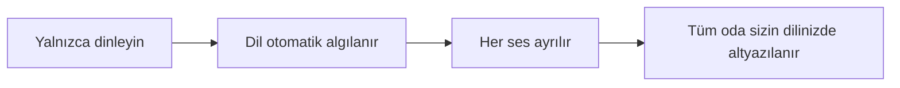
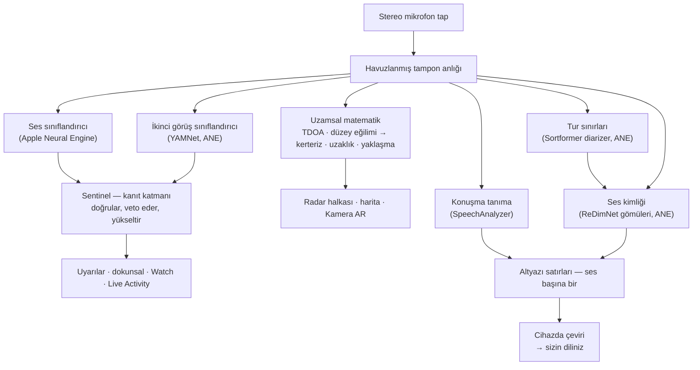
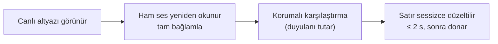
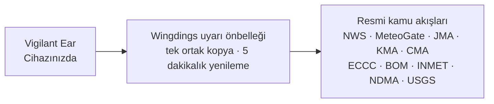

# Vigilant Ear 👂🛡️

*1.1.7 sürümünden itibaren geçerlidir · Eylül 2026.*

## Duyamayan insanlar için akustik bir radar.

Sağır, az duyan ve CODA topluluğu için özel yapılmış bir uygulama. Çoğu ses tanıma uygulaması size bir sesin *ne* olduğunu söyler. **Vigilant Ear nerede olduğunu, kimin yaptığını ve ne söylendiğini söyler** — bir iPhone’u çevrenizdeki sesi betimleyen gerçek zamanlı bir ses trikorderine çevirir.

Bir sirenin yönü ve uzaklığı. Arkanızdaki bir vuruş. Bir konuşmadaki insanlar, ayrı transkribe sesler olarak — her biri altyazılı ve yönlü yerleştirilmiş. Okumadığınız bir dilde konuşuluyorsa sözcükler **sizin dilinize çevrilmiş** gelebilir. Uyarılar **Kilit Ekranı, Dynamic Island ve Apple Watch**’a ulaşır; bir bakış yeter.

Önemli olan her şey cihazda çalışır. Ses tanıma için kaydedilmez veya yüklenmez. Hiçbir şey bir şey duymaya bağlı değildir.

- 🧭 **Yalnızca algılama değil, yön.** *Ne, nerede, kim* ve *ne söylendi* — yalnızca “bir ses oldu” değil.
- 📣 **Name Called.** Adınızı, bir çocuğu, bir eşi listeleyin — “Marie için sipariş hazır” Watch’a dokunur ve hangi yönü gösterir.
- 🔒 **Tasarım gereği özel.** Sınıflandırma, altyazı ve çeviri iPhone’unuzda çalışır. Altyazılar canlı ve geçicidir; transkript arşivi olarak saklanmaz.
- ⌚ **Bileğinizde ve Kilit Ekranı’nda.** Apple Watch yön eşlikçisi + Live Activity son uyarıyı ve hangi yönden geldiğini bir bakış ötede tutar.
- 🛰️ **Daha fazla telefon, tek ortak kulak.** Constellation Ultra-Wideband iPhone’ları bağlar ve her birinin duyduğunu daha keskin bir yön resmine kaynaştırır.
- 👁️ **Sağır / az duyan / CODA için.** Belirgin dokunsal, yüksek karşıtlık, renkten bağımsız ipuçları, büyük dokunma hedefleri ve Reduce Motion’a saygı.

---

## Kimin için

- Sesin durum farkındalığını isteyen **sağır, az duyan ve CODA kullanıcılar** — açık bırakıp güvenebileceğiniz Home Watch (vuruş, alarm, bebek, telefon) ve Street Watch (siren, yaklaşma).
- **Yön ve konuşmacı ayrımıyla canlı altyazı** veya yakındaki insanların **cihazda çevirisine** ihtiyaç duyan herkes.
- Cihazda ses yerelleştirmesiyle ilgilenen erişilebilirlik ve akustik araştırma kullanıcıları.

> Vigilant Ear bir erişilebilirlik **yardımcısıdır**, sertifikalı bir hayat kurtarma cihazı değildir.

---

## Ne yapar

### 🧭 Sesi görür — yön ve uzaklık
iPhone’un iki mikrofonunu kullanarak Vigilant Ear bir sesin **açısını ve önünüzde mi arkanızda mı olduğunu** ölçer, okumayı yaklaşık bir derece sabit tutar ve onu baş yukarı radar halkası ve haritada canlı bir işaret olarak yerleştirir. Bir çizgideki iki mikrofon tek başına solu sağdan ayıramaz — 50° sağdaki bir ses ile 50° soldaki aynı minik zaman farkıyla gelir — bu yüzden uygulama okumayı artı **diğer tarafta daha soluk bir hayalet** çizer; bileğin dönüşü veya ikinci bir telefon bunu çözer. Uzaklık, caddeye kalibre bir eğriye karşı ses yüksekliğinden tahmin edilir ve olduğu gibi gösterilir: *≈ 50 ft*, olası bir aralıkla. Hareket edin, işaretler gerçek dünya konumunu korur. Çekirdek budur: duyamadığınız bir dünyanın uzamsal farkındalığı. (Sayılar aşağıda.)

### 🚨 Önemli sesleri tanır — ve sizi uyarır
Cihazda bir sınıflandırıcı yüzlerce gündelik sesi tanımlar ve kritik kategorileri izler — **sirenler, alarmlar — özel bir araba alarmı sınıfı dahil — kapı zili/vuruş, bebek ağlaması, yakındaki bir kişi ve şiddetli hava.** Biri ateşlediğinde net bir ekran uyarısı, isteğe bağlı **anlık bildirim** ve belirgin bir **dokunsal** alırsınız — uygulama arka planda veya telefon uykudayken bile. Kritik kategoriler varsayılan hazırdır; bildirimleri açmak “hepsi kapalı” anlamına gelmesin. Tüm uyarı kategorilerini kapatın, motor arka planda tamamen uykuya geçer ve pil tasarrufu yapar. Bir **Sentinel** katmanı uyarıları bağımsız kanıta — yön, hareket ve kamu akışları — karşı kontrol eder; böylece ateşleyen şey tek bir sınıflandırıcı tahmini değil, doğrulanmış olandır. İki yönde de çalışır: bir şarkının içindeki siren biçimli bir an tutulur, ama müziğinizden tekrarlayan gerçek bir siren deler ve uyarır.

Şiddetli hava uyarıları resmi kamu akışlarından gelir — ABD **NWS**, Avrupa **MeteoGate**, **Çin CMA**, **Kore KMA**, **Japonya JMA**, **Kanada ECCC**, **Avustralya BOM**, **Brezilya INMET** ve **Hindistan NDMA** — tüm kullanıcılar için ücretsiz. Akışlar bulunduğunuz yeri kapsayanlara daraltılır. Japonya’da uygulama JMA’nın **ön bültenlerini** de okur — tayfun veya şiddetli yağmurdan günler önce yayımlanan sade dildeki duyurular, tehlike geldikten sonraki uyarılar değil — artı ani sağanak ve heyelan bültenleri. Ön duyurular sessiz gösterilir; gerçek bir uyarıya ayrılmış ses ve titreşim olmadan.

### ⌚ Apple Watch + Live Activity — bakın, bilin
- **Apple Watch eşlikçisi** — bir uyarının yönü bileğinizde işaret eder; bir bakış nereye bakacağınızı söyler. Uygulama kulak simgesi, tehdit HUD yerleşimi ve uyarıyı kapatmak için çift dokunuşla yeniden tasarlanmış Watch arayüzü. Watch uygulaması açık olmasa da uyarılar yön okunu gösterebilir.
- **Live Activity** — Vigilant Ear **Kilit Ekranı**’nda, **Dynamic Island**’da ve **Watch Smart Stack**’te kalır; son uyarı ve kerterizi her zaman bir bakış ötede.
- **Bilekte eş uyarıları** — bağlı bir Constellation eşinin telefonu uyarı kaldırırsa Watch’ınıza da ulaşabilir, yön dahil. Bir güvenilirlik geçişi eşlikçiyi tüm gün Watch pili için hafif tutar.

### 💬 Speaker Mode — canlı, yönlü altyazılar *(ücretsiz)*
**Speaker Mode**’u açın, Vigilant Ear yakındaki konuşan insanları **ses başına bir altyazı bloğuna** döker. Cihazda konuşmacı diarizasyonu sesleri ayrı tutar — *kim* *ne* söylüyor — iç halkada bir yön ipucuyla. Canlı konuşmacı vurgulanır; yer gerektiğinde eski metin kayar.

Çoğu altyazı uygulamasının yapmadığı iki şey: **güven hakkında dürüstlük** — satır başına ince bir nitelik işareti ve kuşkulu sözcüklerin altındaki noktalı çizgiler bir satıra ne zaman güvenip ne zaman iki kez bakacağınızı söyler — ve **öz düzeltme**: bir cümle oturduktan hemen sonra uygulama sesi tam bağlamla yeniden okur ve kaçırılmış veya yanlış duyulmuş bir sözcüğü yaklaşık iki saniye içinde geri getirebilir; sonra metin donar.

**Name Called** (Tercihler, siz açana kadar kapalı) bu altyazılarda listelediğiniz adları izler — sizin, bir çocuğun, bir eşin. Biri “Marie için sipariş hazır” dediğinde başka bir altyazı balonu değil, yönlü belirgin bir dokunsal ve Watch uyarısı alırsınız. Sözcükler Speaker Mode’da yine konuşma olarak görünür; bu, *size* hitap edildiğinin dokunuşudur.

Altyazılar ücretsizdir; otomatik çeviri isteğe bağlı Power Pack+ katmanıdır. Altyazılar **Bluetooth işitme cihazlarınıza sesli de okunabilir** — ücretsiz, Tercihler’de. **Yön Tonları** (yine ücretsiz, Tercihler → Altyazılar) seçtiğiniz kulakta bir konuşmacının nerede olduğunu bildiren isteğe bağlı bir ses ipucu ekler — işitme cihazı veya tek taraflı işitmeyle yararlı, herkese açık.

### 🌐 Speaker Auto-Translate — diliniz, canlı *(Power Pack+)*
Speaker Mode açıkken yakındaki biri başka bir dil konuşursa Vigilant Ear bunu algılayıp altyazılarını **sizin dilinizde** çizebilir, kaynak dil bloğunda gösterilir. Zincir — duy → konuşmacıları ayır → yazıya dök → çevir → göster — **cihazda** çalışır; tek ağ anı Apple’dan bir kerelik dil paketi indirmesidir. Diğer dili önceden bilmeniz veya seçmeniz gerekmez.

Bu, **bilim kurgunun evrensel çevirmenine** şimdiye kadar en yakın gemi ürünüdür — yalnızca anlayan cihaz. Vigilant Ear dili kendi başına algılar, odadaki her konuşmacıyı izler ve hepsini sizin dilinizde altyazılar — kulaklık yok, kurulum yok, cihazınızda.

### 🎵 Müzik ve yayın farkındalığı *(Power Pack+)*
**ShazamKit** çevrenizde çalan müziği tanır ve şarkı değişimlerini izler.

### 🎛️ Acoustic Scope — sesi bir mühendis gibi görün
Çevrenizdeki sesin profesyonel canlı görünümü: spektrum, spektrogram, ⅓-oktav RTA bantları, kroma ve armonik kısmi tonlar — **herkes için ücretsiz**. Kendi özel paketlerinizi eğitmek için ses yakalama araçları Power Pack+’tadır.

### 📦 Özel ses paketleri — ona dünyanızı öğretin *(Power Pack+)*
Vigilant Ear’a sizin için önemli sesleri öğretin — yerel kuşlardan binanızın kapı ziline. Eklenti paketler yerleşik algılamanın üstüne biner; yeni sesler siren ve alarmları ezmez. Adım adım kılavuz uygulamadadır.

### 🛰️ Constellation — birçok iPhone, tek ortak kulak *(Power Pack+)*
İki veya daha fazla Ultra-Wideband özellikli iPhone ile (iPhone 11’den beri çoğu) **Constellation** onları eşler; böylece birbirinin konumunu duyumsar ve her birinin duyduğunu bir sesin nereden geldiğinin daha kesin tek resmine kaynaştırır — dağıtık, pasif bir dinleme dizisi. Altyazılar da kaynaşır: her telefon kendi mikrofonunun duyduğunu yazar ve sözcükler telefonlar arasında hizalanır; konuşmacıya en yakın olan duyduğunu katar — yalnızca bir telefonun yakaladığı sözcükler kaybolmak yerine tutulur. Telefonlar **doğrudan birbirine** bağlanır — yönlendirici yok, ortak Wi-Fi ağı yok, internet yok; Wi-Fi’nin açık olması yeter, AirDrop’un kullandığı aynı eşler arası bağ. Doğru donanımlı cihazlara kapılı. Bir eşin bağlanma zamanından eski ağ altyazıları yeniden iletilmez.

**Eş iletileri** — bağlı bir eşin telefonuna kısa bir metin gönderin; altyazı akışına düşer ve cihazda onun diline çevrilmiş gelebilir. Mesajlaşma yaşa duyarlıdır: Apple’ın Declared Age Range’i üzerine kuruludur; bir yetişkin ile bir reşit olmayan arasında yazışma, ikisi de birbirini bilinçle adlandırmadıkça kapalı kalır. Uyarılar ve altyazılar asla kapılanmaz — yalnızca kişiden kişiye yazışma.

### 🔗 Remote Link — yanınızda olmayan birine ulaşın *(başlatmak için Power Pack+)*
Bir telefon aramasının normalde yaptığı şey, video ve metinle. Bir davet kodu gönderirsiniz; diğer kişi Vigilant Ear içinden **Power Pack+ sahibi olmadan** katılır. Constellation’dan farklı olarak yakınlık gerekmez — ikiniz her yerde olabilirsiniz.

**Hiçbir noktada ses kullanılmaz.** Yalnızca video ve metin; bağlantının iki uçta da işitmeye bağlı olmaması — ve uygulama üzerinden biriyle işaretleşmenize yol. Uygulamanın kendisi işaret dilini anlamaz; videoyu taşır, gerisini ikiniz yaparsınız. Bağlantı ağın izin verdiği yerde iki telefon arasında doğrudandır ve uygulama **Direct** mi **Relayed** mi olduğunu açık gösterir; videonuzun bir röleden geçip geçmediğini her zaman bilirsiniz.

### 📷 Kamera AR — “sesi gör”
Başlık rayındaki kamera hapını açın ve algılanan sesleri canlı kamera görünümünde gerçek kerterizlerine sabitleyin. İşaretler konuşmacıya veya ses kategorisine ve yöne göre kümelenir; görünüm okunaklı kalsın; kaynaklar sessizleşince yaşlanıp solar.

### 🗺️ Haritalar, yollar ve yol tahmini
Ses kerterizleri haritada gerçek GPS koordinatlarına yansır. Araç sesleri **yakındaki sokaklara yapıştırılabilir** ve yolları tahmin edilebilir; böylece geçen bir kamyon binaların içinden değil *yol boyunca* hareket eder. (İtfaiye kamyonu demosunu deneyin.)

### 🪄 Feature Playground — kulak olmadan kanıtlayın
**Feature Playground** herkese açıktır: Ev ve Sokak alıştırması (vuruş, alarm, bebek, siren, hava), çok telefonlu ve konuşma demoları ve alıştırma hiçbir zaman canlı olay gibi durmasın diye net bir filigran. Paneli kapatmak demoları temiz söker (sıkışmış GPS taklidi yok, artan bayrak yok).

### ♿ Önce erişilebilirlik
Sağır / az duyan / CODA ve renk körü kullanıcılar için: **renkten bağımsız** ipuçları, **≥44 pt** dokunma hedefleri, **Reduce Motion** saygısı, çok kipli uyarılar (dokunsal + görsel + Watch) ve izin durumunu net yeşil / gri / kırmızı (ve yanık turuncu “izin verilmedi”) durumlarıyla gösteren bir başlangıç doğrulama ekranı — ana uyarı anahtarı olan bildirim izni dahil.

---

## Ücretsiz ve Power Pack+

Güvenlik çekirdeği **sonsuza dek ücretsizdir**:

- **Home Watch ve Street Watch** — yerel ses uyarıları (alarm, siren, vuruş/zil, bebek, yakındaki kişi) ekranda, dokunsal ve isteğe bağlı anlık teslimatla.
- **Canlı altyazılar** — Speaker Mode, cihazda, donanım izin verdiğinde yönlü; dürüst güven işaretleri, ~2 saniyelik öz düzeltme, Bluetooth işitme cihazlarına isteğe bağlı sesli çıkış ve Yön Tonları.
- **Name Called** — yazdığınız isteğe bağlı adlar (sizin, çocuklar, eş). Bir eşleşme ikinci bir altyazı değil, kerterizli Watch/telefon uyarısıdır.
- **Standing Watch** — odanın kendi durumu, yapılandıracak bir şey yok, her zaman açık: oda örüntüsünü korurken durağan camgöbeği lamba, bir şey değişince kehribar — yeni bir ses, ani sessizlik veya bir şeyin yaklaşması.
- **Şiddetli hava uyarıları** — bölgeniz için NWS, MeteoGate (Avrupa — 5 dakikalık uyarı önbelleğimizden taze), CMA, KMA, JMA (Japonya), ECCC (Kanada), BOM (Avustralya), INMET (Brezilya) ve NDMA (Hindistan).
- **Deprem uyarıları (USGS, dünya çapı)** — yakında bir deprem bildirildiğinde bir titreşim hissedin ve hissedilen alanı haritada görün. Resmi USGS akışından bir onay — erken uyarı değil: sarsıntı hissettiyseniz bunun ne olduğunu söyler. Cihazda derin uğultu (infrasound) algılama, yer hareket ettiği anda kontrolü kurabilir.
- **Feature Playground** — net PREVIEW filigranıyla alıştırma uyarıları ve özellik önizlemeleri.
- **Apple Watch eşlikçisi ve Live Activity** — bakışla yön ve son uyarı.
- **Acoustic Scope** — herkes için ücretsiz, profesyonel canlı ses görselleştirmesi. (Eğitim için yakalama araçları Power Pack+.)

**Power Pack+** tek seferlik kilit açmadır (**abonelik değil**), **90 günlük ücretsiz deneme** ile. Süper güçleri ekler:

- **Speaker Auto-Translate** — yakındaki konuşmanın dilinize cihazda çevirisi.
- **Constellation** — Ultra-Wideband üzerinden çoklu iPhone ortak işitme, eş iletileriyle.
- **Music ID** — ShazamKit şarkı tanıma.
- **Özel ses paketleri** — kendi sesleriniz için eğittiğiniz eklenti sınıflandırıcılar.

Ücretsiz veya Power Pack+, **sesiniz tanıma için cihazda kalır** — katman yalnızca hangi özelliklerin açık olduğunu değiştirir, ham sesin analiz için nereye gittiğini asla.

---

## Nasıl çalışır (kaputun altında)

Vigilant Ear **önce yerel, cihazda** bir hattır, katmanlarla kurulur: bir kez yakala, sonra bağımsız uzmanlar aynı sesi okusun ve birbirinin işini kontrol etsin. Ham ses yüksek öncelikli bir tap’te yakalanır, **havuzlanmış tampon serbest listesine** kopyalanır (gerçek zaman yolunda tahsis çalkantısı yok) ve arayüzü tıkamadan dağıtılır:

Tek bir modele yalnız güvenilmez. **Sentinel** katmanı algılama ile uyarı arasında oturur: bağımsız motorlar kare kare birbirini doğrular veya veto eder — ve tekrarlayan gerçek dünya kanıtı bir vetoya yığılırsa (müziğinizden uluyan gerçek bir siren) kanıt kazanır ve uyarı ateşler.

Altyazılar kendi ikinci şansını alır. Her kesinleşmiş cümle kısa bir bellek içi ses halkasından tam bağlamla sessizce yeniden okunur — düzeltmeler yaklaşık iki saniyede oturur, sonra metin sonsuza dek donar:

- **Uzamsal matematik** — FFT’ler, bağdaşıklık ağırlıklı Time Difference of Arrival (TDOA — her iki mikrofonun anlaştığı frekans bantlarını yeğle, sonra minik varış gecikmesini kerterize çevir) ve arka plan görevlerinde düzey eğilimi yaklaşma takibi. Mikrofon çifti sabit yönelimde okunur; telefonu dik veya yatay tutsanız da yön aynı çalışır.
- **Konuşma** — transkripsiyon için iOS 26 `SpeechAnalyzer` / `SpeechTranscriber`; cihazda çeviri için Apple **Translation** çerçevesi. Ses kimliği kanıta dayalıdır: bir ses ancak bağımsız ses pencerelerinden gerçek bir kişi olarak onaylanır ve belirsiz bir eşleşme yanlış isim tahmin etmek yerine atfedilmemiş durur.
- **İki soru, iki model** — sesleri ayırmak *konuşmacının ne zaman değiştiğini* ve *o konuşmacının kim olduğunu* ister; bunlar aynı sorun değildir. Bir **Sortformer** akış diarizer’ı tur sınırlarını işaretler; **ReDimNet** gömüleri her birinin içinde kimin sesinin oturduğuna karar verir. Sınırda kesmek kulağa geldiğinden önemlidir: iki insanı köprüleyen bir pencere ikisini de içerir ve hiçbir gömü modeli bunu sonradan geri alamaz. İkisinin altında bir ses etkinliği tabanı vardır — diarizer zor bir odada tahmin etmek yerine susarsa turlar yine kesilir; uygulama iki konuşmacıyı birine karıştırmak yerine bozulur.
- **Müzik gerçeği** — bir kroma **şarkı imza algılayıcısı** “gerçekten müzik çalıyor mu?” kararını sahiplenir, çünkü genel sınıflandırıcılar sessiz odaları ve sirenleri ünlü biçimde “müzik” der. Shazam yalnızca imza gerçekten müzikal bir şey olduğu konusunda anlaşınca çalışır.
- **Eşzamanlılık** — Swift 6 yalıtımı mikrofon tap’ini, akustik matematiği ve arayüz çizim döngüsünü temiz ayırır.
- **Verimlilik** — alt örnekleme, yüke uyarlı sınıflandırma ve kanıt kapılı ağ kullanımı sürekli dinlemeyi açık bırakacak kadar hafif tutar.

Hava ve deprem uyarıları sesin ters yolunu tutar — sesinizden hiçbir şey dışarı çıkmaz ama uyarı *verisi* içeri gelir. **Her** resmi akış işlettiğimiz küçük bir önbellekten akar; kamu verisinin bir çekimi her kullanıcıya hizmet eder — ve telefonunuz asla yabancı bir hükümetin sunucularına bağlanmaz:

---

## Telefonunuzun duyabilecekleri — ölçülmüş

iPhone’unuzun yaklaşık on beş santim aralıklı iki mikrofonu, bir barometresi ve çok iyi bir saati vardır. Bu, bir sesin hangi yöne olduğunu, kabaca ne kadar uzakta, size doğru gelip gelmediğini ve bir kapının az önce açılıp açılmadığını söylemeye yeter. Her birinin ne kadar doğru olduğu, nasıl baktığımız ve sesi kendiniz duyamıyorsanız neden önemli olduğu burada. Yön ve ilgili rakamlar Eylül 2026’da bir iPhone 17 ve bir iPhone 16 Pro Max’te ölçüldü. Uzaklık doğası gereği tahmindir — ekranda öyle deriz.

**Yön — birkaç dereceye.** Bir ses üst mikrofona alttan önce veya sonra ulaşır; o boşluktan uygulama sesin telefon ekseninden ne kadar sapık olduğunu ve önde mi arkada mı olduğunu çıkarır. Telefonun iki kanalı yalın mikrofon değil işlenmiş bir stereo görüntüdür ve o görüntü oda gürültülüyken kendi sabit örüntüsünü ekler. Uygulama o örüntüyü açılıştan sonra birkaç sessiz saniyeden öğrenir ve yönü okumadan çıkarır.

| Ne ölçtük | Sonuç |
|---|---|
| 96 simüle odada medyan hata, sessiz ofisten 5 dB SNR sert duvarlı odaya | 1,0° |
| Masada iPhone 17, oda gürültüsü açık, hoparlör eksenden 30° | yan düzlemden beklenen 60°’ye karşı 61,7° okudu, salınım 1,6° |
| Aynı, hoparlör telefonun tam yanından | beklenen 0°’ye karşı 4,5° okudu, salınım 2,2° |
| Aynı, hoparlör tam önde | her okuma azami gecikmede, olması gerektiği gibi |
| Okumaların ses yerine görüntünün kendi örüntüsüne oturması | hiçbir açıda yok |

*Neden önemli:* bir sireni duyamıyorsanız “arkanızda, bir yana” nereye bakacağınızı söyler. Yerinde duran bir okuma ancak bir şerit metreye karşı kontrol edildikten sonra güvenmeye değerdir ve bu, iki kez edildi; ikincisi, birincinin fazla nazik çıktığından sonra.

**Uzaklık — olduğu gibi tahmin.** Bir mikrofon uzaklık ölçemez, yalnızca yükseklik; uzaktaki yüksek bir kamyon yakındaki sessiz bir araba gibi gelebilir. Uygulama uzaklığı gerçek bir caddede uydurulmuş bir eğriyle yükseklikten tahmin eder, sonra dikkatli birinin söyleyeceği gibi söyler: *yaklaşık 50 ft, büyük olasılıkla 25 ile 100 arası.*

| Ne ölçtük | Sonuç |
|---|---|
| Kalibrasyondan yeniden oynatılan gerçek araba algılamaları | 1.131 |
| Gerçekten üzerinde oldukları 100 fitlik yola düşenler | %73 |
| Uzak şerit arabaları | şeridin 73 ve 85 ft dediği yerde 78 ve 87 ft tahmin |

Yol (bir kent kavşağı) şerit şerit ölçüldü; eğri yanıldığında yakın tarafta yanılır. Kalibrasyon sessizce sapamasın diye otomatik bir testle kilitlidir. Kendi alanınızdaki alarmlar, duman dedektörü gibi, uzaklık rakamı almaz — zaten sizinle aynı odadadır.

**Hareket — size doğru.** Arabalar ve sirenler için yükselmek genellikle yaklaşmak demektir. Uygulama birkaç saniye boyunca bir sesin düzeyinin ne hızla çıktığını izler: saniyede yaklaşık 1,5 dB’lik sürekli bir tırmanış (yükseklikte net, durağan bir artış) yaklaşma, eşleşen bir düşüş uzaklaşma demektir; değişmeyi bırakan bir ses yaklaşık dört saniye sonra ikisi de olmaktan çıkar. Tek bir yüksek an — korna dokunuşu, kapı çarpma — tetikleyemez. Fizik ve dokuz otomatik test üzerine kuruludur; kaydedilmiş bir cadde geçişi sonraki saha onayıdır.

**Odadaki hava — bir kapının imzası vardır.** Barometre yaklaşık dört metre ötede bir kapının açıldığını fark edebilir: kapı sallanırken basınç düşer, kapanırken geri gelir. On dört saat sessizlik ve on beş kapı olayında her kapı o iki parçalı şekli yaptı, evde başka hiçbir şey yapmadı.

| Olay | Basınç hızı | Şekil |
|---|---|---|
| Ön kapı, açılıp kapandı, ×10 | 0,6–1,8 Pa/s | düşüş, sonra geri sıçrama, ~5 s arayla |
| Ön kapı, çarpıldı, ×5 | 1,1–2,5 Pa/s | aynı çift, daha yüksek |
| Klima gece boyunca devreye girdi, ×8 | 0,11–0,46 Pa/s | dakikalarca yavaş rampa, iki telefonda özdeş |
| Sessiz bir oda | ~0,02 Pa/s | hiçbir şey |
| Yanından yürümek, hapşırmak | — | hareket duyargası fark eder ve telefon yok sayar |

Odayı sızdırmayan bir sineklik görünmezdi — tam olması gerektiği gibi. Bugün bir basınç kayması haritada derin uğultu olarak görünebilir; özel bir sessiz gece kapı uyarısı ölçülmüş ve tasarlanmıştır ve henüz gündelik varsayılan değildir.

**Constellation — iki telefon tarafı çözer.** Ağdaki her telefon durduğu yerden sese doğru bir çizgi çizer ve çizgiler yalnızca bir tarafta temiz kesişir. Ettiklerinde hayalet kaybolur ve uygulama yine sol veya sağ diyebilir. Benzetimde **40 metre aralıklı** iki telefon 50 metre ötedeki bir sireni yaklaşık 2 metreye yerleştirir.

**Buradaki her şey nasıl inanılır.** Her sayı aynı üç kapıdan, sırayla geçti: yanıtı önceden bilinen simüle bir oda; uygulamayı kandıracak tam durumu yeniden kuran ve her değişiklikte çalışan küçük otomatik testler; sonra gerçek masada gerçek telefonlar, uzaklıklar elle ölçülmüş. Üçüncüyü atlatana kadar hiçbir şey doğru sayılmaz. Sesi duyamayan biri için uygulamanın sözü tek sözdür — bir laboratuvarın kazandığı gibi kazanılmalıdır.

Mühendisler için daha derin notlar: [Physics](https://vigilantear.com/en/physics/) — TDOA, uzaklık, hareket, Constellation ve barometrik algılama; her rakam MEASURED / BENCHED / MODELLED etiketli.

---

## Gizlilik

- **Çekirdek hat için her zaman cihazda.** Sınıflandırma, uzamsal matematik, transkripsiyon, diarizasyon ve çeviri iPhone’unuzda çalışır. Ham ses tanıma için kaydedilmez veya yüklenmez.
- **Altyazılar geçicidir.** Canlı altyazılar oturum boyunca bellekte kalır; dışa aktarılan hata ayıklama günlükleri altyazı metni içermez.
- **Reklam veya davranışsal analitik SDK’sı yok.** Sınırlı ağ kullanımı yalnızca haritalar, kamu hava akışları, isteğe bağlı Shazam parmak izleri, yol bağlamı ve App Store satın alımları içindir — tam politikaya bakın.

Ayrıntılar: [PRIVACY.md](PRIVACY.md) · [TERMS.md](TERMS.md) · [SUPPORT.md](SUPPORT.md)

---

## Donanım ve platformlar

- **iPhone (tam deneyim).** Dikey veya yatay çalışır — nasıl tutarsanız. Yön bulmak için stereo mikrofon gerekir. Önerilen **iPhone 13 veya daha yeni**.
- **Apple Watch.** Yön oklu eşlikçi uyarılar; Live Activity / Smart Stack ile çalışır.
- **iPad (yerel).** Uyarlanır yerleşim: büyük ekranda canlı altyazılar haritanın yanında kimse konuşmuyken çekilen saydam bir panel alır. Tek kanallı mikrofonlar → tam yön olmadan altyazı.
- **Constellation** **Ultra-Wideband** ister — iPhone 11 veya sonrası, SE ve “e” modelleri hariç. Bir Wi-Fi **ağına** ihtiyaç **yoktur**: Wi-Fi açıkken telefonlar birbirini doğrudan keşfeder; böylece Constellation yönlendirici ve internet olmadan, telefonlar birbirine yakınken çalışır.
- **Android.** Çekirdek radar, uyarılar, altyazılar ve havayla ayrı yapı; Constellation ağı önce iOS. Android denkliği büyüdükçe ürün sitesi güncellemelerine bakın.

---

## Yerelleştirme

Arayüz, uyarılar ve altyazılar **İngilizce, İspanyolca, Portekizce (Brezilya), Fransızca, Almanca, İtalyanca, Arapça, Japonca, Basitleştirilmiş Çince, Korece, Rusça ve Hintçe** (12 dil) olarak tam yerelleştirilmiştir. Sistem yerelini veya uygulamadaki elle seçimi izler.

---

## Durum ve feragat

Vigilant Ear **deneysel bir akustik erişilebilirlik yardımcısıdır**, sertifikalı bir hayat güvenliği aracı değildir. Yerelleştirme çözünürlüğü çevre, hava, rüzgâr ve mikrofon donanımıyla değişir. **Alışılmış çevresel farkındalığınızı her zaman koruyun** — güvenlik bilginizin tek kaynağı olarak ona güvenmeyin.

Bazı yetenekler (kamera AR işaretleri, Apple verdiğinde Critical Alerts yetkisi yükseltmesi, gelişmiş çok paketli ses yazarlığı) evrilmeye devam eder; ücretsiz Ev / Sokak izleme ve canlı altyazılar ilk günden güvenebileceğiniz üründür.

---

**İletişim:** [vigilantear@wingdingssocial.com](mailto:vigilantear@wingdingssocial.com)

D/İE topluluğu ve akustik araştırma için ❤️ ile yapıldı.

    
  <strong>© 2026 Wingdings, Inc.</strong> 
  Tüm hakları saklıdır. 
  Patent Pending

