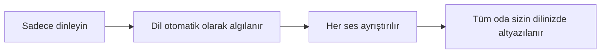
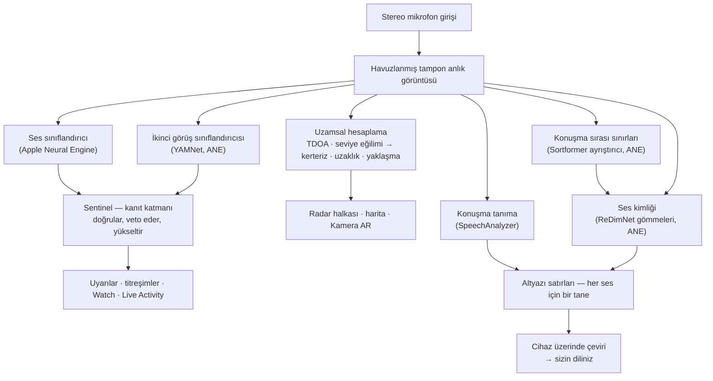
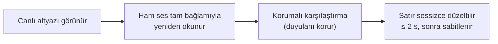
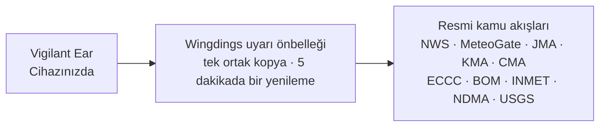

# Vigilant Ear 👂🛡️

*1.1.9 sürümünden itibaren geçerlidir · Eylül 2026.*

## Duyamayan insanlar için akustik bir radar.

Sağır, az duyan ve CODA topluluğu için özel olarak geliştirilmiş bir uygulama. Ses tanıma uygulamalarının çoğu size bir sesin *ne* olduğunu söyler. **Vigilant Ear ise sesin nerede olduğunu, onu kimin çıkardığını ve ne dediğini söyler** — iPhone'u, çevrenizdeki sesi betimleyen gerçek zamanlı bir ses trikorderine dönüştürür.

Bir sirenin yönü ve uzaklığı. Arkanızdan gelen bir kapı vuruşu. Bir sohbetteki kişiler, yazıya dökülmüş ayrı sesler olarak çizilir — her biri altyazılı ve yönüne göre yerleştirilmiş. Biri okumadığınız bir dilde konuşuyorsa sözleri size **kendi dilinize çevrilmiş olarak ulaşabilir.** Uyarılar **Kilit Ekranı'nıza, Dynamic Island'a ve Apple Watch'unuza** gelir; bir bakış yeterlidir.

Önemli olan her şey cihazın üzerinde çalışır. Ses, tanıma için kaydedilmez ya da yüklenmez. Hiçbir şey, sizin bir şey duymanıza bağlı değildir.

- 🧭 **Yalnızca algılama değil, yön.** *Ne, nerede, kim* ve *ne söylendi* — sadece “bir ses oldu” değil.
- 📣 **İsim Çağrıldı.** Kendi adınızı, çocuğunuzun ya da eşinizin adını listeye ekleyin — “Marie için sipariş hazır” denince saatiniz dokunuşla uyarır ve yönü gösterir.
- 🔒 **Tasarımın özünde gizlilik.** Sınıflandırma, altyazılama ve çeviri iPhone'unuzda çalışır. Altyazılar canlı ve geçicidir; yazılı döküm arşivi olarak saklanmaz.
- ⌚ **Bileğinizde ve Kilit Ekranı'nda.** Apple Watch yön eşlikçisi + Live Activity, son uyarıyı ve hangi yönden geldiğini bir bakış uzağınızda tutar.
- 🛰️ **Daha çok telefon, tek bir ortak kulak.** Constellation, Ultra-Wideband özellikli iPhone'ları birbirine bağlar ve her birinin duyduğunu daha keskin bir yön tablosunda birleştirir.
- 👁️ **Sağır / az duyan / CODA kullanıcılar için yapıldı.** Ayırt edilebilir titreşimler, yüksek kontrastlı görseller, renkten bağımsız ipuçları, büyük dokunma alanları ve baştan sona Hareketi Azalt ayarına uyum.

---

## Kimler için

- Sese dair durumsal farkındalık isteyen **sağır, az duyan ve CODA kullanıcılar** — açık bırakıp güvenebileceğiniz Ev Nöbeti (kapı vuruşu, alarm, bebek, telefon) ve Sokak Nöbeti (siren, yaklaşma).
- **Yön bilgisi ve konuşmacı ayrımı içeren canlı altyazılara** ya da yakında oturan kişilerin **cihaz üzerinde çevirisine** ihtiyaç duyan herkes.
- Cihaz üzerinde ses konumlandırmayla ilgilenen erişilebilirlik ve akustik araştırma kullanıcıları.

> Vigilant Ear bir erişilebilirlik **yardımcısıdır**; sertifikalı bir can güvenliği cihazı değildir.

---

## Neler yapar

### 🧭 Sesi görür — yön ve uzaklık
Vigilant Ear, iPhone'un iki mikrofonunu kullanarak **bir sesin açısını ve önünüzde mi yoksa arkanızda mı olduğunu** ölçer, bu okumayı yaklaşık bir derece içinde sabit tutar ve onu, baktığınız yönü yukarıda tutan bir radar halkasında ve haritada canlı bir işaret olarak yerleştirir. Aynı hat üzerindeki iki mikrofon sağı soldan tek başına ayıramaz — 50° sağınızdaki bir sesle 50° solunuzdaki bir ses aynı küçücük zaman farkıyla ulaşır — bu yüzden uygulama okumanın yanında **diğer tarafta daha soluk bir hayalet** de çizer; bileğinizi çevirmeniz ya da ikinci bir telefon bu belirsizliği giderir. Uzaklık, sokakta kalibre edilmiş bir eğriye göre ses yüksekliğinden tahmin edilir ve olduğu gibi, bir tahmin olarak gösterilir: *≈ 50 ft*, olası bir aralıkla birlikte — uygulamayı okuduğunuz dilin değil, bulunduğunuz ülkenin birimleriyle. Siz hareket ettiğinizde işaretler gerçek dünyadaki konumlarını korur. İşin özü budur: duyamadığınız bir dünyaya dair mekânsal farkındalık. (Rakamlar aşağıda.)

### 🚨 Önemli sesleri tanır — ve sizi uyarır
Cihaz üzerinde çalışan bir sınıflandırıcı yüzlerce gündelik sesi tanır ve kritik kategorileri izler — **sirenler, alarmlar — araba alarmlarına ayrılmış özel bir sınıf dahil — kapı zilleri/kapı vuruşları, bebek ağlaması, yakındaki bir kişi ve şiddetli hava.** Bunlardan biri tetiklendiğinde net bir ekran uyarısı, isteğe bağlı bir **anlık bildirim** ve ayırt edilebilir bir **titreşim** alırsınız — uygulama arka plandayken ya da telefon uyku modundayken bile. Kritik kategoriler varsayılan olarak hazır gelir; böylece bildirimleri etkinleştirmek “her şey kapalı” anlamına gelmez. Tüm uyarı kategorilerini kapatırsanız motor, pil tasarrufu için arka plandayken tamamen uykuya geçer. Bir **Sentinel** katmanı uyarıları bağımsız kanıtlarla — yön, hareket ve kamuya açık akışlar — çapraz denetler; böylece tetiklenen şey tek bir sınıflandırıcının tahmini değil, doğrulanmış bir uyarıdır. Bu iki yönlü işler: bir şarkının içindeki siren benzeri bir an bekletilir, ama müziğinizin arasından tekrar tekrar duyulan gerçek bir siren araya girer ve uyarı verir.

Şiddetli hava uyarıları resmi kamu akışlarından gelir — ABD **NWS**, Avrupa **MeteoGate**, **Çin CMA**, **Kore KMA**, **Japonya JMA**, **Kanada ECCC**, **Avustralya BOM**, **Brezilya INMET** ve **Hindistan NDMA** — ve tüm kullanıcılar için ücretsizdir. Akışlar, bulunduğunuz yeri kapsayanlarla sınırlandırılır. Japonya'da uygulama JMA'nın **ön bültenlerini** de okur — yalnızca tehlike geldiğinde yayımlanan uyarıları değil, bir tayfundan ya da şiddetli yağmurdan günler önce yayımlanan sade dilli duyuruları — ayrıca ani sağanak ve heyelan bültenlerini. Ön duyurular, gerçek bir uyarıya ayrılmış ses ve titreşim olmadan sessizce gösterilir.

### ⌚ Apple Watch + Live Activity — bir bakışta bilin
- **Apple Watch eşlikçisi** — bir uyarının yönü bileğinizde gösterilir; tek bir bakış nereye bakmanız gerektiğini söyler. Uygulamanın kulak simgesi, tehdit HUD düzeni ve bir uyarıyı çift dokunarak kapatma özelliğiyle yeniden tasarlanmış Watch arayüzü. Watch uygulaması açık değilken de uyarılar yön okunu gösterebilir.
- **Live Activity** — Vigilant Ear **Kilit Ekranı'nızda**, **Dynamic Island'da** ve **Watch Smart Stack'te** kalır; böylece son uyarı ve kerterizi her zaman bir bakış uzağınızdadır.
- **Bileğinizde eş uyarıları** — bağlı bir Constellation eşinin telefonu bir uyarı verdiğinde bu uyarı, yön bilgisi de dahil, Watch'unuza da ulaşabilir. Güvenilirlik odaklı bir iyileştirme, Watch eşlikçisinin gün boyu pili az tüketmesini sağlar.

### 💬 Konuşmacı Modu — canlı, yönlü altyazılar *(ücretsiz)*
**Konuşmacı Modu**'nu açın; Vigilant Ear yakınınızda konuşan kişilerin sözlerini **her ses için bir tane olmak üzere altyazı bloklarına** döker. Cihaz üzerinde çalışan konuşmacı ayrıştırma, sesleri birbirinden ayrı tutar — *kim* *ne* söylüyor — ve iç halkada bir yön ipucu gösterir. O anda konuşan kişi vurgulanır; yer gerektikçe eski metin kayıp gider.

Çoğu altyazı uygulamasının yapmadığı iki şey: **güven konusunda dürüstlük** — her satırdaki ince bir kalite işareti ve şüpheli sözcüklerin altındaki noktalı çizgiler, bir satıra ne zaman güvenebileceğinizi ve ne zaman iki kez kontrol etmeniz gerektiğini söyler — ve **kendi kendini düzeltme**: bir cümle ekrana düştükten hemen sonra uygulama sesi tam bağlamıyla yeniden okur ve kaçırılmış ya da yanlış duyulmuş bir sözcüğü bir iki saniye içinde geri getirebilir; ardından metin sabitlenir.

**İsim Çağrıldı** (Tercihler; siz açana kadar kapalıdır) bu altyazılarda listelediğiniz isimleri izler — sizinkini, çocuğunuzunkini, eşinizinkini. Biri “Marie için sipariş hazır” dediğinde yeni bir altyazı balonu yerine ayırt edilebilir bir titreşim ve yön bilgisi içeren bir Watch uyarısı alırsınız. Sözcükler Konuşmacı Modu'nda yine konuşma olarak görünür; bu dokunuş, konuşmanın *size* yöneltildiğini haber verir.

**Küfürler gizlenebilir** (Tercihler → Altyazılar). Aksi hâlde küfürler, yumuşatacak hiçbir şey olmadan yalın metin olarak gelir ve okuyan kişinin önceden bakışını kaçırma şansı olmaz; bu ayarı açtığınızda o sözcükler simgelerle değiştirilir, böylece cümle o sözcük olmadan da okunur. Neyin küfür sayılacağına bizim bir sözcük listemiz değil, cihazınızın kendi konuşma tanıyıcısı karar verir; bu yüzden yazıya dökülen dili takip eder. 18 yaşından küçük olarak beyan edilmiş bir hesapta her zaman açıktır ve bir kilit gösterir. *Bu* cihazın yazıya döktüğü konuşmaya uygulanır; eşleştirilmiş bir telefondan aktarılan metin orada yazıya dökülmüştür ve hazır metin olarak gelir.

**Konuşanın üstüne bastığı sözcük kalın yazılır.** Sesli söylendiğinde "BUNU söylemedim" ile "bunu söylemedim" iki farklı cümledir ve birebir aynı bir döküm bu farkı tamamen kaybeder. Uygulama, konuşanın sesinin perdesini yükselttiği tek sözcüğü arar ve onu kalın yazar — satır başına en fazla bir tane, emin olmadığında ise hiç; çünkü yanlış sözcüğü işaretlemek, birine söylemediği bir şeyi söyletmek olur. Çince ve Japoncada kapalıdır; bu dillerde perde, sözcüğün ne kadar vurgulandığını değil, *hangi sözcük olduğunu* belirler.

Altyazılar ücretsizdir; otomatik çeviri, isteğe bağlı Power Pack+ katmanıdır. Altyazılar ayrıca **Bluetooth işitme cihazlarınıza sesli olarak okunabilir** — ücretsiz, Tercihler'de. **Yön Tonları** (bu da ücretsiz; Tercihler → Altyazılar altında) seçtiğiniz kulakta, konuşan kişinin nerede olduğunu bildiren isteğe bağlı bir sesli ipucu ekler — işitme cihazı kullanırken ya da tek kulakla duyarken yararlıdır ve herkes kullanabilir.

### 🌐 Otomatik çeviri — sizin diliniz, canlı *(Power Pack+)*
Konuşmacı Modu açıkken yakınınızdaki biri başka bir dil konuştuğunda Vigilant Ear bunu algılayabilir ve o kişinin altyazılarını **sizin dilinizde** gösterebilir; kaynak dil de o kişinin bloğunda belirtilir. Zincir — duy → konuşmacıları ayır → yazıya dök → çevir → göster — **cihazın üzerinde** çalışır; ağa çıkılan tek an, Apple'dan yapılan tek seferlik dil paketi indirmesidir ve beklediğiniz şey bu indirmeyse uygulama sizi çevrilmemiş metne bakar hâlde bırakmak yerine bunu size söyler. Diğer dili önceden bilmeniz ya da seçmeniz gerekmez.

Bu, **bilim kurgudaki evrensel çevirmene** şu an piyasada bulunan en yakın şeydir — her şeyi kendiliğinden anlayan o cihaz. Vigilant Ear dili kendi başına algılar, odadaki her konuşmacıyı takip eder ve hepsini sizin dilinizde altyazılar — kulaklık yok, kurulum yok, her şey cihazınızda.

### 🎵 Müzik ve yayın farkındalığı *(Power Pack+)*
**ShazamKit** çevrenizde çalan müziği tanır ve şarkı değişikliklerini takip eder.

### 🎛️ Akustik Kapsam — sesi bir mühendis gibi görün
Çevrenizdeki sesin profesyonel, canlı bir görünümü: spektrum, spektrogram, ⅓ oktav RTA bantları, kroma ve harmonik kısmi bileşenler — **herkes için ücretsiz**. **Kısmi Bileşenler müziği okur:** her ton notasıyla adlandırılır ve yanında harmonik serisi gösterilir; duman alarmları gibi daha tiz sesler gerçek perdeleriyle adlandırılır ve şarkı söylerken ya da akort yaparken referans alacağınız, çizgi olarak çizilen bir hedef nota belirleyebilirsiniz. Cihazı ısıtmadan çalışır — Spektrogram'ı açık bırakmanın, ne kadar uzun izlerseniz izleyin, neredeyse hiçbir maliyeti yoktur. Kendi özel paketlerinizi eğitmek için ses yakalayan araçlar Power Pack+'ın bir parçasıdır.

### 📦 Özel Ses Paketleri — ona kendi dünyanızı öğretin *(Power Pack+)*
Vigilant Ear'a sizin için önemli olan sesleri öğretin — bölgenizdeki kuşlardan binanızın kapı ziline kadar. Eklenti paketler yerleşik algılamanın üzerine eklenir; böylece yeni sesler sirenleri ve alarmları asla geri plana itmez. Adım adım bir kılavuz uygulamanın içinde yer alır.

### 🛰️ Constellation — birçok iPhone, tek bir ortak kulak *(Power Pack+)*
İki ya da daha fazla Ultra-Wideband özellikli iPhone ile (iPhone 11'den bu yana çoğu model), **Constellation** bu telefonları eşleştirir; böylece telefonlar birbirlerinin konumunu algılar ve her birinin duyduğunu, bir sesin nereden geldiğine dair tek ve daha kesin bir tabloda birleştirir — dağıtık, pasif bir dinleme dizisi. Altyazılar da birleştirilir: her telefon kendi mikrofonunun duyduğunu yazıya döker ve sözcükler telefonlar arasında hizalanır; böylece konuşmacıya en yakın telefon duyduğunu katkı olarak ekler — yalnızca tek bir telefonun yakaladığı sözcükler kaybolmak yerine korunur. Telefonlar **doğrudan birbirine** bağlanır — yönlendirici yok, ortak Wi-Fi ağı yok, internet yok; yalnızca Wi-Fi'ın açık olması yeterlidir ve bağlantı, AirDrop'un kullandığı eşler arası bağlantının aynısı üzerinden kurulur. Yalnızca uygun donanıma sahip cihazlarda kullanılabilir. Bir eşin bağlandığı andan daha eski ağ altyazıları yeniden iletilmez.

**Eş mesajları** — bağlı bir eşin telefonuna kısa bir metin gönderin; mesaj onun altyazı akışına düşer ve cihaz üzerinde onun diline çevrilmiş olarak ulaşabilir. Mesajlaşma yaşa duyarlıdır: Apple'ın Declared Age Range özelliği üzerine kuruludur ve bir yetişkin ile reşit olmayan biri arasındaki mesajlaşma, iki kişi de birbirini bilinçli olarak adlandırmadıkça kapalı kalır. Uyarılar ve altyazılar hiçbir zaman kısıtlanmaz — yalnızca kişiden kişiye mesajlaşma kısıtlanır.

### 🔗 Remote Link — yanınızda olmayan birine ulaşın *(başlatmak için Power Pack+)*
Normalde bir telefon aramasının gördüğü işi, video ve metinle görür. Bir davet kodu gönderirsiniz; karşınızdaki kişi **Power Pack+'a sahip olmadan** Vigilant Ear'ın içinden katılır. Constellation'ın aksine yakınlık şartı yoktur — ikiniz de herhangi bir yerde olabilirsiniz.

**Hiçbir aşamada ses kullanılmaz.** Yalnızca video ve metin; bu yüzden bağlantıyla ilgili hiçbir şey iki uçta da duymaya bağlı değildir — ve size uygulama üzerinden biriyle işaret diliyle iletişim kurmanın bir yolunu sunar. Uygulamanın kendisi işaret dilini anlamaz; videoyu taşır, gerisini ikiniz yaparsınız. Ağın izin verdiği her durumda bağlantı iki telefon arasında doğrudan kurulur ve uygulama bağlantının **Doğrudan** mı yoksa **Aktarılmış** mı olduğunu açıkça gösterir; böylece videonuzun bir aktarıcıdan geçip geçmediğini her zaman bilirsiniz.

**Altyazılar da iletilir.** Her telefonun yazıya döktüğü metin diğerinde görünür; gerektiğinde okuyanın diline çevrilir. İkinizden biri bağlantıyı — video ve altyazılarla birlikte — duraklatıp sürdürebilir ve ana ekrandan kapatabilir.

### 📷 Kamera AR — “sesi görün”
Başlık çubuğundaki kamera düğmesini açın ve algılanan sesleri canlı kamera görünümünde gerçek kerterizlerine sabitleyin. Görünüm okunaklı kalsın diye işaretler konuşmacıya ya da ses kategorisine ve yöne göre kümelenir; kaynaklar sessizleştiğinde zamanla solar.

### 🗺️ Haritalar, yollar ve güzergâh tahmini
Ses kerterizleri haritada gerçek GPS koordinatlarına yansıtılır. Araç sesleri **yakındaki sokaklara oturtulabilir** ve güzergâhları tahmin edilebilir; böylece geçen bir kamyon binaların içinden değil, *yol boyunca* ilerliyor görünür. (İtfaiye aracı demosunu deneyin.)

### 🪄 Özellik Deneme Alanı — duymadan kanıtlayın
**Özellik Deneme Alanı** herkese açıktır: Ev ve Sokak alıştırmaları (kapı vuruşu, alarm, bebek, siren, hava durumu), çok telefonlu ve sohbet demoları ve alıştırmanın asla gerçek bir olay gibi görünmemesi için belirgin bir filigran. Paneli kapatmak demoları temiz bir şekilde kaldırır (takılı kalan GPS taklidi yok, geride kalan durum bayrağı yok).

### ♿ Önce erişilebilirlik
Sağır / az duyan / CODA ve renk körü kullanıcılar için tasarlandı: **renkten bağımsız** ipuçları, **≥44 pt** dokunma alanları, **Hareketi Azalt** ayarına uyum, Arapça okuyanlar için **sağdan sola düzenler**, çok kipli uyarılar (titreşim + görsel + Watch) ve izin durumunu net yeşil / gri / kırmızı (ve yanık turuncu “izin verilmedi”) durumlarla gösteren bir açılış doğrulama ekranı — ana uyarı anahtarı işlevi gören bildirim izni dahil.

---

## Ücretsiz ve Power Pack+

Güvenlik çekirdeği **sonsuza dek ücretsizdir**:

- **Ev Nöbeti ve Sokak Nöbeti** — ekranda, titreşimle ve isteğe bağlı anlık bildirimle iletilen yerel ses uyarıları (alarmlar, sirenler, kapı vuruşları/zilleri, bebek, yakındaki kişi).
- **Canlı altyazılar** — Konuşmacı Modu; cihaz üzerinde, donanımın izin verdiği yerde yönlü; dürüst güven işaretleri, ~2 saniyelik kendi kendini düzeltme, Bluetooth işitme cihazlarına isteğe bağlı sesli çıkış ve Yön Tonları ile.
- **İsim Çağrıldı** — yazdığınız isteğe bağlı isimler (sizinki, çocuklarınızınki, eşinizinki). Bir eşleşme ikinci bir altyazı değil, kerteriz bilgisi içeren bir Watch/telefon uyarısıdır.
- **Sürekli Nöbet** — odanın kendi durumu; her zaman açık, ayarlanacak hiçbir şey yok: oda alışılmış düzenini korudukça sabit bir camgöbeği lamba, bir şey değiştiğinde kehribar — yeni bir ses, ani bir sessizlik ya da yaklaşan bir şey.
- **Şiddetli hava uyarıları** — bölgeniz için NWS, MeteoGate (Avrupa — 5 dakikalık uyarı önbelleğimizden taze olarak sunulur), CMA, KMA, JMA (Japonya), ECCC (Kanada), BOM (Avustralya), INMET (Brezilya) ve NDMA (Hindistan).
- **Deprem uyarıları (USGS, dünya çapında)** — yakınınızda bir deprem bildirildiğinde bir titreşim hissedin ve sarsıntının hissedildiği alanı haritanızda görün. Resmi USGS akışından gelen bir doğrulamadır — erken uyarı değildir: sarsıntı hissettiyseniz bunun ne olduğunu size söyler. Cihaz üzerindeki derin gürültü (infrases) algılaması, yer hareket ettiği anda bu kontrolü devreye alabilir.
- **Özellik Deneme Alanı** — belirgin bir ÖNİZLEME filigranıyla alıştırma uyarıları ve özellik önizlemeleri.
- **Apple Watch eşlikçisi ve Live Activity** — bir bakışta yön ve son uyarı.
- **Akustik Kapsam** — profesyonel düzeyde canlı ses görselleştirme, herkes için ücretsiz. (Eğitim için ses yakalama araçları Power Pack+ kapsamındadır.)

**Power Pack+** tek seferlik bir kilit açmadır (**abonelik değildir**) ve **90 günlük ücretsiz deneme** sunar. Şu süper güçleri ekler:

- **Otomatik çeviri** — yakındaki konuşmaların cihaz üzerinde sizin dilinize çevrilmesi.
- **Constellation** — Ultra-Wideband üzerinden birden çok iPhone ile ortak işitme ve eş mesajları.
- **Müzik Tanıma** — ShazamKit ile şarkı tanıma.
- **Özel Ses Paketleri** — kendi sesleriniz için eğittiğiniz eklenti sınıflandırıcılar.

İster ücretsiz ister Power Pack+ kullanın, **sesiniz tanıma için cihazda kalır** — katman yalnızca hangi özelliklerin kilidinin açık olduğunu değiştirir; ham sesin analiz için nereye gönderildiğini asla değiştirmez.

---

## Nasıl çalışır (perde arkası)

Vigilant Ear, katmanlar hâlinde kurulmuş, **yerel öncelikli, cihaz üzerinde** çalışan bir işlem hattıdır: sesi bir kez yakala, ardından bağımsız uzmanlar aynı sesi okusun ve birbirinin işini denetlesin. Ham ses yüksek öncelikli bir ses girişinden yakalanır, **havuzlanmış bir tampon serbest listesine** kopyalanır (gerçek zamanlı yolda bellek ayırma çalkantısı yok) ve arayüzü durdurmadan dağıtılır:

Hiçbir modele tek başına güvenilmez. **Sentinel** katmanı algılama ile uyarı arasında durur: bağımsız motorlar kare kare birbirini doğrular ya da veto eder — ve tekrarlanan gerçek dünya kanıtları bir vetoya karşı birikince (müziğinizin arasından uluyan gerçek bir siren), kanıt kazanır ve uyarı verilir.

Altyazıların da kendi ikinci şansı vardır. Kesinleşen her cümle, bellekteki kısa bir ses halkasından tam bağlamıyla sessizce yeniden okunur — düzeltmeler yaklaşık iki saniye içinde yerine oturur, ardından metin kalıcı olarak sabitlenir:

- **Uzamsal hesaplama** — FFT'ler, koherans ağırlıklı Varış Zamanı Farkı (TDOA — iki mikrofonun da uzlaştığı frekans bantlarını öne çıkar, ardından küçücük varış gecikmesini bir kerterize dönüştür) ve arka plan görevlerinde seviye eğilimine dayalı yaklaşma takibi. Mikrofon çifti sabit bir yönelimde okunur; böylece telefonu dik de tutsanız yan da tutsanız yön aynı şekilde çalışır.
- **Konuşma** — yazıya dökme için iOS 26 `SpeechAnalyzer` / `SpeechTranscriber`; cihaz üzerinde çeviri için Apple'ın **Translation** çerçevesi. Ses kimliği kanıta dayanır: bir ses, yalnızca birbirinden bağımsız ses pencerelerine dayanılarak gerçek bir kişi olarak doğrulanır ve belirsiz bir eşleşme, yanlış ismi tahmin etmek yerine kimseye atfedilmeden gösterilir.
- **İki soru için iki model** — sesleri birbirinden ayırmak hem *konuşmacının ne zaman değiştiğini* hem de *o konuşmacının kim olduğunu* bilmeyi gerektirir ve bunlar aynı sorun değildir. Akış hâlinde çalışan bir **Sortformer** konuşmacı ayrıştırıcısı konuşma sırası sınırlarını işaretler; **ReDimNet** gömmeleri her birinin içinde kimin sesi olduğuna karar verir. Sınırdan kesmek kulağa geldiğinden daha önemlidir: iki kişiye yayılan bir pencere ikisini birden içerir ve hiçbir gömme modeli bunu sonradan geri alamaz. İkisinin de altında bir ses etkinliği tabanı bulunur — ayrıştırıcı zorlu bir odada tahmin yürütmek yerine susarsa konuşma sıraları yine kesilir; böylece uygulama iki konuşmacıyı tek bir kişide birleştirmek yerine performansından ödün verir.
- **Müziğin gerçeği** — "gerçekten müzik çalıyor mu?" kararı bir kroma **şarkı imzası algılayıcısına** aittir, çünkü genel sınıflandırıcıların sessiz odalara ve sirenlere "müzik" demesi meşhurdur. Shazam ancak imza, ortada gerçekten müzikal bir şey olduğunu onayladığında çalışır.
- **Eşzamanlılık** — Swift 6 yalıtımı; mikrofon girişini, akustik hesaplamayı ve arayüz çizim döngüsünü birbirinden temiz biçimde ayrı tutar.
- **Verimlilik** — alt örnekleme, yüke göre uyarlanan sınıflandırma ve kanıta bağlı ağ kullanımı, sürekli dinlemeyi açık bırakılabilecek kadar hafif tutar.

Hava durumu ve deprem uyarıları sesin tam tersi bir yol izler — sesinize dair hiçbir şey dışarı çıkmaz, ama uyarı *verileri* içeri gelir. **Her** resmi akış, işlettiğimiz küçük bir önbellekten geçer; böylece kamuya açık verinin tek bir kez çekilmesi tüm kullanıcılara hizmet eder — ve telefonunuz hiçbir zaman yabancı bir hükümetin sunucularıyla iletişim kurmaz:

---

## Telefonunuzun duyabildikleri — ölçümlerle

iPhone'unuzda aralarında yaklaşık altı inç bulunan iki mikrofon, bir barometre ve çok iyi bir saat vardır. Bu, bir sesin hangi yönde olduğunu, kabaca ne kadar uzakta olduğunu, size doğru gelip gelmediğini ve bir kapının az önce açılıp açılmadığını söylemeye yeter. Aşağıda bunların her birinin ne kadar doğru olduğu, bunu nasıl kontrol ettiğimiz ve sesi kendiniz duyamıyorsanız neden önemli olduğu yer alıyor. Yön ve ilgili rakamlar Eylül 2026'da bir iPhone 17 ve bir iPhone 16 Pro Max üzerinde ölçüldü. Uzaklık doğası gereği bir tahmin olarak kalır — bunu ekranda da söylüyoruz.

**Yön — birkaç derecelik hassasiyetle.** Bir ses üst mikrofona alttakinden önce ya da sonra ulaşır; uygulama bu farktan sesin telefonun ekseninden ne kadar saptığını ve önde mi arkada mı olduğunu hesaplar. Telefonun iki kanalı düz mikrofonlar değil, işlenmiş bir stereo görüntüdür ve bu görüntü, oda gürültülü olduğunda kendine ait sabit bir desen ekler. Uygulama artık bu deseni açılıştan sonraki birkaç sessiz saniyeden öğreniyor ve yönü okumadan önce onu çıkarıyor.

| Ne ölçtük | Sonuç |
|---|---|
| Sessiz ofisten 5 dB SNR koşulundaki sert duvarlı odaya kadar 96 simüle odada medyan hata | 1,0° |
| Masada iPhone 17, oda gürültüsü açık, hoparlör eksenden 30° açıda | beklenen 60°'ye karşılık yan düzlemden 61,7° okudu, salınım 1,6° |
| Aynı düzen, hoparlör telefonun tam yan tarafında | beklenen 0°'ye karşılık 4,5° okudu, salınım 2,2° |
| Aynı düzen, hoparlör tam önde | olması gerektiği gibi, her okuma azami gecikmede |
| Ses yerine görüntünün kendi desenine oturan okumalar | hiçbir açıda yok |

*Neden önemli:* bir sireni duyamıyorsanız "arkanızda, bir yanda" bilgisi size nereye bakacağınızı söyler. Sabit duran bir okuma, ancak bir şerit metreyle karşılaştırılıp kontrol edildikten sonra güvenilmeye değer; bu okuma kontrol edildi, hem de iki kez — ikincisi, ilk kontrolün fazla iyimser olduğu ortaya çıktıktan sonra.

**Uzaklık — olduğu gibi, bir tahmin olarak gösterilir.** Tek bir mikrofon uzaklığı ölçemez, yalnızca ses yüksekliğini ölçebilir; uzaktaki gürültülü bir kamyon, yakındaki sessiz bir araba gibi duyulabilir. Uygulama uzaklığı, gerçek bir sokakta ölçülerek oluşturulmuş bir eğri kullanarak ses yüksekliğinden tahmin eder, ardından bunu dikkatli bir insanın söyleyeceği gibi söyler: *yaklaşık 50 ft, büyük olasılıkla 25 ile 100 arasında.*

| Ne ölçtük | Sonuç |
|---|---|
| Kalibrasyondan geçirilerek yeniden oynatılan gerçek araba algılamaları | 1.131 |
| Gerçekte üzerinde bulundukları 100 fitlik yolun içine düşenler | %73 |
| Uzak şeritteki arabalar | şerit metrenin 73 ve 85 ft gösterdiği yerde 78 ve 87 ft tahmin edildi |

Yol (bir şehir kavşağı) şerit şerit ölçüldü; eğri yanıldığında, sesi olduğundan yakın gösterecek yönde yanılır. Kalibrasyon, fark edilmeden kaymasın diye otomatik bir testle kilitlenmiştir. Duman dedektörü gibi kendi alanınızdaki alarmlara hiç uzaklık değeri verilmez — zaten sizinle aynı odadadırlar.

**Hareket — size doğru geliyor.** Arabalar ve sirenler için sesin yükselmesi genellikle yaklaşmak anlamına gelir. Uygulama bir sesin seviyesinin birkaç saniye içinde ne kadar hızlı yükseldiğini izler: saniyede yaklaşık 1,5 dB'lik sürekli bir tırmanış (ses yüksekliğinde net ve istikrarlı bir artış) yaklaşma, buna denk bir düşüş uzaklaşma anlamına gelir; değişmeyi bırakan bir ses ise yaklaşık dört saniye sonra artık ne yaklaşıyor ne de uzaklaşıyor olarak gösterilir. Tek bir yüksek an — kısa bir korna, bir kapı çarpması — bunu tetikleyemez. Fizik ve dokuz otomatik test üzerine kuruludur; bir sonraki saha doğrulaması kaydedilmiş bir sokak geçişi olacak.

**Odadaki hava — bir kapının imzası vardır.** Barometre, yaklaşık on dört fit uzaklıkta açılan bir kapıyı fark edebilir: kapı açılırken basınç düşer, kapanırken yeniden yükselir. On dört saatlik sessizlik ve on beş kapı olayı boyunca her kapı bu iki parçalı şekli oluşturdu; evdeki başka hiçbir şey oluşturmadı.

| Olay | Basınç değişim hızı | Şekil |
|---|---|---|
| Ön kapı, açılıp kapandı, ×10 | 0,6–1,8 Pa/s | düşüş, ardından toparlanma, ~5 s arayla |
| Ön kapı, çarpıldı, ×5 | 1,1–2,5 Pa/s | aynı çift, daha yüksek |
| Gece boyunca açılıp kapanan klima, ×8 | 0,11–0,46 Pa/s | dakikalara yayılan yavaş bir eğim, iki telefonda da aynı |
| Sessiz bir oda | ~0,02 Pa/s | hiçbir şey |
| Yanından yürüyerek geçmek, hapşırmak | — | hareket sensörü bunu fark eder ve telefon yok sayar |

Odayı hava geçirmeyecek şekilde kapatmayan sineklikli bir kapı hiç görünmedi — tam da olması gerektiği gibi. Bugün bir basınç değişimi haritada derin gürültüler olarak görünebilir; sessiz geceler için özel bir kapı uyarısı ölçüldü ve tasarlandı, ancak henüz gündelik varsayılan değil.

**Constellation — iki telefon tarafı belirler.** Ağdaki her telefon bulunduğu yerden sese doğru bir çizgi çizer ve çizgiler yalnızca bir tarafta temiz biçimde kesişir. Kesiştiklerinde hayalet kaybolur ve uygulama yeniden sol ya da sağ diyebilir. Simülasyonda, **aralarında 40 metre bulunan** iki telefon, 50 metre uzaklıktaki bir sirenin yerini yaklaşık 2 metre içinde belirler.

**Buradaki her iddia nasıl güven kazanır.** Her rakam sırasıyla aynı üç kapıdan geçti: cevabı önceden bilinen simüle bir oda; uygulamayı yanıltacak durumu birebir yeniden kuran ve her değişiklikte çalışan küçük otomatik testler; son olarak gerçek bir masada, uzaklıkları elle ölçülmüş gerçek telefonlar. Üçüncüsünden sağ çıkmayan hiçbir şey doğru sayılmaz. Sesi duyamayan biri için uygulamanın sözü tek sözdür — bu sözün güvenilirliği, bir laboratuvarın kazandığı gibi kazanılmalıdır.

Mühendisler için daha ayrıntılı notlar: [Fizik](https://vigilantear.com/en/physics/) — TDOA, uzaklık, hareket, Constellation ve barometrik algılama; her rakam MEASURED / BENCHED / MODELLED olarak etiketlenmiştir.

---

## Gizlilik

- **Temel işlem hattı her zaman cihaz üzerinde.** Sınıflandırma, uzamsal hesaplama, yazıya dökme, konuşmacı ayrıştırma ve çeviri iPhone'unuzda çalışır. Ham ses, tanıma için kaydedilmez ya da yüklenmez.
- **Altyazılar geçicidir.** Canlı altyazılar oturum boyunca bellekte kalır; dışa aktarılan hata ayıklama günlükleri altyazı metni içermez.
- **Reklam ya da davranışsal analitik SDK'sı yok.** Sınırlı ağ kullanımı yalnızca haritalar, kamuya açık hava durumu akışları, isteğe bağlı Shazam parmak izleri, yol bağlamı ve App Store satın alımları içindir — politikanın tamamına bakın.

Tüm ayrıntılar: [Gizlilik Politikası](/tr/privacy/) · [Hizmet Şartları](/tr/terms/) · [Destek](/tr/support/)

---

## Donanım ve platformlar

- **iPhone (tam deneyim).** Dikey ya da yatay konumda çalışır — istediğiniz gibi tutun. Yön bulma için stereo mikrofonlar gereklidir. Önerilen: **iPhone 13 veya daha yenisi**.
- **Apple Watch.** Yön oklu eşlikçi uyarılar; Live Activity / Smart Stack ile çalışır.
- **iPad (yerel uygulama).** Uyarlanabilir düzen: büyük ekranda canlı altyazılar, haritanın yanında, kimse konuşmadığında kenara çekilen yarı saydam bir panelde yer alır. Tek kanallı mikrofonlar → tam yön bilgisi olmadan altyazılar.
- **Constellation** için **Ultra-Wideband** gerekir — iPhone 11 veya sonrası; SE ve “e” modelleri hariç. Bir Wi-Fi ağı **gerektirmez**: Wi-Fi açık olduğunda telefonlar birbirini doğrudan bulur; böylece telefonlar birbirine yakın olduğu sürece Constellation yönlendirici ve internet olmadan çalışır.
- **Android.** Temel radar, uyarılar, altyazılar ve hava durumunu içeren ayrı bir sürüm; Constellation ağı öncelikle iOS'ta. Android'deki özellik eşitliği arttıkça ürün sitesindeki güncellemelere göz atın.

---

## Yerelleştirme

Arayüz, uyarılar ve altyazılar dahil tamamen şu dillere yerelleştirilmiştir: **İngilizce, İspanyolca, Portekizce (Brezilya), Fransızca, Almanca, İtalyanca, Türkçe, Arapça, Japonca, Basitleştirilmiş Çince, Geleneksel Çince, Korece, Rusça, Hintçe ve Rumence** (15 dil). Sistemin dil ayarını ya da uygulamada elle yapılan bir seçimi izler. Rumence altyazılar cihaz üzerinde çalışır; Apple Translate'te Rumence bulunmadığından Otomatik çeviri bu dil için orijinal metni gösterir.

---

## Durum ve sorumluluk reddi

Vigilant Ear **deneysel bir akustik erişilebilirlik yardımcısıdır**; sertifikalı bir can güvenliği aracı değildir. Konum belirleme çözünürlüğü; çevreye, hava koşullarına, rüzgâra ve mikrofon donanımına göre değişir. **Olağan çevresel farkındalığınızı her zaman koruyun** — güvenlik bilgisi için tek kaynağınız olarak ona güvenmeyin.

Bazı yetenekler (kamera AR işaretleri, Apple tarafından verildiğinde Kritik Uyarılar yetkisine yükseltme, gelişmiş çoklu paketli ses oluşturma) gelişmeye devam ediyor; ücretsiz Ev / Sokak Nöbeti ve canlı altyazılar, ilk günden güvenebileceğiniz üründür.

---

**İletişim:** [vigilantear@wingdingssocial.com](mailto:vigilantear@wingdingssocial.com)

Sağır/az duyan topluluğu ve akustik araştırma için ❤️ ile yapıldı.

    
  <strong>© 2026 Wingdings, Inc.</strong> 
  Tüm hakları saklıdır. 
  Patent başvurusu beklemede

