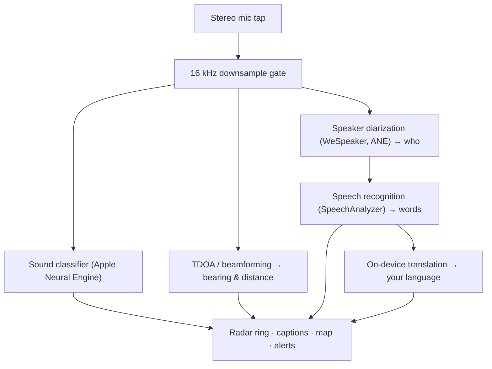

# Vigilant Ear 👂🛡️（Apple 版）

*专为听障人士打造的声学雷达。*

这款应用专为聋人及听力受损（D/HH）群体而生！大多数声音识别应用只告诉你*某个声音是什么*，而 **Vigilant Ear 会告诉你声音来自哪里、是谁发出的，以及他们在说什么** —— 将 iPhone 变成一台实时声学三维传感器，以可视化方式描述你周围的声音环境。

警报器的方向与距离。身后的敲门声。谈话中的每个人，被分别转录为独立的语音字幕块 —— 每个人配有字幕并按方位定位。如果有人用你不懂的语言说话，他们的话语将会**实时翻译成你的语言**呈现。

全程在设备上运行。无任何录音、缓存或数据传输。

---

## 适用人群

- **聋人及听力受损用户**，希望获得声音环境的全面感知 —— 不仅仅是"有声音发生"，而是*声音是什么、来自哪里、谁发出的*，以及*说了什么*。
- 任何需要**带方向感的实时字幕与说话人分离**，或需要**对身旁朋友的语言进行设备端翻译**的人。
- 对设备端声音定位感兴趣的无障碍研究者和技术爱好者。

> Vigilant Ear 是一款无障碍**辅助工具**，并非经认证的生命安全设备。

---

## 功能介绍

### 🧭 声音可视化 —— 方向与距离
利用 iPhone 的立体声麦克风，Vigilant Ear 估算周围声音的**方位角和大致距离**，并将其以实时光点的形式显示在朝上方向的雷达环和地图上。移动位置时，光点会保持其真实世界坐标。这是本应用的核心：对你无法听见的世界建立空间感知。

### 🚨 重要声音识别与警报
设备端分类器可识别 **300 余种日常声音**，并持续监测关键类别 —— **警报器、报警器、门铃/敲门声、附近人声，以及恶劣天气**。一旦触发，你将收到清晰的屏幕提醒和可选的**推送通知**，即使应用在后台运行或手机处于休眠状态亦然。关闭所有警报类别后，引擎在后台将完全休眠以节省电量。

恶劣天气警报来自官方公共数据源：美国 **NWS** 免费内置；欧洲 **MeteoGate** 网络和**中国 CMA** 属于高级版功能。数据源会自动筛选为实际覆盖你所在位置的部分。

### 💬 Speaker Mode —— 实时方向字幕 *（高级版）*
开启 **Speaker Mode** 后，Vigilant Ear 将附近说话者的语音转录为**字幕块，每人一块**。设备端说话人日志识别技术将不同声音区分开来，每个人拥有独立的字幕块和独特图标 —— 清晰呈现*谁*在说*什么* —— 内环上的小圆圈指向其在房间中的位置。当前说话者高亮显示；较旧文字随时间或随新内容需要空间时缓缓滚出。

### 🌐 Speaker Auto-Translate —— 用你的语言读懂你听不懂的语言 *（高级版）*
开启 Speaker Mode 后，当附近有人使用其他语言说话时，Vigilant Ear 会自动检测并将其字幕**实时渲染为你的语言**，并在其字幕块标题栏中显示"源语言"标识。整个流程 —— 听取 → 分离说话人 → 转录 → 翻译 → 显示 —— **全部在设备上完成**；唯一需要网络的时刻是从 Apple 一次性下载语言包。对于聋人来说，朋友说着另一种语言，他们也能**无需提前了解或选择该语言**，便能实时读懂对方的对话内容。

### 🎵 音乐与广播感知 *（高级版）*
**ShazamKit** 可识别你周围播放的音乐，并在检测到歌曲切换的签名时自动更新曲目信息。当一个声音看起来来自电视或收音机而非房间里的人时，会被标记为 **📻** 而非误认为在场人员 —— 文字依然显示，只是如实标注了来源。

### 🛰️ Constellation —— 多台 iPhone，共享听力 *（高级版）*
配备 Ultra-Wideband 的两台或以上 iPhone（大多数自 iPhone 11 起的机型），**Constellation** 模式可将它们配对，通过 Apple Nearby Interaction / UWB 感知彼此位置，并将各自听到的内容融合为一张更加精准的声音来源图像 —— 一种分布式、被动式**合成孔径声呐**。此功能仅限具备相应硬件的设备使用。

### 🗺️ 地图、道路与路径预测
声音方位被投影到真实 GPS 坐标上，并在地图视图中绘制出来。车辆声音会**吸附到附近道路**（通过开源道路数据源）并预测行进路径，使驶过的汽车显示为沿道路行驶，而非穿过建筑物漂移。（可通过消防车演示来体验此功能。）

---

## 免费版与高级版

安全核心功能**永久免费**：

- **本地声音警报** —— 报警器、警报器、门铃/敲门声和附近人声 —— 设备端检测，提供屏幕和推送提醒。
- 面向美国的 **NWS 恶劣天气警报**。

一次性**高级版解锁** —— 附带免费试用期，**非订阅制** —— 解锁完整的情境感知功能层：

- **Speaker Mode** —— 实时、带方向感的逐说话人字幕。
- **Speaker Auto-Translate** —— 设备端将附近语音翻译为你的语言。
- **Constellation** —— 通过 Ultra-Wideband 实现多台 iPhone 共享听力。
- **Music ID** —— ShazamKit 歌曲识别。
- **国际天气数据源** —— 欧洲（MeteoGate）和中国（CMA）。

无论免费版还是高级版，**一切均在设备上运行** —— 版本差异仅在于解锁哪些功能，而非音频数据的去向。

---

## 工作原理（技术底层）

Vigilant Ear 是一条**本地优先、设备端**处理管线。原始音频通过高优先级采集接口获取，经复制后分发至各独立处理模块，全程不阻塞 UI：

- **空间计算** —— 快速傅里叶变换、到达时差（TDOA）和多普勒跟踪在后台独立任务中运行。
- **语音处理** —— iOS 26 的 `SpeechAnalyzer`/`SpeechTranscriber` 负责转录；**WeSpeaker** 嵌入向量将音频聚类为不同声源；Apple 的 **Translation** 框架完成设备端翻译。
- **并发架构** —— Swift 6 严格隔离机制使麦克风采集、声学计算与地图的 `CADisplayLink` 渲染循环彼此清晰分离，UI 保持流畅（目标 60 FPS 标记滑动），同时后台任务全力运行。
- **效率优化** —— 16 kHz 降采样门控将分类器处理的数据量减少约 80%，使活跃状态的资源占用保持轻量，后台"常时监听"模式更为节能。

---

## 隐私

- **始终在设备上运行。** 所有分类、空间计算、转录、说话人日志识别（说话人特征/识别）和翻译均在你的 iPhone 上完成。原始音频绝不录制、缓存或传输。
- **字幕为临时性数据。** 字幕仅在会话期间保存于内存中，不会持久化或上传。
- **无遥测。** 不向任何服务器发送任何分析数据、崩溃日志或使用数据。

完整详情：[PRIVACY.md](PRIVACY.md) · [TERMS.md](TERMS.md) · [SUPPORT.md](SUPPORT.md)

---

## 硬件与平台

- **iPhone（完整体验）。** 方向定位需要配备立体声麦克风的 iPhone。推荐 iPhone 13 或更新机型。
- **iPad（仅字幕功能）。** iPad 仅提供单声道音频通道，因此可以转录和显示字幕，但无法计算方向 —— 适合作为固定的大屏幕显示终端使用。
- **Constellation** 需要 **Ultra-Wideband** —— iPhone 11 或更新机型，不含 SE 及"e"系列机型。

---

## 本地化

已完整本地化 —— 包括界面、警报和字幕 —— 支持**英语、西班牙语、葡萄牙语、法语、德语、阿拉伯语、日语和简体中文**（共 8 种语言）。语言跟随系统区域设置，也可在应用内手动选择。

---

## 状态与免责声明

Vigilant Ear 是一款**实验性声学无障碍辅助工具**，并非经认证的生命安全设备。定位精度因周围环境、天气、风力和麦克风硬件而有所不同。**请始终保持正常的环境感知意识** —— 切勿将其作为唯一的安全信息来源。

---

**联系方式：** [vigilantear@wingdingssocial.com](mailto:vigilantear@wingdingssocial.com)

以❤️为聋人/听障（D/HH）社区和声学研究而打造。

© 2026 Wingdings, Inc. All rights reserved.
