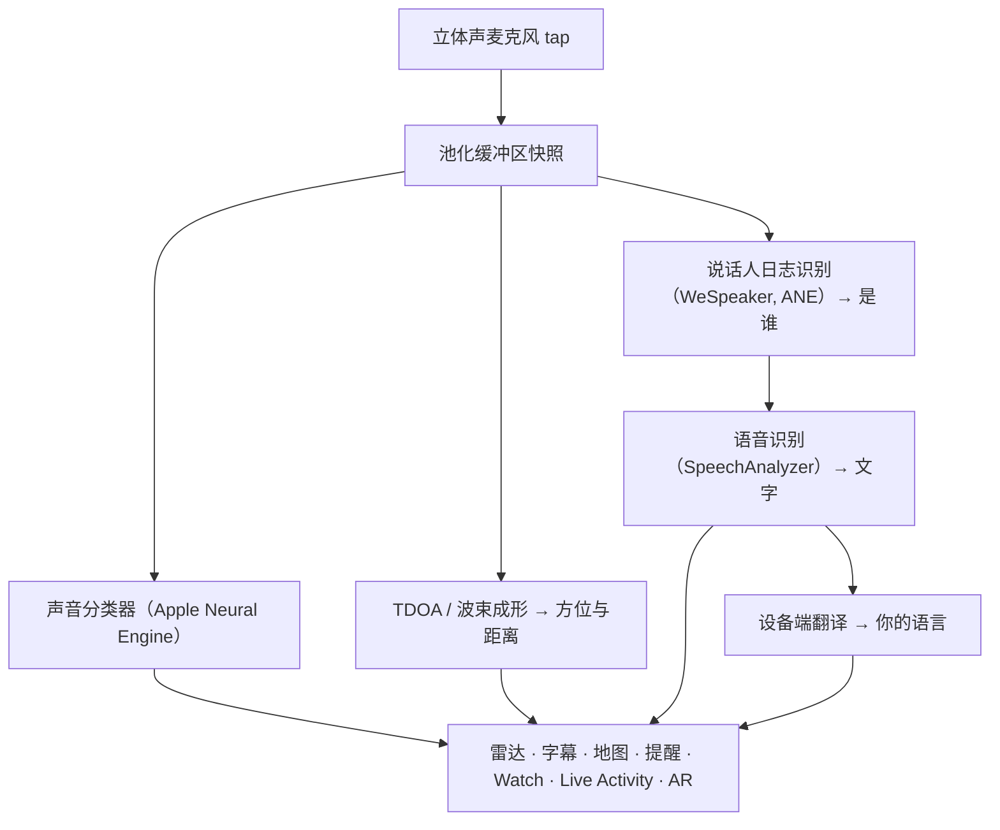

# Vigilant Ear 👂🛡️

*为听不见的人打造的声学雷达。*

一款专为聋人及听力受损群体打造的应用。大多数声音识别应用只告诉你*某个声音是什么*。**Vigilant Ear 会告诉你声音在哪里、是谁发出的，以及他们在说什么** —— 把 iPhone 变成一台实时声学三维扫描仪，描述你周围的声音世界。

警报器的方向与距离。身后的敲门声。谈话中的人们，被分别绘制为独立的转录语音 —— 每一人都配有字幕并按方位定位。如果有人说的是你读不懂的语言，他们的话语可以**翻译成你的语言**呈现。提醒会送达你的**锁屏、Dynamic Island 和 Apple Watch**，一眼即可知晓。

一切重要环节都在设备上运行。音频不会为了识别而被录音或上传。一切都不依赖“听得到”。

- 🧭 **不止检测，还有方向。** *是什么、在哪里、是谁，*以及*说了什么* —— 而不仅仅是“有声音发生”。
- 🔒 **从设计上保护隐私。** 分类、字幕与翻译均在你的 iPhone 上运行。字幕是实时且短暂的；不会作为转录存档保存。
- ⌚ **在手腕与锁屏上。** Apple Watch 方向伴侣 + Live Activity，让最近一次提醒及其来向始终一瞥可见。
- 🛰️ **更多手机，共享一只耳。** Constellation 连接支持 Ultra-Wideband 的 iPhone，融合每台设备所听到的内容，形成更清晰的方向画面。
- 👁️ **为聋人 / 听力受损者而造。** 独特触觉反馈、高对比视觉、不依赖颜色的线索、大触控目标，并全程尊重“减弱动态效果”。

---

## 适用人群

- **聋人及听力受损用户**，希望获得声音情境感知 —— Home Watch（敲门、报警器、婴儿、电话）与 Street Watch（警报器、接近），可常开并信赖。
- 任何需要**带方向与说话人分离的实时字幕**，或对身旁人进行**设备端翻译**的人。
- 对设备端声音定位感兴趣的无障碍与声学研究用户。

> Vigilant Ear 是一款无障碍**辅助工具**，并非经认证的生命安全设备。

---

## 功能介绍

### 🧭 看见声音 —— 方向与距离
利用 iPhone 的立体声麦克风，Vigilant Ear 估算周围声音的**方位与大致距离**，并在朝上方向的雷达环与地图上以实时标记呈现。移动时，标记会保持其真实世界位置。这是核心：对你听不见的世界建立空间感知。

### 🚨 识别重要声音 —— 并提醒你
设备端分类器可识别数百种日常声音，并监测关键类别 —— **警报器、报警器、门铃/敲门声、婴儿哭声、附近的人，以及恶劣天气。** 一旦触发，你会收到清晰的屏幕提醒、可选的**推送通知**，以及独特的**触觉反馈** —— 即使应用在后台或手机休眠。关键类别默认就绪，因此开启通知并不意味着“全部关闭”。关闭所有提醒类别后，引擎在后台会完全休眠以节省电量。

恶劣天气警报来自官方公共 CAP 数据源 —— 美国 **NWS**、欧洲 **MeteoGate**、**中国 CMA** 与 **韩国 KMA** —— 对所有用户免费。数据源会收窄为覆盖你所在位置的部分。

### ⌚ Apple Watch + Live Activity —— 一眼即知
- **Apple Watch 伴侣** —— 提醒方向会在手腕上指示，一瞥就知道该看哪里。重新设计的 Watch 界面带有应用耳部图标、威胁 HUD 布局，以及双击以最小化。即使 Watch 应用未打开，提醒仍可显示方向箭头。
- **Live Activity** —— Vigilant Ear 常驻你的**锁屏**、**Dynamic Island** 与 **Watch Smart Stack**，因此最近一次提醒及其方位始终一瞥可见。

### 💬 Speaker Mode —— 实时方向字幕 *（免费）*
开启 **Speaker Mode** 后，Vigilant Ear 将附近说话者的语音转录为**字幕块，每个声音一块。** 设备端说话人日志识别保持声音彼此区分 —— *谁*在说*什么* —— 并在内环上提供方向线索。当前说话者高亮显示；较旧文字在需要空间时滚出。字幕免费；自动翻译是可选的 Power Pack+ 层。

### 🌐 Speaker Auto-Translate —— 你的语言，实时呈现 *（Power Pack+）*
在 Speaker Mode 开启时，当附近的人以另一种语言说话，Vigilant Ear 可检测该语言并将其字幕**渲染为你的语言**，同时在其字幕块上显示源语言。整条链路 —— 听取 → 分离说话人 → 转录 → 翻译 → 显示 —— **在设备上运行**；唯一需要网络的时刻是从 Apple 一次性下载语言包。你不必先知道或选择对方的语言。

### 🎵 音乐与广播感知 *（Power Pack+）*
**ShazamKit** 识别周围播放的音乐并跟踪曲目变化。当某段语音看起来来自电视或收音机而非房间里的人时，会标记 **📻** —— 文字仍然显示，只是如实标注。

### 🛰️ Constellation —— 多台 iPhone，共享一只耳 *（Power Pack+）*
两台或更多支持 Ultra-Wideband 的 iPhone（多数自 iPhone 11 起），**Constellation** 将其配对，使它们能感知彼此位置，并融合每台设备所听到的内容，形成关于声音来源的更精确统一画面 —— 一种分布式、被动式聆听阵列。仅限具备相应硬件的设备。早于对等端连接时间的网格字幕不会被重传。

### 📷 相机 AR —— “看见声音” *（预览）*
打开标题栏上的相机胶囊，在实时相机视图中按真实方位钉住检测到的声音。标记按说话人或声音类别与方向聚类，以保持视图可读；声源安静后会随时间淡出。

### 🗺️ 地图、道路与路径预测
声音方位投影到地图上的真实 GPS 坐标。车辆声音可**吸附到附近街道**，并预测路径，使驶过的卡车显示为*沿道路*移动，而非穿过建筑物。（可尝试消防车演示。）

### 🪄 Demo Mode —— 无需听力即可验证
**Demo Mode** 对所有人公开：Home 与 Street 练习（敲门、报警器、婴儿、警报器、天气）、多手机与对话演示，以及清晰的 **DEMO:** 水印，确保练习绝不会伪装成真实事件。关闭面板会干净拆除演示状态（无卡住的 GPS 伪装、无残留标志）。

### ♿ 无障碍优先
为聋人 / 听力受损与色盲用户打造：**不依赖颜色**的线索、**≥44 pt** 触控目标、尊重**减弱动态效果**、多模态提醒（触觉 + 视觉 + Watch），以及启动验证屏幕，以清晰的绿色 / 灰色 / 红色（以及焦橙色“不允许”）状态显示权限状态 —— 包括作为主提醒开关的通知授权。

---

## 免费与 Power Pack+

安全核心**永久免费**：

- **Home Watch 与 Street Watch** —— 本地声音提醒（报警器、警报器、敲门/门铃、婴儿、附近的人），支持屏幕、触觉与可选推送送达。
- **实时字幕** —— Speaker Mode，设备端运行，在硬件允许时具备方向信息。
- **恶劣天气 CAP** —— 面向你所在地区的 NWS、MeteoGate、CMA、KMA。
- **Demo Mode** —— 带 DEMO 水印的练习提醒与功能预览。
- **Apple Watch 伴侣与 Live Activity** —— 可一瞥的方向与最近提醒。

**Power Pack+** 为一次性解锁（**非订阅**），含 **90 天免费试用**。它增加超级能力：

- **Speaker Auto-Translate** —— 将附近语音设备端翻译为你的语言。
- **Constellation** —— 通过 Ultra-Wideband 实现多 iPhone 共享聆听。
- **Music ID** —— ShazamKit 歌曲识别。

无论免费还是 Power Pack+，**用于识别的音频都留在设备上** —— 层级只改变解锁哪些功能，绝不改变原始音频被送往何处进行分析。

---

## 工作原理（底层）

Vigilant Ear 是**本地优先、设备端**流水线。原始音频在高优先级 tap 上捕获，复制到**池化缓冲区 free-list**（实时路径上无分配抖动），并扇出到各独立处理器，不阻塞 UI，也不中断 streamer：

- **空间数学** —— 在后台任务上运行 FFT、到达时间差与多普勒跟踪。
- **语音** —— iOS 26 `SpeechAnalyzer` / `SpeechTranscriber` 用于转录；**WeSpeaker** 嵌入用于声纹身份；Apple 的 **Translation** 框架用于设备端翻译。
- **并发** —— Swift 6 隔离使麦克风 tap、声学计算与 UI 渲染循环清晰分离。
- **能效** —— 降采样与负载自适应分类，使常开监听足够轻量。

---

## 隐私

- **核心流水线始终在设备上。** 分类、空间数学、转录、说话人日志识别与翻译在你的 iPhone 上运行。原始音频不会为了识别而被录音或上传。
- **字幕是短暂的。** 实时字幕在会话期间驻留内存；导出的调试日志不包含字幕文本。
- **无广告或行为分析 SDK。** 有限的网络用途仅用于地图、公共天气数据源、可选的 Shazam 指纹、道路上下文与 App Store 购买 —— 详见完整政策。

完整详情：[PRIVACY.md](PRIVACY.md) · [TERMS.md](TERMS.md) · [SUPPORT.md](SUPPORT.md)

---

## 硬件与平台

- **iPhone（完整体验）。** 测向需要立体声麦克风。推荐 **iPhone 13 或更新机型**。
- **Apple Watch。** 带方向箭头的伴侣提醒；支持 Live Activity / Smart Stack。
- **iPad（以字幕为主）。** 单通道麦克风 → 字幕，无完整方向。
- **Constellation** 需要 **Ultra-Wideband** —— iPhone 11 或更新机型，不包括 SE 与 “e” 机型。
- **Android。** 独立版本，具备核心雷达、提醒、字幕与天气；Constellation 网格以 iOS 为先。Android 功能对等推进时请见产品站点更新。

**当前 Apple 营销版本：** 1.0.7（进行中 / 发布轨道）。面向现代 iOS（SpeechAnalyzer 时代）构建。

---

## 本地化

界面、提醒与字幕全面本地化为 **英语、西班牙语、葡萄牙语（巴西）、法语、德语、阿拉伯语、日语、简体中文与韩语**（9 种语言）。遵循系统区域设置，或可在应用中手动选择。

---

## 状态与免责声明

Vigilant Ear 是一款**实验性声学无障碍辅助工具**，并非经认证的生命安全公用事业。定位精度会随环境、天气、风力与麦克风硬件而变化。**请始终保持正常的环境感知** —— 不要将其作为安全信息的唯一来源。

部分能力（相机 AR 标记、在 Apple 授予时的 Critical Alerts 权限升级、高级多包声音创作）仍在演进；免费的 Home / Street watch 与实时字幕是你第一天即可信赖的产品。

---

**联系：** [vigilantear@wingdingssocial.com](mailto:vigilantear@wingdingssocial.com)

用 ❤️ 为 D/HH 社群与声学研究而造。

    
  <strong>© 2026 Wingdings, Inc.</strong> 
  All rights reserved. 
  Patent Pending

