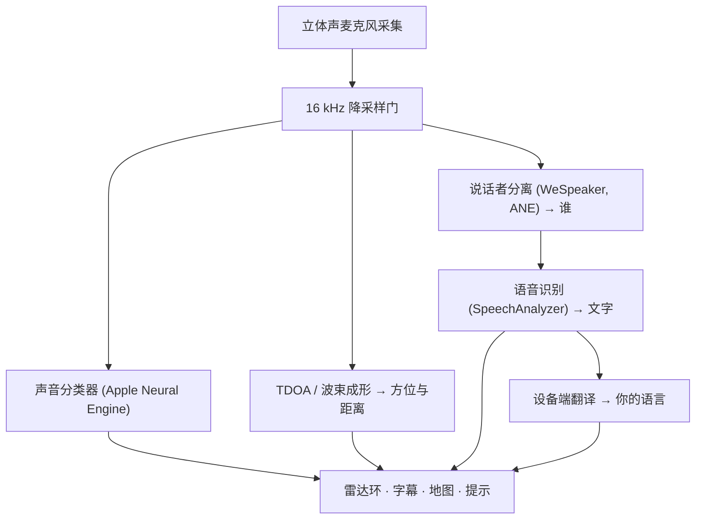

# VigilantEar 👂🛡️ (Apple 版)

*为听不见的人打造的声学雷达。*

一款专为聋人与重听 (Deaf/HH) 群体打造的应用！大多数声音识别应用只告诉你某个声音*是什么*。**VigilantEar 还会告诉你它在哪里、是谁发出的，以及对方在说什么** —— 把一部 iPhone 变成实时的声音三录仪，用视觉的方式描述你周围的声音。

警笛的方向与距离。身后的一记敲门声。一场对话中的每个人，被绘制成相互独立、各自带字幕的人声 —— 每个声音都配有字幕，并按说话者标出其方位。如果有人说的是一种你读不懂的语言，他们的话语会**翻译成你的语言**呈现给你。

一切都在设备上运行。没有任何内容被录制、缓存或发送到任何地方。

---

## 适用人群

- **聋人与重听用户**：希望对声音拥有情境感知 —— 不只是"发生了某个声音"，而是*是什么、在哪里、是谁，以及说了什么。*
- 任何需要**带方向与说话者区分的实时字幕**，或对身旁朋友的话语进行**设备端翻译**的人。
- 对设备端声音定位感兴趣的声学研究者与无障碍技术爱好者。

> VigilantEar 是一款无障碍**辅助工具**，而非经过认证的生命安全设备。

---

## 功能介绍

### 🧭 它能"看见"声音 —— 方向与距离
VigilantEar 借助 iPhone 的立体声麦克风，估算你周围声音的**方位与大致距离**，并将它们以实时光点的形式呈现在朝向向上的雷达环和地图上。当你移动时，这些光点会保持其真实世界中的位置。这正是核心所在：让你对一个听不见的世界拥有空间感知。

### 🚨 它能识别重要声音 —— 并向你发出警示
一个设备端分类器可识别 **300 多种日常声音**，并密切关注关键类别 —— **警笛、警报、门铃/敲门声、附近有人，以及恶劣天气。**一旦触发，你会收到清晰的屏幕提示，以及可选的**推送通知**，即便应用处于后台或手机处于休眠状态也是如此。关闭所有提示类别后，引擎在后台时会完全休眠，以节省电量。

恶劣天气预警来自官方公共数据源：美国的 **NWS** 已免费内置；欧洲的 **MeteoAlarm** 网络与**中国的 CMA** 则属于 Premium 功能。系统会自动将数据源缩小到真正覆盖你所在地区的那些。

### 💬 说话者模式 —— 实时、带方向的字幕 *(Premium)*
开启**说话者模式**后，VigilantEar 会将你身旁正在交谈的人转写成**字幕块，每个声音一块。**设备端的说话者分离技术能区分不同的人声，因此每个人都拥有属于自己的字幕块和别致图标 —— *谁*在说*什么* —— 内环上的一个小圆点会指引你找到他们在室内的方位。当前正在说话的人会被高亮显示；较早的文字会缓慢滚动消失，或在需要为新文字腾出空间时让位。

### 🌐 说话者自动翻译 —— 用你自己的语言，读懂你听不见的语言 *(Premium)*
开启说话者模式后，当身旁有人说另一种语言时，VigilantEar 会检测出来，并将他们的字幕**以你的语言**实时呈现，同时在其字幕块的标题栏标注识别出的"原始"语言。整条链路 —— 听见 → 区分说话者 → 转写 → 翻译 → 显示 —— **完全在设备上运行**；唯一需要联网的时刻，是从 Apple 一次性下载语言包。对于一位有着说另一种语言的朋友的聋人而言，这意味着可以实时读懂对方那一方的对话，**而无需事先知道并选择那种语言**。

### 🎵 音乐与广播感知 *(Premium)*
**ShazamKit** 能识别你周围正在播放的音乐，并显示曲目标题，且具备自动的歌曲切换识别功能。而当某个人声看起来是来自电视或收音机、而非室内某个真人时，它会被标上 **📻**，而不会被误认为是在场的某个人 —— 文字仍会显示，只是被如实地标注了出来。

### 🛰️ 星座模式 —— 多部 iPhone，一只共享的耳朵 *(Premium)*
当有两部或更多支持 Ultra-Wideband 的 iPhone（自 iPhone 11 起的大多数机型）时，**星座 (Constellation)** 模式会将它们配对，使它们能够感知彼此的位置（通过 Apple 的 Nearby Interaction / UWB），并将各自听到的内容融合成对声音来源更为精确得多的单一图景 —— 一种分布式、被动的**合成孔径声呐。**该功能仅限拥有相应硬件的设备使用。

### 🗺️ 地图、道路与路径预测
声音方位会被投射到真实的 GPS 坐标上，并绘制在地图视图中。车辆声音会被**吸附到附近的街道上**（通过开源道路数据源），并预测其路径，因此一辆驶过的汽车读起来是*沿着道路*行进，而不是穿越建筑物漂移。（不妨试试消防车演示来抢先体验一下。）

---

## 免费版与 Premium

安全核心**永久免费**：

- **本地声音提示** —— 警报、警笛、门铃/敲门声，以及附近有人 —— 均在设备端检测，并提供屏幕及推送警示。
- 面向美国的 **NWS 恶劣天气预警**。

一次性的 **Premium 解锁** —— 提供免费试用以供起步，且**并非订阅制** —— 可加上完整的情境感知层：

- **说话者模式** —— 实时、带方向、按说话者区分的字幕。
- **说话者自动翻译** —— 将身旁话语在设备端翻译成你的语言。
- **星座模式** —— 多部 iPhone 通过 Ultra-Wideband 共享听觉。
- **音乐识别** —— ShazamKit 歌曲识别。
- **国际天气数据源** —— 欧洲（MeteoAlarm）与中国（CMA）。

无论是免费版还是 Premium，**一切都在设备上运行** —— 等级只改变哪些功能被解锁，绝不改变你的音频去向。

---

## 工作原理（深入幕后）

VigilantEar 是一条**本地优先、设备端**的处理流水线。原始音频在一个高优先级的采集点上被捕获、复制，并分发给各个独立的处理执行体，全程绝不阻塞 UI：

- **空间运算** —— 快速傅里叶变换、到达时间差 (TDOA) 以及 Doppler 追踪，均在分离的后台任务中运行。
- **语音** —— iOS 26 的 `SpeechAnalyzer`/`SpeechTranscriber` 负责转写；**WeSpeaker** 嵌入将音频聚类为各个不同的人声；Apple 的 **Translation** 框架完成设备端翻译。
- **并发** —— Swift 6 的严格隔离让麦克风采集点、声学运算以及地图的 `CADisplayLink` 渲染循环保持清晰分离，从而让 UI 保持流畅（目标为 60 FPS 的标记滑动），同时其余一切都在后台火力全开地运行。
- **效率** —— 16 kHz 降采样门将分类器所见的数据量削减约 80%，让活跃时的占用保持轻盈，也让后台"始终聆听"模式更加轻量。

---

## 隐私

- **始终在设备端。**所有分类、空间运算、转写、说话者分离（说话者签名/识别）以及翻译，都在你的 iPhone 上完成。原始音频绝不会被录制、缓存或传输。
- **字幕转瞬即逝。**字幕仅在本次会话期间存于内存中，不会被持久保存或上传。
- **无遥测。**不会向任何服务器发送任何分析数据、崩溃日志或使用数据。

完整详情：[PRIVACY.md](PRIVACY.md) · [TERMS.md](TERMS.md) · [SUPPORT.md](SUPPORT.md)

---

## 硬件与平台

- **iPhone（完整体验）。**方向定位需要配备立体声麦克风的 iPhone。推荐 iPhone 13 或更新机型。
- **iPad（仅字幕）。**iPad 仅提供单一音频声道，因此可以转写并显示字幕，但无法计算方向 —— 非常适合作为固定摆放的大屏显示设备。
- **星座模式**需要 **Ultra-Wideband** —— iPhone 11 或更新机型，但不包括 SE 和"e"系列机型。

---

## 本地化

已完整本地化 —— 界面、提示与字幕 —— 支持**英语、西班牙语、葡萄牙语、法语、德语、阿拉伯语、日语和简体中文**（8 种语言）。它们会跟随系统区域设置，也可以在应用内手动选择。

---

## 状态与免责声明

VigilantEar 是一款**实验性的声学无障碍辅助工具**，而非经过认证的生命安全设备。定位精度会随周围环境、天气、风力以及麦克风硬件而变化。**请始终保持你平时对环境的警觉** —— 不要将它作为你唯一的安全信息来源。

---

**联系方式：** [vigilantear@wingdingssocial.com](mailto:vigilantear@wingdingssocial.com)

为 D/HH 群体与声学研究，用 ❤️ 倾心打造。

© 2026 Wingdings, Inc. All rights reserved.
