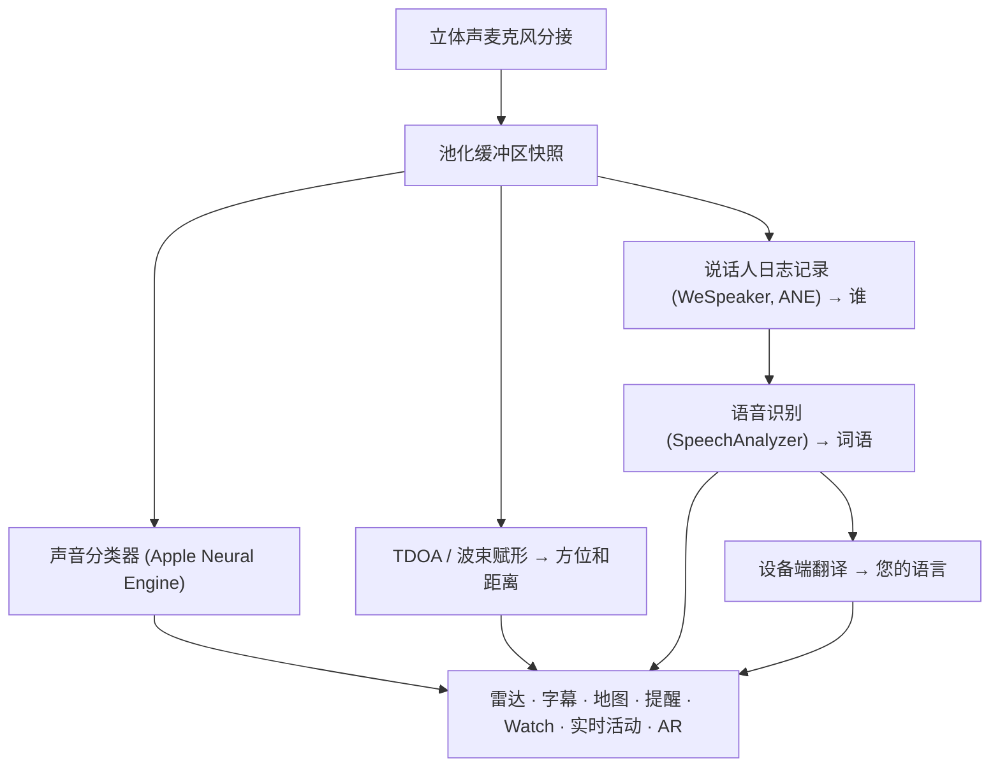

# Vigilant Ear 👂🛡️

*一款为听力障碍人士设计的声学雷达。*

这是一款专为聋人和重听群体打造的应用程序。大多数声音识别应用只会告诉你声音是*什么*。**Vigilant Ear 还能告诉你声音在哪里、是谁发出的，以及他们在说什么** —— 将 iPhone 变成一个实时的声学三录仪，描述你周围的声音。

警笛声的方向和距离。你身后的敲门声。对话中的人们被描绘成独立的转录声音 —— 每个人都有字幕和方向定位。如果有人说的是你看不懂的语言，他们的话语可以**翻译成你的语言。** 提醒会发送到你的**锁定屏幕、灵动岛和 Apple Watch**，只需瞥一眼就足够了。

所有重要的事情都在设备上运行。音频不会为了识别而被记录或上传。任何事情都不依赖于听力。

- 🧭 **不仅仅是检测，还有方向。** *是什么、在哪里、是谁，* 以及 *说了什么* —— 而不仅仅是“发生了一个声音”。
- 🔒 **隐私设计。** 分类、字幕和翻译都在你的 iPhone 上运行。字幕是实时且短暂的；它们不会作为成绩单存档保存。
- ⌚ **在你的手腕和锁定屏幕上。** Apple Watch 方向辅助 + 实时活动 (Live Activity) 让你一眼就能看到最新的提醒及其传来的方向。
- 🛰️ **多部手机，共享同一只耳朵。** Constellation（星座）将支持超宽带 (Ultra-Wideband) 的 iPhone 连接起来，将每部手机听到的声音融合成更清晰的方向画面。
- 👁️ **专为聋人/重听人士打造。** 独特的触觉反馈、高对比度视觉效果、与颜色无关的提示、巨大的点击目标，并在整个过程中尊重“减弱动态效果 (Reduce Motion)”。

---

## 它的服务对象

- **想要了解声音环境的聋人和重听用户** —— 居家看护（敲门、闹钟、婴儿、电话）和街头看护（警笛、靠近），你可以一直开着并信任它。
- 任何需要**带有方向和说话人分离的实时字幕**，或需要对坐在附近的人进行**设备端翻译**的人。
- 对设备端声音定位感兴趣的辅助功能和声学研究用户。

> Vigilant Ear 是一种辅助功能**辅助工具**，而不是经过认证的生命安全设备。

---

## 它的功能

### 🧭 看到声音 —— 方向和距离
使用 iPhone 的立体声麦克风，Vigilant Ear 可以估算你周围声音的**方位和大致距离**，并将它们作为实时标记放置在朝上的雷达环和地图上。移动时，标记会保持在它们真实世界的位置。这是核心：对你听不到的世界的空间感知。

### 🚨 识别重要声音 —— 并警告你
设备端分类器可识别数百种日常声音，并监控关键类别 —— **警笛、警报、门铃/敲门声、婴儿哭声、附近的人和恶劣天气。** 当触发其中之一时，你会得到清晰的屏幕提醒、可选的**推送通知**以及独特的**触觉反馈** —— 即使应用在后台运行或手机处于睡眠状态。关键类别默认准备就绪，因此启用通知并不意味着“所有声音都提醒”。关闭所有提醒类别，引擎在后台会完全休眠以节省电池。

恶劣天气警告来自官方的公共 CAP 订阅源 —— 美国的 **NWS**、欧洲的 **MeteoGate**、中国的 **CMA** 和韩国的 **KMA** —— 所有用户均可免费使用。订阅源会缩小到覆盖你所在位置的范围。

### ⌚ Apple Watch + 实时活动 —— 一瞥即知
- **Apple Watch 辅助** —— 提醒的方向会在你的手腕上指出，一瞥即可知道往哪里看。重新设计的 Watch UI 具有应用程序的耳朵图标、威胁 HUD 布局和双击关闭警报功能。当 Watch 应用程序未打开时，提醒仍然可以显示方向箭头。
- **实时活动** —— Vigilant Ear 会留在你的**锁定屏幕**、**灵动岛**和 **Watch 智能叠放 (Smart Stack)** 中，因此最新的提醒及其方位始终一瞥即知。

### 💬 说话人模式 —— 实时、定向字幕 *(免费)*
开启**说话人模式 (Speaker Mode)**，Vigilant Ear 会将在你附近说话的人转录为**字幕块，每个声音一个。** 设备端的说话人日志记录 (diarization) 保持声音的区别 —— *谁* 在说 *什么* —— 并在内环上带有方向提示。实时说话人会高亮显示；随着空间需要，较旧的文本会滚动移出。字幕是免费的；自动翻译是可选的 Power Pack+ 层。

### 🌐 说话人自动翻译 —— 你的语言，实时 *(Power Pack+)*
在开启说话人模式的情况下，当附近的人说另一种语言时，Vigilant Ear 可以检测到它，并以**你的语言**呈现他们的字幕，并在他们的字幕块上显示源语言。从听到 → 分离说话人 → 转录 → 翻译 → 显示的链条，完全在**设备端**运行；唯一需要网络的时刻是从 Apple 进行一次性语言包下载。你不需要事先知道或选择另一种语言。

### 🎵 音乐和广播感知 *(Power Pack+)*
**ShazamKit** 可识别你周围播放的音乐并跟踪歌曲变化。当声音看起来像是来自电视或收音机而不是房间里的人时，它会被标记为 **📻** —— 文字仍然会显示；它们会被如实标记。

### 🎛️ 声学示波器 —— 像工程师一样看声音 *(Power Pack+)*
以专业级视图实时呈现周围的声音：频谱、语谱图、1/3 倍频程 RTA 频段、色度与谐波分音——还有用于采集声音、训练自定义声音包的工具。

### 📦 自定义声音包 —— 教它认识你的世界 *(Power Pack+)*
教 Vigilant Ear 识别对您重要的声音——从本地鸟鸣到楼门门铃。扩展包叠加在内置检测之上，绝不会挤占警笛和警报。应用内附分步指南。

### 🛰️ Constellation —— 多部 iPhone，共享同一只耳朵 *(Power Pack+)*
使用两部或多部支持超宽带 (Ultra-Wideband) 的 iPhone（自 iPhone 11 以来的大多数机型），**Constellation** 会将它们配对，以便它们可以感知彼此的位置，并将每部手机听到的声音融合为更精确的声音来源图片 —— 一个分布式的无源监听阵列。该功能仅限于拥有合适硬件的设备。早于对等设备连接时间的网格 (Mesh) 字幕不会被重传。

### 📷 摄像头 AR —— “看到声音”
在标题栏上打开摄像头胶囊，在实时摄像头视图中将检测到的声音固定在它们真实的方位。标记按说话人或声音类别和方向聚集，以便视图保持可读性；声源变安静时会逐渐淡出。

### 🗺️ 地图、道路和路径预测
声音方位会投影到地图上的真实 GPS 坐标上。车辆的声音可以**吸附到附近的街道上**并预测其路径，因此一辆路过的卡车看起来像是在*沿着道路*移动，而不是穿过建筑物。（尝试一下消防车演示。）

### 🪄 功能游乐场 —— 即使没有耳朵也能证明
**功能游乐场**对所有人公开：居家和街头练习（敲门、警报、婴儿、警笛、天气）、多部手机和对话演示，以及清晰的水印，以便练习永远不会伪装成真实事件。关闭面板会干净地清除演示（没有卡住的 GPS 欺骗，没有残留的标志）。

### ♿ 辅助功能优先
专为聋人/重听和色盲用户打造：**颜色独立**的提示，**≥44 pt** 的点击目标，尊重**减弱动态效果 (Reduce Motion)**，多模式提醒（触觉 + 视觉 + Watch），以及一个启动验证屏幕，用清晰的绿色 / 灰色 / 红色（以及暗橙色的“不允许”）状态显示权限状态 —— 包括充当主提醒开关的通知授权。

---

## 免费和 Power Pack+

安全核心是**永远免费**的：

- **居家看护和街头看护** —— 本地声音提醒（警报、警笛、敲门/门铃、婴儿、附近的人），带有屏幕、触觉和可选的推送传递。
- **实时字幕** —— 说话人模式，设备端，在硬件允许的情况下具有方向性。
- **恶劣天气 CAP** —— 适用于您所在地区的 NWS、MeteoGate、CMA、KMA。
- **功能游乐场** —— 带有清晰 PREVIEW 水印的练习提醒和功能预览。
- **Apple Watch 辅助和实时活动** —— 一目了然的方向和最新提醒。

**Power Pack+** 是一次性解锁（**不是订阅**），有 **90 天的免费试用期**。它增加了超能力：

- **说话人自动翻译** —— 将附近的语音在设备端翻译成你的语言。
- **Constellation** —— 通过超宽带共享听力的多部 iPhone。
- **音乐识别** —— ShazamKit 歌曲识别。
- **声学示波器** —— 专业级实时声音可视化与采集工具。
- **自定义声音包** —— 可自行训练的扩展分类器。

无论是免费还是 Power Pack+，**您的音频都会留在设备上进行识别** —— 该层级只会改变哪些功能被解锁，绝不会改变原始音频被发送到哪里进行分析。

---

## 它是如何工作的（幕后）

Vigilant Ear 是一个**本地优先、设备端**的管道。原始音频在一个高优先级分接点上被捕获，复制到一个**池化缓冲区空闲列表**中（在实时路径上没有分配抖动），并散开到独立的处理器中，而不会停止 UI 或中断流：

- **空间数学** —— FFT、到达时间差 (Time-Difference-of-Arrival) 和多普勒跟踪在后台任务上进行。
- **语音** —— iOS 26 `SpeechAnalyzer` / `SpeechTranscriber` 用于转录；**WeSpeaker** 嵌入用于声音身份；Apple 的 **Translation** 框架用于设备端翻译。
- **并发性** —— Swift 6 隔离使麦克风分接、声学数学和 UI 渲染循环干净地分开。
- **效率** —— 降采样和负载自适应分类保持始终监听的轻量级，足以让它一直开着。

---

## 隐私

- **在设备上，永远用于核心管道。** 分类、空间数学、转录、日志记录和翻译都在您的 iPhone 上运行。原始音频不会为了识别而被记录或上传。
- **字幕是短暂的。** 实时字幕会在会话期间保留在内存中；导出的调试日志不包含字幕文本。
- **没有广告或行为分析 SDK。** 有限的网络使用仅用于地图、公共天气源、可选的 Shazam 指纹、道路环境和 App Store 购买 —— 请参阅完整的政策。

完整详情：[PRIVACY.md](PRIVACY.md) · [TERMS.md](TERMS.md) · [SUPPORT.md](SUPPORT.md)

---

## 硬件和平台

- **iPhone（完整体验）。** 需要立体声麦克风来进行测向。推荐使用 **iPhone 13 或更新机型**。
- **Apple Watch。** 带有方向箭头的辅助提醒；支持实时活动 / 智能叠放。
- **iPad（侧重于字幕）。** 单通道麦克风 → 有字幕但没有完整的方向。
- **Constellation** 需要**超宽带 (Ultra-Wideband)** —— iPhone 11 或更高版本，不包括 SE 和 “e” 型号。
- **Android。** 独立版本，具有核心雷达、提醒、字幕和天气；Constellation 网格是 iOS 优先。随着 Android 版的完善，请关注产品网站更新。

**当前 App Store 版本：** 1.0.7。为现代 iOS（SpeechAnalyzer 时代）构建。

---

## 本地化

完全本地化 —— 界面、提醒和字幕 —— 支持**英语、西班牙语、葡萄牙语（巴西）、法语、德语、阿拉伯语、日语、简体中文和韩语**（9 种语言）。遵循系统区域设置或在应用程序中手动选择。

---

## 状态和免责声明

Vigilant Ear 是一种**实验性的声学辅助工具**，而不是经过认证的生命安全实用程序。定位分辨率因周围环境、天气、风力和麦克风硬件而异。**请始终保持正常的周围环境意识** —— 不要依赖它作为你安全的唯一信息来源。

某些功能（摄像头 AR 标记、在 Apple 授予时升级紧急警报权利、高级多包声音创作）在不断发展；免费的居家/街头看护和实时字幕是您从第一天起就可以信任的产品。

---

**联系方式：** [vigilantear@wingdingssocial.com](mailto:vigilantear@wingdingssocial.com)

为聋人/重听群体和声学研究倾心打造 ❤️。

    
  <strong>© 2026 Wingdings, Inc.</strong> 
  All rights reserved. 
  Patent Pending

