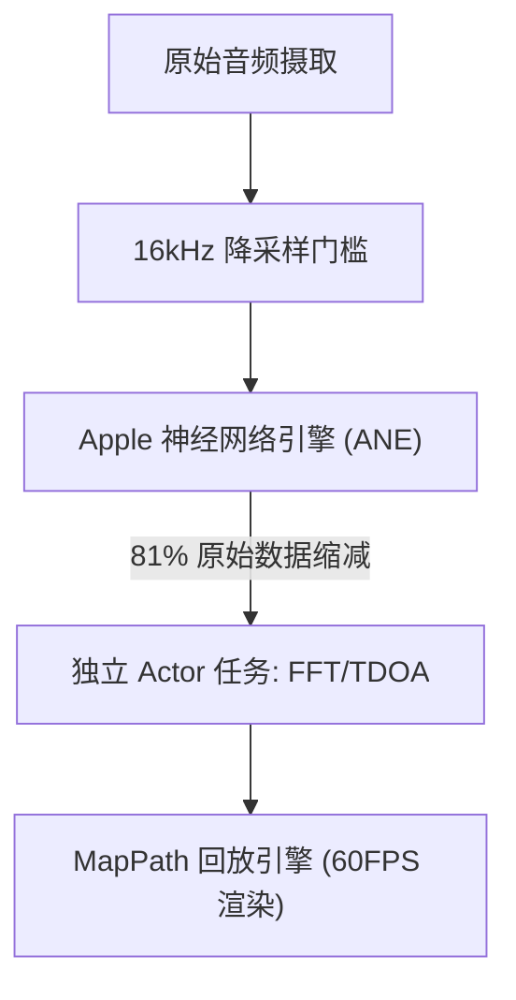

# VigilantEar 👂🛡️ (Apple 版本)

**生效日期：** 2026年6月6日

**VigilantEar** 是一款先进的、超高性能的 iOS 声学研究与无障碍辅助工具，专为失聪及听力障碍 (D/HH) 群体提供实时的方向与空间感知。传统的声音识别软件只能识别声音是*什么*；VigilantEar 作为一个综合性的战术雷达，结合了边缘计算的机器学习与复杂的声学物理学，能够精确追踪声音来自*哪里*、估计的距离，以及其绝对路径轨迹。

---

## 🌍 全球覆盖与本地化

为了支持全球用户，该平台配备了完整的原生本地化矩阵，支持：

- **英语 (English)**
- **西班牙语 (Español)**
- **葡萄牙语 (Português)**
- **中文 (简体中文)**
- **法语 (Français)**
- **德语 (Deutsch)**
- **日语 (日本語)**

所有战术叠加层、HUD 警报以及首选项菜单都会根据系统语言环境动态调整。

---

## 🚀 核心功能与特性

- **智能电源管理**：为最大限度延长电池寿命并保护系统资源，系统采用了条件性后台监控机制。如果用户禁用了五项核心紧急警报类别，当应用处于后台时，麦克风采样循环和处理引擎将自动进入完全休眠状态。
- **沉浸式战术模拟**：包含强大的设备端模拟套件，允许用户测试全部五种关键 `.emergency` 轨迹（警笛、警报、门铃、附近人员、恶劣天气）的触觉反馈和视觉响应，无需真实的声学触发条件。消防车模拟功能在一个解耦的、60帧/秒电影级物理回放引擎上安全运行，确保独立于声学轮询的惊艳地图交互。
- **多目标追踪器 (MTT)**：使用唯一的 UUID 会话标记，结合物理持久性映射，同时隔离并追踪独立的环境声音特征。
- **ShazamKit 集成**：实时环境音乐识别，并将其动态映射到空间雷达上。
- **地理道路吸附与物理引擎**：将相对数学声学方位角投影到全球 GPS 坐标上，通过 MapKit 集成将实时车辆矢量智能地吸附到已验证的街道上，并使用专用的 `VehiclePathPredictor` 预测其路径。

---

## 🧬 核心架构与神经数学引擎

VigilantEar 采用定制的 **SoundML 推送架构 (SoundML Push Architecture)**，完全围绕现代 iOS 硬件的性能和并发保障而构建。

## ⚡ 架构解耦

为在持续处理高频输入和复杂地图绘制的同时保持 120Hz UI 线程完全不被阻塞，该平台通过 Swift 6 的隔离机制严格实施职责分离：

- **MapPath 会话注册表 (DisplayLink)**：采用解耦的 CADisplayLink 引擎，将 MapKit 视图刷新与声学处理隔离开来，保证如丝般顺滑的 60 帧/秒标记滑动、逐渐消失的多普勒轨迹以及电影级的对象追踪。
- **麦克风管理器 (MicrophoneManager - MainActor)**：严格隔离绑定 UI 的属性、设备方向状态和位置指标，以流畅驱动 HUD。
- **声学引擎 (AcousticEngine - 非隔离 / 后台 Actor)**：管理底层 AVAudioEngine 状态和硬件操作。输入缓冲区在最高优先级线程上被直接深拷贝，将快照直接传递给处理 Actors，从而避免强制线程跳转或阻塞主 Actor (Main Actor)，彻底消除微卡顿。

### 🧠 数学最小化

- **卸载与缩减**：音频帧在处理前需通过严格的 16kHz 降采样关卡，在分类矢量被 Apple 神经网络引擎 (ANE) 处理前将原始数据量削减 81%。
- **并行空间计算**：高性能数学流水线（包括快速傅里叶变换 (FFT)、到达时间差 (TDOA) 计算和多普勒跟踪算法）完全在独立的异步线程中执行。

### 📊 性能基准测试

- **活跃模式**：在标准的 6 核处理器上，仅以 6% 的 CPU 占用率即可提供全面的实时 HUD 追踪和 60FPS 预测性地图轨迹。
- **最小化 / 后台模式**：当应用程序最小化时，计算量下降超过 33%，仅用 4% 的 CPU 利用率即可维持绝对的环境警觉状态，对发热的影响微乎其微。

---

## 🛠️ 技术栈 (2026)

- **语言**：Swift 6 (严格并发、Checked Sendable 模型、Actor 隔离)
- **框架**：SwiftUI, MapKit (注释和时间轴叠加), Accelerate Framework (vDSP), SoundML
- **硬件基准**：iPhone 13 或更新机型 (需要立体声麦克风对齐以保证 TDOA 方位精度)

---

## 📊 隐私与安全护栏

- **本地优先隔离**：所有音频分类、频谱计算和方位投影完全在设备端进行。在任何情况下绝不会录制、缓存或传输原始音频流。
- **无远程遥测或诊断**：VigilantEar 旨在完全在您的设备本地运行。我们不会在我们的服务器上收集、传输或存储任何远程遥测、崩溃日志、诊断记录或使用分析。

---

## ⚖️ 免责声明

VigilantEar 是一个实验性的声学研究与空间无障碍辅助工具。它未经认证为生命安全设施。追踪分辨率可能会根据区域地形、当前天气、风况以及麦克风硬件校准情况而动态波动。用户必须始终保持对环境的正常感知。

**联系邮箱：** [vigilantear@wingdingssocial.com](mailto:vigilantear@wingdingssocial.com)

VigilantEar 是一款用心打造的无障碍工具。请负责任地使用。

用 ❤️ 为失聪及听力障碍群体及声学研究而作。

© 2026 Wingdings, Inc.  
保留所有权利。
