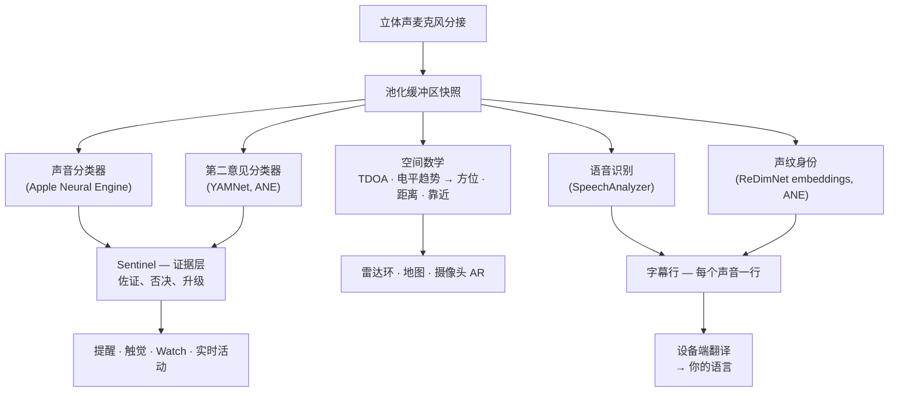
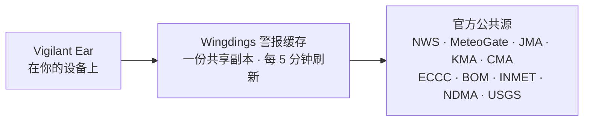

# Vigilant Ear 👂🛡️

*自 1.1.5 版起生效 · 2026 年 9 月。*

## 为听不到声音的人准备的声学雷达。

这是一款专为聋人、重听及 CODA 群体打造的应用。大多数声音识别应用只会告诉你声音是*什么*。**Vigilant Ear 还能告诉你声音在哪里、是谁发出的，以及他们在说什么** —— 把 iPhone 变成一台实时声学三录仪，描述你周围的声音。

警笛的方向和距离。身后的敲门声。对话里的人被画成各自独立的转录声线 —— 每人都有字幕和方向定位。如果有人说的是你看不懂的语言，他们的话可以**译成你的语言。** 提醒会送到你的**锁定屏幕、灵动岛和 Apple Watch**，瞥一眼就够。

要紧的事都在设备上完成。音频不会为了识别而被录制或上传。任何环节都不依赖听力。

- 🧭 **不只是检测，还有方向。** *是什么、在哪里、是谁，* 以及 *说了什么* —— 而不只是“有声音”。
- 🔒 **天生注重隐私。** 分类、字幕和翻译都在你的 iPhone 上运行。字幕是实时且短暂的；不会当作转录存档保存。
- ⌚ **在手腕和锁定屏幕上。** Apple Watch 方向伴侣 + 实时活动 (Live Activity)，让最近一次提醒及其方向始终一眼可见。
- 🛰️ **多部手机，共享同一只耳朵。** Constellation（星座）把支持超宽带 (Ultra-Wideband) 的 iPhone 连起来，把每台手机听到的内容融成更清晰的方向图景。
- 👁️ **为聋人 / 重听 / CODA 而做。** 独特触觉、高对比视觉、不依赖颜色的提示、足够大的点击目标，并全程尊重“减弱动态效果 (Reduce Motion)”。

---

## 为谁而做

- **希望掌握声音环境态势的聋人、重听及 CODA 用户** —— 居家值守（敲门、警报、婴儿、电话）和街头值守（警笛、靠近），可以一直开着并放心依赖。
- 任何需要**带方向与说话人分离的实时字幕**，或需要对身边人做**设备端翻译**的人。
- 对设备端声音定位感兴趣的辅助功能与声学研究用户。

> Vigilant Ear 是辅助功能**辅助工具**，不是经认证的生命安全设备。

---

## 它能做什么

### 🧭 看见声音 —— 方向与距离
利用 iPhone 的两只麦克风，Vigilant Ear 测出声音的**角度，以及它在你前方还是后方**，把读数稳定在大约一度，并以实时标记画在朝上的雷达环和地图上。同一直线上的两只麦无法单独分清左右 —— 右侧 50° 与左侧 50° 的声音到达时差相同 —— 所以应用会画出读数，并在另一侧加一个**更淡的虚影**；转一下手腕或用第二部手机就能定下来。距离按街景标定曲线从响度估算，并如实显示为估计值：*约 50 英尺*，并给出可能范围。你一移动，标记会保持在真实世界位置。这就是核心：对你听不到的世界的空间感知。（具体数字见下文。）

### 🚨 识别重要声音 —— 并提醒你
设备端分类器可识别数百种日常声音，并盯住关键类别 —— **警笛、警报（含专门的汽车警报类）、门铃/敲门、婴儿哭声、附近的人，以及恶劣天气。** 一旦触发，你会得到清晰的屏幕提醒、可选的**推送通知**，以及独特的**触觉反馈** —— 即使应用在后台或手机在休眠。关键类别默认就绪，所以开启通知并不等于“什么都报”。关掉全部提醒类别后，引擎在后台会完全休眠以省电。**Sentinel** 层会用独立证据 —— 方向、运动和公共数据源 —— 交叉核对提醒，因此触发的是经过佐证的结果，而不是单个分类器的孤立猜测。双向都成立：歌曲里像警笛的一瞬会被按住，但真实警笛反复穿过你的音乐时仍会突破并提醒。

恶劣天气警告来自官方公共订阅源 —— 美国 **NWS**、欧洲 **MeteoGate**、中国 **CMA**、韩国 **KMA**、日本 **JMA**、加拿大 **ECCC**、澳大利亚 **BOM**、巴西 **INMET** 和印度 **NDMA** —— 对所有用户免费。订阅源会收窄到覆盖你所在位置的那些。在日本，应用还会读取 JMA 的**提前通报** —— 台风或暴雨来临前数日发出的白话说明，而不只是危险已至时的警告 —— 以及突发性强降雨与山体滑坡通报。提前通报安静展示，不用留给真正警告的声音和震动。

### ⌚ Apple Watch + 实时活动 —— 一瞥即知
- **Apple Watch 伴侣** —— 提醒方向会指在你手腕上，瞥一眼就知道往哪看。重新设计的 Watch UI 带有应用耳朵图标、威胁 HUD 布局，以及双击关闭提醒。即使 Watch 应用未打开，提醒仍可显示方向箭头。
- **实时活动** —— Vigilant Ear 会留在你的**锁定屏幕**、**灵动岛**和 **Watch 智能叠放 (Smart Stack)** 上，最近一次提醒及其方位始终一眼可见。
- **伙伴提醒直达手腕** —— 已链接的 Constellation 伙伴手机发出提醒时，也可送到你的 Watch，并带方向。可靠性优化让手表端伴侣全天对电池都很轻。

### 💬 说话人模式 —— 实时、定向字幕 *(免费)*
打开**说话人模式 (Speaker Mode)**，Vigilant Ear 会把附近说话的人转录成**字幕块，每个声音一块。** 设备端说话人分离 (diarization) 让声音保持可区分 —— *谁* 在说 *什么* —— 并在内环给出方向提示。当前说话人高亮；空间不够时，较早的文本会滚出去。

多数字幕应用做不到的两件事：**对置信度诚实** —— 每行细微的质量标记，以及可疑词下的虚线下划线，告诉你何时可信、何时该再核对 —— 以及**自我修正**：句子落地后，应用会带着完整语境重读音频，可在约两秒内补回漏听或听错的词，随后文本冻结。

字幕免费；自动翻译是可选的 Power Pack+ 层。字幕也可**朗读到你的蓝牙听力设备** —— 免费，在偏好设置里开启。**方向音 (Direction Tones)**（同样免费，在偏好设置 → 字幕）可在你选定的一侧耳朵加入可选音频提示，标出说话人方位 —— 对助听器或单侧听力很有用，也向所有人开放。

### 🌐 说话人自动翻译 —— 你的语言，实时 *(Power Pack+)*
在说话人模式开启时，附近的人若说另一种语言，Vigilant Ear 可以检出并用**你的语言**呈现其字幕，同时在其字幕块上显示源语言。听 → 分离说话人 → 转录 → 翻译 → 显示 的整条链在**设备端**运行；唯一需要网络的时刻是从 Apple 一次性下载语言包。你不必事先知道或选择对方语言。

这是目前最接近科幻里**万能翻译器**的量产形态 —— 设备直接听懂。Vigilant Ear 自行检测语言，跟上房间里每一位说话人，并把所有人的话以你的语言字幕呈现 —— 无需耳机、无需设置，全程在设备上。

```mermaid
graph LR
    A["只管听"] --> B["自动检测语言"] --> C["分离每个人的声音"] --> D["整个房间实时字幕成你的语言"]
```

### 🎵 音乐与广播感知 *(Power Pack+)*
**ShazamKit** 识别周围播放的音乐并跟踪歌曲切换。

### 🎛️ 声学示波器 —— 像工程师一样看声音
以专业级实时视图呈现周围声音：频谱、语谱图、1/3 倍频程 RTA 频段、色度与谐波分音 —— **所有人免费。** 用于采集声音、训练自定义声音包的工具属于 Power Pack+。

### 📦 自定义声音包 —— 教它认识你的世界 *(Power Pack+)*
教 Vigilant Ear 识别对你重要的声音 —— 从本地鸟鸣到楼门门铃。扩展包叠在内置检测之上，新声音绝不会挤占警笛和警报。应用内附分步指南。

### 🛰️ Constellation —— 多部 iPhone，共享同一只耳朵 *(Power Pack+)*
用两部或多部支持超宽带的 iPhone（自 iPhone 11 起的大多数机型），**Constellation** 将它们配对，使彼此能感知位置，并把各自听到的内容融成更精确的声源图景 —— 一个分布式无源监听阵列。字幕也会融合：每部手机转录自己麦克风听到的内容，再跨机对齐，让离说话人最近的那部贡献所听内容 —— 只有一部手机听到的词会被保留，而不是丢掉。手机之间**直接连接** —— 无需路由器、无需同一 Wi-Fi 网络，也无需互联网；只要打开 Wi-Fi，走的是 AirDrop 同一条点对点链路。仅限具备相应硬件的设备。早于对等端连接时间的网格字幕不会被重传。

**伙伴消息** —— 向已链接伙伴的手机发一条短讯；它会出现在对方的字幕流中，并可在设备端译成对方语言后送达。消息顾及年龄：基于 Apple 的声明年龄范围（Declared Age Range），成年人与未成年人之间的短信保持关闭，除非双方都主动为对方命名。提醒和字幕从不受限 —— 仅限人对人短信。

### 🔗 远程连线 (Remote Link) —— 联系不在身边的人 *(先需 Power Pack+ 才能发起)*
本可用电话做的事，改用视频和文字完成。你发出邀请码；对方在 Vigilant Ear 内加入，**不必拥有 Power Pack+**。与 Constellation 不同，没有近距离要求 —— 两人可以在任何地方。

**全程不使用音频。** 只有视频和文字，因此链路两端都不依赖听力 —— 也让你能通过应用与对方手语交流。应用本身不理解手语；它只承载视频，其余由你们完成。连接在网络允许时在两部手机间直连，应用会清楚标明是**直连 (Direct)** 还是**中继 (Relayed)**，让你始终知道视频是否经中继。

### 📷 摄像头 AR —— “看见声音”
在标题栏打开摄像头胶囊，把检测到的声音钉在实时画面中的真实方位。标记按说话人或声音类别与方向聚类，保持可读；声源安静后会随时间淡出。

### 🗺️ 地图、道路与路径预测
声音方位投影到地图上的真实 GPS 坐标。车辆声可**吸附到附近街道**并预测路径，于是路过的卡车读起来像在*沿路*移动，而不是穿楼而过。（可试消防车演示。）

### 🪄 功能游乐场 —— 不必靠听力也能验证
**功能游乐场**对所有人公开：居家与街头练习（敲门、警报、婴儿、警笛、天气）、多机与对话演示，以及清晰水印，确保练习绝不伪装成真实事件。关闭面板会干净拆除演示（无卡住的 GPS 欺骗，无残留标志）。

### ♿ 辅助功能优先
为聋人 / 重听 / CODA 与色盲用户打造：**不依赖颜色**的提示，**≥44 pt** 点击目标，尊重**减弱动态效果 (Reduce Motion)**，多模态提醒（触觉 + 视觉 + Watch），以及启动验证屏，用清晰的绿 / 灰 / 红（以及焦橙“不允许”）状态显示权限 —— 包括充当主提醒开关的通知授权。

---

## 免费与 Power Pack+

安全核心**永久免费**：

- **居家值守与街头值守** —— 本地声音提醒（警报、警笛、敲门/门铃、婴儿、附近的人），支持屏幕、触觉与可选推送。
- **实时字幕** —— 说话人模式，设备端，在硬件允许时带方向；含诚实的置信度标记、约 2 秒自我修正、可选朗读到蓝牙听力设备，以及方向音。
- **常驻值守 (Standing Watch)** —— 房间自身状态，始终开启且无需配置：房间保持惯常模式时是稳定青灯；出现变化 —— 新声音、突然安静，或有东西靠近 —— 变为琥珀。
- **恶劣天气警报** —— 适用于你所在地区的 NWS、MeteoGate（欧洲 —— 由我们的 5 分钟警报缓存新鲜提供）、CMA、KMA、JMA（日本）、ECCC（加拿大）、BOM（澳大利亚）、INMET（巴西）和 NDMA（印度）。
- **地震警报（USGS，全球）** —— 附近有地震报告时，你会感到震动，并在地图上看到有感区域。来自 USGS 官方源的确认 —— 不是预警：若你感到晃动，它告诉你那是什么。设备端深层震感（次声）检测可在地面一动时启动核实。
- **功能游乐场** —— 带清晰 PREVIEW 水印的练习提醒与功能预览。
- **Apple Watch 伴侣与实时活动** —— 可一眼看到的方向与最近提醒。
- **声学示波器** —— 专业级实时声音可视化，所有人免费。（用于训练的采集工具属 Power Pack+。）

**Power Pack+** 是一次性解锁（**不是订阅**），含 **90 天免费试用**。它增加这些超能力：

- **说话人自动翻译** —— 将附近语音在设备端译成你的语言。
- **Constellation** —— 经超宽带的多 iPhone 共享听力，并支持伙伴消息。
- **音乐识别** —— ShazamKit 歌曲识别。
- **自定义声音包** —— 可自行训练的扩展分类器。

无论免费还是 Power Pack+，**你的音频都会留在设备上做识别** —— 层级只改变解锁哪些功能，绝不改变原始音频被送到何处分析。

---

## 它如何工作（幕后）

Vigilant Ear 是**本地优先、设备端**的分层流水线：捕获一次，再让彼此独立的专长模块读同一段声音并互相核对。原始音频在高优先级分接点捕获，复制进**池化缓冲区空闲列表**（实时路径上无分配抖动），再分发出去且不卡住 UI：

```mermaid
graph TD
    A["立体声麦克风分接"] --> B["池化缓冲区快照"]
    B --> C["声音分类器<br/>(Apple Neural Engine)"]
    B --> Y["第二意见分类器<br/>(YAMNet, ANE)"]
    C --> S["Sentinel — 证据层<br/>佐证、否决、升级"]
    Y --> S
    S --> H["提醒 · 触觉 · Watch · 实时活动"]
    B --> D["空间数学<br/>TDOA · 电平趋势 → 方位 · 距离 · 靠近"]
    D --> R["雷达环 · 地图 · 摄像头 AR"]
    B --> F["语音识别<br/>(SpeechAnalyzer)"]
    B --> E["声纹身份<br/>(ReDimNet embeddings, ANE)"]
    F --> G["字幕行 — 每个声音一行"]
    E --> G
    G --> T["设备端翻译<br/>→ 你的语言"]
```

没有任何单一模型被单独信任。**Sentinel** 层夹在检测与提醒之间：独立引擎逐帧互相佐证或否决 —— 当反复出现的真实世界证据压过否决时（例如真实警笛穿过你的音乐），证据胜出，提醒发出。

字幕也有第二次机会。每句定稿后，会从短时内存音频环带着完整语境安静重读 —— 修正约在两秒内落地，随后文本永久冻结：

```mermaid
graph LR
    L["实时字幕出现"] --> K["带着完整语境<br/>重读原始音频"] --> V["受护比较<br/>（保留已听到的）"] --> W["行被安静修正<br/>≤ 2 秒后冻结"]
```

- **空间数学** —— FFT、相干加权到达时间差（TDOA —— 偏爱两只麦一致的频段，再把微小到达时差变成方位），以及电平趋势靠近跟踪，均在后台任务上运行。麦克风对按固定朝向读取，因此无论竖持还是横持，方向表现一致。
- **语音** —— iOS 26 `SpeechAnalyzer` / `SpeechTranscriber` 负责转录；**ReDimNet** 说话人嵌入负责声纹身份；Apple 的 **Translation** 框架负责设备端翻译。声纹身份基于证据：只有独立声音窗口才能确认真实人物；不确定匹配显示为未归属，而不是猜错名字。
- **音乐真伪** —— 色度**歌曲特征检测器**掌管“是否真在放音乐”的判定，因为通用分类器常把静室和警笛叫成“音乐”。只有特征同意确有音乐时，Shazam 才会运行。
- **并发** —— Swift 6 隔离让麦克风分接、声学数学与 UI 渲染循环干净分开。
- **效率** —— 降采样、负载自适应分类，以及按证据门控的网络使用，使始终聆听轻到可以一直开着。

天气和地震预警走与音频相反的路径 —— 你的声音从不外送，但警报*数据*会进来。**每一路**官方源都经我们运营的小型缓存，一次抓取公共数据即可服务所有用户 —— 你的手机从不直接联系外国政府服务器：

```mermaid
graph LR
    P1["Vigilant Ear<br/>在你的设备上"] --> W["Wingdings 警报缓存<br/>一份共享副本 · 每 5 分钟刷新"]
    W --> N["官方公共源<br/>NWS · MeteoGate · JMA · KMA · CMA<br/>ECCC · BOM · INMET · NDMA · USGS"]
```

---

## 你的手机能听见什么 —— 实测

你的 iPhone 有相距约六英寸的两只麦克风、气压计，以及非常好的时钟。这足以告诉你声音从哪边来、大概多远、是否朝你靠近，以及门是否刚打开。下面是各项有多准、我们如何核对，以及若你自己听不到声音时为何重要。方向及相关数据于 2026 年 9 月在 iPhone 17 与 iPhone 16 Pro Max 上测得。距离本质上仍是估计 —— 我们在屏幕上也会这么说。

**方向 —— 大约到一两度。** 声音先到上麦或先到下麦，应用据此算出声音偏离手机轴线多远，以及在前还是在后。手机两路并不是朴素麦克风，而是处理后的立体声图像；房间一吵，该图像会叠上固定模式。应用现在会在启动后几秒安静里学会该模式，并在读方向前去掉它。

| 我们测了什么 | 结果 |
|---|---|
| 96 个模拟房间（安静办公室到硬墙房间，5 dB SNR）的中位误差 | 1.0° |
| iPhone 17 放桌上、房间有噪声、扬声器偏离轴线 30° | 相对侧平面读到 61.7°，期望 60°，晃动 1.6° |
| 同上，扬声器正对手机侧面 | 读到 4.5°，期望 0°，晃动 2.2° |
| 同上，扬声器正前方 | 每次都在最大时延，符合预期 |
| 读数落在图像自身模式而非声音上 | 任意角度均为无 |

*为何重要：* 若你听不到警笛，“在你身后偏一侧”告诉你往哪看。只有对照卷尺核对过的稳定读数才值得信；这一项核对过两次，第二次是在第一次被发现过于宽松之后。

**距离 —— 按估计值如实显示。** 单只麦克风测不了距离，只能测响度；远处的大卡车可能听起来像近处的安静小车。应用用真实街道拟合的曲线从响度估距离，并像谨慎的人那样表述：*大约 50 英尺，可能在 25 到 100 之间。*

| 我们测了什么 | 结果 |
|---|---|
| 经标定回放的真实车辆检测 | 1,131 |
| 落在实际所在 100 英尺道路内 | 73% |
| 远车道车辆 | 估为 78 与 87 英尺，卷尺为 73 与 85 英尺 |

道路（城市路口）按车道逐条丈量；曲线出错时偏近侧。标定由自动化测试锁定，避免静默漂移。你自己空间内的警报（如烟雾报警器）完全不给距离 —— 它们已与你同室。

**运动 —— 朝你靠近。** 对车辆和警笛，变响通常意味着变近。应用观察几秒内电平上升多快：约每秒持续升高 1.5 dB（清晰稳定的变响）视为靠近，对称下降视为离开；若不再变化，约四秒后不再称为靠近或离开。单次巨响 —— 按喇叭、摔门 —— 无法触发。建立在物理与九项自动化测试上；录制的街道驶过是下一步实地确认。

**房间里的空气 —— 门有签名。** 气压计能察觉约十四英尺外开门：门摆开时气压下探，关上时回弹。在十四小时安静与十五次门事件中，每扇门都做出这两段形状，屋里别无他物如此。

| 事件 | 气压变化率 | 形状 |
|---|---|---|
| 前门开合，×10 | 0.6–1.8 Pa/s | 下探再回弹，约相隔 5 秒 |
| 前门猛关，×5 | 1.1–2.5 Pa/s | 同一对，更高 |
| 夜间空调循环，×8 | 0.11–0.46 Pa/s | 数分钟慢坡，两部手机相同 |
| 安静房间 | ~0.02 Pa/s | 无 |
| 走过、打喷嚏 | — | 运动传感器察觉，手机忽略 |

纱门不密封房间，因此不可见 —— 本应如此。今天气压变化可在地图上显示为深层隆隆；专用的静夜开门提醒已测完并设计好，尚非日常默认。

**Constellation —— 两部手机定下左右。** 网格上每部手机从所在位置朝声音画一条线，线条只在一侧干净相交。相交后虚影消失，应用又能说左或右。仿真中，相距 **40 米** 的两部手机，把 50 米外的警笛定位到约 2 米以内。

**这里任何数字如何被采信。** 每个数字都按同一三道关，依次：答案预先已知的模拟房间；复现会骗过应用的精确情形、并在每次改动时运行的小型自动化测试；再到真实桌上的真机，距离手测。挺不过第三关，就不算准。对听不到声音的人，应用的话是唯一的话 —— 它该像实验室那样挣来。

给工程师的更深笔记：[Physics](https://vigilantear.com/en/physics/) —— TDOA、距离、运动、Constellation 与气压检测，每个数字标有 MEASURED / BENCHED / MODELLED。

---

## 隐私

- **核心流水线始终在设备上。** 分类、空间数学、转录、说话人分离与翻译都在你的 iPhone 上运行。原始音频不会为识别而被录制或上传。
- **字幕是短暂的。** 实时字幕只在会话期间留在内存；导出的调试日志不含字幕文本。
- **无广告或行为分析 SDK。** 有限网络仅用于地图、公共天气源、可选 Shazam 指纹、道路环境与 App Store 购买 —— 详见完整政策。

完整详情：[PRIVACY.md](PRIVACY.md) · [TERMS.md](TERMS.md) · [SUPPORT.md](SUPPORT.md)

---

## 硬件与平台

- **iPhone（完整体验）。** 竖屏横屏皆可 —— 想怎么拿就怎么拿。测向需要立体声麦克风。推荐 **iPhone 13 或更新机型**。
- **Apple Watch。** 带方向箭头的伴侣提醒；支持实时活动 / 智能叠放。
- **iPad（原生）。** 自适应布局：大屏上，实时字幕在地图旁半透明面板中，无人讲话时收起。单通道麦克风 → 有字幕但无完整方向。
- **Constellation** 需要**超宽带 (Ultra-Wideband)** —— iPhone 11 或更高，不含 SE 与 “e” 型号。**不需要** Wi-Fi 网络：只要打开 Wi-Fi，手机即可直接发现彼此，因此无路由器、无互联网时，只要彼此靠近即可用。
- **Android。** 独立版本，含核心雷达、提醒、字幕与天气；Constellation 网格以 iOS 为先。随 Android 对等完善，请关注产品站更新。

---

## 本地化

完全本地化 —— 界面、提醒与字幕 —— 支持**英语、西班牙语、葡萄牙语（巴西）、法语、德语、意大利语、阿拉伯语、日语、简体中文、韩语、俄语和印地语**（12 种语言）。遵循系统区域设置，或可在应用内手动选择。

---

## 状态与免责声明

Vigilant Ear 是**实验性声学辅助功能工具**，不是经认证的生命安全公用设施。定位分辨率随环境、天气、风力与麦克风硬件而变。**请始终保持你惯常的环境意识** —— 不要把它当作安全信息的唯一来源。

部分能力（摄像头 AR 标记、在 Apple 授予后升级的紧急提醒 (Critical Alerts) 权利、高级多包声音创作）仍在演进；免费的居家 / 街头值守与实时字幕，才是你从第一天起就能信任的产品。

---

**联系方式：** [vigilantear@wingdingssocial.com](mailto:vigilantear@wingdingssocial.com)

为聋人 / 重听群体与声学研究倾心打造 ❤️。

    
  <strong>© 2026 Wingdings, Inc.</strong> 
  All rights reserved. 
  Patent Pending

