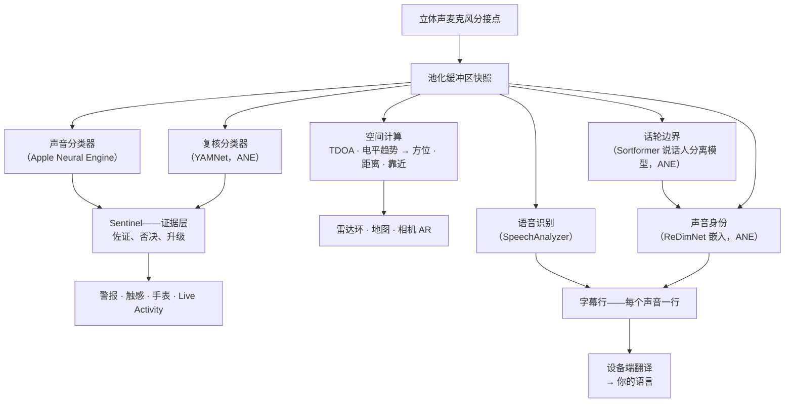

# Vigilant Ear 👂🛡️

*自 1.1.9 版起生效 · 2026 年 9 月。*

## 为听不见的人打造的声学雷达。

这是一款专为聋人、重听者和 CODA 群体打造的应用。大多数声音识别应用只会告诉你一个声音*是什么*，而 **Vigilant Ear 会告诉你它在哪里、是谁发出的，以及他们在说什么**——把 iPhone 变成一台实时的声波“三录仪”，为你描述周围的声音。

警笛的方向和距离。身后的一声敲门。一场对话中的每个人，都以各自独立的转写声音呈现——每一个都配有字幕，并标出方位。如果有人说的是你看不懂的语言，他们的话可以**译成你的语言**送到你眼前。警报会送达你的**锁定屏幕、Dynamic Island 和 Apple Watch**，瞥一眼就够了。

凡是要紧的，都在设备上运行。音频不会为了识别而被录制或上传。任何功能都不依赖听力。

- 🧭 **不只是检测，还有方向。** *是什么、在哪里、是谁*，以及*说了什么*——而不只是“有个声音响了”。
- 📣 **叫到名字。** 列出你的名字，或孩子、伴侣的名字——一句“Marie 的餐好了”就会轻点你的手表，并指明声音来自哪个方向。
- 🔒 **从设计上保护隐私。** 分类、字幕生成和翻译都在你的 iPhone 上运行。字幕实时呈现、转瞬即逝，不会被保存为转写存档。
- ⌚ **在你的手腕上，也在锁定屏幕上。** Apple Watch 方向配套应用 + Live Activity，让最近一次警报及其来向始终一眼可见。
- 🛰️ **多部手机，共用一只耳朵。** Constellation 将支持超宽带的 iPhone 互相连接，把每一部听到的声音融合成更清晰的方向图景。
- 👁️ **为聋人 / 重听者 / CODA 而做。** 易于区分的触感、高对比度的视觉效果、不依赖颜色的提示、大尺寸的点按目标，并处处遵从“减弱动态效果”设置。

---

## 适合谁使用

- 希望对周围声音保持态势感知的**聋人、重听者和 CODA 用户**——Home Watch（敲门、警报声、婴儿、电话）和 Street Watch（警笛、声源靠近）可以一直开着，放心信赖。
- 任何需要**带方向和说话人区分的实时字幕**，或需要把身边坐着的人说的话做**设备端翻译**的人。
- 对设备端声源定位感兴趣的无障碍与声学研究用户。

> Vigilant Ear 是一款无障碍**辅助工具**，而不是经过认证的生命安全设备。

---

## 它能做什么

### 🧭 它能看见声音——方向与距离
Vigilant Ear 利用 iPhone 的两个麦克风，测量**声音的角度，以及它在你的前方还是后方**，把这一读数稳定在约一度以内，并以实时标记的形式显示在航向朝上的雷达环和地图上。位于同一条直线上的两个麦克风，单凭自身无法分辨左右——来自你右侧 50° 的声音和来自你左侧 50° 的声音，到达时的微小时间差完全相同——所以应用会画出读数，同时在**另一侧画出一个更淡的虚影**；转一下手腕或加上第二部手机，就能确定是哪一侧。距离根据响度、对照一条在街道上校准过的曲线来估算，并如实显示为估计值，例如 *≈ 50 ft*，外加一个可能的范围——使用你所在国家的计量单位，而不是你阅读应用所用语言对应的单位。你移动时，标记会停留在它们在现实世界中的位置上。这就是核心：对一个你听不见的世界的空间感知。（具体数字见下文。）

### 🚨 它能识别重要的声音——并向你发出警报
设备端分类器能识别数百种日常声音，并重点监听关键类别——**警笛、警报声（包括专门的汽车警报类别）、门铃/敲门声、婴儿哭声、附近有人，以及恶劣天气**。一旦触发，你会收到清晰的屏幕警报、可选的**推送通知**和一种独特的**触感**——即使应用在后台运行或手机处于休眠状态也不例外。关键类别默认即已就绪，因此开启通知后并不会出现“全部关闭”的情况。把所有警报类别都关掉后，引擎在后台会完全休眠，以节省电量。一个 **Sentinel** 层会用独立证据——方向、运动和公共数据源——对警报进行交叉核对，因此触发的警报都经过佐证，而不是单个分类器的孤立猜测。这种核对是双向的：歌曲中一个形似警笛的片刻会被暂缓，但一声在你的音乐中反复响起的真实警笛会突破拦截，发出警报。

恶劣天气预警来自**覆盖 88 个国家和地区的 53 个官方政府来源**——所有用户均可免费使用。新西兰的民防紧急警报也包含在内，并有单独的“**紧急警报**”开关。应用只会选用覆盖你所在位置的数据源。在日本，应用还会读取 国家气象机构的**预先通报**——即在台风或暴雨来临前数天发布的通俗易懂的说明，而不仅仅是危险已经到来时才发布的警报——以及突发强降雨和山体滑坡通报。预先通知会安静地显示，不会使用专为真正警报保留的声音和振动。

### ⌚ Apple Watch + Live Activity——一瞥便知
- **Apple Watch 配套应用**——警报的方向会在你的手腕上指出来，瞥一眼就知道该往哪里看。重新设计的手表界面采用应用的耳朵图标和威胁 HUD 布局，并支持双击关闭警报。即使手表上的应用没有打开，警报仍可显示方向箭头。
- **Live Activity**——Vigilant Ear 会停留在你的**锁定屏幕**上、在 **Dynamic Island** 中，以及在**手表的智能叠放**里，让最近一次警报及其方位始终一眼可见。
- **伙伴警报直达手腕**——当已链接的 Constellation 伙伴的手机发出警报时，警报也能送达你的手表，并附带方向。一轮可靠性优化让配套应用全天只消耗很少的手表电量。

### 💬 Speaker Mode——实时、带方向的字幕 *（免费）*
打开 **Speaker Mode** 后，Vigilant Ear 会把你身边的人说的话转写成**字幕块，每个声音一块**。设备端的说话人分离让不同的声音保持分明——*谁*在说*什么*——并在内环上给出方向提示。正在说话的人会高亮显示；需要腾出空间时，较早的文字会滚动移走。

有两件事是大多数字幕应用不会做的：一是**如实标注置信度**——每行一个不显眼的质量标记，加上可疑词语下方的点状下划线，告诉你哪一行可以相信、哪一行需要再核对；二是**自我修正**：一句话刚刚定稿，应用就会结合完整的上下文重新读取音频，并能在两秒左右补回漏听或听错的词，随后文字便定格不变。

**叫到名字**（位于偏好设置中，在你开启之前一直关闭）会在这些字幕里留意你列出的名字——你自己的、孩子的、伴侣的。当有人说“Marie 的餐好了”时，你会收到一次独特的触感和一条带方向的手表警报，而不是又多一个字幕气泡。这些话仍会作为语音出现在 Speaker Mode 中；这一下轻点是在告诉你，他们是在*对你*说话。

**可以屏蔽脏话**（偏好设置 → 字幕）。如果不屏蔽，脏话会以纯文本原样出现，没有任何缓冲，读的人也来不及先移开视线；打开此项后，这些词会被替换为符号，句子少了这个词依然读得通。什么算脏话，由你设备自带的语音识别器决定——而不是我们的词表——因此它会跟随正在转写的语言。在声明为未满 18 岁的账户上，此项始终开启，并显示一把锁。它作用于*这台*设备转写的语音；从配对手机转发来的文字是在那部手机上转写的，到达时已是成品文字。

**说话人加重语气的那个词会以粗体标出**。说出口时，“I didn't say THAT”和“I didn't say that”是两句不同的话，而一模一样的转写会把这种差别完全抹掉。应用会留意说话人的声音在音高上抬起的那一个词，并将其设为粗体——每行最多一个，没有把握时一个都不标，因为标错了词，就等于把话硬塞进别人嘴里。在中文和日文中此功能关闭，因为在这两种语言里，音高告诉你的是*这是哪个词*，而不是它被强调得有多重。

字幕免费；自动翻译是可选的 Power Pack+ 功能层。字幕还可以**通过你的蓝牙听力设备朗读出来**——免费，在偏好设置中开启。另有**方向提示音**（同样免费，位于偏好设置 → 字幕），可在你选定的那只耳朵里加入一个可选的音频提示，指明说话人所在的方向——对佩戴助听器或只有单侧听力的人很有用，也向所有人开放。

### 🌐 自动翻译——你的语言，实时呈现 *（Power Pack+）*
开启 Speaker Mode 后，如果附近有人说另一种语言，Vigilant Ear 能够识别出来，并用**你的语言**呈现他们的字幕，同时在其字幕块上标明源语言。整条处理链——听 → 分离说话人 → 转写 → 翻译 → 显示——都在**设备上**运行；唯一需要联网的时候，是从 Apple 一次性下载语言包；如果你正在等的恰好是这次下载，应用会明确告诉你，不会让你对着未翻译的文字干等。你无需事先知道或选择对方的语言。

这是目前已上市产品中最接近**科幻作品里的万能翻译器**的一款——一台直接就能听懂的设备。Vigilant Ear 会自行识别语言，跟上房间里的每一位说话人，并用你的语言为他们所有人显示字幕——无需耳机，无需设置，全在你的设备上完成。

```mermaid
graph LR
    A["只管听"] --> B["自动识别语言"] --> C["分离每一个声音"] --> D["整个房间都以你的语言显示字幕"]
```

### 🎵 音乐与广播感知 *（Power Pack+）*
**ShazamKit** 能识别你周围正在播放的音乐，并跟踪歌曲的切换。

### 🎛️ Acoustic Scope——像工程师一样看见声音
以专业级的实时视图呈现你周围的声音：频谱、频谱图、⅓ 倍频程 RTA 频段、音级色度和谐波泛音——**对所有人免费**。其中，**泛音视图读得懂音乐**：每个音都会标出音名，旁边列出它的泛音列；烟雾报警器这类较高的声音会按其真实音高命名；你还可以设定一个目标音，它会显示为一条线，供你对照着演唱或调音。它运行时几乎不发热——无论看多久，让频谱图一直开着都几乎没有开销。用于采集声音、训练你自己的自定义声音包的工具属于 Power Pack+。

### 📦 自定义声音包——教它认识你的世界 *（Power Pack+）*
教 Vigilant Ear 认识对你重要的声音——从本地的鸟鸣，到你所住楼栋的门铃声。附加声音包叠加在内置检测之上，因此新声音绝不会挤掉警笛和警报声。应用内置了分步指南。

### 🛰️ Constellation——多部 iPhone，共用一只耳朵 *（Power Pack+）*
只要有两部或更多支持超宽带的 iPhone（iPhone 11 以来的大多数机型），**Constellation** 就能将它们配对，让它们感知彼此的位置，并把每部手机听到的内容融合成一幅统一的、更精确的声源方位图景——一个分布式的被动聆听阵列。字幕同样会融合：每部手机转写自己麦克风听到的内容，各部手机的文字再相互对齐，由离说话人最近的那部手机贡献它听到的内容——只有一部手机捕捉到的词会被保留，而不会丢失。手机之间**直接相连**——无需路由器，无需共用的 Wi-Fi 网络，也无需互联网；只需打开 Wi-Fi 即可，使用的是与 AirDrop 相同的点对点链路。仅限具备相应硬件的设备使用。早于某台对等设备连接时间的网格字幕不会重新传送。

**伙伴消息**——给已链接伙伴的手机发一条简短的文字消息；它会出现在对方的字幕流中，并可在设备端翻译成对方的语言后送达。消息功能会考虑年龄：基于 Apple 的 Declared Age Range，成年人与未成年人之间的文字消息会保持关闭，除非双方都特意为对方命了名。警报和字幕从不受此限制——受限的只有人与人之间的文字消息。

### 🔗 Remote Link——联系不在你身边的人 *（发起需要 Power Pack+）*
它做的是电话通常会做的事，只不过改用视频和文字来完成。你发出一个邀请码；对方在 Vigilant Ear 内即可加入，**无需拥有 Power Pack+**。与 Constellation 不同，它没有距离上的要求——你们两人可以身处任何地方。

**全程不使用任何音频**。只有视频和文字，所以这条连线的两端都不依赖听力——这也让你可以通过应用与人用手语交流。应用本身并不理解手语；它负责传送视频，其余的由你们两人完成。只要网络条件允许，连接就会在两部手机之间直接建立；应用会清楚地显示当前是 **Direct**（直连）还是 **Relayed**（经中继），让你始终知道自己的视频是否正经过中继。

**字幕也会随之传送**。每部手机转写的内容都会显示在另一部手机上，必要时会翻译成阅读者的语言。你们任何一方都可以暂停连线——视频和字幕一起暂停——之后再恢复，也可以在主屏幕上结束连线。

### 📷 相机 AR——“看见声音”
打开标题栏上的相机胶囊，即可把检测到的声音按其真实方位钉在实时相机画面中。标记会按说话人、或按声音类别和方向聚合，让画面保持清晰可读；声源安静下来后，会随时间逐渐淡出。

### 🗺️ 地图、道路与路径预测
声音方位会投射到地图上的真实 GPS 坐标上。车辆的声音可以**吸附到附近的街道上**，并预测其行进路径，这样一辆驶过的卡车看起来是*沿着道路*移动，而不是穿楼而过。（不妨试试消防车演示。）

### 🪄 Feature Playground——不用耳朵也能验证
**Feature Playground** 向所有人开放：居家与街头练习（敲门、警报声、婴儿、警笛、天气）、多手机与对话演示，还有醒目的水印，确保练习绝不会冒充真实事件。关闭面板时，演示会被干净地清除（不会留下卡住的 GPS 模拟定位，也不会残留任何标志）。

### ♿ 无障碍优先
专为聋人 / 重听者 / CODA 以及色盲用户打造：提示**不依赖颜色**，点按目标尺寸 **≥44 pt**，遵从**减弱动态效果**设置，为阿拉伯语读者提供**从右到左布局**，警报采用多模态（触感 + 视觉 + 手表），另有一个启动验证屏幕，用清晰的绿 / 灰 / 红（以及表示“不允许”的焦橙色）状态显示权限情况——其中包括作为警报总开关的通知授权。

---

## 免费功能与 Power Pack+

安全核心功能**永久免费**：

- **Home Watch 与 Street Watch**——本地声音警报（警报声、警笛、敲门/门铃、婴儿、附近有人），可通过屏幕、触感以及可选的推送通知送达。
- **实时字幕**——Speaker Mode，在设备端运行，硬件允许时带方向，附带如实的置信度标记、约 2 秒的自我修正、可选的蓝牙听力设备语音朗读，以及方向提示音。
- **叫到名字**——你可自行输入的可选名字（你自己、孩子、伴侣）。一旦匹配，就会在手表/手机上发出带方位的警报，而不是再多一条字幕。
- **Standing Watch**——房间自身的状态，始终开启，无需任何配置：房间保持惯常规律时，是一盏稳定的青色灯；一旦有变化——出现新的说话声、突然安静下来，或有东西正在靠近——就变为琥珀色。
- **恶劣天气警报**——适用于你所在地区的官方预警，来自 88 个国家和地区的 53 个政府来源。
- **全球地震警报**——附近有地震报告时，你会感到一阵振动，并在地图上看到有震感的区域。这是来自官方地震数据源的确认，而不是预警：如果你感到了晃动，它会告诉你那是什么。设备端的低沉轰鸣（次声）感知可以在地面一动的瞬间就启动核查。
- **Feature Playground**——练习警报和功能预览，带有醒目的“预览”水印。
- **Apple Watch 配套应用与 Live Activity**——一眼即可看到方向和最近一次警报。
- **Acoustic Scope**——专业级的实时声音可视化，对所有人免费。（用于采集训练素材的工具属于 Power Pack+。）

**Power Pack+** 是一次性解锁（**不是订阅**），并提供 **90 天免费试用**。它为你带来这些超能力：

- **自动翻译**——在设备端把附近的语音翻译成你的语言。
- **Constellation**——通过超宽带实现多部 iPhone 共享听觉，并支持伙伴消息。
- **Music ID**——ShazamKit 歌曲识别。
- **自定义声音包**——你为自己的声音训练的附加分类器。

无论免费版还是 Power Pack+，**你的音频都留在设备上进行识别**——版本层级只决定解锁哪些功能，绝不会改变原始音频被送往何处分析。

---

## 工作原理（技术内幕）

Vigilant Ear 是一条**本地优先、在设备端运行**的分层处理管线：只采集一次，然后让彼此独立的专项模块读取同一段声音，并互相核查。原始音频在一个高优先级的音频分接点上采集，复制到一个**池化缓冲区空闲列表**中（实时路径上不会出现频繁分配内存造成的抖动），随后分发出去，不会让界面卡顿：

```mermaid
graph TD
    A["立体声麦克风分接点"] --> B["池化缓冲区快照"]
    B --> C["声音分类器<br/>（Apple Neural Engine）"]
    B --> Y["复核分类器<br/>（YAMNet，ANE）"]
    C --> S["Sentinel——证据层<br/>佐证、否决、升级"]
    Y --> S
    S --> H["警报 · 触感 · 手表 · Live Activity"]
    B --> D["空间计算<br/>TDOA · 电平趋势 → 方位 · 距离 · 靠近"]
    D --> R["雷达环 · 地图 · 相机 AR"]
    B --> F["语音识别<br/>（SpeechAnalyzer）"]
    B --> N["话轮边界<br/>（Sortformer 说话人分离模型，ANE）"]
    N --> E["声音身份<br/>（ReDimNet 嵌入，ANE）"]
    B --> E
    F --> G["字幕行——每个声音一行"]
    E --> G
    G --> T["设备端翻译<br/>→ 你的语言"]
```

没有哪个模型会被单独信任。处在检测与警报之间的，是 **Sentinel** 层：各个独立引擎逐帧相互佐证或否决——而当反复出现的真实证据不断累积、与某次否决相抵触时（比如一声真实的警笛穿透你的音乐持续鸣响），证据胜出，警报随即发出。

字幕也有属于自己的第二次机会。每一句定稿的句子，都会结合完整上下文，从内存中一段短小的环形音频缓冲里被悄悄重读一遍——修正会在约两秒内完成，之后文字便永久定格：

```mermaid
graph LR
    L["实时字幕出现"] --> K["结合完整上下文<br/>重读原始音频"] --> V["带保护的比对<br/>（保留已听到的内容）"] --> W["该行被悄悄修正<br/>≤ 2 s，随后定格"]
```

- **空间计算**——FFT、相干加权的到达时间差（TDOA——优先采用两个麦克风一致认可的频段，再把微小的到达时延换算成方位），以及基于电平趋势的靠近跟踪，均在后台任务中运行。麦克风对按固定方向读取，因此无论你竖着还是横着拿手机，测向效果都一样。
- **语音**——转写使用 iOS 26 的 `SpeechAnalyzer` / `SpeechTranscriber`；设备端翻译使用 Apple 的 **Translation** 框架。声音身份的判定以证据为基础：只有依据多个相互独立的声音窗口，才能确认某个声音属于一个真实的人；不确定的匹配会显示为未归属，而不是猜一个错误的名字。
- **两个问题，两个模型**——区分不同的声音，既要知道*说话人何时切换*，也要知道*这位说话人是谁*，而这是两个不同的问题：由 **Sortformer** 流式说话人分离模型标出话轮边界，再由 **ReDimNet** 嵌入判断每个话轮里是谁的声音。在边界处切分，比听上去要重要得多：一个横跨两个人的窗口会同时包含这两个人，事后任何嵌入模型都无法挽回。在这两者之下，还有一层语音活动检测兜底——如果说话人分离模型在声学条件恶劣的房间里宁可沉默也不乱猜，话轮仍会被切分，因此应用只会效果打折，而不会把两位说话人混成一个人。
- **音乐真伪**——由一个基于音级色度的**歌曲特征检测器**负责“是否真的在放音乐？”这一判定，因为通用分类器出了名地爱把安静的房间和警笛称作“音乐”。只有当特征确认确实有音乐存在时，Shazam 才会运行。
- **并发**——Swift 6 的隔离机制让麦克风分接点、声学计算和界面渲染循环彼此干净地分开。
- **效率**——降采样、按负载自适应的分类，以及仅在有证据时才联网的机制，让持续聆听足够轻量，可以一直开着。

天气和地震警报走的是与音频相反的路径——与你的声音有关的任何内容都不会外传，但警报*数据*会传进来。官方数据源**每一个**都要经过我们运营的一个小型缓存，因此公共数据只需抓取一次，就能服务所有用户——而且你的手机从不联系外国政府的服务器：

```mermaid
graph LR
    P1["Vigilant Ear<br/>在你的设备上"] --> W["Wingdings 警报缓存<br/>一份共享副本 · 每 5 分钟刷新"]
    W --> N["官方公共数据源<br/>53 个气象来源 · 88 个国家和地区<br/>新西兰民防 · 地震"]
```

---

## 你的手机能听到什么——实测结果

你的 iPhone 有两个相距约六英寸的麦克风、一个气压计，以及一个非常精准的时钟。这足以告诉你一个声音在哪个方向、大约多远、是否正朝你而来，以及是不是有扇门刚被打开。下面介绍每一项有多准确、我们如何验证，以及当你自己听不见这个声音时，它为什么重要。方向及相关数据于 2026 年 9 月在一部 iPhone 17 和一部 iPhone 16 Pro Max 上测得。距离本质上始终是估计值——我们在屏幕上也会这样注明。

**方向——精确到一两度**。声音到达顶部麦克风的时间，会比到达底部麦克风早一些或晚一些；应用根据这个时间差，算出声音偏离手机轴线多远，以及它在前方还是后方。手机的两个声道并不是单纯的麦克风信号，而是经过处理的立体声声像；每当房间嘈杂，这个声像就会叠加上它自身的一种固定模式。应用现在会在启动后几秒钟的安静时间里学会这一模式，并在读取方向之前将其去除。

| 我们测量了什么 | 结果 |
|---|---|
| 96 个模拟房间的中位误差（从安静的办公室到信噪比 5 dB 的硬墙房间） | 1.0° |
| iPhone 17 放在桌上，开启房间噪声，扬声器偏离轴线 30° | 相对侧平面读数 61.7°，预期为 60°，波动 1.6° |
| 同上，扬声器正对手机侧面 | 读数 4.5°，预期为 0°，波动 2.2° |
| 同上，扬声器位于正前方 | 每次读数都处于最大时延，符合预期 |
| 读数落在声像自身的固定模式上，而非落在声音上 | 任何角度下均未出现 |

*为什么重要：* 如果你听不见警笛，一句“在你身后，偏向一侧”就能告诉你该往哪里看。一个稳定的读数，只有在对照卷尺核实之后才值得信任；这个读数就经过了这样的核实，而且是两次——第二次是在发现第一次核查过于宽松之后。

**距离——如实显示为估计值**。单个麦克风无法测量距离，只能测量响度，而远处一辆很响的卡车，听起来可能和近处一辆安静的汽车差不多。应用使用一条在真实街道上拟合出的曲线，根据响度估算距离，然后像一个谨慎的人那样表述为 *约 50 ft，可能在 25 到 100 之间*。

| 我们测量了什么 | 结果 |
|---|---|
| 经该校准回放的真实车辆检测数 | 1,131 |
| 落在车辆实际所在的那段 100 英尺道路范围内 | 73% |
| 远侧车道上的车辆 | 估计为 78 ft 和 87 ft，卷尺实测为 73 ft 和 85 ft |

这条道路（一个城市路口）是逐条车道丈量的；曲线出错时，总是错向偏近的一侧。校准由一项自动化测试锁定，因此无法悄无声息地漂移。你自己所在空间内的警报，比如烟雾探测器，完全不显示距离数字——它们本来就和你在同一个房间里。

**运动——正朝你而来**。对于汽车和警笛来说，变响通常意味着变近。应用会观察一个声音的电平在几秒内上升得有多快：以每秒约 1.5 dB 的速度持续攀升（响度明显而稳定地增加）表示正在靠近，同等幅度的下降表示正在远离；而一个声音一旦停止变化，约四秒后便不再被判定为靠近或远离。单独一次响亮的瞬间——轻按一下喇叭、猛地关一下门——都无法触发它。这一功能以物理原理和九项自动化测试为基础；录制一次街头车辆驶过的实况，是下一步的实地确认。

**房间里的空气——门有自己的特征**。气压计能察觉约十四英尺外的一扇门被打开：门摆开时气压下降，门关上时又回升。在十四个小时的安静时段和十五次开关门事件中，每一次开关门都呈现出这种两段式形状，而屋里其他任何东西都没有。

| 事件 | 气压变化率 | 形状 |
|---|---|---|
| 前门，打开再关上，×10 | 0.6–1.8 Pa/s | 先下降、再回升，相隔约 5 s |
| 前门，用力摔上，×5 | 1.1–2.5 Pa/s | 同样的一对变化，幅度更大 |
| 夜间空调循环运行，×8 | 0.11–0.46 Pa/s | 历时数分钟的缓慢变化，两部手机上完全相同 |
| 安静的房间 | ~0.02 Pa/s | 无 |
| 从旁走过、打喷嚏 | — | 运动传感器会察觉，手机会忽略它 |

纱门不会让房间密闭，因此完全检测不到——这正是应有的结果。目前，气压变化可以作为“低沉轰鸣”显示在地图上；专门针对安静夜晚的开门警报已完成测量和设计，但尚未成为日常默认功能。

**Constellation——两部手机确定左右**。网格中的每部手机都从自己所在的位置向声音画一条线，而这些线只会在一侧干净利落地相交。一旦相交，虚影就会消失，应用又能分辨左右了。在仿真中，两部**相距 40 米**的手机，能把 50 米外的一个警笛定位到约 2 米以内。

**这里的任何结论是如何被采信的**。每一个数字都依次通过了同样的三道关卡：一个预先知道答案的模拟房间；一组小型自动化测试，它们复现恰好能骗过应用的那种情形，并在每次改动时运行；最后是真实桌面上的真实手机，距离靠手工丈量。只有闯过第三关，才算准确。对一个听不见这个声音的人来说，应用说的话就是唯一的依据——它理应像实验室那样，凭实证赢得信任。

写给工程师的深入说明：[物理原理](https://vigilantear.com/en/physics/)——TDOA、距离、运动、Constellation 和气压检测，每个数字都标注了 MEASURED（实测）/ BENCHED（基准测试）/ MODELLED（建模）。

---

## 隐私

- **核心处理管线始终在设备端运行。** 分类、空间计算、转写、说话人分离和翻译都在你的 iPhone 上运行。原始音频不会为了识别而被录制或上传。
- **字幕转瞬即逝。** 实时字幕只在本次会话期间保存在内存中；导出的调试日志不包含字幕文本。
- **不含广告或行为分析 SDK。** 网络仅在有限范围内使用，只用于地图、公共天气数据源、可选的 Shazam 指纹、道路信息和 App Store 购买——详见完整的隐私政策。

完整详情：[隐私政策](/zh-Hans/privacy/) · [服务条款](/zh-Hans/terms/) · [支持](/zh-Hans/support/)

---

## 硬件与平台

- **iPhone（完整体验）。** 竖屏、横屏均可使用——想怎么拿就怎么拿。测向需要立体声麦克风。推荐使用 **iPhone 13 或更新机型**。
- **Apple Watch。** 配套警报附带方向箭头；支持 Live Activity / 智能叠放。
- **iPad（原生）。** 自适应布局：在大屏幕上，实时字幕会显示在地图旁的一个半透明面板中，无人说话时面板会自动收起。单声道麦克风 → 有字幕，但没有完整的方向信息。
- **Constellation** 需要**超宽带**——iPhone 11 或更新机型，不包括 SE 和“e”系列机型。它**不**需要 Wi-Fi 网络：只要打开 Wi-Fi，手机就能直接发现彼此，因此只要手机彼此靠近，Constellation 在没有路由器、没有互联网的情况下也能工作。
- **Android。** 独立版本，包含核心雷达、警报、字幕和天气功能；Constellation 网格优先支持 iOS。随着 Android 版功能逐步与 iOS 版看齐，请关注产品网站上的更新。

---

## 本地化

已完整本地化——界面、警报和字幕——支持**英语、西班牙语、葡萄牙语（巴西）、法语、德语、意大利语、土耳其语、阿拉伯语、日语、简体中文、繁体中文、韩语、俄语、印地语和罗马尼亚语**（15 种语言）。跟随系统语言区域设置，也可在应用内手动选择。罗马尼亚语字幕可在设备端运行；Apple Translate 不支持罗马尼亚语，因此对于该语言，自动翻译会显示原文。

---

## 状态与免责声明

Vigilant Ear 是一款**实验性的声学无障碍辅助工具**，而不是经过认证的生命安全设施。定位分辨率会随周围环境、天气、风力和麦克风硬件而变化。请**始终保持你平常对周围环境的警觉**——不要把它当作唯一的安全信息来源。

部分功能（相机 AR 标记、获 Apple 批准后升级的“重要提醒”权限、高级的多声音包制作）仍在持续演进；免费的 Home Watch / Street Watch 与实时字幕，才是你从第一天起就能信赖的产品。

**来源与许可:** [api.vigilantear.com/sources](https://api.vigilantear.com/sources)

---

**联系方式：** [vigilantear@wingdingssocial.com](mailto:vigilantear@wingdingssocial.com)

为聋人与重听群体以及声学研究，用 ❤️ 打造。

    
  <strong>© 2026 Wingdings, Inc.</strong> 
  保留所有权利。 
  专利申请中

