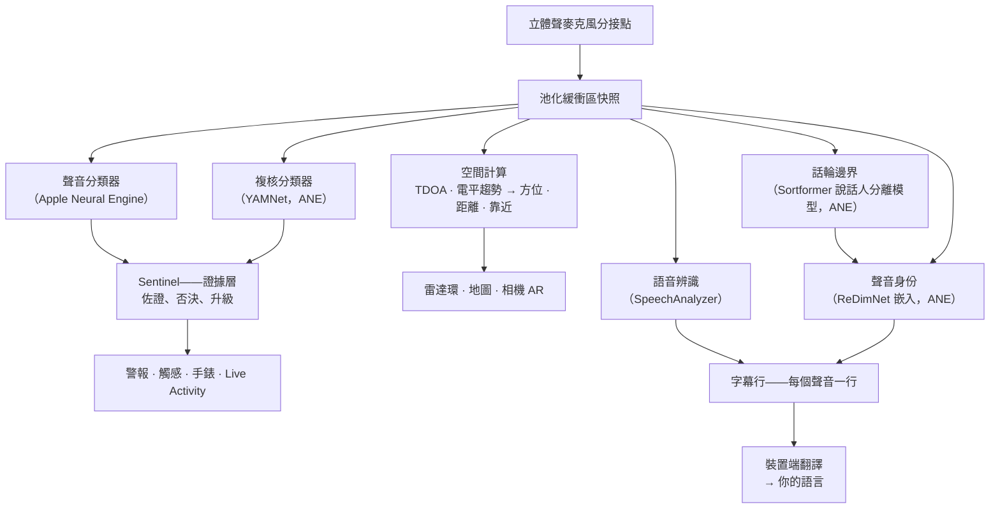

# Vigilant Ear 👂🛡️

*自 1.1.9 版起生效 · 2026 年 9 月。*

## 為聽不見的人打造的聲學雷達。

這是一款專為聾人、重聽者和 CODA 群體打造的應用。大多數聲音識別應用只會告訴你一個聲音*是什麼*，而 **Vigilant Ear 會告訴你它在哪裡、是誰發出的，以及他們在說什麼**——把 iPhone 變成一臺實時的聲波「三錄儀」，為你描述周圍的聲音。

警笛的方向和距離。身後的一聲敲門。一場對話中的每個人，都以各自獨立的轉寫聲音呈現——每一個都配有字幕，並標出方位。如果有人說的是你看不懂的語言，他們的話可以**譯成你的語言**送到你眼前。警報會送達你的**鎖定螢幕、Dynamic Island 和 Apple Watch**，瞥一眼就夠了。

凡是要緊的，都在裝置上執行。音訊不會為了識別而被錄製或上傳。任何功能都不依賴聽力。

- 🧭 **不只是檢測，還有方向。** *是什麼、在哪裡、是誰*，以及*說了什麼*——而不只是「有個聲音響了」。
- 📣 **叫到名字。** 列出你的名字，或孩子、伴侶的名字——一句「Marie 的餐好了」就會輕點你的手錶，並指明聲音來自哪個方向。
- 🔒 **從設計上保護隱私。** 分類、字幕生成和翻譯都在你的 iPhone 上執行。字幕實時呈現、轉瞬即逝，不會被儲存為轉寫存檔。
- ⌚ **在你的手腕上，也在鎖定螢幕上。** Apple Watch 方向配套應用 + Live Activity，讓最近一次警報及其來向始終一眼可見。
- 🛰️ **多部手機，共用一隻耳朵。** Constellation 將支援超寬頻的 iPhone 互相連線，把每一部聽到的聲音融合成更清晰的方向圖景。
- 👁️ **為聾人 / 重聽者 / CODA 而做。** 易於區分的觸感、高對比度的視覺效果、不依賴顏色的提示、大尺寸的點按目標，並處處遵從「減弱動態效果」設定。

---

## 適合誰使用

- 希望對周圍聲音保持態勢感知的**聾人、重聽者和 CODA 使用者**——Home Watch（敲門、警報聲、嬰兒、電話）和 Street Watch（警笛、聲源靠近）可以一直開著，放心信賴。
- 任何需要**帶方向和說話人區分的實時字幕**，或需要把身邊坐著的人說的話做**裝置端翻譯**的人。
- 對裝置端聲源定位感興趣的無障礙與聲學研究使用者。

> Vigilant Ear 是一款無障礙**輔助工具**，而不是經過認證的生命安全裝置。

---

## 它能做什麼

### 🧭 它能看見聲音——方向與距離
Vigilant Ear 利用 iPhone 的兩個麥克風，測量**聲音的角度，以及它在你的前方還是後方**，把這一讀數穩定在約一度以內，並以實時標記的形式顯示在航向朝上的雷達環和地圖上。位於同一條直線上的兩個麥克風，單憑自身無法分辨左右——來自你右側 50° 的聲音和來自你左側 50° 的聲音，到達時的微小時間差完全相同——所以應用會畫出讀數，同時在**另一側畫出一個更淡的虛影**；轉一下手腕或加上第二部手機，就能確定是哪一側。距離根據響度、對照一條在街道上校準過的曲線來估算，並如實顯示為估計值，例如 *≈ 50 ft*，外加一個可能的範圍——使用你所在國家的計量單位，而不是你閱讀應用所用語言對應的單位。你移動時，標記會停留在它們在現實世界中的位置上。這就是核心：對一個你聽不見的世界的空間感知。（具體數字見下文。）

### 🚨 它能識別重要的聲音——並向你發出警報
裝置端分類器能識別數百種日常聲音，並重點監聽關鍵類別——**警笛、警報聲（包括專門的汽車警報類別）、門鈴/敲門聲、嬰兒哭聲、附近有人，以及惡劣天氣**。一旦觸發，你會收到清晰的螢幕警報、可選的**推送通知**和一種獨特的**觸感**——即使應用在背景執行或手機處於休眠狀態也不例外。關鍵類別預設即已就緒，因此開啟通知後並不會出現「全部關閉」的情況。把所有警報類別都關掉後，引擎在背景會完全休眠，以節省電量。一個 **Sentinel** 層會用獨立證據——方向、運動和公共資料來源——對警報進行交叉核對，因此觸發的警報都經過佐證，而不是單個分類器的孤立猜測。這種核對是雙向的：歌曲中一個形似警笛的片刻會被暫緩，但一聲在你的音樂中反覆響起的真實警笛會突破攔截，發出警報。

惡劣天氣預警來自**涵蓋 88 個國家和地區的 53 個官方政府來源**——所有使用者均可免費使用。紐西蘭的民防緊急警報也包含在內，並有獨立的「**緊急警報**」開關。應用只會選用覆蓋你所在位置的資料來源。在日本，應用還會讀取 國家氣象機構的**預先通報**——即在臺風或暴雨來臨前數天釋出的通俗易懂的說明，而不僅僅是危險已經到來時才釋出的警報——以及突發強降雨和山體滑坡通報。預先通知會安靜地顯示，不會使用專為真正警報保留的聲音和振動。

### ⌚ Apple Watch + Live Activity——一瞥便知
- **Apple Watch 配套應用**——警報的方向會在你的手腕上指出來，瞥一眼就知道該往哪裡看。重新設計的手錶介面採用應用的耳朵圖示和威脅 HUD 佈局，並支援雙擊關閉警報。即使手錶上的應用沒有開啟，警報仍可顯示方向箭頭。
- **Live Activity**——Vigilant Ear 會停留在你的**鎖定螢幕**上、在 **Dynamic Island** 中，以及在**手錶的智慧疊放**裡，讓最近一次警報及其方位始終一眼可見。
- **夥伴警報直達手腕**——當已連結的 Constellation 夥伴的手機發出警報時，警報也能送達你的手錶，並附帶方向。一輪可靠性最佳化讓配套應用全天只消耗很少的手錶電量。

### 💬 Speaker Mode——實時、帶方向的字幕 *（免費）*
開啟 **Speaker Mode** 後，Vigilant Ear 會把你身邊的人說的話轉寫成**字幕塊，每個聲音一塊**。裝置端的說話人分離讓不同的聲音保持分明——*誰*在說*什麼*——並在內環上給出方向提示。正在說話的人會高亮顯示；需要騰出空間時，較早的文字會滾動移走。

有兩件事是大多數字幕應用不會做的：一是**如實標註置信度**——每行一個不顯眼的質量標記，加上可疑詞語下方的點狀下劃線，告訴你哪一行可以相信、哪一行需要再核對；二是**自我修正**：一句話剛剛定稿，應用就會結合完整的上下文重新讀取音訊，並能在兩秒左右補回漏聽或聽錯的詞，隨後文字便定格不變。

**叫到名字**（位於偏好設定中，在你開啟之前一直關閉）會在這些字幕裡留意你列出的名字——你自己的、孩子的、伴侶的。當有人說「Marie 的餐好了」時，你會收到一次獨特的觸感和一條帶方向的手錶警報，而不是又多一個字幕氣泡。這些話仍會作為語音出現在 Speaker Mode 中；這一下輕點是在告訴你，他們是在*對你*說話。

**可以遮蔽髒話**（偏好設定 → 字幕）。如果不遮蔽，髒話會以純文字原樣出現，沒有任何緩衝，讀的人也來不及先移開視線；開啟此項後，這些詞會被替換為符號，句子少了這個詞依然讀得通。什麼算髒話，由你裝置自帶的語音辨識器決定——而不是我們的詞表——因此它會跟隨正在轉寫的語言。在宣告為未滿 18 歲的賬戶上，此項始終開啟，並顯示一把鎖。它作用於*這臺*裝置轉寫的語音；從配對手機轉發來的文字是在那部手機上轉寫的，到達時已是成品文字。

**說話人加重語氣的那個詞會以粗體標出**。說出口時，「I didn't say THAT」和「I didn't say that」是兩句不同的話，而一模一樣的轉寫會把這種差別完全抹掉。應用會留意說話人的聲音在音高上抬起的那一個詞，並將其設為粗體——每行最多一個，沒有把握時一個都不標，因為標錯了詞，就等於把話硬塞進別人嘴裡。在中文和日文中此功能關閉，因為在這兩種語言裡，音高告訴你的是*這是哪個詞*，而不是它被強調得有多重。

字幕免費；自動翻譯是可選的 Power Pack+ 功能層。字幕還可以**透過你的藍牙聽力裝置朗讀出來**——免費，在偏好設定中開啟。另有**方向提示音**（同樣免費，位於偏好設定 → 字幕），可在你選定的那隻耳朵里加入一個可選的音訊提示，指明說話人所在的方向——對佩戴助聽器或只有單側聽力的人很有用，也向所有人開放。

### 🌐 自動翻譯——你的語言，實時呈現 *（Power Pack+）*
開啟 Speaker Mode 後，如果附近有人說另一種語言，Vigilant Ear 能夠識別出來，並用**你的語言**呈現他們的字幕，同時在其字幕塊上標明源語言。整條處理鏈——聽 → 分離說話人 → 轉寫 → 翻譯 → 顯示——都在**裝置上**執行；唯一需要聯網的時候，是從 Apple 一次性下載語言包；如果你正在等的恰好是這次下載，應用會明確告訴你，不會讓你對著未翻譯的文字乾等。你無需事先知道或選擇對方的語言。

這是目前已上市產品中最接近**科幻作品裡的萬能翻譯器**的一款——一臺直接就能聽懂的裝置。Vigilant Ear 會自行識別語言，跟上房間裡的每一位說話人，並用你的語言為他們所有人顯示字幕——無需耳機，無需設定，全在你的裝置上完成。

### 🎵 音樂與廣播感知 *（Power Pack+）*
**ShazamKit** 能識別你周圍正在播放的音樂，並跟蹤歌曲的切換。

### 🎛️ Acoustic Scope——像工程師一樣看見聲音
以專業級的實時檢視呈現你周圍的聲音：頻譜、頻譜圖、⅓ 倍頻程 RTA 頻段、音級色度和諧波泛音——**對所有人免費**。其中，**泛音檢視讀得懂音樂**：每個音都會標出音名，旁邊列出它的泛音列；煙霧警報器這類較高的聲音會按其真實音高命名；你還可以設定一個目標音，它會顯示為一條線，供你對照著演唱或調音。它執行時幾乎不發熱——無論看多久，讓頻譜圖一直開著都幾乎沒有開銷。用於採集聲音、訓練你自己的自定義聲音包的工具屬於 Power Pack+。

### 📦 自定義聲音包——教它認識你的世界 *（Power Pack+）*
教 Vigilant Ear 認識對你重要的聲音——從本地的鳥鳴，到你所住樓棟的門鈴聲。附加聲音包疊加在內建檢測之上，因此新聲音絕不會擠掉警笛和警報聲。應用內建了分步指南。

### 🛰️ Constellation——多部 iPhone，共用一隻耳朵 *（Power Pack+）*
只要有兩部或更多支援超寬頻的 iPhone（iPhone 11 以來的大多數機型），**Constellation** 就能將它們配對，讓它們感知彼此的位置，並把每部手機聽到的內容融合成一幅統一的、更精確的聲源方點陣圖景——一個分散式的被動聆聽陣列。字幕同樣會融合：每部手機轉寫自己麥克風聽到的內容，各部手機的文字再相互對齊，由離說話人最近的那部手機貢獻它聽到的內容——只有一部手機捕捉到的詞會被保留，而不會丟失。手機之間**直接相連**——無需路由器，無需共用的 Wi-Fi 網路，也無需網際網路；只需開啟 Wi-Fi 即可，使用的是與 AirDrop 相同的點對點鏈路。僅限具備相應硬體的裝置使用。早於某臺對等裝置連線時間的網格字幕不會重新傳送。

**夥伴訊息**——給已連結夥伴的手機發一條簡短的文字訊息；它會出現在對方的字幕流中，並可在裝置端翻譯成對方的語言後送達。訊息功能會考慮年齡：基於 Apple 的 Declared Age Range，成年人與未成年人之間的文字訊息會保持關閉，除非雙方都特意為對方命了名。警報和字幕從不受此限制——受限的只有人與人之間的文字訊息。

### 🔗 Remote Link——聯絡不在你身邊的人 *（發起需要 Power Pack+）*
它做的是電話通常會做的事，只不過改用影片和文字來完成。你發出一個邀請碼；對方在 Vigilant Ear 內即可加入，**無需擁有 Power Pack+**。與 Constellation 不同，它沒有距離上的要求——你們兩人可以身處任何地方。

**全程不使用任何音訊**。只有影片和文字，所以這條連線的兩端都不依賴聽力——這也讓你可以透過應用與人用手語交流。應用本身並不理解手語；它負責傳送影片，其餘的由你們兩人完成。只要網路條件允許，連線就會在兩部手機之間直接建立；應用會清楚地顯示當前是 **Direct**（直連）還是 **Relayed**（經中繼），讓你始終知道自己的影片是否正經過中繼。

**字幕也會隨之傳送**。每部手機轉寫的內容都會顯示在另一部手機上，必要時會翻譯成閱讀者的語言。你們任何一方都可以暫停連線——影片和字幕一起暫停——之後再恢復，也可以在主螢幕上結束連線。

### 📷 相機 AR——「看見聲音」
開啟標題欄上的相機膠囊，即可把檢測到的聲音按其真實方位釘在實時相機畫面中。標記會按說話人、或按聲音類別和方向聚合，讓畫面保持清晰可讀；聲源安靜下來後，會隨時間逐漸淡出。

### 🗺️ 地圖、道路與路徑預測
聲音方位會投射到地圖上的真實 GPS 座標上。車輛的聲音可以**吸附到附近的街道上**，並預測其行進路徑，這樣一輛駛過的卡車看起來是*沿著道路*移動，而不是穿樓而過。（不妨試試消防車演示。）

### 🪄 Feature Playground——不用耳朵也能驗證
**Feature Playground** 向所有人開放：居家與街頭練習（敲門、警報聲、嬰兒、警笛、天氣）、多手機與對話演示，還有醒目的水印，確保練習絕不會冒充真實事件。關閉面板時，演示會被幹淨地清除（不會留下卡住的 GPS 模擬定位，也不會殘留任何標誌）。

### ♿ 無障礙優先
專為聾人 / 重聽者 / CODA 以及色盲使用者打造：提示**不依賴顏色**，點按目標尺寸 **≥44 pt**，遵從**減弱動態效果**設定，為阿拉伯語讀者提供**從右到左佈局**，警報採用多模態（觸感 + 視覺 + 手錶），另有一個啟動驗證螢幕，用清晰的綠 / 灰 / 紅（以及表示「不允許」的焦橙色）狀態顯示權限情況——其中包括作為警報總開關的通知授權。

---

## 免費功能與 Power Pack+

安全核心功能**永久免費**：

- **Home Watch 與 Street Watch**——本地聲音警報（警報聲、警笛、敲門/門鈴、嬰兒、附近有人），可透過螢幕、觸感以及可選的推送通知送達。
- **實時字幕**——Speaker Mode，在裝置端執行，硬體允許時帶方向，附帶如實的置信度標記、約 2 秒的自我修正、可選的藍牙聽力裝置語音朗讀，以及方向提示音。
- **叫到名字**——你可自行輸入的可選名字（你自己、孩子、伴侶）。一旦匹配，就會在手錶/手機上發出帶方位的警報，而不是再多一條字幕。
- **Standing Watch**——房間自身的狀態，始終開啟，無需任何配置：房間保持慣常規律時，是一盞穩定的青色燈；一旦有變化——出現新的說話聲、突然安靜下來，或有東西正在靠近——就變為琥珀色。
- **惡劣天氣警報**——適用於你所在地區的官方預警，來自 88 個國家和地區的 53 個政府來源。
- **全球地震警報**——附近有地震報告時，你會感到一陣振動，並在地圖上看到有震感的區域。這是來自官方地震資料來源的確認，而不是預警：如果你感到了晃動，它會告訴你那是什麼。裝置端的低沉轟鳴（次聲）感知可以在地面一動的瞬間就啟動核查。
- **Feature Playground**——練習警報和功能預覽，帶有醒目的「預覽」水印。
- **Apple Watch 配套應用與 Live Activity**——一眼即可看到方向和最近一次警報。
- **Acoustic Scope**——專業級的實時聲音視覺化，對所有人免費。（用於採集訓練素材的工具屬於 Power Pack+。）

**Power Pack+** 是一次性解鎖（**不是訂閱**），並提供 **90 天免費試用**。它為你帶來這些超能力：

- **自動翻譯**——在裝置端把附近的語音翻譯成你的語言。
- **Constellation**——透過超寬頻實現多部 iPhone 共享聽覺，並支援夥伴訊息。
- **Music ID**——ShazamKit 歌曲識別。
- **自定義聲音包**——你為自己的聲音訓練的附加分類器。

無論免費版還是 Power Pack+，**你的音訊都留在裝置上進行識別**——版本層級只決定解鎖哪些功能，絕不會改變原始音訊被送往何處分析。

---

## 工作原理（技術內幕）

Vigilant Ear 是一條**本地優先、在裝置端執行**的分層處理管線：只採集一次，然後讓彼此獨立的專項模組讀取同一段聲音，並互相核查。原始音訊在一個高優先順序的音訊分接點上採集，複製到一個**池化緩衝區空閒列表**中（實時路徑上不會出現頻繁分配記憶體造成的抖動），隨後分發出去，不會讓介面卡頓：

沒有哪個模型會被單獨信任。處在檢測與警報之間的，是 **Sentinel** 層：各個獨立引擎逐幀相互佐證或否決——而當反覆出現的真實證據不斷累積、與某次否決相牴觸時（比如一聲真實的警笛穿透你的音樂持續鳴響），證據勝出，警報隨即發出。

字幕也有屬於自己的第二次機會。每一句定稿的句子，都會結合完整上下文，從記憶體中一段短小的環形音訊緩衝裡被悄悄重讀一遍——修正會在約兩秒內完成，之後文字便永久定格：

- **空間計算**——FFT、相干加權的到達時間差（TDOA——優先採用兩個麥克風一致認可的頻段，再把微小的到達時延換算成方位），以及基於電平趨勢的靠近跟蹤，均在背景任務中執行。麥克風對按固定方向讀取，因此無論你豎著還是橫著拿手機，測向效果都一樣。
- **語音**——轉寫使用 iOS 26 的 `SpeechAnalyzer` / `SpeechTranscriber`；裝置端翻譯使用 Apple 的 **Translation** 框架。聲音身份的判定以證據為基礎：只有依據多個相互獨立的聲音視窗，才能確認某個聲音屬於一個真實的人；不確定的匹配會顯示為未歸屬，而不是猜一個錯誤的名字。
- **兩個問題，兩個模型**——區分不同的聲音，既要知道*說話人何時切換*，也要知道*這位說話人是誰*，而這是兩個不同的問題：由 **Sortformer** 流式說話人分離模型標出話輪邊界，再由 **ReDimNet** 嵌入判斷每個話輪裡是誰的聲音。在邊界處切分，比聽上去要重要得多：一個橫跨兩個人的視窗會同時包含這兩個人，事後任何嵌入模型都無法挽回。在這兩者之下，還有一層語音活動檢測兜底——如果說話人分離模型在聲學條件惡劣的房間裡寧可沉默也不亂猜，話輪仍會被切分，因此應用只會效果打折，而不會把兩位說話人混成一個人。
- **音樂真偽**——由一個基於音級色度的**歌曲特徵檢測器**負責「是否真的在放音樂？」這一判定，因為通用分類器出了名地愛把安靜的房間和警笛稱作「音樂」。只有當特徵確認確實有音樂存在時，Shazam 才會執行。
- **併發**——Swift 6 的隔離機制讓麥克風分接點、聲學計算和介面渲染迴圈彼此乾淨地分開。
- **效率**——降取樣、按負載自適應的分類，以及僅在有證據時才聯網的機制，讓持續聆聽足夠輕量，可以一直開著。

天氣和地震警報走的是與音訊相反的路徑——與你的聲音有關的任何內容都不會外傳，但警報*資料*會傳進來。官方資料來源**每一個**都要經過我們運營的一個小型快取，因此公共資料只需抓取一次，就能服務所有使用者——而且你的手機從不聯絡外國政府的伺服器：

---

## 你的手機能聽到什麼——實測結果

你的 iPhone 有兩個相距約六英寸的麥克風、一個氣壓計，以及一個非常精準的時鐘。這足以告訴你一個聲音在哪個方向、大約多遠、是否正朝你而來，以及是不是有扇門剛被開啟。下面介紹每一項有多準確、我們如何驗證，以及當你自己聽不見這個聲音時，它為什麼重要。方向及相關資料於 2026 年 9 月在一部 iPhone 17 和一部 iPhone 16 Pro Max 上測得。距離本質上始終是估計值——我們在螢幕上也會這樣註明。

**方向——精確到一兩度**。聲音到達頂部麥克風的時間，會比到達底部麥克風早一些或晚一些；應用根據這個時間差，算出聲音偏離手機軸線多遠，以及它在前方還是後方。手機的兩個聲道並不是單純的麥克風訊號，而是經過處理的立體聲聲像；每當房間嘈雜，這個聲像就會疊加上它自身的一種固定模式。應用現在會在啟動後幾秒鐘的安靜時間裡學會這一模式，並在讀取方向之前將其去除。

| 我們測量了什麼 | 結果 |
|---|---|
| 96 個模擬房間的中位誤差（從安靜的辦公室到訊雜比 5 dB 的硬牆房間） | 1.0° |
| iPhone 17 放在桌上，開啟房間噪聲，揚聲器偏離軸線 30° | 相對側平面讀數 61.7°，預期為 60°，波動 1.6° |
| 同上，揚聲器正對手機側面 | 讀數 4.5°，預期為 0°，波動 2.2° |
| 同上，揚聲器位於正前方 | 每次讀數都處於最大時延，符合預期 |
| 讀數落在聲像自身的固定模式上，而非落在聲音上 | 任何角度下均未出現 |

*為什麼重要：* 如果你聽不見警笛，一句「在你身後，偏向一側」就能告訴你該往哪裡看。一個穩定的讀數，只有在對照捲尺核實之後才值得信任；這個讀數就經過了這樣的核實，而且是兩次——第二次是在發現第一次核查過於寬鬆之後。

**距離——如實顯示為估計值**。單個麥克風無法測量距離，只能測量響度，而遠處一輛很響的卡車，聽起來可能和近處一輛安靜的汽車差不多。應用使用一條在真實街道上擬合出的曲線，根據響度估算距離，然後像一個謹慎的人那樣表述為 *約 50 ft，可能在 25 到 100 之間*。

| 我們測量了什麼 | 結果 |
|---|---|
| 經該校準回放的真實車輛檢測數 | 1,131 |
| 落在車輛實際所在的那段 100 英尺道路範圍內 | 73% |
| 遠側車道上的車輛 | 估計為 78 ft 和 87 ft，捲尺實測為 73 ft 和 85 ft |

這條道路（一個城市路口）是逐條車道丈量的；曲線出錯時，總是錯向偏近的一側。校準由一項自動化測試鎖定，因此無法悄無聲息地漂移。你自己所在空間內的警報，比如煙霧探測器，完全不顯示距離數字——它們本來就和你在同一個房間裡。

**運動——正朝你而來**。對於汽車和警笛來說，變響通常意味著變近。應用會觀察一個聲音的電平在幾秒內上升得有多快：以每秒約 1.5 dB 的速度持續攀升（響度明顯而穩定地增加）表示正在靠近，同等幅度的下降表示正在遠離；而一個聲音一旦停止變化，約四秒後便不再被判定為靠近或遠離。單獨一次響亮的瞬間——輕按一下喇叭、猛地關一下門——都無法觸發它。這一功能以物理原理和九項自動化測試為基礎；錄製一次街頭車輛駛過的實況，是下一步的實地確認。

**房間裡的空氣——門有自己的特徵**。氣壓計能察覺約十四英尺外的一扇門被開啟：門擺開時氣壓下降，門關上時又回升。在十四個小時的安靜時段和十五次開關門事件中，每一次開關門都呈現出這種兩段式形狀，而屋裡其他任何東西都沒有。

| 事件 | 氣壓變化率 | 形狀 |
|---|---|---|
| 前門，開啟再關上，×10 | 0.6–1.8 Pa/s | 先下降、再回升，相隔約 5 s |
| 前門，用力摔上，×5 | 1.1–2.5 Pa/s | 同樣的一對變化，幅度更大 |
| 夜間空調迴圈執行，×8 | 0.11–0.46 Pa/s | 歷時數分鐘的緩慢變化，兩部手機上完全相同 |
| 安靜的房間 | ~0.02 Pa/s | 無 |
| 從旁走過、打噴嚏 | — | 運動感測器會察覺，手機會忽略它 |

紗門不會讓房間密閉，因此完全檢測不到——這正是應有的結果。目前，氣壓變化可以作為「低沉轟鳴」顯示在地圖上；專門針對安靜夜晚的開門警報已完成測量和設計，但尚未成為日常預設功能。

**Constellation——兩部手機確定左右**。網格中的每部手機都從自己所在的位置向聲音畫一條線，而這些線只會在一側乾淨利落地相交。一旦相交，虛影就會消失，應用又能分辨左右了。在模擬中，兩部**相距 40 米**的手機，能把 50 米外的一個警笛定位到約 2 米以內。

**這裡的任何結論是如何被採信的**。每一個數字都依次透過了同樣的三道關卡：一個預先知道答案的模擬房間；一組小型自動化測試，它們復現恰好能騙過應用的那種情形，並在每次改動時執行；最後是真實桌面上的真實手機，距離靠手工丈量。只有闖過第三關，才算準確。對一個聽不見這個聲音的人來說，應用說的話就是唯一的依據——它理應像實驗室那樣，憑實證贏得信任。

寫給工程師的深入說明：[物理原理](https://vigilantear.com/en/physics/)——TDOA、距離、運動、Constellation 和氣壓檢測，每個數字都標註了 MEASURED（實測）/ BENCHED（基準測試）/ MODELLED（建模）。

---

## 隱私

- **核心處理管線始終在裝置端執行。** 分類、空間計算、轉寫、說話人分離和翻譯都在你的 iPhone 上執行。原始音訊不會為了識別而被錄製或上傳。
- **字幕轉瞬即逝。** 實時字幕只在本次會話期間儲存在記憶體中；匯出的除錯日誌不包含字幕文字。
- **不含廣告或行為分析 SDK。** 網路僅在有限範圍內使用，只用於地圖、公共天氣資料來源、可選的 Shazam 指紋、道路資訊和 App Store 購買——詳見完整的隱私政策。

完整詳情：[隱私政策](/zh-Hant/privacy/) · [服務條款](/zh-Hant/terms/) · [支援](/zh-Hant/support/)

---

## 硬體與平臺

- **iPhone（完整體驗）。** 豎屏、橫屏均可使用——想怎麼拿就怎麼拿。測向需要立體聲麥克風。推薦使用 **iPhone 13 或更新機型**。
- **Apple Watch。** 配套警報附帶方向箭頭；支援 Live Activity / 智慧疊放。
- **iPad（原生）。** 自適應佈局：在大螢幕上，實時字幕會顯示在地圖旁的一個半透明面板中，無人說話時面板會自動收起。單聲道麥克風 → 有字幕，但沒有完整的方向資訊。
- **Constellation** 需要**超寬頻**——iPhone 11 或更新機型，不包括 SE 和「e」系列機型。它**不**需要 Wi-Fi 網路：只要開啟 Wi-Fi，手機就能直接發現彼此，因此只要手機彼此靠近，Constellation 在沒有路由器、沒有網際網路的情況下也能工作。
- **Android。** 獨立版本，包含核心雷達、警報、字幕和天氣功能；Constellation 網格優先支援 iOS。隨著 Android 版功能逐步與 iOS 版看齊，請關注產品網站上的更新。

---

## 本地化

已完整本地化——介面、警報和字幕——支援**英語、西班牙語、葡萄牙語（巴西）、法語、德語、義大利語、土耳其語、阿拉伯語、日語、簡體中文、繁體中文、韓語、俄語、印地語和羅馬尼亞語**（15 種語言）。跟隨系統語言區域設定，也可在應用內手動選擇。羅馬尼亞語字幕可在裝置端執行；Apple Translate 不支援羅馬尼亞語，因此對於該語言，自動翻譯會顯示原文。

---

## 狀態與免責宣告

Vigilant Ear 是一款**實驗性的聲學無障礙輔助工具**，而不是經過認證的生命安全設施。定位解析度會隨周圍環境、天氣、風力和麥克風硬體而變化。請**始終保持你平常對周圍環境的警覺**——不要把它當作唯一的安全資訊來源。

部分功能（相機 AR 標記、獲 Apple 批准後升級的「重要提醒」權限、高階的多聲音包製作）仍在持續演進；免費的 Home Watch / Street Watch 與實時字幕，才是你從第一天起就能信賴的產品。

**來源與授權:** [api.vigilantear.com/sources](https://api.vigilantear.com/sources)

---

**聯絡方式：** [vigilantear@wingdingssocial.com](mailto:vigilantear@wingdingssocial.com)

為聾人與重聽群體以及聲學研究，用 ❤️ 打造。

    
  <strong>© 2026 Wingdings, Inc.</strong> 
  保留所有權利。 
  專利申請中

